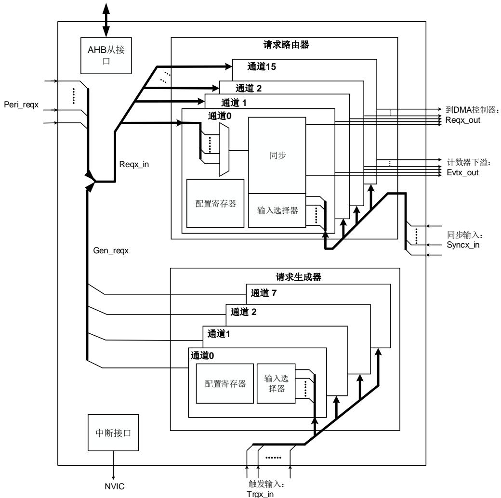
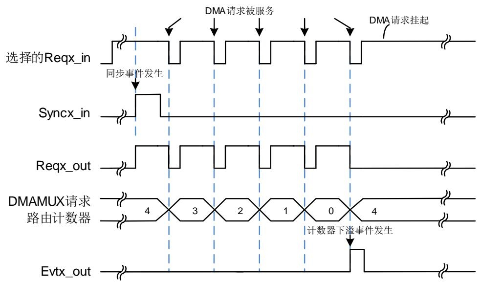
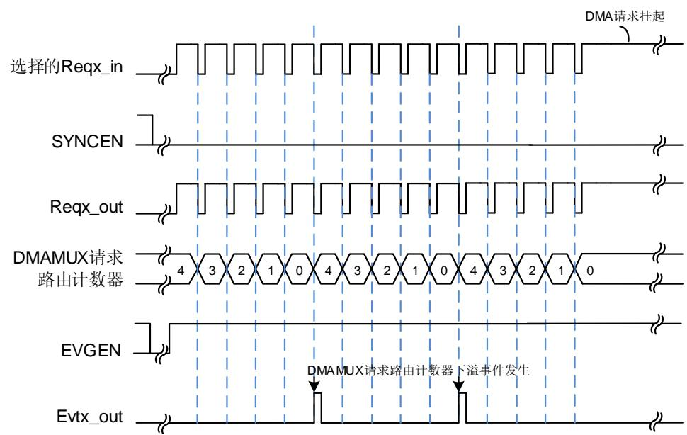

# 18. DMA 请求多路复用器（DMAMUX）

# 18.1. 简介

DMAMUX是 DMA 请求的传输调度器。可编程的 DMA请求多路复用器 DMAMUX，可在外设和 DMA 控制器之间路由 DMA 请求线路，或者 DMAMUX 也可以将可编程事件连入到输入触发信号上，作为一个 DMAMUX 请求发生器，再由 DMAMUX请求路由器在 DMAMUX 请求生成器产生的 DMA请求和 DMA控制器之间路由 DMA 请求线路。每个 DMAMUX 请求路由通道选择一条唯一的 DMA 请求线路，无条件地或同步地从它的 DMAMUX 同步输入事件。DMA请求信号会一直挂起，直到 DMA控制器响应它，并且产生一个 DMA确认信号，此时相应的 DMA请求信号被释放。

# 18.2. 主要特征

16 个可配置的 DMAMUX 请求路由输出通道；

8 个 DMAMUX请求生成通道；

35 路触发输入信号到 DMAMUX请求生成器；

29 路同步输入信号；

每个 DMAMUX 请求生成通道包含一个 DMAMUX 请求触发输入选择器，一个 DMAMUX请求生成计数器，和一个指示被选中的 DMAMUX请求触发输入信号的事件溢出标志；

◼ 每个 DMAMUX请求路由输出通道包含 189 路外设 DMAMUX 请求输入信号，一个同步输入信号选择器，一条 DMA 请求路由输出线路，一个路由事件输出信号用于 DMA 请求级联，一个 DMAMUX 请求路由计数器，和一个指示被选中的同步输入信号的事件溢出标志。

# 18.3. 结构框图

图 18-1. DMAMUX 结构框图

# 18.4. 信号描述

DMAMUX 信号描述如下所示：

Reqx_in：DMAMUX 请求路由输入信号，来自外设的请求或者 DMAMUX 请求生成器生成的请求；

Peri_reqx：从外设输入到 DMAMUX 的 DMA 请求线路；

Gen_reqx：DMAMUX 请求生成器生成输出的 DMA 请求信号；

Reqx_out：DMAMUX 请求输出信号到 DMA 控制器；

Trgx_in：DMAMUX 请求触发输入信号到 DMAMUX 请求生成器；

Syncx_in：DMAMUX 同步输入信号到 DMAMUX 请求路由器；

Evtx_out：DMAMUX 请求路由计数器下溢事件输出信号。

# 18.5. 功能说明

如 18-1. DMAMUX 所示，DMAMUX 包含两个子模块：

DMAMUX 请求路由器

DMAMUX 请求路由器输入（Reqx_in）来自两部分：

一部分来自外设请求（Peri_reqx）；

– 另一部分来自 DMAMUX 请求生成器（Gen_reqx）。

DMAMUX 请求路由输出到 DMA控制器对应的通道（Reqx_out）。

同步输入（Syncx_in）来自内部或外部信号。

DMAMUX 请求生成器

DMAMUX 请求触发输入（Trgx_in）来自内部或外部信号。

# 18.5.1. DMAMUX 请求路由器

DMAMUX 请求路由器可在外设/ DMAMUX 请求生成器，与 DMA 控制器之间路由 DMA 请求线路。DMAMUX 请求路由器由 DMAMUX 请求路由通道组成。DMA 请求输入信号并联至所有的 DMAMUX 请求路由通道。每个 DMAMUX 请求路由通道都有一个同步单元。同步输入信号并联至所有 DMAMUX 请求路由通道的同步单元。每个 DMAMUX 请求路由通道都有一个内部的 DMAMUX 请求路由计数器。

# DMAMUX 请求路由通道

DMAMUX 请求路由通道 x 的请求路由输入由 DMAMUX_RM_CHxCFG 寄存器的 MUXID[7:0]位域来配置，请求路由输入可选为外设 DMA请求，或者 DMAMUX 请求生成器产生的 DMA请求，参考 18-2. DMAMUX 。一个 DMAMUX 请求路由通道只能与一个 DMA 控制器通道相连接。

注意：当 MUXID[7:0]值为 0 时，没有 DMA 请求线路被映射到 DMAMUX 请求路由通道上。DMAMUX 不允许将同一个 DMA 请求线路（相同 MUXID[7:0]且非空）映射到两个不同的DMAMUX 请求路由通道上。

# 当同步模式禁能时

每当连到 DMAMUX 的 DMA 请求被 DMA 控制器服务，这个 DMA 请求将取消挂起，内部的DMAMUX 请 求路 由 计 数 器 将 减 1。 当 DMAMUX 请 求路 由 计 数 器发 生下 溢时，DMAMUX_RM_CHxCFG 寄存器的 NBR[4:0]值将自动重装载到计数器中。如果将 EVGEN 位置位，使能通道事件输出，则通道事件输出前，DMA 请求数量为 NBR[4:0] + 1。

注意：只有当 DMAMUX 请求路由通道 x 的同步使能位 SYNCEN 位和通道事件输出使能位EVGEN 位都为 0 时，才能配置其 NBR[4:0]位域。

# 当同步模式使能时

如果 DMAMUX 请求路由通道 x 工作在同步模式下，当检测到选择的同步输入信号的上升沿或者下降沿时，挂起的DMA请求将被连到DMAMUX请求路由通道x的输出。每当连到DMAMUX的 DMA 请求被 DMA控制器服务，这个 DMA 请求将取消挂起，内部的 DMAMUX 请求路由计数器将减 1。当 DMAMUX 请求路由计数器发生下溢时，DMA 请求线路将断开与 DMAMUX 请求路由通道 x 的输出的连接，并且 DMAMUX_RM_CHxCFG 寄存器的 NBR[4:0]值将自动重装载到计数器中。一个同步事件可传输 NBR[4:0] + 1 个 DMA请求到 DMAMUX请求路由通道 x的输出上。

18-2. 为当 NBR[4:0]=4，SYNCEN=1，EVGEN=1，SYNCP[1:0]=0b01 时的举例。

图 18-2. 同步模式

置位 DMAMUX_RM_CHxCFG 寄存器的 SYNCEN 位可使能 DMAMUX 请求路由通道 x 的同步模式。同步输入信号可由 DMAMUX_RM_CHxCFG 寄存器的 SYNCID[4:0]位域来配置，参考 18-4. 。同步输入信号的有效边沿由 DMAMUX_RM_CHxCFG 寄存器的 SYNCP[1:0]位域来配置。

注意：如果同步输入事件发生时，DMAMUX 输入上没有挂起的 DMA 请求，则这个同步输入事件将被忽略，之后如有 DMA 请求被挂起，它将不会被连接到 DMAMUX 请求路由通道 x 的输出，直到发生下一个同步输入事件。

# 通道事件输出

每个 DMAMUX 请求路由通道都有一个通道事件输出信号 Evtx_out，用于 DMAMUX 请求路由计数器的下溢事件输出。Evt0_out ~ Evt3_out 信号可用于 DMA 请求级联。如果通过置位DMAMUX_RM_CHxCFG 寄存器的 EVGEN 位来使能 DMAMUX 请求路由通道 x 的通道事件输出，当 DMAMUX 请求路由计数器自动重装载为 NBR[4:0]值时，发生一个通道事件，输出为一个 AHB时钟周期脉冲。

18-3. 为当 NBR[4:0]=4，SYNCEN=0，EVGEN=1 时的举例。

图 18-3. 通道事件输出

注意：如果 EVGEN = 1 且 NBR[4:0] = 0，则每次 DMA 请求被服务时都会输出一个通道事件。

# 同步溢出

如果在 DMAMUX 请求路由计数器下溢之前又发生了新的同步事件，则 DMAMUX_RM_INTF寄存器的同步溢出标志位 SOIFx 位将置位。

注意：建议在 DMA 控制器对应通道请求被取消时，配置 DMAMUX_RM_CHxCFG 寄存器的SYNCEN 位为 0 来禁能 DMAMUX 请求路由通道 x 的同步模式。否则，当又发生一个新的同步事件时，由于接收不到 DMA的响应信号将会发生同步溢出事件。

# 18.5.2. DMAMUX 请求生成器

DMAMUX 请求生成器在触发输入事件发生时会产生 DMA 请求。DMAMUX 请求生成器由DMAMUX 请求生成通道组成。DMA 请求触发输入信号并联至所有 DMAMUX 请求生成通道。每个 DMAMUX 请求生成通道都有一个内部的 DMAMUX 请求生成计数器。

触发输入信号的有效边沿由 DMAMUX_RG_CHxCFG 寄存器的 RGTP[1:0]位域来配置。DMAMUX 请求生成通道 x 的触发输入信号由 DMAMUX_RG_CHxCFG 寄存器的 TID[5:0]位域来配置，参考 18-3. 。置位 DMAMUX_RG_CHxCFG 寄存器的 RGEN位来使能 DMAMUX 请求生成通道 x。

# DMAMUX 请求生成通道

当发生触发输入事件时，对应的 DMAMUX 请求生成通道 x 开始产生 DMA 请求到通道的输出上，通道输出连到 DMAMUX 请求路由器的输入上。每当 DMAMUX 生成的 DMA 请求被 DMA控制器服务，这个 DMA 请求将取消挂起，内部的 DMAMUX 请求生成计数器将减 1。当DMAMUX 请求生成计数器发生下溢时，DMAMUX请求生成通道将停止产生 DMA 请求，在下一 个 触 发 输 入 事 件 发 生 时 ， DMAMUX 请 求 生 成 计 数 器 将 自 动 重 装 载 为DMAMUX_RG_CHxCFG 寄存器的 NBRG[4:0]位域值。

注意：触发输入事件后产生的 DMA 请求数量为 NBRG[4:0] + 1。只有当 DMAMUX 请求生成通道 x 的 RGEN 位为 0 时才可以配置 NBRG[4:0]位域。

# 触发溢出

如果 RGEN 位为 1，DMAMUX 请求生成通道 x 被使能，当一个新的触发输入信号发生了，而此时 DMAMUX 请求生成计数器还未发生下溢，则 DMAMUX_RG_INTF 寄存器的 TOIFx 位将硬件置位以指示发生了触发溢出事件。

注意：建议在 DMA 控制器对应通道请求被取消时，配置 DMAMUX_RG_CHxCFG 寄存器的RGEN 位为 0 来禁能 DMAMUX 请求生成通道 x。否则，当又发生一个新的触发输入事件时，由于接收不到 DMA的响应信号将会发生触发溢出事件。

# 18.5.3. 通道配置

根据以下步骤来配置 DMAMUX的通道 y 和对应的 DMA通道 x：

1. 完整配置 DMA 通道 x 相关参数，除了 DMA通道 x 的使能；

2. 完整配置 DMAMUX 通道 y 相关参数；

3. 设置 DMA_CHxCTL 寄存器的 CHEN 位 1 来使能 DMA 通道 x。

# 18.5.4. 中断

DMAMUX模块有两种类型的中断事件，包括DMAMUX请求路由通道的同步溢出事件，和DMAMUX请求生成通道的触发溢出事件。

每个中断事件都有一个专用的标志位，专用的清除位和专用的使能位。 18-1. 描述了其对应关系。

表 18-1. 中断事件

<table><tr><td>中断事件</td><td>标志位</td><td>清除位</td><td>使能位</td></tr><tr><td>DMAMUX 请求路由通道 x 上的同步溢出事件</td><td>DMAMUX_RM_INTF 寄存器的 SOIFx位</td><td>DMAMUX_RM_INTC 寄存器的 SOIFCx位</td><td>DMAMUX_RM_CHxCFG 寄存器的SOIE 位</td></tr><tr><td>DMAMUX 请求生成通道 y 上的触发溢出事件</td><td>DMAMUX_RG_INTF 寄存器的 TOIFy位</td><td>DMAMUX_RG_INTC 寄存器的 TOIFCy位</td><td>DMAMUX_RG_CHxCFG 寄存器的TOIE 位</td></tr></table>

# 触发溢出中断

当 DMAMUX 请求生成触发溢出标志位 TOIFx 置位，并且触发溢出中断使能位 TOIE 位置位，则会产生一个触发溢出中断。写 1 到 DMAMUX_RG_INTC 寄存器的对应触发溢出清除位TOIFCx 将会清除触发溢出标志位 TOIFx。

# 同步溢出中断

当 DMAMUX 请求路由同步溢出标志位 SOIFx 置位，并且触发同步溢出中断使能位 SOIE 位置位，则会产生一个同步溢出中断。写 1 到 DMAMUX_RM_INTC 寄存器的对应同步溢出清除位 SOIFCx 将会清除同步溢出标志位 SOIFx。

# 18.5.5. DMAMUX 映射

DMAMUX 与 DMA0 和 DMA1 配合使用。DMAMUX 的通道 0 到 7 与 DMA0 的通道 0 到 7 相连，DMAMUX 的通道 8 到 15 与 DMA1 的通道 0 到 7 相连。

# DMAMUX 请求路由输入映射

DMAMUX 请求路由输入可来自于外设或者 DMAMUX 请求生成器，参考 18-2. DMAMUX，由 DMAMUX_RM_CHxCFG 寄存器的 MUXID[7:0]位域配置 DMAMUX请求路由通道 x 的输入。

表 18-2. DMAMUX 请求路由输入信号映射

<table><tr><td>请求路由通道输入标识MUXID[7:0]</td><td>来源</td></tr><tr><td>1</td><td>Gen_req0</td></tr><tr><td>2</td><td>Gen_req1</td></tr><tr><td>3</td><td>Gen_req2</td></tr><tr><td>4</td><td>Gen_req3</td></tr><tr><td>5</td><td>Gen_req4</td></tr><tr><td>6</td><td>Gen_req5</td></tr><tr><td>7</td><td>Gen_req6</td></tr><tr><td>8</td><td>Gen_req7</td></tr><tr><td>9</td><td>ADC0</td></tr><tr><td>10</td><td>ADC1</td></tr><tr><td>11</td><td>TIMER0_CH0</td></tr><tr><td>12</td><td>TIMER0_CH1</td></tr><tr><td>13</td><td>TIMER0_CH2</td></tr><tr><td>14</td><td>TIMER0_CH3</td></tr><tr><td>15</td><td>TIMER0_MCH0</td></tr><tr><td>16</td><td>TIMER0_MCH1</td></tr><tr><td>17</td><td>TIMER0_MCH2</td></tr><tr><td>18</td><td>TIMER0_MCH3</td></tr><tr><td>19</td><td>TIMER0_UP</td></tr><tr><td>20</td><td>TIMER0_TRG</td></tr><tr><td>21</td><td>TIMER0_CMT</td></tr><tr><td>22</td><td>TIMER1_CH0</td></tr><tr><td>23</td><td>TIMER1_CH1</td></tr><tr><td>24</td><td>TIMER1_CH2</td></tr><tr><td>25</td><td>TIMER1_CH3</td></tr><tr><td>26</td><td>TIMER1_UP</td></tr><tr><td>27</td><td>TIMER1_TRG</td></tr><tr><td>28</td><td>保留</td></tr><tr><td>29</td><td>TIMER2_CH0</td></tr><tr><td>30</td><td>TIMER2_CH1</td></tr><tr><td>31</td><td>TIMER2_CH2</td></tr><tr><td>32</td><td>TIMER2_CH3</td></tr><tr><td>33</td><td>TIMER2_UP</td></tr><tr><td>34</td><td>保留</td></tr><tr><td>35</td><td>TIMER2_TRG</td></tr><tr><td>36</td><td>TIMER3_CH0</td></tr><tr><td>37</td><td>TIMER3_CH1</td></tr><tr><td>38</td><td>TIMER3_CH2</td></tr><tr><td>39</td><td>TIMER3_CH3</td></tr><tr><td>40</td><td>保留</td></tr><tr><td>41</td><td>TIMER3_TRG</td></tr><tr><td>42</td><td>TIMER3_UP</td></tr><tr><td>43</td><td>I2C0_RX</td></tr><tr><td>44</td><td>I2C0_TX</td></tr><tr><td>45</td><td>I2C1_RX</td></tr><tr><td>46</td><td>I2C1_TX</td></tr><tr><td>47</td><td>SPI0_RX</td></tr><tr><td>48</td><td>SPI0_TX</td></tr><tr><td>49</td><td>SPI1_RX</td></tr><tr><td>50</td><td>SPI1_TX</td></tr><tr><td>51</td><td>USART0_RX</td></tr><tr><td>52</td><td>USART0_TX</td></tr><tr><td>53</td><td>USART1_RX</td></tr><tr><td>54</td><td>USART1_TX</td></tr><tr><td>55</td><td>USART2_RX</td></tr><tr><td>56</td><td>USART2_TX</td></tr><tr><td>57</td><td>TIMER7_CH0</td></tr><tr><td>58</td><td>TIMER7_CH1</td></tr><tr><td>59</td><td>TIMER7_CH2</td></tr><tr><td>60</td><td>TIMER7_CH3</td></tr><tr><td>61</td><td>TIMER7_MCH0</td></tr><tr><td>62</td><td>TIMER7_MCH1</td></tr><tr><td>63</td><td>TIMER7_MCH2</td></tr><tr><td>64</td><td>TIMER7_MCH3</td></tr><tr><td>65</td><td>TIMER7_UP</td></tr><tr><td>66</td><td>TIMER7_TRG</td></tr><tr><td>67</td><td>TIMER7_CMT</td></tr><tr><td>68</td><td>TIMER4_CH0</td></tr><tr><td>69</td><td>TIMER4_CH1</td></tr><tr><td>70</td><td>TIMER4_CH2</td></tr><tr><td>71</td><td>TIMER4_CH3</td></tr><tr><td>72</td><td>TIMER4_UP</td></tr><tr><td>73</td><td>保留</td></tr><tr><td>74</td><td>TIMER4_TRG</td></tr><tr><td>75</td><td>SPI2_RX</td></tr><tr><td>76</td><td>SPI2_TX</td></tr><tr><td>77</td><td>UART3_RX</td></tr><tr><td>78</td><td>UART3_TX</td></tr><tr><td>79</td><td>UART4_RX</td></tr><tr><td>80</td><td>UART4_TX</td></tr><tr><td>81</td><td>DAC_CH0</td></tr><tr><td>82</td><td>DAC_CH1</td></tr><tr><td>83</td><td>TIMER5_UP</td></tr><tr><td>84</td><td>TIMER6_UP</td></tr><tr><td>85</td><td>USART5_RX</td></tr><tr><td>86</td><td>USART5_TX</td></tr><tr><td>87</td><td>I2C2_RX</td></tr><tr><td>88</td><td>I2C2_TX</td></tr><tr><td>89</td><td>DCI</td></tr><tr><td>90</td><td>CAU_IN</td></tr><tr><td>91</td><td>CAU_OUT</td></tr><tr><td>92</td><td>HAU_IN</td></tr><tr><td>93</td><td>UART6_RX</td></tr><tr><td>94</td><td>UART6_TX</td></tr><tr><td>95</td><td>UART7_RX</td></tr><tr><td>96</td><td>UART7_TX</td></tr><tr><td>97</td><td>SPI3_RX</td></tr><tr><td>98</td><td>SPI3_TX</td></tr><tr><td>99</td><td>SPI4_RX</td></tr><tr><td>100</td><td>SPI4_TX</td></tr><tr><td>101</td><td>SAIO_B0</td></tr><tr><td>102</td><td>SAIO_B1</td></tr><tr><td>103</td><td>RSPDIF_DATA</td></tr><tr><td>104</td><td>RSPDIF_CS</td></tr><tr><td>105</td><td>HPDF_FLT0</td></tr><tr><td>106</td><td>HPDF_FLT1</td></tr><tr><td>107</td><td>HPDF_FLT2</td></tr><tr><td>108</td><td>HPDF_FLT3</td></tr><tr><td>109</td><td>TIMER14_CH0</td></tr><tr><td>110</td><td>TIMER14_CH1</td></tr><tr><td>111</td><td>TIMER14_MCH0</td></tr><tr><td>112</td><td>TIMER14_UP</td></tr><tr><td>113</td><td>TIMER14_TRG</td></tr><tr><td>114</td><td>TIMER14_CMT</td></tr><tr><td>115</td><td>TIMER15_CH0</td></tr><tr><td>116</td><td>TIMER15_MCH0</td></tr><tr><td>117</td><td>保留</td></tr><tr><td>118</td><td>TIMER15_UP</td></tr><tr><td>119</td><td>TIMER16_CH0</td></tr><tr><td>120</td><td>TIMER16_MCH0</td></tr><tr><td>121</td><td>保留</td></tr><tr><td>122</td><td>TIMER16_UP</td></tr><tr><td>123</td><td>ADC2</td></tr><tr><td>124</td><td>FAC_READ</td></tr><tr><td>125</td><td>FAC_WRITE</td></tr><tr><td>126</td><td>TMU_READ</td></tr><tr><td>127</td><td>TMU_WRITE</td></tr><tr><td>128</td><td>TIMER22_CH0</td></tr><tr><td>129</td><td>TIMER22_CH1</td></tr><tr><td>130</td><td>TIMER22_CH2</td></tr><tr><td>131</td><td>TIMER22_CH3</td></tr><tr><td>132</td><td>TIMER22_UP</td></tr><tr><td>133</td><td>保留</td></tr><tr><td>134</td><td>TIMER22_TRG</td></tr><tr><td>135</td><td>TIMER23_CH0</td></tr><tr><td>136</td><td>TIMER23_CH1</td></tr><tr><td>137</td><td>TIMER23_CH2</td></tr><tr><td>138</td><td>TIMER23_CH3</td></tr><tr><td>139</td><td>TIMER23_UP</td></tr><tr><td>140</td><td>保留</td></tr><tr><td>141</td><td>TIMER23_TRG</td></tr><tr><td>142</td><td>TIMER30_CH0</td></tr><tr><td>143</td><td>TIMER30_CH1</td></tr><tr><td>144</td><td>TIMER30_CH2</td></tr><tr><td>145</td><td>TIMER30_CH3</td></tr><tr><td>146</td><td>TIMER30_UP</td></tr><tr><td>147</td><td>保留</td></tr><tr><td>148</td><td>TIMER30_TRG</td></tr><tr><td>149</td><td>TIMER31_CH0</td></tr><tr><td>150</td><td>TIMER31_CH1</td></tr><tr><td>151</td><td>TIMER31_CH2</td></tr><tr><td>152</td><td>TIMER31_CH3</td></tr><tr><td>153</td><td>保留</td></tr><tr><td>154</td><td>TIMER31_UP</td></tr><tr><td>155</td><td>TIMER31_TRG</td></tr><tr><td>156</td><td>TIMER40_CH0</td></tr><tr><td>157</td><td>TIMER40_MCH0</td></tr><tr><td>158</td><td>TIMER40_CMT</td></tr><tr><td>159</td><td>TIMER40_UP</td></tr><tr><td>160</td><td>TIMER41_CH0</td></tr><tr><td>161</td><td>TIMER41_MCH0</td></tr><tr><td>162</td><td>TIMER41_CMT</td></tr><tr><td>163</td><td>TIMER41_UP</td></tr><tr><td>164</td><td>TIMER42_CH0</td></tr><tr><td>165</td><td>TIMER42_MCH0</td></tr><tr><td>166</td><td>TIMER42_CMT</td></tr><tr><td>167</td><td>TIMER42_UP</td></tr><tr><td>168</td><td>TIMER43_CH0</td></tr><tr><td>169</td><td>TIMER43_MCH0</td></tr><tr><td>170</td><td>TIMER43_CMT</td></tr><tr><td>171</td><td>TIMER43_UP</td></tr><tr><td>172</td><td>TIMER44_CH0</td></tr><tr><td>173</td><td>TIMER44_MCH0</td></tr><tr><td>174</td><td>TIMER44_CMT</td></tr><tr><td>175</td><td>TIMER44_UP</td></tr><tr><td>176</td><td>TIMER50_UP</td></tr><tr><td>177</td><td>TIMER51_UP</td></tr><tr><td>178</td><td>SAI1_B0</td></tr><tr><td>179</td><td>SAI1_B1</td></tr><tr><td>180</td><td>SAI2_B0</td></tr><tr><td>181</td><td>SAI2_B1</td></tr><tr><td>182</td><td>SPI5_RX</td></tr><tr><td>183</td><td>SPI5_TX</td></tr><tr><td>184</td><td>I2C3_RX</td></tr><tr><td>185</td><td>I2C3_TX</td></tr><tr><td>186</td><td>CAN0</td></tr><tr><td>187</td><td>CAN1</td></tr><tr><td>188</td><td>CAN2</td></tr><tr><td>189</td><td>TIMER40_CH1</td></tr><tr><td>190</td><td>TIMER40_TRG</td></tr><tr><td>191</td><td>TIMER41_CH1</td></tr><tr><td>192</td><td>TIMER41_TRG</td></tr><tr><td>193</td><td>TIMER42_CH1</td></tr><tr><td>194</td><td>TIMER42_TRG</td></tr><tr><td>195</td><td>TIMER43_CH1</td></tr><tr><td>196</td><td>TIMER43_TRG</td></tr><tr><td>197</td><td>TIMER44_CH1</td></tr><tr><td>198</td><td>TIMER44_TRG</td></tr></table>

# 触发输入映射

DMAMUX 请求生成通道 x 的触发输入可由 DMAMUX_RG_CHxCFG 寄存器的 TID[5:0]位域来配置，参考 18-3. 。

表 18-3. 触发输入信号映射

<table><tr><td>触发输入标识TID[5:0]</td><td>来源</td></tr><tr><td>0</td><td>Evt0_out</td></tr><tr><td>1</td><td>Evt1_out</td></tr><tr><td>2</td><td>Evt2_out</td></tr><tr><td>3</td><td>Evt3_out</td></tr><tr><td>4</td><td>Evt4_out</td></tr><tr><td>5</td><td>Evt5_out</td></tr><tr><td>6</td><td>Evt6_out</td></tr><tr><td>7</td><td>EXTI_0</td></tr><tr><td>8</td><td>EXTI_1</td></tr><tr><td>9</td><td>EXTI_2</td></tr><tr><td>10</td><td>EXTI_3</td></tr><tr><td>11</td><td>EXTI_4</td></tr><tr><td>12</td><td>EXTI_5</td></tr><tr><td>13</td><td>EXTI_6</td></tr><tr><td>14</td><td>EXTI_7</td></tr><tr><td>15</td><td>EXTI_8</td></tr><tr><td>16</td><td>EXTI_9</td></tr><tr><td>17</td><td>EXTI_10</td></tr><tr><td>18</td><td>EXTI_11</td></tr><tr><td>19</td><td>EXTI_12</td></tr><tr><td>20</td><td>EXTI_13</td></tr><tr><td>21</td><td>EXTI_14</td></tr><tr><td>22</td><td>EXTI_15</td></tr><tr><td>23</td><td>RTC_WAKEUP</td></tr><tr><td>24</td><td>CMP0_OUTPUT</td></tr><tr><td>25</td><td>CMP1_OUTPUT</td></tr><tr><td>26</td><td>I2C0_WAKEUP</td></tr><tr><td>27</td><td>I2C1_WAKEUP</td></tr><tr><td>28</td><td>I2C2_WAKEUP</td></tr><tr><td>29</td><td>I2C3_WAKEUP</td></tr><tr><td>30</td><td>I2C0_INT_EVENT</td></tr><tr><td>31</td><td>I2C1_INT_EVENT</td></tr><tr><td>32</td><td>I2C2_INT_EVENT</td></tr><tr><td>33</td><td>I2C3_INT_EVENT</td></tr><tr><td>34</td><td>ADC2_INT</td></tr></table>

注意：EXTI_x(x=0…15)仅 EXTI 中断事件发生时会产生 DMA 请求。

# 同步输入映射

同步输入由 DMAMUX_RM_CHxCFG 寄存器的 SYNCID[4:0]位域来配置，参考 18-4.输入信号映射。

表 18-4. 同步输入信号映射

<table><tr><td>同步输入标识SYNCID[4:0]</td><td>来源</td></tr><tr><td>0</td><td>Evt0_out</td></tr><tr><td>1</td><td>Evt1_out</td></tr><tr><td>2</td><td>Evt2_out</td></tr><tr><td>3</td><td>Evt3_out</td></tr><tr><td>4</td><td>Evt4_out</td></tr><tr><td>5</td><td>Evt5_out</td></tr><tr><td>6</td><td>Evt6_out</td></tr><tr><td>7</td><td>EXTI_0</td></tr><tr><td>8</td><td>EXTI_1</td></tr><tr><td>9</td><td>EXTI_2</td></tr><tr><td>10</td><td>EXTI_3</td></tr><tr><td>11</td><td>EXTI_4</td></tr><tr><td>12</td><td>EXTI_5</td></tr><tr><td>13</td><td>EXTI_6</td></tr><tr><td>14</td><td>EXTI_7</td></tr><tr><td>15</td><td>EXTI_8</td></tr><tr><td>16</td><td>EXTI_9</td></tr><tr><td>17</td><td>EXTI_10</td></tr><tr><td>18</td><td>EXTI_11</td></tr><tr><td>19</td><td>EXTI_12</td></tr><tr><td>20</td><td>EXTI_13</td></tr><tr><td>21</td><td>EXTI_14</td></tr><tr><td>22</td><td>EXTI_15</td></tr><tr><td>23</td><td>RTC_WAKEUP</td></tr><tr><td>24</td><td>CMP0_OUTPUT</td></tr><tr><td>25</td><td>I2C0_WAKEUP</td></tr><tr><td>26</td><td>I2C1_WAKEUP</td></tr><tr><td>27</td><td>I2C2_WAKEUP</td></tr><tr><td>28</td><td>I2C3_WAKEUP</td></tr></table>

# 1：使能中断

7:0 MUXID[7:0] 

请求路由标识

选择DMAMUX请求路由通道的DMA请求输入源。

# 18.6.2. 请求路由通道中断标志位寄存器（DMAMUX_RM_INTF）

地址偏移：0x80

复位值：0x0000 0000

该寄存器只能按字（32 位）访问。

<table><tr><td>31</td><td>30</td><td>29</td><td>28</td><td>27</td><td>26</td><td>25</td><td>24</td><td>23</td><td>22</td><td>21</td><td>20</td><td>19</td><td>18</td><td>17</td><td>16</td></tr><tr><td colspan="16">保留</td></tr><tr><td>15</td><td>14</td><td>13</td><td>12</td><td>11</td><td>10</td><td>9</td><td>8</td><td>7</td><td>6</td><td>5</td><td>4</td><td>3</td><td>2</td><td>1</td><td>0</td></tr><tr><td>SOIF15</td><td>SOIF14</td><td>SOIF13</td><td>SOIF12</td><td>SOIF11</td><td>SOIF10</td><td>SOIF9</td><td>SOIF8</td><td>SOIF7</td><td>SOIF6</td><td>SOIF5</td><td>SOIF4</td><td>SOIF3</td><td>SOIF2</td><td>SOIF1</td><td>SOIF0</td></tr><tr><td>r</td><td>r</td><td>r</td><td>r</td><td>r</td><td>r</td><td>r</td><td>r</td><td>r</td><td>r</td><td>r</td><td>r</td><td>r</td><td>r</td><td>r</td><td>r</td></tr></table>

<table><tr><td>位/位域</td><td>名称</td><td>描述</td></tr><tr><td>31:16</td><td>保留</td><td>必须保持复位值。</td></tr><tr><td>15:0</td><td>SOIFx</td><td>请求路由通道x的同步溢出事件标志位如果同步输入事件发生时,DMAMUX请求路由计数器值小于NBR[4:0],则该位置位。通过对DMAMUX_RM_INTC寄存器的SOIFCx位写1来清除相应通道的同步溢出标志。</td></tr></table>

# 18.6.3. 请求路由通道中断标志位清除寄存器（DMAMUX_RM_INTC）

地址偏移：0x84

复位值：0x0000 0000

该寄存器只能按字（32 位）访问。

<table><tr><td>31</td><td>30</td><td>29</td><td>28</td><td>27</td><td>26</td><td>25</td><td>24</td><td>23</td><td>22</td><td>21</td><td>20</td><td>19</td><td>18</td><td>17</td><td>16</td></tr><tr><td colspan="16">保留</td></tr><tr><td>15</td><td>14</td><td>13</td><td>12</td><td>11</td><td>10</td><td>9</td><td>8</td><td>7</td><td>6</td><td>5</td><td>4</td><td>3</td><td>2</td><td>1</td><td>0</td></tr><tr><td>SOIFC15</td><td>SOIFC14</td><td>SOIFC13</td><td>SOIFC12</td><td>SOIFC11</td><td>SOIFC10</td><td>SOIFC9</td><td>SOIFC8</td><td>SOIFC7</td><td>SOIFC6</td><td>SOIFC5</td><td>SOIFC4</td><td>SOIFC3</td><td>SOIFC2</td><td>SOIFC1</td><td>SOIFC0</td></tr><tr><td>w</td><td>w</td><td>w</td><td>w</td><td>w</td><td>w</td><td>w</td><td>w</td><td>w</td><td>w</td><td>w</td><td>w</td><td>w</td><td>w</td><td>w</td><td>w</td></tr></table>

<table><tr><td>位/位域</td><td>名称</td><td>描述</td></tr><tr><td>31:16</td><td>保留</td><td>必须保持复位值。</td></tr><tr><td>15:0</td><td>SOIFCx</td><td>请求路由通道x的同步溢出事件标志清除位写1可清除相应通道在DMAMUX_RM_INTF寄存器的同步溢出标志SOIFx。</td></tr></table>

# 18.6.4. 请求生成通道 x 配置寄存器（DMAMUX_RG_CHxCFG）

x = 0...7，其中 x 为通道序号

地址偏移：0x100 + 0x04 * x

复位值：0x0000 0000

该寄存器只能按字（32 位）访问。

<table><tr><td>31</td><td>30</td><td>29</td><td>28</td><td>27</td><td>26</td><td>25</td><td>24</td><td>23</td><td>22</td><td>21</td><td>20</td><td>19</td><td>18</td><td>17</td><td>16</td></tr><tr><td colspan="8">保留</td><td colspan="5">NBRG[4:0]</td><td colspan="2">RGTP[1:0]</td><td>RGEN</td></tr><tr><td></td><td></td><td></td><td></td><td></td><td></td><td></td><td></td><td></td><td></td><td>rw</td><td></td><td></td><td colspan="2">rw</td><td>rw</td></tr><tr><td>15</td><td>14</td><td>13</td><td>12</td><td>11</td><td>10</td><td>9</td><td>8</td><td>7</td><td>6</td><td>5</td><td>4</td><td>3</td><td>2</td><td>1</td><td>0</td></tr><tr><td colspan="7">保留</td><td>TOIE</td><td colspan="2">保留</td><td colspan="6">TID[5:0]</td></tr><tr><td colspan="10">rw</td><td colspan="6">rw</td></tr></table>

<table><tr><td>位/位域</td><td>名称</td><td>描述</td></tr><tr><td>31:24</td><td>保留</td><td>必须保持复位值。</td></tr><tr><td>23:19</td><td>NBRG[4:0]</td><td>待产生的DMA请求数量在触发输入事件之后,待产生的DMA请求数量为NBRG[4:0]+1。注意:只有当RGEN位为0时才能写该位域。</td></tr><tr><td>18:17</td><td>RGTP[1:0]</td><td>DMAMUX请求生成触发输入极性00:不检测事件01:上升沿10:下降沿11:上升沿和下降沿</td></tr><tr><td>16</td><td>RGEN</td><td>DMAMUX请求生成通道x使能0:禁能DMAMUX请求生成通道x1:使能DMAMUX请求生成通道x</td></tr><tr><td>15:9</td><td>保留</td><td>必须保持复位值。</td></tr><tr><td>8</td><td>TOIE</td><td>触发溢出中断使能0:禁能中断1:使能中断</td></tr><tr><td>7:6</td><td>保留</td><td>必须保持复位值。</td></tr><tr><td>5:0</td><td>TID[5:0]</td><td>触发输入标识选择DMAMUX请求生成通道的触发输入源。</td></tr></table>

# 18.6.5. 请求生成通道中断标志位寄存器（DMAMUX_RG_INTF）

地址偏移：0x140

复位值：0x0000 0000

该寄存器只能按字（32 位）访问。

<table><tr><td>31</td><td>30</td><td>29</td><td>28</td><td>27</td><td>26</td><td>25</td><td>24</td><td>23</td><td>22</td><td>21</td><td>20</td><td>19</td><td>18</td><td>17</td><td>16</td></tr><tr><td colspan="16">保留</td></tr><tr><td>15</td><td>14</td><td>13</td><td>12</td><td>11</td><td>10</td><td>9</td><td>8</td><td>7</td><td>6</td><td>5</td><td>4</td><td>3</td><td>2</td><td>1</td><td>0</td></tr><tr><td colspan="8">保留</td><td>TOIF7</td><td>TOIF6</td><td>TOIF5</td><td>TOIF4</td><td>TOIF3</td><td>TOIF2</td><td>TOIF1</td><td>TOIF0</td></tr><tr><td colspan="8"></td><td>r</td><td>r</td><td>r</td><td>r</td><td>r</td><td>r</td><td>r</td><td>r</td></tr></table>

<table><tr><td>位/位域</td><td>名称</td><td>描述</td></tr><tr><td>31:8</td><td>保留</td><td>必须保持复位值。</td></tr><tr><td>7:0</td><td>TOIFx</td><td>DMAMUX请求生成通道x的触发溢出标志位如果触发输入事件在DMAMUX请求生成计数器下溢之前发生,则该位置位。通过对DMAMUX_RG_INTC寄存器的TOIFCx位写1来清除相应通道的触发溢出标志。</td></tr></table>

# 18.6.6. 请求生成通道中断标志位清除寄存器（DMAMUX_RG_INTC）

地址偏移：0x144

复位值：0x0000 0000

该寄存器只能按字（32 位）访问。

<table><tr><td>31</td><td>30</td><td>29</td><td>28</td><td>27</td><td>26</td><td>25</td><td>24</td><td>23</td><td>22</td><td>21</td><td>20</td><td>19</td><td>18</td><td>17</td><td>16</td></tr><tr><td colspan="16">保留</td></tr><tr><td>15</td><td>14</td><td>13</td><td>12</td><td>11</td><td>10</td><td>9</td><td>8</td><td>7</td><td>6</td><td>5</td><td>4</td><td>3</td><td>2</td><td>1</td><td>0</td></tr><tr><td colspan="8">保留</td><td>TOIFC7</td><td>TOIFC6</td><td>TOIFC5</td><td>TOIFC4</td><td>TOIFC3</td><td>TOIFC2</td><td>TOIFC1</td><td>TOIFC0</td></tr><tr><td colspan="8"></td><td>W</td><td>W</td><td>W</td><td>W</td><td>W</td><td>W</td><td>W</td><td>W</td></tr></table>

<table><tr><td>位/位域</td><td>名称</td><td>描述</td></tr><tr><td>31:8</td><td>保留</td><td>必须保持复位值。</td></tr><tr><td>7:0</td><td>TOIFCx</td><td>DMAMUX请求生成通道x的触发溢出标志清除位写1可清除相应通道在DMAMUX_RG_INTF寄存器的触发溢出标志TOIFx。</td></tr></table>

