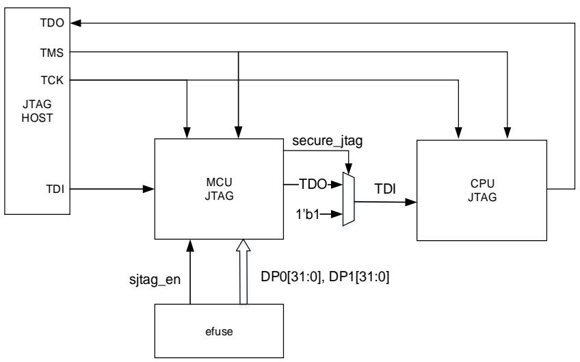

# 19. 调试（DBG）

# 19.1. 简介

GD32H7xx 系列产品提供了各种各样的调试，跟踪和测试功能。这些功能通过 Arm®CoreSight™组件的标准配置和链状连接的TAP控制器来实现的。调试和跟踪功能集成在 ARMCortex®-M7 内核中。调试系统支持串行（SW）调试和跟踪功能，也支持 JTAG 调试。调试和跟踪功能请参考下列文档：

Cortex®-M7技术参考手册；

ARM调试接口v5结构规范。

调试系统帮助调试者在低功耗模式下调试。当相应的位被置 1，调试系统会在低功耗模式下提供时钟，或者为一些外设保持当前状态，这些外设包括：TIMER、WWDGT、FWDGT、RTC、I2C 或者 CAN。

# 19.2. JTAG/SW 功能描述

调试工具可以通过串行（SW）调试接口或者 JTAG 调试接口来访问调试功能。

# 19.2.1. 切换 JTAG / SW 接口

默认使用 SWD 调试接口，通过 EFUSE_USER_CTL 寄存器的 JTAGNSW 位实现 JTAG 和SWD 调试接口的切换。

# 19.2.2. 引脚分配

JTAG 调试提供五个引脚的接口：JTAG 时钟引脚（JTCK），JTAG 模式选择引脚（JTMS），JTAG 数据输入引脚（JTDI），JTAG 数据输出引脚（JTDO），JTAG 复位引脚（NJTRST,低电平有效）。串行调试（SWD）提供两个引脚的接口：数据输入输出引脚（SWDIO）和时钟引脚（SWCLK）。SW 调试接口的两个引脚与 JTAG 调试接口的两个引脚复用，SWDIO 和 JTMS复用，SWCLK 和 JTCK 复用。

当异步跟踪功能开启时，JTDO 引脚也用作异步跟踪数据输出（TRACESWO）。

表 19-1. 引脚分配

<table><tr><td>引脚</td><td>调试接口</td></tr><tr><td>PA15</td><td>JTDI</td></tr><tr><td>PA14</td><td>JTCK/SWCLK</td></tr><tr><td>PA13</td><td>JTMS/SWDIO</td></tr><tr><td>PB4</td><td>NJTRST</td></tr><tr><td>PB3</td><td>JTDO</td></tr></table>

默认复位后使用五个引脚的 JTAG 调试，用户可以在不使用 NJTRST 引脚情况下正常使用JTAG 功能，此时 PB4 可以用作普通 GPIO 功能（NJTRST 硬件拉高）。如果切换到 SW 调试模式，PA15/PB4/PB3 释放作为普通 GPIO 功能。如果 JTAG 和 SW 调试功能都没有使用，这五个引脚都释放作为普通 GPIO 功能。

# 19.2.3. JTAG

图 19-1. JTAG 模块框图

# JTAG 链状结构

Cortex®-M7 内核的 JTAG TAP（CPU JTAG）和边界扫描（BSD）TAP（MCU JTAG）串行连接。边界扫描（BSD）JTAG 的 IR（指令寄存器）是 5 位，而 Cortex®-M7 内核的 JTAG 的 IR（指令寄存器）是 4 位。所以当 JTAG 进行 IR 移位输入时，首先移位 5 位 BYPASS 指令给BSD JTAG，然后移位 4 位标准指令给 Cortex®-M7 JTAG。当进行数据移位时，数据链只需要额外添加一位，因为 BSD JTAG 已处在 BYPASS模式。

BSD JTAG ID 代码是 0x000717A3。

# 安全 JTAG

1. 安全 JTAG 只支持 JTAG，不支持 SW

2. EFUSE 配置

EFUSE 相关位：JTAGNSW, NDBG[1:0], DPx[31:0]（x=0,1）

<table><tr><td>模式</td><td>寄存器配置</td></tr><tr><td>No debug</td><td>NDBG[1:0] = 2b'10 or 2b'11JTAGNSW: 不关心DP0[31:0], DP1[31:0]: 不关心</td></tr><tr><td>SW</td><td>NDBG[1:0] = 2b'00 or 2b'01JTAGNSW = 1b'0DP0[31:0], DP1[31:0]: 不关心</td></tr><tr><td>普通JTAG</td><td>NDBG[1:0] = 2b'00JTAGNSW = 1b'1DP0[31:0], DP1[31:0]: 不关心</td></tr><tr><td>安全JTAG</td><td>NDBG[1:0] = 2b'01JTAGNSW = 1b'1DP0[31:0], DP1[31:0]: 熔丝中调试秘钥字段值</td></tr></table>

# 3. 安全 JTAG 的使用

a) 配置 EFUSE 为安全 JTAG：首先配置 JTAG 安全密码 DPx[31:0]（x=0,1），再配置JTAGNSW=1b’1, NDBG[1:0]= 2b’01。

b) 电源复位：电源复位后，JTAG 处于安全状态，secure_jtag 为 1，此时无法通过 JTAG 操作 CPU。

c) 安全 JTAG 解除：JTAG 主机依次将以下两个密码写入 MCU JTAG 以解除安全模式。此时 secure_jtag 为 0，可通过 JTAG 对 CPU 进行操作。

IR：写入 5’b10101，DR：写入 DP0[31:0]。

IR：写入 5’b10110，DR：写入 DP1[31:0]。

注意：1. 如果密码输入错误，则需电源复位。

2. 发生任何错误的输入序列后，若想重新解密都需要电源复位。

3. 输入正确密码打开 debug，只限于 SPC_L 及以下，不会打开 ROM、内存安全模式和SPC_H。

d) 读取写入值和 JTAG 状态。

IR：写入 5’b11000，DR: 可读出 IR 为 5’b10101 写入的值 DP0[31:0]，检查写入值是否正确。

IR：写入 5’b11001，DR: 可读出 IR 为 5’b10110 写入的值 DP1[31:0]，检查写入值是否正确。

IR：写入 5’b11010，DR: 可读出{30‘b0, wrong_seq, secure_jtag}。secure_jtag 表示 JTAG状态，其中，1：无法通过 JTAG 操作 CPU，0：可以通过 JTAG 操作 CPU。wrong_seq 表示解密过程错误标志，“1”：解密过程发生错误，“0”：解密过程未发生错误。

# 19.2.4. 调试复位

JTAG-DP 和 SW-DP 寄存器位于上电复位域。系统复位初始化了 Cortex®-M7 的绝大部分组件，除了 NVIC，调试逻辑（FPB，DWT，ITM）。NJTRST 能复位 JTAG TAP 控制器。所以，可以在系统复位下实现调试功能。例如：复位后停止，用户在系统复位后配置相应停止位，系统复位释放后处理器会立即停止。

# 19.2.5. JEDEC-106 ID code

Cortex®-M7 集 成 了 JEDEC-106 ID 代 码 。 位 于 ROM 表 中 ， 映 射 地 址 为0xE00FD000_0xE00FDFFF。

# 19.3. 调试保持功能描述

# 19.3.1. 低功耗模式调试支持

当 DBG 控制寄存器 0（DBG_CTL0）的 STB_HOLD 位置 1 并且进入待机模式，AHB 总线时钟和系统时钟保持不变，可以在待机模式下调试。当退出待机模式后，产生系统复位。

当 DBG 控制寄存器 0（DBG_CTL0）的 DSLP_HOLD 位置 1 并且进入深度睡眠模式，AHB总线时钟和系统时钟保持不变，可以在深度睡眠模式下调试，退出深度睡眠时，PLL 关闭，系统时钟切换到 IRC64M 或 LPIRC4M。

当 DBG 控制寄存器 0（DBG_CTL0）的 SLP_HOLD 位置 1 并且进入睡眠模式，AHB 总线时钟没有关闭，可以在睡眠模式下调试。

# 19.3.2. TIMER, I2C, RTC, WWDGT, FWDGT 和 CAN 外设调试支持

当内核停止，并且 DBG 控制寄存器 x（DBG_CTLx，x=1，2，3，4）中的相应位置 1。对于不同外设，有不同动作：

对于 TIMER 外设，TIMER 计数器停止并进行调试；

对于 I2C 外设， SMBUS 保持状态并进行调试；

对于 WWDGT 或者 FWDGT 外设， 计数器时钟停止并进行调试；

对于 RTC 外设， 计数器停止并进行调试；

对于 CAN 外设，接收寄存器停止计数并进行调试。

