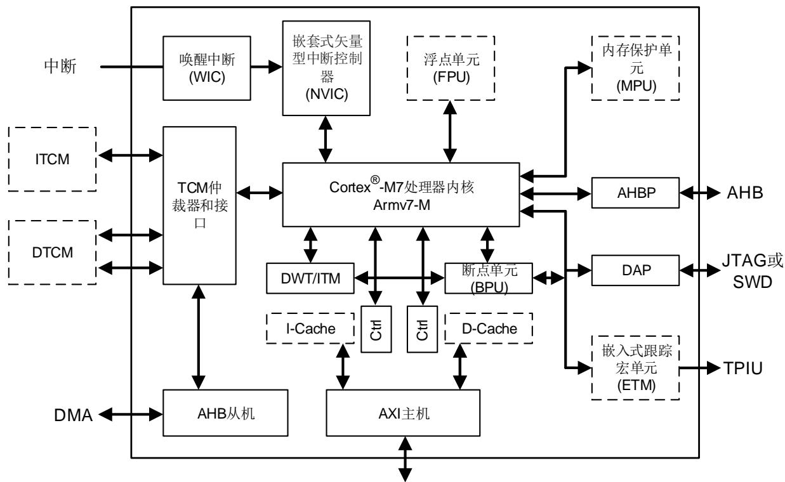
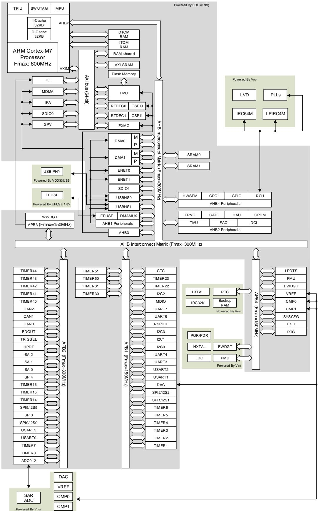
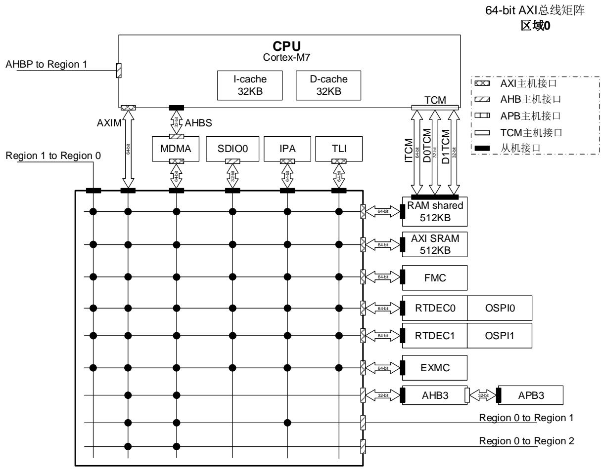
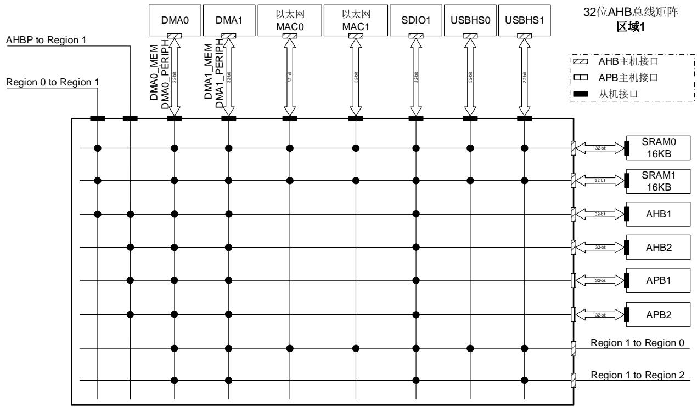
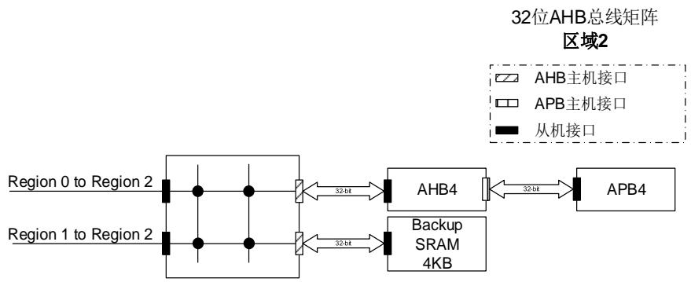
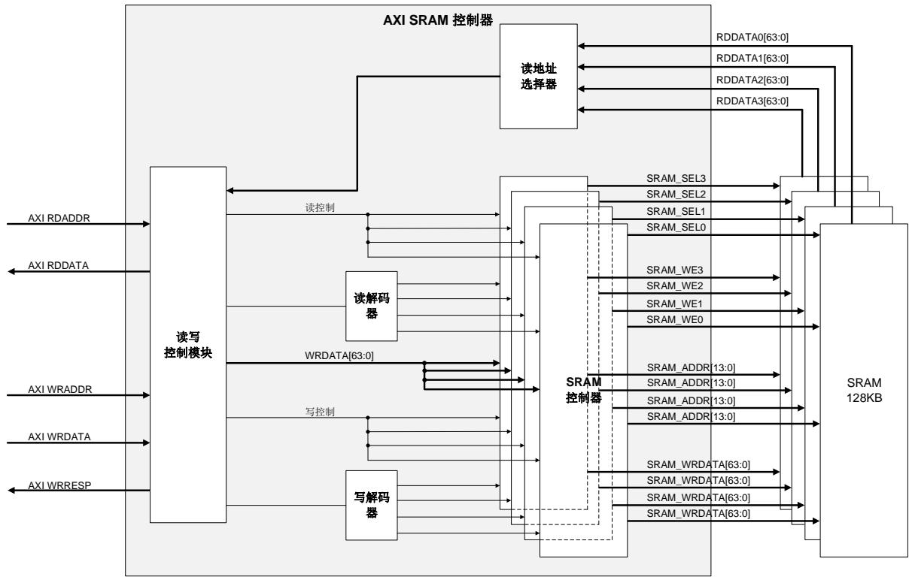
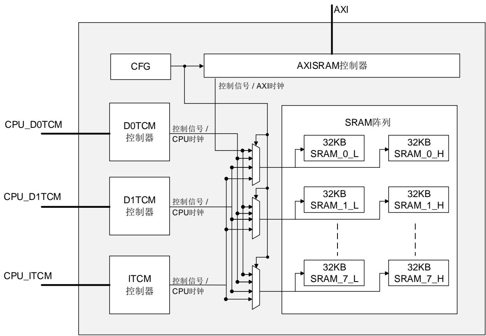
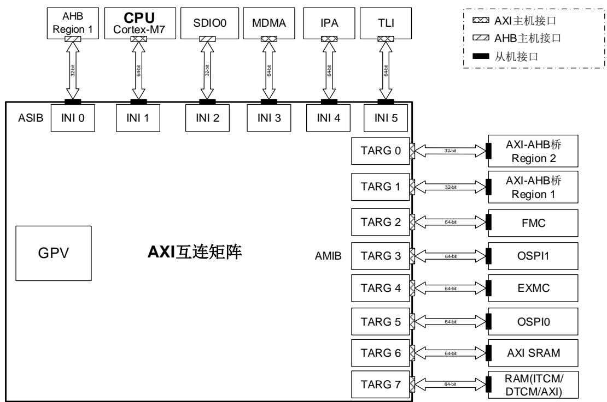

# 1. 系统及存储器架构

GD32H7xx系列器件是基于Arm® Cortex®-M7处理器的32位通用微控制器。Arm® Cortex®-M7处理器包括64位AMBA4 AXI、32位AHB外设（AHBP）端口、32位AHB从设备端口，用于外部主设备访问内存，以及用于CoreSight调试组件的APB接口。存储器的组织采用了哈佛结构，预先定义的存储器映射和高达4 GB的存储空间，充分保证了系统的灵活性和可扩展性。

# 1.1. Arm® Cortex®-M7 处理器

Arm® Cortex®-M7处理器是一种高效、高性能的嵌入式处理器，具有低中断延迟、低调试成本以及与现有Cortex-M配置文件处理器的向后兼容性。处理器有一个有序的超标量流水线，因为有多个内存接口，这意味着许多指令可以双重发布，包括加载/加载和加载/存储指令对。Cortex®-M7是一款高性能处理器，具有带分支预测的6级超标量流水线和可选的FPU，能够进行单精度和可选的双精度运算。指令和数据总线已比以前的32位总线扩大到64位宽。

处理器支持的接口包括：

64位AXI4接口

32位AHB主机接口

32位AHB从机接口

64位指令TCM接口

2x32位数据TCM接口

处理器包含以下外部接口：

AHBP接口

AHBS接口

◼ AHBD接口

外部专用外围总线

ATB接口

TCM接口

交叉触发接口

MBIST接口

AXIM接口

Cortex®-M7处理器基于ARMv7架构，并且支持一个强大且可扩展的指令集，包括通用数据处理I/O控制任务、增强的数据处理位域操作、DSP(数字信号处理)和浮点运算指令。下面列出由Cortex®-M7提供的一些系统外设：

嵌套式向量型中断控制器（NVIC）

闪存地址重载及断点单元（FPB）

数据观测点及跟踪单元（DWT）

指令跟踪宏单元（ITM）

JTAG或SWD调试接口

跟踪端口接口单元（TPIU）

内存保护单元（MPU）

双精度浮点运算单元（FPU）

加载存储单元（LSU）

数据处理单元（DPU）

预取单元（PFU）

1-1. Cortex®-M7 显示了Cortex®-M7处理器结构框图。欲了解更多信息，请参阅Arm® Cortex®-M7技术参考手册。

图 1-1. Cortex®-M7 处理器结构框图

外部存储器接口

# 1.2. 系统架构

互连矩阵包括一个AXI总线矩阵和两个AHB总线矩阵，可实现系统中多个主设备和从设备之间的并行访问路径。互连矩阵的互连关系如下所示。在 1-1. 中，“1”表示对应的主机可以通过互连矩阵访问对应的从机，空白的单元格表示对应的主机不能通过互连矩阵访问对应的从机。

表 1-1. 互联矩阵的互联关系

<table><tr><td>从机接口\主机接口</td><td>AXIM</td><td>AHBP</td><td>ITCM</td><td>DTCM</td><td>MDMA AXI</td><td>MDMA AHBS</td><td>MDMA MEM</td><td>DMAO MEM</td><td>DMAO PERIPH</td><td>DMAO MEM</td><td>DMA1 MEM</td><td>DMA1 PERIPH</td><td>IPA</td><td>TLI</td><td>SDIO0</td><td>SDIO1</td><td>ENET</td><td>USBHS0</td><td>USBHS1</td></tr><tr><td>ITCM</td><td></td><td></td><td>1</td><td></td><td></td><td>1</td><td></td><td></td><td></td><td></td><td></td><td></td><td></td><td></td><td></td><td></td><td></td><td></td><td></td></tr><tr><td>DTCM</td><td></td><td></td><td></td><td>1</td><td></td><td>1</td><td></td><td></td><td></td><td></td><td></td><td></td><td></td><td></td><td></td><td></td><td></td><td></td><td></td></tr></table>

<table><tr><td>主机接口从机接口</td><td>AXIM</td><td>AHBP</td><td>ITCM</td><td>DTCM</td><td>MDMA AXI</td><td>MDMA AHBS</td><td>MDMA MEM</td><td>DMAO PERIPH</td><td>DMAO MEM</td><td>DMA1 PERIPH</td><td>DMA1 PERIPH</td><td>IPA</td><td>TLI</td><td>SDIO0</td><td>SDIO1</td><td>ENET</td><td>USBHS0</td><td>USBHS1</td></tr><tr><td>FMC</td><td>1</td><td></td><td></td><td></td><td>1</td><td></td><td>1</td><td>1</td><td>1</td><td>1</td><td>1</td><td>1</td><td>1</td><td>1</td><td>1</td><td>1</td><td>1</td><td>1</td></tr><tr><td>AXI SRAM</td><td>1</td><td></td><td></td><td></td><td>1</td><td></td><td>1</td><td>1</td><td>1</td><td>1</td><td>1</td><td>1</td><td>1</td><td>1</td><td>1</td><td>1</td><td>1</td><td>1</td></tr><tr><td>共享 RAM (ITCM/DTCM/AXI)</td><td>1</td><td></td><td></td><td></td><td>1</td><td></td><td>1</td><td>1</td><td>1</td><td>1</td><td>1</td><td>1</td><td>1</td><td>1</td><td>1</td><td>1</td><td>1</td><td>1</td></tr><tr><td>SRAM0</td><td>1</td><td></td><td></td><td></td><td>1</td><td></td><td>1</td><td>1</td><td>1</td><td>1</td><td>1</td><td></td><td></td><td>1</td><td>1</td><td>1</td><td>1</td><td>1</td></tr><tr><td>SRAM1</td><td>1</td><td></td><td></td><td></td><td>1</td><td></td><td>1</td><td>1</td><td>1</td><td>1</td><td>1</td><td></td><td></td><td>1</td><td>1</td><td>1</td><td>1</td><td>1</td></tr><tr><td>Backup RAM</td><td>1</td><td></td><td></td><td></td><td>1</td><td></td><td>1</td><td>1</td><td>1</td><td>1</td><td></td><td></td><td></td><td>1</td><td></td><td></td><td>1</td><td></td></tr><tr><td>AHB1</td><td>1</td><td>1</td><td></td><td></td><td>1</td><td></td><td>1</td><td>1</td><td>1</td><td>1</td><td>1</td><td></td><td></td><td>1</td><td></td><td></td><td></td><td></td></tr><tr><td>AHB2</td><td></td><td>1</td><td></td><td></td><td></td><td></td><td>1</td><td>1</td><td>1</td><td>1</td><td></td><td></td><td></td><td>1</td><td></td><td></td><td></td><td></td></tr><tr><td>AHB3</td><td>1</td><td></td><td></td><td></td><td>1</td><td></td><td></td><td></td><td></td><td></td><td></td><td></td><td></td><td></td><td></td><td></td><td></td><td></td></tr><tr><td>AHB4</td><td>1</td><td></td><td></td><td></td><td>1</td><td></td><td>1</td><td>1</td><td>1</td><td>1</td><td></td><td></td><td></td><td>1</td><td></td><td></td><td>1</td><td></td></tr><tr><td>APB1</td><td></td><td>1</td><td></td><td></td><td></td><td></td><td>1</td><td>1</td><td>1</td><td>1</td><td></td><td></td><td></td><td>1</td><td></td><td></td><td></td><td></td></tr><tr><td>APB2</td><td></td><td>1</td><td></td><td></td><td></td><td></td><td>1</td><td>1</td><td>1</td><td>1</td><td></td><td></td><td></td><td>1</td><td></td><td></td><td></td><td></td></tr><tr><td>APB3</td><td>1</td><td></td><td></td><td></td><td>1</td><td></td><td></td><td></td><td></td><td></td><td></td><td></td><td></td><td></td><td></td><td></td><td></td><td></td></tr><tr><td>APB4</td><td>1</td><td></td><td></td><td></td><td>1</td><td></td><td>1</td><td>1</td><td>1</td><td>1</td><td></td><td></td><td></td><td>1</td><td></td><td></td><td>1</td><td></td></tr><tr><td>EXMC</td><td>1</td><td></td><td></td><td></td><td>1</td><td></td><td>1</td><td>1</td><td>1</td><td>1</td><td>1</td><td>1</td><td>1</td><td>1</td><td>1</td><td>1</td><td>1</td><td>1</td></tr><tr><td>OSPI</td><td>1</td><td></td><td></td><td></td><td>1</td><td></td><td>1</td><td>1</td><td>1</td><td>1</td><td>1</td><td>1</td><td>1</td><td>1</td><td>1</td><td>1</td><td>1</td><td>1</td></tr></table>

GD32H7xx器件的系统架构如 1-2. GD32H7xx 所示。工作频率与电源供电电压相关，具体请参考数据手册。

图 1-2. GD32H7xx 器件的系统架构示意图

# 1.2.1. 总线矩阵区域 0

64位AXI总线矩阵区域0如 1-3. 0所示。

图 1-3. 总线矩阵区域 0

# 1.2.2. 总线矩阵区域 1

32位AHB总线矩阵区域1如 1-4. 1所示。

图 1-4. 总线矩阵区域 1

# 1.2.3. 总线矩阵区域 2

32位AHB总线矩阵区域2如 1-5. 2所示。

图 1-5. 总线矩阵区域 2

如上图所示，总线矩阵有3个区域（Region），包括I-Cache、D-Cache、TCM、MDMA、DMA0、DMA1、IPA、TLI、SDIO0、SDIO1、ENET、USBHS0和USBHS1。Region 0中的AXI总线矩阵和Region 1和Region 2中的AHB总线矩阵为多主到多从的并发访问提供保证和仲裁。仲裁在Region 0中采用带QoS功能的循环调度算法，Region 1和Region 2采用循环调度算法。ITCM和DTCM通过TCM总线直接连接到Cortex®-M7内核，ITCM和DTCM的访问为零等待。ENET是以太网。TLI是TFT LCD接口。USBHS是高速USB。IPA是图像处理加速器。

# 1.3. 存储器映射

Arm® Cortex®-M7处理器采用哈佛结构，可以使用相互独立的总线来读取指令和加载/存储数据。 1-2. GD32H7xx 显示了GD32H7xx系列器件的存储器映射，包括代码、SRAM、外设和其他预先定义的区域。几乎每个外设都分配了1KB的地址空间，这样可以简化每个外设的地址译码。

表 1-2. GD32H7xx 系列器件的存储器映射表

<table><tr><td>预先定义的地址空间</td><td>总线</td><td>地址范围</td><td>外设</td></tr><tr><td rowspan="8">外部RAM</td><td rowspan="8"></td><td>0xD000 0000 - 0xDFFF FFFF</td><td>EXMC - SDRAM 设备1</td></tr><tr><td>0xC000 0000 - 0xCFFF FFFF</td><td>EXMC - SDRAM 设备0(EXMC Bank 0 Region 0-3)</td></tr><tr><td>0xA000 1000 - 0xBFFF FFFF</td><td>保留</td></tr><tr><td>0xA000 0000 - 0xA000 0FFF</td><td>保留</td></tr><tr><td>0x9000 0000 - 0x9FFF FFFF</td><td>OSPI0</td></tr><tr><td>0x8000 0000 - 0x8FFF FFFF</td><td>EXMC - NAND</td></tr><tr><td>0x7000 0000 - 0x7FFF FFFF</td><td>OSPI1</td></tr><tr><td>0x6000 0000 - 0x6FFF FFFF</td><td>EXMC - NOR/PSRAM/SRAM</td></tr><tr><td rowspan="24">外设</td><td rowspan="20">AHB4</td><td>0x5802 7000 - 0x5FFF FFFF</td><td>保留</td></tr><tr><td>0x5802 6400 - 0x5802 67FF</td><td>HWSEM</td></tr><tr><td>0x5802 6000 - 0x5802 63FF</td><td>保留</td></tr><tr><td>0x5802 5000 - 0x5802 5FFF</td><td>保留</td></tr><tr><td>0x5802 4C00 - 0x5802 4FFF</td><td>CRC</td></tr><tr><td>0x5802 4800 - 0x5802 4BFF</td><td>保留</td></tr><tr><td>0x5802 4400 - 0x5802 47FF</td><td>RCU</td></tr><tr><td>0x5802 2C00 - 0x5802 43FF</td><td>保留</td></tr><tr><td>0x5802 2800 - 0x5802 2BFF</td><td>GPIOK</td></tr><tr><td>0x5802 2400 - 0x5802 27FF</td><td>GPIOJ</td></tr><tr><td>0x5802 2000 - 0x5802 23FF</td><td>保留</td></tr><tr><td>0x5802 1C00 - 0x5802 1FFF</td><td>GPIOH</td></tr><tr><td>0x5802 1800 - 0x5802 1BFF</td><td>GPIOG</td></tr><tr><td>0x5802 1400 - 0x5802 17FF</td><td>GPIOF</td></tr><tr><td>0x5802 1000 - 0x5802 13FF</td><td>GPIOE</td></tr><tr><td>0x5802 0C00 - 0x5802 0FFF</td><td>GPIOD</td></tr><tr><td>0x5802 0800 - 0x5802 0BFF</td><td>GPIOC</td></tr><tr><td>0x5802 0400 - 0x5802 07FF</td><td>GPIOB</td></tr><tr><td>0x5802 0000 - 0x5802 03FF</td><td>GPIOA</td></tr><tr><td>0x5801 0000 - 0x5801 FFFF</td><td>保留</td></tr><tr><td rowspan="4">APB4</td><td>0x5800 7400 - 0x5800 FFFF</td><td>保留</td></tr><tr><td>0x5800 7000 - 0x5800 73FF</td><td>保留</td></tr><tr><td>0x5800 6C00 - 0x5800 6FFF</td><td>保留</td></tr><tr><td>0x5800 6800 - 0x5800 6BFF</td><td>LPDTS</td></tr><tr><td rowspan="41"></td><td rowspan="18"></td><td>0x5800 5800 - 0x5800 67FF</td><td>PMU</td></tr><tr><td>0x5800 5400 - 0x5800 57FF</td><td>保留</td></tr><tr><td>0x5800 4C00 - 0x5800 53FF</td><td>保留</td></tr><tr><td>0x5800 4800 - 0x5800 4BFF</td><td>FWDGT</td></tr><tr><td>0x5800 4000 - 0x5800 43FF</td><td>RTC</td></tr><tr><td>0x5800 3C00 - 0x5800 3FFF</td><td>VREF</td></tr><tr><td>0x5800 3800 - 0x5800 3BFF</td><td>CMP0 - CMP1</td></tr><tr><td>0x5800 3400 - 0x5800 37FF</td><td>保留</td></tr><tr><td>0x5800 3000 - 0x5800 33FF</td><td>保留</td></tr><tr><td>0x5800 2C00 - 0x5800 2FFF</td><td>保留</td></tr><tr><td>0x5800 2800 - 0x5800 2BFF</td><td>保留</td></tr><tr><td>0x5800 2400 - 0x5800 27FF</td><td>保留</td></tr><tr><td>0x5800 2000 - 0x5800 23FF</td><td>保留</td></tr><tr><td>0x5800 1C00 - 0x5800 1FFF</td><td>保留</td></tr><tr><td>0x5800 1400 - 0x5800 17FF</td><td>保留</td></tr><tr><td>0x5800 0800 - 0x5800 13FF</td><td>保留</td></tr><tr><td>0x5800 0400 - 0x5800 07FF</td><td>SYSCFG</td></tr><tr><td>0x5800 0000 - 0x5800 03FF</td><td>EXTI</td></tr><tr><td rowspan="20">AHB3</td><td>0x5200 C000 - 0x57FF FFFF</td><td>保留</td></tr><tr><td>0x5200 BC00 - 0x5200 BFFF</td><td>RTDEC1</td></tr><tr><td>0x5200 B800 - 0x5200 BBFF</td><td>RTDEC0</td></tr><tr><td>0x5200 B400 - 0x5200 B7FF</td><td>OSPIM</td></tr><tr><td>0x5200 B000 - 0x5200 B3FF</td><td>保留</td></tr><tr><td>0x5200 A000 - 0x5200 AFFF</td><td>OSPI1</td></tr><tr><td>0x5200 9400 - 0x5200 9FFF</td><td>保留</td></tr><tr><td>0x5200 9000 - 0x5200 93FF</td><td>RAMECCMU Region 0</td></tr><tr><td>0x5200 8000 - 0x5200 8FFF</td><td>CPDM(SDIO0)</td></tr><tr><td>0x5200 7000 - 0x5200 7FFF</td><td>SDIO0</td></tr><tr><td>0x5200 6000 - 0x5200 6FFF</td><td>保留</td></tr><tr><td>0x5200 5000 - 0x5200 5FFF</td><td>OSPI0</td></tr><tr><td>0x5200 4000 - 0x5200 4FFF</td><td>EXMC</td></tr><tr><td>0x5200 3400 - 0x5200 3FFF</td><td>保留</td></tr><tr><td>0x5200 3000 - 0x5200 33FF</td><td>保留</td></tr><tr><td>0x5200 2000 - 0x5200 2FFF</td><td>FMC</td></tr><tr><td>0x5200 1000 - 0x5200 1FFF</td><td>IPA</td></tr><tr><td>0x5200 0000 - 0x5200 0FFF</td><td>MDMA</td></tr><tr><td>0x5110 0000 - 0x511F FFFF</td><td>保留</td></tr><tr><td>0x5100 0000 - 0x510F FFFF</td><td>AXI互联矩阵</td></tr><tr><td rowspan="3">APB3</td><td>0x5006 1000 - 0x50FF FFFF</td><td>保留</td></tr><tr><td>0x5006 0C00 - 0x5006 0FFF</td><td>保留</td></tr><tr><td>0x5006 0800 - 0x5006 0BFF</td><td>保留</td></tr><tr><td rowspan="41"></td><td rowspan="10"></td><td>0x5006 0400 - 0x5006 07FF</td><td>保留</td></tr><tr><td>0x5006 0000 - 0x5006 03FF</td><td>保留</td></tr><tr><td>0x5005 0400 - 0x5005 FFFF</td><td>保留</td></tr><tr><td>0x5005 0000 - 0x5005 03FF</td><td>保留</td></tr><tr><td>0x5004 0000 - 0x5004 FFFF</td><td>保留</td></tr><tr><td>0x5000 0000 - 0x5003 FFFF</td><td>保留</td></tr><tr><td>0x5000 3000 - 0x5000 3FFF</td><td>WWDGT</td></tr><tr><td>0x5000 2000 - 0x5000 2FFF</td><td>保留</td></tr><tr><td>0x5000 1000 - 0x5000 1FFF</td><td>TLI</td></tr><tr><td>0x5000 0000 - 0x5000 0FFF</td><td>保留</td></tr><tr><td rowspan="21">AHB2</td><td>0x4802 5000 - 0x4FFF FFFF</td><td>保留(AHB2)</td></tr><tr><td>0x4802 4800 - 0x4802 4FFF</td><td>FAC</td></tr><tr><td>0x4802 4400 - 0x4802 47FF</td><td>TMU</td></tr><tr><td>0x4802 4000 - 0x4802 43FF</td><td>保留</td></tr><tr><td>0x4802 3000 - 0x4802 3FFF</td><td>RAMECCMU Region 1</td></tr><tr><td>0x4802 2C00 - 0x4802 2FFF</td><td>保留(AHB2)</td></tr><tr><td>0x4802 2800 - 0x4802 2BFF</td><td>CPDM(SDIO1)</td></tr><tr><td>0x4802 2400 - 0x4802 27FF</td><td>SDIO1</td></tr><tr><td>0x4802 1C00 - 0x4802 23FF</td><td>保留(AHB2)</td></tr><tr><td>0x4802 1800 - 0x4802 1BFF</td><td>TRNG</td></tr><tr><td>0x4802 1400 - 0x4802 17FF</td><td>HAU</td></tr><tr><td>0x4802 1000 - 0x4802 13FF</td><td>CAU</td></tr><tr><td>0x4802 0400 - 0x4802 0FFF</td><td>保留(AHB2)</td></tr><tr><td>0x4802 0000 - 0x4802 03FF</td><td>DCI</td></tr><tr><td>0x4800 1800 - 0x4801 FFFF</td><td>保留(AHB2)</td></tr><tr><td>0x4800 1400 - 0x4800 17FF</td><td>保留</td></tr><tr><td>0x4800 1000 - 0x4800 13FF</td><td>保留</td></tr><tr><td>0x4800 0C00 - 0x4800 0FFF</td><td>保留</td></tr><tr><td>0x4800 0800 - 0x4800 0BFF</td><td>保留</td></tr><tr><td>0x4800 0400 - 0x4800 07FF</td><td>保留</td></tr><tr><td>0x4800 0000 - 0x4800 03FF</td><td>保留</td></tr><tr><td rowspan="10">AHB1</td><td>0x400C 0000 - 0x47FF FFFF</td><td>保留(AHB1)</td></tr><tr><td>0x4008 0000 - 0x400B FFFF</td><td>USBHS1</td></tr><tr><td>0x4004 0000 - 0x4007 FFFF</td><td>USBHS0</td></tr><tr><td>0x4003 8C00 - 0x4003 FFFF</td><td>保留</td></tr><tr><td>0x4003 8400 - 0x4003 8BFF</td><td>保留</td></tr><tr><td>0x4003 8000 - 0x4003 83FF</td><td>保留</td></tr><tr><td>0x4003 3000 - 0x4003 7FFF</td><td>保留</td></tr><tr><td>0x4003 0000 - 0x4003 2FFF</td><td>保留</td></tr><tr><td>0x4002 C000 - 0x4002 FFFF</td><td>保留</td></tr><tr><td>0x4002 BC00 - 0x4002 BFFF</td><td>ENET1</td></tr><tr><td rowspan="41"></td><td rowspan="24"></td><td>0x4002 B000 - 0x4002 BBFF</td><td rowspan="2"></td></tr><tr><td>0x4002 A000 - 0x4002 AFFF</td></tr><tr><td>0x4002 8000 - 0x4002 9FFF</td><td>ENET0</td></tr><tr><td>0x4002 6800 - 0x4002 7FFF</td><td>保留</td></tr><tr><td>0x4002 6400 - 0x4002 67FF</td><td>保留</td></tr><tr><td>0x4002 6000 - 0x4002 63FF</td><td>保留</td></tr><tr><td>0x4002 5000 - 0x4002 5FFF</td><td>保留</td></tr><tr><td>0x4002 4000 - 0x4002 4FFF</td><td>保留</td></tr><tr><td>0x4002 3C00 - 0x4002 3FFF</td><td>保留</td></tr><tr><td>0x4002 3800 - 0x4002 3BFF</td><td>保留</td></tr><tr><td>0x4002 3400 - 0x4002 37FF</td><td>保留</td></tr><tr><td>0x4002 3000 - 0x4002 33FF</td><td>保留</td></tr><tr><td>0x4002 2C00 - 0x4002 2FFF</td><td>保留</td></tr><tr><td>0x4002 2800 - 0x4002 2BFF</td><td>EFUSE</td></tr><tr><td>0x4002 2400 - 0x4002 27FF</td><td>保留</td></tr><tr><td>0x4002 2000 - 0x4002 23FF</td><td>保留</td></tr><tr><td>0x4002 1C00 - 0x4002 1FFF</td><td>保留</td></tr><tr><td>0x4002 1800 - 0x4002 1BFF</td><td>保留</td></tr><tr><td>0x4002 1400 - 0x4002 17FF</td><td>保留</td></tr><tr><td>0x4002 1000 - 0x4002 13FF</td><td>保留</td></tr><tr><td>0x4002 0C00 - 0x4002 0FFF</td><td>保留</td></tr><tr><td>0x4002 0800 - 0x4002 0BFF</td><td>DMAMUX</td></tr><tr><td>0x4002 0400 - 0x4002 07FF</td><td>DMA1</td></tr><tr><td>0x4002 0000 - 0x4002 03FF</td><td>DMA0</td></tr><tr><td rowspan="17">APB2</td><td>0x4001 F400 - 0x4001 FFFF</td><td>保留</td></tr><tr><td>0x4001 F000 - 0x4001 F3FF</td><td>TIMER44</td></tr><tr><td>0x4001 DC00 - 0x4001 DFFF</td><td>TIMER43</td></tr><tr><td>0x4001 D800 - 0x4001 DBFF</td><td>TIMER42</td></tr><tr><td>0x4001 D400 - 0x4001 D7FF</td><td>TIMER41</td></tr><tr><td>0x4001 D000 - 0x4001 D3FF</td><td>TIMER40</td></tr><tr><td>0x4001 C000 - 0x4001 CFFF</td><td>CAN2(4KB)</td></tr><tr><td>0x4001 B000 - 0x4001 BFFF</td><td>CAN1(4KB)</td></tr><tr><td>0x4001 A000 - 0x4001 AFFF</td><td>CAN0(4KB)</td></tr><tr><td>0x4001 8C00 - 0x4001 9FFF</td><td>保留</td></tr><tr><td>0x4001 8800 - 0x4001 8BFF</td><td>EDOUT</td></tr><tr><td>0x4001 8400 - 0x4001 87FF</td><td>TRIGSEL</td></tr><tr><td>0x4001 8000 - 0x4001 83FF</td><td>保留(APB2)</td></tr><tr><td>0x4001 7C00 - 0x4001 7FFF</td><td>保留</td></tr><tr><td>0x4001 7800 - 0x4001 7BFF</td><td>保留</td></tr><tr><td>0x4001 7400 - 0x4001 77FF</td><td>保留</td></tr><tr><td>0x4001 7000 - 0x4001 73FF</td><td>HPDF</td></tr><tr><td rowspan="41"></td><td rowspan="28"></td><td>0x4001 6C00 - 0x4001 6FFF</td><td>保留</td></tr><tr><td>0x4001 6800 - 0x4001 6BFF</td><td>保留</td></tr><tr><td>0x4001 6400 - 0x4001 67FF</td><td>保留</td></tr><tr><td>0x4001 6000 - 0x4001 63FF</td><td>SAI2</td></tr><tr><td>0x4001 5C00 - 0x4001 5FFF</td><td>SAI1</td></tr><tr><td>0x4001 5800 - 0x4001 5BFF</td><td>SAI0</td></tr><tr><td>0x4001 5400 - 0x4001 57FF</td><td>保留</td></tr><tr><td>0x4001 5000 - 0x4001 53FF</td><td>SPI4</td></tr><tr><td>0x4001 4C00 - 0x4001 4FFF</td><td>保留</td></tr><tr><td>0x4001 4800 - 0x4001 4BFF</td><td>TIMER16</td></tr><tr><td>0x4001 4400 - 0x4001 47FF</td><td>TIMER15</td></tr><tr><td>0x4001 4000 - 0x4001 43FF</td><td>TIMER14</td></tr><tr><td>0x4001 3C00 - 0x4001 3FFF</td><td>保留</td></tr><tr><td>0x4001 3800 - 0x4001 3BFF</td><td>SPI5/I2S5</td></tr><tr><td>0x4001 3400 - 0x4001 37FF</td><td>SPI3</td></tr><tr><td>0x4001 3000 - 0x4001 33FF</td><td>SPI0/I2S0</td></tr><tr><td>0x4001 2C00 - 0x4001 2FFF</td><td>ADC2</td></tr><tr><td>0x4001 2800 - 0x4001 2BFF</td><td>ADC1</td></tr><tr><td>0x4001 2400 - 0x4001 27FF</td><td>ADC0</td></tr><tr><td>0x4001 2000 - 0x4001 23FF</td><td>保留</td></tr><tr><td>0x4001 1C00 - 0x4001 1FFF</td><td>保留</td></tr><tr><td>0x4001 1800 - 0x4001 1BFF</td><td>保留</td></tr><tr><td>0x4001 1400 - 0x4001 17FF</td><td>USART5</td></tr><tr><td>0x4001 1000 - 0x4001 13FF</td><td>USART0</td></tr><tr><td>0x4001 0C00 - 0x4001 0FFF</td><td>保留</td></tr><tr><td>0x4001 0800 - 0x4001 0BFF</td><td>保留</td></tr><tr><td>0x4001 0400 - 0x4001 07FF</td><td>TIMER7</td></tr><tr><td>0x4001 0000 - 0x4001 03FF</td><td>TIMER0</td></tr><tr><td rowspan="13">APB1</td><td>0x4000 F800 - 0x4000 FFFF</td><td>保留</td></tr><tr><td>0x4000 F400 - 0x4000 F7FF</td><td>TIMER51</td></tr><tr><td>0x4000 F000 - 0x4000 F3FF</td><td>TIMER50</td></tr><tr><td>0x4000 EC00 - 0x4000 EFFF</td><td>TIMER31</td></tr><tr><td>0x4000 E800 - 0x4000 EBFF</td><td>TIMER30</td></tr><tr><td>0x4000 E400 - 0x4000 E7FF</td><td>TIMER23</td></tr><tr><td>0x4000 E000 - 0x4000 E3FF</td><td>TIMER22</td></tr><tr><td>0x4000 DC00 - 0x4000 DFFF</td><td>保留</td></tr><tr><td>0x4000 D800 - 0x4000 DBFF</td><td>保留</td></tr><tr><td>0x4000 D400 - 0x4000 D7FF</td><td>保留</td></tr><tr><td>0x4000 D000 - 0x4000 D3FF</td><td>保留</td></tr><tr><td>0x4000 CC00 - 0x4000 CFFF</td><td>保留</td></tr><tr><td>0x4000 C800 - 0x4000 CBFF</td><td>保留</td></tr><tr><td rowspan="39"></td><td rowspan="39"></td><td>0x4000 C400 - 0x4000 C7FF</td><td>保留</td></tr><tr><td>0x4000 C000 - 0x4000 C3FF</td><td>I2C2</td></tr><tr><td>0x4000 9800 - 0x4000 BFFF</td><td>保留</td></tr><tr><td>0x4000 9400 - 0x4000 97FF</td><td>MDIO</td></tr><tr><td>0x4000 8800 - 0x4000 93FF</td><td>保留</td></tr><tr><td>0x4000 8400 - 0x4000 87FF</td><td>CTC</td></tr><tr><td>0x4000 8000 - 0x4000 83FF</td><td>保留</td></tr><tr><td>0x4000 7C00 - 0x4000 7FFF</td><td>UART7</td></tr><tr><td>0x4000 7800 - 0x4000 7BFF</td><td>UART6</td></tr><tr><td>0x4000 7400 - 0x4000 77FF</td><td>DAC</td></tr><tr><td>0x4000 7000 - 0x4000 73FF</td><td>保留</td></tr><tr><td>0x4000 6C00 - 0x4000 6FFF</td><td>保留</td></tr><tr><td>0x4000 6800 - 0x4000 6BFF</td><td>保留</td></tr><tr><td>0x4000 6400 - 0x4000 67FF</td><td>保留</td></tr><tr><td>0x4000 6000 - 0x4000 63FF</td><td>保留</td></tr><tr><td>0x4000 5C00 - 0x4000 5FFF</td><td>I2C3</td></tr><tr><td>0x4000 5800 - 0x4000 5BFF</td><td>I2C1</td></tr><tr><td>0x4000 5400 - 0x4000 57FF</td><td>I2C0</td></tr><tr><td>0x4000 5000 - 0x4000 53FF</td><td>UART4</td></tr><tr><td>0x4000 4C00 - 0x4000 4FFF</td><td>UART3</td></tr><tr><td>0x4000 4800 - 0x4000 4BFF</td><td>USART2</td></tr><tr><td>0x4000 4400 - 0x4000 47FF</td><td>USART1</td></tr><tr><td>0x4000 4000 - 0x4000 43FF</td><td>RSPDIF</td></tr><tr><td>0x4000 3C00 - 0x4000 3FFF</td><td>SPI2/I2S2</td></tr><tr><td>0x4000 3800 - 0x4000 3BFF</td><td>SPI1/I2S1</td></tr><tr><td>0x4000 3400 - 0x4000 37FF</td><td>保留</td></tr><tr><td>0x4000 3000 - 0x4000 33FF</td><td>保留</td></tr><tr><td>0x4000 2C00 - 0x4000 2FFF</td><td>保留</td></tr><tr><td>0x4000 2800 - 0x4000 2BFF</td><td>保留</td></tr><tr><td>0x4000 2400 - 0x4000 27FF</td><td>保留</td></tr><tr><td>0x4000 2000 - 0x4000 23FF</td><td>保留</td></tr><tr><td>0x4000 1C00 - 0x4000 1FFF</td><td>保留</td></tr><tr><td>0x4000 1800 - 0x4000 1BFF</td><td>保留</td></tr><tr><td>0x4000 1400 - 0x4000 17FF</td><td>TIMER6</td></tr><tr><td>0x4000 1000 - 0x4000 13FF</td><td>TIMER5</td></tr><tr><td>0x4000 0C00 - 0x4000 0FFF</td><td>TIMER4</td></tr><tr><td>0x4000 0800 - 0x4000 0BFF</td><td>TIMER3</td></tr><tr><td>0x4000 0400 - 0x4000 07FF</td><td>TIMER2</td></tr><tr><td>0x4000 0000 - 0x4000 03FF</td><td>TIMER1</td></tr><tr><td rowspan="2">SRAM</td><td rowspan="2"></td><td>0x3880 1000 - 0x3FFF FFFF</td><td>保留</td></tr><tr><td>0x3880 0000 - 0x3880 0FFF</td><td>Backup SRAM</td></tr><tr><td rowspan="21"></td><td rowspan="21"></td><td>0x3000 8000 - 0x387F FFFF</td><td>保留</td></tr><tr><td>0x3000 4000 - 0x3000 7FFF</td><td>SRAM1(16KB)</td></tr><tr><td>0x3000 0000 - 0x3000 3FFF</td><td>SRAM0(16KB)</td></tr><tr><td>0x2410 0000 - 0x2FFF FFFF</td><td>保留</td></tr><tr><td>0x2408 0000 - 0x240F FFFF</td><td>共享 RAM(512KB)(ITCM/DTCM/AXI SRAM)</td></tr><tr><td>0x2400 0000 - 0x2407 FFFF</td><td>AXI SRAM(512KB)</td></tr><tr><td>0x2008 0000 - 0x23FF FFFF</td><td>保留</td></tr><tr><td>0x2007 0000 - 0x2007 FFFF</td><td rowspan="14">DTCM RAM(来自共享 RAM)</td></tr><tr><td>0x2006 0000 - 0x2006 FFFF</td></tr><tr><td>0x2003 0000 - 0x2005 FFFF</td></tr><tr><td>0x2002 0000 - 0x2002 FFFF</td></tr><tr><td>0x2001 C000 - 0x2001 FFFF</td></tr><tr><td>0x2001 8000 - 0x2001 BFFF</td></tr><tr><td>0x2001 0000 - 0x2001 7FFF</td></tr><tr><td>0x2000 D000 - 0x2000 FFFF</td></tr><tr><td>0x2000 C000 - 0x2000 CFFF</td></tr><tr><td>0x2000 8000 - 0x2000 BFFF</td></tr><tr><td>0x2000 5000 - 0x2000 7FFF</td></tr><tr><td>0x2000 2000 - 0x2000 4FFF</td></tr><tr><td>0x2000 1000 - 0x2000 1FFF</td></tr><tr><td>0x2000 0000 - 0x2000 0FFF</td></tr><tr><td rowspan="18">代码</td><td rowspan="18"></td><td>0x1FFF FC10 - 0x1FFF FFFF</td><td>保留</td></tr><tr><td>0x1FFF FC00 - 0x1FFF FC0F</td><td>保留</td></tr><tr><td>0x1FFF F818 - 0x1FFF BFFF</td><td>保留</td></tr><tr><td>0x1FFF F800 - 0x1FFF F817</td><td>保留</td></tr><tr><td>0x1FFF F000 - 0x1FFF F7FF</td><td>保留</td></tr><tr><td>0x1FFF EC00 - 0x1FFF EFFF</td><td>保留</td></tr><tr><td>0x1FFF C010 - 0x1FFF EBFF</td><td>保留</td></tr><tr><td>0x1FFF C000 - 0x1FFF C00F</td><td>保留</td></tr><tr><td>0x1FFF B000 - 0x1FFF BFFF</td><td>保留</td></tr><tr><td>0x1FFF 8000 - 0x1FFF AFFF</td><td>保留</td></tr><tr><td>0x1FFF 7A10 - 0x1FFF 7FFF</td><td>保留</td></tr><tr><td>0x1FFF 7800 - 0x1FFF 7A0F</td><td>保留</td></tr><tr><td>0x1FFF 7400 - 0x1FFF 77FF</td><td>保留</td></tr><tr><td>0x1FFF 7000 - 0x1FFF 73FF</td><td>保留</td></tr><tr><td>0x1FFF 0000 - 0x1FFF 6FFF</td><td>保留</td></tr><tr><td>0x1FFE C010 - 0x1FFE FFFF</td><td>保留</td></tr><tr><td>0x1FFE C000 - 0x1FFE C00F</td><td>保留</td></tr><tr><td>0x1FF6 0000 - 0x1FFE BFFF</td><td>保留</td></tr><tr><td rowspan="30"></td><td rowspan="30"></td><td>0x1FF4 0000 - 0x1FF5 FFFF</td><td>保留</td></tr><tr><td>0x1FF1 0000 - 0x1FF3 FFFF</td><td>保留</td></tr><tr><td>0x1FF0 0000 - 0x1FF0 FFFF</td><td>系统存储区</td></tr><tr><td>0x1002 0000 - 0x1FEF FFFF</td><td>保留</td></tr><tr><td>0x1001 0000 - 0x1001 FFFF</td><td>保留</td></tr><tr><td>0x1000 0000 - 0x1000 FFFF</td><td>保留</td></tr><tr><td>0x0A00 D000 - 0x0FFF FFFF</td><td>保留</td></tr><tr><td>0x0A00 C000 - 0x0A00 CFFF</td><td>保留</td></tr><tr><td>0x0A00 8000 - 0x0A00 BFFF</td><td>保留</td></tr><tr><td>0x0A00 0000 - 0x0A00 7FFF</td><td>保留</td></tr><tr><td>0x08C0 1000 - 0x09FF FFFF</td><td>保留</td></tr><tr><td>0x08C0 0000 - 0x08C0 0FFF</td><td>保留</td></tr><tr><td>0x0881 0000 - 0x08BF FFFF</td><td>保留</td></tr><tr><td>0x0880 0000 - 0x0880 FFFF</td><td>保留</td></tr><tr><td>0x0840 0000 - 0x087F FFFF</td><td>保留</td></tr><tr><td>0x083C 0000 - 0x083F FFFF</td><td>保留</td></tr><tr><td>0x0830 0000 - 0x083B FFFF</td><td rowspan="7">Flash 存储器</td></tr><tr><td>0x0810 0000 - 0x082F FFFF</td></tr><tr><td>0x0808 0000 - 0x080F FFFF</td></tr><tr><td>0x0806 0000 - 0x0807 FFFF</td></tr><tr><td>0x0802 0000 - 0x0805 FFFF</td></tr><tr><td>0x0801 0000 - 0x0801 FFFF</td></tr><tr><td>0x0800 0000 - 0x0800 FFFF</td></tr><tr><td>0x0030 0000 - 0x07FF FFFF</td><td>保留</td></tr><tr><td>0x0010 0000 - 0x002F FFFF</td><td>保留</td></tr><tr><td>0x0008 0000 - 0x000F FFFF</td><td>保留</td></tr><tr><td>0x0002 6000 - 0x0007 FFFF</td><td rowspan="4">ITCM RAM(来自共享RAM)</td></tr><tr><td>0x0002 0000 - 0x0002 5FFF</td></tr><tr><td>0x0001 0000 - 0x0001 FFFF</td></tr><tr><td>0x0000 0000 - 0x0000 FFFF</td></tr></table>

# 1.3.1. 片上 SRAM 存储器

GD32H7xx系列的设备包含高达512KB的片上SRAM（AXI SRAM）、4KB的备份SRAM和高达512KB的ITCM/DTCM/AXI SRAM共享RAM。所有AHB SRAM都支持字节、半字（16位）和字（32位）访问。片上SRAM（AXI SRAM）支持字节、半字（16位）、字（32位）和双字（64位）访问。几乎所有AHB主机都可以访问SRAM0和SRAM1。备份SRAM（BKPRAM）在备份域中实现，即使VDD电源关闭，它也可以保留其内容。

ITCM/DTCM SRAM访问频率

如果SYSCFG_SRAMCFG1寄存器的TCM_WAITSTATE位为0，可以以最高fTWW频率访问对应的TCM SRAM。TCM_WAITSTATE位在系统复位后为0。fTWW数值详见芯片数据手册。

# ITCM/DTCM SRAM ECC功能

如果将TCM ECC功能(ITCMECCEN / DTCM0ECCEN / DTCM1ECCEN)打开，可以增加健壮性。

# AXI SRAM

片上SRAM（AXI SRAM）控制器由读写控制模块、MUX、解码器和SRAM控制器组成。每个SRAM控制器都有一个带有轮询机制的仲裁器。框图如 1-6. AXI SRAM 所示。

图 1-6. AXI SRAM 框图

# ITCM/DTCM/AXI SRAM共享的RAM

512KB的RAM可由ITCM或DTCM或AXI SRAM使用，可通过选项字节状态寄存器1寄存器中的ITCM_SZ_SHRRAM和DTCM_SZ_SHRRAM位进行配置，如 1-3. ITCM/DTCM/AXI SRAM所述。框图如 1-7. ITCM/DTCM/AXI SRAM RAM 所示。

图 1-7. ITCM/DTCM/AXI SRAM 共享的 RAM 框图

ITCM，DTCM和共享SRAM（AXI SRAM）总容量为512KB，其中ITCM的配置优先，DTCM配置次之，剩下是共享SRAM部分。

表 1-3. ITCM/DTCM/AXI SRAM 的配置

<table><tr><td>ITCM_SZ_SHRRAM[3:0]</td><td>DTCM_SZ_SHRRAM[3:0]</td><td>ITCM容量(KB)</td><td>DTCM容量(KB)</td><td>AXI SRAM容量(KB)</td></tr><tr><td>0000</td><td>0000</td><td>0</td><td>0</td><td>512</td></tr><tr><td>0000</td><td>0111</td><td>0</td><td>64</td><td>448</td></tr><tr><td>0000</td><td>1000</td><td>0</td><td>128</td><td>384</td></tr><tr><td>0000</td><td>1001</td><td>0</td><td>256</td><td>256</td></tr><tr><td>0000</td><td>1010</td><td>0</td><td>512</td><td>0</td></tr><tr><td>0111</td><td>0000</td><td>64</td><td>0</td><td>448</td></tr><tr><td>0111</td><td>0111</td><td>64</td><td>64</td><td>384</td></tr><tr><td>0111</td><td>1000</td><td>64</td><td>128</td><td>320</td></tr><tr><td>0111</td><td>1001</td><td>64</td><td>256</td><td>192</td></tr><tr><td>1000</td><td>0000</td><td>128</td><td>0</td><td>384</td></tr><tr><td>1000</td><td>0111</td><td>128</td><td>64</td><td>320</td></tr><tr><td>1000</td><td>1000</td><td>128</td><td>128</td><td>256</td></tr><tr><td>1000</td><td>1001</td><td>128</td><td>256</td><td>128</td></tr><tr><td>1001</td><td>0000</td><td>256</td><td>0</td><td>256</td></tr><tr><td>1001</td><td>0111</td><td>256</td><td>64</td><td>192</td></tr><tr><td>1001</td><td>1000</td><td>256</td><td>128</td><td>128</td></tr><tr><td>1001</td><td>1001</td><td>256</td><td>256</td><td>0</td></tr><tr><td>1010</td><td>0000</td><td>512</td><td>0</td><td>0</td></tr></table>

# 1.3.2. 片上 FLASH 存储器概述

GD32H7xx系列微控制器可以提供高密度片上FLASH存储器，按以下分类进行组织：

高达3840KB主FLASH存储器；

高达64KB引导装载程序(boot loader)信息块存储器；

器件配置的选项字节。

更多详细说明请参考 FMC 章节。

# 1.4. 引导配置

GD32H7xx 设 备 提 供 不 同 的 引 导 源 ， 可 通 过 Arm® Cortex®-M7 核 心 寄 存 器（FMC_BTADDR_MDF）的引导地址中的引导引脚和引导地址0/1[15:0]进行选择。详情见1-4. 和 1-5. 。BOOT引脚的电平状态会在复位后的第四个CK_SYS(系统时钟)的上升沿进行锁存。用户可自行选择所需要的引导源，通过设置上电复位和系统复位后的BOOT的引脚电平。一旦这个引脚电平被采样，它们可以被释放并用于其他用途。

BOOT_ADDR0[15:0]和BOOT_ADDR1[15:0]地址允许将引导内存地址配置为0x0000 0000到0x9000 0000 之 间 的 任 何 地 址 。 引 导 模 式 可 由 SYSCFG_USERCFG 寄 存 器 的BOOT_MODE[2:0]位域中获取。

表 1-4. 引导模式选择

<table><tr><td rowspan="2">引导源地址</td><td>启动模式选择引脚</td></tr><tr><td>BOOT</td></tr><tr><td>引导地址高位:由BOOT_ADDR0[15:0]定义引导地址低位:0x0000</td><td>0</td></tr><tr><td>引导地址高位:由BOOT_ADDR1[15:0]定义引导地址低位:0x0000</td><td>1</td></tr></table>

表 1-5. 引导模式详细描述

<table><tr><td>SCR</td><td>SPC[7:0]</td><td>BOOT_ADDRESS(在BOOT_ADDRx(x=0,1)配置)</td><td>BOOT_MODE</td><td>启动地址</td></tr><tr><td>1</td><td>x</td><td>XXXX</td><td>SECURITY BOOT</td><td>ROM</td></tr><tr><td rowspan="19">0</td><td rowspan="2">安全保护等级高</td><td>0x0800_0000~max user flash</td><td>USER BOOT</td><td>BOOT_ADDRESS</td></tr><tr><td>其他地址</td><td>USER BOOT</td><td>0x0800_0000</td></tr><tr><td rowspan="8">安全保护等级低</td><td>0x2408_0000~max RAM shared(ITCM/DTCM/AXI)</td><td>SRAM BOOT(RAM shared)</td><td>BOOT_ADDRESS</td></tr><tr><td>0x2400_0000~max AXI SRAM</td><td>SRAM BOOT(AXI SRAM)</td><td>BOOT_ADDRESS</td></tr><tr><td>0x2000_0000</td><td>SRAM BOOT(DTCM)</td><td>0x2000_0000</td></tr><tr><td>0x0800_0000~max user flash</td><td>USER BOOT</td><td>BOOT_ADDRESS</td></tr><tr><td>0x0000_0000</td><td>SRAM BOOT(ITCM)</td><td>0x0000_0000</td></tr><tr><td>0x1FF0_0000</td><td>SYSTEM BOOT</td><td>BootLoader</td></tr><tr><td rowspan="2">其他地址</td><td>USER BOOT</td><td>0x0800_0000(BOOT Pin = 0)</td></tr><tr><td>SYSTEM BOOT</td><td>BootLoader(BOOT Pin = 1)</td></tr><tr><td rowspan="9">无保护状态</td><td>0x9000_0000</td><td>USER BOOT</td><td>OSPI0</td></tr><tr><td>0x7000_0000</td><td>USER BOOT</td><td>OSPI1</td></tr><tr><td>0x2408_0000~max RAM shared(ITCM/DTCM/AXI)</td><td>SRAM BOOT(RAM shared)</td><td>BOOT_ADDRESS</td></tr><tr><td>0x2400_0000~max AXI SRAM</td><td>SRAM BOOT(AXI SRAM)</td><td>BOOT_ADDRESS</td></tr><tr><td>0x2000_0000</td><td>SRAM BOOT(DTCM)</td><td>0x2600_0000</td></tr><tr><td>0x0800_0000~max user flash</td><td>USER BOOT</td><td>BOOT_ADDRESS</td></tr><tr><td>0x0000_0000</td><td>SRAM BOOT(ITCM)</td><td>0x0000_0000</td></tr><tr><td>0x1FF0_0000</td><td>SYSTEM BOOT</td><td>BootLoader</td></tr><tr><td>其他地址</td><td>USER BOOT SYSTEM BOOT</td><td>0x0800_0000(BOOT Pin = 0) BootLoader(BOOT Pin = 1)</td></tr></table>

嵌入式的Bootloader存放在系统存储空间，用于对FLASH存储器进行重新编程。在GD32H7xx设备中，Bootloader可以通过USART端口、USBHS端口、SDIO端口和外界交互。具体情况见产品数据手册。

# 1.5. 系统配置控制器（SYSCFG）

系统配置控制器的主要功能如下：

模拟开关配置管理

配置I2C Fm+

以太网PHY接口选择

管理外部中断线与GPIO的连接

管理I/O补偿单元

管理BOR复位电平

管理定时器中止输入锁定

# 1.6. 定时器中止输入锁定

当内部SRAM/FMC ECC错误、LVD或CPU内核锁定发生时，此功能允许禁用TIMER输出。有关详细信息，请参阅 SYSCFG_LKCTL 。

# 1.7. AXI 互连矩阵（AXIIM）

AXI 互连矩阵是基于 Arm® CoreLinkTM NIC-400 网络互连。它有 6 个发起者端口或 ASIB（AMBA从接口块）和 8 个目标端口或 AMIB（AMBA 主接口块）。

# 1.7.1. 主要特性

AXI 互连矩阵的主要功能如下：

具有6个ASIB和8个AMIB的64位AXI总线开关矩阵

分布式全局编程视图（GPV）

可编程服务质量（QoS）

# 1.7.2. 功能说明

AXI互连矩阵的框图如 1-8. AXI 所示。

图 1-8. AXI 互连矩阵的框图

ASIB和AMIB的配置如 1-6. ASIB 和 1-7. AMIB 所示。

表 1-6. ASIB 配置

<table><tr><td>ASIB</td><td>协议</td><td>总线宽度</td><td>读发布</td><td>写发布</td><td>主机接口</td></tr><tr><td>INI 0</td><td>AHB-lite</td><td>32</td><td>1</td><td>1</td><td>AHB Region 1</td></tr><tr><td>INI 1</td><td>AXI4</td><td>64</td><td>7</td><td>32</td><td>CPU Cortex-M7</td></tr><tr><td>INI 2</td><td>AHB-lite</td><td>32</td><td>1</td><td>1</td><td>SDIO0</td></tr><tr><td>INI 3</td><td>AXI4</td><td>64</td><td>4</td><td>1</td><td>MDMA</td></tr><tr><td>INI 4</td><td>AXI4</td><td>64</td><td>3</td><td>1</td><td>IPA</td></tr><tr><td>INI 5</td><td>AXI4</td><td>64</td><td>1</td><td>1</td><td>TLI</td></tr></table>

表 1-7. AMIB 配置

<table><tr><td>AMIB</td><td>协议</td><td>总线宽度</td><td>读验收</td><td>写验收</td><td>总体验收</td><td>从机接口</td></tr><tr><td>TARG 0</td><td>AXI4</td><td>32</td><td>1</td><td>1</td><td>1</td><td>AHB3外设和Region 2</td></tr><tr><td>TARG 1</td><td>AXI4</td><td>32</td><td>1</td><td>1</td><td>1</td><td>Region 1</td></tr><tr><td>TARG 2</td><td>AXI4</td><td>64</td><td>3</td><td>2</td><td>5</td><td>FMC</td></tr><tr><td>TARG 3</td><td>AXI4</td><td>64</td><td>2</td><td>1</td><td>3</td><td>OSPI1</td></tr><tr><td>TARG 4</td><td>AXI4</td><td>64</td><td>3</td><td>3</td><td>6</td><td>EXMC</td></tr><tr><td>TARG 5</td><td>AXI4</td><td>64</td><td>2</td><td>1</td><td>3</td><td>OSPI0</td></tr><tr><td>TARG 6</td><td>AXI4</td><td>64</td><td>2</td><td>2</td><td>2</td><td>AXI SRAM AXI</td></tr><tr><td>TARG 7</td><td>AXI4</td><td>64</td><td>2</td><td>2</td><td>2</td><td>RAM(ITCM/DTCM/AXI SRAM)</td></tr></table>

服务质量（QoS）

使用QoS为ASIB和AMIB提供可配置的QoS选项，为连接的AMBA主机提供读写请求调节和可编程QoS。当不同的ASIB尝试访问AMIB时，AXI互连矩阵使用基于优先级的仲裁。ASIB具有可配置的读写通道优先级。优先级范围为0x0~0xF，0为最低优先级。详情请参考AXI xQOS     AXI_SPx_RDQOS_CTL 和 AXI x QOSAXI_SPx_WRQOS_CTL 。当不同ASIB的优先级相同时，使用最近最少使用（LRU）优先级方案。

# 全局编程视图（GPV）

全局编程视图（GPV）用于可配置的整个互连，以便任何主接口或离散配置从接口都可以访问它。有关更多信息，请参阅Arm® CoreLinkTM QoS-400网络互连高级服务质量和Arm®CoreLinkTM NIC-400网络互连技术参考手册的补充。

# 1.10. 设备电子签名

设备的电子签名中包含的存储容量信息和96位的唯一设备ID。96位唯一设备ID对于每颗芯片而言都是唯一的。它可以用作序列号，或安全密钥的一部分等等。

# 1.10.1. 存储容量信息

基地址：0x1FF0 F7E0

该值是原厂设定的，不能由用户修改。

<table><tr><td>31</td><td>30</td><td>29</td><td>28</td><td>27</td><td>26</td><td>25</td><td>24</td><td>23</td><td>22</td><td>21</td><td>20</td><td>19</td><td>18</td><td>17</td><td>16</td></tr><tr><td colspan="16">FLASH_DENSITY[15:0]</td></tr><tr><td colspan="16">r</td></tr><tr><td>15</td><td>14</td><td>13</td><td>12</td><td>11</td><td>10</td><td>9</td><td>8</td><td>7</td><td>6</td><td>5</td><td>4</td><td>3</td><td>2</td><td>1</td><td>0</td></tr><tr><td colspan="16">SRAM_DENSITY[15:0]</td></tr></table>

r 

<table><tr><td>位/位域</td><td>名称</td><td>描述</td></tr><tr><td>31:16</td><td>FLASH_DENSITY[15:0]</td><td>Flash存储器容量该值表明芯片的片上FLASH存储器容量,以Kbytes为单位。例如:0x0020表示32 Kbytes。</td></tr><tr><td>15:0</td><td>SRAM_DENSITY[15:0]</td><td>SRAM存储器容量该值表明芯片的片上SRAM容量,以Kbytes为单位。例如:0x0008表示8 Kbytes。</td></tr></table>

# 1.10.2. 设备唯一 ID（96 位）

基地址：0x1FF0 F7E8

该值是原厂设定的，不能由用户修改。

<table><tr><td>31</td><td>30</td><td>29</td><td>28</td><td>27</td><td>26</td><td>25</td><td>24</td><td>23</td><td>22</td><td>21</td><td>20</td><td>19</td><td>18</td><td>17</td><td>16</td></tr><tr><td colspan="16">UNIQUE_ID[31:16]</td></tr><tr><td colspan="16">r</td></tr><tr><td>15</td><td>14</td><td>13</td><td>12</td><td>11</td><td>10</td><td>9</td><td>8</td><td>7</td><td>6</td><td>5</td><td>4</td><td>3</td><td>2</td><td>1</td><td>0</td></tr><tr><td colspan="16">UNIQUE_ID[15:0]</td></tr></table>

r 

<table><tr><td>位/位域</td><td>名称</td><td colspan="14">描述</td></tr><tr><td>31:0</td><td>UNIQUE_ID[31:0]</td><td colspan="14">设备唯一ID</td></tr><tr><td></td><td colspan="15">基地址: 0x1FF0 F7EC该值是原厂设定的,不能由用户修改。</td></tr><tr><td>31</td><td>30</td><td>29</td><td>28</td><td>27</td><td>26</td><td>25</td><td>24</td><td>23</td><td>22</td><td>21</td><td>20</td><td>19</td><td>18</td><td>17</td><td>16</td></tr><tr><td colspan="16">UNIQUE_ID[63:48]</td></tr><tr><td colspan="16">r</td></tr><tr><td>15</td><td>14</td><td>13</td><td>12</td><td>11</td><td>10</td><td>9</td><td>8</td><td>7</td><td>6</td><td>5</td><td>4</td><td>3</td><td>2</td><td>1</td><td>0</td></tr><tr><td colspan="16">UNIQUE_ID[47:32]</td></tr></table>

r 

<table><tr><td>位/位域</td><td>名称</td><td colspan="14">描述</td></tr><tr><td>31:0</td><td>UNIQUE_ID[63:32]</td><td colspan="14">设备唯一ID</td></tr><tr><td></td><td colspan="15">基地址:0x1FF0 F7F0</td></tr><tr><td></td><td colspan="15">该值是原厂设定的,不能由用户修改。</td></tr><tr><td>31</td><td>30</td><td colspan="14">29 28 27 26 25 24 23 22 21 20 19 18 17 16</td></tr><tr><td colspan="16">UNIQUE_ID[95:80]</td></tr><tr><td colspan="16">r</td></tr><tr><td>15</td><td>14</td><td>13</td><td>12</td><td>11</td><td>10</td><td>9</td><td>8</td><td>7</td><td>6</td><td>5</td><td>4</td><td>3</td><td>2</td><td>1</td><td>0</td></tr><tr><td colspan="16">UNIQUE_ID[79:64]</td></tr></table>

位/位域

名称

描述

31:0 

UNIQUE_ID[95:64] 

设备唯一ID

