# 20. 模数转换器（ADC）

# 20.1. 简介

MCU 片上集成了 12/14 位逐次逼近式模数转换器模块（ADC），ADC0 有 20 个外部通道，1个内部通道（DAC0_OUT0 通道），ADC1 有 18 个外部通道，3 个内部通道（电池电压（VBAT）通道、参考电压输入通道（VREFINT）和 DAC0_OUT1 通道），ADC2 有 17 个外部通道，4 个内部通道（电池电压（VBAT）通道、参考电压输入通道（VREFINT）、内部温度传感通道（VSENSE）和高精度温度传感器通道（VSENSE2））。ADC 采样通道均支持多种运行模式，采样转换后，转换结果可以按照最低有效位对齐或最高有效位对齐的方式保存在相应的数据寄存器中（ADC0/1为 32 位数据寄存器，ADC2 为 16 位数据寄存器）。片上的硬件过采样机制可以通过减少来自 MCU 的相关计算负担来提高性能。

# 20.2. 主要特征

# 高性能：

ADC采样分辨率：ADC0/1可配置14位、12位、10位或者8位分辨率，ADC2可配置12位、10位、8位或者6位分辨率；

ADC0/1采样率：14位分辨率为4 MSPs，12位分辨率为4.5 MSPs，10位分辨率为5.14 MSPs，8位分辨率为6 MSPs。分辨率越低，转换越快；

ADC2采样率：12位分辨率为5.3 MSPs，10位分辨率为6.15 MSPs，8位分辨率为7.27 MSPs，6位分辨率为8.89 MSPs。分辨率越低，转换越快；

前置校准时间：ADC0/1需要1082个ADC时钟周期，ADC2需要46个ADC时钟周期；

可编程采样时间；

数据存储模式：最高有效位对齐和最低有效位对齐；

DMA请求。

# 模拟输入通道：

ADC0有20个外部模拟输入通道，ADC1有18个外部模拟输入通道，ADC2有17个外部模拟输入通道；

内部温度传感通道（VSENSE）；

内部参考电压输入通道（VREFINT）；

外部监测电池V 供电引脚输入通道；

内部高精度温度传感器通道（VSENSE2）；

与DAC内部通道连接。

# 转换开始的发起：

软件；

TRIGSEL触发。

# 运行模式：

转换单个通道，或者扫描一序列的通道；

单次运行模式，每次触发转换一次选择的输入通道；

连续运行模式，连续转换所选择的输入通道；

间断运行模式；

同步模式（适用于具有两个或多个ADC的设备）。

转换结果阈值监测器功能：模拟看门狗。

常规序列转换结束、模拟看门狗事件和溢出事件都可以产生中断。

过采样：

ADC0/1为32位的数据寄存器，ADC2为16位数据寄存器；

ADC0/1可调整的过采样率，从2x到1024x，ADC2可调整的过采样率，从2x到256x；

ADC0/1高达11位的可编程数据移位，ADC2为8位的可编程数据移位，。

ADC0/1供电要求：1.8V到3.6V，一般电源电压为3.3V，ADC2供电要求：1.71V到3.6V，一般电源电压为3.3V；

通道输入范围：VREFN ≤VIN ≤VREFP；

数据可以路由到HPDF进行后期处理。

# 20.3. 引脚和内部信号

20-1. ADC 给出了 ADC 框图。 20-1. ADC 给出了 ADC 内部信号。20-2. ADC 给出了 ADC 引脚说明。

表 20-1. ADC 内部输入信号

<table><tr><td>内部信号名称</td><td>说明</td></tr><tr><td><eq>V_{SENSE}</eq></td><td>内部温度传感器输出电压</td></tr><tr><td><eq>V_{SENSE2}</eq></td><td>内部高精度温度传感器输出电压</td></tr><tr><td><eq>V_{REFINT}</eq></td><td>内部参考输出电压</td></tr><tr><td><eq>V_{BAT}</eq></td><td>外部电池电压</td></tr></table>

表 20-2. ADC 输入引脚定义

<table><tr><td>名称</td><td>注释</td></tr><tr><td><eq>V_{DDA}</eq></td><td>模拟电源输入等于<eq>V_{DD}</eq>,<eq>1.8V \leq V_{DDA} \leq 3.6V(ADC0和ADC1)</eq>,<eq>1.71V \leq V_{DDA} \leq 3.6V(ADC2)</eq></td></tr><tr><td><eq>V_{SSA}</eq></td><td>模拟地,等于<eq>V_{SS}</eq></td></tr><tr><td><eq>V_{REFP}</eq></td><td>ADC正参考电压,<eq>1.8V \leq V_{REFP} \leq V_{DDA}(ADC0和ADC1)</eq>,<eq>1.71V \leq V_{REFP} \leq V_{DDA}(ADC2)</eq></td></tr><tr><td><eq>V_{REFN}</eq></td><td>ADC负参考电压,<eq>V_{REFN} = V_{SSA}</eq></td></tr><tr><td>ADCx_IN[19:0]</td><td>多达20路外部通道</td></tr></table>

注意：VDDA和VSSA必须分别连接到VDD和VSS。

# 20.4. 功能描述

图 20-1. ADC 模块框图

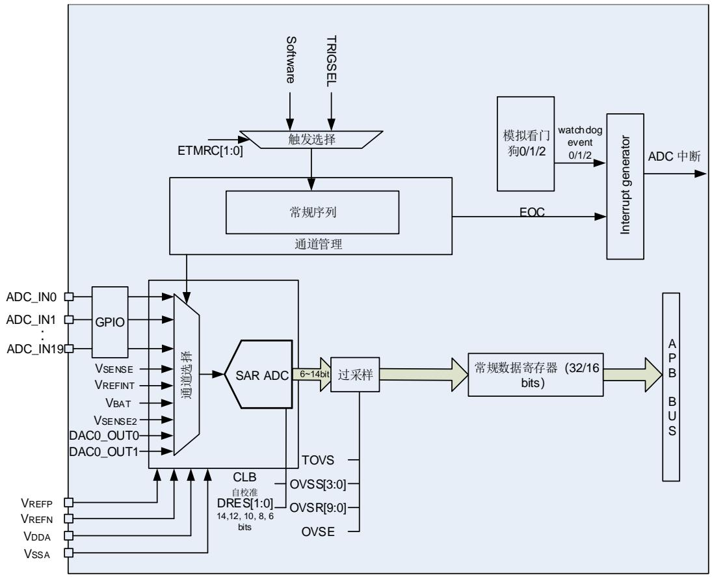

# 20.4.1. 前置校准功能

在前置校准期间，ADC 计算一个校准系数，这个系数是应用于 ADC 内部的，它直到 ADC 下次掉电才无效。在校准期间，应用不能使用 ADC，它必须等到校准完成。在 A/D 转换前应执行校准操作。通过软件设置 CLB=1 来对校准进行初始化，在校准期间 CLB 位会一直保持 1，直到校准完成，该位由硬件清 0。

校准模式分为失调+失配和失调两种（只针对 ADC0/1），可通过设置 ADC_CTL1 寄存器的CALMOD 位进行修改，推荐使用失调模式。

当 ADC 运行条件改变（例如，VDDA、VREFP 以及温度等），建议重新执行一次校准操作。

内部的模拟校准通过设置 ADC_CTL1 寄存器的 RSTCLB 位来重置。

软件校准过程：

1. 确保ADCON=1；

2. 延迟14个CK_ADC以等待ADC稳定；

3. 设置RSTCLB （可选的）；

4. 设置CLB=1；

5. 等待直到CLB=0。

# 20.4.2. 双时钟域架构

时钟控制器提供的 CK_ADC 时钟与 AHB 时钟同步。在此模式下，ADC_SYNCCTL 寄存器中的 ADCSCK[3:0]不能设置为 0000。分割因子可以是 2、4、6、8、10、12、14、16，ADC0 和ADC1 最大频率为 72 MHz，ADC2 最大频率为 80 MHz。

CK_ADC 也可以由 CK_PLL1P、CK_PLL2R 或 CK_PER 提供，后者可以是异步的，独立于AHB 时钟。在此模式下，ADC_SYNCCTL 中的 ADCSCK[3:0]应设置为 0000。可通过ADC_SYNCCTL 的 ADCCK[3:0]配置分割因子。

RCU 控制器具有专用于 ADC 时钟的可编程预分频器。

注意：ADC1 时钟共享 ADC0 时钟，当使用 ADC1 时，必须打开 ADC0 时钟，且只能通过 ADC0进行时钟分频。

# 20.4.3. ADCON 使能

ADC_CTL1 寄存器中的 ADCON 位是 ADC 模块的使能开关。如果该位为 0，则 ADC 模块保持复位状态。为了省电，当 ADCON 位为 0 时，ADC 模拟子模块将会进入掉电模式。ADC 使能后需等待 tSU时间后才能采样，tSU数值详见芯片数据手册。

# 20.4.4. 单端和差分输入通道

通过配置ADC_DIFCTL寄存器中的DIFCTL[21:0]位域，可以配置ADC通道为单端输入模式或差分输入模式。只有在ADC禁能（ADCON = 0）的情况下才能进行该配置。

单端输入模式下，通道n要转换的模拟电压是外部电压VINn（正输入）和VREFN（负输入）之间的差。差分输入模式下，通道n要转换的模拟电压是外部电压VINn（正输入）和通道m外部电压VINm（负输入）之间的差。差分通道引脚分配如 20-3. ADC 。

表 20-3. ADC 差分通道引脚匹配

<table><tr><td rowspan="2">差分通道n编号</td><td colspan="2">ADC0</td><td colspan="2">ADC1</td><td colspan="2">ADC2</td></tr><tr><td><eq>V_{INn}</eq>引脚</td><td><eq>V_{INm}</eq>引脚</td><td><eq>V_{INn}</eq>引脚</td><td><eq>V_{INm}</eq>引脚</td><td><eq>V_{INn}</eq>引脚</td><td><eq>V_{INm}</eq>引脚</td></tr><tr><td>0</td><td>PA0_C</td><td>PA1_C</td><td>PA0_C</td><td>PA1_C</td><td>PC2_C</td><td>PC3_C</td></tr><tr><td>1</td><td>PA1_C</td><td>PA0_C</td><td>PA1_C</td><td>PA0_C</td><td>PC3_C</td><td>PC2_C</td></tr><tr><td>2</td><td>PF11</td><td>PF12</td><td>PF13</td><td>PF14</td><td>PF9</td><td>PF10</td></tr><tr><td>3</td><td>PA6</td><td>PA7</td><td>PA6</td><td>PA7</td><td>PF7</td><td>PF8</td></tr><tr><td>4</td><td>PC4</td><td>PC5</td><td>PC4</td><td>PC5</td><td>PF5</td><td>PF6</td></tr><tr><td>5</td><td>PB1</td><td>PB0</td><td>PB1</td><td>PB0</td><td>PF3</td><td>PF4</td></tr><tr><td>6</td><td>PF12</td><td>PF11</td><td>PF14</td><td>PF13</td><td>PF10</td><td>PF9</td></tr><tr><td>7</td><td>PA7</td><td>PA6</td><td>PA7</td><td>PA6</td><td>PF8</td><td>PF7</td></tr><tr><td>8</td><td>PC5</td><td>PC4</td><td>PC5</td><td>PC4</td><td>PF6</td><td>PF5</td></tr><tr><td>9</td><td>PB0</td><td>PB1</td><td>PB0</td><td>PB1</td><td>PF4</td><td>PF3</td></tr><tr><td>10</td><td>PC0</td><td>PC1</td><td>PC0</td><td>PC1</td><td>PC0</td><td>PC1</td></tr><tr><td>11</td><td>PC1</td><td>PC2</td><td>PC1</td><td>PC2</td><td>PC1</td><td>PC2</td></tr><tr><td>12</td><td>PC2</td><td>PC3</td><td>PC2</td><td>PC3</td><td>PC2</td><td>PC1</td></tr><tr><td>13</td><td>PC3</td><td>PC2</td><td>PC3</td><td>PC2</td><td>PH2</td><td>PH3</td></tr><tr><td>14</td><td>PA2</td><td>PA3</td><td>PA2</td><td>PA3</td><td>PH3</td><td>PH4</td></tr><tr><td>15</td><td>PA3</td><td>PA2</td><td>PA3</td><td>PA2</td><td>PH4</td><td>PH5</td></tr><tr><td>16</td><td>PA0</td><td>PA1</td><td>null</td><td>null</td><td>PH5</td><td>PH4</td></tr><tr><td>17</td><td>PA1</td><td>PA0</td><td>null</td><td>null</td><td>null</td><td>null</td></tr><tr><td>18</td><td>PA4</td><td>PA5</td><td>PA4</td><td>PA5</td><td>null</td><td>null</td></tr><tr><td>19</td><td>PA5</td><td>PA4</td><td>PA5</td><td>PA4</td><td>null</td><td>null</td></tr><tr><td>20</td><td>null</td><td>null</td><td>null</td><td>null</td><td>null</td><td>null</td></tr><tr><td>21</td><td>null</td><td>null</td><td>null</td><td>null</td><td>null</td><td>null</td></tr></table>

当通道n用于差分输入模式时，两个通道的输入电压应为差分信号（共模电压为VREFP/2），电压输入范围仍为（VREFN~VREFP）。

以右对齐，12位分辨率为例，

1) 当VINn为VREFP，VINm为VREFN时，通道n的转换结果为0x0FFF；

2) 当VINn为VREFN，VINm为VREFP时，通道n的转换结果为0x0000；

3) 当VINn为VREFP/2，VINm为VREFP/2时，通道n的转换结果为0x07FF。

Dout是ADC通道n的转换结果，则通道n转换的差分电压为：

$$
V _ {I N n} - V _ {I N m} = V _ {R E F P} ^ {*} \left(2 ^ {*} D _ {\text {out}} / 4 0 9 5 - 1\right) \tag {20-1}
$$

# 20.4.5. 常规序列

通道管理电路可以将采样通道组织成一个序列：常规序列。常规序列支持最多 21 个通道，每个通道称为常规通道。

ADC_RSQ0~ADC_RSQ8 寄存器规定了常规序列的通道选择。ADC_RSQ0 寄存器的 RL[3:0]位规定了整个常规序列的长度。

注意：尽管 ADC 支持 21 个通道，但常规序列一次最多转换 16 个通道。

# 20.4.6. 运行模式

# 单次运行模式

单次运行模式下，ADC_RSQ8 寄存器的 RSQ0[4:0]位规定了 ADC 的转换通道。当 ADCON 位被置 1，一旦相应软件触发或者 TRIGSEL 触发发生，ADC 就会采样和转换一个通道。

图 20-2. 单次运行模式

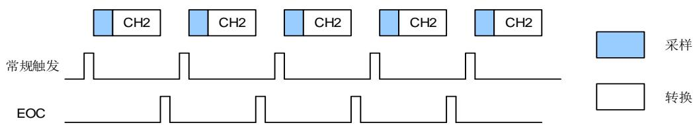

常规通道单次转换结束后，转换数据将被存放于 ADC_RDATA 寄存器中，EOC 将会置 1。如果 EOCIE 位被置 1，将产生一个中断。

常规序列单次运行模式的软件流程：

1. 确保ADC_CTL0寄存器的DISRC和SM位以及ADC_CTL1寄存器的CTN位为0；

2. 用模拟通道编号来配置RSQ0；

3. 配置ADC_RSQx寄存器；

4. 如果有需要，可以配置ADC_CTL1寄存器的ETMRC[1:0]位；

5. 设置SWRCST位，或者为常规序列产生一个TRIGSEL触发信号；

6. 等到EOC置1；

7. 从ADC_RDATA寄存器中读ADC转换结果；

8. 写0清除EOC标志位。

# 连续运行模式

对 ADC_CTL1 寄存器的 CTN 位置 1 可以使能连续运行模式。在此模式下，ADC 执行由 RSQ0规定的转换通道。当 ADCON 位被置 1，一旦相应软件触发或者 TRIGSEL 触发产生，ADC 就会采样和转换规定的通道。转换数据保存在 ADC_RDATA寄存器中。

图 20-3. 连续运行模式

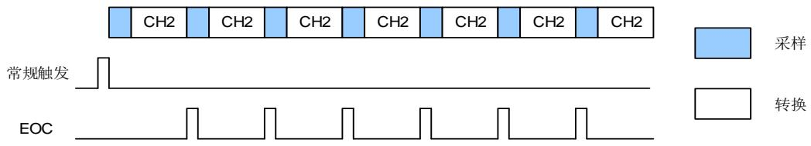

常规序列连续运行模式的软件流程：

1. 设置ADC_CTL1寄存器的CTN位为1；

2. 根据模拟通道编号配置RSQ0；

3. 配置ADC_RSQx寄存器；

4. 如果有需要，配置ADC_CTL1寄存器的ETMRC[1:0]位；

5. 设置SWRCST位，或者给常规序列产生一个TRIGSEL触发信号；

6. 等待EOC标志位置1；

7. 从ADC_RDATA寄存器中读ADC转换结果；

8. 写0清除EOC标志位；

9. 只要还需要进行连续转换，重复步骤6~8。

由于要循环查询 EOC 标志位，DMA可以被用来传输转换数据，软件流程如下：

1. 设置ADC_CTL1寄存器的CTN位为1；

2. 根据模拟通道编号配置RSQ0；

3. 配置ADC_RSQx寄存器；

4. 如果有需要，配置ADC_CTL1寄存器的ETMRC[1:0]位；

5. 准备DMA模块，用于传输来自ADC_RDATA的数据；

6. 设置SWRCST位，或者给常规序列产生一个TRIGSEL触发。

# 扫描运行模式

扫描运行模式可以通过将 ADC_CTL0 寄存器的 SM 位置 1 来使能。在此模式下，ADC 扫描转换所有被 ADC_RSQ0~ADC_RSQ8 寄存器选中的所有通道。一旦 ADCON 位被置 1，当相应软件触发或者 TRIGSEL 触发产生，ADC 就会一个接一个的采样和转换常规序列通道。转换数据存储在 ADC_RDATA 寄存器中。常规序列转换结束后，EOC 位将被置 1。如果 EOCIE 位被置 1，将产生中断。当常规序列工作在扫描模式下时，ADC_CTL1 寄存器的 DMA 位必须设置为 1。

如果 ADC_CTL1 寄存器的 CTN 位也被置 1，则在常规序列转换完之后，这个转换自动重新开始。

图 20-4. 扫描运行模式，且连续运行模式失能

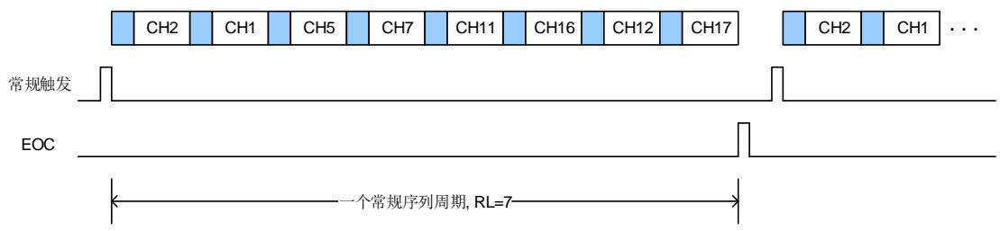

常规序列扫描运行模式的软件流程：

1. 设置 ADC_CTL0 寄存器的 SM 位和 ADC_CTL1 寄存器的 DMA 位为 1；

2. 配置 ADC_RSQx 寄存器；

3. 如果有需要，配置 ADC_CTL1 寄存器中的 ETMRC[1:0]位；

4. 准备 DMA 模块，用于传输来自 ADC_RDATA 的数据（参考 DMA 模块）；

5. 设置 SWRCST 位，或者给常规序列产生一个 TRIGSEL 触发；

6. 等待 EOC 标志位置 1；

7. 写 0 清除 EOC 标志位。

图 20-5. 扫描运行模式，连续运行模式使能

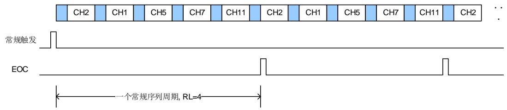

# 间断运行模式

ADC_CTL0 寄存器的 DISRC 位置 1 时，常规序列使能间断运行模式。该模式下可以执行一次n 个通道的短序列转换（n 不超过 8），该序列是 ADC_RSQ0~ADC_RSQ8 寄存器所选择的转换序列的一部分。数值 n 由 ADC_CTL0 寄存器的 DISCNUM[2:0]位配置。当相应的软件触发或 TRIGSEL 触发发生，ADC 就会采样和转换在 ADC_RSQ0~ADC_RSQ8 寄存器所选择通道中接下来的 n 个通道，直到常规序列中所有的通道转换完成。每个常规序列转换周期结束后，EOC 位将被置 1。如果 EOCIE位被置 1 将产生一个中断。

图 20-6. 间断运行模式

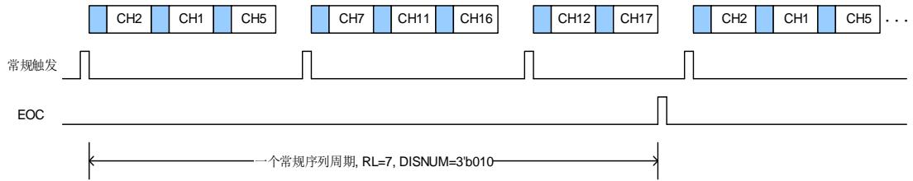

常规序列断模式的软件流程：

1. 设置 ADC_CTL0 寄存器的 DISRC 位和 ADC_CTL1 寄存器的 DMA 位为 1；

2. 配置 ADC_CTL0 寄存器的 DISNUM[2:0]位；

3. 配置 ADC_RSQx 寄存器；

4. 如果有需要，配置 ADC_CTL1 寄存器中的 ETMR[1:0]位；

5. 准备 DMA 模块，用于传输来自 ADC_RDATA 的数据（参考 DMA 模块）；

6. 设置 SWRCST 位，或者给常规序列产生一个 TRIGSE 触发；

7. 如果需要，重复步骤 6；

8. 等待 EOC 标志位置 1；

9. 写 0 清除 EOC 标志位。

# 20.4.7. 转换结果阈值监测功能

# 模拟看门狗 0

配置 ADC_CTL0 寄存器的 RWD0EN 位为 1，可使能常规序列的模拟看门狗功能 0。

如果 ADC 的模拟转换电压低于低阈值或高于高阈值时，ADC_STAT 状态寄存器的 WDE0 位将置 1。若 WDE0IE 位置 1，将产生中断。ADC_WDHT0 和 ADC_WDLT0 寄存器用来设定高低阈值。内部数据的比较在对齐之前完成，因此阀值与 ADC_CTL1 寄存器的 DAL 位确定的对齐方式无关。ADC_CTL0 寄存器的 RWD0EN，WD0SC 和 WD0CHSEL[4:0]位可以用来选择模拟看门狗 0 监控单一通道或者多个通道。

# 模拟看门狗 1/2

模拟看门狗 1/2 更加的灵活，可以进行单个或多个通道的看门狗功能配置。

通过配置 ADC_WD1SR 寄存器中的 AWD1CS[21:0]位域中的相应位，可以使能相应通道的模拟看门狗 1 功能，同理，可以配置看门狗 2 功能。模拟看门狗 1/2 的高/低阈值可在 ADC_WDLT1,ADC_WDHT1, ADC_WDLT2 和 ADC_WDHT2 寄存器中进行配置。

注：对于 ADC0/1，如果 OVSEN=1，模拟看门狗 0/1/2 可以将转换的模拟电压（过采样后）与低阈值或高阈值进行比较。如果 OVSEN=0，模拟看门狗 0/1/2 可以将转换的模拟电压（过采样前）与低阈值或高阈值进行比较。

# 20.4.8. 数据存储模式

ADC_CTL1 寄存器的 DAL 位确定转换后数据存储的对齐方式。

图 20-7. 14 位数据存储模式

常规通道数据

<table><tr><td>0</td><td>0</td><td>D13</td><td>D12</td><td>D11</td><td>D10</td><td>D9</td><td>D8</td><td>D7</td><td>D6</td><td>D5</td><td>D4</td><td>D3</td><td>D2</td><td>D1</td><td>D0</td></tr></table>

${ \sf D A L } = 0$

常规通道数据

<table><tr><td>D13</td><td>D12</td><td>D11</td><td>D10</td><td>D9</td><td>D8</td><td>D7</td><td>D6</td><td>D5</td><td>D4</td><td>D3</td><td>D2</td><td>D1</td><td>D0</td><td>0</td><td>0</td></tr></table>

$\mathsf { D } \mathsf { A } \mathsf { L } = \mathsf { 1 }$

图 20-8. 12 位数据存储模式

常规通道数据

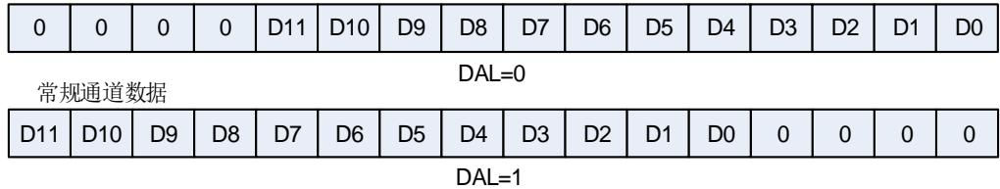

6 位分辨率的数据存储模式不同于 14 位/12 位/10 位/8 位分辨率数据存储模式，如 20-9. 6位数据存储模式。

图 20-9. 6 位数据存储模式

常规通道数据

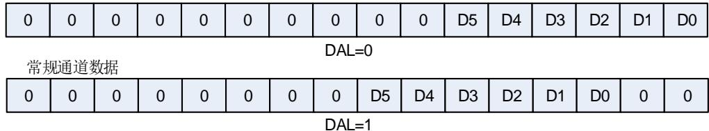

注意： ADC_OVSAMPCTL 寄存器中的 OVSEN 置位时，ADC_CTL1 寄存器中的 DAL 位值将被忽略，ADC 仅支持 LSB对齐。

# 20.4.9. 采样时间配置

ADC 使用若干个 CK_ADC 周期对输入电压采样，采样周期数目可以通过 ADC_RSQ0~ADC_RSQ8 寄存器的 RSMPn[9:0]位更改。每个序列可以用不同的时间采样。例如，在 12 位分辨率的情况下，总转换时间=采样时间+12.5 个 CK_ADC 周期。

例如：

CK_ADC = 40MHz ，采样时间为 3.5 个周期，那么总的转换时间为：“3.5+12.5”个 CK_ADC周期，即 0.4us。

# 20.4.10. 外部触发配置

常规通道的转换可通过 TRIGSEL 的上升沿或软件触发。触发源由 ADC_CTL1 寄存器中的ETMRC[1:0]位控制。

表 20-4. ADC0/ADC1/ADC2 常规通道的触发源

<table><tr><td>ETMRC[1:0]</td><td>触发源</td><td>触发类型</td></tr><tr><td>01, 10, 11</td><td>TRIGSEL</td><td>来自TRIGSEL的信号</td></tr><tr><td>00</td><td>SWRCST</td><td>软件触发</td></tr></table>

# 20.4.11. DMA 请求

DMA请求，可以通过设置 ADC_CTL1 寄存器的 DMA 位来使能，它用于常规序列多个通道的转换结果。ADC 在常规序列一个通道转换结束后产生一个 DMA 请求，DMA 接受到请求后可以将转换的数据从 ADC_RDATA 寄存器传输到用户指定的目的地址。

# 20.4.12. 溢出检测

当 DMA 使能的时候，将 ADC_CTL1 寄存器的 EOCM 位置 1 可以使能溢出检测。如果一个常规转换在上一个常规转换数据读出之前已经完成，则会产生一个溢出事件，相应的 ADC_STAT状态寄存器的 ROVF 标志位会置位。如果 ADC_CTL0 寄存器的 ROVFIE 置位，溢出中断产生。

为了使得 ADC 从 ROVF 溢出状态中恢复过来，建议对 DMA 模块重新进行初始化。内部状态机复位，以保证常规转换数据正确的传输。ADC 转换将会停止，直到 ROVF 位被清零。

ADC 从 ROVF 状态恢复的软件流程如下：

1. 将 ADC_CTL1 寄存器的 DMA 位清 0；

2. 将 ADC_CTL1 寄存器的 ADCON 位清 0；

3. 将 DMA_CHxCTL 寄存器的 CHEN 位清 0，用于重新初始化 DMA 模块；

4. 将 ADC_STAT 寄存器的 ROVF 位清 0；

5. 将 DMA_CHxCTL 寄存器的 CHEN 位置 1；

6. 将 ADC_CTL1 寄存器的 DMA 位置 1；

7. 将 ADC_CTL1 的 ADCON 位置 1；

8. 等待 T（setup）；

9. 通过软件或触发开始 ADC 转换。

# 20.4.13. ADC 内部通道

将 ADC_CTL1 寄存器的 TSVEN1 位置 1 可以使能温度传感器通道（ADC2_CH18），将ADC_CTL1 寄存器的 TSVEN2 位置 1 可以使能高精度温度传感器通道（ADC2_CH20）。将ADC_CTL1 寄 存 器 的 INREFEN 位 置 1 可 以 使 能 内 部 电 压 参 考 通 道（ADC1_CH17/ADC2_CH19）。温度传感器可以用来测量器件周围的温度。传感器输出电压能被 ADC 转换成数字量。建议温度传感器的采样时间至少设置为 ts_temp µs（具体数值请参考datasheet 文档）。温度传感器不用时，复位 TSVEN1 和 TSVEN2，可以将其置于掉电模式。

温度传感器（只针对普通温度传感器）的输出电压随温度会发生线性变化，由于芯片生产过程的多样化，温度变化曲线的偏差在芯片间会有不同（最多相差 45°C）。内部温度传感器更适用于检测温度的变化，而不是用于测量绝对温度。如果需要测量精确的温度，应该使用一个外置的温度传感器来校准这个偏移错误。

内部电压参考（VREFINT）提供了一个稳定的（带隙基准）电压输出给 ADC 和比较器。VREFINT内部连接到 ADC1_CH17/ADC2_CH19 输入通道。

使用温度传感器：

1．配置温度传感器通道（ADC2_IN18）的转换序列和采样时间为 ts_temp us；

2．置位 ADC_CTL1 寄存器中的 TSVEN1 位，使能温度传感器；

3．置位 ADC_CTL1 寄存器的 ADCON 位，或者由外部触发 ADC 转换；

4．从 ADC 数据寄存器中读取并计算温度传感器数据 Vtemperature，并由下面公式计算出实际温度：

$$
\text { 温度 } \left(^ {\circ} \mathrm{C}\right) = \left\{\left(\mathrm{V} _ {2 5} - \mathrm{V} _ {\text { temperature }}\right) / \text { Avg\_Slope } \right\} + 2 5
$$

V25：内部温度传感器在 25°C 下的电压，典型值及出厂校准值地址请参考 datasheet（参

考 Temperature sensor characteristics 章节）。

Avg_Slope：温度与内部温度传感器电压曲线的均值斜率，典型值请参考 datasheet（参考 Temperature sensor characteristics 章节）。

使用高精度温度传感器：

1．配置 ADC 时钟（不超过 5MHz）；

2．配置温度传感器通道（ADC2_CH20）的转换序列和采样时间为 ts_temp us；

3．置位 ADC_CTL1 寄存器中的 TSVEN2 位，使能温度传感器；

4．置位 ADC_CTL1 寄存器的 ADCON 位，或者由外部触发 ADC 转换；

5．从 ADC 数据寄存器中读取并计算温度传感器数据 Vtemperature，并由下面公式计算出实际温度：

$$
\text { 温度 } \left(^ {\circ} \mathrm{C}\right) = \left\{\left(\mathrm{V} _ {\text { temperature }} - \mathrm{V} _ {2 5}\right) / \text { Avg\_Slope } \right\} + 2 5
$$

V25：内部温度传感器在 25°C 下的电压，典型值及出厂校准值地址请参考 datasheet（参考 High-precision temperature sensor characteristics 章节）。

Avg_Slope：温度与内部温度传感器电压曲线的均值斜率，典型值请参考 datasheet（参考 High-precision temperature sensor characteristics 章节）。

# 注意：

1) 当高精度温度传感器使能，至少需要等待 3 个 ADC 采样周期，前三个转换数据应当被舍弃；

2) 可以通过过采样和软件平均提高高精度温度传感器准确度。

# 20.4.14. 电池电压检测电路

VBAT通道可用于测量 VBAT引脚上的备用电池电压。当 ADC_CTL1 寄存器中的 VBATEN 位置位时，VBAT通道（ADC1_IN16/ADC2_IN17）被启用，集成在 VBAT引脚上的 4 分压桥也被自动启用。由于 VBAT可能高于 VDDA，此桥用于确保 ADC 正确运行。它将 VBAT/4 连接到 16/17 输入通道中的 ADC1_IN16/ ADC2_IN17。因此，转换后的数字值为 VBAT/4。为了防止不必要的电池能耗，建议仅在需要时启用桥接器。

# 20.4.15. 使用 HPDF 管理转换结果

高性能数字滤波器（HPDF）可用于管理 ADC 转换结果。在这种情况下，HPDFCFG 位必须置1，DMA位必须清除为 0。ADC 将常规序列数据寄存器数据的 16 个最低有效位传输到 HPDF，一旦传输完成，HPDF 将重置 EOC 标志。如 20-10. HFDF ADC所示。

图 20-10. HFDF 与 ADC 模块握手信号示意图

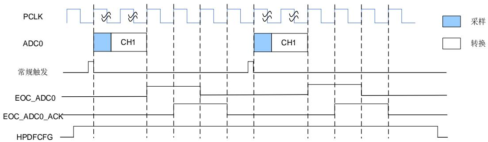

# 20.4.16. 可编程分辨率（DRES）

对寄存器 ADC_CTL0 中的 DRES[1:0]位进行编程即可配置分辨率为 6、8、10、12 及 14 位。对于那些不需要高精度数据的应用，可以使用较低的分辨率来实现更快速地转换。只有在ADCON 位为 0 时，才能修改 DRES[1:0]的值。较低的分辨率能够减少转换时间。如图 20-5.ADC0 ADC1 tCONV 和 20-6. ADC2tCONV 所示，较低的分辨率能够减少逐次逼近步骤所需的转换时间 tADC。

表 20-5. ADC0 和 ADC1 不同分辨率对应的 tCONV时间

<table><tr><td>DRES[1:0] bits</td><td>tCONV(ADC clock cycles)</td><td>tCONV(ns) at fADC=72MHz</td><td>tSMPL(min)(ADC clock cycles)</td><td>tADC(ADC clock cycles)</td><td>tADC(ns) at fADC=72MHz</td></tr><tr><td>14</td><td>14.5</td><td>201.39 ns</td><td>3.5</td><td>18</td><td>250 ns</td></tr><tr><td>12</td><td>12.5</td><td>173.61 ns</td><td>3.5.</td><td>16</td><td>222.22 ns</td></tr><tr><td>10</td><td>10.5</td><td>145.83 ns</td><td>3.5</td><td>14</td><td>194.44 ns</td></tr><tr><td>8</td><td>8.5</td><td>118.06 ns</td><td>3.5</td><td>12</td><td>166.67 ns</td></tr></table>

表 20-6. ADC2 不同分辨率对应的 tCONV时间

<table><tr><td>DRES[1:0] bits</td><td>tCONV(ADC clock cycles)</td><td>tCONV(ns) at fADC=80MHz</td><td>tSMPL(min)(ADC clock cycles)</td><td>tADC(ADC clock cycles)</td><td>tADC(ns) at fADC=80MHz</td></tr><tr><td>12</td><td>12.5</td><td>156.25 ns</td><td>2.5</td><td>15</td><td>187.5 ns</td></tr><tr><td>10</td><td>10.5</td><td>121.25 ns</td><td>2.5</td><td>13</td><td>162.5 ns</td></tr><tr><td>8</td><td>8.5</td><td>106.25ns</td><td>2.5</td><td>11</td><td>137.5ns</td></tr><tr><td>6</td><td>6.5</td><td>81.25 ns</td><td>2.5</td><td>9</td><td>112.5ns</td></tr></table>

# 20.4.17. 片上硬件过采样

片上硬件过采样单元执行数据预处理以减轻 CPU 负担。它能够处理多个转换，并将多个转换的结果取平均，增加数据宽度，在 ADC0 和 ADC1 中最高可达 32 位，在 ADC2 中高达 16 位。其结果值根据如下公式计算得出，其中 N 和 M 的值可以被调整，过采样单元可以通过设置ADC_OVSAMPCTL 寄存器的 OVSEN 位来使能，它是以降低数据输出率为代价，换取较高的数据分辨率。Dout(n)是指 ADC 输出的第 n 个数字信号：

$$
\text { Result } = \frac {1}{M} * \sum_ {n = 0} ^ {N - 1} D _ {\text { out }} (n) \tag {20-2}
$$

对于 14 位 ADC，片上硬件过采样单元执行两个功能：求和和位右移。过采样率 N 是在ADC_OVSAMPCTL 寄存器的 OVSR[9:0]位定义，它的取值范围为 2x 到 1024x。除法系数 M定义一个多达 11 位的右移，它通过 ADC_OVSAMPCTL 寄存器 OVSS[3:0]位进行配置。

对于 14 位 ADC，求和单元能够生成一个多达 24 位（1024 x 14 位）的值，该结果首先右移。然后将数据存储到寄存器中

对于 12 位 ADC，片上硬件过采样单元执行两个功能：求和和位右移。过采样率 N 是在ADC_OVSAMPCTL 寄存器的 OVSR[7:0]位定义，它的取值范围为 2x 到 256x。除法系数 M定义一个多达 8 位的右移，它通过 ADC_OVSAMPCTL 寄存器 OVSS[3:0]位进行配置。

对于 12 位 ADC，求和单元能够生成一个多达 20 位（256*12 位）的值。首先，将这个值要进行右移，将移位后剩余的部分再通过取整转化一个近似值，最后将高位会被截断，仅保留最低16 位有效位作为最终值传入对应的数据寄存器中。

图 20-11. 12 位 ADC 20 位到 16 位的结果截断

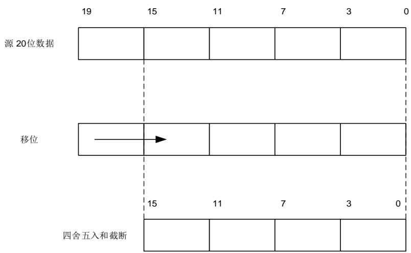

注意：如果移位后的中间结果还是超过 16 位，那么该结果的高位就会被直接截掉。

20-11. 12 ADC 20 16 描述一个从原始 20 位的累积数值处理成 16位结果值的例子。

图 20-12. 12 位 ADC 右移 5 位和取整的数例

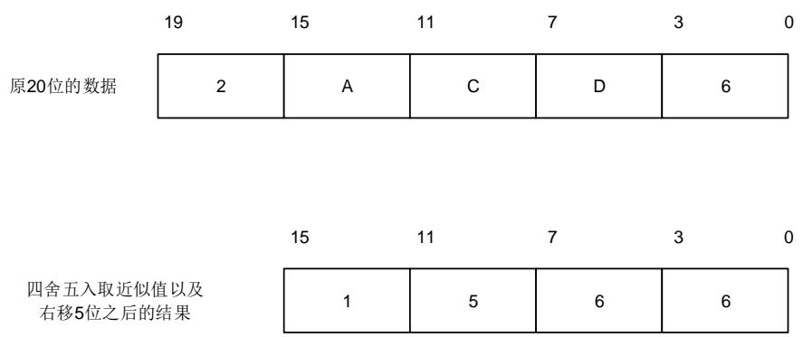

图 20-13. 14 位 ADC 过采样右移 10 位

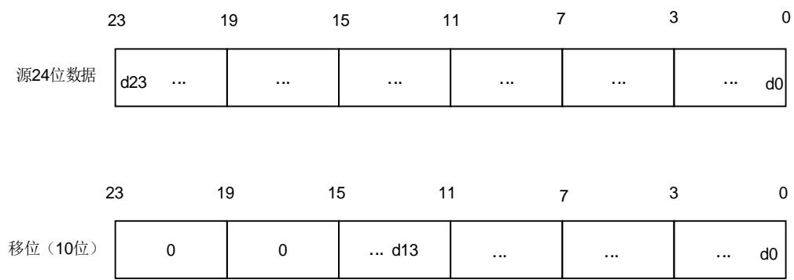

图 20-14. 数值例子 14 位 ADC 过采样右移 10 位

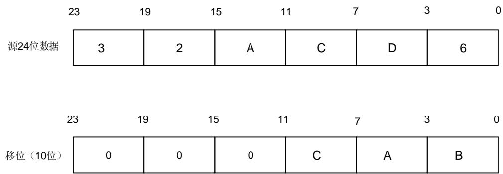

20-7. 12 ADC N M 给出了 N 和 M各种组合的数据格式，初始转换值为 0xFFF。

表 20-7. 12 位 ADC 部分举例 N 和 M 的最大输出值（灰色部分表示截断）

<table><tr><td>Oversampling ratio</td><td>Max Raw data</td><td>No-shift OVSS=0000</td><td>1-bit shift OVSS=0001</td><td>2-bit shift OVSS=0010</td><td>3-bit shift OVSS=0011</td><td>4-bit shift OVSS=0100</td><td>5-bit shift OVSS=0101</td><td>6-bit shift OVSS=0110</td><td>7-bit shift OVSS=0111</td><td>8-bit shift OVSS=1000</td></tr><tr><td>2x</td><td>0x1FFE</td><td>0x1FFE</td><td>0x0FFF</td><td>0x07FF</td><td>0x03FF</td><td>0x01FF</td><td>0x00FF</td><td>0x007F</td><td>0x003F</td><td>0x001F</td></tr><tr><td>4x</td><td>0x3FFC</td><td>0x3FFC</td><td>0x1FFE</td><td>0x0FFF</td><td>0x07FF</td><td>0x03FF</td><td>0x01FF</td><td>0x00FF</td><td>0x007F</td><td>0x003F</td></tr><tr><td>8x</td><td>0x7FF8</td><td>0x7FF8</td><td>0x3FFC</td><td>0x1FFE</td><td>0x0FFF</td><td>0x07FF</td><td>0x03FF</td><td>0x01FF</td><td>0x00FF</td><td>0x007F</td></tr><tr><td>16x</td><td>0xFFFF0</td><td>0xFFFF0</td><td>0x7FF8</td><td>0x3FFC</td><td>0x1FFE</td><td>0x0FFF</td><td>0x07FF</td><td>0x03FF</td><td>0x01FF</td><td>0x00FF</td></tr><tr><td>32x</td><td>0x1FFE0</td><td>0xFFE0</td><td>0xFFFF0</td><td>0x7FF8</td><td>0x3FFC</td><td>0x1FFE</td><td>0x0FFF</td><td>0x07FF</td><td>0x03FF</td><td>0x01FF</td></tr><tr><td>64x</td><td>0x3FFC0</td><td>0xFFC0</td><td>0xFFE0</td><td>0xFFF0</td><td>0x7FF8</td><td>0x3FFC</td><td>0x1FFE</td><td>0x0FFF</td><td>0x07FF</td><td>0x03FF</td></tr><tr><td>128x</td><td>0x7FF80</td><td>0xFF80</td><td>0xFFC0</td><td>0xFFE0</td><td>0xFFF0</td><td>0x7FF8</td><td>0x3FFC</td><td>0x1FFE</td><td>0x0FFF</td><td>0x07FF</td></tr><tr><td>256x</td><td>0xFFFF00</td><td>0xFF00</td><td>0xFF80</td><td>0xFFC0</td><td>0xFFE0</td><td>0xFFF0</td><td>0x7FF8</td><td>0x3FFC</td><td>0x1FFE</td><td>0x0FFF</td></tr><tr><td>512x</td><td>0x1FFE00</td><td>0xFE00</td><td>0xFF00</td><td>0xFF80</td><td>0xFFC0</td><td>0xFFE0</td><td>0xFFF0</td><td>0x7FF8</td><td>0x3FFC</td><td>0x1FFE</td></tr><tr><td>1024x</td><td>0x3FFC00</td><td>0xFC00</td><td>0xFE00</td><td>0xFF00</td><td>0xFF80</td><td>0xFFC0</td><td>0xFFE0</td><td>0xFFF0</td><td>0x7FF8</td><td>0x3FFC</td></tr></table>

和标准的转换模式相比，过采样模式的转换时间不会改变：在整个过采样序列的过程中采样时间仍然保持相等。每 N 个转换就会产生一个新的数据，一个等价的延迟为：

$$
N ^ {*} t _ {A D C} = N ^ {*} \left(t _ {S M P L} + t _ {C O N V}\right) \tag {20-3}
$$

# 20.5. ADC同步模式

在具有两个 ADC 的设备上，可以使用 ADC 同步模式。

在 ADC 同步模式中，通过 ADC0 的触发器来同步 ADC1 的转换。根据 ADC_SYNCCTL 寄存器的 SYNCM[3:0]位来选择两个 ADC 的并行模式。

在 ADC 同步模式中，当转换配置成外部事件触发时，ADC1 的外部触发必须失能。常规序列通道的转换结果存储在ADC同步常规数据寄存器（ADC_SYNCDATA0或ADC_SYNCDATA1）中。

ADC 同步模式如 20-8. ADC 所示。

表 20-8. ADC 同步模式表

<table><tr><td>SYNCM[3: 0]</td><td>mode</td></tr><tr><td>0000</td><td>独立模式</td></tr><tr><td>0110</td><td>常规并行模式</td></tr><tr><td>0111</td><td>常规跟随模式</td></tr></table>

当 ADC 工作在同步模式，而非独立模式时，如果需要再将 ADC 配置成其他同步模式，则需要在配置成其他同步模式前，首先将 ADC 配置成独立模式。

ADC 同步框图如 20-15. ADC 所示。

图 20-15. ADC 同步框图

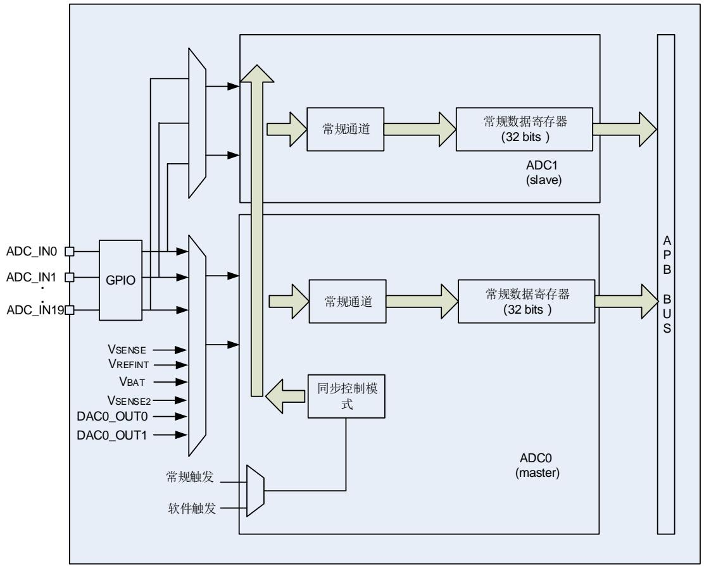

# 20.5.1. 独立模式

在这种模式下，ADC 同步是忽略的，每个 ADC 都独立工作。

# 20.5.2. 常规并行模式

设置 ADC_SYNCCTL 寄存器的 SYNCM[3:0]位为 0110，使能常规并行模式。在常规并行模式中，根据 ADC0 中选择的外部触发，所有的 ADC 并行的转换常规序列通道。触发选择由 ADC0的 ADC_CTL1 寄存器 ETMRC[1:0]位进行配置。

根据 ADC_CTL1 寄存器中的 EOCM 位的设置，在转换结束时产生 EOC 中断（如果 ADC 接口使能了该中断）。常规并模式的行为如 20-16. 16 所示。

图 20-16. 基于 16 个通道的常规并行模式

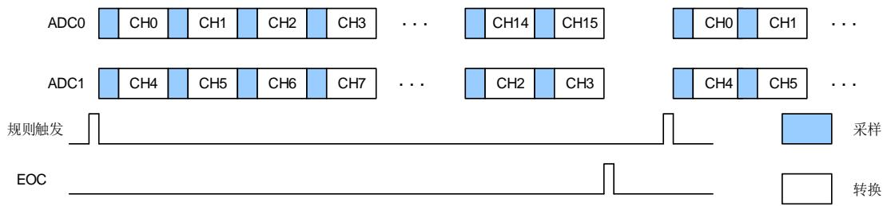

# 注意：

1. 若两个 ADC 模块使用了相同的采样通道，应保证不在同一时间使用该通道；

2. 两个 ADC 在同一时刻采样的两个通道，应该配置相同的采样时间。

# 20.5.3. 常规跟随模式

设置 ADC_SYNCCTL 寄存器的 SYNCM[3:0]位为 0111，使能常规跟随模式。在跟随模式中，根据选择的外部触发，ADC0 开始转换常规序列通道。外部触发选择由 ADC0 的 ADC_CTL1寄存器 ETMRC[1:0]位进行配置。经过一定的延迟之后，ADC1 开始转换常规序列通道。以上描述中提到的常规序列只能包含一个常规通道。

在两个连续采样阶段之间的延迟时间，由 ADC_SYNCCTL 寄存器的 SYNCDLY[3:0]位进行配置。如果 SYNCDLY[3:0]位配置的延迟时间比采样时间还短，为了避免在一个给定时间，多个ADC 对同一个通道进行采样，会将（采样时间 + 2）CK_ADC 周期作为实际的延迟时间。

如果ADC_CTL1寄存器的CNT位置1，选择的常规序列通道会被连续的转换。根据ADC_CTL1寄存器的 EOCM 的配置，在转换事件结束时产生 EOC 中断（如果 ADC 使能了该中断）。跟随模式的行为如 20-17. 所示。

图 20-17. 一个采用连续运行模式通道上的常规跟随模式

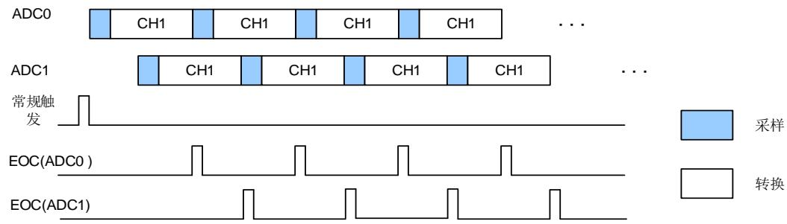

# 注意：

1. 在一个给定的时间，两个 ADC 不能同时转换同一个通道。（当转换同一通道时，不能覆盖采样时间）；

2. 确保在没有任何一个 ADC 在进行转换的时候才触发 ADC。

# 20.5.4. 在 ADC同步模式中使用 DMA

在 ADC 同步模式中，常规序列通道转换的数据存储在 ADC 同步常规数据寄存器（ADC_SYNCDATA0 or ADC_SYNCDATA1）中，DMA 可以用来传输 ADC_SYNCDATA0 orADC_SYNCDATA1 寄存器的数据。有以下两种 DMA 工作模式，可以和各种 ADC 同步模式很好地配合使用。

# ADC 同步 DMA 模式 0

在 ADC 同步 DMA模式 0 中，DMA传输的位宽为 32。一次 DMA 请求传输一个数据，这个数据轮流的从各 ADC 的常规转换结果中取出。对于每次 DMA 请求，DMA 通道的源地址固定为ADC_SYNCDATA1 寄存器，而这个寄存器的内容会变成 DMA 要被传输的数值。当 ADC0 和ADC1 工作在同步模式时，DMA 的传输序列为：ADC0_RDATA[31:0] -> ADC1_RDATA[31:0]-> ADC0_RDATA[31:0] -> ADC1_RDATA[31:0]。

ADC 同步 DMA 模式 0 适用于：

ADC0 和 ADC1 工作在常规并行模式（SYNCM=0110）。

# ADC 同步 DMA 模式 1

在 ADC 同步 DMA模式 1 中，DMA传输的位宽为 32。一次 DMA 请求传输两个数据，这些数据轮流的从各 ADC 的常规序列转换结果中取出。对于每次 DMA请求，DMA通道的源地址固定为 ADC_SYNCDATA0 寄存器，而这个寄存器的内容会变成 DMA 要被传输的数值。当 ADC0和 ADC1 工 作 在 同 步 模 式 时 ， DMA 的 数 据 每 次 都 为 ： {ADC1_RDATA[15:0],ADC0_RDATA[15:0]}。

ADC 同步 DMA 模式 1 适用于：

ADC0 和 ADC1 工作在常规并行模式（SYNCM=0110）；

ADC0 和 ADC1 工作在常规跟随模式（SYNCM=0111）。

# 20.6. 中断

以下任一个事件发生都可以产生中断：

常规序列转换结束；

模拟看门狗事件；

溢出事件。

ADC0和ADC1都被映射到同一个中断向量IRQ18，ADC2映射到中断向量IRQ127。

