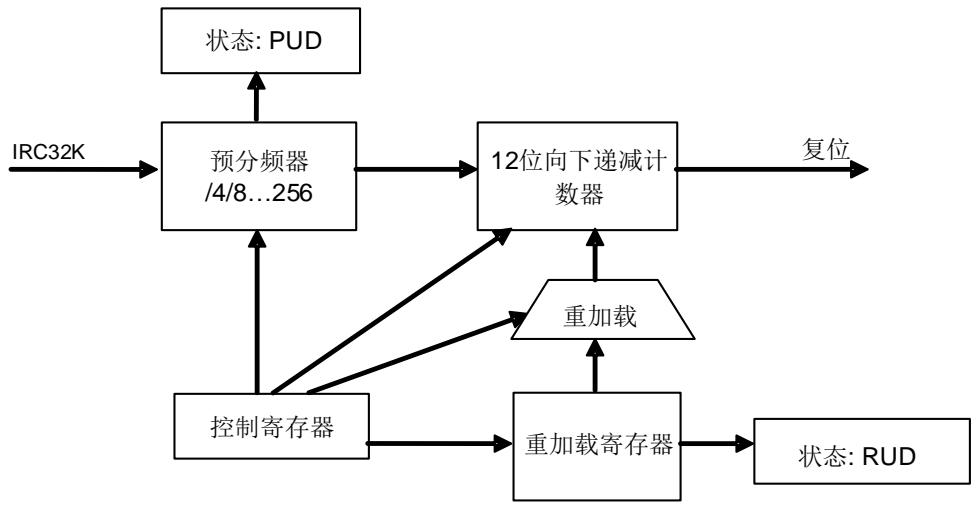

# 22.1. 独立看门狗定时器（FWDGT）

# 22.1.1. 简介

独立看门狗定时器（FWDGT）有独立时钟源（IRC32K）。因此，即使主时钟失效了，它仍然能保持工作状态，这非常适合于需要独立环境且对计时精度要求不高的场合。

当内部向下计数器的计数值达到0或计数器的值大于窗口寄存器的值，刷新计数器，独立看门狗会产生一个复位。使能独立看门狗的寄存器写保护功能可以避免寄存器的值被意外的配置篡改。

# 22.1.2. 主要特征

独立运行的12位向下计数器。

如果看门狗定时器被使能，有以下两种情况下会产生复位：

当计数器到0时产生复位；

当计数器的值大于窗口寄存器的值时，更新计数器会产生复位。

独立时钟源，独立看门狗定时器在主时钟故障（例如待机和深度睡眠模式下）时仍能工作。

独立看门狗定时器硬件控制位，可以用来控制是否在上电时自动启动独立看门狗定时器。

可以配置独立看门狗定时器在调试模式下选择停止还是继续工作。

通过配置FWDGSPD_STDBY或FWDGSPD_DPSLP, 在待机模式或深度睡眠模式中，FWDGT可以停止工作或唤醒控制器继续工作。

# 22.1.3. 功能说明

独立看门狗定时器带有一个 8 级预分频器和一个 12 位的向下递减计数器。参考 22-1.的独立看门狗定时器的功能模块。

图 22-1. 独立看门狗定时器框图

向控制寄存器（FWDGT_CTL）中写0xCCCC可以开启独立看门狗定时器，计数器开始向下计数。当计数器记到0x000，产生一次复位。

在任何时候向控制寄存器（FWDGT_CTL）中写0xAAAA都可以重装载计数器，重装载值来源于FWDGT_RLD寄存器。软件可以在计数器计数值达到0x000之前可以通过重装载计数器来阻止看门狗定时器复位。

独立看门狗定时器也能够工作在窗口看门狗定时器模式下，只要在FWDGT_WND寄存器中设置适当的值即可。如果重加载操作执行的同时，看门狗定时器计数器的值大于窗口寄存器（FWDGT_WND）中存储的值，也会引起系统复位。FWDGT_WND的默认值是0x00000FFF，所以如果没有改写它，那么窗口选项默认是关闭的。窗口值一旦改变，立即就会引起看门狗定时器计数器的一次重加载动作，将向下递减计数器置为FWDGT_RLD中的值，并复位预分频计数器。

如果在选项字节中打开了“硬件看门狗定时器”功能，那么在上电的时候看门狗定时器就被自动打开。为了避免复位，软件应该在计数器达到0x000之前重装载计数器。

FWDGT_PSC寄存器和FWDGT_RLD寄存器都有写保护功能。在写数据到这些寄存器之前，需要写0x5555到控制寄存器（FWDGT_CTL）中。写其他任何值到控制寄存器中将会再次启动对这些寄存器的写保护。当预分频寄存器（FWDGT_PSC）或者重装载寄存器（FWDGT_RLD）更新时，FWDGT_STAT寄存器的状态位会被置1。

如果在MCU调试模块中的FWDGT_HOLD位被清0，即使Cortex™-M7内核停止（调试模式下）独立看门狗定时器依然工作。如果FWDGT_HOLD位被置1，独立看门狗定时器将在调试模式下停止工作。

表 22-1. 独立看门狗定时器在 32kHz (IRC32K)时的最小/最大超时周期

<table><tr><td>预分频系数</td><td>PSC[2:0] 位</td><td>最小超时(ms) RLD [11:0]=0x000</td><td>最大超时(ms) RLD [11:0]=0xFFFF</td></tr><tr><td>1/4</td><td>000</td><td>0.125</td><td>512</td></tr><tr><td>1/8</td><td>001</td><td>0.25</td><td>1024</td></tr><tr><td>1/16</td><td>010</td><td>0.5</td><td>2048</td></tr><tr><td>1/32</td><td>011</td><td>1.0</td><td>4096</td></tr><tr><td>1/64</td><td>100</td><td>2.0</td><td>8192</td></tr><tr><td>1/128</td><td>101</td><td>4.0</td><td>16384</td></tr><tr><td>1/256</td><td>110或111</td><td>8.0</td><td>32768</td></tr></table>

通过IRC32K校准可以使独立看门狗定时器超时更加精确。

注意：当执行完喂狗reload操作之后，如需要立即进入deepsleep/standby模式时，必须通过软件设置，在reload命令及deepsleep/standby模式命令中间插入（3个以上）IRC32K时钟间隔。

