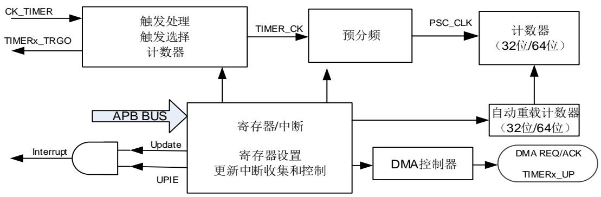
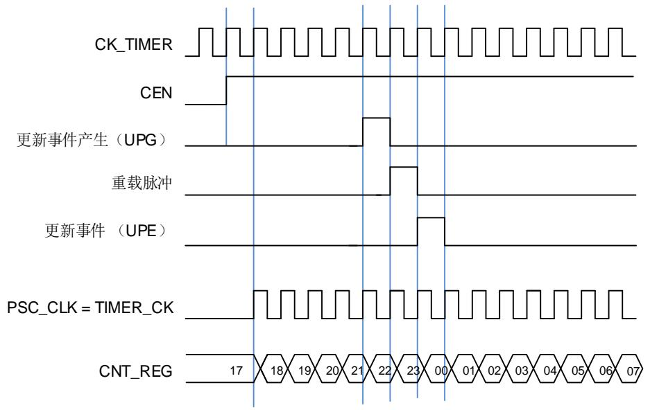
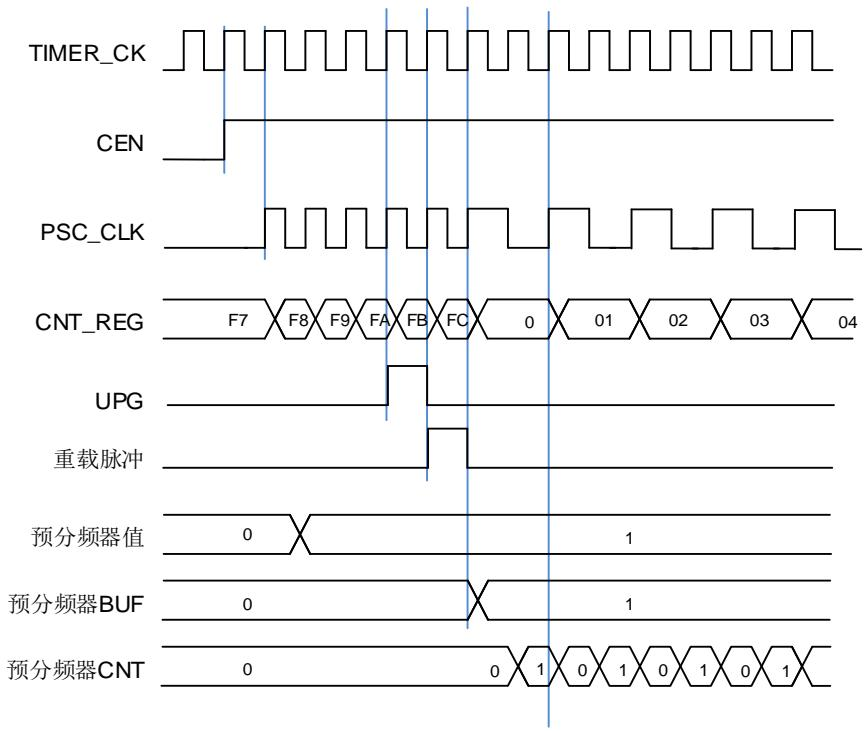
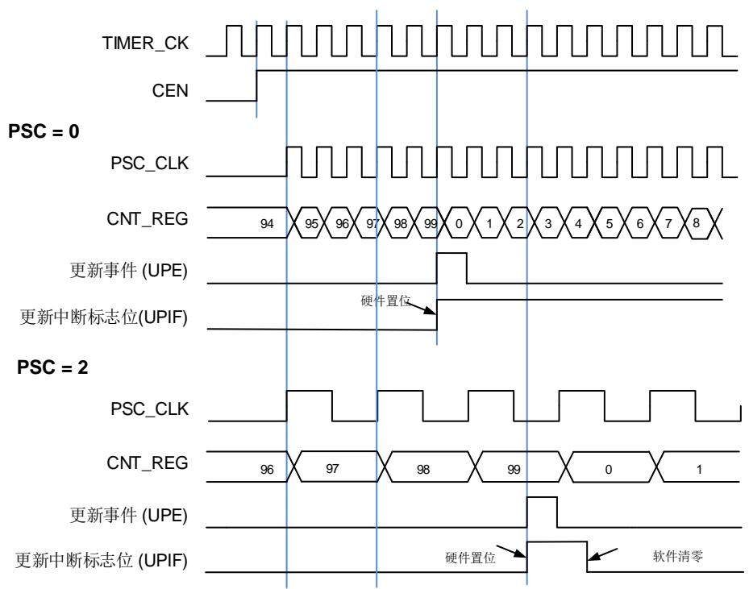
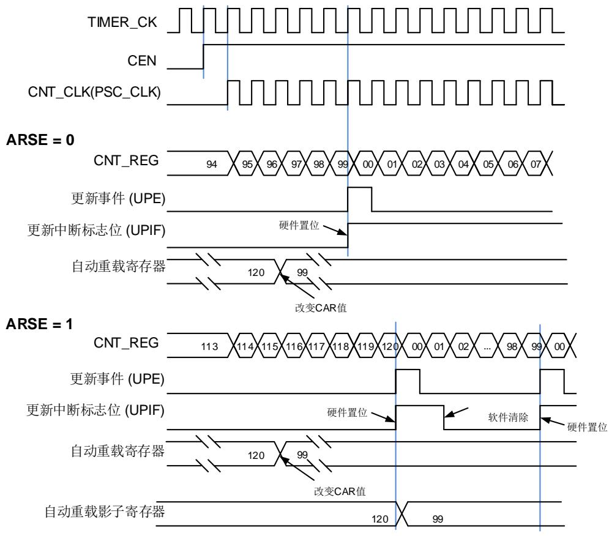

# 24.5. 基本定时器（TIMERx, x=5,6,50,51）

# 24.5.1. 简介

基本定时器（TIMER5/6/50/51）包含一个无符号 32 位或 64 位计数器。可以被用作通用定时器和为 DAC（数字到模拟转换器）提供时钟。基本定时器可以配置产生 DMA 请求，TRGO0触发连接到 DAC。

# 24.5.2. 主要特性

计数器宽度：32位（TIMER5/6）、64位（TIMER50/51）

时钟源只有内部时钟

计数模式：向上计数

可编程的预分频器：16位，运行时可以被改变

自动重装载功能.

中断输出和DMA请求：更新事件

# 24.5.3. 结构框图

24-126. 提供了基本定时器内部配置的细节。

图 24-126. 基本定时器结构框图

# 24.5.4. 功能描述

# 时钟源选择

基本定时器只能由内部时钟源CK_TIMER驱动（来自RCU模块）。

TIMER_CK用来驱动计数器预分频器。当CEN置位，TIMER_CK经过预分频器（预分频值由TIMERx_PSC寄存器确定）产生PSC_CLK。

图 24-127. 内部时钟分频为 1 时正常模式下的控制电路

# 预分频

预分频器可以将定时器的时钟（TIMER_CK）频率按 1 到 65536 之间的任意值分频，分频后的时钟 PSC_CLK 驱动计数器计数。分频系数受预分频寄存器 TIMERx_PSC 控制，这个控制寄存器带有缓冲器，它能够在运行时被改变。新的预分频器的参数在下一次更新事件到来时被采用。

图 24-128. 当预分频器的参数从 1 变到 2 时，计数器的时序图

# 向上计数模式

在这种模式，计数器的计数方向是向上计数。计数器从 0 开始向上连续计数到自动加载值（定义在 TIMERx_CAR/ TIMERx_CARL/ TIMERx_CARH 寄存器中），一旦计数器计数到自动加载值，会重新从 0 开始向上计数并产生上溢事件。在向上计数模式中，TIMERx_CTL0 寄存器中的计数方向控制位 DIR 应该被设置成 0。

当通过 TIMERx_SWEVG 寄存器的 UPG 位置 1 来设置更新事件时，计数值会被清 0，并产生更新事件。

如果 TIMERx_CTL0 寄存器的 UPDIS 置 1，则禁止更新事件。

当发生更新事件时，所有的寄存器（自动重载寄存器，预分频寄存器）都将被更新。

下面这些图给出了一些例子，当 TIMERx_CAR=0x99（TIMERx, x=5,6）时，计数器在不同预分频因子下的行为。

图 24-129. 向上计数时序图，PSC=0/2（TIMERx, x=5,6）

图 24-130. 向上计数时序图，在运行时改变 TIMERx_CAR 寄存器的值（TIMERx, x=5,6）

# UPIF位备份功能

可以通过配置TIMERx_CTL0寄存器中的UPIFBUEN位来使能UPIF位的备份功能，UPIF和UPIFBU位之间没有延迟，两者完全同步。

使能该功能后，TIMERx_INTF寄存器中的UPIF位将会被实时备份到TIMERx_CNT寄存器中的UPIFBU位。这可以避免在读计数器和中断处理时产生冲突的情况。

# 定时器调试模式

当Cortex®-M7内核停止，DBG_CTL0寄存器中的TIMERx_HOLD配置位被置1，定时器计数器停止。

