# 24.2. 通用定时器 L0（TIMERx, x=1,2,3,4,22,23,30,31）

# 24.2.1. 简介

通用定时器 L0（TIMER1/2/3/4/22/23/30/31）是 4 通道定时器，支持输入捕获，输出比较，产生 PWM 信号控制电机和电源管理。通用定时器 L0 的计数器是 16 位或 32 位无符号计数器。

通用定时器 L0 是可编程的，可以被用来计数，其外部事件可以驱动其他定时器。

定时器和定时器之间是相互独立，但是它们的计数器可以被同步在一起形成一个更大的定时器。

# 24.2.2. 主要特性

总通道数：4；

计数器宽度：16位（TIMER2/3/30/31）和32位（TIMER1/4/22/23）；

时钟源可选：内部时钟，内部触发，外部输入，外部触发；

多种计数模式：向上计数，向下计数和中央计数；

正交译码器接口：被用来追踪运动和分辨旋转方向和位置；

霍尔传感器接口：用来做三相电机控制；

可编程的预分频器：16位，运行时可以被改变；

◼ 每个通道可配置：输入捕获模式，输出比较模式，可编程的PWM模式，单脉冲模式；

自动重装载功能；

中断输出和DMA请求：更新事件，触发事件，比较/捕获事件；

多个定时器的菊链使得一个定时器可以同时启动多个定时器；

定时器的同步允许被选择的定时器在同一个时钟周期开始计数；

定时器主-从管理。

# 24.2.3. 结构框图

24-50.  L0 提供了通用定时器 L0 的内部细节

图 24-50. 通用定时器 L0结构框图

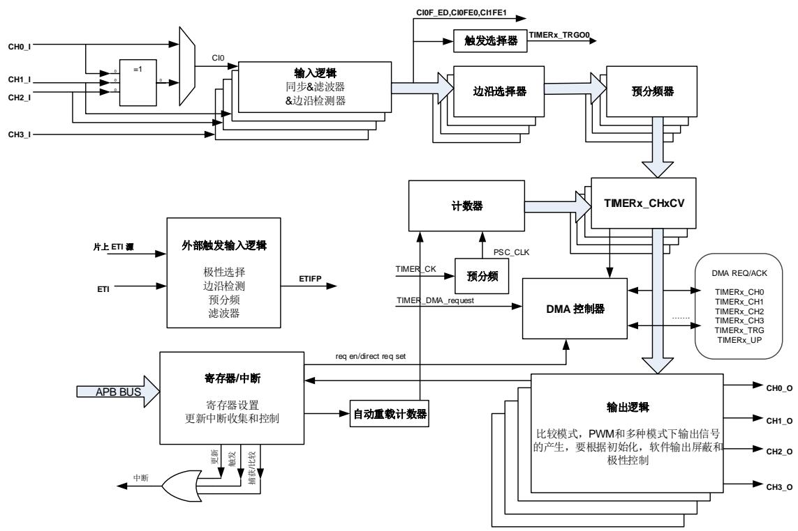

# 24.2.4. 功能描述

# 时钟源选择

通 用 定 时 器 L0 可 以 由 内 部 时 钟 源 CK_TIMER 或 者 由SYSCFG_TIMERxCFG(x=1..4,22,23,30,31)寄存器中的 TSCFGy[4:0] (y=0..9,15)位域控制的复用时钟源驱动。

当 SYSCFG_TIMERxCFG(x=1..4,22,23,30,31) 寄 存 器 中 的TSCFGy[4:0]=5’b00000(y=0..9,15)时，定时器选择内部时钟源（连接到RCU模块的CK_TIMER）

如 果 SYSCFG_TIMERxCFG(x=1..4,22,23,30,31) 寄 存 器 中 的 TSCFGy[4:0]=5’b00000(y=0..9,15)，默认用来驱动计数器预分频器的是内部时钟源 CK_TIMER。当 CEN 置位，CK_TIMER 经过预分频器（预分频值由 TIMERx_PSC 寄存器确定）产生 PSC_CLK。

如果 SYSCFG_TIMERxCFG(x=1..4,22,23,30,31)寄存器中的 TSCFGy[4:0] (y=0..2,6,8,9)位域设置为非零值，预分频器被其他时钟源驱动，具体在下文说明。当 TSCFGy[4:0](y=3,4,5,7)被设置为非零值时，计数器预分频器时钟源由内部时钟 TIMER_CK 驱动。

图 24-51. 内部时钟分频为 1 时正常模式下的控制电路

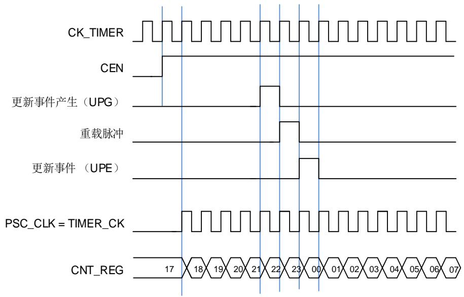

TSCFG6[4:0] !=5’b00000（外部时钟模式0），定时器选择外部输入引脚作为时钟源

计数器预分频器可以在 TIMERx_CI0/ TIMERx_CI1 引脚的每个上升沿或下降沿计数。这种模式可以通过设置 TSCFG6[4:0]为 0x5，0x6 或 0x7 来选择。CIx 是 TIMERx_CIx 通过数字滤波器采样后的信号。

计数器预分频器也可以在内部触发信号 ITI0~ITI14 的上升沿计数。这种模式可以通过设置TSCFG6[4:0]为 0x1~0x4，0x9~0x14 来选择。

SMC1= 1’b1（外部时钟模式1），定时器选择外部输入引脚ETI作为时钟源

计数器预分频器可以在外部引脚 ETI 的每个上升沿或下降沿计数。这种模式可以通过设置TIMERx_SMCFG寄存器中的SMC1位为1来选择。另一种选择ETI信号作为时钟源方式是，设置 TSCFG6[4:0]为 0x8。注意 ETI 信号是通过数字滤波器采样 ETI 引脚得到的。如果选择ETI 信号为时钟源，触发控制器包括边沿监测电路将在每个 ETI 信号上升沿产生一个时钟脉冲来为计数器预分频器提供时钟。

注意：ETI 信号可以从外部 ETI 引脚输入，也可由片上外设提供，具体情况可以参考TIMER1_ETI TRIGSEL_TIMER1ETI 模块。

# 时钟预分频器

预分频器可以将定时器的时钟（TIMER_CK）频率按 1 到 65536 之间的任意值分频，分频后的时钟 PSC_CLK 驱动计数器计数。分频系数受预分频寄存器 TIMERx_PSC 控制，这个控制寄存器带有缓冲器，它能够在运行时被改变。新的预分频器的参数在下一次更新事件到来时被采用。

图 24-52. 当预分频器的参数从 1 变到 2 时，计数器的时序图

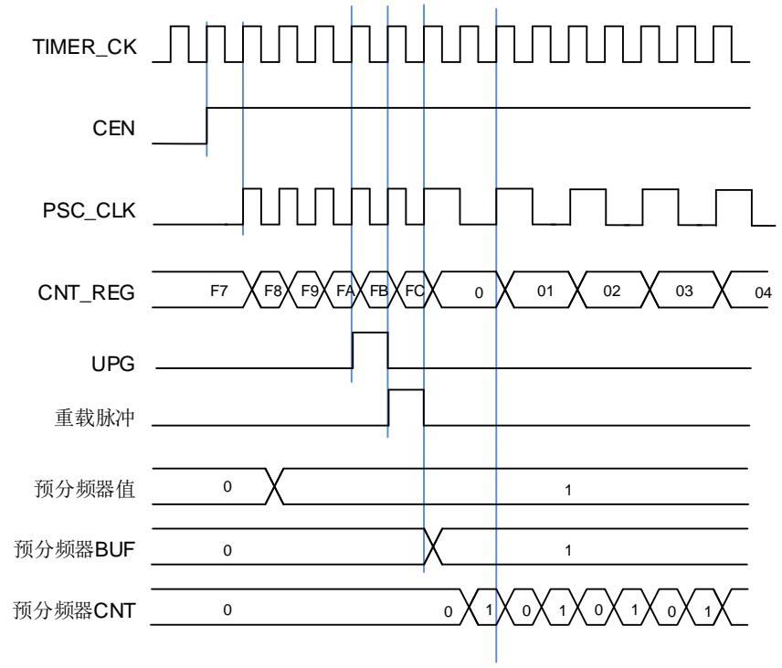

# 向上计数模式

在这种模式，计数器的计数方向是向上计数。计数器从 0 开始向上连续计数到自动加载值（定义在 TIMERx_CAR 寄存器中），一旦计数器计数到自动加载值，会重新从 0 开始向上计数并产生上溢事件。在向上计数模式中，TIMERx_CTL0 寄存器中的计数方向控制位 DIR 应该被设置成 0。

当通过 TIMERx_SWEVG 寄存器的 UPG 位置 1 来设置更新事件时，计数值会被清 0，并产生更新事件。

如果 TIMERx_CTL0 寄存器的 UPDIS 置 1，则禁止更新事件。

当发生更新事件时，所有的寄存器（自动重载寄存器，预分频寄存器）都将被更新。

24-53. PSC=0/2 和 24-54.TIMERx_CAR 给出了一些例子，当 TIMERx_CAR=0x99 时，计数器在不同预分频因子下的行为。

图 24-53. 向上计数时序图，PSC=0/2

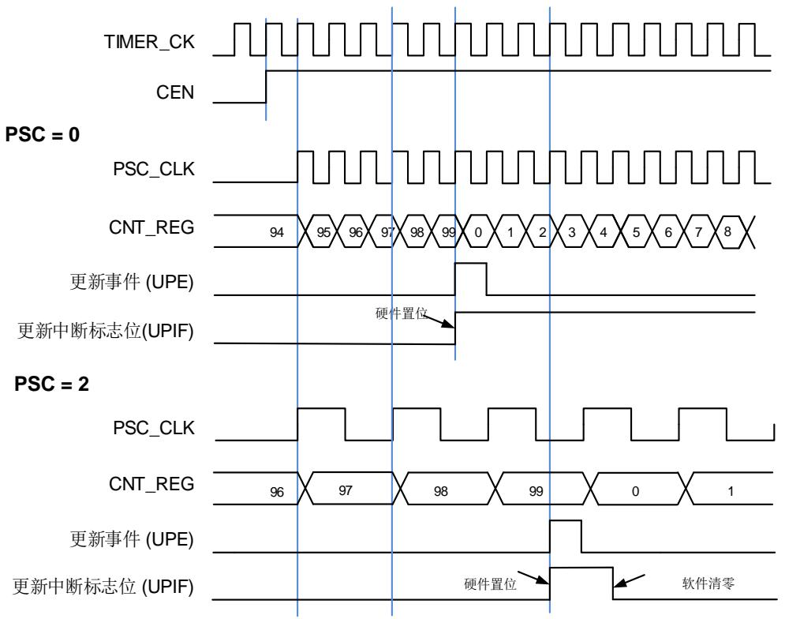

图 24-54. 向上计数时序图，在运行时改变 TIMERx_CAR 寄存器的值

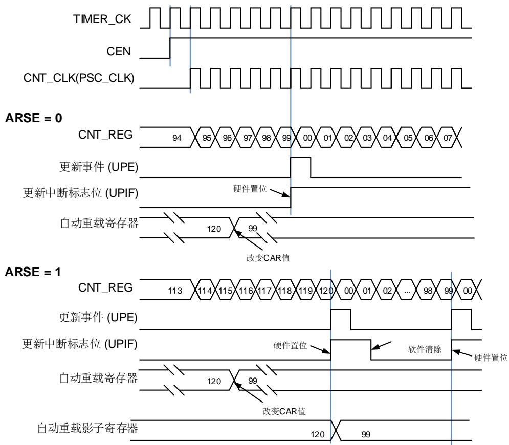

# 向下计数模式

在这种模式，计数器的计数方向是向下计数。计数器从自动加载值（定义在 TIMERx_CAR 寄存器中）向下连续计数到 0。一旦计数器计数到 0，计数器会重新从自动加载值开始计数并产生下溢事件。在向下计数模式中，TIMERx_CTL0 寄存器中的计数方向控制位 DIR 应该被设置成 1。

当通过 TIMERx_SWEVG 寄存器的 UPG 位置 1 来设置更新事件时，计数值会被初始化为自动加载值，并产生更新事件。

如果 TIMERx_CTL0 寄存器的 UPDIS 置 1，则禁止更新事件。

当发生更新事件时，所有的寄存器（自动重载寄存器，预分频寄存器）都将被更新。

24-55. PSC=0/2 和 24-56.TIMERx_CAR 给出了一些例子，当 TIMERx_CAR=0x99 时，计数器在不同时钟频率下的行为。

图 24-55. 向下计数时序图，PSC=0/2

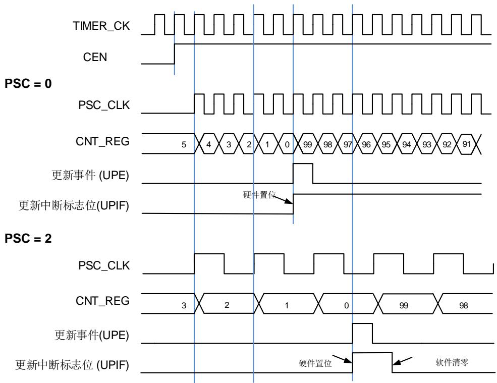

图 24-56. 向下计数时序图，在运行时改变 TIMERx_CAR 寄存器值

# 中央对齐模式

在中央对齐模式下，计数器交替的从 0 开始向上计数到自动加载值，然后再向下计数到 0。向上计数模式中，定时器模块在计数器计数到（TIMERx_CAR-1）产生一个上溢事件；向下计数模式中，定时器模块在计数器计数到 1 时产生一个下溢事件。在中央计数模式中，TIMERx_CTL0 寄存器中的计数方向控制位 DIR 只读，表明了的计数方向。计数方向被硬件自动更新。

将 TIMERx_SWEVG 寄存器的 UPG 位置 1 可以初始化计数值为 0，并产生一个更新事件，而无需考虑计数器在中央模式下是向上计数还是向下计数。

上溢或者下溢时，TIMERx_INTF 寄存器中的 UPIF 位都会被置 1，然而 CHxIF 位置 1 与TIMERx_CTL0 寄存器中 CAM 的值有关。具体细节参考 24-57.如果 TIMERx_CTL0 寄存器的 UPDIS 置 1，则禁止更新事件。

当发生更新事件时，所有的寄存器（自动重载寄存器，预分频寄存器）都将被更新。

24-57. 给 出 了 一 些 例 子 ， 当 TIMERx_CAR=0x99 ，TIMERx_PSC=0x0 时，计数器的行为

图 24-57. 中央计数模式计数器时序图

# 捕获/比较通道

通用定时器 L0 拥有四个独立的通道用于捕获输入或比较输出是否匹配。每个通道都围绕一个通道捕获比较寄存器建立，包括一个输入级，通道控制器和输出级。

# 输入捕获模式

捕获模式允许通道测量一个波形时序，频率，周期，占空比等。输入级包括一个数字滤波器，一个通道极性选择，边沿检测和一个通道预分频器。如果在输入引脚上出现被选择的边沿，TIMERx_CHxCV 寄存器会捕获计数器当前的值，同时 CHxIF 位被置 1，如果 CHxIE = 1 则产生通道中断。

图 24-58. 输入捕获逻辑

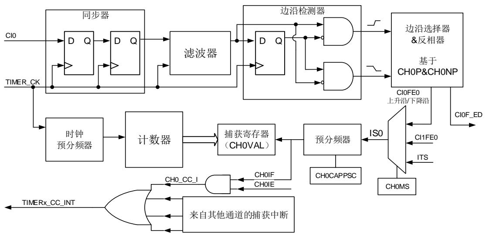

通 道 输 入 信 号 CIx 有 两 种 选 择 ， 一 种 是 TIMERx_CHx 信 号 ， 另 一 种 是TIMERx_CH0,TIMERx_CH1 和 TIMERx_CH2 异或之后的信号（仅限于 CI0）。通道输入信号CIx 先被 TIMER_CK 信号同步，然后经过数字滤波器采样，产生一个被滤波后的信号。通过边沿检测器，可以选择检测上升沿或者下降沿。通过配置 CHxP选择使用上升沿或者下降沿。配置 CHxMS，可以选择其他通道的输入信号，内部触发信号。配置 IC 预分频器，使得若干个输入事件后才产生一个有效的捕获事件。捕获事件发生，CHxVAL 存储计数器的值。

配置步骤如下：

第一步：滤波器配置（TIMERx_CHCTL0寄存器中CHxCAPFLT）：

根据输入信号和请求信号的质量，配置相应的CHxCAPFLT。

第二步：边沿选择（TIMERx_CHCTL2寄存器中CHxP）：

配置CHxP选择上升沿或者下降沿。

第三步：捕获源选择（TIMERx_CHCTL0寄存器中CHxMS）：

一旦通过配置CHxMS选 择 输 入 捕 获 源 ， 必 须 确 保 通 道 配 置 在 输 入 模 式（CHxMS!=0x0），而且TIMERx_CHxCV寄存器不能再被写。

第四步：中断使能（TIMERx_DMAINTEN寄存器中CHxIE和CHxDEN）：

使能相应中断，可以获得中断和DMA请求。

第五步：捕获使能（TIMERx_CHCTL2寄存器中CHxEN）。

结果：当期望的输入信号发生时，TIMERx_CHxCV被设置成当前计数器的值，CHxIF为置1。如果CHxIF位已经为1，则CHxOF位置1。根据TIMERx_DMAINTEN寄存器中CHxIE和CHxDEN的配置，相应的中断和DMA请求会被提出。

直接产生：软件设置CHxG位，会直接产生中断和DMA请求。

输入捕获模式也可用来测量 TIMERx_CHx 引脚上信号的脉冲波宽度。例如，一个 PWM 波连接到 CI0。配置 TIMERx_CHCTL0 寄存器中 CH0MS 为 2’b01，选择通道 0 的捕获信号为 CI0并设置上升沿捕获。配置 TIMERx_CHCTL0 寄存器中 CH1MS 为 2’b10，选择通道 1 捕获信号为 CI0 并设置下降沿捕获。计数器配置为复位模式，在通道 0 的上升沿复位。TIMERX_CH0CV寄存器测量PWM的周期值，TIMERx_CH1CV寄存器测量PWM占空比值。

输出比较模式

图 24-59. 输出比较逻辑 $( x = 0 , 1 , 2 , 3 )$ ）

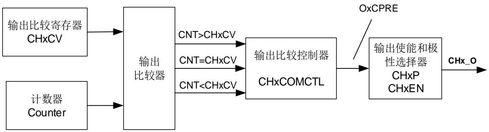

24-59. x=0,1,2,3 给出了输出比较的逻辑电路。通道输出信号CHx_O与OxCPRE信号（详情请见 ）的关系描述如下：OxCPRE信号高电平有效，CHx_O 的 输 出 情 况 与 OxCPRE 信 号 ， CHxP 位 和 CHxEN 位 有 关 （ 具 体 情 况 请 见TIMERx_CHCTL2寄存器中的描述）。例如，当设置CHxP=0（CHx_O高电平有效，与OxCPRE输出极性相同）、CHxEN=1（CHx_O输出使能）时：

若OxCPRE输出有效（高）电平，则CHx_O输出有效（高）电平；

若OxCPRE输出无效（低）电平，则CHx_O输出无效（低）电平。

在输出比较模式，TIMERx 可以产生时控脉冲，其位置，极性，持续时间和频率都是可编程的。当一个输出通道的 CHxCV 寄存器与计数器的值匹配时，根据 CHxCOMCTL 的配置，这个通道的输出可以被置高电平，被置低电平或者翻转。当计数器的值与CHxCV寄存器的值匹配时，CHxIF 位被置 1，如果 CHxIE = 1 则会产生中断，如果 CxCDE=1 则会产生 DMA 请求。

配置步骤如下：

第一步：时钟配置：

配置定时器时钟源，预分频器等。

第二步：比较模式配置：

设置CHxCOMSEN位来配置输出比较影子寄存器；

设置CHxCOMCTL位来配置输出模式（置高电平/置低电平/翻转）；

设置 ${ \mathsf { C H } } { \mathsf { x P } }$ 位来选择有效电平的极性；

设置CHxEN使能输出。

第三步：通过CHxIE/CxCDE位配置中断/DMA请求使能。

第四步：通过TIMERx_CAR寄存器和TIMERx_CHxCV寄存器配置输出比较时基：

CHxVAL可以在运行时根据你所期望的波形而改变。

第五步：设置CEN位使能定时器。

24-60. 显示了三种比较输出模式：翻转/置高电平/置低电平， $\mathsf { C A R } { = } 0 \times 6 3$ ,

CHxVAL=0x3。 

图 24-60. 三种输出比较模式

# PWM 模式

在 PWM 输出模式下（PWM 模式 0 是配置 CHxCOMCTL 为 4’b0110，PWM 模式 1 是配置CHxCOMCTL 为 4’b0111），通道根据 TIMERx_CAR 寄存器和 TIMERx_CHxCV 寄存器的值，输出 PWM 波形。

根据计数模式，我们可以分为两种 PWM 波：EAPWM（边沿对齐 PWM）和 CAPWM（中央对齐 PWM）。

EAPWM 的周期由 TIMERx_CAR 寄存器值决定，占空比由 TIMERx_CHxCV 寄存器值决定。24-61. EAPWM 显示了 EAPWM 的输出波形和中断。

CAPWM 的周期由（2*TIMERx_CAR 寄存器值）决定，占空比由（2*TIMERx_CHxCV 寄存器值）决定。 24-62. CAPWM 显示了 CAPWM 的输出波形和中断。

当计数器向上计数时，在PWM0模式下（CHxCOMCTL =4’b0110），如果TIMERx_CHxCV寄存器的值大于TIMERx_CAR寄 存 器 的 值 ， 通 道 输 出 一 直 为 有 效 电 平 ；PWM1模式下（CHxCOMCTL =4’b0111），如果TIMERx_CHxCV寄存器的值大于TIMERx_CAR寄存器的值，通道输出一直为无效电平。

图 24-61. EAPWM 时序图

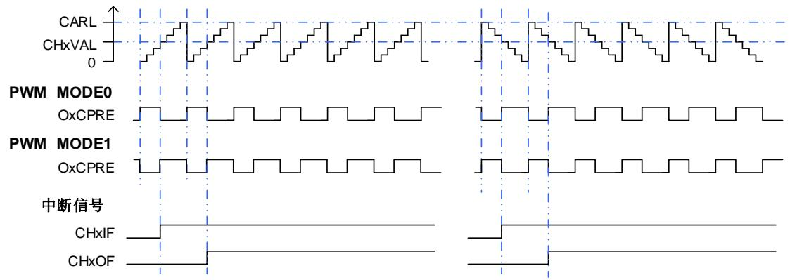

图 24-62. CAPWM 时序图

# 复合 PWM模式

在复合 PWM 模式中（CHxCPWMEN = 1’b1，CHxMS[2:0] = 3’b000 和 CHxCOMCTL = 4’b0110、4’b0111），通道 x（x=0..3）上的 PWM 输出信号由 CHxVAL 和 CHxCOMVAL_ADD 位确定。

如果 CHxCOMCTL = 4’b0110（PWM 模式 0）且 DIR = 1’b0（向上计数模式），或者 CHxCOMCTL= 4’b0111（PWM 模式 1）且 DIR = 1’b1（向下计数模式），当计数器和 CHxVAL 的值相匹配时通道 x 输出强制为低。当计数器与 CHxCOMVAL_ADD 的值相匹配时，通道 x 输出强制为高。

如果 CHxCOMCTL =4’b0111（PWM 模式 1）且 DIR = 1’b0（向上计数模式），或者 CHxCOMCTL=4’b0110（PWM 模式 0）且 DIR = 1’b1（向下计数模式），当计数器和 CHxVAL 的值相匹配时通道 x 输出强制为高。当计数器与 CHxCOMVAL_ADD 的值相匹配时，通道 x 输出强制为

低。

PWM 的周期取决于（CARL + 0x0001），PWM 脉冲宽度可以下 24-10.  PWM计算。

表 24-10. 复合 PWM 脉冲宽度

<table><tr><td>条件</td><td>模式</td><td>PWM 脉冲宽度</td></tr><tr><td rowspan="2">CHxVAL &lt; CHxCOMVAL_ADD ≤ CARL</td><td>PWM 模式 0</td><td>(CARL + 0x0001) + (CHxVAL - CHxCOMVAL_ADD)</td></tr><tr><td>PWM 模式 1</td><td>(CHxCOMVAL_ADD - CHxVAL)</td></tr><tr><td rowspan="2">CHxCOMVAL_ADD &lt; CHxVAL ≤ CARL</td><td>PWM 模式 0</td><td>(CHxVAL - CHxCOMVAL_ADD)</td></tr><tr><td>PWM 模式 1</td><td>(CARL + 0x0001) + (CHxCOMVAL_ADD - CHxVAL)</td></tr><tr><td rowspan="2">(CHxVAL = CHxCOMVAL_ADD ≤ CARL)或 (CHxVAL &gt; CARL &gt; CHxCOMVAL_ADD)</td><td>PWM 模式 0(向上计数)或 PWM 模式 1(向下计数)</td><td>100%</td></tr><tr><td>PWM 模式 0(向下计数)或 PWM 模式 1(向上计数)</td><td>0%</td></tr><tr><td rowspan="2">CHxCOMVAL_ADD &gt; CARL &gt; CHxVAL</td><td>PWM 模式 0(向上计数)或 PWM 模式 1(向下计数)</td><td>0%</td></tr><tr><td>PWM 模式 0(向下计数)或 PWM 模式 1(向上计数)</td><td>100%</td></tr><tr><td>(CHxVAL&gt;CARL)且 (CHxCOMVAL_ADD &gt; CARL)</td><td>-</td><td>CHx_O 输出保持</td></tr></table>

当计数器计数到CHxVAL，CHxIF位置1且如果CHxIE=1通道x产生中断，如果CHxDEN=1，则产生DMA请求。当计数器计数到CHxCOMVAL_ADD时，CHxCOMADDIF位置1（该中断标志位只在复合PWM模式有效，CHxCPWMEN=1），如果CHxCOMADDIE = 1通道x附加比较中断产生（只有中断产生，没有DMA请求响应）。

根据CHxVAL，CHxCOMVAL_ADD和CARL之间的关系，可以分为四种情况：

1） CHxVAL < CHxCOMVAL_ADD，CHxVAL和CHxCOMVAL_ADD值介于0和CARL之间。

图 24-63. 通道 x 输出 PWM（CHxVAL < CHxCOMVAL_ADD）

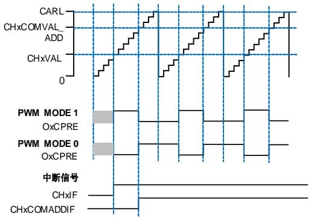

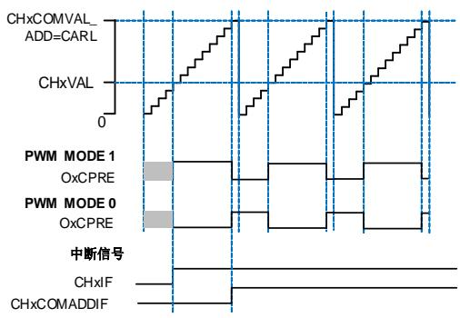

2） CHxVAL = CHxCOMVAL_ADD, CHxVAL和CHxCOMVAL_ADD值介于0和CARL之间。

图 24-64. 通道 x 输出 PWM（CHxVAL = CHxCOMVAL_ADD）

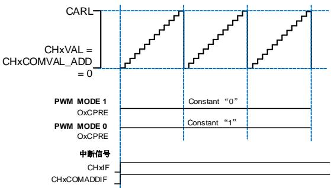

3） CHxVAL > CHxCOMVAL_ADD, CHxVAL和CHxCOMVAL_ADD值介于0和CARL之间。

图 24-65. 通道 x 输出 PWM（CHxVAL > CHxCOMVAL_ADD）

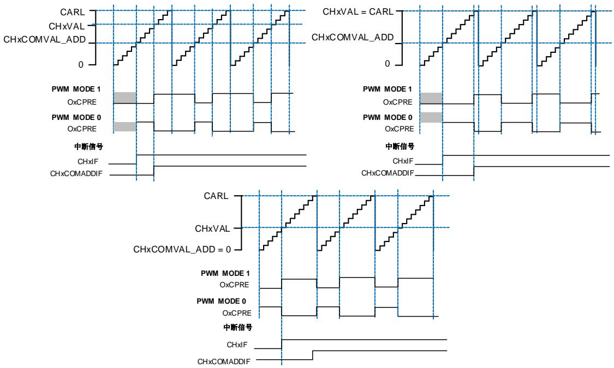

4） CHxVAL或CHxCOMVAL_ADD值大于CARL。

图 24-66. 通道 x 输出 PWM（CHxVAL 或 CHxCOMVAL_ADD > CARL）

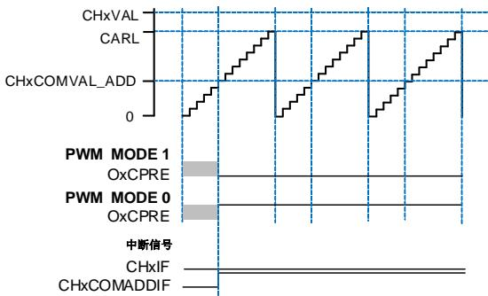

复合PWM模式支持不修改周期只修改占空比的PWM信号的生成。 24-67. x PWMCHxCOMVAL_ADD 显示PWM输出和中断波形。

在 某 些 情 况 下 ， CHxCOMVAL_ADD 的 匹 配 事 件 可 以 发 生 在 下 一 个 计 数 周 期（CHxCOMVAL_ADD值在计数器到达CHxVAL值之后被写入，且CHxCOMVAL_ADD值小于或者等于CHxVAL值）。

图 24-67. 通道 x 输出 PWM 占空比随着 CHxCOMVAL_ADD 值而改变

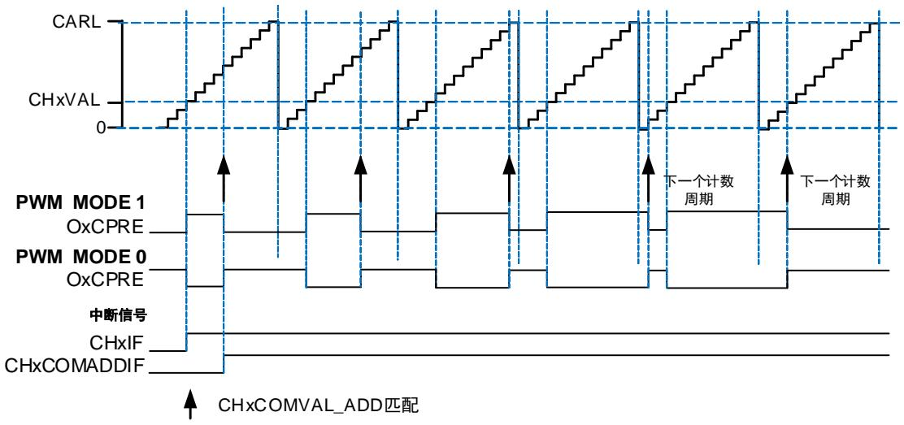

如果多个通道配置为复合PWM模式，可以为每对通道x的匹配边沿设定一个偏移量（相对于其它通道）。这种特性在产生照明PWM控制信号时非常有用，因为在这种情况下，希望彼此边缘不重合，以消除噪声的产生。CHxVAL寄存器值是PWM脉冲相对于计数器周期开始的偏移。

图 24-68. 复合 PWM 模式下四通道输出

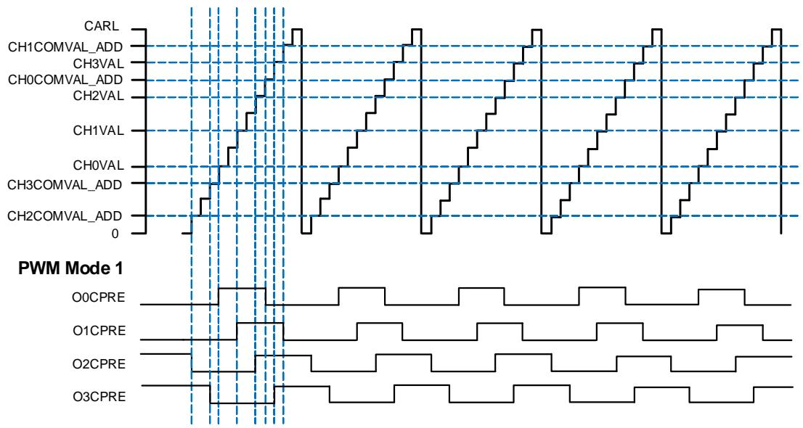

# 输出匹配脉冲选择

当发生匹配事件时，CHx_O（x=0..3）的输出由CHxCOMCTL[3:0]（x=0..3）位设置，通过配置CHxOMPSEL[1:0]（x=0..3）位，可选择CHx_O（x=0..3）的输出信号正常或者脉冲。

当匹配事件发生时，CHxOMPSEL[1:0]（x=0..3）用于选择 ${ \mathsf { O x C P R E } }$ 信号输出（驱动CHx_O）：

CHxOMPSEL = 2’b00，OxCPRE信号根据CHxCOMCTL[3:0]位的配置正常输出；

$\mathsf { C H x O M P S E L } = 2 ^ { \prime } \mathsf { b } 0 1$ ，只有在计数器向上计数，发生匹配事件时，OxCPRE信号输出一个脉冲，且脉冲宽度为一个CK_TIMER时钟周期；

$\mathsf { C H x O M P S E L } = 2 ^ { \cdot } \mathsf { b } 1 0$ ，只有在计数器向下计数，发生匹配事件时，OxCPRE信号输出一个脉冲，且脉冲宽度为一个CK_TIMER时钟周期；

CHxOMPSEL = 2’b11，无论计数器向上计数还是向下计数，发生匹配事件时，OxCPRE信号输出一个脉冲，且脉冲宽度为一个CK_TIMER时钟周期；

图 24-69. 边沿对齐模式下 CHx_O 输出脉冲（CHxOMPSEL≠2’b00）

图 24-70. 中央对齐模式下 CHx_O 输出脉冲（CHxOMPSEL≠2’b00）

# 通道输出参考信号

根据 24-59. x=0,1,2,3 所示，当 TIMERx 用于输出匹配比较模式下，设置CHxCOMCTL 位可以定义 OxCPRE 信号（通道 x 准备信号）类型。OxCPRE 信号有若干类型的输出功能，包括，设置 CHxCOMCTL=0x00 可以保持原始电平；设置 CHxCOMCTL=0x01可以将 OxCPRE 信号设置为高电平；设置 CHxCOMCTL=0x02 可以将 OxCPRE 信号设置为低电平；设置 CHxCOMCTL=0x03，在计数器值和 TIMERx_CHxCV 寄存器的值匹配时，可以翻转输出信号。

PWM 模式 0 和 PWM 模式 1 是 OxCPRE 的另一种输出类型，设置 CHxCOMCTL 位域位 0x06或0x07可以配置 PWM模式0/PWM 模式1。在这些模式中，根据计数器值和 TIMERx_CHxCV寄存器值的关系以及计数方向，OxCPRE 信号改变其电平。具体细节描述，请参考相应的位。

设置 CHxCOMCTL =0x04 或 0x05 可以实现 OxCPRE 信号的强制输出功能。输出比较信号能够直接由软件强置为有效或无效状态，而不依赖于 TIMERx_CHxCV 的值和计数器值之间间的比较结果。

设置 CHxCOMCEN=1，当由外部 ETI 引脚信号产生的 ETIFP 信号为高电平时，OxCPRE 被强制为低电平。在下一次更新事件到来时，OxCPRE 信号才会回到有效电平状态。

# 正交译码器

正交译码器功能使用由 TIMERx_CH0 和 TIMERx_CH1 引脚生成的 CI0 和 CI1 正交信号各自相互作用产生计数值。在每个输入源改变期间，DIR 位被硬件自动改变。

输 入 源 可 以 是 只 有 CI0， 可 以 只 有 CI1， 或 着 可 以 同 时 有 CI0 和 CI1， 通 过 设 置TSCFGy[4:0](y=0..2) != 5’b00000 来选择使用哪种模式。计数器计数方向改变的机制如24-11. 所示。其中，CI0FE0、CI1FE1 是经过滤波和极性选择后的 CI0、CI1 信号。正交译码器可以当作一个带有方向选择的外部时钟，这意味着计数器会在0 和自动加载值之间连续的计数。因此，用户必须在计数器开始计数前配置 TIMERx_CAR 寄存器。

表 24-11. 不同译码器模式下的计数方向

<table><tr><td rowspan="2">计数模式</td><td rowspan="2">电平</td><td colspan="2">CI0FE0</td><td colspan="2">CI1FE1</td></tr><tr><td>上升</td><td>下降</td><td>上升</td><td>下降</td></tr><tr><td rowspan="2">正交译码器模式0TSCFG0[4:0]!= 5&#x27;b00000</td><td>CI1FE1=1</td><td>向下</td><td>向上</td><td>-</td><td>-</td></tr><tr><td>CI1FE1=0</td><td>向上</td><td>向下</td><td>-</td><td>-</td></tr><tr><td rowspan="2">正交译码器模式1TSCFG1[4:0]!= 5&#x27;b00000</td><td>CI0FE0=1</td><td>-</td><td>-</td><td>向上</td><td>向下</td></tr><tr><td>CI0FE0=0</td><td>-</td><td>-</td><td>向下</td><td>向上</td></tr><tr><td rowspan="4">正交译码器模式2TSCFG2[4:0]!= 5&#x27;b00000</td><td>CI1FE1=1</td><td>向下</td><td>向上</td><td>X</td><td>X</td></tr><tr><td>CI1FE1=0</td><td>向上</td><td>向下</td><td>X</td><td>X</td></tr><tr><td>CI0FE0=1</td><td>X</td><td>X</td><td>向上</td><td>向下</td></tr><tr><td>CI0FE0=0</td><td>X</td><td>X</td><td>向下</td><td>向上</td></tr></table>

注意：“-”意思是“无计数”；“X" 意思是不可能。“0”意思是低电平，“1”意思是高电平。

图 24-71. 译码器接口模式下计数器运行例子

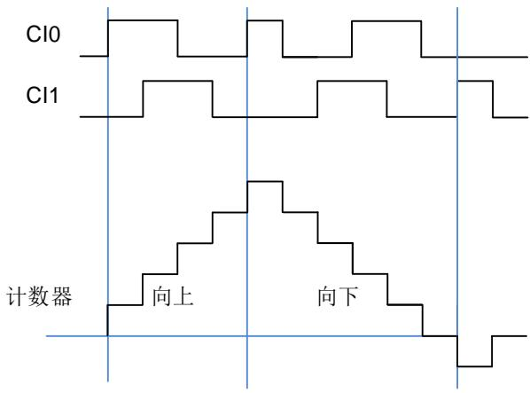

图 24-72. CI0FE0 极性反相的译码器接口模式下的例子

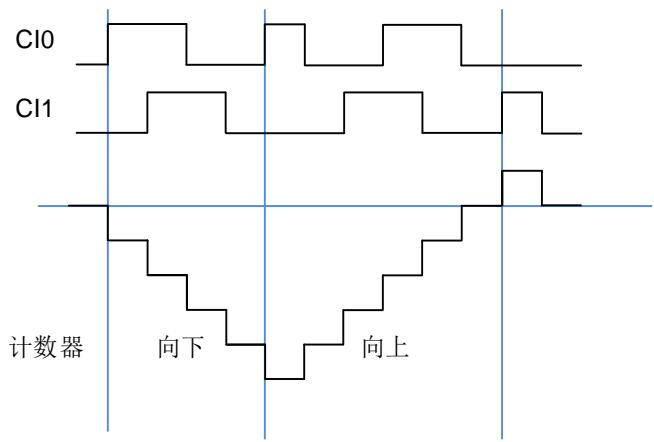

# 正交译码器信号检测

支持两种正交译码器信号检测：信号跳变检测和断线检测。

正交译码器信号跳变检测功能可用于检测两个正交译码器输入信号CI0、CI1的电平跳变沿（上升沿或下降沿）是否同时发生，可通过将TIMERx_CTL2寄存器中的DECJDEN位置1来使能。当DECJDEN=1时，若两个正交信号CI0和CI1的电平跳变同时发生，则中断标志位DECJIF置位。若DECJIE=1，则相应的中断产生。

正交译码器信号断线检测功能可用于检测正交译码器输入信号CI0、CI1是否正常，可通过将TIMERx_CTL2寄存器中的DECDISDEN位置1来使能。正交译码器信号检测模块包括2个32位的看门狗计数器和1个周期寄存器，具体如 24-73. 所示，CI0FE0、CI1FE1信号分别用于复位2个看门狗计数器。

当DECDISDEN=1时，2个看门狗计数器同时开始向上计数，若看门狗计数器计数到看门狗周期值（该值由TIMERx_WDGPER寄存器中的WDGPER[31:0]位域确定），则看门狗计数器计数超时，中断标志位DECDISIF置位。若DECDISIE=1，则相应的中断产生。

图 24-73. 正交译码器信号断线检测框图

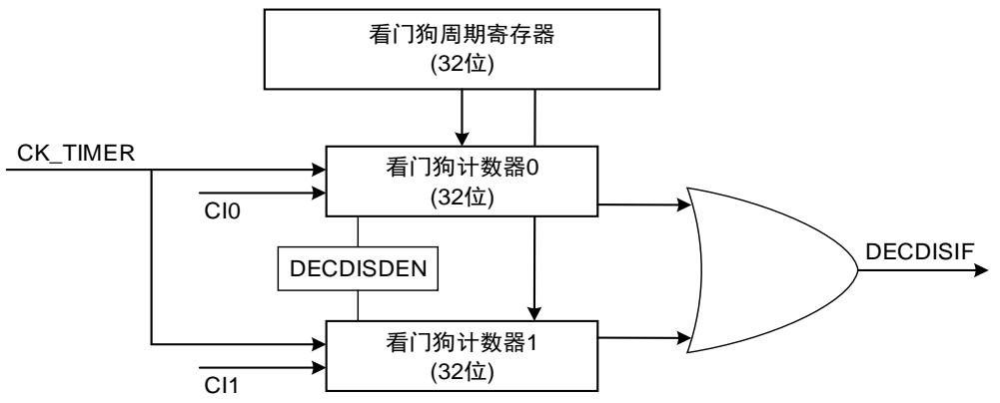

# 非正交译码

非正交译码器功能有两种模式：非正交译码器模式0和非正交译码器模式1，通过设置TSCFGy[4:0](y=8,9) != 5’b00000来选择。这两种计数模式下的输入源有两个：CI0和CI1。

使用非正交译码器模式0时，CI0作为计数脉冲，CI1作为计数选择信号。CH1P=0时，只有当CI1输入信号为高电平时，计数器才会在CI0输入信号的上升沿向上计数；CH1P=1时，只有当CI1输入信号为低电平时，计数器才会在CI0输入信号的上升沿向上计数。具体细节可见 24-74.0 CH1P=0 。

图 24-74. 非正交译码器模式 0 计数器运行实例（CH1P=0）

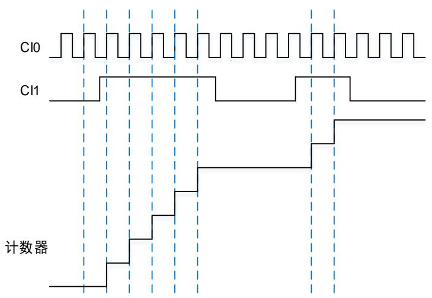

使用非正交译码器模式1时，CI0作为计数脉冲（CH0P用于选择计数边沿）；CI1作为计数方向选择信号。具体计数情况请见 24-12. 1 和 24-75.1 CH0P=0 。

表 24-12. 非正交译码器模式 1 的计数情况

<table><tr><td>CHOP</td><td>CI1电平</td><td>计数器计数情况</td></tr><tr><td rowspan="2">0</td><td>CI1为高电平</td><td>计数器在CI0输入信号的上升沿向上计数</td></tr><tr><td>CI1为低电平</td><td>计数器在CI0输入信号的上升沿向下计数</td></tr><tr><td rowspan="2">1</td><td>CI1为高电平</td><td>计数器在CI0输入信号的下降沿向上计数</td></tr><tr><td>CI1为低电平</td><td>计数器在CI0输入信号的下降沿向下计数</td></tr></table>

图 24-75. 非正交译码器模式 1 计数器运行实例（CH0P=0）

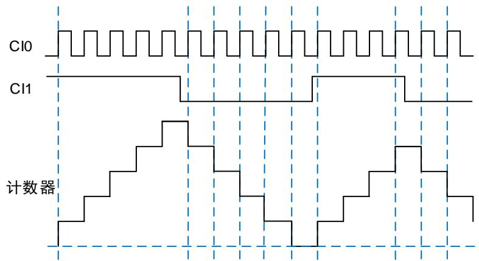

# 霍尔传感器接口功能

参考 (TIMERx,x=0,7) 。

# 主-从管理

TIMERx 能在多种模式下同步外部触发，包括复位模式，暂停模式和事件模式等，可以通过设置 SYSCFG_TIMERxCFG(x=1..4,22,23,30,31)寄存器中的 TSCFGy[4:0] (y=3..7)位域来确定，具体的输入触发源可以通过 TSCFGy[4:0] (y=3..7)位域值来选择。

表 24-13. 从模式列表和举例（通用定时器 L0）

<table><tr><td></td><td>模式选择</td><td>触发源选择</td><td colspan="2">极性选择</td><td>滤波和预分频</td></tr><tr><td>列举</td><td>TSCFGy[4:0]y=3:复位模式y=4:暂停模式y=5:事件模式y=6:外部时钟模式0y=7:复位+事件模式</td><td>TSCFGy[4:0]00000: Mode disable00001: ITI000010: ITI100011: ITI200100: ITI300101: CI0F_ED00110: CI0FE000111: CI1FE101000: ETIFP(1)01001: ITI4</td><td colspan="2">如果触发源是CI0FE0或者CI1FE1,配置CHxP和CHxNP来选择极性和反相。如果触发源是ETIFP(滤波后的ETI外部触发输入),配置ETP选择极性和反相</td><td>触发源ITIx,滤波和预分频不可用触发源Clx,配置CHxCAPFLT设置滤波,分频不可用触发源是ETIFP,滤波和预分频不可用</td></tr><tr><td></td><td>模式选择</td><td>触发源选择</td><td colspan="2">极性选择</td><td>滤波和预分频</td></tr><tr><td></td><td></td><td>01010: ITI501100: ITI701110: ITI901111: ITI1010000: ITI1110001: ITI1210010: ITI1310011: ITI14</td><td colspan="2"></td><td></td></tr><tr><td rowspan="2">例1</td><td>复位模式当触发输入上升沿,计数器清零重启</td><td>TSCFG3[4:0]5'b00001,选择ITIO为触发源</td><td colspan="2">触发源是ITIO,极性选择不可用</td><td>触发源是ITIO,滤波和预分频不可用</td></tr><tr><td colspan="5">图24-76. 复位模式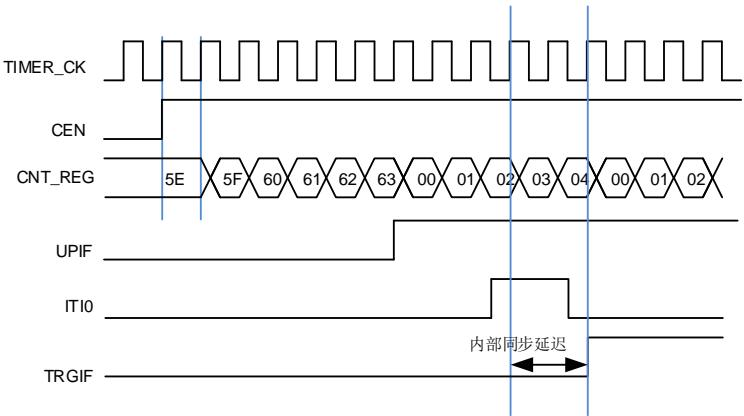</td></tr><tr><td rowspan="2">例2</td><td>暂停模式当触发输入为低的时候,计数器暂停计数</td><td>TSCFG4[4:0]=5'b00110,选择CI0FE0为触发源</td><td colspan="2">TIOS=0(非异或)[CHONP=0, CHOP=0]不反相,在上升沿捕获</td><td>在这个例子中滤波被旁路</td></tr><tr><td colspan="5">图24-77. 暂停模式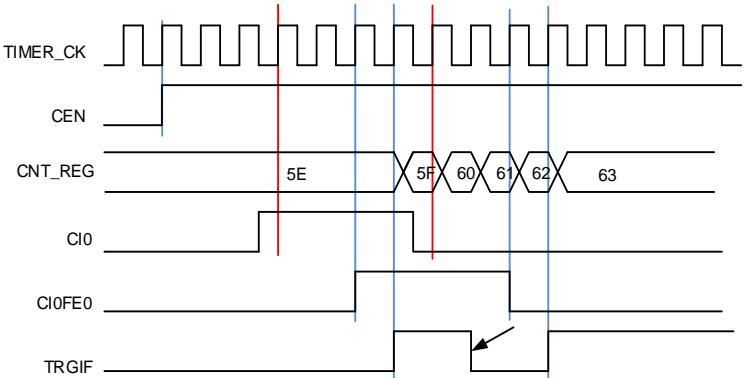</td></tr><tr><td>例3</td><td>事件模式触发输入的上升沿计数器开始计数</td><td>TSCFG5[4:0]=5'b01000,选择ETIFP为触发源</td><td>ETP = 0没有极性改变</td><td colspan="2">ETPSC = 1,2分频ETFC = 0,无滤波</td></tr></table>\
<table><tr><td></td><td>模式选择</td><td>触发源选择</td><td>极性选择</td><td>滤波和预分频</td></tr><tr><td></td><td colspan="4">图24-78.事件模式</td></tr></table>

(1) ETI 信号可以从外部 ETI 引脚输入，也可由片上外设提供，具体情况可以参考 TIMER1_ETITRIGSEL_TIMER1ETI 模块。

# 单脉冲模式

单脉冲模式与重复模式是相反的，设置 TIMERx_CTL0 寄存器的 SPM 位置 1，则使能单脉冲模式。当 SPM 置 1，计数器在下次更新事件到来后清零并停止计数。为了得到脉冲波，可以通过设置 CHxCOMCTL 配置 TIMERx 为 PWM 模式或者比较模式。

一旦设置定时器运行在单脉冲模式下，没有必要设置 TIMERx_CTL0 寄存器的定时器使能位CEN=1 来使能计数器。触发信号沿或者软件写 CEN=1 都可以产生一个脉冲，此后 CEN 位一直保持为 1 直到更新事件发生或者 CEN 位被软件写 0。如果 CEN 位被软件清 0，计数器停止工作，计数值被保持。如果 CEN 值被硬件更新事件自动清 0，计数器将被再次初始化。

在单脉冲模式下，有效的外部触发边沿会将 CEN 位置 1，使能计数器。然而，执行计数值和TIMERx_CHxCV 寄存器值的比较结果依然存在一些时钟延迟。单脉冲模式下，触发上升沿产生之后，OxCPRE 信号将被立即强制转换为与发生比较匹配时相同的电平，但是不用考虑比较结果。

图 24-79. 单脉冲模式，TIMERx_CHxCV = 0x04 TIMERx_CAR=0x60

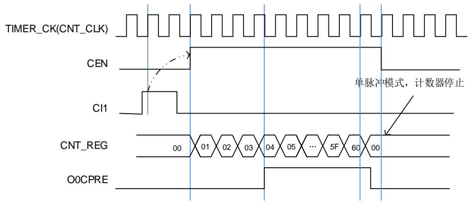

# 可延时的单脉冲模式

可以通过将TIMERx_CHCTLx寄存器中的CHxCOMCTL[3:0]位置1来使能可延时的单脉冲模式。在这个模式下，通道输出参考信号OxCPRE的脉冲宽度由TIMERx_CAR寄存器值确定。

一旦设置定时器运行在可延时的单脉冲模式下，需进行以下配置：

定时器必须工作在从模式下，SYSCFG_TIMERxCFG(x=1..4,22,23,30,31)寄存器中的TSCFG7[4:0] != 5’b00000；

CHxCOMCTL[3:0]位设置为 4’b1000（可延时单脉冲模式 0）或 4’b1001（可延时单脉冲模式 1）

在可延时单脉冲模式0下，OxCPRE的输出情况类似与PWM模式0。在向上计数模式时，OxCPRE先输出有效电平，当外部触发事件发生时，立即输出无效电平，当下一次更新事件发生时，再变成有效电平；在向下计数模式时，OxCPRE先输出无效电平，当外部触发事件发生时，立即输出有效电平，当下一次更新事件发生时，再变成无效电平。

在可延时单脉冲模式1下，OxCPRE的输出情况类似与PWM模式1。在向上计数模式时，OxCPRE先输出无效电平，当外部触发事件发生时，立即输出有效电平，当下一次更新事件发生时，再变成无效电平；在向下计数模式时，OxCPRE先输出有效电平，当外部触发事件发生时，立即输出无效电平，当下一次更新事件发生时，再变成有效电平。

# 注意：

3） 不能使用中央对齐模式，TIMERx_CTL0 寄存器中的 CAM[1:0]=2’b00；

4） 在向上计数时（TIMERx_CTL0 寄存器中的 DIR=0），TIMERx_CHxCV 的值设置为 0；在向下计数时，TIMERx_CHxCV 的值应大于或等于 TIMERx_CAR 的值。

图 24-80. 可延时单脉冲模式（TIMERx_CHxCV=0x00, TIMERx_CAR=0x60）

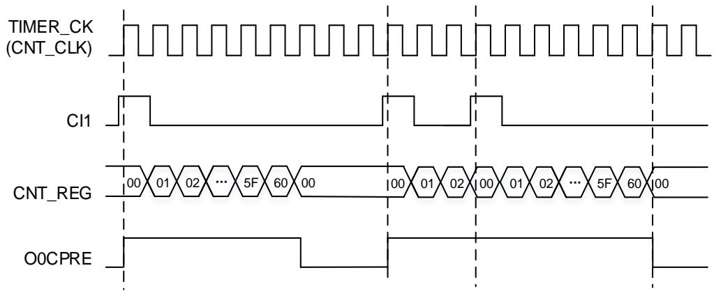

# 定时器互连

参考 (TIMERx,x=0,7) 。

# 定时器 DMA模式

定时器 DMA 模式是指通过 DMA 模块配置定时器的寄存器。有两个跟定时器 DMA 模式相关的寄存器：TIMERx_DMACFG 和 TIMERx_DMATB。当然，必须要使能 DMA 请求，一些内部中断事件可以产生 DMA请求。当中断事件发生，TIMERx 会给 DMA 发送请求。DMA配置成M2P 模式，PADDR 是 TIMERx_DMATB 寄存器地址，DMA 就会访问 TIMERx_DMATB 寄存器。实际上，TIMERx_DMATB 寄存器只是一个缓冲，定时器会将 TIMERx_DMATB 映射到一个内部寄存器，这个内部寄存器由 TIMERx_DMACFG 寄存器中的 DMATA 来指定。如果TIMERx_DMACFG 寄存器的 DMATC 位域值为 0，表示 1 次传输，定时器的发送 1 个 DMA请求就可以完成。如果 TIMERx_DMACFG 寄存器的 DMATC 位域值不为 1，例如其值为 3，表示4次传输，定时器就需要再多发3次DMA请求。在这3次请求下，DMA对TIMERx_DMATB寄存器的访问会映射到访问定时器的 DMATA+0x4, DMATA+0x8，DMATA+0xc 寄存器。总之，发生一次 DMA 内部中断请求，定时器会连续发送（DMATC+1）次请求。

如果再来 1 次 DMA请求事件，TIMERx 将会重复上面的过程。

# UPIF位备份功能

可以通过配置TIMERx_CTL0寄存器中的UPIFBUEN位来使能UPIF位的备份功能，UPIF和UPIFBU位之间没有延迟，两者完全同步。

使能该功能后，TIMERx_INTF寄存器中的UPIF位将会被实时备份到TIMERx_CNT寄存器中的UPIFBU位。这可以避免在读计数器和中断处理时产生冲突的情况。

# 定时器调试模式

当Cortex®-M7内核停止，DBG_CTL0寄存器中的TIMERx_HOLD配置位被置1，定时器计数器停止。

