# 24.1. 高级定时器（TIMERx, x=0, 7）

# 24.1.1. 简介

高级定时器（TIMER0/7）是八通道定时器，支持输入捕获和输出比较。可以产生 PWM 信号控制电机和电源管理。高级定时器含有一个 16 位无符号计数器。

高级定时器是可编程的，可以用于计数，其外部事件可以驱动其他定时器。

高级定时器包含了一个死区时间插入模块，非常适合电机控制。

定时器和定时器之间是相互独立，但是它们的计数器可以被同步在一起形成一个更大的定时器。

# 24.1.2. 主要特性

总通道数：8；

计数器宽度：16位；

时钟源可选：内部时钟，内部触发，外部输入，外部触发；

多种计数模式：向上计数，向下计数和中央计数；

正交译码器接口：用来追踪运动和分辨旋转方向和位置；

霍尔传感器接口：用来进行三相电机控制；

可编程的预分频器：16位，运行时可以被改变；

每个通道相互独立且可配置：输入捕获模式，输出比较模式，可编程的PWM模式，单脉冲模式和触发输出；

可编程的死区时间和独立的死区时间配置；

自动重装载功能；

可编程的计数器重复功能；

中止输入功能：BREAK0和BREAK1；

◼ 中断输出和DMA请求：更新事件，触发事件，比较/捕获事件和中止事件；

多个定时器的菊链使得一个定时器可以同时启动多个定时器；

定时器的同步允许被选择的定时器在同一个时钟周期开始计数；

定时器主-从管理。

# 24.1.3. 结构框图

24-1. 提供了高级定时器的内部配置细节， 24-2.介绍了通道输入和输出情况。

图 24-1. 高级定时器结构框图

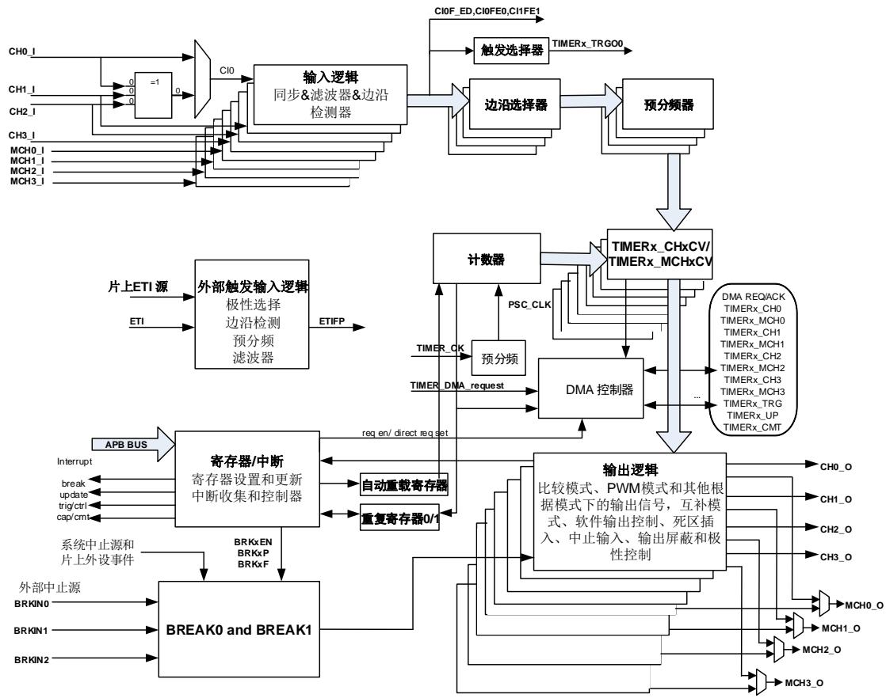

表 24-2. 高级定时器通道介绍

<table><tr><td>通道名称(x=0..3)</td><td>MCHxMSEL[1:0]=00独立模式</td><td>MCHxMSEL[1:0]=11互补模式</td></tr><tr><td>CHx(通道 x)</td><td rowspan="2">CHx 和 MCHx可独立输入捕获、独立比较输出</td><td rowspan="2">只有 CHx 可用于输入,CHx 和 MCHx 输出互补</td></tr><tr><td>MCHx(多模式通道 x)</td></tr></table>

# 24.1.4. 功能描述

# 时钟源选择

高级定时器可以由内部时钟源 CK_TIMER 或者由 $\mathtt { S Y S C F G \_ T I M E R x C F G } ( x = 0 , 7 )$ 寄存器中的$\mathsf { T S C F G y } [ 4 ; 0 ] \ ( \mathsf { y } = 0 . . 9 , 1 5 )$ 位域控制的复用时钟源驱动。

$\yen 123,456,7$ 寄存器中的 $\mathsf { T S C F G y } [ 4 . 0 ] = 5 ^ { \prime } \mathsf { b 0 0 0 0 0 } ( \mathsf { y } = 0 . . 9 , 1 5 )$ 时，定时器选择内部时钟源（连接到RCU模块的CK_TIMER）

如果 $\mathtt { S Y S C F G \_ T I M E R x C F G } ( x = 0 , 7 )$ 寄存器中的 $\mathsf { T S C F G y } [ 4 ; 0 ] = 5 ^ { \prime } \mathsf { b 0 0 0 0 0 } ( \mathsf { y } = 0 . . 9 , 1 5 )$ ，默认用来驱动计数器预分频器的是内部时钟源 CK_TIMER。当 CEN 置位，CK_TIMER 经过预分频器（预分频值由 TIMERx_PSC 寄存器确定）产生 $\mathsf { P S C \_ C L K }$ 。

这种模式下，驱动预分频器计数的 TIMER_CK 等于来自于 RCU 模块的 CK_TIMER。

如果 SYSCFG_TIMERxCFG(x=0,7)寄存器中的 TSCFGy[4:0] (y=0..2,6,8,9)位域设置为非零值，预分频器被其他时钟源驱动，具体在下文说明。当 TSCFGy[4:0] (y=3,4,5,7)被设置为非零值时，计数器预分频器时钟源由内部时钟 TIMER_CK 驱动。

图 24-2. 内部时钟分频为 1时正常模式下的控制电路

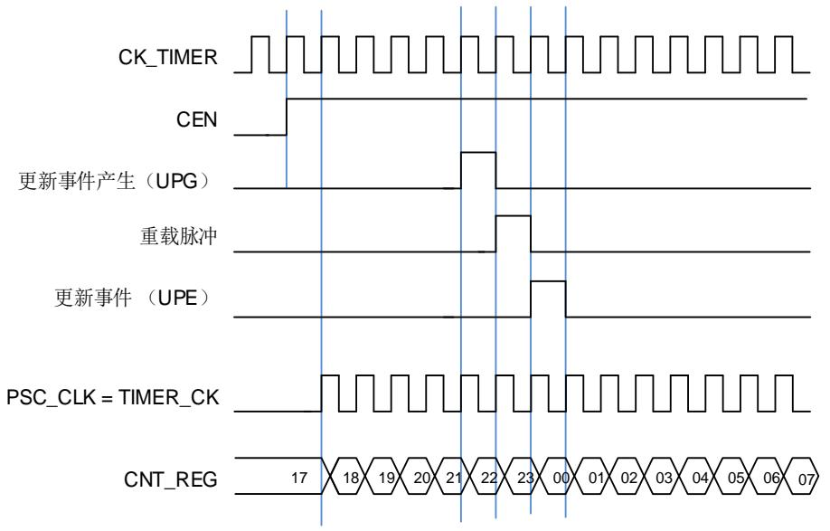

TSCFG6[4:0] !=5’b00000（外部时钟模式0），定时器选择外部输入引脚作为时钟源

计数器预分频器可以在 TIMERx_CHn/ TIMERx_MCHn（n=0..3）引脚的每个上升沿或下降沿计数。这种模式可以通过设置 TSCFG6[4:0]为 0x5~0x7 和 0x9~0xE 来选择。

计数器预分频器也可以在内部触发信号 ITI0/1/2/3/12/13/14 的上升沿计数。这种模式可以通过设置 TSCFG6[4:0]为 0x1~0x4，0x11~0x13 来选择。

SMC1=1’b1（外部时钟模式1），定时器选择外部输入引脚ETI作为时钟源

计数器预分频器可以在外部引脚 ETI 的每个上升沿或下降沿计数。这种模式可以通过设置TIMERx_SMCFG寄存器中的SMC1位为1来选择。另一种选择ETI信号作为时钟源方式是，设置 TSCFG6[4:0]为 0x8。注意 ETI 信号是通过数字滤波器采样 ETI 引脚得到的。如果选择ETI 信号为时钟源，触发控制器包括边沿监测电路将在每个 ETI 信号上升沿产生一个时钟脉冲来为计数器预分频器提供时钟。

注意：ETI 信号可以从外部 ETI 引脚输入，也可由片上外设提供，具体情况可以参考TIMER0_ETI TRIGSEL_TIMER0ETI 模块。

# 时钟预分频器

预分频器可以将定时器的时钟（TIMER_CK）频率按 1 到 65536 之间的任意值分频，分频后的时钟 PSC_CLK 驱动计数器计数。分频系数受预分频寄存器 TIMERx_PSC 控制，这个控制寄存器带有缓冲器，它能够在运行时被改变。新的预分频器的参数在下一次更新事件到来时被采用。

图 24-3. 当预分频器的参数从 1 变到 2 时，计数器的时序图

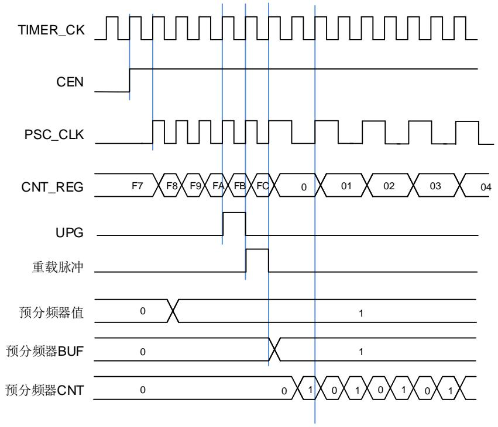

# 向上计数模式

在这种模式，计数器的计数方向是向上计数。计数器从 0 开始向上连续计数到自动加载值（定义在 TIMERx_CAR 寄存器中），一旦计数器计数到自动加载值，会重新从 0 开始向上计数。如果设置了重复计数器，在（TIMERx_CREP0/1+1）次上溢后产生更新事件，否则在每次上溢时都会产生更新事件。在向上计数模式中，TIMERx_CTL0 寄存器中的计数方向控制位 DIR 应该被设置成 0。

当通过 TIMERx_SWEVG 寄存器的 UPG 位置 1 来设置更新事件时，计数值会被清 0，并产生更新事件。

如果 TIMERx_CTL0 寄存器的 UPDIS 置 1，则禁止更新事件。

当发生更新事件时，所有的寄存器（重复计数器，自动重载寄存器，预分频寄存器）都将被更新。

24-4. PSC=0/2 和 24-5. TIMERx_CAR给出一些例子，当 TIMERx_CAR=0x99 时，计数器在不同预分频因子下的行为。

图 24-4. 向上计数时序图， $\mathsf { P S C } = \mathsf { 0 } / 2$

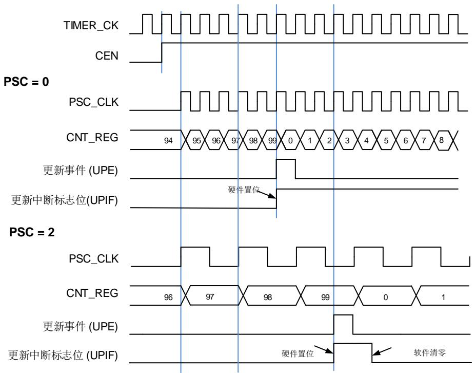

图 24-5. 向上计数时序图，在运行时改变 TIMERx_CAR 寄存器的值

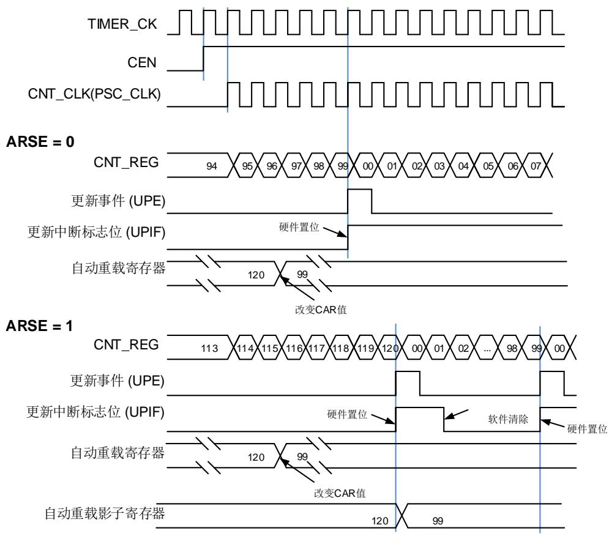

# 向下计数模式

在这种模式，计数器的计数方向是向下计数。计数器从自动加载值（定义在 TIMERx_CAR 寄存器中）向下连续计数到 0。一旦计数器计数到 0，计数器会重新从自动加载值开始计数。如果设置了重复计数器，在（TIMERx_CREP0/1+1）次下溢后产生更新事件，否则在每次下溢时都会产生更新事件。在向下计数模式中，TIMERx_CTL0 寄存器中的计数方向控制位 DIR 应该被设置成 1。

当通过 TIMERx_SWEVG 寄存器的 UPG 位置 1 来设置更新事件时，计数值会被初始化为自动加载值，并产生更新事件。

如果 TIMERx_CTL0 寄存器的 UPDIS 置 1，则禁止更新事件。

当发生更新事件时，所有的寄存器（重复计数器，自动重载寄存器，预分频寄存器）都将被更新。

24-6. PSC=0/2 和 24-7. TIMERx_CAR给出了一些例子，当 TIMERx_CAR=0x99 时，计数器在不同时钟频率下的行为。

图 24-6. 向下计数时序图，PSC=0/2

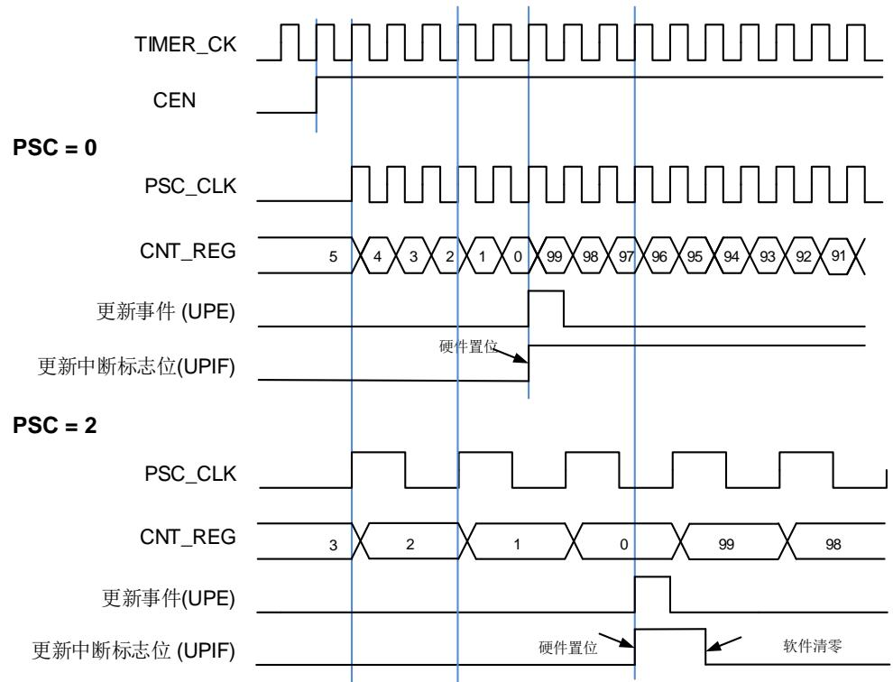

图 24-7. 向下计数时序图，在运行时改变 TIMERx_CAR 寄存器值

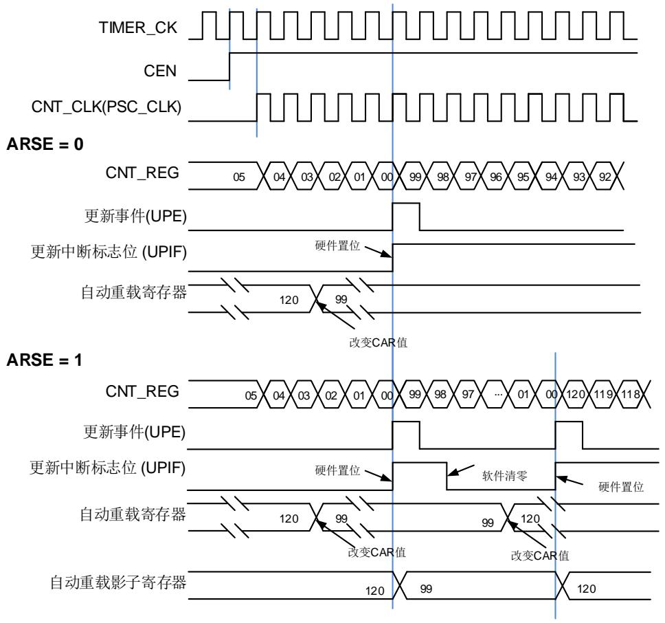

# 中央对齐模式

在中央对齐模式下，计数器交替的从 0 开始向上计数到自动加载值，然后再向下计数到 0。向上计数模式中，定时器模块在计数器计数到（TIMERx_CAR-1）产生一个上溢事件；向下计数模式中，定时器模块在计数器计数到 1 时产生一个下溢事件。在中央计数模式中，TIMERx_CTL0 寄存器中的计数方向控制位 DIR 只读，表明了的计数方向。计数方向被硬件自动更新。

将 TIMERx_SWEVG 寄存器的 UPG 位置 1 可以初始化计数值为 0，并产生一个更新事件，而无需考虑计数器在中央模式下是向上计数还是向下计数。

上溢或者下溢时，TIMERx_INTF 寄存器中的 UPIF 位都会被置 1，然而 CHxIF 位置 1 与TIMERx_CTL0寄存器中CAM的值有关。具体细节参考 24-8. 。

如果 TIMERx_CTL0 寄存器的 UPDIS 置 1，则禁止更新事件。

当发生更新事件时，所有的寄存器（重复计数器，自动重载寄存器，预分频寄存器）都将被更新。

24-8.            给 出 了 一 些 例 子 ， 当 TIMERx_CAR=0x99 ，TIMERx_PSC=0x0时，计数器的行为。

图 24-8. 中央计数模式计数器时序图

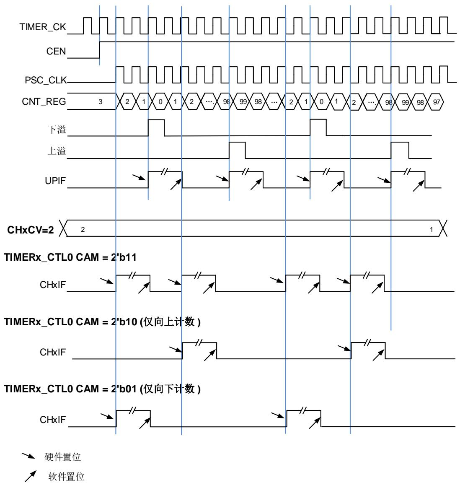

# 重复计数器

高级定时器有两个重复寄存器TIMERx_CREP0/1，可通过配置TIMERx_CFG寄存器中的CREPSEL位来选择。其中TIMERx_CREP0寄存器中的CREP0[7:0]是8位的，TIMERx_CREP1寄存器中的CREP1[31:0]是32位，用户可根据需求选择使用。

重复计数器是用来在（N+1）个计数周期之后产生更新事件，更新定时器的寄存器，N 为TIMERx_CREP0/1 寄存器的 CREP0/1 的值。向上计数模式下，重复计数器在每次计数器上溢时递减；向下计数模式下，重复计数器在每次计数器下溢时递减；在中央对齐模式下，重复计数器在计数器上溢和下溢时递减。

将 TIMERx_SWEVG 寄存器的 UPG 位置 1 可以重载 TIMERx_CREP0/1 寄存器中 CREP0/1的值并产生一个更新事件。

新写入的 CREP0/1 值将在下一次更新事件到来时生效。当 CREP0/1 的值为奇数，并且计数器在中央对齐模式下计数时，更新事件发生在上溢或下溢取决于写入的 CREP0/1 值何时生效。如果在写入奇数到 CREP0/1 寄存器后由软件生成更新事件（UPG 位置 1），则在下溢时产生更新事件。如果在写入奇数到 CREP0/1 寄存器后下一个更新事件发生在上溢，此后将在上溢时产生更新事件。

图 24-9. 中央计数模式下计数器重复时序图

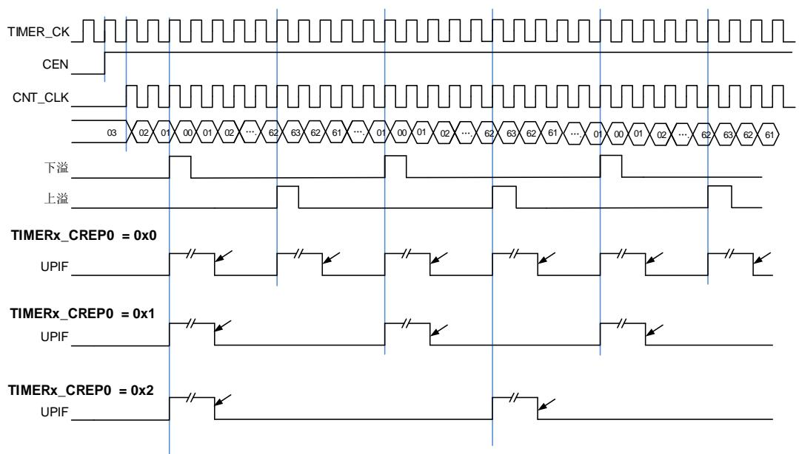

图 24-10. 在向上计数模式下计数器重复时序图

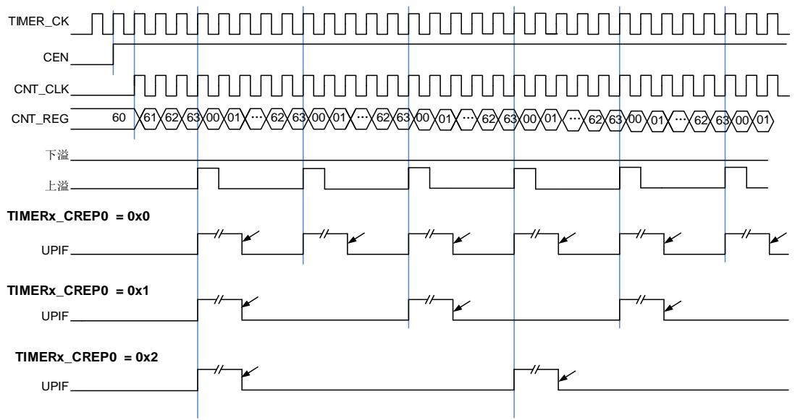

图 24-11. 在向下计数模式下计数器重复时序图

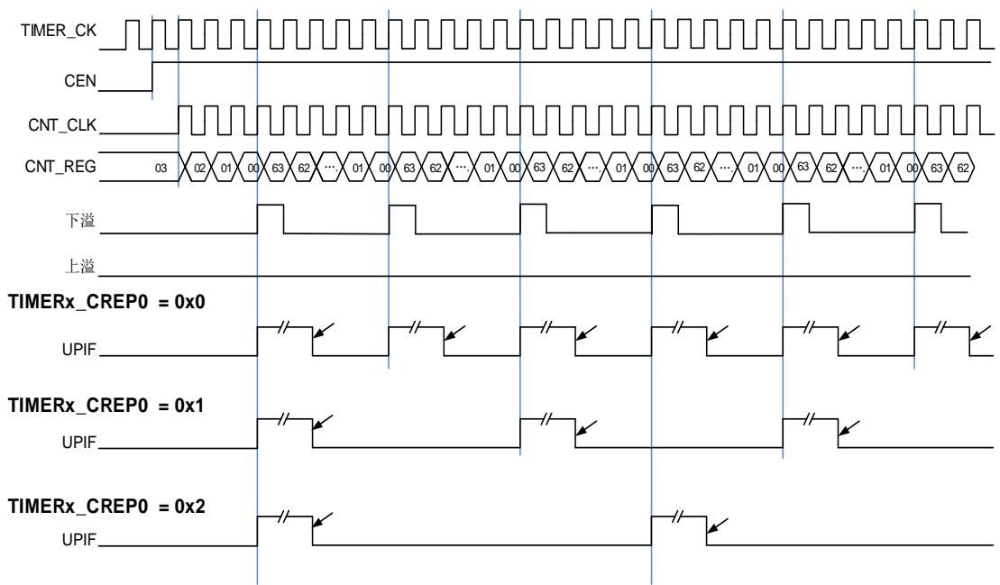

# 捕获/比较通道

高级定时器拥有 8 个独立的通道用于捕获输入或比较输出是否匹配。每个通道都围绕一个通道捕获比较寄存器建立，包括一个输入级，通道控制器和输出级。

当通道用于输入时，通道 x 和多模式通道 x 可独立进行输入捕获；当通道用于比较输出时，通道 x 和多模式通道 x 可输出独立和互补。

# 输入捕获模式

当 MCHxMSEL=2’b00（独立模式）时，通道 x 和多模式通道 x 才可以独立进行输入捕获。

捕获模式允许通道测量一个波形时序，频率，周期，占空比等。输入级包括一个数字滤波器，一个通道极性选择，边沿检测和一个通道预分频器。如果在输入引脚上出现被选择的边沿，TIMERx_CHxCV/ TIMERx_MCHxCV（x=0..3）寄存器会捕获计数器当前的值，同时 CHxIF/MCHxIF（x=0..3）位置 1，如果 CHxIE/ MCHxIE =1（x=0..3），则产生相应的通道中断。

图 24-12. 通道 0 输入捕获逻辑

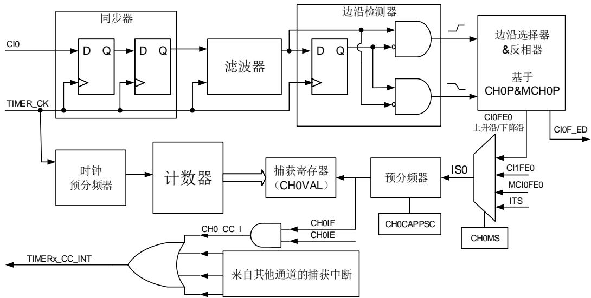

图 24-13. 多模式通道 0 输入捕获逻辑

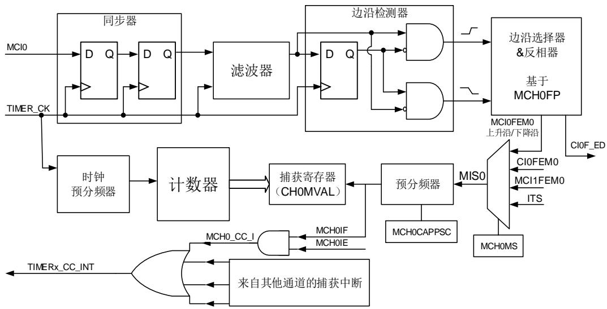

通道输入信号 CIx/ MCIx 有两种选择，一种是 TIMERx_CHx/ TIMERx_MCHxCV 信号，另一种是 TIMERx_CH0，TIMERx_CH1 和 TIMERx_CH2 异或之后的信号（仅限于 CI0）。

通道输入信号 CIx/ MCIx 先被 TIMER_CK 信号同步，然后经过数字滤波器采样，产生一个被滤波后的信号。通过边沿检测器，可以选择检测上升沿或者下降沿。通过配置 CHxP/ MCHxP、MCHxFP 选择使用上升沿或者下降沿。配置 CHxMS/ MCHxMS，可以选择其他通道的输入信号或内部触发信号。配置 IC 预分频器，使得若干个输入事件后才产生一个有效的捕获事件。捕获事件发生，TIMERx_CHxCV/ TIMERx_MCHxCV 存储计数器的值。

配置步骤如下：

第一步：滤波器配置（TIMERx_CHCTL0寄存器中CHxCAPFLT位和TIMERx_MCHCTL0寄存器中CHxMCAPFLT）：

根据输入信号和请求信号的质量，配置相应的CHxCAPFLT/ CHxMCAPFLT位。

第二步：边沿选择（TIMERx_CHCTL2寄存器中CHxP和MCHxP位，TIMERx_MCHCTL2寄存器中MCHxFP[1:0]位域）：

配置CHxP和MCHxP位或MCHxFP位域选择上升沿或者下降沿。

第三步：捕获源选择（TIMERx_CHCTL0寄存器中CHxMS、TIMERx_MCHCTL0寄存器中MCHxMS）：

$\begin{array} { r l } & { - \underbrace { \boxdot { \mathtt { H M H M S } } } _ { \mathrm { \normalfont { \texttt { H M S } } } } \underbrace { \mathrm { S e } \Sigma \boxed { \mathrm { S i d } } \mathrm { X M S / \Psi M C H X M S }  { M C H x M S \sharp \overline { { \mathtt { H M } } }  { \hat { \_ { \delta } } \hat { \_ { \delta } } \hat { \_ { \delta } } \Sigma \hat { \_ { \mathtt { H } } } } } } _ { \mathrm { \normalfont { \texttt { C H } } } } , \frac { \Sigma } { \iiint \mathrm { d } } \Sigma \interleave \mathrm { M E } \underbrace { \Sigma \langle \Psi | \Psi | \Psi \rangle  { M }  { M }  { M }  { M }  { M }  { S e }  { S U } } _ { \mathrm { \normalfont { \texttt { N - } } } } } \\ & { \underbrace { \mathrm { S e } \Sigma \langle \Psi \mathrm { M X M S } \downarrow = 0 \mathrm { X } 0 0 0 \underline { { \pi } } \mathrm { M C } \sf M X M S } \downarrow = 0 \times 0 0 0 0 ) , \frac { \Pi } { \Pi \mathrm { \normalfont { \texttt { H } } } } \underbrace { \Sigma \langle \Psi \mathrm { I M E } \mathrm { R } _ { - } \Sigma \mathrm { \normalfont { \texttt { C } H } } \mathrm { X C } \big { \vee } / \Pi \mathrm { M E } \mathrm { R } _ { - } \mathrm { M C }  { H } \mathrm { x } \mathrm { C } \vee } _ { \mathrm { \normalfont { \texttt { N } } } } } _ { \mathrm { \normalfont { \texttt { N } } } }  \\ & { \frac { \Sigma \mu } { \mathrm { \normalfont { \texttt { H } } } \mathcal { T } } \underbrace { \tilde { \mathrm { R } } \mathrm { { a } } } _ { \mathrm { \normalfont { \texttt { N } } } } \underbrace { \tilde { \mathrm { S e } } \Sigma \tilde { \mathrm { \texttt { H } } } \tilde { \mathrm { S e } } } _ { \mathrm { \normalfont { \texttt { N } } } } \underbrace { \Sigma \ } _ { \mathrm { \normalfont { \texttt { N } } } } } \end{array}$ 

第四步：中断使能（TIMERx_DMAINTEN寄存器中CHxIE、CHxDEN位和MCHxIE、MCHxDEN位）：

$\because \angle E F H \bot A B , \forall x , \forall x , \forall x , \forall x , \forall x , \forall x , \forall x , \forall x , \forall x , \forall x , \forall x , \forall x , \forall x , \forall x , \forall x , \forall x , \forall x , \forall x , \forall x ,$ 

$\begin{array} { r l } { \frac { A \sin C } { A B } + \frac { 1 } { A B } + \frac { 1 } { B } + \sqrt { \frac { 1 } { A B } } + \frac { 1 } { B E } ( \mathsf { T M E R x \_ C H C T L \_ } \frac { A \sin C } { A B } + \frac { \sin B } { A B } \mathsf { T M E H } \times \mathsf { E N } / \mathsf { M C H x E N } ) , } \end{array}$ 

结果：当期望的输入信号发生时，TIMERx_CHxCV/ TIMERx_MCHxCV被设置成当前计数器的值，CHxIF/ MCHxIF位置1。如果CHxIF/ MCHxIF位已经为1，则CHxOF/ MCHxOF位置1。根据TIMERx_DMAINTEN寄存器中CHxIE、CHxDEN位和MCHxIE、MCHxDEN位的配置，相应的中断和DMA请求会被提出。

直接产生：软件设置CHxG位，会直接产生中断和DMA请求。

输入捕获模式也可用来测量 TIMERx_CHx 和 TIMERx_MCHx 引脚上信号的脉冲波宽度。例如，一个 PWM 波连接到 CI0。配置 TIMERx_CHCTL0 寄存器中 CH0MS 为 3’b001，选择通道0的捕获信号为CI0并设置上升沿捕获。配置TIMERx_CHCTL0寄存器中CH1MS为3’b010，选择通道 1 捕获信号为 CI0 并设置下降沿捕获。计数器配置为复位模式，在通道 0 的上升沿复位。TIMERX_CH0CV 寄存器测量 PWM 的周期值，TIMERx_CH1CV 寄存器测量 PWM 占空比值。

# 输出比较模式

24-14. MCHxMSEL = 2’00 x=0,1,2,3 和 24-15.MCHxMSEL = 2’11 x=0,1,2,3 给出了通道的输出比较逻辑。

图 24-14. 输出比较逻辑（当 $\mathsf { M C H } \times \mathsf { M S E L } = 2 ^ { \prime } 0 0$ 时， $\scriptstyle \mathbf { x = 0 , 1 , 2 , 3 } )$ ）

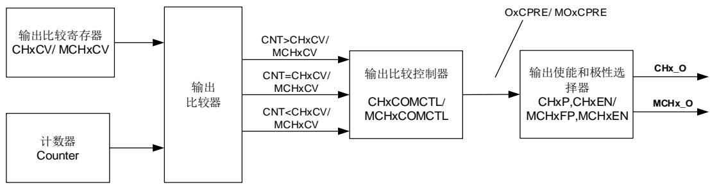

图 24-15. 输出比较逻辑（当 MCHxMSEL = 2’11 时， $\scriptstyle \mathbf { x = 0 , 1 , 2 , 3 } )$ ）

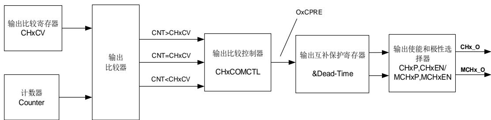

通道输出信号CHx_O/MCHx_O与OxCPRE/ MOxCPRE信号（详情请见 ）的关系描述如下（OxCPRE/ MOxCPRE信号高电平有效）：

当MCHxMSEL=2’b00（TIMERx_CTL2寄存器中），MCHx_O输出与CHx_O输出相互独立。CHx_O输 出 电 平 取 决 于OxCPRE信号、CHxP位 和CHxEN位 （ 详 细 内 容 参 考TIMERx_CHCTL2寄存器）。MCHx_O输出电平取决于MOxCPRE信号、MCHxFP[1:0]位和MCHxEN位（详细内容参考TIMERx_CHCTL2和TIMERx_MCHCTL2寄存器）。请参考24-14. MCHxMSEL = 2’00 x=0,1,2,3 。

当MCHxMSEL=2’b11，MCHx_O输出和CHx_O输出互补。CHx_O/MCHx_O输出电平取决于OxCPRE信号、CHxP/ MCHxP位和CHxEN/ MCHxEN位。请参考 24-15.MCHxMSEL = 2’11 x=0,1,2,3 。

例如（MCHx_O输出与CHx_O输出相互独立）：

1）当设置CHxP=0（CHx_O高电平有效，与OxCPRE输出极性相同）、CHxEN=1（CHx_O输出使能）时：

若OxCPRE输出有效（高）电平，则CHx_O输出有效（高）电平；

若OxCPRE输出无效（低）电平，则CHx_O输出无效（低）电平。

2）当设置MCHxP=1（MCHx_O低电平有效，与MOxCPRE输出极性相反）、MCHxEN=1（MCHx_O输出使能）时：

若MOxCPRE输出有效（高）电平，则MCHx_O输出有效（低）电平；

若MOxCPRE输出无效（低）电平，则MCHx_O输出无效（高）电平。

当MCHxMSEL=2’b11，CHx_O和MCHx_O同时输出时，CHx_O和MCHx_O的具体输出情况还与TIMERx_CCHP寄存器中的相关位（ROS、IOS、POE和DTCFG等位）有关。详情请见。

在输出比较模式，TIMERx 可以产生时控脉冲，其位置，极性，持续时间和频率都是可编程的。当一个输出通道的 TIMERx_CHxCV/ TIMERx_MCHxCV 寄存器与计数器的值匹配时，根据CHxCOMCTL/ MCHxCOMCTL 的配置，这个通道的输出可以被置高电平，被置低电平或者翻转。当计数器的值与 TIMERx_CHxCV/ TIMERx_MCHxCV 寄存器的值匹配时，CHxIF/ MCHxIF位被置 1，如果 CHxIE/ MCHxIE = 1 则会产生中断，如果 CHxDEN/ MCHxDEN =1 则会产生DMA 请求。

配置步骤如下：

第一步：时钟配置：

配置定时器时钟源，预分频器等。

第二步：比较模式配置：

设置CHxCOMSEN/ MCHxCOMSEN位来配置输出比较影子寄存器；

◼ 设置CHxCOMCTL/ MCHxCOMCTL位来配置输出模式（置高电平/置低电平/翻转）；

设置CHxP/ MCHxP/ MCHxFP位来选择有效电平的极性；

设置CHxEN/MCHxEN使能输出。

第三步：通过CHxIE/ MCHxIE/ CHxDEN/ MCHxDEN位配置中断/DMA请求使能。

第四步：通过TIMERx_CAR寄存器和TIMERx_CHxCV寄存器配置输出比较时基：

TIMERx_CHxCV/ TIMERx_MCHxCV可以在运行时根据你所期望的波形而改变。

第五步：设置CEN位使能定时器。

24-16. 显示了三种比较输出模式：翻转/置高电平/置低电平，CAR=0x63,

CHxVAL=0x3。 

图 24-16. 三种输出比较模式

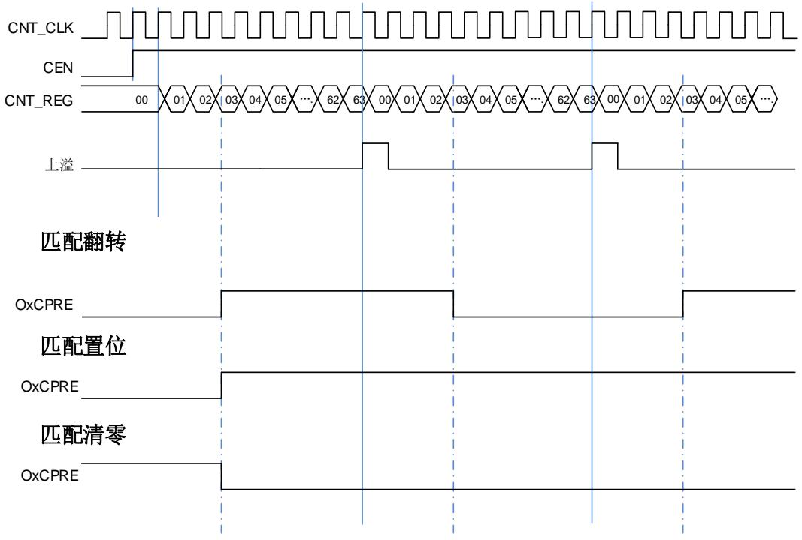

# PWM 模式

在 PWM 输出模式下（PWM 模式 0 是配置 CHxCOMCTL/ MCHxCOMCTL 为 4’b0110，PWM模式 1 是配置 CHxCOMCTL/ MCHxCOMCTL 为 4’b0111），通道根据 TIMERx_CAR 寄存器和 TIMERx_CHxCV/ TIMERx_MCHxCV 寄存器的值，输出 PWM 波形。

根据计数模式，我们可以分为两种PWM波：EAPWM（边沿对齐PWM）和CAPWM（中央对齐PWM）。

EAPWM 的 周 期 由 TIMERx_CAR 寄 存 器 值 决 定 ， 占 空 比 由 TIMERx_CHxCV/TIMERx_MCHxCV寄存器值决定。 24-17. EAPWM 显示了EAPWM的输出波形和中断。

CAPWM的周期由（2*TIMERx_CAR寄存器值）决定，占空比由（2*TIMERx_CHxCV/TIMERx_MCHxCV寄存器值）决定。 24-18. CAPWM 显示了CAPWM的输出波形和中断。

当计数器向上计数时，在PWM0模式下（CHxCOMCTL/ MCHxCOMCTL =4’b0110），如果TIMERx_CHxCV/ TIMERx_MCHxCV寄存器的值大于TIMERx_CAR寄存器的值，通道输出一直 为 有 效 电 平 ； PWM1 模 式 下 （ CHxCOMCTL/ MCHxCOMCTL=4’b0111 ）， 如 果TIMERx_CHxCV/ TIMERx_MCHxCV寄存器的值大于TIMERx_CAR寄存器的值，通道输出一直为无效电平。

图 24-17. EAPWM 时序图

图 24-18. CAPWM 时序图

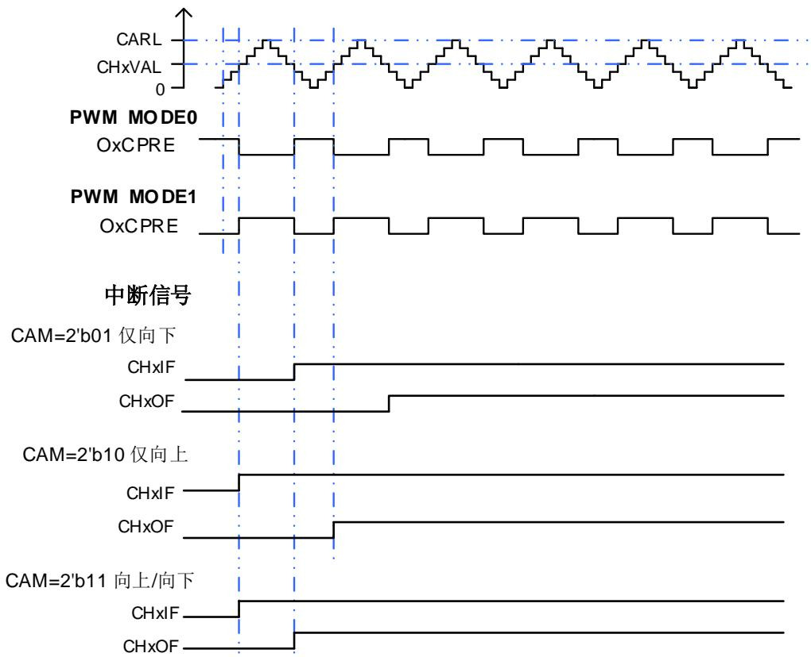

# 复合 PWM模式

在复合 PWM 模式中（CHxCPWMEN = 1’b1，CHxMS[2:0] = 3’b000 和 CHxCOMCTL = 4’b0110、4’b0111），通道 x（x=0..3）上的 PWM 输出信号由 CHxVAL 和 CHxCOMVAL_ADD 位确定。

如果 CHxCOMCTL = 4’b0110（PWM 模式 0）且 DIR = 1’b0（向上计数模式），或者 CHxCOMCTL= 4’b0111（PWM 模式 1）且 DIR = 1’b1（向下计数模式），当计数器和 CHxVAL 的值相匹配时通道 x 输出强制为低。当计数器与 CHxCOMVAL_ADD 的值相匹配时，通道 x 输出强制为高。

如果 CHxCOMCTL =4’b0111（PWM 模式 1）且 DIR = 1’b0（向上计数模式），或者 CHxCOMCTL=4’b0110（PWM 模式 0）且 DIR = 1’b1（向下计数模式），当计数器和 CHxVAL 的值相匹配时通道 x 输出强制为高。当计数器与 CHxCOMVAL_ADD 的值相匹配时，通道 x 输出强制为

低。

PWM 的周期取决于（CARL + 0x0001），PWM 脉冲宽度可以下 24-3  PWM计算。

表 24-3 复合 PWM 脉冲宽度

<table><tr><td>条件</td><td>模式</td><td>PWM脉冲宽度</td></tr><tr><td rowspan="2">CHxVAL &lt; CHxCOMVAL_ADD ≤ CARL</td><td>PWM模式0</td><td>(CARL + 0x0001) + (CHxVAL - CHxCOMVAL_ADD)</td></tr><tr><td>PWM模式1</td><td>(CHxCOMVAL_ADD - CHxVAL)</td></tr><tr><td rowspan="2">CHxCOMVAL_ADD &lt; CHxVAL ≤ CARL</td><td>PWM模式0</td><td>(CHxVAL - CHxCOMVAL_ADD)</td></tr><tr><td>PWM模式1</td><td>(CARL + 0x0001) + (CHxCOMVAL_ADD - CHxVAL)</td></tr><tr><td rowspan="2">(CHxVAL = CHxCOMVAL_ADD ≤ CARL)或 (CHxVAL &gt; CARL &gt; CHxCOMVAL_ADD)</td><td>PWM模式0(向上计数)或 PWM模式1(向下计数)</td><td>100%</td></tr><tr><td>PWM模式0(向下计数)或 PWM模式1(向上计数)</td><td>0%</td></tr><tr><td rowspan="2">CHxCOMVAL_ADD &gt; CARL &gt; CHxVAL</td><td>PWM模式0(向上计数)或 PWM模式1(向下计数)</td><td>0%</td></tr><tr><td>PWM模式0(向下计数)或 PWM模式1(向上计数)</td><td>100%</td></tr><tr><td>(CHxVAL&gt;CARL)且 (CHxCOMVAL_ADD &gt; CARL)</td><td>-</td><td>CHx_O输出保持</td></tr></table>

当计数器计数到CHxVAL，CHxIF位置1且如果CHxIE=1通道x产生中断，如果CHxDEN=1，则产生DMA请求。当计数器计数到CHxCOMVAL_ADD时，CHxCOMADDIF位置1（该中断标志位只在复合PWM模式有效，CHxCPWMEN=1），如果CHxCOMADDIE = 1通道x附加比较中断产生（只有中断产生，没有DMA请求响应）。

根据CHxVAL，CHxCOMVAL_ADD和CARL之间的关系，可以分为四种情况：

1） CHxVAL < CHxCOMVAL_ADD，CHxVAL和CHxCOMVAL_ADD值介于0和CARL之间。

图 24-19. 通道 x 输出 PWM（CHxVAL < CHxCOMVAL_ADD）

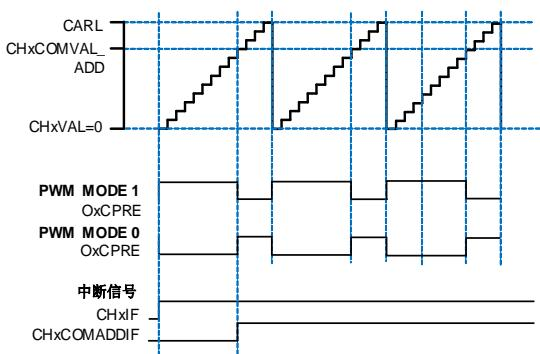

2） CHxVAL = CHxCOMVAL_ADD, CHxVAL和CHxCOMVAL_ADD值介于0和CARL之间。

图 24-20. 通道 x 输出 PWM（CHxVAL = CHxCOMVAL_ADD）

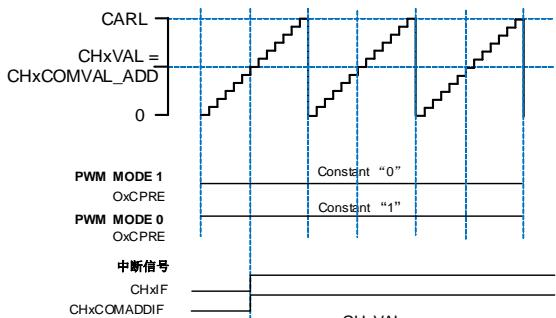

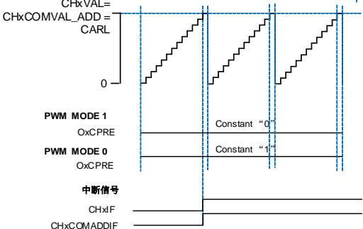

3） CHxVAL > CHxCOMVAL_ADD, CHxVAL和CHxCOMVAL_ADD值介于0和CARL之间。

图 24-21. 通道 x 输出 PWM（CHxVAL > CHxCOMVAL_ADD）

4） CHxVAL或CHxCOMVAL_ADD值大于CARL。

图 24-22. 通道 x 输出 PWM（CHxVAL 或 CHxCOMVAL_ADD > CARL）

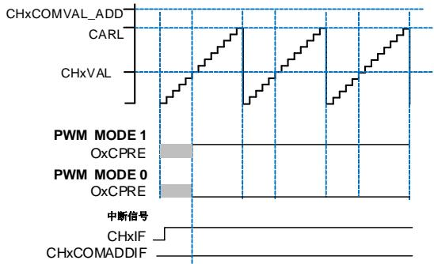

复合PWM模式支持不修改周期只修改占空比的PWM信号的生成。 24-23. x PWMCHxCOMVAL_ADD 显示PWM输出和中断波形。

在 某 些 情 况 下 ， CHxCOMVAL_ADD 的 匹 配 事 件 可 以 发 生 在 下 一 个 计 数 周 期（CHxCOMVAL_ADD值在计数器到达CHxVAL值之后被写入，且CHxCOMVAL_ADD值小于或者等于CHxVAL值）。

图 24-23. 通道 x 输出 PWM 占空比随着 CHxCOMVAL_ADD 值而改变

如果多个通道配置为复合PWM模式，可以为每对通道x的匹配边沿设定一个偏移量（相对于其它通道）。这种特性在产生照明PWM控制信号时非常有用，因为在这种情况下，希望彼此边缘不重合，以消除噪声的产生。CHxVAL寄存器值是PWM脉冲相对于计数器周期开始的偏移。

图 24-24. 复合 PWM 模式下四通道输出

# 输出匹配脉冲选择

当发生匹配事件时，CHx_O（x=0..3）的输出由CHxCOMCTL[3:0]（x=0..3）位设置，通过配置CHxOMPSEL[1:0]（x=0..3）位，可选择CHx_O（x=0..3）的输出信号正常或者脉冲。

当匹配事件发生时，CHxOMPSEL[1:0]（x=0..3）用于选择 ${ \mathsf { O x C P R E } }$ 信号输出（驱动CHx_O）：

CHxOMPSEL = 2’b00，OxCPRE信号根据CHxCOMCTL[3:0]位的配置正常输出；

$\mathsf { C H x O M P S E L } = 2 ^ { \prime } \mathsf { b } 0 1$ ，只有在计数器向上计数，发生匹配事件时，OxCPRE信号输出一个脉冲，且脉冲宽度为一个CK_TIMER时钟周期；

$\mathsf { C H x O M P S E L } = 2 ^ { \cdot } \mathsf { b } 1 0$ ，只有在计数器向下计数，发生匹配事件时，OxCPRE信号输出一个脉冲，且脉冲宽度为一个CK_TIMER时钟周期；

CHxOMPSEL = 2’b11，无论计数器向上计数还是向下计数，发生匹配事件时，OxCPRE信号输出一个脉冲，且脉冲宽度为一个CK_TIMER时钟周期；

图 24-25. 边沿对齐模式下 CHx_O 输出脉冲（CHxOMPSEL≠2’b00）

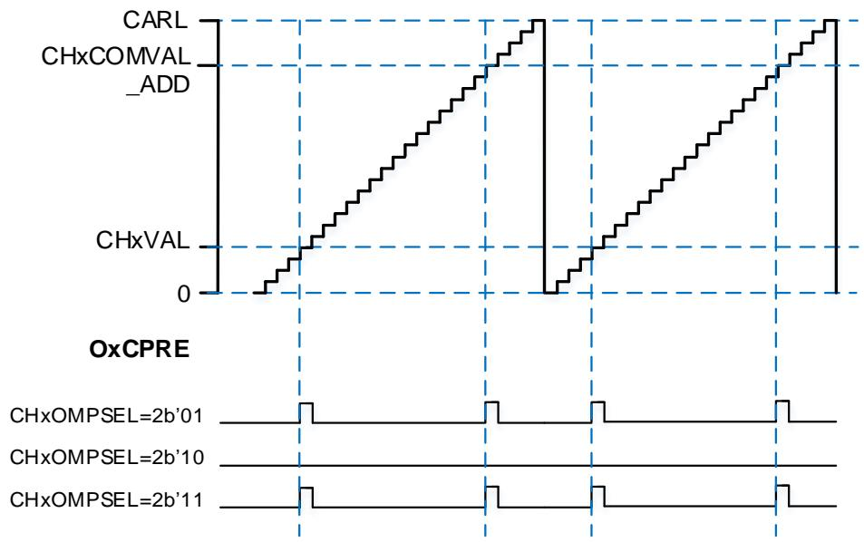

图 24-26. 中央对齐模式下 CHx_O 输出脉冲（CHxOMPSEL≠2’b00）

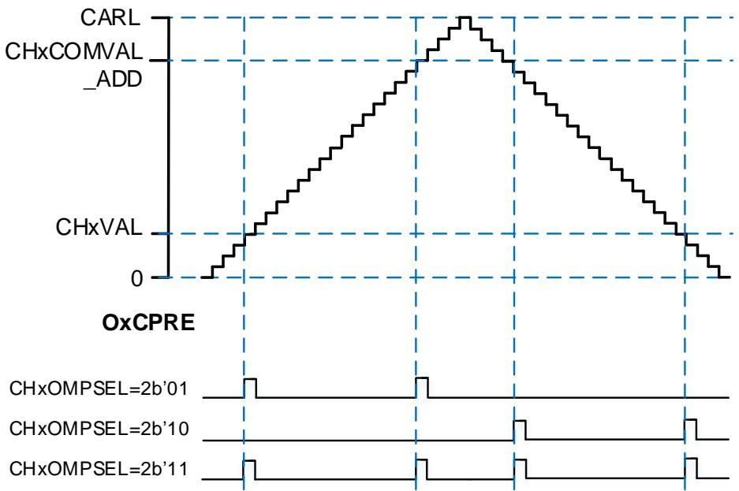

# 通道输出参考信号

如 24-14.  MCHxMSEL = 2’00 x=0,1,2,3 和 24-15.MCHxMSEL = 2’11 x=0,1,2,3 所示，当 TIMERx 用于输出匹配比较模式下，在通道输出信号之前将产生一个中间信号，即 OxCPRE 或 MOxCPRE 信号（通道 x 或多模式通道 x 参考信号）。

OxCPRE和MOxCPRE信号有若干类型的输出功能，通过配置CHxCOMCTL位定义OxCPRE信号类型，通过配置 MCHxCOMCTL 位定义 MOxCPRE 信号类型。

下面以 OxCPRE 为例进行说明，设置 CHxCOMCTL=0x00 可以保持原始电平；设置

CHxCOMCTL=0x01 可以将 OxCPRE 信号设置为高电平；设置 CHxCOMCTL=0x02 可以将OxCPRE 信号设置为低电平；设置 CHxCOMCTL=0x03，在计数器值和 TIMERx_CHxCV 寄存器的值匹配时，可以翻转输出信号。

PWM 模式 0 和 PWM 模式 1 是 OxCPRE 的另一种输出类型，设置 CHxCOMCTL 位域位 0x06或0x07可以配置 PWM模式0/PWM 模式1。在这些模式中，根据计数器值和 TIMERx_CHxCV寄存器值的关系以及计数方向，OxCPRE 信号改变其电平。具体细节描述，请参考相应的位。

设置 CHxCOMCTL =0x04 或 0x05 可以实现 OxCPRE 信号的强制输出功能。输出比较信号能够直接由软件强置为有效或无效状态，而不依赖于 TIMERx_CHxCV 的值和计数器值之间的比较结果。

设置 CHxCOMCEN=1，当由外部 ETI 引脚信号产生的 ETIFP 信号为高电平时，OxCPRE 被强制为低电平。在下一次更新事件到来时，OxCPRE 信号才会回到有效电平状态。

# 互补输出

CHx_O 和 MCHx_O 的输出具有两种情况：

MCHxMSEL=2’b00：MCHx_O输出独立于CHx_O输出。

MCHxMSEL=2’b11 ： MCHx_O 输 出 与 CHx_O 输 出 互 补 ， 且 MCHx_O 的 输 出 不 由MCHxCOMCTL位配置。

当 CHx_O 和 MCHx_O 输出互补时，这两个信号不能同时有效。TIMERx 有 4 对通道，所有 4对通道都具有此功能。互补信号 CHx_O 和 MCHx_O 是由一组参数来决定：TIMERx_CHCTL2寄存器中的 CHxEN 和 MCHxEN 位，TIMERx_CCHP 寄存器中和 TIMERx_CTL1 寄存器中的POEN、ROS、IOS、ISOx 和 ISOxN 位（当 CHx_O 和 MCHx_O 具有独立的死区时间和中止功能时，请参考 ）。输出极性由 TIMERx_CHCTL2 寄存器中的CHxP 和 MCHxP 位来决定。

当 CHx_O 和 MCHx_O 的输出互补时，有三种输出情况：输出使能、输出关闭状态和输出禁能，具体情况可参考 24-4. MCHxMSEL=2’b11

表 24-4. 由参数控制的互补输出表（MCHxMSEL=2’b11）

<table><tr><td colspan="5">互补参数</td><td colspan="2">输出状态</td></tr><tr><td>POEN</td><td>ROS</td><td>IOS</td><td>CHxEN</td><td>MCHxEN</td><td>CHx_O</td><td>MCHx_O</td></tr><tr><td rowspan="5">0</td><td rowspan="5">0/1</td><td rowspan="4">0</td><td rowspan="2">0</td><td>0</td><td colspan="2">CHx_O / CHx_ON = LOWCHx_O / CHx_ON 输出禁能(1)</td></tr><tr><td>1</td><td colspan="2" rowspan="3">CHx_O/CHx_ON输出关闭状态(2):通道先输出无效电平:CHx_O = CHxP,CHx_ON = CHxNP);如果死区产生时钟未失效,在死区时间之后:CHx_O = ISOx,CHx_ON = ISOxN(3)</td></tr><tr><td rowspan="2">1</td><td>0</td></tr><tr><td>1</td></tr><tr><td>1</td><td>x</td><td>x</td><td colspan="2">CHx_O/CHx_ON输出关闭状态:通道先输出无效电平:CHx_O = CHxP,CHx_ON = CHxNP);如果死区产生时钟未失效,在死区时间之后:CHx_O = ISOx,CHx_ON = ISOxN</td></tr><tr><td rowspan="2">1</td><td rowspan="2">0</td><td rowspan="2">0/1</td><td rowspan="2">0</td><td>0</td><td colspan="2">CHx_O/MCHx_O = LOWCHx_O/MCHx_O输出禁能</td></tr><tr><td>1</td><td>CHx_O = LOW</td><td>MCHx_O=OxCPRE⊕</td></tr><tr><td rowspan="7"></td><td rowspan="3"></td><td rowspan="7"></td><td></td><td></td><td>CHx_O输出禁能</td><td>(4)MCHxPMCHx_O输出使能</td></tr><tr><td rowspan="2">1</td><td>0</td><td>CHx_O=OxCPRE ⊕ CHxPCHx_O输出使能</td><td>MCHx_O = LOWMCHx_O输出禁能</td></tr><tr><td>1</td><td>CHx_O=OxCPRE ⊕ CHxPCHx_O输出使能</td><td><eq>\text{MCHx}_\text{O}=(!OxCPRE)^{(5)} \oplus \text{MCHxP}</eq>MCHx_O输出使能</td></tr><tr><td rowspan="4">1</td><td rowspan="2">0</td><td>0</td><td>CHx_O = CHxPCHx_O输出关闭状态</td><td>MCHx_O = MCHxPMCHx_O输出关闭状态</td></tr><tr><td>1</td><td>CHx_O = CHxPCHx_O输出关闭状态</td><td>MCHx_O=OxCPRE ⊕ MCHxPMCHx_O输出使能</td></tr><tr><td rowspan="2">1</td><td>0</td><td>CHx_O=OxCPRE ⊕ CHxPCHx_O输出使能</td><td>MCHx_O = MCHxPMCHx_O输出关闭状态</td></tr><tr><td>1</td><td>CHx_O=OxCPRE ⊕ CHxPCHx_O输出使能</td><td>MCHx_O=!OxCPRE ⊕MCHxPMCHx_O输出使能</td></tr></table>

# 注意：

（1） 输出禁能：CHx_O / CHx_ON 输出与对应引脚断开，对应引脚电平受 GPIO 上下拉配置控制，无上下拉时为悬空高阻态；

（2） 输出关闭状态：CHx_O / CHx_ON 输出无效电平（CHx_O = 0⊕CHxP = CHxP）；

（3） 详情见中止模式章节。

（4） ⊕：异或操作；

（5） (!OxCPRE)：OxCPRE 信号的互补信号。

# 死区时间插入

设置 MCHxMSEL=2’b11，CHxEN 和 MCHxEN 为 1’b1，同时设置 POEN=1，就可以使能死区插入功能。DTCFG 位域定义了死区时间，死区时间对所有通道有效。死区时间设置的细节请参考 TIMERx_CCHP 。

死区时间的插入，确保了通道互补的两路信号不会同时有效。

在 PWM0 模式，当通道 x 匹配发生时（TIMERx 计数器=TIMERx_CHxCV），OxCPRE 翻转。在 24-27. 的 A 点，CHx_O 信号在死区时间内为低电平，直到死区时间过后才变为高电平，而 MCHx_O 信号立刻变为低电平。同样，在 B点，计数器再次匹配（TIMERx 计数器=TIMERx_CHxCV），OxCPRE 信号被清 0，CHx_O 信号被立即清零，MCHx_O 信号在死区时间内仍然是低电平，在死区时间过后才变为高电平。

有时会有一些死角事件发生，例如：如果死区延时大于或者等于CHx_O信号的占空比，CHx_O信号一直为无效值。如 24-27. 所示。

图 24-27. 带死区时间的互补输出

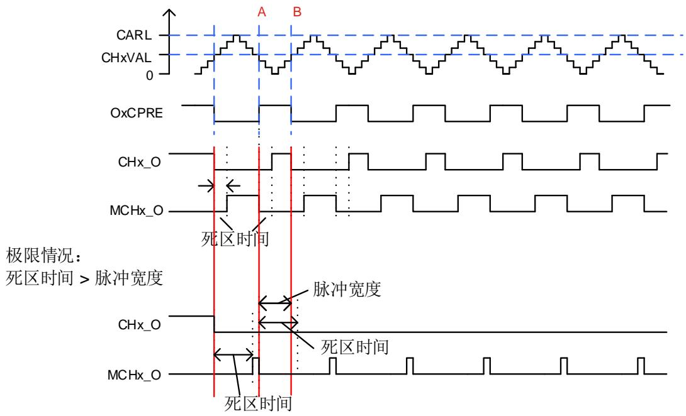

CHx_O和MCHx_O通道可以具有独立的死区时间，具体请参考。

通过配置TIMERx_CTL2寄存器中的DTIENCHx（x = 0..3）位，可实现对每对通道的死区插入功能的独立控制。当DTIENCHx（x = 0..3）位为“0”时，相应的通道CHx_O和MCHx_O将不会插入死区。

# 中止功能

当 MCHxMSEL = 2’b11（MCHx_O 的输出不使用 MCHxCOMCTL 位配置）时，MCHx_O 输出与 CHx_O 输出互补。在这种情况下，CHx_O 和 MCHx_O 信号不能同时设置为有效电平。

高级定时器有两种中止功能：BREAK0 和 BREAK1。可以通过将 TIMERx_CCHP 寄存器中的BRK0EN/ BRK1EN 位置 1 来使能中止功能。中止输入极性由 TIMERx_CCHP 寄存器中的BRK0P/BRK1P 位配置，电平有效。

使用中止功能时，CHx_O 和 MCHx_O 信号的输出电平由以下位控制：TIMERx_CCHP 寄存器的 POEN、IOS 和 ROS 位，TIMERx_CTL1 寄存器的 ISOx 和 ISOxN 位。

中止事件是所有源逻辑或运算的结果。中止功能可以处理三种类型的事件源：

外部信号源：来自BRKINx（x=0..2）输入；

系统源：由RCU中的时钟监视器CKM生成的HXTAL卡住事件、LVD锁定事件，Cortex®-M7锁定事件或SRAM奇偶校验错误事件；

片上外设源：比较器输出、HPDF的看门狗输出。

中止事件也可以由软件置位TIMERx_SWEVG寄存器中的BRK0G/ BRK1G位产生。

两种中止功能逻辑如 24-28. BREAK0 和 24-29. BREAK1所示，其中 BRKINx（x=0..2）可以从 TRIGSEL 模块选择 GPIO 引脚，具体可参考TIMER0_BRKIN TRIGSEL_TIMER0BRKIN 和 TIMER7_BRKIN

TRIGSEL_TIMER7BRKIN 。 

图 24-28. BREAK0 中止功能逻辑图

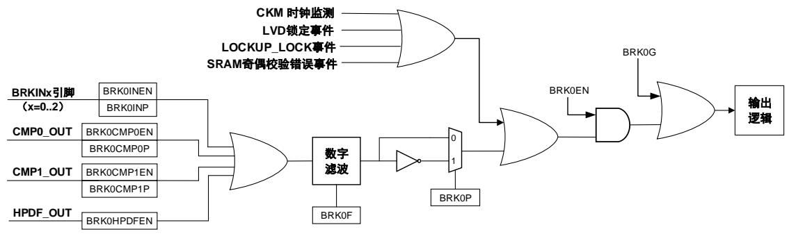

图 24-29. BREAK1 中止功能逻辑图

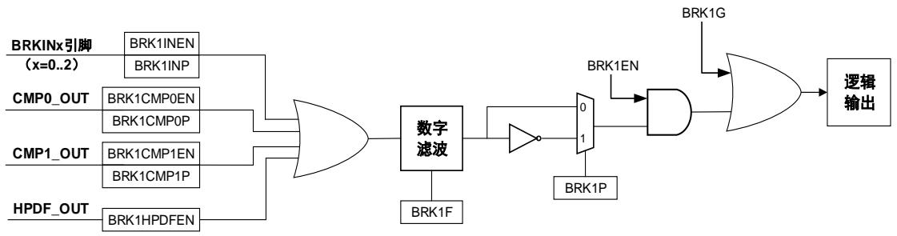

BREAK0可用于处理系统源、片上外设和外部输入信号源的故障，当发生BREAK0中止事件时，输出强制为无效电平，或在死区持续时间之后，输出将以预定的电平（有效或无效）强制输出；BREAK1只用于处理片上外设和外部输入信号源的故障，当发生BREAK1中止事件时，输出强制为无效电平。

当 MCHxMSEL = 2’b11 且发生 BREAK0 中止事件时，POEN 位被异步清除，一旦 POEN 位为 0，CHx_O 和 MCHx_O 的输出由 TIMERx_CTL1 寄存器中的 ISOx 位和 ISOxN 位确定。如果 IOS=0，定时器释放输出使能，否则输出使能仍然为高。当 IOS=1 时，通道输出情况如24-30. BREAK0 IOS=1 所示，首先通道互补输出为复位状态，然后死区时间发生器重新被激活，以便在一个死区时间后驱动输出，输出电平由 ISOx 和 ISOxN 位配置。

图 24-30. 通道响应 BREAK0 中止输入（高电平有效）时，输出信号的行为（IOS=1）

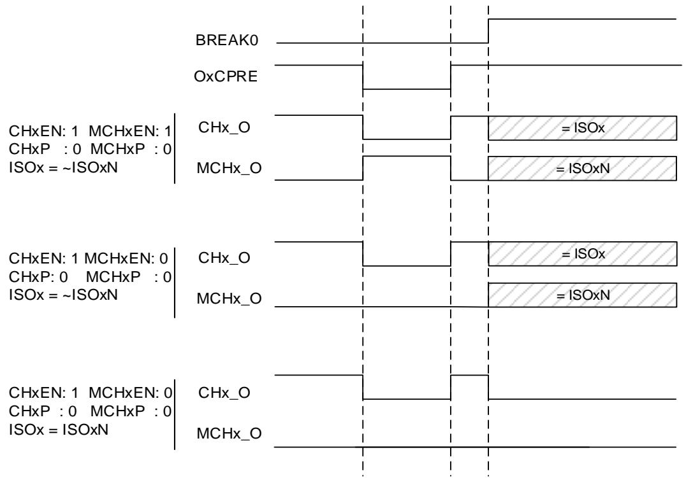

BREAK0的优先级高于BREAK1。只有在IOS=1和ROS=1时，才能使用BREAK1功能。

表 24-5. BREAK0 和 BREAK1 输入信号时，TIMER 互补通道输出情况（break 输入高电平有效）

<table><tr><td rowspan="2">BREAK0 输入</td><td rowspan="2">BREAK1 输入</td><td colspan="2">Output Status</td></tr><tr><td>CHx_O</td><td>MCHx_O</td></tr><tr><td rowspan="2">高电平</td><td>高电平</td><td rowspan="2">IOS=1: CHx_O 输出无效,然后在一个死区时间之后输出空闲电平(由 IOSx 位确定)。IOS=0: CHx_O 输出禁能(无效)</td><td rowspan="2">IOS=1: MCHx_O 输出无效,然后在一个死区时间之后输出空闲电平(由 IOSxN 位确定)。IOS=0: MCHx_O 输出禁能(无效)</td></tr><tr><td>低电平</td></tr><tr><td>低电平</td><td>高电平</td><td>CHx_O 输出禁能(无效)</td><td>MCHx_O 输出禁能(无效)</td></tr></table>

发生中止事件时，TIMERx_INTF 寄存器的 BRK0IF/BRK1IF 位被置 1。如果 BRKIE=1，中断产生。

图 24-31. BREAK0 和 BREAK1 中止输入有效时通道输出信号的行为

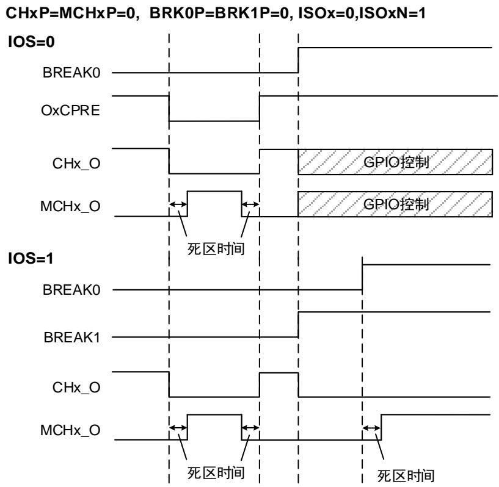

CHx_O 和 MCHx_O 通道可以具有独立中止功能时，请参考 。通过配置 TIMERx_CTL2 寄存器中的 BEKENCHx（x = 0..3）位，可实现对每对通道的中止功能进行独立控制。当 BEKENCHx（x = 0..3）位为“0”且发生中止事件时，相应的通道 CHx_O和 MCHx_O 输出保持不变。

# 锁存中止功能

高级定时器的中止输入引脚BRKINx（x=0..2）具有锁存中止功能，可通过设置

TIMERx_CCHP寄存器中的BRK0LK/ BRK1LK位为1，将相应的BRKINx（x=0..2）配置为锁存中止功能。

当使能了锁存中止功能时，需要将 BRKINx（x=0..2）引脚设置为开漏模式，且低电平有效（BRK0P/BRK1P=0，BRK0INxP/ BRK1INxP =0）。任何中止源请求发生时，都可以将相应的BRKINx（x=0..2）引脚强制为低电平。若 BRKINx（x=0..2）引脚设置为高电平有效（BRK0P/BRK1P=1，BRK0INxP/ BRK1INxP =1），则锁存中止功能被禁止。

当中止功能使能（将TIMERx_CCHP寄存器中的BRK0EN=1或BRK1EN=1）时，通过软件将TIMERx_SWEVG寄存器中的BRK0G/ BRK1G位置1也可以将BRKINx（x=0..2）引脚强制为低电平。

当中止功能未使能（将TIMERx_CCHP寄存器中的BRK0EN/ BRK1EN位为0）时，通过软件将BRK0G/ BRK1G位置1，对BRKINx（x=0..2）引脚无影响。但BRK0F/BRK1F标志位会置位，通道输出为安全状态。

将 TIMERx_CCHP 寄存器中的 BRK0REL/ BRK1REL 位置 1，可以释放 BRKINx（x=0..2）引脚，当中止输入源无效时，BRK0REL/ BRK1REL 位由硬件清零，BRKINx（x=0..2）引脚将恢

复锁存中止功能。

在下面两种情况下，不能释放中止输入引脚 BRKINx（x=0..2）：

中止输入源有效：虽然BRK0REL/ BRK1REL位置1，释放了BRKINx（x=0..2）引脚，但由于中止源仍然存在，故中止事件仍然有效；

POEN=1：通道输出使能时，即使BRK0REL/ BRK1REL位置1，也不能释放BRKINx（x=0..2）引脚。

表 24-6. 中止功能锁存/释放条件

<table><tr><td>POEN</td><td>BRK0LK/ BRK1LK</td><td>BRK0REL/ BRK1REL</td><td>中止输入引脚状态</td></tr><tr><td rowspan="2">0</td><td>1</td><td>0</td><td>锁存</td></tr><tr><td>1</td><td>1</td><td>释放</td></tr></table>

BREAK0/BREAK1 输入引脚 BRKINx（x=0..2）的锁存中止功能默认是使能的（BRK0REL=0和 BRK1REL=0），当 BREAK0/BREAK1 中止事件发生时，可以通过下面的方法来重新配置锁存中止功能：

BRK0REL=1或BRK1REL=1，释放BRKINx（x=0..2）引脚；

软件等待系统中止源无效，可通过软件清除SYSBIF标志位；

◼ 软件轮询BRK0REL和BRK1REL位，直到BRK0REL=0和BRK1REL=0（硬件实现）。

上述过程完成后，BREAK0/BREAK1 锁存中止功能重新使能，此时，可通过软件将 POEN 置1 来恢复 PWM 输出。

图 24-32. BREAK0 的 BRKINx（x=0..2）引脚锁存功能逻辑图

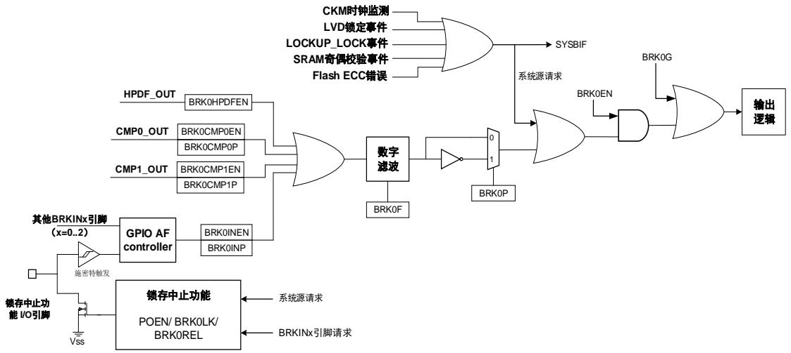

# 独立的死区时间插入和中止功能

CHx_O和MCHx_O具有独立的死区时间插入和中止功能，允许每对通道具有自己的死区时间和中止功能。在此功能中，CHx_O和MCHx_O实际上由TIMERx_FCCHPy（y = 0..3）寄存器中的IOS位、ROS位和DTCFG[7:0]控制。

通过配置TIMERx_FCCHPy（y=0..3）寄存器中的FCCHPyEN位，可以选择每对通道是否采用独立的死区时间插入和中止功能控制：当FCCHPyEN=0时，TIMERx_CCHP寄存器中的ROS、IOS和DTCFG[7:0]有效；当FCCHPyEN=1时，TIMERx_FCCHPy寄存器中的ROS、IOS和DTCFG[7:0]有效，使能独立的死区时间插入和中止功能。

# 正交译码器

正交译码器功能使用由TIMERx_CH0和TIMERx_CH1引脚生成的CI0和CI1正交信号各自相互作用产生计数值。在每个输入源改变期间，DIR位被硬件自动改变。

输 入 源 可 以 是 只 有 CI0 ， 可 以 只 有 CI1 ， 或 着 可 以 同 时 有 CI0 和 CI1 ， 通 过 设 置TSCFGy[4:0](y=0..2) != 5’b00000来选择使用哪种模式。计数器计数方向改变的机制如 24-7.所示。其中，CI0FE0、CI1FE1是经过滤波和极性选择后的CI0、CI1信号。正交译码器可以当作一个带有方向选择的外部时钟，这意味着计数器会在0和自动加载值之间连续的计数。因此，用户必须在计数器开始计数前配置TIMERx_CAR寄存器。

表 24-7. 不同译码器模式下的计数方向

<table><tr><td rowspan="2">计数模式</td><td rowspan="2">电平</td><td colspan="2">CI0FE0</td><td colspan="2">CI1FE1</td></tr><tr><td>上升</td><td>下降</td><td>上升</td><td>下降</td></tr><tr><td rowspan="2">正交译码器模式0TSCFG0[4:0]!= 5&#x27;b000000</td><td>CI1FE1=1</td><td>向下</td><td>向上</td><td>-</td><td>-</td></tr><tr><td>CI1FE1=0</td><td>向上</td><td>向下</td><td>-</td><td>-</td></tr><tr><td rowspan="2">正交译码器模式1TSCFG1[4:0]!= 5&#x27;b000000</td><td>CI0FE0=1</td><td>-</td><td>-</td><td>向上</td><td>向下</td></tr><tr><td>CI0FE0=0</td><td>-</td><td>-</td><td>向下</td><td>向上</td></tr><tr><td rowspan="4">正交译码器模式2TSCFG2[4:0]!= 5&#x27;b000000</td><td>CI1FE1=1</td><td>向下</td><td>向上</td><td>X</td><td>X</td></tr><tr><td>CI1FE1=0</td><td>向上</td><td>向下</td><td>X</td><td>X</td></tr><tr><td>CI0FE0=1</td><td>X</td><td>X</td><td>向上</td><td>向下</td></tr><tr><td>CI0FE0=0</td><td>X</td><td>X</td><td>向下</td><td>向上</td></tr></table>

注意：“-”意思是“无计数”；“X" 意思是不可能。“0”意思是低电平，“1”意思是高电平。

图 24-33. 译码器接口模式下计数器运行例子

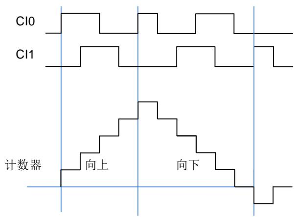

图 24-34. CI0FE0 极性反相的译码器接口模式下的例子

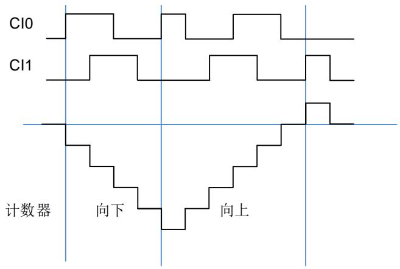

# 正交译码器信号检测

支持两种正交译码器信号检测：信号跳变检测和断线检测。

正交译码器信号跳变检测功能可用于检测两个正交译码器输入信号CI0、CI1的电平跳变沿（上升沿或下降沿）是否同时发生，可通过将TIMERx_CTL2寄存器中的DECJDEN位置1来使能。当DECJDEN=1时，若两个正交信号CI0和CI1的电平跳变同时发生，则中断标志位DECJIF置位。若DECJIE=1，则相应的中断产生。

正交译码器信号断线检测功能可用于检测正交译码器输入信号CI0、CI1是否正常，可通过将TIMERx_CTL2寄存器中的DECDISDEN位置1来使能。正交译码器信号检测模块包括2个32位的看门狗计数器和1个周期寄存器，具体如 24-35. 所示，CI0FE0、CI1FE1信号分别用于复位2个看门狗计数器。

当DECDISDEN=1时，2个看门狗计数器同时开始向上计数，若看门狗计数器计数到看门狗周期值（该值由TIMERx_WDGPER寄存器中的WDGPER[31:0]位域确定），则看门狗计数器计数超时，中断标志位DECDISIF置位。若DECDISIE=1，则相应的中断产生。

图 24-35. 正交译码器信号断线检测框图

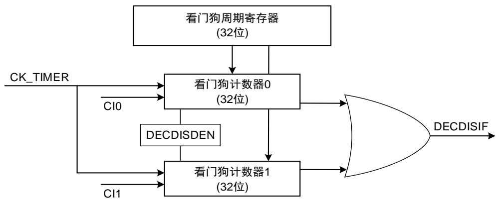

# 非正交译码

非正交译码器功能有两种模式：非正交译码器模式0和非正交译码器模式1，通过设置TSCFGy[4:0](y=8,9) != 5’b00000来选择。这两种计数模式下的输入源有两个：CI0和CI1。

使用非正交译码器模式0时，CI0作为计数脉冲，CI1作为计数选择信号。CH1P=0时，只有当CI1输入信号为高电平时，计数器才会在CI0输入信号的上升沿向上计数；CH1P=1时，只有当CI1输入信号为低电平时，计数器才会在CI0输入信号的上升沿向上计数。具体细节可见 24-36.0 CH1P=0 .

图 24-36. 非正交译码器模式 0 计数器运行实例（CH1P=0）

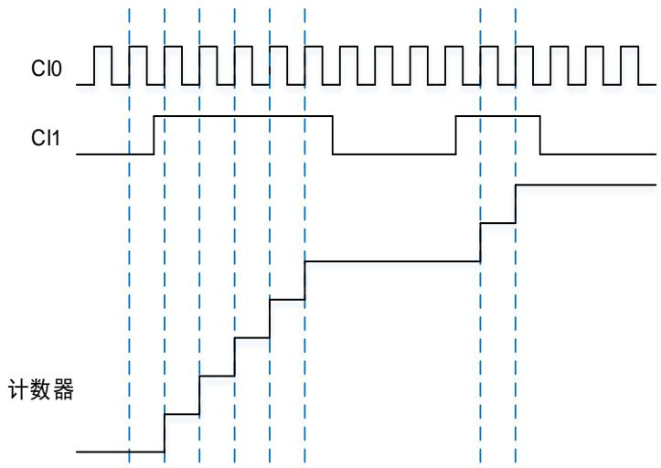

使用非正交译码器模式1时，CI0作为计数脉冲（CH0P用于选择计数边沿）；CI1作为计数方向选择信号。具体计数情况请见 24-8. 1 和 24-37.1 CH0P=0 。

表 24-8. 非正交译码器模式 1 的计数情况

<table><tr><td>CHOP</td><td>CI1电平</td><td>计数器计数情况</td></tr><tr><td rowspan="2">0</td><td>CI1为高电平</td><td>计数器在CI0输入信号的上升沿向上计数</td></tr><tr><td>CI1为低电平</td><td>计数器在CI0输入信号的上升沿向下计数</td></tr><tr><td rowspan="2">1</td><td>CI1为高电平</td><td>计数器在CI0输入信号的下降沿向上计数</td></tr><tr><td>CI1为低电平</td><td>计数器在CI0输入信号的下降沿向下计数</td></tr></table>

图 24-37. 非正交译码器模式 1 计数器运行实例（CH0P=0）

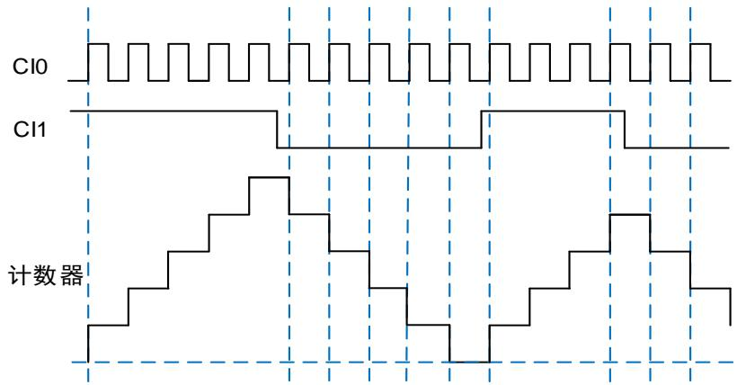

# 霍尔传感器接口功能

高级定时器支持霍尔传感器接口功能，该功能可以用来控制 BLDC 电机。

24-38. BLDC 是定时器和电机的连接示意图。众所周知，我们要两个定时器。TIMER_in 定时器（可以是高级定时器或者通用 L0 定时器）接收来自电机霍尔传感器的三路信号，这三路信号是电机转子的位置信号。

三个霍尔传感器与 TIMER_in 定时器的三路输入捕获引脚一一对应连接，每个霍尔传感器输入一路波形到输入引脚，分析三路霍尔信号可以计算出转子的位置和速度。

通过定时器内部连接，例如 TRGO-ITIx，TIMER_in 定时器和 TIMER_out 定时器可以连接在一起。TIMER_out 定时器根据 ITIx 触发信号输出 PWM 波，驱动 BLDC 电机，控制 BLDC 电机的速度。这样，TIMER_in 定时器和 TIMER_out 定时器的连接形成了一个反馈电路，可以根据需求改变配置。

TIMER_in 定时器需要具备输入异或功能，所以可以选择高级定时器和通用 L0 定时器。

TIMER_out 定时器需要具备互补输出和死区插入功能，所以可以选择高级定时器。

另外，可以通过 TRIGSEL 模块，选择互连的定时器，例如：

TIMER_in（TIMER0） -> TIMER_out（TIMER7 ITI0） 

TIMER_in（TIMER1） -> TIMER_out（TIMER0 ITI1） 

选择好合适的互连定时器，定时器和 BLDC 的线路也已经连接好，我们就可以配置定时器了。有以下关键配置：

设置TI0S，使能异或功能。三路输入信号的任何一路发生变化，CI0都会翻转，CH0VAL此时会捕获计数器的当前值。

设置CCUC和CCSE，使能ITIx直接连接到换相功能。

根据需求配置PWM参数。

图 24-38. 霍尔传感器用在 BLDC 电机控制中

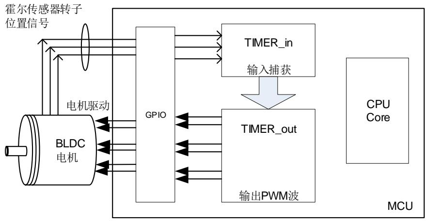

图 24-39. 两个定时器之间的霍尔传感器时序图

高级/通用L0定时器 TIMER_in 工作在输入捕获模式

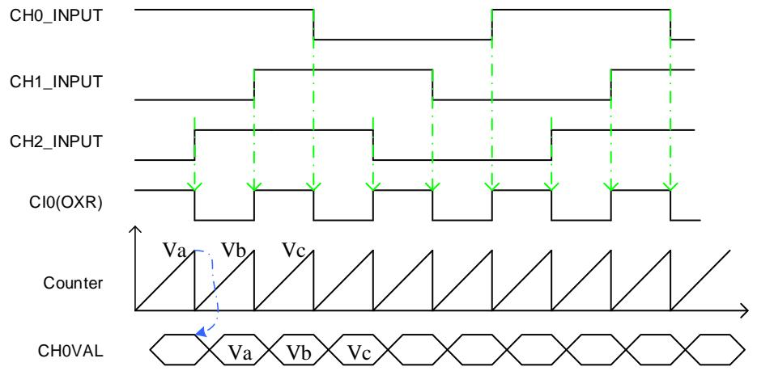

高级定时器TIMER_out 工作在输出比较模式(带有死区的PWM)

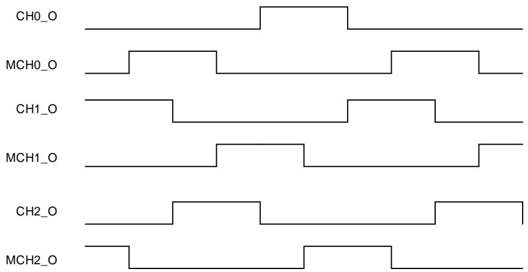

# 主-从管理

TIMERx 能在多种模式下同步外部触发，包括复位模式，暂停模式和事件模式等，可以通过设置 SYSCFG_TIMERxCFG(x=0,7)寄存器中的 TSCFGy[4:0] (y=3..7)位域来确定，具体的输入触发源可以通过 TSCFGy[4:0] (y=3..7)位域值来选择。

表 24-9. 从模式例子列表

<table><tr><td></td><td>模式选择</td><td>触发源选择</td><td colspan="2">极性选择</td><td>滤波和预分频</td></tr><tr><td>列举</td><td>TSCFGy[4:0]y=3:复位模式y=4:暂停模式y=5:事件模式y=6:外部时钟模式0y=7:复位+事件模式</td><td>TSCFGy[4:0]00000: Mode disable00001: ITI000010: ITI100011: ITI200100: ITI300101: CI0F_ED00110: CI0FE000111: CI1FE1</td><td colspan="2">如果触发源是CIxFEx(x=0..3)或者MCIxFEMx(x=0..3),配置CHxP、MCHxP和MCHxFP来选择极性和反相。如果触发源是ETIFP(滤波后的ETI外部触发输入),配置ETP选择</td><td>触发源ITIx,滤波和预分频不可用触发源CIx/MCIx,配置CHxCAPFLT/MCHxCAPFLT设置滤波,分频不可用触发源是ETIFP,滤波和预分频不可用</td></tr><tr><td></td><td>模式选择</td><td>触发源选择</td><td colspan="2">极性选择</td><td>滤波和预分频</td></tr><tr><td></td><td></td><td>01000: ETIFP(1)01001: CI2FE201010: CI3FE301011: MCI0FEM001100: MCI1FEM101101: MCI2FEM201110: MCI3FEM310001: ITI1210010: ITI1310011: ITI14</td><td colspan="2">极性和反相</td><td></td></tr><tr><td rowspan="2">例1</td><td>复位模式当触发输入上升沿,计数器清零重启</td><td>TSCFG3[4:0]5'b00001,选择ITIO为触发源</td><td colspan="2">触发源是ITIO,极性选择不可用</td><td>触发源是ITIO,滤波和预分频不可用</td></tr><tr><td colspan="5">图24-40. 复位模式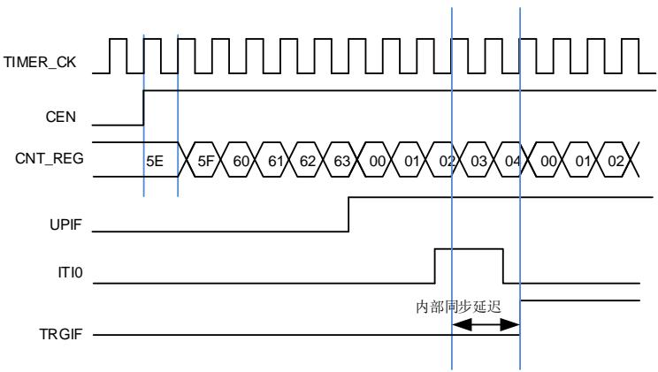</td></tr><tr><td rowspan="2">例2</td><td>暂停模式当触发输入为低的时候,计数器暂停计数</td><td>TSCFG4[4:0]=5'b00110,选择CI0FE0为触发源</td><td colspan="2">TIOS=0(非异或)[MCHOP=0,CHOP=0]CI0FE0不反相,在上升沿捕获。</td><td>在这个例子中滤波被旁路</td></tr><tr><td colspan="5">图24-41. 暂停模式下的控制电路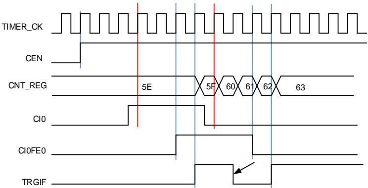</td></tr><tr><td>例3</td><td>事件模式触发输入的上升沿计数器开始计数</td><td>TSCFG5[4:0]=5'b01000,选择ETIFP为触发源</td><td>ETP=0没有极性改变</td><td colspan="2">ETPSC=1,2分频ETFC=0,无滤波</td></tr><tr><td></td><td>模式选择</td><td>触发源选择</td><td>极性选择</td><td colspan="2">滤波和预分频</td></tr><tr><td></td><td colspan="5">图24-42.事件模式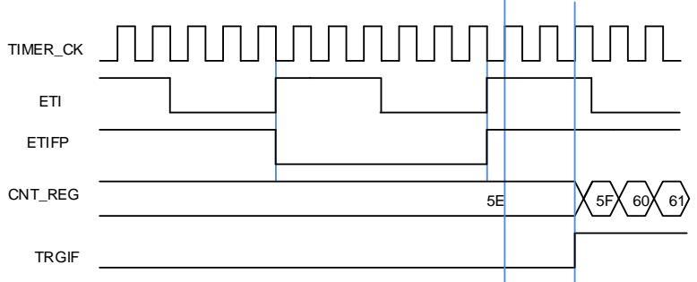</td></tr></table>

(1) ETI 信号可以从外部 ETI 引脚输入，也可由片上外设提供，具体情况可以参考 TIMER0_ETITRIGSEL_TIMER0ETI 模块。

# 单脉冲模式

单脉冲模式与重复模式是相反的，设置 TIMERx_CTL0 寄存器的 SPM 位置 1，可使能单脉冲模式。当 SPM 置 1，计数器在下次更新事件到来后清零并停止计数。为了得到脉冲波，可以通过设置 CHxCOMCTL/ MCHxCOMCTL 配置 TIMERx 为 PWM 模式或者比较模式。

一旦设置定时器运行在单脉冲模式下，没有必要设置 TIMERx_CTL0 寄存器的定时器使能位CEN=1 来使能计数器。触发信号沿或者软件写 CEN=1 都可以产生一个脉冲，此后 CEN 位一直保持为 1 直到更新事件发生或者 CEN 位被软件写 0。如果 CEN 位被软件清 0，计数器停止工作，计数值被保持。如果 CEN 值被硬件更新事件自动清 0，计数器将被再次初始化。

在单脉冲模式下，有效的外部触发边沿会将 CEN 位置 1，使能计数器。然而，执行计数值和TIMERx_CHxCV 寄存器值的比较结果依然存在一些时钟延迟。单脉冲模式下，触发上升沿产生之后，OxCPRE/ MOxCPRE 信号将被立即强制转换为与发生比较匹配时相同的电平，但是不用考虑比较结果。

单脉冲模式也同样适用于复合 PWM 模式（CHxCPWMEN = 1’b1 和 CHxMS[2:0] = 3’b000）。

图 24-43. 单脉冲模式，TIMERx_CHxCV = 0x04 TIMERx_CAR=0x60

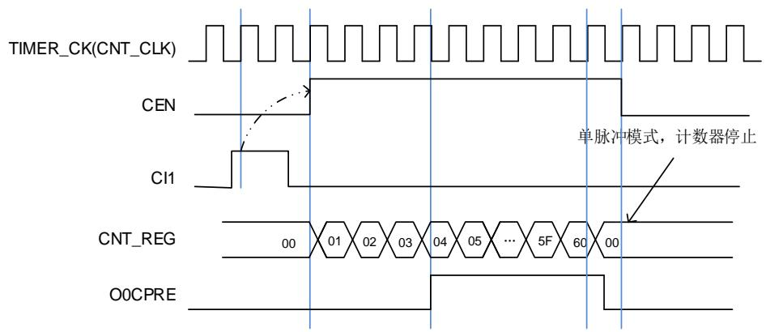

# 可延时的单脉冲模式

可 以 通 过 将 TIMERx_CHCTLx/ TIMERx_MCHCTLx 寄 存 器 中 的 CHxCOMCTL[3:0]/

MCHxCOMCTL[3:0]位置1来使能可延时的单脉冲模式。在这个模式下，通道输出参考信号OxCPRE/ MOxCPRE的脉冲宽度由TIMERx_CAR寄存器值确定。

一旦设置定时器运行在可延时的单脉冲模式下，需进行以下配置：

定时器必须工作在从模式下，SYSCFG_TIMERxCFG(x=0,7)寄存器中的 TSCFG7[4:0] !=5’b00000，从模式选择复位+事件模式；

CHxCOMCTL[3:0]/ MCHxCOMCTL[3:0]位设置为 4’b1000（可延时单脉冲模式 0）或4’b1001（可延时单脉冲模式 1）

在可延时单脉冲模式0下，OxCPRE/ MOxCPRE的输出情况类似与PWM模式0。在向上计数模式时，OxCPRE/ MOxCPRE先输出有效电平，当外部触发事件发生时，立即输出无效电平，当下一次更新事件发生时，再变成有效电平；在向下计数模式时，OxCPRE/ MOxCPRE先输出无效电平，当外部触发事件发生时，立即输出有效电平，当下一次更新事件发生时，再变成无效电平。

在可延时单脉冲模式1下，OxCPRE/ MOxCPRE的输出情况类似与PWM模式1。在向上计数模式时，OxCPRE/ MOxCPRE先输出无效电平，当外部触发事件发生时，立即输出有效电平，当下一次更新事件发生时，再变成无效电平；在向下计数模式时，OxCPRE/ MOxCPRE先输出有效电平，当外部触发事件发生时，立即输出无效电平，当下一次更新事件发生时，再变成有效电平。

# 注意：

1） 不能使用中央对齐模式，TIMERx_CTL0 寄存器中的 CAM[1:0] = 2’b00；

2） 在向上计数时（TIMERx_CTL0寄存器中的DIR = 0），TIMERx_CHxCV/ TIMERx_MCHxCV的值设置为 0；在向下计数时，TIMERx_CHxCV/ TIMERx_MCHxCV 的值应大于或等于TIMERx_CAR 的值。

图 24-44. 可延时单脉冲模式（TIMERx_CHxCV=0x00, TIMERx_CAR=0x60）

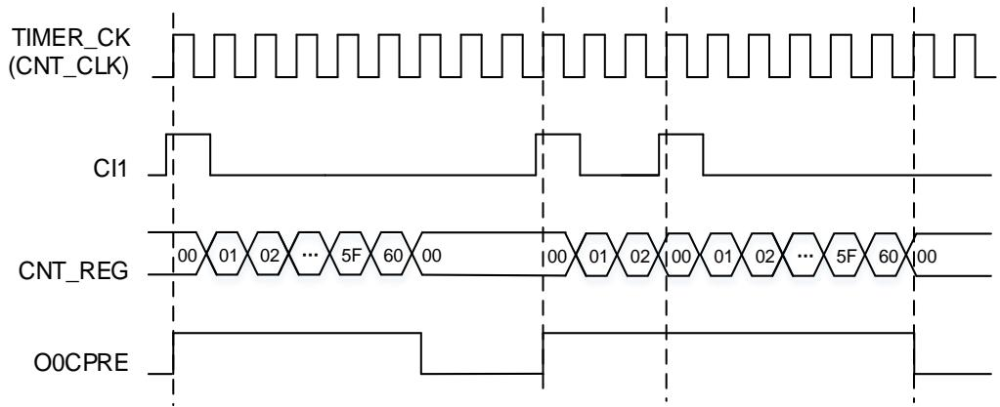

# 定时器互连

定时器之间可以内部级联或者同步，通过配置一个定时器工作在主模式另一个定时器工作在从模式来实现。

互连的例子：

定时器2作为定时器0的预分频器

配置定时器 2 为定时器 0 的预分频器，步骤如下：

1. 配置定时器2为主模式，选择其更新事件（UPE）为触发输出（配置TIMER2_CTL1寄存器的MMC0=3’b010）。定时器2在每次计数器溢出产生更新事件时，输出一个周期信号；

2. 配置定时器2周期（TIMER2_CAR寄存器）；

3. 配 置 定 时 器 0 工 作 在 外 部 时 钟 模 式 0 ， 定 时 器 0 输 入 触 发 源 为 定 时 器 2（SYSCFG_TIMER0CFG1寄存器中的TRCFG6[4:0] = 5b’00011）；

4. 写1到CEN位启动定时器0（TIMER0_CTL0寄存器）；

5. 写1到CEN位启动定时器2（TIMER2_CTL0寄存器）。

用定时器2的使能/更新信号来启动定时器0

用定时器 2 的使能信号来启动定时器 0，见 24-45. 2 0。在定时器 2 使能信号输出后，定时器 0 按照分频后的内部时钟从当前值开始计数。

当定时器 0 接收到触发信号，它的 CEN 位被自动置 1，计数器计数直到禁能定时器 0。两个定时器的计数器频率都是 TIMER_CK 经过预分频器 3 分频后频率 $( \mathsf { f c N T \_ c l K } = \mathsf { f _ { T I M E R \_ C K } } / 3 )$ ）。步骤如下：

1. 配置定时器2为主模式，发送它的使能信号作为触发输出（配置TIMER2_CTL1寄存器的MMC0=3’b001）；

2. 配置定时器0工作在事件模式，定时器0输入触发源为定时器2（SYSCFG_TIMER0CFG0寄存器中的 $\Gamma { \sf R C F G 5 } [ 4 ; 0 ] = 5 { \sf b } ^ { \prime } 0 0 0 1 1 )$ ）；

3. 写1到CEN来开启定时器2（TIMER2_CTL0寄存器）。

图 24-45. 用定时器 2 的使能信号触发定时器 0

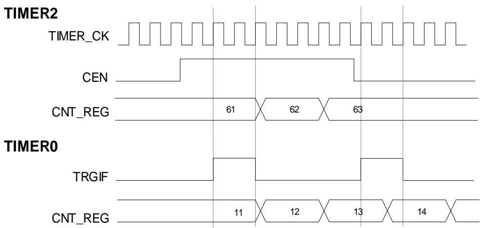

在这个例子中，我们也可以使用更新事件代替使能信号作为触发源。见 24-46. 20，按以下步骤进行：

1. 配置定时器2为主模式，发送它的更新事件（UPE）作为触发输出（配置TIMER2_CTL1寄存器的 $\mathsf { M M C O } { = } 3 ^ { \prime } \mathsf { b } 0 1 0 )$ ）；

2. 配置定时器2的周期（TIMER2_CARL寄存器）；

3. 配置定时器0工作在事件模式，定时器0输入触发源为定时器2（SYSCFG_TIMER0CFG0寄存器中的 $\mathsf { P R C F G 5 } [ 4 ; 0 ] = 5 \mathsf { b } ^ { \prime } 0 0 0 1 1 \ )$ ）

4. 写1到CEN来开启定时器2（TIMER2_CTL0寄存器）。

图 24-46. 用定时器 2 的更新事件来触发定时器 0

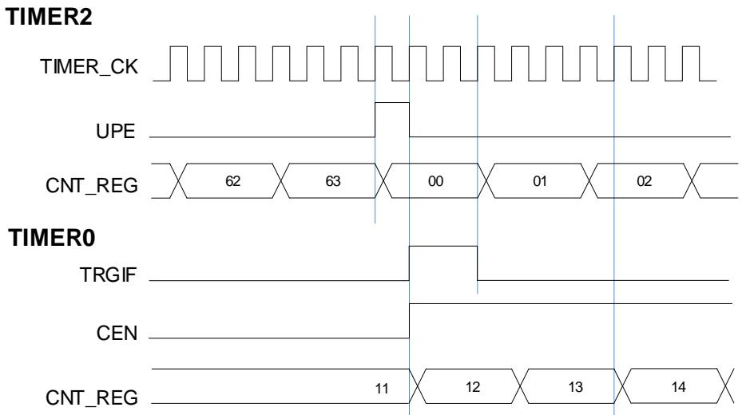

使用定时器2的使能/O0CPRE参考信号来使能定时器0计数。

在这个例子中，我们使用定时器2的使能输出来控制定时器0的使能。如 24-47. 20，在定时器2被使能后，定时器0在内部分频的时钟上开始计数。两个计数器的时钟频率都是由TIMER_CK时钟3分频得来（ $( \mathsf { f } _ { \mathsf { C N T \_ C L K } } = \mathsf { f } _ { \mathsf { T I M E R \_ C K } } / 3 )$ ），步骤如下：

1. 配置定时器2在主模式，配置其输出使能信号作为触发输出（配置TIMER2_CTL1寄存器的MMC0=3’b001）；

2. 配置定时器0工作在暂停模式，定时器0输入触发源为定时器2（SYSCFG_TIMER0CFG0寄存器中的TRCFG4[4:0] = 5b’00011）；

3. 写1到CEN位来使能定时器0（TIMER0_CTL0寄存器）；

4. 写1到CEN位来启动定时器2（TIMER0_CTL0寄存器）；

5. 写0到CEN位来停止定时器2（TIMER0_CTL0寄存器）。

图 24-47. 用定时器 2 的使能来选通定时器 0

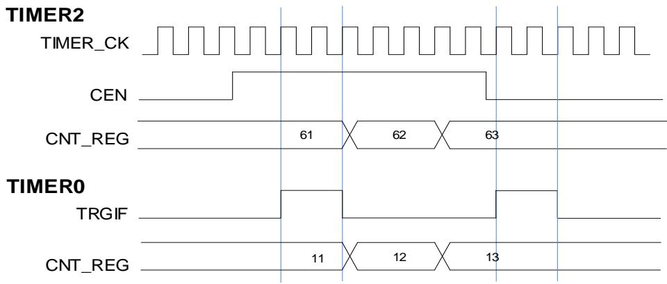

这个例子中，我们也可以使用定时器2的O0CPRE信号代替其使能信号输出作为触发源。步骤如下：

1. 配置定时器2在主模式下，配置O0CPRE信号为触发输出（配置TIMER2_CTL1寄存器的

MMS=3’b100）； 

2. 配置定时器2的O0CPRE波形（TIMER2_CH0CTL寄存器）；

3. 配置定时器0工作在暂停模式，定时器0输入触发源为定时器2（SYSCFG_TIMER0CFG0寄存器中的TRCFG4[4:0] = 5b’00011）；

4. 写1到CEN位来使能定时器0（TIMER0_CTL0寄存器）；

5. 写1到CEN位来开启定时器2（TIMER0_CTL0寄存器）。

图 24-48. 用定时器 2 的 O0CPRE 信号选通定时器 1

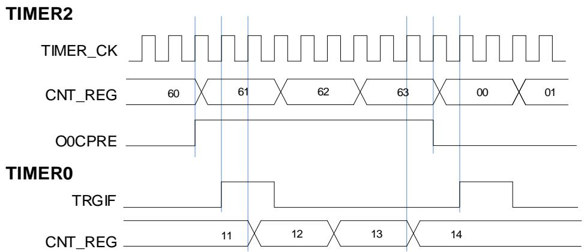

# 使用一个外部触发来同步两个定时器

配置定时器2的使能信号触发定时器0的开启，配置定时器2的CI0输入信号上升沿来触发定时器2。为了确保两个定时器同步开启，定时器2必须配置在主/从模式。步骤如下：

1. 配置定时器2工 作 在 事件 模 式 ， 定 时 器2输 入触 发 源 为CI0的触发输入CI0F_ED（SYSCFG_TIMER02CFG0寄存器中的TRCFG5[4:0] = 5b’00101）；

2. 写MSM=1（TIMER2_SMCFG寄存器）来配置定时器2工作在主/从模式；

3. 配置定时器0工作在事件模式，定时器0输入触发源为定时器2（SYSCFG_TIMER0CFG0寄存器中的TRCFG5[4:0] = 5b’00011）。

当定时器2的CI0信号产生上升沿时，两个定时器的计数器在内部时钟下开始同步计数，二者的TRGIF标志位都被置1。

图 24-49. 用定时器 2 的 CI0 输入来触发定时器 0 和定时器 2

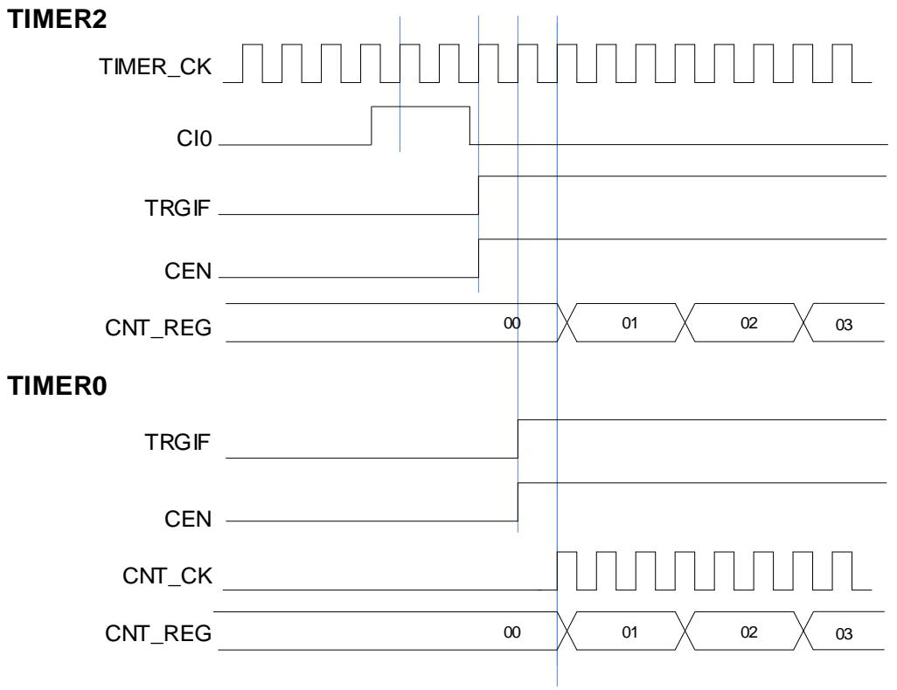

# 定时器 DMA模式

定时器 DMA 模式是指通过 DMA 模块配置定时器的寄存器。有两个跟定时器 DMA 模式相关的寄存器：TIMERx_DMACFG 和 TIMERx_DMATB。当然，必须要使能 DMA 请求，一些内部中断事件可以产生 DMA请求。当中断事件发生，TIMERx 会给 DMA 发送请求。DMA配置成M2P 模式，PADDR 是 TIMERx_DMATB 寄存器地址，DMA 就会访问 TIMERx_DMATB 寄存器。实际上，TIMERx_DMATB 寄存器只是一个缓冲，定时器会将 TIMERx_DMATB 映射到一个内部寄存器，这个内部寄存器由 TIMERx_DMACFG 寄存器中的 DMATA 来指定。如果TIMERx_DMACFG 寄存器的 DMATC 位域值为 0，表示 1 次传输，定时器的发送 1 个 DMA请求就可以完成。如果 TIMERx_DMACFG 寄存器的 DMATC 位域值不为 1，例如其值为 3，表示4次传输，定时器就需要再多发3次DMA请求。在这3次请求下，DMA对TIMERx_DMATB寄存器的访问会映射到访问定时器的 DMATA+0x4、DMATA+0x8、DMATA+0xC 寄存器。总之，发生一次 DMA内部中断请求，定时器会连续发送（DMATC+1）次请求。

如果再来1次DMA请求事件，TIMERx将会重复上面的过程。

# UPIF位备份功能

可以通过配置TIMERx_CTL0寄存器中的UPIFBUEN位来使能UPIF位的备份功能，UPIF和UPIFBU位之间没有延迟，两者完全同步。

使能该功能后，TIMERx_INTF寄存器中的UPIF位将会被实时备份到TIMERx_CNT寄存器中的UPIFBU位。这可以避免在读计数器和中断处理时产生冲突的情况。

# 定时器调试模式

当Cortex®-M7内核停止，DBG_CTL寄存器中的TIMERx_HOLD位置1时，定时器的计数器停止计数。

