# 27. 串行外设接口/片上音频接口（SPI/I2S）

# 27.1. 简介

SPI/I2S模块可以通过SPI协议或I2S音频协议与外部设备进行通信。

串行外设接口（Serial Peripheral Interface，缩写为SPI）提供了基于SPI协议的数据发送和接收功能，可以工作于主机或从机模式。SPI接口支持具有硬件CRC计算和校验的全双工、半双工和单工模式。SPI3 / 4还支持SPI四线主机模式。

片上音频接口（Inter-IC Sound，缩写为I2S）支持四种音频标准，分别是I2S飞利浦标准，MSB对齐标准，LSB对齐标准和PCM标准。它可以在四种模式下运行，包括主机发送模式，主机接收模式，从机发送模式和从机接收模式。

# 27.2. 主要特性

# 27.2.1. SPI 主要特性

具有全双工、半双工和单工模式的主从操作；

32位宽度，独立的发送和接收FIFO；

4位到32位数据帧格式；

低位在前或高位在前的数据位顺序；

软件和硬件NSS管理，MOSI与MISO引脚复用功能的交换；

硬件CRC计算、发送和校验；

发送和接收支持DMA模式；

支持SPI TI模式；

多主机多从机功能；

配置和设置保护；

可调的数据帧之间的最小延时和NSS与数据流之间的最小延时；

主机模式错误可触发中断，上溢、下溢和CRC错误检测；

可调的主设备接收器采样时间；

可配置的FIFO阈值（数据打包）；

在从机模式，下溢条件可配置；

支持SPI四线功能的主机模式（只有SPI3 / 4）。

# 27.2.2. I2S 主要特性

具有发送和接收功能的主从操作；

1 支持四种I2S音频标准：飞利浦标准，MSB对齐标准，LSB对齐标准和PCM标准；

数据长度可以为16位，24位和32位；

通道长度为16位或32位；

提高可靠性的错误信号：下溢、上溢和帧格式错误；

32位宽的发送和接收缓冲区；

通过I2S时钟分频器，可以得到8 kHz到192 kHz的音频采样频率；

可编程空闲状态时钟极性；

可以输出主时钟（MCK）；

发送和接收支持DMA功能；

32位宽度，独立的发送和接收FIFO。

# 27.3. SPI 功能说明

# 27.3.1. SPI 结构框图

图 27-1. SPI 结构框图

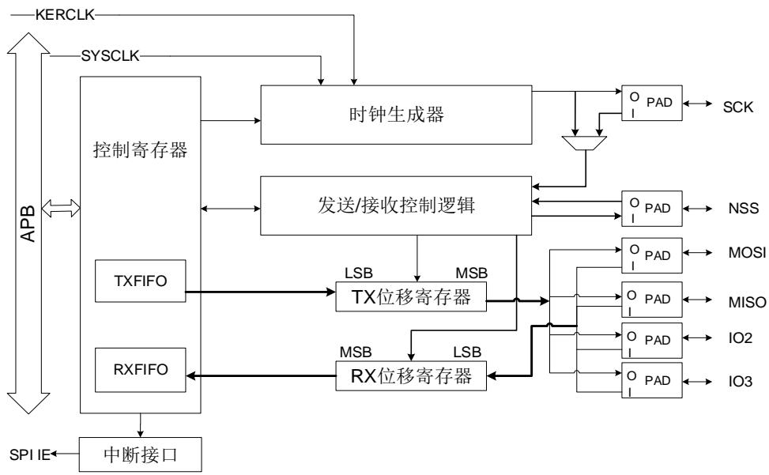

SYSCLK：系统时钟，由APB总线提供。需要访问SPI寄存器时，该时钟必须有效；

KERCLK：内核时钟，由RCU 提供，和系统时钟是异步的关系；

时钟信号的频率没有特定限制，但需与用户使用条件及数据传输速度匹配，防止数据丢失；（注：建议 SYSCLK 大于等于 KERCLK 的频率）

SPI 从机的 SCK 信号由 SPI 主机提供。

# 27.3.2. SPI 信号线描述

常规配置（非 SPI四线模式）

表 27-1. SPI 信号描述

<table><tr><td>引脚名称</td><td>方向</td><td>描述</td></tr><tr><td>SCK</td><td>I/O</td><td>主机:SPI时钟输出从机:SPI时钟输入</td></tr><tr><td>MISO</td><td>I/O</td><td>主机:数据接收线从机:数据发送线主机双向线模式:不使用从机双向线模式:数据发送和接收线</td></tr><tr><td>MOSI</td><td>I/O</td><td>主机:数据发送线从机:数据接收线主机双向线模式:数据发送和接收线从机双向线模式:不使用</td></tr><tr><td>NSS</td><td>I/O</td><td>软件 NSS 模式:不使用主机硬件 NSS 模式:NSSDRV = 1 时,为 NSS 输出,适用于单主机模式;NSSDRV = 0 时,为 NSS 输入,适用于多主机模式。从机硬件 NSS 模式:为 NSS 输入,作为从机的片选信号。</td></tr></table>

# SPI 四线配置

SPI默认配置为单线模式，当SPI_QCTL中的QMOD位置1时，配置为SPI四线模式（只适用于SPI3 / 4）。SPI四线模式只能工作在主机模式。

在SPI四线模式下，SPI通过以下6个引脚与外部设备连接：

表 27-2. SPI 四线信号描述

<table><tr><td>引脚名称</td><td>方向</td><td>描述</td></tr><tr><td>SCK</td><td>O</td><td>SPI 时钟输出</td></tr><tr><td>MOSI</td><td>I/O</td><td>发送或接收数据 0</td></tr><tr><td>MISO</td><td>I/O</td><td>发送或接收数据 1</td></tr><tr><td>IO2</td><td>I/O</td><td>发送或接收数据 2</td></tr><tr><td>IO3</td><td>I/O</td><td>发送或接收数据 3</td></tr><tr><td>NSS</td><td>O</td><td>NSS 输出</td></tr></table>

# 串口数据线交换配置

SPI可以通过设置SPI_CFG1寄存器的SWPMIO位去交换MOSI与MISO的功能。

表 27-3. MISO / MISO 信号交换描述

<table><tr><td>MODE</td><td>SWPMIO</td><td>MOSI</td><td>MISO</td></tr><tr><td rowspan="2">主发送</td><td>0</td><td>发送</td><td>-</td></tr><tr><td>1</td><td>-</td><td>发送</td></tr><tr><td rowspan="2">从发送</td><td>0</td><td>-</td><td>发送</td></tr><tr><td>1</td><td>发送</td><td>-</td></tr><tr><td rowspan="2">主接收</td><td>0</td><td>-</td><td>接收</td></tr><tr><td>1</td><td>接收</td><td>-</td></tr><tr><td rowspan="2">从接收</td><td>0</td><td>接收</td><td>-</td></tr><tr><td>1</td><td>-</td><td>接收</td></tr><tr><td rowspan="2">主全双工</td><td>0</td><td>发送</td><td>接收</td></tr><tr><td>1</td><td>接收</td><td>发送</td></tr><tr><td rowspan="2">从全双工</td><td>0</td><td>接收</td><td>发送</td></tr><tr><td>1</td><td>发送</td><td>接收</td></tr></table>

# 27.3.3. SPI 时序和数据帧格式

SPI_CFG1寄存器中的CKPL位和CKPH位决定了SPI时钟和数据信号的时序。CKPL位决定了空闲状态时SCK的电平，CKPH位决定了第一个或第二个时钟跳变沿为有效采样边沿。在TI模式下，这两位没有意义。

图 27-2. SPI 常规模式下的时序图

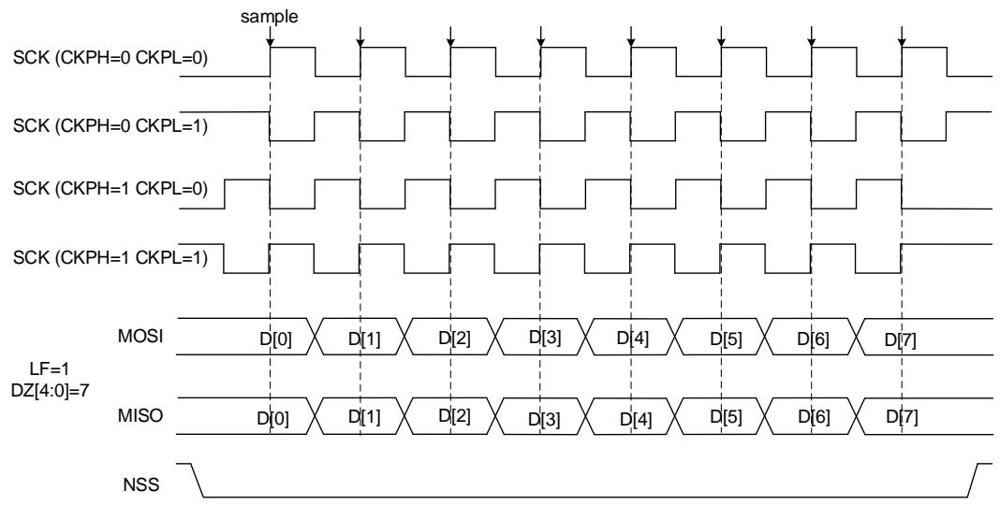

图 27-3. SPI3 / 4 四线模式下的 SPI 时序图 $( \mathsf { C K P L } = 1 , \mathsf { C K P H } = 1 , \mathsf { L F } = 0 )$ ）

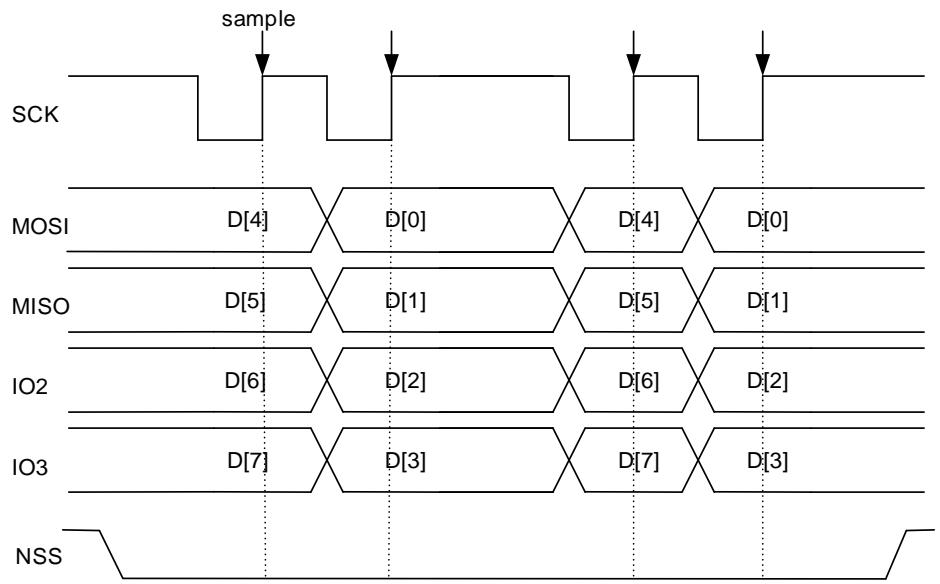

在常规模式中，通过SPI_CFG0中的DZ[4:0]位域配置数据长度，可以设置为4位至32位。该设置不仅适用于数据的发送也适用于数据的接收。通过设置SPI_CFG1中的LF位可以配置数据顺序，当LF=1时，SPI先发送LSB位，当LF=0时，则先发送MSB位。在TI模式中，数据顺序固定为先发MSB位。在SPI四线模式下，数据长度固定为8位。

当访问SPI_TDATA / SPI_RDATA寄存器时，数据帧总是右对齐成一个字节（如果数据长度小于或等于一个字节）或一个半字或一个字。通讯时，只有数据长度内的位会随时钟输出。

图 27-4. SPI 数据帧右对齐示意图

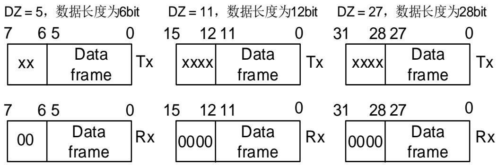

# 27.3.4. SPI 时钟延迟模式

SPI可以被配置为主机或者从机。当SPI被配置为主机模式，时钟SCK从SPI主机发出，经过延迟到达从机，从机驱动MISO数据发送，MISO数据从从机再次经过延迟到达主机采样端，这一系列延迟会导致SPI主机接收的数据和时钟有相位差，从而导致数据采样错误，这一点在较高速度的比特率下会更为明显。

图 27-5. SPI 数据时钟传输路径示意图

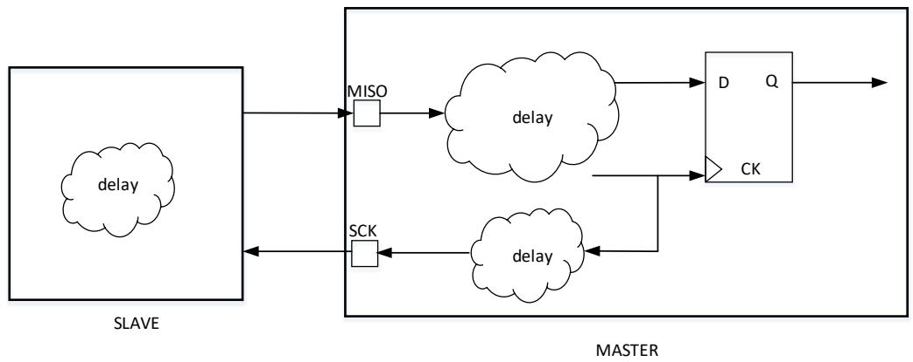

为了解决这一问题，可以通过配置SPI_RXDLYCK调节SPI内部主机的接收时钟相位使得满足正确的采样时序（此配置是非必须的，需要结合实际的场景使用）。

SPI_RXDLYCK的MRXDEN为1’b0开启延迟功能，配置1’b1关闭延迟功能。MRXD配置5’b00000~5’b11111可将延迟长度配置为1~32个延迟单元（常温下一个延迟单元的延迟是0.5ns）。用户需要根据自身场景配置延迟Tdelay。（Tdelay > Tdelaysck + Tdrd + Tdelaymiso + Tsu）

图27-6. SPI主机接收延迟配置时序图

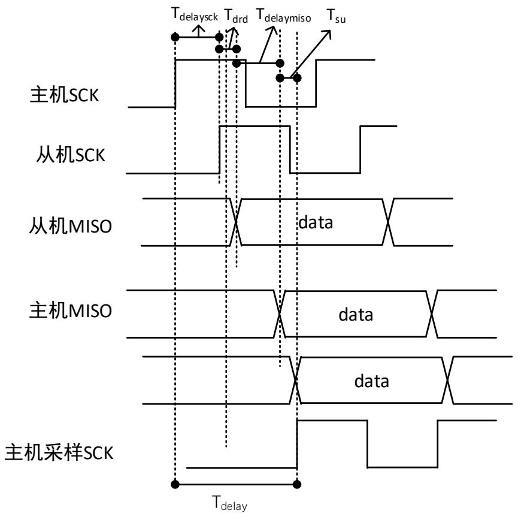

当SPI被配置为从机模式同理。从机时钟延迟的原因有两个，一方面是MOSI和SCK可能会有相位差T ，从而优化从机采样的误差，另一方面可以通过调节延迟而调整MISO的相位，从而给主机的采样提供时序上的优化。SPI_RXDLYCK的SRXDEN为1’b0开启延迟功能，配置1’b1关闭延迟功能。SRXD配置5’b00000~5’b11111可将延迟长度配置为1~32个延迟单元（常温下一个延迟单元的延迟是0.5ns）。用户需要根据自身场景配置延迟 $\mathsf { T } _ { \mathsf { d e l a y } \circ } ( \mathsf { T } _ { \mathsf { d e l a y } } > \mathsf { T } _ { \mathsf { d r c } } + \mathsf { T } _ { \mathsf { s u } } )$ ）

图27-7. SPI从机接收延迟配置时序图

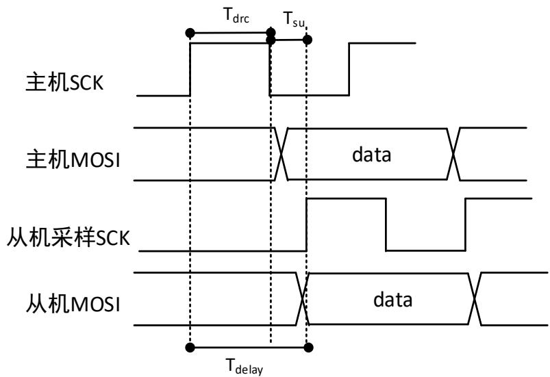

# 27.3.5. RxFIFO 和 TxFIFO

RxFIFO和TxFIFO分别用于SPI数据传输的不同方向，它们使得SPI可以连续工作，并且可以防止当数据帧长度较短或中断 / DMA延迟太长时发生的上溢。

对SPI_TDATA寄存器的写访问会将写入的新数据存储在TxFIFO的末尾，而对SPI_RDATA的读访问则返回RxFIFO中最早的数据。FIFO处理取决于数据交换模式（双工和单工）、数据帧格式（DZ值）、访问FIFO寄存器的大小（8、16或32位）以及数据包中数据的组织方式。TxFIFO/RxFIFO的范围为16x32位，最大访问数据帧长度为32位， 27-4. SPIX FIFO描述了在不同帧尺寸时，FIFO中可存放的最大帧数量。（N = FIFO范围 /32= 16 x 32 / 32= 16）

表 27-4. SPIX FIFO 最大存储数据帧数量

<table><tr><td>数据帧尺寸(DZ)</td><td>DZ &lt;= 8位</td><td>8位 &lt; DZ &lt;= 16位</td><td>16位 &lt; DZ &lt;= 24位</td><td>DZ &gt;24位</td></tr><tr><td>FIFO存储帧数(BYTEN = 1,WORDEN = 0)</td><td>N</td><td>-</td><td>-</td><td>-</td></tr><tr><td>FIFO存储帧数(BYTEN = 0,WORDEN = 0)</td><td>2N</td><td>N</td><td>-</td><td>-</td></tr><tr><td>FIFO存储帧数(WORDEN = 1)</td><td>4N</td><td>2N</td><td>N</td><td>N</td></tr></table>

注意：当SPI设备被禁止时（SPIEN = 0），RxFIFO和TxFIFO中的数据将被清空。

# RxFIFO 接收

对SPI_RDATA的读访问由RP事件管理。当RxFIFO非空（至少一个完整的数据包在RxFIFO中）时，该事件被触发。当RP被清除时，RxFIFO被认为是空的（或者RxFIFO中的数据包是不完整的）。RP在RPIE位置1时触发中断，或者在DMAREN位置1触发DMA请求。

# TxFIFO 发送

对SPI_TDATA的写访问由TP事件管理。当TxFIFO有足够的可用空间接收数据包时触发此事件。如果TxFIFO由软件或DMA填充，TP标志被清除。当TXF设置为1或SPI禁用时，如果没有足够的空间存储至少一个数据包，那么对TxFIFO的写入将被忽略。TP在TPIE位置1时触发中断，或在DMATEN位置1时触发DMA请求。当TXF标志设置为1时，TPIE屏蔽被硬件清除。

# 双工数据包处理

在全双工模式下，DP位可以监控TP和RP事件。将DP标志设置为1时，应用程序将适当数量的数据写入SPI_TDATA寄存器以上传一个完整的包，然后从SPI_RDATA寄存器读取等量的数据以下载一个完整的包。在一个包被上传和下载后，应用程序检查DP值，看看它是否可以推送和弹出其他包，如果可能，一个包一个包地上传 / 下载它们，直到DP读取0。DP在DPIE位置1触发中断，或当DMATEN和DMAREN置1时触发DMA请求。当TXTF标志设置为1时，DPIE屏蔽被硬件清除。

如果在RxFIFO满时接收下一个数据，则会发生接收上溢事件。上溢事件可以由中断或轮询处理。这种情况可能发生在从模式或主模式（全双工或只读模式，MASP = 0）。主设备处于只读模式，当MASP = 1时，如果RxFIFO已满，生成的时钟将自动停止，以防止上溢事件。

# 数据打包

当数据帧尺寸（DZ）<= 8位时，在对SPI_RDATA或SPI_TDATA中进行16位或32位的读写访问时（BYTEN = 0或WORDEN = 1），将自动开启数据打包模式。在这种情况下，多个数据帧并行处理。在发送端，如果FIFOLVL = 1（数据包中有2个数据帧）或FIFOLVL = 3（数据包中有4个数据帧），则在单个16位或32位访问发送端SPI_TDATA寄存器后发送2或4个数据帧。在接收端，如果FIFOLVL = 1（数据包中有2个数据帧）或FIFOLVL = 3（数据包中有4个数据帧），则在单个16位或32位访问接收端SPI_RDATA寄存器时，同时接收2个或4个数据帧，在接收端只能产生1个RP事件。然后接收端必须从SPI_RDATA中以16位或32位读取所有数据帧。如果FIFOLVL = 0（数据包中有1个数据帧），接收端从SPI_RDATA读取16位或32位的数据帧时会产生2个或4个RP事件。

如果9位 <= DZ <= 16位，在对SPI_RDATA或SPI_TDATA中进行32位的读写访问时（WORDEN = 1），将自动开启数据打包模式。将使用最低有效半字节去存储有效数据。在发送端，如果FIFOLVL = 1（数据包中有2个数据帧），则在单个32位访问发送端SPI_TDATA寄存器后发送2个数据帧。在接收端，如果FIFOLVL = 1（数据包中有2个数据帧），则在单个32位访问接收端SPI_RDATA寄存器时，同时接收2个数据帧，在接收端只能产生1个RP事件。然后接收端必须从SPI_RDATA中以32位读取所有数据帧。如果FIFOLVL = 0（数据包中有1个数据帧），接收端从SPI_RDATA读取32位的数据帧时会产生2个RP事件。

当短数据帧（< 8或< 16位）与大数据访问模式（16或32位）配对时，FIFOLVL值必须配置为数据帧数量的倍数，如果32位访问用于8位以下的帧，则为4的倍数。如果16位访问用于8位以下的帧，用2的倍数。如果32位访问用于16位的帧，用2的倍数。

FIFOLVL设置必须始终高于后续的读访问大小，否则将读取额外的伪数据。不允许小于配置数据大小的FIFO数据访问（数据帧大小由DZ设置，FIFO数据访问由BYTEN / WORDEN设置）。始终确保至少有一个完整的数据帧被访问。

# 顺序传输处理

用户可以根据TXSIZE和TXSER值处理消息中的多个数据。当通过设置MSTART位启用SPI时，消息的传输事务开始，在所需的数据数量已被传输时结束。如果当MSTART设置为1时TXSIZE保持为零，则无限传输事务开启。通过设置MSPDR位（清除MSTART位），事务可以在任何时候挂起。

在主模式下，TXSIZE中的数据量传输完毕后，如果TXSER的值不为零，则将TXSER的值复制到TXSIZE中，并自动清除TXSER的值。然后，传输将增加与TXSIZE中新加载值对应的数据数量。在重新加载操作之后，如果TXSERFIE被设置为1，则TXSERF标志被设置为1，并将触发中断。用户可以在下次重新加载之前将下一个非零值写入TXSER，这样它就可以处理多个数据。在这种情况下，ET事件不会发生，因为传播仍在继续。

如果TXSIZE或TXSER定义的数据量（数据帧数）不能与FIFOLVL中定义数据包长度对齐，那么在发送结束前的最后一个不完整的数据包需做打包处理。 详细描述了打包原理。

注意：为防止传输下溢，可将从机SPI_URDATA寄存器中写入特定值。在从机TxFIFO变为空时，该值将作为下一个数据自动送出，并且在主机接收后通过软件进行解析，以便通过软件挂起主机接收器。

# 传输延时处理

如果从机的接收速度小于主机的传输速度，主机必须降低传输速度，通过降低时钟频率或增加数据帧之间的时延。主控模式下，SPI_CFG1寄存器中的MFDF[3:0]位用于增加数据帧之间的延迟，主控模式下，MSSD[3:0]用于增加NSS有效沿与开始传输或接收数据之间的延迟。详细描述可参见NSS

# 27.3.6. NSS 功能

# 从机模式

当配置为从机模式（MSTMOD = 0）时，在硬件NSS模式（NSSIM = 0）下，SPI从NSS引脚获取NSS电平，在软件NSS（NSSIM = 1）下，SPI根据NSSI位得到NSS电平。只有当NSS为有效电平时，发送或接收数据。在软件NSS模式下，不使用NSS引脚。用户可以设置NSSIOPL位来决定输入/输出外部信号的有效电平（在NSS引脚上）。

表 27-5. 从机模式 NSS 功能

<table><tr><td>模式</td><td>寄存器配置</td><td>描述</td></tr><tr><td>从机硬件 NSS 模式</td><td>MSTMOD = 0NSSIM = 0</td><td>SPI 从机 NSS 电平从 NSS 引脚获取。</td></tr><tr><td>从机软件 NSS 模式</td><td>MSTMOD = 0NSSIM = 1</td><td>SPI 从机 NSS 电平由 NSSI 位决定。NSSI = 0: NSS 电平为低NSSI = 1: NSS 电平为高</td></tr></table>

# 主机模式

在主机模式（MSTMOD=1）下，如果应用程序使用多主机连接方式，NSS可以配置为硬件输入模式（NSSIM = 0，NSSDRV = 0）或者软件模式（NSSIM = 1）。一旦NSS引脚（在硬件NSS模式下）或NSSIM位（在软件NSS模式下）变无效，SPI将自动进入从机模式，并且产生主机配置错误，CONFERR位置1。

如果应用程序希望使用NSS引脚控制SPI从设备，NSS应该配置为硬件输出模式（NSSIM =0，NSSDRV = 1）。使能SPI并置位MSTART之后，NSS保持有效电平，直至传输了当前要传输的数据量后（ET标志位置位），NSS变为无效电平。

应用程序可以使用一个通用I/O口作为NSS引脚，以实现更加灵活的NSS应用。

表 27-6. 主机模式 NSS 功能

<table><tr><td>模式</td><td>寄存器配置</td><td>描述</td></tr><tr><td>主机硬件 NSS 输出模式</td><td>MSTMOD = 1NSSIM = 0NSSDRV = 1</td><td>适用于单主机模式,主机使用 NSS 引脚控制 SPI 从设备,此时 NSS 配置为硬件输出模式。使能 SPI 并置位MSTART 后 NSS 为有效电平。</td></tr><tr><td>主机硬件 NSS 输入模式</td><td>MSTMOD = 1NSSIM = 0NSSDRV = 0</td><td>适用于多主机模式,此时 NSS 配置为硬件输入模式,一旦 NSS 引脚被拉无效,SPI 将自动进入从机模式,并且产生主机配置错误,CONFERR 位置 1。</td></tr><tr><td rowspan="2">主机软件 NSS 模式</td><td>MSTMOD = 1NSSIM = 1NSSI = 0NSSDRV:不要求</td><td>适用于多主机模式,一旦 NSS 无效,SPI 将自动进入从机模式,并且产生主机配置错误,CONFERR 位置 1。</td></tr><tr><td>MSTMOD = 1NSSIM = 1NSSI = 1NSSDRV:不要求</td><td>从机可以使用硬件或软件 NSS 模式</td></tr></table>

# NSS信号时序

当应用硬件输出 NSS 控制 $( \mathsf { N S S } | \mathsf { M } = 0 , \mathsf { N S S D R V } = \mathrm { \Omega } _ { 1 } )$ 时，用户可以配置 MDFD[3:0]和MSSD[3:0]位域来控制数据帧之间的 NSS 信号时序，并在每次事务开始时插入额外的延迟（以分离 NSS 和时钟启动）。 27-8. NSS $( M S S D / 3 { \cdot } O I = 0 O 1 1 \ ( 3 \times T _ { c l k } )$ , MDFD$= 0 0 1 1 ( 3 \times \tau _ { c l k } ) )$ 描述了 $\mathsf { M S S D } [ 3 ; 0 ] = 3$ 设置下，数据采集相对于 NSS信号有效的时延和${ \mathsf { M D F D } } [ 3 ; 0 ] = 3$ 设置下，数据帧之间采集的时延。

图 27-8. NSS 信号延时时序图 $( \mathsf { M S S D } [ 3 { \cdot } 0 ] = 0 0 1 1 \ ( 3 \times \mathsf { T } _ { \mathrm { c l k } } )$ , ${ \bf M D F D } = 0 0 1 1 ~ ( 3 \times { \bf T _ { c I k } } ) )$

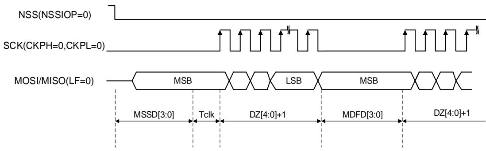

当 $\mathsf { N S S C T L } = 1 \mathrm { E M D F D } [ 3 ; 0 ] > $ 1时，SPI数据帧之间可插入交错脉冲。 27-9. NSSMSSD[3:0] = 0011 3 x T , MDFD = 0011 3 x T 描述了 ${ \mathsf { M D F D } } [ 3 ; 0 ] >$ 1时，NSS信号的脉冲状态。

图 27-9. NSS 交错脉冲时序图（MSSD[3:0] = 0011（3 x Tclk）, MDFD = 0011（3 x Tclk））

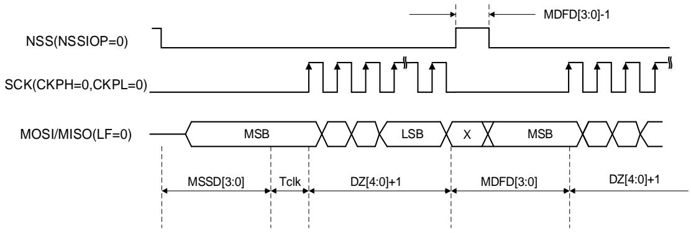

# 27.3.7. SPI 运行模式

表 27-7. SPI 运行模式

<table><tr><td>模式</td><td>描述</td><td>寄存器配置</td><td>数据引脚用法</td></tr><tr><td>MFD</td><td>全双工主机模式</td><td>MSTMOD = 1RO = 0BDEN = 0BDOEN: 不要求</td><td>MOSI: 发送MISO: 接收</td></tr><tr><td>MTU</td><td>单向线连接主机发送模式</td><td>MSTMOD = 1RO = 0BDEN = 0BDOEN: 不要求</td><td>MOSI: 发送MISO: 不使用</td></tr><tr><td>MRU</td><td>单向线连接主机接收模式</td><td>MSTMOD = 1RO = 1BDEN = 0BDOEN: 不要求</td><td>MOSI: 不使用MISO: 接收</td></tr><tr><td>MTB</td><td>双向线连接主机发送模式</td><td>MSTMOD = 1RO = 0BDEN = 1BDOEN = 1</td><td>MOSI: 发送MISO: 不使用</td></tr><tr><td>MRB</td><td>双向线连接主机接收模式</td><td>MSTMOD = 1RO = 0BDEN = 1BDOEN = 0</td><td>MOSI: 接收MISO: 不使用</td></tr><tr><td>SFD</td><td>全双工从机模式</td><td>MSTMOD = 0RO = 0BDEN = 0BDOEN: 不要求</td><td>MOSI: 接收MISO: 发送</td></tr><tr><td>STU</td><td>单向线连接从机发送模式</td><td>MSTMOD = 0RO = 0BDEN = 0BDOEN:不要求</td><td>MOSI: 不使用MISO: 发送</td></tr><tr><td>SRU</td><td>单向线连接从机接收模式</td><td>MSTMOD = 0RO = 1BDEN = 0BDOEN:不要求</td><td>MOSI:接收MISO:不使用</td></tr><tr><td>STB</td><td>双向线连接从机发送模式</td><td>MSTMOD = 0RO = 0BDEN = 1BDOEN = 1</td><td>MOSI:不使用MISO:发送</td></tr><tr><td>SRB</td><td>双向线连接从机接收模式</td><td>MSTMOD = 0RO = 0BDEN = 1BDOEN = 0</td><td>MOSI:不使用MISO:接收</td></tr></table>

图 27-10. 典型的全双工模式连接

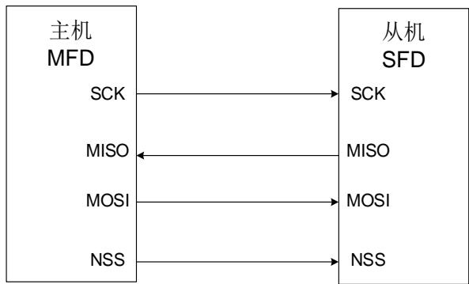

图 27-11. 典型的单工模式连接（主机：接收，从机：发送）

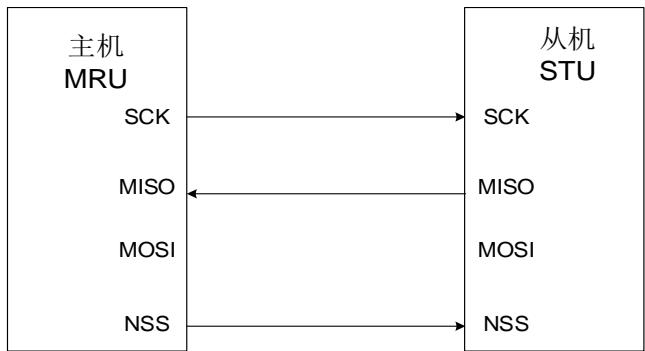

图 27-12. 典型的单工模式连接（主机：只发送，从机：接收）

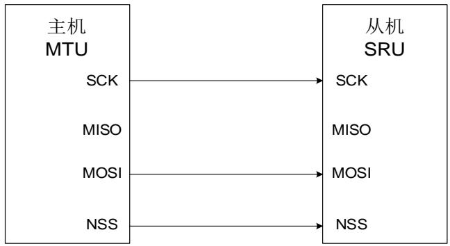

图 27-13. 典型的双向线连接

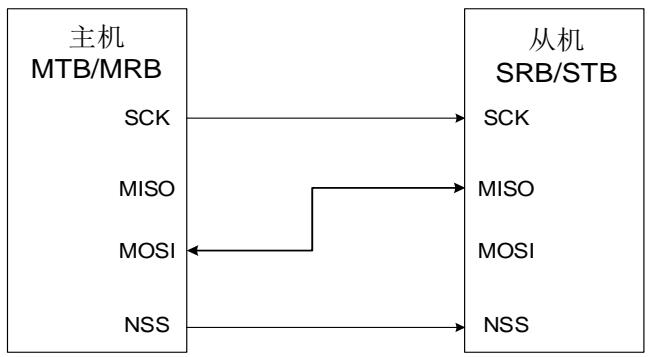

# SPI 初始化流程

在发送或接收数据之前，应用程序应遵循如下的SPI初始化流程：

1. 如果工作在主机模式或从机TI模式，配置SPI_CFG0中的PSC[2:0]位来生成预期波特率的SCK信号，或配置TI模式下的Td时间。否则，忽略此步骤。

2. 配置时钟时序（SPI_CFG1中的CKPL位和CKPH位）。

3. 配置帧格式（SPI_CFG1中的LF位）。

4. 配置数据格式（SPI_CFG0中的DZ[4:0]位域）。

5. 配置FIFO等级（SPI_CFG0中的FIFOLVL[3:0]），以及访问FIFO方式（WORDEN和BYTEN）。

6. 按照上文NSS 的描述，根据应用程序的需求，配置NSS模式（SPI_CFG1中的NSSIM/ NSSDRV / NSSIOPL / NSSCTL / MDFD[3:0] / MSSD[3:0]位和SPI_CTL0中的NSSI位）。

7. 如果是从机模式，配置SPI_CFG0的TXURDT[1:0]与TXUROP[1:0]位域。

8. 如果工作在TI模式，需要将SPI_CFG1中的TMOD位置1，否则，忽略此步骤。

9. 根据 27-7. SPI ，配置MSTMOD位、RO位、BDEN位和BDOEN位。

10. 配置SPI_CTL1寄存器以选择传输的长度，如果该值是未知的，则必须将TXSIZE设为零。

11. 配置SPI_CRCPOLY寄存器，并根据CRC多项式和CRC计算所需配置CRCSZ[4:0]位域和CRCFS位，相关描述在CRC 章节。

12. 据DMA ， 当使用DMA时，需要初始化DMATEN / DMAREN位。

13. 如果工作在SPI四线模式，需要将SPI_QCTL中的QMOD位置1，如果不是，则忽略此步骤。（只有SPI3 / 4）

14. 如果需要配置保护，配置SPI_CTL0寄存器的IOAFEN位。

15. 使能SPI（将SPIEN位置1）。

16. 如果是主机模式（MSTMOD = 1），当SPIEN = 1，配置SPI_CTL0中MSTART位去传输数据。如果无需传输数据，忽略此步骤。

注意：在通信过程中，不应更改CKPH、CKPL、MSTMOD、PSC[2:0]、LF位。

# SPI 基本发送和接收流程

# 发送流程

在完成初始化过程之后，SPI模块使能并保持在空闲状态。在主机模式下，当软件写一个数据到TxFIFO时，发送过程开始。在从机模式下，当SCK引脚上的SCK信号开始翻转，且NSS引脚电平有效，发送过程开始。所以，在从机模式下，应用程序必须确保在数据发送开始前，数据已经写入TxFIFO中。

当SPI开始发送一个数据帧时，首先将这个数据帧从TxFIFO加载到移位寄存器中，然后开始发送加载的数据。相关操作可参考RxFIFO TxFIFO描述。

对SPI_TDATA的写访问由TP事件管理。当TP标志设置为1时，应用程序对SPI数据寄存器写入适当数量的数据，以传输数据包的内容。在上传新的完整包后，应用程序检查TP值，检查TxFIFO是否可以接收额外的数据包，如果TP = 1，则逐包上传，直到TP读取0。如果传输大小和数据包大小没有对齐，则最后要传输的数据包数无法达到配置的大小（由FIFOLVL设置）。应用程序仍然可以将标准数量的先前完整数据包写入TxFIFO，而不会产生不良影响：只有一致的数据（完整的数据帧）将传输到TxFIFO，而冗余的写入时间（或任何不完整的数据）将被忽略。

在主机模式下，若想要实现连续发送功能，那么在当前数据帧发送完成前，软件应该将下一个数据写入SPI_TDATA寄存器中。只要TxFIFO中存在数据，数据发送便一直继续，直至TxFIFO变为空。

# 接收流程

在最后一个采样时钟边沿之后，接收到的数据将从移位寄存器存入到RxFIFO，且RP（RxFIFO非空）位置1。软件通过读SPI_RDATA寄存器获得接收的数据，此操作会自动清除RP标志位（当RxFIFO数据量少于FIFOLVL标准）。在MRU和MRB模式中，为了接收下一个数据帧，硬件需要连续发送时钟信号，而在全双工主机模式（MFD）中，仅当TxFIFO非空时，硬件才接收下一个数据帧。相关操作可参考RxFIFO TxFIFO描述。

对SPI_RDATA的读访问由RP事件管理。当RP标志设置为1时，应用程序读取SPI数据寄存器相当数量的数据，以下载单个数据包内容。下载完整数据包后，应用程序会检查RP值，查看RxFIFO中是否有其他数据包，如果有，则逐包下载，直到RP读到0。在接收结束时，可能会出现RxFIFO中仍然有一些数据可用，但没有达到FIFOLVL级别，因此RP不会被设置为1。在这种情况下，RxFIFO中剩余的RX数据帧的数量将由SPI_STAT寄存器中的RWNE和RPLVL表示。如果传输大小和数据包大小没有对齐，当最后接收的数据包数量不能达到配置的大小(由FIFOLVL设置)时，就会出现上述情况。然而，应用程序仍然可以从RxFIFO读取标准数量的以前完整的数据包，而不会产生不良影响：只有一致的数据（完整的数据帧）将从RxFIFO读取，而冗余的读取（或任何不完整的数据）将读取0。

接收数据时，主机提供时钟信号，当主机停止或挂起SPI时才会停止接收流程。主机通过将MSTART位置1来启动流程，可通过向SPI_CTL0寄存器的MSPDR为写1来请求挂起，或者向MASP位写1来设置上溢挂起。当完成TXSIZE和TXSER中的数据帧传输后，接收流程也会结束。

# SPI 不同模式下的操作流程（非 SPI 四线模式，TI 模式）

在全双工模式下，无论是MFD模式或者SFD模式，应用程序都应该监视RP标志位和TP标志位，并且遵循上文描述的操作流程。

发送模式（MTU，MTB，STU或STB）与全双工模式中的发送流程类似，不同的是需要忽略RP位和RXORERR位。

相比于发送模式的情况，主机接收模式（MRU或MRB）与全双工的接收流程大不相同。在MRU模式或MRB模式下，在SPI使能后，SPI产生连续的SCK信号，直到SPI停止。所以，软件应该忽略TP标志位，并且在RP位置1后，读出RxFIFO内的数据，否则，将会产生接收过载错误。

除了忽略TP标志位，且只执行上述的接收流程之外，从机接收模式（SRU或SRB）与全双工模式类似。

# SPI TI 模式

SPI TI模式将NSS作为一种特殊的帧头标志信号，它的操作流程与上文描述的常规模式类似。上文描述的模式（MFD，MTU，MRU，MTB，MRB，SFD，STU，SRU，STB和SRB）都支持TI模式。但是，在TI模式中， CKPL、CKPH、LF、NSSIM、NSSIOPL、NSSDRV位是没有意义的，SCK信号的采样边沿为下降沿。

图 27-14. 主机 TI 模式在不连续发送时的时序图

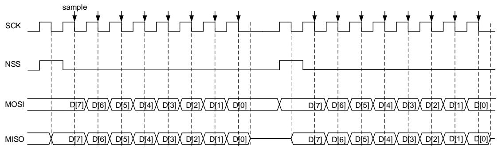

图 27-15. 主机 TI 模式在连续发送时的时序图

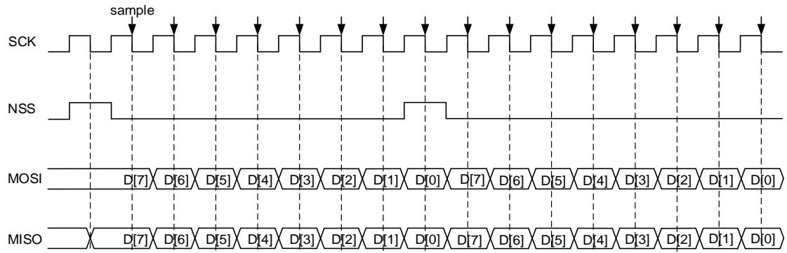

在主机TI模式下，SPI模块可实现连续传输或者不连续传输。如果主机写SPI_TDATA的速度很快，那么就是连续传输，否则，为不连续传输。在不连续传输中，在每个字节传输前需要一个额外的时钟周期。在连续传输中，额外的时钟周期只存在于第一个字节之前，随后字节的起始时钟周期被前一个字节的最后一位的时钟周期覆盖。

图 27-16. 从机 TI 模式时序图

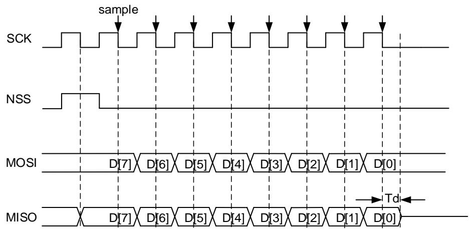

在从机TI模式中，在SCK信号的最后一个上升沿，从机开始发送最后一个字节的LSB位，在半位的时间之后，主机开始采集数据。为了确保主机采集到正确的数据，在释放MISO引脚之前，从机需要在SCK信号的下降沿之后继续驱动该位一段时间，这段时间称为 $\mathsf { T _ { d } }$ ， ${ \sf T _ { d } }$ 通过SPI_CFG0寄存器中的PSC[2:0]位来设置。

$$
\frac {T _ {\text {bit}}}{2} + 2 * T _ {\text {kerclk}} \leq T _ {\mathrm{d}} \leq \frac {T _ {\text {bit}}}{2} + 4 * T _ {\text {kerclk}} \tag {27-1}
$$

在从机模式下，从机需要监视NSS信号，如果检测到错误的NSS信号，将会置位FERR标志位。例如，NSS信号在一个字节的中间位发生翻转。

# SPI 四线模式操作流程

SPI四线模式用于控制四线SPI flash外设。

要配置成SPI四线模式，首先要确认TP位与TC位置1，然后将SPI_QCTL寄存器中的QMOD位置1。在SPI四线模式，BDEN位、BDOEN位、CRCEN位、CRCSZ位、RO位和LF位保持清零，WORDEN配置为1，DZ[4:0]位域配置数据长度为8位，且MSTMOD位置1，以保证SPI工作于主机模式。SPIEN位、MSTART位、TXSIZE、TXSER位、PSC位、CKPL位和CKPH位根据需要进行配置。

注意：四线模式不支持CRC功能。PSC不能配置为两分频和四分频。

SPI四线模式有两种运行模式：四线写模式和四线读模式，通过SPI_QCTL寄存器中的QRD位进行配置。

# 四线写模式

当SPI_QCTL寄存器中的QMOD位置1且QRD位清零时，SPI工作在四线写模式。在四线写模式中，MOSI、MISO、IO2和IO3都用作输出引脚，在SCK产生时钟信号后，一旦数据写入SPI_TDATA寄存器（TP位清零）且SPIEN和MSTART位置1时，将会通过这四个引脚发送写入的数据。SPI开始数据传输之后，每发送一个数据帧都要检测TP标志位，若不能满足条件则停止传输。

四线模式下发送操作流程：

1. 根据应用需求，配置SPI_CTL0、SPI_CTL1、SPI_CFG0、SPI_CFG1中的时钟预分频、时钟极性、相位等参数。

2. 将SPI_QCTL中的QMOD位置1，然后将SPI_CTL0中的SPIEN位置1来使能SPI功能。

3. 向SPI_TDATA寄存器中写入一个字节的数据，TP标志位将会清零。

4. 等待硬件将TP位重新置位，然后写入下一个字节数据。

图 27-17. SPI 四线模式四线写操作时序图

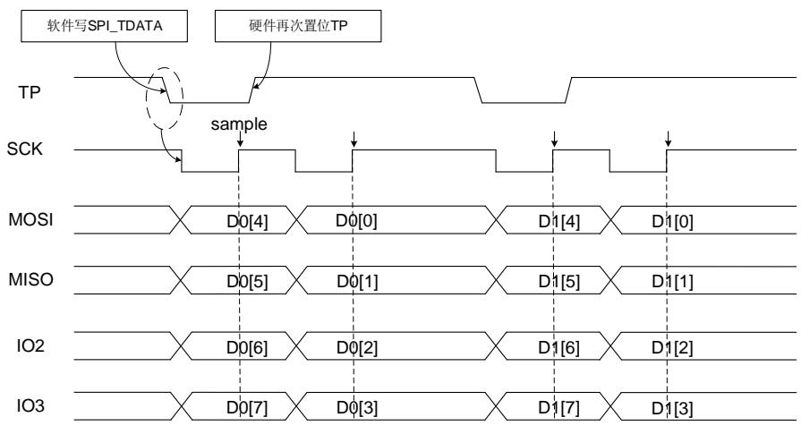

# 四线读模式

当SPI_QCTL寄存器中的QMOD位和QRD位都置1时，SPI工作在四线读模式。在四线读模式中，MOSI、MISO、IO2和IO3都用作输入引脚，一旦数据写入SPI_TDATA寄存器（TP位清零）且SPIEN位置1时，在SCK信号线产生时钟信号。写数据到SPI_TDATA寄存器只是为了产生SCK时钟信号，所以可以写入任何数据。SPI开始数据传输之后，每发送一个数据帧都要检测SPIEN位和TBE位，若条件不满足则停止传输。所以软件需要一直向SPI_TDATA写空闲数据，以产生SCK时钟信号。

四线模式下接收操作流程：

1. 根据应用需求，配置SPI_CTL0、SPI_CTL1、SPI_CFG0、SPI_CFG1中时钟预分频、时钟极性、相位等参数。

2. 将SPI_QCTL中的QMOD位和QRD位置1，然后将SPI_CTL0中的SPIEN位置1来使能SPI功能。

3. 写任意数据（例如0xFF）到SPI_TDATA寄存器。

4. 等待RP位置1，然后读SPI_RDATA寄存器来获取接收的数据。

5. 写任意数据（例如0xFF）到SPI_TDATA寄存器，以接收下一个字节数据。

图 27-18. SPI 四线模式四线读操作时序图

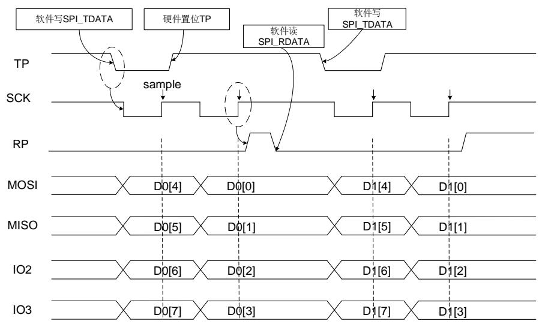

# SPI 停止流程

不同运行模式下采用不同的流程来停止SPI功能。

# MFD SFD MTU MTB STU STB

当设备处于全双工或只发送模式，主器件停止提供要发送的数据时，任何传输事务都可以被终止。在这种情况下，时钟在最后一个数据传输完成后停止。TC标志可以被轮询（或者通过ESTCIE = 1使能中断）来等待最后一个数据帧被发送。等待TC = 1或ET = 1（不再发送数据，发送最后一帧数据）。如果使能CRC功能，则在最后一次数据处理后自动发送CRC。在这种情况下，TC / ET将在CRC帧完成后被设置为1。当发送被挂起时，软件必须等待MSTART位被清除。然后通过清除SPIEN位禁用SPI。

# MRU MRB

要停止外围设备，必须首先挂起SPI通信。当主设备处于仅接收模式时，将MSPDR设置为1，或者通过ET等待数据传输结束。如果接收流被暂停，请等待SPD = 1。当SPI挂起时，接收但未读取的数据总是存储在RxFIFO中（禁止SPIEN时，RxFIFO会被清空）。读取所有RxFIFO数据（直到RWNE = 0和RPLVL = 0），然后通过清除SPIEN位禁用SPI。

# SRU SRB

当应用程序不想接收数据时，可以禁用SPI，任何正在进行的数据都将丢失。

# TI 模式

TI模式的停止流程与上面描述过程相同。

# SPI 四线模式

应用程序可以作为MFD模式运行，然后清除SPI_QCTL寄存器中的QMOD位和SPI_CTL0寄存器中的SPIEN位。

# 27.3.8. DMA 功能

DMA功能在传输过程中将应用程序从数据读写过程中释放出来，从而提高了系统效率。

通过置位SPI_CFG0寄存器中的DMATEN位和DMAREN位，使能SPI模式的DMA功能。为了使用DMA功能，软件首先应当正确配置DMA模块，然后通过初始化流程配置SPI模块，最后使能SPI。

在初始化完成后，如果设置了DMATEN，当TP = 1时，SPI每次都会生成一个DMA请求，DMA将确认此请求并自动将数据写入SPI_TDATA寄存器。如果发送数据未准备好，则TP和TXURERR将置1。在这种情况下，将根据TXUROP位选择去发送数据。如果设置了DMAREN，那么当RP = 1时，SPI每次都会生成一个DMA请求，然后DMA将确认这个请求并自动从SPI_RDATA寄存器读取数据。如果在事务结束时ET被设置为1，并且最后一个包不完整，DMA请求将根据RWNE和RPLVL[1:0]设置（在SPI_STAT寄存器中）自动激活以读取剩余的数据。

# DMA数据打包传输

如果传输由DMA（DMATEN = 1或DMAREN = 1）管理，当DZ[4:0] <= 8位，并且SPI_TDATA寄存器以16位或32位访问，或当8位 < DZ[4:0] <= 16位，并且SPI_TDATA寄存器以32位访问，DMA数据打包模式被启用，DMA应该自动管理对SPI_TDATA寄存器的写操作。

不管使用的数据打包模式，也不管要传输的数据数量是DMA数据大小（16位或32位）的倍数。当帧大小很小时，DMA会根据TXSIZE字段设置自动完成传输。在配置DMA时，禁止访问小于配置数据大小的DMA数据。总是确保数据访问至少一个完整的数据帧。

# 27.3.9. CRC 功能

SPI模块包含两个CRC计算单元：分别用于发送数据和接收数据。CRC计算单元使用SPI_CRCPOLY寄存器中定义的多项式。SPI_CRCPOLY寄存器中的值的最高有效位定义多项式长度。如果DZ <= 32位，可提供5 - 33位CRC多项式长度。如果DZ <= 16位，可提供5 - 17位的CRC多项式长度。多项式长度必须大于DZ字段中定义的数据帧长度的值。如果DZ = 32位，必须将SPI_CTL0寄存器中CRCFS位置1，以确保CRC多项式处于全尺寸模式。SPI_CFG0中的CRCSZ位域定义CRC计算单元中被处理并与CRC帧进行比较的最高有效位数。

通过配置SPI_CFG0中的CRCEN位使能CRC功能，必须在SPI使能之前配置。CRCPOLY值只能在没有数据传输的时候修改，建议在CRCEN=0的时候配置。对于数据线上每个发送和接收的数据，CRC单元逐位计算CRC值，计算得到的CRC值可以从SPI_TCRC寄存器和SPI_RCRC寄存器中读取。CRC的发送与接收都以数据帧的形式实现，数据帧的长度等于SPI_CFG0寄存器中的CRCSZ的值。

在发送阶段，应用程序在最后一个数据写入TxFIFO之后，硬件自动发送存储在SPI_TCRC寄存器中计算完成的CRC值。在接收阶段，最后一个数据从RxFIFO读出后，SPI_RCRC寄存器被存入CRC值，CRC计算单元对所接收到的数据进行CRC计算，并将计算的值与SPI_RCRC中保存的值进行效验，如果校验失败时，SPI_STAT寄存器中CRCERR错误标志位将会置1。可通过软件向SPI_STATC寄存器的CRCERRC位写1来清除CRCERR位。

注意：当SPI被禁止时，或数据传输完成后的新数据采样初期，SPI_TCRC与SPI_RCRC寄存器会被初始化，初始化的值可通过SPI_CTL0寄存器的TXCRCI与RXCRCI设置。

当配置SPI为从模式并且使用CRC功能时，即使NSS引脚为高时仍然会执行CRC的计算(当NSS信号为高时，只要SCK引脚上有时钟脉冲，则CRC计算会继续执行)。当主设备交替地与多个从设备进行通信时，将会出现这种情况,此时建议在NSS信号为低时重启CRC功能)。当从设备未选中(NSS信号为高)转换到被选中为一个新的从设备(NSS信号为低)的时候，为了保持主从设备端下次CRC计算结果的同步，应该清除主从两端的CRC数值。建议按照下述步骤清除CRC数值：

1. 关闭SPI模块（SPIEN=0）;

2. 清除CRCEN位（CRCEN=0）;

3. 设置CRCEN位（CRCEN=1）;

4. 使能SPI模块（SPIEN=1）。

# 27.3.10. SPI 中断

# 状态标志位

# 发送包空间可用标志（TP）

当TxFIFO有足够的可用位置来容纳一个数据包时设置此位，软件可以通过写入SPI_TDATA寄存器将下一个数据包写入TxFIFO。当TxFIFO没有足够的空间放置下一个数据包时，该位被清除，软件不能通过写入SPI_TDATA寄存器将下一个数据包写入TxFIFO。

# 接收包空间可用标志（RP）

当RxFIFO非空时设置该位，这意味着至少有一个数据包被接收并存储在接收缓冲区中，并且软件可以通过读取SPI_RDATA寄存器来读取数据包。当RxFIFO为空或RxFIFO中存储的数据不能到达FIFOLVL时，该位被清除。因此，当RxFOFO为空时，软件无法通过读取SPI_RDATA寄存器来读取数据包。或在这种情况下, RxFIFO剩余的数据帧的数量将由SPI_STAT寄存器的RWNE和RPLVL表示,应用程序仍然可以从RxFIFO读取标准数量完整数据包不产生不利影响。

# 传输/接收结束标志（ET）

ET是一个状态标志，表示传输/接收是正在进行还是结束。在完成传输后，即基于SPI发送或接收TXSIZE数据量时，该标志由硬件设置，并可通过SPI_STATC寄存器中的软件设置ETC位清除。设置为1时，ET标志触发ESTCIE中断。

# 双工数据包标志（DP）

如果TP和RP标志设置为1，则DP标志设置为1，这意味着TxFIFO有空间进行写操作，而RxFIFO至少包含一个包进行读操作。DP适用于全双工通信，优化数据上传/下载性能，从而最大限度地减少对CPU带宽和系统功率的需求，特别是当SPI在停止模式下运行时。

# TXFIFO已被填充标志（TXF）

当应用程序或DMA发送一次传输的所有数据包时，这意味着TXSIZE数据值已被推入TxFIFO,TXF标志将被硬件设置为1。该位可以通过软件将SPI2S_TCRC寄存器的TXFC位写1来清除。TXF标志在TXFIE被设置为1时触发中断。

# 额外的数据量已被重载标志（TXSERF）

处理完TXSIZE中的数据数量后，如果TXSER的值不为零，则将TXSER的内容复制到TXSIZE中，并自动清除TXSER的值。然后，传输将增加与TXSIZE中新加载值相对应的数据量。当数据量被发送到TxFIFO后，TXSERF标志被设置为1，并在TXSERFIE上触发一个中断。

# 挂起标志（SPD）

在主模式下，当前帧完成或RxFIFO满时(SPI2S_CTL0寄存器中的MASP设置为1)，设备自动挂起接收模式，执行MASPR后，硬件将SDP设置为1。当ESTCIE设置为1，SPD标志设置为1时触发中断。SPD标志可以通过SPI_STATC寄存器SPDC位写入1来清除。

# 传输完成标志（TC）

此标志由硬件更改。如果TXSIZE = 0，或TxFIFO为空，TC被设置为1，代表总线上没有活动。如果TXSIZE > 0, TC将在传输结束时设置为1，无论TxFIFO使用情况如何。TC设置为1时，表示传输结束。启用CRC校验模式，发送CRC校验码后TC设置为1。当ESTCIE设置为1，TC标志置1后触发中断被。

# 错误标志

# 配置错误标志（CONFERR）

在主机模式中，CONFERR位是一个错误标志位。在硬件NSS模式中，如果NSSDRV没有使能，当NSS被拉低时，CONFERR位被置1。在软件NSS模式中，当NSSI位为0时，CONFERR位置1。当CONFERR位置1时，SPIEN位和MSTMOD位由硬件清除，SPI关闭，设备强制进入从机模式。可以通过将SPI_STATC寄存器的CONFERRC位写1来清除CONFERR。当CONFEIE设置为1，CONFERR标志置1触发中断。

在CONFERR位清零之前，SPIEN位和MSTMOD位保持写保护，从机的CONFERR位不能置1。在多主机配置中，设备可以在CONFERR位置1时进入从机模式，这意味着发生了系统控制的多主冲突。

# 接收过载错误（RXORERR）

如果RxFIFO没有足够的空间存储接收到的数据，则RXORERR位置1。RxFIFO内容不会被新传入的数据覆盖，因此新传入的数据将丢失。当RXOREIE被设置为1时，RXORERR标志置1触发中断。可以通过在SPI_STATC寄存器的RXORERRC位写入1来清除RXORERR。

# 帧格式错误（FERR）

在TI从机模式下，从机也要监视NSS信号，如果检测到错误的NSS信号，将会置位FERR标志位。例如，NSS信号在一个字节的中间位发生翻转。当FEIE被设置为1时，FERR标志置1触发中断。通过向SPI_STATC寄存器的FERRC位写入1可以清除FERR。

# CRC错误（CRCERR）

当CRCEN位置1时，SPI_RCRC寄存器中接收到的数据的CRC计算值将会和紧随着最后一帧数据后接收到的CRC值进行比较，当两者不同时，CRCERR位将会置1。CRCERR标志在CRCERIE设置为1时触发中断。通过向SPI_STATC寄存器的CRCERRC位写入1可以清除CRCERR。

# 传输下溢错误（TXURERR）

在从传输模式中TxFIFO是空的，但需要将新数据传入移位寄存器时发送下溢错误标志TXURERR置1。在捕获下溢错误后，提供用于发送的下一个数据取决于TXUROP位，WORDEN位，BYTEN位。TXURERR标志在TXUREIE设置为1时触发中断。可以通过将SPI_STATC寄存器的TXURERRC位写1来清除TXURERR。

表 27-8. SPI 中断请求

<table><tr><td>中断标志</td><td>描述</td><td>清除方式</td><td>中断使能位</td></tr><tr><td>TP</td><td>发送包空间可用标志</td><td>当TxFIFO空间少于FIFOLVL,TP被硬件清除</td><td>TPIE</td></tr><tr><td>RP</td><td>接收包空间可用标志</td><td>当RxFIFO数据量少于FIFOLVL,RP被硬件清除</td><td>RPIE</td></tr><tr><td>ET</td><td>传输/接收完成标志</td><td>ETC置1</td><td>ESTCIE</td></tr><tr><td>DP</td><td>双工数据包标志</td><td>当TP与RP清0,DP被硬件清除</td><td>DPIE</td></tr><tr><td>TXF</td><td>TxFIFO已被重载标志</td><td>TXFC置1</td><td>TXFIE</td></tr><tr><td>TXSERF</td><td>额外的数据已被重载标志</td><td>TXSERFC置1</td><td>TXSERFIE</td></tr><tr><td>SPD</td><td>挂起标志</td><td>SPDC置1</td><td>ESTCIE</td></tr><tr><td>TC</td><td>传输结束标志</td><td>当传输开始时,TC被硬件清除</td><td>ESTCIE</td></tr><tr><td>CONFERR</td><td>配置错误</td><td>CONFERRC置1</td><td>CONFEIE</td></tr><tr><td>RXORERR</td><td>接收上溢错误</td><td>RXORERRC置1</td><td>RXOREIE</td></tr><tr><td>FERR</td><td>帧格式错误</td><td>FERRC置1</td><td>FEIE</td></tr><tr><td>CRCERR</td><td>CRC错误</td><td>CRCERRC置1</td><td>CRCERIE</td></tr><tr><td>TXURERR</td><td>传输下溢错误</td><td>TXURERRC置1</td><td>TXUREIE</td></tr></table>

# 27.4. I2S 功能说明

# 27.4.1. I2S 结构框图

图 27-19. I2S 结构框图

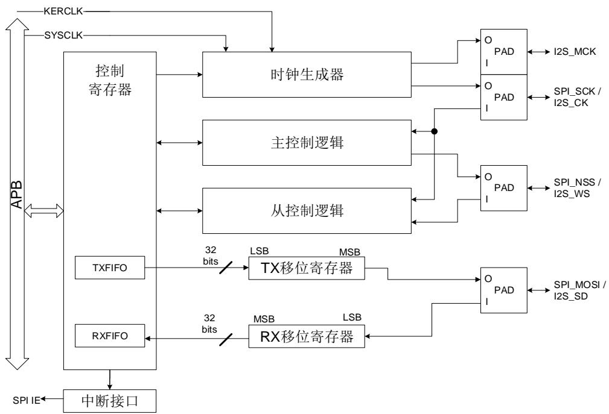

◼ SYSCLK：系统时钟，由APB总线提供。需要访问I2S寄存器时，该时钟必须有效；

KERCLK：内核时钟，由RCU提供，和系统时钟是异步的关系；

时钟信号的频率没有特定限制，但需与用户使用条件及数据传输速度匹配，防止数据丢失；（注：建议SYSCLK大于等于KERCLK的频率）

I2S从机的SCK信号由I2S主机提供。

I2S功能有5个子模块，分别是控制寄存器、时钟生成器、主机控制逻辑、从机控制逻辑和移位寄存器。所有的用户可配置寄存器都在控制寄存器模块实现，其中包括TxFIFO和RxFIFO。时钟生成器用来在主机模式下生成I2S通信时钟。此时钟生成器也是MCK的源。主机控制逻辑用来在主机模式下生成I2S_WS信号并控制通信。从机控制逻辑根据接收到的I2S_CK和I2S_WS信号来控制从机模式的通信。移位寄存器控制I2S_SD上的串行数据发送和接收。

# 27.4.2. I2S 信号线描述

I2S接口有4个引脚，分别是I2S_CK、I2S_WS、I2S_SD和I2S_MCK。I2S_CK是串行时钟信号，与SPI_SCK共享引脚。I2S_WS是数据帧控制信号，与SPI_NSS共享引脚。I2S_SD是串行数据信号，与SPI_MOSI共享引脚。I2S_MCK是主时钟信号，它最大可提供一个256倍于Fs的时钟频率，其中Fs是音频采样率。

# 27.4.3. I2S 音频标准

I2S音频标准是通过设置SPI_I2SCTL寄存器中的I2SSTD位来选择的，可以选择四种音频标准：

I2S飞利浦标准，MSB对齐标准，LSB对齐标准和PCM标准。除PCM之外的所有标准都是两个通道（左通道和右通道）的音频数据分时复用I2S接口的，并通过I2S_WS信号来区分当前数据属于哪个通道。对于PCM标准，I2S_WS信号表示帧同步信息。

数据长度和通道长度可以通过SPI_I2SCTL寄存器中的DTLEN位和CHLEN位来设置。由于通道长度必须大于或等于数据长度，所以有四种数据包类型可供选择。它们分别是：16位数据打包成16位数据帧格式，16位数据打包成32位数据帧格式，24位数据打包成32位数据帧格式，32位数据打包成32位数据帧格式。

对于所有标准和数据包类型来说，数据的最高有效位总是最先被发送的。对于所有基于两通道分时复用的标准来说，总是先发送左通道，然后是右通道。

# I2S飞利浦标准

对于I2S飞利浦标准，I2S_WS和I2S_SD在I2S_CK的下降沿变化，I2S_WS在数据的前一个时钟开始有效。各种配置情况的时序图如下所示。

图 27-20. I2S 飞利浦标准时序图（DTLEN = 00，CHLEN = 0，CKPL = 0）

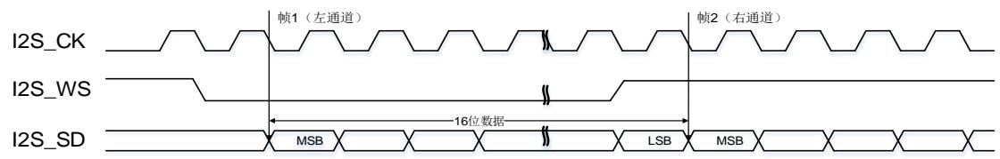

图 27-21. I2S 飞利浦标准时序图（DTLEN = 00，CHLEN = 0， $\mathsf { c K P L } = 1 )$ ）

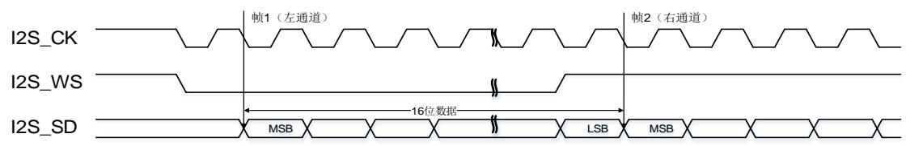

图 27-22. I2S 飞利浦标准时序图（DTLEN = 10，CHLEN = 1，CKPL = 0）

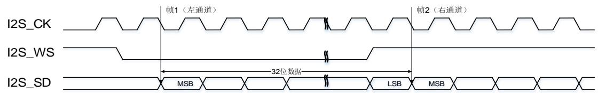

图 27-23. I2S 飞利浦标准时序图（DTLEN = 10，CHLEN = 1，CKPL = 1）

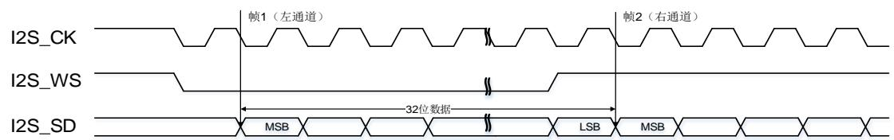

图 27-24. I2S 飞利浦标准时序图（DTLEN = 01，CHLEN = 1，CKPL = 0）

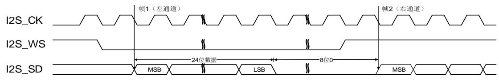

图 27-25. I2S 飞利浦标准时序图（DTLEN = 01，CHLEN = 1，CKPL = 1）

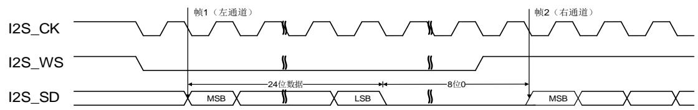

图 27-26. I2S 飞利浦标准时序图（DTLEN = 00，CHLEN = 1，CKPL = 0）

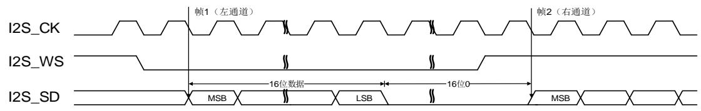

图 27-27. I2S 飞利浦标准时序图（DTLEN = 00，CHLEN = 1，CKPL = 1）

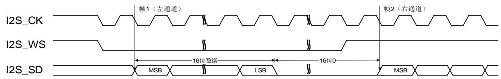

# MSB对齐标准

对于MSB对齐标准，I2S_WS和I2S_SD在I2S_CK的下降沿变化。各个配置情况的时序图如下所示。

$\Zeta - 2 8 . ~ \mathsf { M S B } ~ \mathbb { X } \sharp \ Zeta + \sharp \ Zeta \mathbb { M } \sharp \ Z \sharp \ Z \sharp \ Z \ ~ ( \mathsf { D T L E N } = 0 . 0 0 , ~ \mathsf { C H L E N } = 0 , ~ \mathsf { C K P L } = 0 )$

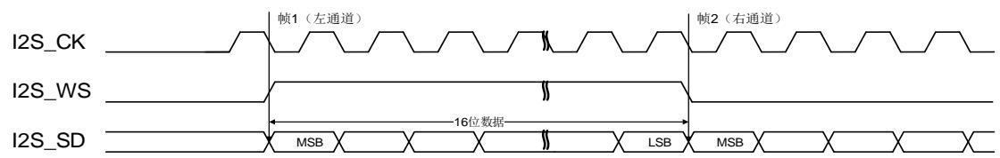

图 27-29. MSB 对齐标准时序图（DTLEN = 00，CHLEN = 0，CKPL = 1）

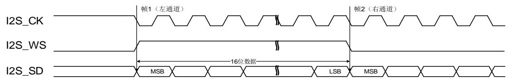

图 27-30. MSB 对齐标准时序图（DTLEN = 10，CHLEN = 1，CKPL = 0）

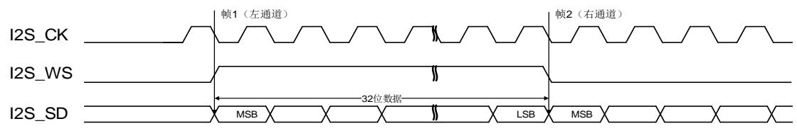

图 27-31. MSB 对齐标准时序图（DTLEN = 10，CHLEN = 1，CKPL = 1）

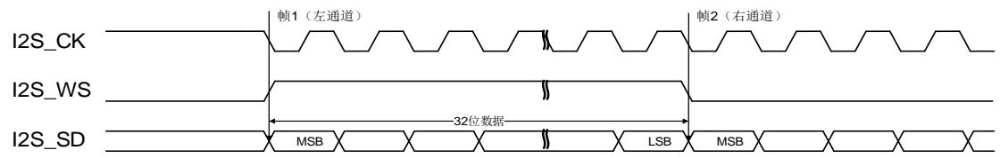

图 27-32. MSB 对齐标准时序图（DTLEN = 01，CHLEN = 1，CKPL = 0）

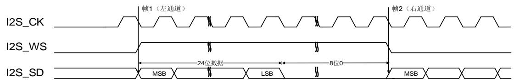

图 27-33. MSB 对齐标准时序图（DTLEN = 01，CHLEN = 1，CKPL = 1）

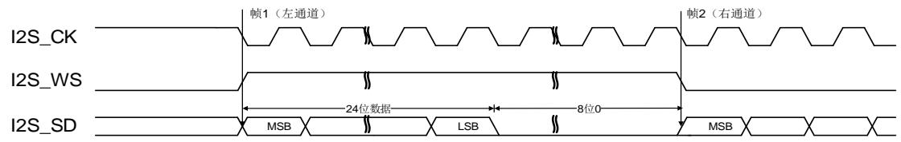

图 27-34. MSB 对齐标准时序图（DTLEN = 00，CHLEN = 1，CKPL = 0）

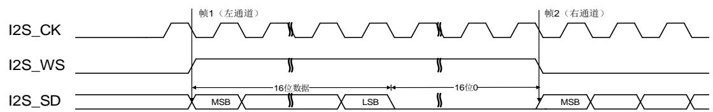

图 27-35. MSB 对齐标准时序图（DTLEN = 00，CHLEN = 1，CKPL = 1）

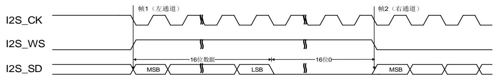

# LSB对齐标准

对于LSB对齐标准，I2S_WS和I2S_SD在I2S_CK的下降沿变化。在通道长度与数据长度相同的情况下，LSB对齐标准和MSB对齐标准是完全相同的。对于通道长度大于数据长度的情况，LSB对齐标准的有效数据与最低位对齐，而MSB对齐标准的有效数据与最高位对齐。通道长度大于数据长度的各种配置情况时序图如下所示。

图 27-36. LSB 对齐标准时序图（DTLEN = 01，CHLEN = 1，CKPL = 0）

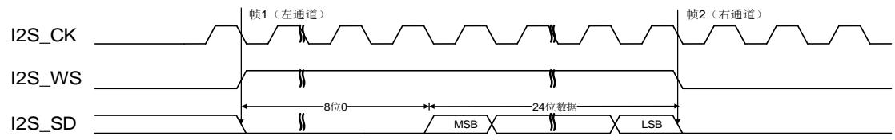

图 27-37. LSB 对齐标准时序图（DTLEN = 01，CHLEN = 1，CKPL = 1）

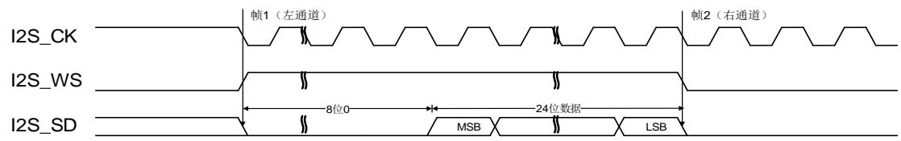

图 27-38. LSB 对齐标准时序图（DTLEN = 00，CHLEN = 1，CKPL = 0）

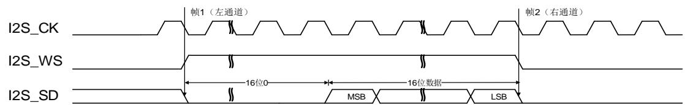

图 27-39. LSB 对齐标准时序图（DTLEN = 00，CHLEN = 1，CKPL = 1）

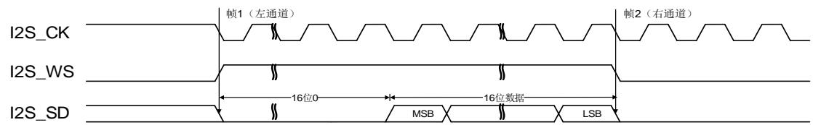

# PCM 标准

对于PCM标准，I2S_WS和I2S_SD在I2S_CK的上升沿变化，I2S_WS信号表示帧同步信息。可以通过SPI_I2SCTL寄存器的PCMSMOD位来选择短帧同步模式和长帧同步模式。SPI_TDATA/ SPI_RDATA寄存器的处理方式与I2S飞利浦标准完全相同。短帧同步模式的各种配置情况时序图如下所示。

图 27-40. PCM 标准短帧同步模式时序图（DTLEN = 00，CHLEN = 0，CKPL = 0）

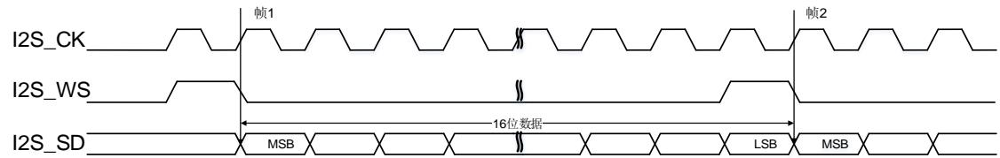

图 27-41. PCM 标准短帧同步模式时序图（DTLEN = 00， $\mathsf { C H L E N } = \mathsf { 0 }$ ，CKPL = 1）

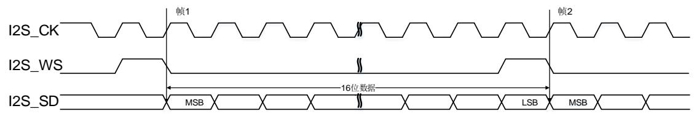

图 27-42. PCM 标准短帧同步模式时序图（DTLEN = 10，CHLEN = 1，CKPL = 0）

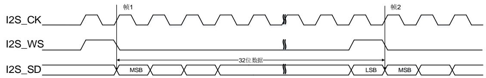

图 27-43. PCM 标准短帧同步模式时序图（DTLEN = 10，CHLEN = 1， $\mathsf { C K P L } = 1 )$

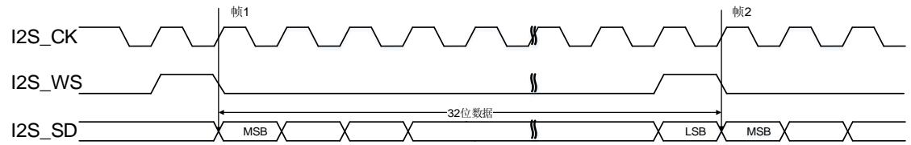

图 27-44. PCM 标准短帧同步模式时序图（DTLEN = 01， $\mathsf { C H L E N } = 1$ ， $\mathsf { C K P L } = \mathsf { \pmb 0 } )$ ）

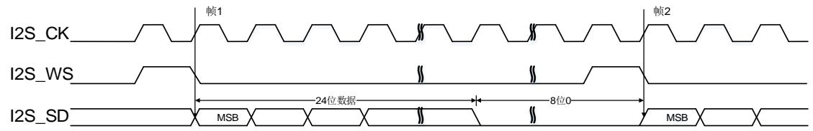

图 27-45. PCM 标准短帧同步模式时序图（DTLEN = 01， $\mathsf { C H L E N } = 1$ ， $\mathsf { c K P L } = 1 )$

图 27-46. PCM 标准短帧同步模式时序图（DTLEN = 00，CHLEN = 1， $\mathsf { C K P L } = \mathsf { 0 } )$

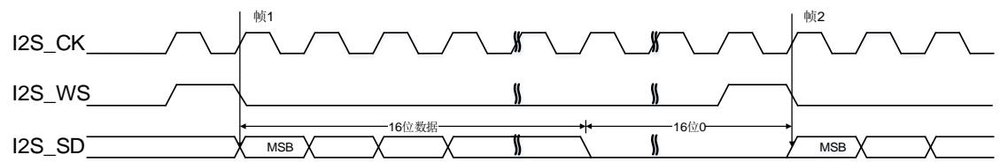

图 27-47. PCM 标准短帧同步模式时序图（DTLEN = 00， $\mathsf { C H L E N } = 1$ ， $\mathsf { c K P L } = 1 )$

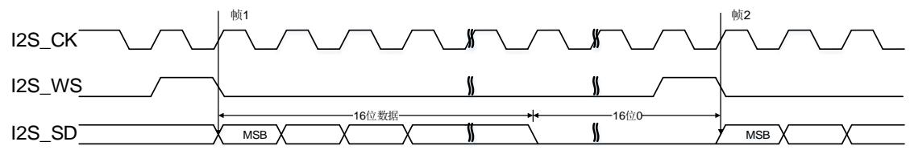

长帧同步模式的各种配置情况时序图如下所示。

图 27-48. PCM 标准长帧同步模式时序图（DTLEN = 00， $\mathsf { C H L E N } = \mathsf { 0 }$ ， $\mathsf { C K P L } = \mathsf { 0 } )$

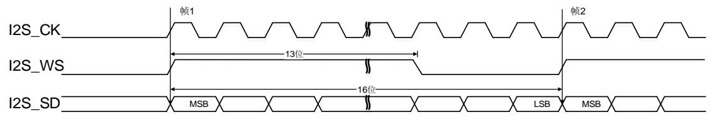

图 27-49. PCM 标准长帧同步模式时序图（DTLEN = 00， $\mathsf { C H L E N } = \mathsf { 0 } _ { \mathrm { : } }$ ， $\mathsf { C K P L } = 1 )$

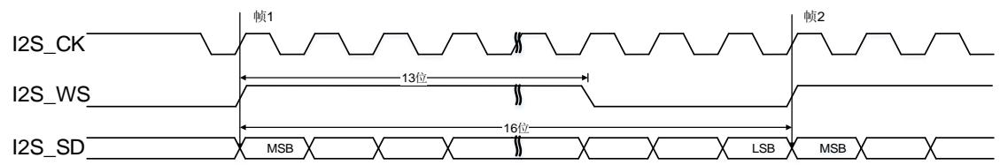

图 27-50. PCM 标准长帧同步模式时序图（DTLEN = 10， $\mathsf { C H L E N } = 1$ ， $\mathsf { C K P L } = \mathsf { \pmb 0 } )$

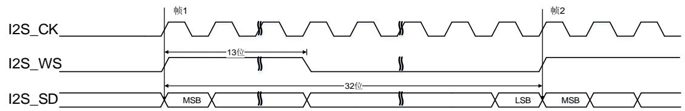

图 27-51. PCM 标准长帧同步模式时序图（DTLEN = 10， $C H L E N = 1$ ， $\mathsf { c K P L } = 1 )$

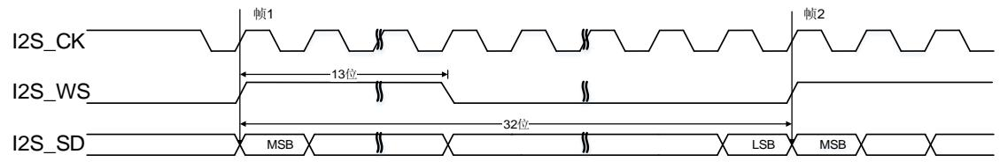

图 27-52. PCM 标准长帧同步模式时序图（DTLEN = 01，CHLEN = 1， $\mathsf { C K P L } = \mathsf { 0 } )$

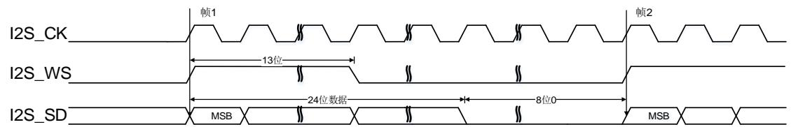

图 27-53. PCM 标准长帧同步模式时序图（DTLEN = 01， $\mathsf { C H L E N } = 1$ ，CKPL = 1）

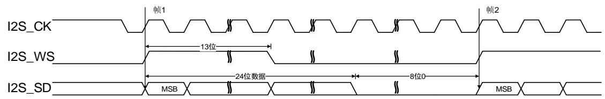

图 27-54. PCM 标准长帧同步模式时序图（DTLEN = 00， $\mathsf { C H L E N } = 1$ ，CKPL = 0）

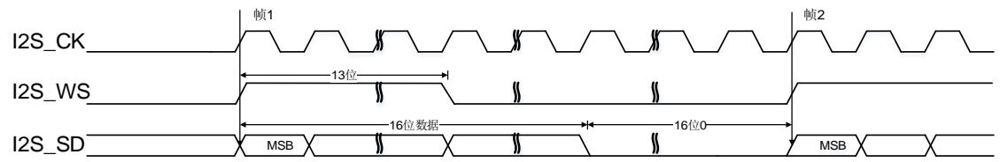

图 27-55. PCM 标准长帧同步模式时序图（DTLEN = 00， $\mathsf { C H L E N } = 1$ ， $\mathsf { C K P L } = 1 )$

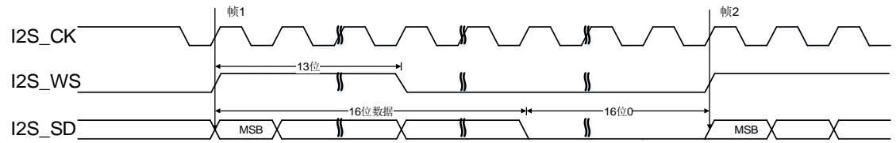

# 27.4.4. I2S 时钟

图 27-56. I2S 时钟生成结构框图

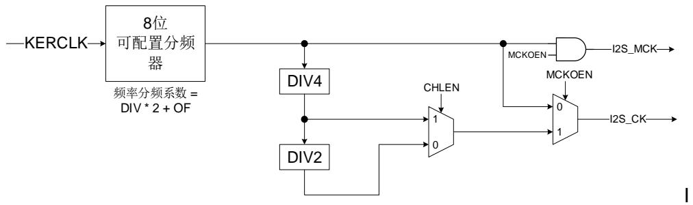

I2S时钟生成器框图如 27-56. I2S 所示。I2S接口时钟是通过SPI_I2SCTL寄存器的DIV位，OF位和MCKOEN位以及SPI_I2SCTL寄存器的CHLEN位来配置的。时钟源是内核时钟（KERCLK）。I2S比特率可以通过 27-9. I2S 所示的公式计算。

表 27-9. I2S 比特率计算公式

<table><tr><td>MCKOEN</td><td>CHLEN</td><td>公式</td></tr><tr><td>0</td><td>0</td><td>KERCLK / (DIV * 2 + OF)</td></tr><tr><td>0</td><td>1</td><td>KERCLK / (DIV * 2 + OF)</td></tr><tr><td>1</td><td>0</td><td>KERCLK / (8 * (DIV * 2 + OF))</td></tr><tr><td>1</td><td>1</td><td>KERCLK / (4 * (DIV * 2 + OF))</td></tr></table>

音频采样率（Fs）和I2S比特率的关系由如下公式定义：

Fs = I2S比特率 / （通道长度 * 通道数）

所以，为了得到期望的音频采样率，时钟生成器需要按 27-10. 所列的公式进行配置。

注意：I2S串行时钟的配置值建议设置为低于I2S挂载APB对应的PCLK时钟的1/6倍（不包含1/6）。

表 27-10. 音频采样频率计算公式

<table><tr><td>MCKOEN</td><td>CHLEN</td><td>公式</td></tr><tr><td>0</td><td>0</td><td>KERCLK / (32 * (DIV * 2 + OF))</td></tr><tr><td>0</td><td>1</td><td>KERCLK / (64 * (DIV * 2 + OF))</td></tr><tr><td>1</td><td>0</td><td>KERCLK / (256 * (DIV * 2 + OF))</td></tr><tr><td>1</td><td>1</td><td>KERCLK / (256 * (DIV * 2 + OF))</td></tr></table>

# 27.4.5. RxFIFO 和 TxFIFO

RxFIFO 和 TxFIFO 用于 I2S 数据传输的不同方向，它们可以使 I2S 工作在一个连续的流中，可以防止短数据帧或中断/DMA延迟太长发生溢出错误。

对 SPI_TDATA 寄存器的写访问将写入的数据存储在 TxFIFO 的末尾，而对 SPI_RDATA 的读访问将返回 RxFIFO 中尚未被读取的最早的值。在 I2S 模式下，左音频采样和右音频采样在FIFO 中交错进行。这意味着对于发送操作，用户必须先用左通道数据填充 TxFIFO，然后是右通道，以此类推。对于接收模式，从 RxFIFO 读取的第一个数据是左通道，下一个数据是右通道，以此类推。

FIFO 处理取决于数据长度（DTLEN 值）、访问 FIFO 寄存器的大小（8、16 或 32 位）。

TxFIFO / RxFIFO 的范围为 16x32 位，最大访问数据长度为 32 位， 27-11. I2SX FIFO描述了在不同数据长度时，FIFO中可存放的最大帧数量。（N = FIFO范围 / 32= 16 x 32 / 32 = 16）

表 27-11. I2SX FIFO 最大存储数据帧数量

<table><tr><td>数据长度(DTLEN)</td><td>DTLEN = 16 位</td><td>DTLEN = 24 位</td><td>DTLEN = 32 位</td></tr><tr><td>FIFO 存储帧数(WORDEN = 0)</td><td>N</td><td>-</td><td>-</td></tr><tr><td>FIFO 存储帧数(WORDEN = 1)</td><td>2N</td><td>N</td><td>N</td></tr></table>

可根据可编程的 FIFO 阈值生成中断或者 DMA请求。FIFOLVL 的影响和 SPI 的一致。

注意：SPI_TDATA和SPI_RDATA内数据是默认右对齐的。当I2S设备被禁止时（I2SEN = 0），RxFIFO和TxFIFO中的数据将被清空。

# 27.4.6. 运行

# 运行模式

运行模式是通过SPI_I2SCTL寄存器的I2SOPMOD位来选择的。共有四种运行模式可供选择：主机发送模式，主机接收模式，从机发送模式和从机接收模式。各种运行模式下 I2S 接口信号的方向如 27-12. I2S 所示。

表 27-12. 各种运行模式下 I2S接口信号的方向

<table><tr><td>运行模式</td><td>I2S_MCK</td><td>I2S_CK</td><td>I2S_WS</td><td>I2S_SD</td></tr><tr><td>主机发送</td><td>输出或 NU(1)</td><td>输出</td><td>输出</td><td>输出</td></tr><tr><td>主机接收</td><td>输出或 NU(1)</td><td>输出</td><td>输出</td><td>输入</td></tr><tr><td>从机发送</td><td>输入或 NU(1)</td><td>输入</td><td>输入</td><td>输出</td></tr><tr><td>从机接收</td><td>输入或 NU(1)</td><td>输入</td><td>输入</td><td>输入</td></tr></table>

1. NU表示该引脚没有被I2S使用，可以用于其他功能。

# I2S 初始化流程

I2S初始化过程包括以下五个步骤。如果要初始化I2S工作在主机模式，五个步骤都要执行，如果要初始化I2S工作在从机模式，只需要执行步骤2、3、4、5、6、7。

步骤1：配置SPI_I2SCTL寄存器的DIV[7:0]位，OF位和MCKOEN位，定义I2S的比特率和选择是否需要提供I2S_MCK信号；

步骤2：配置SPI_I2SCTL寄存器的CKPL位，定义空闲状态的时钟极性；

步骤3：配置FIFO等级（在SPI_CFG0寄存器中的FIFOLVL[3:0]位）；

步 骤 4 ： 配 置 SPI_I2SCTL 寄 存 器 的 I2SSEL 位 ， I2SSTD[1:0] 位 ， PCMSMOD 位 ，I2SOPMOD[1:0]位，DTLEN[1:0]位和CHLEN位，定义I2S的特性；

步骤5：配置TPIE位，RPIE位，TXUREIE位，RXOREIE位，FEIE位，DMATEN位和DMAREN位，选择中断源和DMA功能。此步骤可选；

步骤6：将SPI_I2SCTL寄存器的I2SEN位置1，来启动I2S；

步骤7：将SPI_CTL0寄存器中的MSTART置1，来激活串行接口。

# I2S基本发送和接收流程

# 发送流程

在完成初始化过程之后，I2S模块使能并保持在空闲状态。在主机模式下，当软件写一个数据到TxFIFO时，发送过程开始。在从机模式下，应用程序必须确保在数据发送开始前，数据已经写入TxFIFO中。

当I2S开始发送一个数据帧时，首先将这个数据帧从TxFIFO加载到移位寄存器中，然后开始发送加载的数据。相关操作可参考描述。

对SPI_TDATA的写访问由TP事件管理。当TP标志设置为1时，应用程序对I2S数据寄存器写入适当数量的数据，以传输数据包的内容。在上传新的完整包后，应用程序检查TP值，检查TxFIFO是否可以接收额外的数据包，如果TP = 1，则逐包上传，直到TP读取0。如果传输大小和数据包大小没有对齐，则最后要传输的数据包数无法达到配置的大小（由FIFOLVL设置）。应用程序仍然可以将标准数量的先前完整数据包写入TxFIFO，而不会产生不良影响：只有一致的数据（完整的数据帧）将传输到TxFIFO，而冗余的写入时间（或任何不完整的数据）将被忽略。

在主机模式下，若想要实现连续发送功能，那么在当前数据帧发送完成前，软件应该将下一个数据写入SPI_TDATA寄存器中。只要TxFIFO中存在数据，数据发送便一直继续，直至TxFIFO

变为空。

# 接收流程

在最后一个采样时钟边沿之后，接收到的数据将从移位寄存器存入到RxFIFO，且RP（RxFIFO非空）位置1。软件通过读SPI_RDATA寄存器获得接收的数据，此操作会自动清除RP标志位（当RxFIFO数据量少于FIFOLVL标准）。

对SPI_RDATA的读访问由RP事件管理。当RP标志设置为1时，应用程序读取I2S数据寄存器相当数量的数据，以下载单个数据包内容。下载完整数据包后，应用程序会检查RP值，查看RxFIFO中是否有其他数据包，如果有，则逐包下载，直到RP读到0。在接收结束时，可能会出现RxFIFO中仍然有一些数据可用，但没有达到FIFOLVL级别，因此RP不会被设置为1。在这种情况下，RxFIFO中剩余的RX数据帧的数量将由SPI_STAT寄存器中的RWNE和RPLVL表示。如果传输大小和数据包大小没有对齐，当最后接收的数据包数量不能达到配置的大小（由FIFOLVL设置）时，就会出现上述情况。然而，应用程序仍然可以从RxFIFO读取标准数量的以前完整的数据包，而不会产生不良影响：只有一致的数据（完整的数据帧）将从RxFIFO读取，而冗余的读取（或任何不完整的数据）将读取0。

# I2S 停止流程

I2S主机停止流程：

步骤1：停止总线时钟和DMA功能；

步骤2：将I2SEN置0，禁止I2S模块。

I2S从机停止流程：

步骤1：将I2SEN置0，禁止I2S模块；

步骤2：停止总线时钟和DMA功能。

# 27.4.7. DMA 功能

DMA功能与SPI模式完全一样，唯一不同的地方就是I2S模式不支持CRC功能。

# 27.4.8. I2S 中断

# 状态标志位

SPI_STAT寄存器中有两个可用的标志位（TP、RP），SPI_I2SCTL寄存器中有一个可用的标志位（I2SCH），用户通过这些标志位可以全面监视I2S总线的状态。

# 发送包空间可用标志（TP）

当TxFIFO有足够的可用位置来容纳一个数据包时设置此位，软件可以通过写入SPI_TDATA寄存器将下一个数据包写入TxFIFO。当TxFIFO没有足够的空间放置下一个数据包时，该位被清除，软件不能通过写入SPI_TDATA寄存器将下一个数据包写入TxFIFO。

# 接收包空间可用标志（RP）

当RxFIFO非空时设置该位，这意味着至少有一个数据包被接收并存储在接收缓冲区中，并且软件可以通过读取SPI_RDATA寄存器来读取数据包。当RxFIFO为空或RxFIFO中存储的数据不能到达FIFOLVL时，该位被清除。因此，当RxFOFO为空时，软件无法通过读取SPI_RDATA寄存器来读取数据包。或在这种情况下, RxFIFO剩余的数据帧的数量将由SPI_STAT寄存器的RWNE和RPLVL表示,应用程序仍然可以从RxFIFO读取标准数量完整数据包不产生不利影响。

# I2S通道标志（I2SCH）：

I2SCH用来表明当前传输数据的通道信息，对PCM音频标准来说没有意义。在发送模式下，I2SCH标志在每次发送通道切换时更新，在接收模式下，I2SCH标志在每次接收通道切换时更新。该标志位不会产生任何中断。

注：因为FIFO的存在，该位的变化，与TP / RP不再有相关性。变化会发生在一个channel传输结束时（channel的传输结束，并不代表数据传输结束，例如channel 32位，data 16位时，channel传输结束代表32位完成的时候）。

# 错误标志

有三个错误标志：

# 接收上溢错误标志（RXORERR）：

当接收缓冲区已满且又接收到一个新的数据时，接收过载错误标志RXORERR置位。当接收过载发生时，接收缓冲区中的数据没有更新，新接收的数据丢失。当RXOREIE被设置为1时，RXORERR标志置1触发中断。可以通过在SPI_STATC寄存器的RXORERRC位写入1来清除RXORERR。

注：I2S模式存在一种硬件机制，可防止因上溢导致的左右通道数据互换的错误。比如，数据接收顺序为L0 -> R0 -> L1 -> R1 -> L2 -> R2 -> L3 -> R3…LN -> RN（L代表左通道数据，R代表右通道数据）。当上溢发生在R1接收后，L2数据丢失，当RxFIFO恢复后（可接收数据），硬件会自动丢弃R2数据，并接收L3数据到左通道，接收R3到右通道。当上溢发生在L2接收后，R2数据丢失，当RxFIFO恢复后（可接收数据），硬件会自动丢弃L3数据，并接收R3数据到右通道，接收L4数据到左通道。

# 帧格式错误（FERR）：

在从I2S模式下，I2S模块监视I2S_WS信号，如果I2S_WS信号在一个错误的位置发生翻转，将会置位FERR帧错误标志位。当FEIE被设置为1时，FERR标志置1触发中断。通过向SPI_STATC寄存器的FERRC位写入1可以清除FERR。

# 发送下溢错误标志（TXURERR）：

在从传输模式中TxFIFO是空的，但需要将新数据传入移位寄存器时发送下溢错误标志TXURERR置1，这种情况发生时，至少会丢失一个数据。TXURERR标志在TXUREIE设置为1时触发中断。可以通过将SPI_STATC寄存器的TXURERRC位写1来清除TXURERR。

注：I2S模式存在一种硬件机制，可防止因下溢导致的左右通道数据互换的错误。比如，数据发送顺序为L0 -> R0 -> L1 -> R1 -> L2 -> R2 -> L3 -> R3…LN- > RN（L代表左通道数据，R代表右通道数据）。当下溢发生在R1发送后，L2数据未及时传入TxFIFO导致TxFIFO为空，硬件会自动将R1数据传入左通道，再传入右通道，当L2数据传入TxFIFO后，再将L2数据传入左通道，R2数据传入右通道。当上溢发生在L2发送后，R2数据未及时传入TxFIFO导致TxFIFO为空，硬件会自动将L2数据传入右通道，再传入左通道，当R2数据传入TxFIFO后，再将R2数据传入右通道，L3数据传入左通道。

27-13. I2S 总结了I2S中断事件和相应的使能位。

表 27-13. I2S 中断

<table><tr><td>中断标志</td><td>描述</td><td>清除方式</td><td>中断使能位</td></tr><tr><td>TP</td><td>发送包空间可用标志</td><td>当 TxFIFO 空间少于 FIFOLVL, TP 被硬件清除</td><td>TPIE</td></tr><tr><td>RP</td><td>接收包空间可用标志</td><td>当 RxFIFO 数据量少于 FIFOLVL, RP 被硬件清除</td><td>RPIE</td></tr><tr><td>TXURERR</td><td>发送下溢错误</td><td>TXURERRC 置 1</td><td>TXUREIE</td></tr><tr><td>RXORERR</td><td>接收上溢错误</td><td>RXORERRC 置 1</td><td>RXOREIE</td></tr><tr><td>FERR</td><td>帧格式错误</td><td>FERRC 置 1</td><td>FEIE</td></tr></table>

# 1：相关IO的AF配置功能禁止

该位可被软件设置，并且可被硬件清0，不论SPIEN位是否由1变0，或者当SPIEN位和CONFERR位为0时可由软件清0。当CONFERR位置1时，该位被清0，并且不能置1。当SPIEN位使能后，该位被写保护。当该位被置1后，SPI_CFG1寄存器不能改变。

# 15 TXCRCI 发送器CRC初始化配置

0：全0模式使用

1：全1模式使用

# 14 RXCRCI 接收器CRC初始化配置

0：全0模式使用

1：全1模式使用

# 13 CRCFS 全尺寸CRC多项式配置

0：不使用全尺寸CRC多项式

1：使用全尺寸CRC多项式

# 12 NSSI 内部NSS信号输入电平

0：NSS引脚被拉低

1：NSS引脚被拉高

只有当NSSIM位置1，该位有效。该位的值作用到外设NSS引脚的输入状态，并且NSS引脚的IO值无效。

# 11 保留 必须保持复位值。

# 10 MSPDR SPI主机模式挂起请求

0：无挂起请求

1：有挂起请求

该位读取为0。在SPI主机模式中，如果该位被软件置1，当MSTART在当前帧传输结束后被复位，SPI交互将被挂起。用户需要通过检查SPI_STAT寄存器中的SPD标志去判断传输是否结束。在SPI禁止前，主机通信必须被挂起（可通过该位或清空SPI_TDATA寄存器实现）。

# 9 MSTART 主机启动传输

0：主机处于空闲状态

1：主机开始传输，或者被自动挂起功能临时挂起

该位可被软件置1，当SPI_STAT寄存器中的ET = 1或当收到挂起请求时被硬件清零。

在SPI模式中，只有当SPIEN = 1和SPI_CFG1寄存器中的MSTMOD = 1时，该位可被设置。

在I2S/PCM模式中，只有当I2SEN = 1，该位可被设置。

# 8 MASP 主机在接收模式时被自动挂起

0：不论上溢是否发生，SPI的数据流和时钟都持续

1：当上溢出现之前，当RxFIFO已满时，SPI数据流被挂起。SPI_STAT寄存器中的SPD标志将置1

当SPI通信被暂停以防止上溢时，下一帧的几个位可能由于内部同步延迟而被同步

出去。读取RxFIFO后，通信恢复，后续的位传输继续不受任何限制。

出于同样的原因，当数据大小小于8位时，自动挂起不是很可靠。在这种情况下，通过设置MDFD参数值，应用的数据帧之间的插入延迟来实现安全挂起；数据大小和交错SPI周期的总和，应该始终产生至少8个SPI时钟周期的间隔。

注意：MASP只能在接收模式下开启，否则可能会引发RXORERR（接收上溢）错误。

7:1 保留 必须保持复位值。

0 SPIEN SPI使能

0：SPI设备禁止

1：SPI设备使能

该位可被软件置1或清零，并且当SPI_STAT寄存器的CONFERR位置1时，该位不能置1。

# 27.5.2. 控制寄存器 1（SPI_CTL1）

地址偏移：0x04

复位值：0x0000 0000

该寄存器可以按字（32位）访问。

<table><tr><td>31</td><td>30</td><td>29</td><td>28</td><td>27</td><td>26</td><td>25</td><td>24</td><td>23</td><td>22</td><td>21</td><td>20</td><td>19</td><td>18</td><td>17</td><td>16</td></tr><tr><td colspan="16">TXSER[15:0]</td></tr><tr><td colspan="16">rw</td></tr><tr><td>15</td><td>14</td><td>13</td><td>12</td><td>11</td><td>10</td><td>9</td><td>8</td><td>7</td><td>6</td><td>5</td><td>4</td><td>3</td><td>2</td><td>1</td><td>0</td></tr><tr><td colspan="16">TXSIZE[15:0]</td></tr></table>

rw

<table><tr><td>位/位域</td><td>名称</td><td>描述</td></tr><tr><td>31:16</td><td>TXSER[15:0]</td><td>当先前保存在TXSIZE中的数据量被传输完后,将重新加载存储在TXSER中的扩展数据量到TXSIZE中。这些位只能在其值为0时被软件设置。TXSIZE重新加载后,它会被硬件清除。如果是最后一次重加载必须在CTXSIZE(在SPI_STAT寄存器中)计数器到达1之前编写最后一次TXSER,除此之外的重加载必须在CTXSIZE(在SPI_STAT寄存器中)计数器达到1(如果配置CRCEN则要在2)之前,并且CTXSIZE计数器在小于上次配置TXSER减1时预先编写新的TXSER值,否则将不考虑重载,通信将正常终止。注意:TXSER设置需要大于1。</td></tr><tr><td>15:0</td><td>TXSIZE[15:0]</td><td>当前要传输的数据量这些位可以通过软件修改,当MSTART位设置为1时不能修改。当TXSIZE为0,MSTART设置为1时,将开始无限传输。当CRC使能时,TXSIZE不能设置为0xFFFF/0x0001。</td></tr></table>

# 27.5.3. 配置寄存器 0（SPI_CFG0）

地址偏移：0x08

复位值：0x0007 0007

该寄存器可以按字（32位）访问。当SPI使能后，除了DMATEN和DMAREN位，该寄存器被写保护。

<table><tr><td>31</td><td>30</td><td>29</td><td>28</td><td>27</td><td>26</td><td>25</td><td>24</td><td>23</td><td>22</td><td>21</td><td>20</td><td>19</td><td>18</td><td>17</td><td>16</td></tr><tr><td>保留</td><td colspan="3">PSC[2:0]</td><td colspan="3">保留</td><td>WORDEN</td><td>BYTEN</td><td>CRCEN</td><td>保留</td><td colspan="5">CRCSZ[4:0]</td></tr><tr><td></td><td colspan="6">rw</td><td>rw</td><td>rw</td><td>rw</td><td></td><td></td><td colspan="4">rw</td></tr><tr><td>15</td><td>14</td><td>13</td><td>12</td><td>11</td><td>10</td><td>9</td><td>8</td><td>7</td><td>6</td><td>5</td><td>4</td><td>3</td><td>2</td><td>1</td><td>0</td></tr><tr><td>DMATEN</td><td>DMAREN</td><td>保留</td><td colspan="2">TXURDT[1:0]</td><td colspan="2">TXUROP[1:0]</td><td colspan="4">FIFOLVL[3:0]</td><td colspan="5">DZ[4:0]</td></tr><tr><td>rw</td><td>rw</td><td></td><td colspan="2">rw</td><td colspan="2">rw</td><td colspan="4">rw</td><td colspan="5">rw</td></tr></table>

<table><tr><td>位/位域</td><td>名称</td><td>描述</td></tr><tr><td>31</td><td>保留</td><td>必须保持复位值。</td></tr><tr><td>30:28</td><td>PSC[2:0]</td><td>主时钟预分频选择000: KERCLK / 2001: KERCLK / 4010: KERCLK / 8011: KERCLK / 16100: KERCLK / 32101: KERCLK / 64110: KERCLK / 128111: KERCLK / 256注意: 四线模式下,000 / 001配置不可用。TI模式下,当DZ为4时,000配置不可用。</td></tr><tr><td>27:25</td><td>保留</td><td>必须保持复位值。</td></tr><tr><td>24</td><td>WORDEN</td><td>字访问使能该位用于指示对FIFO的访问宽度,并设置产生RWNE的RXFIFO的阈值。0: 按照BYTEN访问1: 字访问在I2S模式下,为了保证声道数据稳定,WORDEN与DTLEN有关。当DTLEN = 0时,WORDEN必须为0。当DTLEN &gt; 0时,WORDEN必须为1。</td></tr><tr><td>23</td><td>BYTEN</td><td>字节访问使能该位用于指示对FIFO的访问宽度,并设置产生RWNE的RXFIFO的阈值。0: 半字访问1: 字节访问在I2S模式下,为了保证声道数据稳定,该位必须始终为0。</td></tr><tr><td>22</td><td>CRCEN</td><td>CRC计算使能0: CRC计算禁止</td></tr></table>

1：CRC计算使能

21 保留 必须保持复位值。

20:16 CRCSZ[4:0] CRC长度

该位域必须等于DZ值或DZ值的倍数。

00000：未使用

00001：未使用

00010：未使用

00011：4位

00100：5位

00101：6位

11101：30位

11110：31位

11111：32位

15 DMATEN 发送缓冲区DMA使能

0：发送缓冲区DMA禁止

1：发送缓冲区DMA使能

14 DMAREN 接收缓冲区DMA使能

0：接收缓冲区DMA禁止

1：接收缓冲区DMA使能

13 保留 必须保持复位值。

12:11 TXURDT[1:0] 从机发送时检测下溢

00：在数据帧开始时检测到下溢（无第一位保护）

01：在最后一个数据帧结束时检测到下溢

10：在NSS信号开始时检测到下溢

11：保留

10:9 TXUROP[1:0] 从机发送时检测到下溢后的处理

00：从机发送定义在SPI_URDATA寄存器中的常数

01：从机发送从主机获取的最后一帧数据

10：从机发送最后一次发送的数据帧（该数据帧存储在TxFIFO中）

11：保留

8:5 FIFOLVL FIFO阈值

定义单个数据包中包含的数据帧数。数据包的大小不应超过FIFO空间的一半。

0000：1个数据帧

0001：2个数据帧

0010：3个数据帧

0011：4个数据帧

1101：14个数据帧

1110：15个数据帧

1111：16个数据帧

如果配置的数据包大小与数据寄存器访问对齐，SPI接口将更有效。如果SPI数据寄存器作为16位访问，并且DZ <= 8位，最好选择FIFOLVL = 2、4、6等。如果SPI数据寄存器作为32位访问，并且DZ > 8位，最好选择FIFOLVL = 2、4、6等。而如果DZ <= 8位，则最好选择FIFOLVL = 4、8、12等。

4:0 DZ[4:0] 数据位宽

这些位配置一帧数据的位数：

00000：保留

00001：保留

00010：保留

00011：4位，（当数据宽度是4 bit时，必须使用字 / 半字访问FIFO，否则会有数据错乱的风险）

00100：5位

00101：6位

00110：7位

11101：30位

11110：31位

11111：32位

# 27.5.4. 配置寄存器 1（SPI_CFG1）

地址偏移：0x0C

复位值：0x0000 0000

该寄存器可以按字（32位）访问。当SPI使能或IOAFEN位置1，该寄存器被写保护。

<table><tr><td>31</td><td>30</td><td>29</td><td>28</td><td>27</td><td>26</td><td>25</td><td>24</td><td>23</td><td>22</td><td>21</td><td>20</td><td>19</td><td>18</td><td>17</td><td>16</td></tr><tr><td>AFCTL</td><td>NSSCTL</td><td>NSSDRV</td><td>NSSIOPL</td><td>保留</td><td>NSSIM</td><td>CKPL</td><td>CKPH</td><td>LF</td><td>MSTMOD</td><td>TMOD</td><td colspan="2">保留</td><td>BDEN</td><td>BDOEN</td><td>RO</td></tr><tr><td>rw</td><td>rw</td><td>rw</td><td>rw</td><td></td><td>rw</td><td>rw</td><td>rw</td><td>rw</td><td>rw</td><td>rw</td><td colspan="2"></td><td>rw</td><td>rw</td><td>rw</td></tr><tr><td>15</td><td>14</td><td>13</td><td>12</td><td>11</td><td>10</td><td>9</td><td>8</td><td>7</td><td>6</td><td>5</td><td>4</td><td>3</td><td>2</td><td>1</td><td>0</td></tr><tr><td>SWPMIO</td><td colspan="7">保留</td><td colspan="4">MDFD[3:0]</td><td colspan="4">MSSD[3:0]</td></tr><tr><td colspan="8">rw</td><td colspan="4">rw</td><td colspan="4">rw</td></tr></table>

位/位域 名称 描述

<table><tr><td>31</td><td>AFCTL</td><td>AF GPIOs控制当SPI禁止时,该位可被设置或清零。0:外设在禁止时不能控制GPIOs1:外设总是控制相关的GPIOs当由于特定的配置原因(如CRC重置,或CKPH更改)必须临时禁用SPI主服务器时,将此位设置为1将强制为备用功能模式配置的相关输出处于与当前SPI配置对应的状态,以防止出现毛刺。在从模式下,不应该使用这个位,因为一旦SPI被禁用,任何从发送器都不能强制其MISO输出。注意:在MFD、MRU和MRB模式下,禁止使用AFCTL。</td></tr><tr><td>30</td><td>NSSCTL</td><td>主机模式时NSS引脚输出控制0: NSS保持有效电平直到数据传输完成,之后通过ET标志变为无效电平1: 当MDFD[3:0] &gt; 1时,SPI数据帧之间插入交错脉冲</td></tr><tr><td>29</td><td>NSSDRV</td><td>主机模式NSS输出使能0: 输出禁止1: 输出使能</td></tr><tr><td>28</td><td>NSSIOPL</td><td>NSS输入 / 输出极性选择0: 低电平有效1: 高电平有效</td></tr><tr><td>27</td><td>保留</td><td>必须保持复位值。</td></tr><tr><td>26</td><td>NSSIM</td><td>NSS输入信号管理模式0: NSS输入值由NSS PAD决定1: NSS输入值由SPI_CTL0寄存器的NSSI位决定</td></tr><tr><td>25</td><td>CKPL</td><td>时钟信号极性选择0: SPI空闲时,CLK引脚拉低1: SPI空闲时,CLK引脚拉高</td></tr><tr><td>24</td><td>CKPH</td><td>时钟信号相位选择0: 在第一个时钟跳变沿采集第一个数据1: 在第二个时钟跳变沿采集第一个数据</td></tr><tr><td>23</td><td>LF</td><td>最低有效位先发模式0: 先发送最高有效位1: 先发送最低有效位该位在SPI TI模式下没有意义。</td></tr><tr><td>22</td><td>MSTMOD</td><td>主机模式使能0: 从机模式1: 主机模式</td></tr><tr><td>21</td><td>TMOD</td><td>SPI TI模式使能0: SPI TI模式禁止1: SPI TI模式使能</td></tr><tr><td>20:19</td><td>保留</td><td>必须保持复位值。</td></tr><tr><td>18</td><td>BDEN</td><td>双向数据模式使能0: 2线单向传输模式1: 1线双向传输模式。数据在主机的MOSI引脚和从机的MISO引脚之间传输</td></tr><tr><td>17</td><td>BDOEN</td><td>双向传输输出使能当BDEN置位时,该位决定了数据的传输方向。0: 工作在只接收模式1: 工作在只发送模式</td></tr></table>

<table><tr><td>16</td><td>RO</td><td>只接收模式当BDEN清零时,该位决定了数据的传输方向。0:全双工模式1:只接收模式</td></tr><tr><td>15</td><td>SWPMIO</td><td>MOSI与MISO引脚交换0:不交换1:交换该位置1,MISO与MISO引脚复用功能交换。</td></tr><tr><td>14:8</td><td>保留</td><td>必须保持复位值。</td></tr><tr><td>7:4</td><td>MDFD[3:0]</td><td>SPI主机模式时,数据帧之间延时0000:无延时0001:1 clock延时....1111:15 clock延时该位在SPI TI模式下没有意义。</td></tr><tr><td>3:0</td><td>MSSD[3:0]</td><td>SPI主机模式时,NSS有效沿与数据开始传输或0000:无延时0001:1 clock延时....1111:15 clock延时该位在SPI TI模式下没有意义。</td></tr></table>

# 27.5.5. 中断寄存器（SPI_INT）

地址偏移：0x10

复位值：0x0000 0000

该寄存器可以按半字（16位）或字（32位）访问。

<table><tr><td>31</td><td>30</td><td>29</td><td>28</td><td>27</td><td>26</td><td>25</td><td>24</td><td>23</td><td>22</td><td>21</td><td>20</td><td>19</td><td>18</td><td>17</td><td>16</td></tr><tr><td colspan="16">保留</td></tr><tr><td>15</td><td>14</td><td>13</td><td>12</td><td>11</td><td>10</td><td>9</td><td>8</td><td>7</td><td>6</td><td>5</td><td>4</td><td>3</td><td>2</td><td>1</td><td>0</td></tr><tr><td colspan="5">保留</td><td>TXSERFIE</td><td>CONFEIE</td><td>FEIE</td><td>CRCERIE</td><td>RXOREIE</td><td>TXUREIE</td><td>TXFIE</td><td>ESTCIE</td><td>DPIE</td><td>TPIE</td><td>RPIE</td></tr><tr><td colspan="5"></td><td>rw</td><td>rw</td><td>rw</td><td>rw</td><td>rw</td><td>rw</td><td>rw</td><td>rw</td><td>rw</td><td>rw</td><td>rw</td></tr></table>

<table><tr><td>位/位域</td><td>名称</td><td>描述</td></tr><tr><td>31:11</td><td>保留</td><td>必须保持复位值。</td></tr><tr><td>10</td><td>TXSERFIE</td><td>TXSER重载中断使能0: TXSER中断禁止1: TXSER中断使能</td></tr><tr><td>9</td><td>CONFEIE</td><td>SPI配置错误中断使能</td></tr></table>

0：SPI配置错误中断禁止

1：SPI配置错误中断使能

8 FEIE TI帧错误中断使能

0：TI帧错误中断禁止

1：TI帧错误中断使能

7 CRCERIE CRC错误中断使能

0：CRC错误中断禁止

1：CRC错误中断使能

6 RXOREIE 上溢错误中断使能

0：上溢中断禁止

1：上溢中断使能

5 TXUREIE 下溢错误中断使能

0：下溢中断禁止

1：下溢中断使能

4 TXFIE 传输已填充中断使能

0：TXF中断禁止

1：TXF中断使能

3 ESTCIE 传输结束、挂起、TxFIFO清空中断使能

0：ESTC中断禁止

1：ESTC中断使能

2 DPIE DP中断使能

0：DP中断禁止

1：DP中断使能

该位由软件置1，当TXF位置1时清除。

1 TPIE TP中断使能

0：TP中断禁止

1：TP中断使能

该位由软件置1，当TXF位置1时清除。

0 RPIE RP中断使能

0：RP中断禁止

1：RP中断使能

# 27.5.6. 状态寄存器（SPI_STAT）

地址偏移：0x14

复位值：0x0000 1002

该寄存器可以按字（32位）访问。

<table><tr><td>31</td><td>30</td><td>29</td><td>28</td><td>27</td><td>26</td><td>25</td><td>24</td><td>23</td><td>22</td><td>21</td><td>20</td><td>19</td><td>18</td><td>17</td><td>16</td></tr><tr><td colspan="16">CTXSIZE[15:0]</td></tr><tr><td colspan="16">r</td></tr><tr><td>15</td><td>14</td><td>13</td><td>12</td><td>11</td><td>10</td><td>9</td><td>8</td><td>7</td><td>6</td><td>5</td><td>4</td><td>3</td><td>2</td><td>1</td><td>0</td></tr><tr><td>RWNE</td><td colspan="2">RPLVL[1:0]</td><td>TC</td><td>SPD</td><td>TXSERF</td><td>CONFERR</td><td>FERR</td><td>CRCERR</td><td>RXORERR</td><td>TXURERR</td><td>TXF</td><td>ET</td><td>DP</td><td>TP</td><td>RP</td></tr><tr><td>r</td><td colspan="2">r</td><td>r</td><td>r</td><td>r</td><td>r</td><td>r</td><td>r</td><td>r</td><td>r</td><td>r</td><td>r</td><td>r</td><td>r</td><td>r</td></tr></table>

<table><tr><td>位/位域</td><td>名称</td><td>描述</td></tr><tr><td>31:16</td><td>CTXSIZE[15:0]</td><td>TXSIZE(在SPI_CTL1寄存器中)区域中剩余的数据帧数。当总线上有数据传输时,这个值不是很可靠。</td></tr><tr><td>15</td><td>RWNE</td><td>RxFIFO中的数据字长非空0: RxFIFO中包含的数据量少于一个字长1: RxFIFO中包含的数据量至少达到一个字长</td></tr><tr><td>14:13</td><td>RPLVL[1:0]</td><td>RxFIFO数据包级别这些位定义了RxFIFO最后32位的字区中存储的数据帧的数量。如果数据帧大小&lt;=8位(DZ[4:0] &lt;= 7):00:有0个(RWNE = 0)或4的倍数(RWNE = 1)个数据帧存储在RXFIFO中01:有1个数据帧存储在RxFIFO中(RWNE = 0)10:有2个数据帧存储在RxFIFO中(RWNE = 0)11:有3个数据帧存储在RxFIFO中(RWNE = 0)如果数据帧大小&gt;8位并且&lt;=16位(7 &lt; DZ[4:0] &lt;= 15):00:有0个(RWNE = 0)或2的倍数(RWNE = 1)个数据帧存储在RXFIFO中01:有1个数据帧存储在RxFIFO中(RWNE = 0)其他:不用。如果数据帧大小&gt;16位(DZ[4:0] &gt; 15):00:只读其他:不用。</td></tr><tr><td>12</td><td>TC</td><td>TxFIFO传输完成标志0:有数据保存在TxFIFO中,或者TxFIFO正进行最后一帧数据的传输(包含CRC)1:最后一个数据帧或CRC帧已发送结束</td></tr><tr><td>11</td><td>SPD</td><td>挂起标志0:SPI未挂起1:SPI主模式被挂起</td></tr><tr><td>10</td><td>TXSERF</td><td>额外的SPI数据已被重载0:未接收数据1:已接收额外的数据量,传输继续进行</td></tr><tr><td>9</td><td>CONFERR</td><td>SPI配置错误0:无配置错误1:配置错误发生</td></tr><tr><td>8</td><td>FERR</td><td>SPI TI格式错误0:无TI格式错误1: TI格式错误发生</td></tr><tr><td>7</td><td>CRCERR</td><td>SPI CRC错误0: 无CRC错误1: CRC错误发生</td></tr><tr><td>6</td><td>RXORERR</td><td>接收上溢错误0: 无接收上溢错误1: 接收上溢错误发生</td></tr><tr><td>5</td><td>TXURERR</td><td>传输下溢错误0: 无传输下溢错误1: 传输下溢错误发生</td></tr><tr><td>4</td><td>TXF</td><td>TxFIFO传输已被填充0: TxFIFO数据上传正在进行中或未启动1: TxFIFO数据上传已完成</td></tr><tr><td>3</td><td>ET</td><td>传输/接收结束标志0: 传输/接收正在进行中或未启动1: 传输/接收完成</td></tr><tr><td>2</td><td>DP</td><td>双工数据包0: TxFIFO已满和/或RxFIFO已空1: TxFIFO有空间可用于写一个完整的数据包(TP=1),并且RxFIFO有至少一个数据包可读(RP=1)</td></tr><tr><td>1</td><td>TP</td><td>TxFIFO数据包空间有效标志0: TxFIFO没有足够的空间去接收下个数据包1: TxFIFO有足够的空间去接收下个数据包</td></tr><tr><td>0</td><td>RP</td><td>RxFIFO数据包空间有效标志0: RxFIFO已空或接收的数据包不完整(达不到FIFOLVL)1: RxFIFO至少包含一个完整的数据包</td></tr></table>

# 27.5.7. 中断/状态标志清除寄存器（SPI_STATC）

地址偏移：0x18

复位值：0x0000 0000

该寄存器可以按半字（16位）或字（32位）访问。

<table><tr><td>31</td><td>30</td><td>29</td><td>28</td><td>27</td><td>26</td><td>25</td><td>24</td><td>23</td><td>22</td><td>21</td><td>20</td><td>19</td><td>18</td><td>17</td><td>16</td></tr><tr><td colspan="16">保留</td></tr></table>

<table><tr><td>15</td><td>14</td><td>13</td><td>12</td><td>11</td><td>10</td><td>9</td><td>8</td><td>7</td><td>6</td><td>5</td><td>4</td><td>3</td><td>2</td><td>1</td><td>0</td></tr><tr><td colspan="4">保留</td><td>SPDC</td><td>TXSERFC</td><td>CONFERRC</td><td>FERRC</td><td>CRCERRC</td><td>RXORERRC</td><td>TXURERRC</td><td>TXFC</td><td>ETC</td><td colspan="3">保留</td></tr></table>

<table><tr><td>W</td><td>W</td><td>W</td><td>W</td><td>W</td><td>W</td><td>W</td><td>W</td><td>W</td></tr></table>

<table><tr><td>位/位域</td><td>名称</td><td>描述</td></tr><tr><td>31:12</td><td>保留</td><td>必须保持复位值。</td></tr><tr><td>11</td><td>SPDC</td><td>清除挂起标志对该位写1可以清除SPI_STAT寄存器的SPD位。</td></tr><tr><td>10</td><td>TXSERFC</td><td>清除TXSERF标志对该位写1可以清除SPI_STAT寄存器的TXSERF位。</td></tr><tr><td>9</td><td>CONFERRC</td><td>清除配置错误标志对该位写1可以清除SPI_STAT寄存器的CONFERR位。</td></tr><tr><td>8</td><td>FERRC</td><td>清除SPI TI格式错误标志对该位写1可以清除SPI_STAT寄存器的FERR位。</td></tr><tr><td>7</td><td>CRCERRC</td><td>清除CRC错误标志对该位写1可以清除SPI_STAT寄存器的CRCERR位。</td></tr><tr><td>6</td><td>RXORERRC</td><td>清除接收上溢错误标志对该位写1可以清除SPI_STAT寄存器的RXORERR位。</td></tr><tr><td>5</td><td>TXURERRC</td><td>清除传输下溢错误标志对该位写1可以清除SPI_STAT寄存器的TXURERR位。</td></tr><tr><td>4</td><td>TXFC</td><td>清除TxFIFO传输填充标志对该位写1可以清除SPI_STAT寄存器的TXF位。</td></tr><tr><td>3</td><td>ETC</td><td>清除传输/接收结束标志对该位写1可以清除SPI_STAT寄存器的ET位。</td></tr><tr><td>2:0</td><td>保留</td><td>必须保持复位值。</td></tr></table>

# 27.5.8. 数据发送寄存器（SPI_TDATA）

地址偏移：0x20

复位值：0x0000 0000

该寄存器可以按字（32位）访问。

<table><tr><td>31</td><td>30</td><td>29</td><td>28</td><td>27</td><td>26</td><td>25</td><td>24</td><td>23</td><td>22</td><td>21</td><td>20</td><td>19</td><td>18</td><td>17</td><td>16</td></tr><tr><td colspan="16">TDATA[31:16]</td></tr><tr><td colspan="16">w</td></tr><tr><td>15</td><td>14</td><td>13</td><td>12</td><td>11</td><td>10</td><td>9</td><td>8</td><td>7</td><td>6</td><td>5</td><td>4</td><td>3</td><td>2</td><td>1</td><td>0</td></tr><tr><td colspan="16">TDATA[15:0]</td></tr></table>

w

<table><tr><td>位/位域</td><td>名称</td><td>描述</td></tr><tr><td>31:0</td><td>TDATA[31:0]</td><td>数据发送寄存器硬件有两个FIFO,包括TxFIFO和RxFIFO。TDATA寄存器充当TxFIFO的接口。当数</td></tr></table>

据写入TDATA后会将数据保存到TxFIFO。数据始终右对齐，根据WORDEN，BYTEN，DZ放置数据。例如：如果WORDEN置1，DZ为8位时，TDATA[7:0]为data0，TDATA[15:8]为data 1，TDATA[23:16]为data 2，TDATA[31:24]为data 3。如果WORDEN置0，BYTEN置0，DZ为8位时，TDATA[7:0]为data 0，TDATA[15:8]为data1，TDATA[31:16]数据无效。如果WORDEN置0，BYTEN置1，DZ为8位时，TDATA[7:0]为data 0，TDATA[31:8]数据无效。如果DZ大于8位，只能按字或半字访问。

# 27.5.9. 数据接收寄存器（SPI_RDATA）

地址偏移：0x30

复位值：0x0000 0000

该寄存器可以按字（32位）访问。

<table><tr><td>31</td><td>30</td><td>29</td><td>28</td><td>27</td><td>26</td><td>25</td><td>24</td><td>23</td><td>22</td><td>21</td><td>20</td><td>19</td><td>18</td><td>17</td><td>16</td></tr><tr><td colspan="16">RDATA[31:16]</td></tr><tr><td colspan="16">r</td></tr><tr><td>15</td><td>14</td><td>13</td><td>12</td><td>11</td><td>10</td><td>9</td><td>8</td><td>7</td><td>6</td><td>5</td><td>4</td><td>3</td><td>2</td><td>1</td><td>0</td></tr><tr><td colspan="16">RDATA[15:0]</td></tr></table>

<table><tr><td>位/位域</td><td>名称</td><td>描述</td></tr><tr><td>31:0</td><td>RDATA[31:0]</td><td>数据接收寄存器硬件有两个FIFO,包括TxFIFO和RxFIFO。SPI_RDATA寄存器充当RxFIFO的接口。读取SPI_RDATA的值将从RxFIFO中获取数据。数据始终右对齐,根据WORDEN,BYTEN,DZ放置数据。例如:如果WORDEN置1,DZ为8位时,RDATA[7:0]为data 3,RDATA[15:8]为data 2,RDATA[23:16]为data 1,RDATA[31:24]为data 0。如果WORDEN置0,BYTEN置0,DZ为8位时,RDATA[15:0]数据无效,RDATA[23:16]为 data 1,RDATA[31:24]为data 0。如果WORDEN置0,BYTEN置1,DZ为8位时,RDATA[23:0]数据无效,RDATA[31:24]为data 0。如果DZ大于8位,只能按字或半字访问。</td></tr></table>

# 27.5.10. CRC 多项式寄存器（SPI_CRCPOLY）

地址偏移：0x40

复位值：0x0000 0107

该寄存器可以按字（32位）访问。当SPI使能后，该寄存器被写保护。

<table><tr><td>31</td><td>30</td><td>29</td><td>28</td><td>27</td><td>26</td><td>25</td><td>24</td><td>23</td><td>22</td><td>21</td><td>20</td><td>19</td><td>18</td><td>17</td><td>16</td></tr><tr><td colspan="16">CRCPOLY[31:16]</td></tr><tr><td colspan="16">rw</td></tr><tr><td>15</td><td>14</td><td>13</td><td>12</td><td>11</td><td>10</td><td>9</td><td>8</td><td>7</td><td>6</td><td>5</td><td>4</td><td>3</td><td>2</td><td>1</td><td>0</td></tr><tr><td colspan="16">CRCPOLY[15:0]</td></tr></table>

rw 

<table><tr><td>位/位域</td><td>名称</td><td>描述</td></tr><tr><td>31:0</td><td>CRCPOLY[31:0]</td><td>CRC多项式寄存器该寄存器包含CRC多项式,用于CRC计算。默认值0x107对应DZ为8位设置。它与多项式字符串长度固定的某些其他GD产品使用的默认值0x07兼容。多项式的长度由存储在该寄存器中的值的最高有效位决定。必须将其设置为大于DZ的值。此外,如果DZ=32位,还必须将CRCFS位置1,以使多项式长度大于数据大小。如果DZ=16位,SPI_CRCPOLY寄存器的位16-31保留。对该寄存器进行32位访问时,位16-31始终读为零,写入无效。</td></tr></table>

# 27.5.11. 发送 CRC 寄存器（SPI_TCRC）

地址偏移：0x44

复位值：0x0000 0000

该寄存器可以按字（32位）访问。

<table><tr><td>31</td><td>30</td><td>29</td><td>28</td><td>27</td><td>26</td><td>25</td><td>24</td><td>23</td><td>22</td><td>21</td><td>20</td><td>19</td><td>18</td><td>17</td><td>16</td></tr><tr><td colspan="16">TCRC[31:16]</td></tr><tr><td colspan="16">r</td></tr><tr><td>15</td><td>14</td><td>13</td><td>12</td><td>11</td><td>10</td><td>9</td><td>8</td><td>7</td><td>6</td><td>5</td><td>4</td><td>3</td><td>2</td><td>1</td><td>0</td></tr><tr><td colspan="16">TCRC[15:0]</td></tr></table>

<table><tr><td>位/位域</td><td>名称</td><td>描述</td></tr><tr><td>31:0</td><td>TCRC[31:0]</td><td>发送CRC寄存器。当设置SPI_CFG0的CRCEN位时,硬件计算传输字节的CRC值,并将它们保存在SPI_TCRC寄存器中。这些位在I2S模式下无意义。</td></tr></table>

# 27.5.12. 接收 CRC 寄存器（SPI_RCRC）

地址偏移：0x48

复位值：0x0000 0000

该寄存器可以按字（32位）访问。

<table><tr><td>31</td><td>30</td><td>29</td><td>28</td><td>27</td><td>26</td><td>25</td><td>24</td><td>23</td><td>22</td><td>21</td><td>20</td><td>19</td><td>18</td><td>17</td><td>16</td></tr><tr><td colspan="16">RCRC[31:16]</td></tr><tr><td colspan="16">r</td></tr><tr><td>15</td><td>14</td><td>13</td><td>12</td><td>11</td><td>10</td><td>9</td><td>8</td><td>7</td><td>6</td><td>5</td><td>4</td><td>3</td><td>2</td><td>1</td><td>0</td></tr><tr><td colspan="16">RCRC[15:0]</td></tr></table>

<table><tr><td>位/位域</td><td>名称</td><td>描述</td></tr><tr><td>31:0</td><td>RCRC[31:0]</td><td>接收CRC寄存器。</td></tr></table>

当设置SPI_CFG0的CRCEN位时，硬件计算接收字节的CRC值并将其保存在

SPI_RCRC寄存器中。

这些位在I2S模式下无意义。

# 27.5.13. 下溢数据寄存器（SPI_URDATA）

地址偏移：0x4C

复位值：0x0000 0000

该寄存器可以按字（32位）访问。当SPI使能后，该寄存器被写保护。

<table><tr><td>31</td><td>30</td><td>29</td><td>28</td><td>27</td><td>26</td><td>25</td><td>24</td><td>23</td><td>22</td><td>21</td><td>20</td><td>19</td><td>18</td><td>17</td><td>16</td></tr><tr><td colspan="16">URDATA[31:16]</td></tr><tr><td colspan="16">rw</td></tr><tr><td>15</td><td>14</td><td>13</td><td>12</td><td>11</td><td>10</td><td>9</td><td>8</td><td>7</td><td>6</td><td>5</td><td>4</td><td>3</td><td>2</td><td>1</td><td>0</td></tr><tr><td colspan="16">URDATA[15:0]</td></tr></table>

rw

<table><tr><td>位/位域</td><td>名称</td><td>描述</td></tr><tr><td>31:0</td><td>URDATA[31:0]</td><td>从机模式传输下溢数据。该寄存器仅在从机模式和下溢条件下被考虑。所考虑的位数取决于SPI_CFG0寄存器DZ位设置。下溢状态的处理取决于SPI_CFG0寄存器的TXURDT和TXUROP位。</td></tr></table>

# 27.5.14. I2S 控制寄存器（SPI_I2SCTL）

地址偏移：0x50

复位值：0x0000 0000

该寄存器可以按字（32位）访问。

<table><tr><td>31</td><td>30</td><td>29</td><td>28</td><td>27</td><td>26</td><td>25</td><td>24</td><td>23</td><td>22</td><td>21</td><td>20</td><td>19</td><td>18</td><td>17</td><td>16</td></tr><tr><td>I2SCH</td><td colspan="5">保留</td><td>MCKOEN</td><td>OF</td><td colspan="8">DIV[7:0]</td></tr><tr><td>r</td><td></td><td></td><td></td><td></td><td></td><td>rw</td><td>rw</td><td></td><td></td><td></td><td>rw</td><td></td><td></td><td></td><td></td></tr><tr><td>15</td><td>14</td><td>13</td><td>12</td><td>11</td><td>10</td><td>9</td><td>8</td><td>7</td><td>6</td><td>5</td><td>4</td><td>3</td><td>2</td><td>1</td><td>0</td></tr><tr><td colspan="4">保留</td><td>I2SSEL</td><td>I2SEN</td><td colspan="2">I2SOPMOD[1:0]</td><td>PCMSMO D</td><td>保留</td><td colspan="2">I2SSTD[1:0]</td><td>CKPL</td><td colspan="2">DTLEN[1:0]</td><td>CHLEN</td></tr><tr><td></td><td></td><td></td><td></td><td>rw</td><td>rw</td><td colspan="2">rw</td><td colspan="2">rw</td><td colspan="2">rw</td><td>rw</td><td colspan="2">rw</td><td>rw</td></tr></table>

<table><tr><td>位/位域</td><td>名称</td><td>描述</td></tr><tr><td>31</td><td>I2SCH</td><td>I2S通道标志0: 下一个将要发送或当前接收的数据属于左通道1: 下一个将要发送或当前接收的数据属于右通道该位由硬件置位和清除。SPI模式下该位无用,I2S PCM模式下该位无意义。对于TX来说,只有FIFOLVL = 15,即TxFIFO只用于1个data的收发时,该bit有意义。对于RX来说,只有FIFOLVL = 0,即RxFIFO只用于1个data的收发时,该bit有意</td></tr></table>

义。

其他配置时，该bit无意义。

30:26 保留 必须保持复位值。

25 MCKOEN I2S_MCK输出使能

0：I2S_MCK输出禁止

1：I2S_MCK输出使能

当I2S关闭时配置该位。SPI模式不使用该位。

24 OF 预分频器的奇系数

0：实际分频系数为DIV * 2

1：实际分频系数为DIV * 2 + 1

当I2S关闭时配置该位。SPI模式下不使用该位。

23:16 DIV[7:0] 预分频器的分频系数

实际分频系数是DIV * 2 + OF。

DIV不能为0。

当I2S关闭时配置该位。SPI模式下不使用该位。

15:12 保留 必须保持复位值。

11 I2SSEL I2S模式选择

0：SPI模式

1：I2S模式

当SPI或I2S关闭时配置该位。

10 I2SEN I2S使能

0：I2S禁止

1：I2S使能

SPI模式不使用该位。

9:8 I2SOPMOD[1:0] I2S运行模式

00：从机发送模式

01：从机接收模式

10：主机发送模式

11：主机接收模式

当I2S关闭时配置该位。SPI模式不使用该位。

7 PCMSMOD PCM帧同步模式

0：短帧同步

1：长帧同步

只有在PCM标准下，该位才有意义。

当I2S关闭时配置该位。SPI模式不使用该位。

6 保留 必须保持复位值。

5:4 I2SSTD[1:0] I2S标准选择

00：I2S飞利浦标准

01：MSB对齐标准

<table><tr><td></td><td></td><td>10: LSB对齐标准</td></tr><tr><td></td><td></td><td>11: PCM标准</td></tr><tr><td></td><td></td><td>当I2S关闭时配置该位。SPI模式不使用该位。</td></tr><tr><td>3</td><td>CKPL</td><td>空闲状态时钟极性</td></tr><tr><td></td><td></td><td>0: I2S_CK空闲状态为低电平</td></tr><tr><td></td><td></td><td>1: I2S_CK空闲状态为高电平</td></tr><tr><td></td><td></td><td>当I2S关闭时配置该位。SPI模式不使用该位。</td></tr><tr><td>2:1</td><td>DTLEN[1:0]</td><td>数据长度</td></tr><tr><td></td><td></td><td>00: 16位</td></tr><tr><td></td><td></td><td>01: 24位</td></tr><tr><td></td><td></td><td>10: 32位</td></tr><tr><td></td><td></td><td>11: 保留</td></tr><tr><td></td><td></td><td>当I2S关闭时配置该位。SPI模式不使用该位。</td></tr><tr><td>0</td><td>CHLEN</td><td>通道长度</td></tr><tr><td></td><td></td><td>0: 16位</td></tr><tr><td></td><td></td><td>1: 32位</td></tr><tr><td></td><td></td><td>通道长度必须大于或等于数据长度。</td></tr><tr><td></td><td></td><td>当I2S关闭时配置该位。SPI模式不使用该位。</td></tr></table>

# 27.5.15. 四线 SPI 控制寄存器（SPI_QCTL）

地址偏移：0x80

复位值：0x0000 0000

该寄存器可以按半字（16位）或字（32位）访问。

<table><tr><td>31</td><td>30</td><td>29</td><td>28</td><td>27</td><td>26</td><td>25</td><td>24</td><td>23</td><td>22</td><td>21</td><td>20</td><td>19</td><td>18</td><td>17</td><td>16</td></tr><tr><td colspan="16">保留</td></tr></table>

<table><tr><td>15</td><td>14</td><td>13</td><td>12</td><td>11</td><td>10</td><td>9</td><td>8</td><td>7</td><td>6</td><td>5</td><td>4</td><td>3</td><td>2</td><td>1</td><td>0</td></tr><tr><td colspan="14">保留</td><td>QRD</td><td>QMOD</td></tr></table>

rw rw 

<table><tr><td>位/位域</td><td>名称</td><td>描述</td></tr><tr><td>31:2</td><td>保留</td><td>必须保持复位值。</td></tr><tr><td>1</td><td>QRD</td><td>四线SPI模式读选择0: SPI四线模式写操作1: SPI四线模式读操作该位仅能在SPI未通信时配置。该位仅适用于SPI3 / 4。</td></tr><tr><td>0</td><td>QMOD</td><td>四线SPI模式使能0: SPI工作在单线模式1: SPI工作在四线模式</td></tr></table>

该位仅能在SPI未通信时配置

该位仅适用于SPI3 / 4。

# 27.5.16. 接收时钟延迟寄存器（SPI_RXDLYCK）

地址偏移：0xFC

复位值：0x0000 0000

该寄存器可以按半字（16位）或字（32位）访问。

<table><tr><td>31</td><td>30</td><td>29</td><td>28</td><td>27</td><td>26</td><td>25</td><td>24</td><td>23</td><td>22</td><td>21</td><td>20</td><td>19</td><td>18</td><td>17</td><td>16</td></tr><tr><td colspan="16">保留</td></tr></table>

<table><tr><td>15</td><td>14</td><td>13</td><td>12</td><td>11</td><td>10</td><td>9</td><td>8</td><td>7</td><td>6</td><td>5</td><td>4</td><td>3</td><td>2</td><td>1</td><td>0</td></tr><tr><td colspan="4">保留</td><td colspan="2">MRXDEN</td><td colspan="4">MRXD[4:0]</td><td colspan="2">SRXDEN</td><td colspan="4">SRXD[4:0]</td></tr></table>

rw 

rw 

rw 

rw 

<table><tr><td>位/位域</td><td>名称</td><td>描述</td></tr><tr><td>31:12</td><td>保留</td><td>必须保持复位值。</td></tr><tr><td>11</td><td>MRXDEN</td><td>当主机接收时,采样时钟延迟使能0:采样时钟延迟使能1:采样时钟延迟禁止</td></tr><tr><td>10:6</td><td>MRXD[4:0]</td><td>当主机接收时,采样时钟延迟时钟单元00000:延迟1个时钟单元00001:延迟2个时钟单元......11111:延迟32个时钟单元</td></tr><tr><td>5</td><td>SRXDEN</td><td>当从机接收时,采样时钟延迟使能0:采样时钟延迟使能1:采样时钟延迟禁止</td></tr><tr><td>4:0</td><td>SRXD[4:0]</td><td>当从机接收时,采样时钟延迟时钟单元00000:延迟1个时钟单元00001:延迟2个时钟单元......11111:延迟32个时钟单元</td></tr></table>

