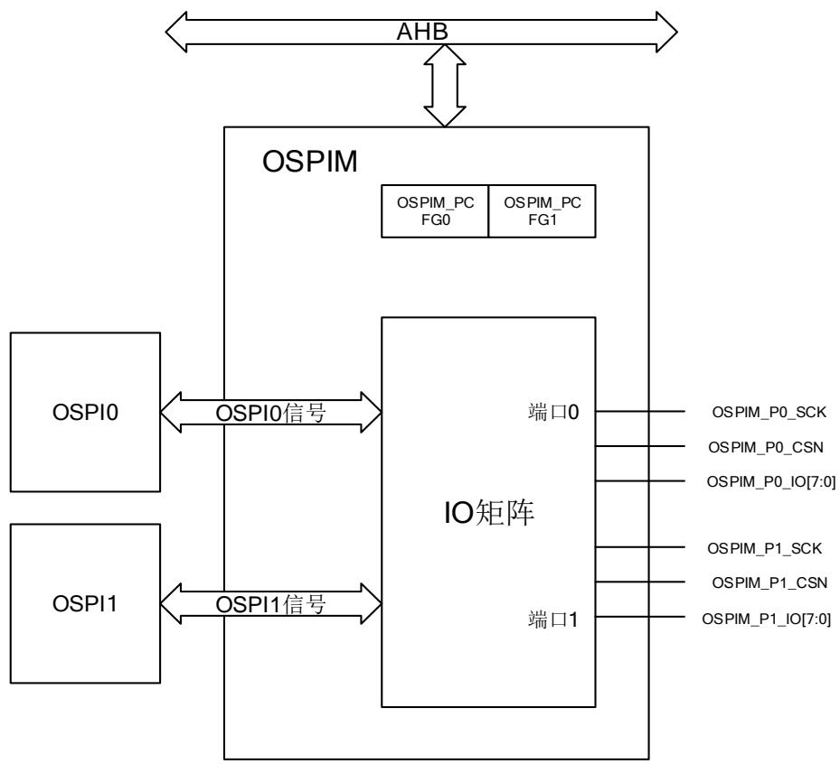

# 28. OSPI I/O 管理器（OSPIM）

# 28.1. 简介

OSPIM 支持对 OSPI 全 IO 矩阵引脚进行分配。

# 28.2. 主要特征

支持两个 SPI（单线，双线，四线或八线）接口。

支持两个端口进行引脚分配。

完全可编程 IO 矩阵，可按功能对引脚进行分配。

# 28.3. 功能说明

# 28.3.1. OSPIM 结构框图

# 28.3.2. OSPIM 矩阵

OSPIM 矩阵完全可编程，可按功能对引脚进行预映射，如 28-1. OSPIM 所示：

表 28-1. OSPIM 矩阵映射

<table><tr><td>引脚</td><td>映射</td></tr><tr><td>OSPIM_P0_SCK,OSPIM_P1_SCK</td><td>可独立映射到OSPI0_SCK或OSPI1_SCK</td></tr><tr><td>OSPIM_P0_CSN,OSPIM_P1_CSN</td><td>可独立映射到OSPI0_CSN或OSPI1_CSN</td></tr><tr><td>OSPIM_P0_IO[3:0],OSPIM_P0_IO[7:4],OSPIM_P1_IO[3:0],OSPIM_P1_IO[7:4]</td><td>可独立映射到OSPIM0_IO[3:0],OSPIM0_IO[7:4],OSPIM1_IO[3:0]或OSPIM1_IO[7:4]</td></tr></table>

默认情况下，OSPI0 和 OSPI1 的信号分别映射到端口 0 和端口 1。OSPIM 的端口 0 和端口 1可分别通过OSPIM_PCFGx寄存器进行独立配置。若OSPI被禁用，OSPIM矩阵必须被配置，防止总线中出现意外事务。

