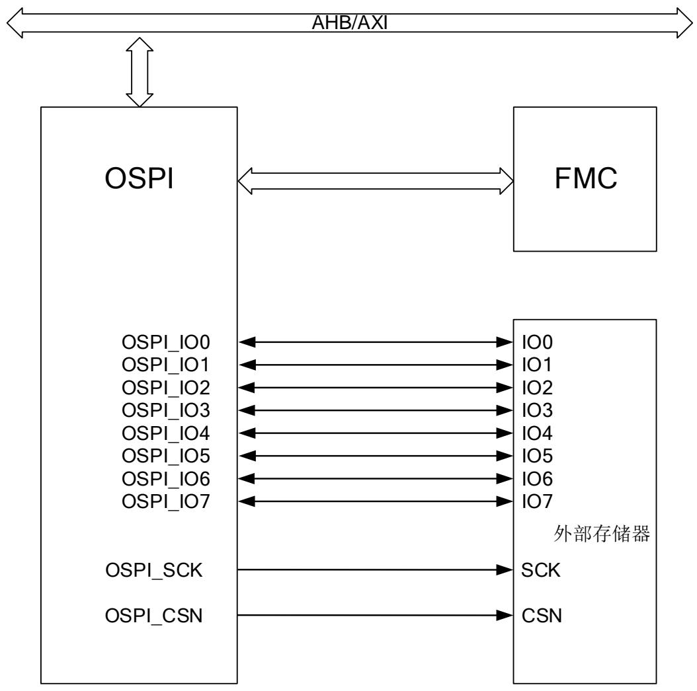
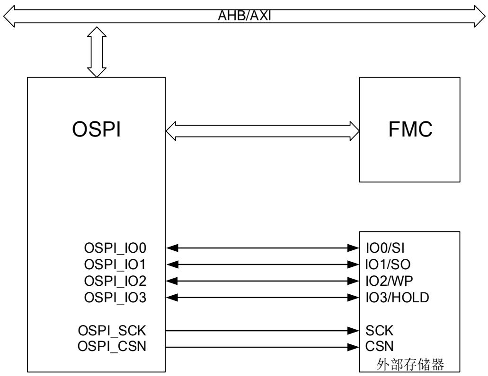
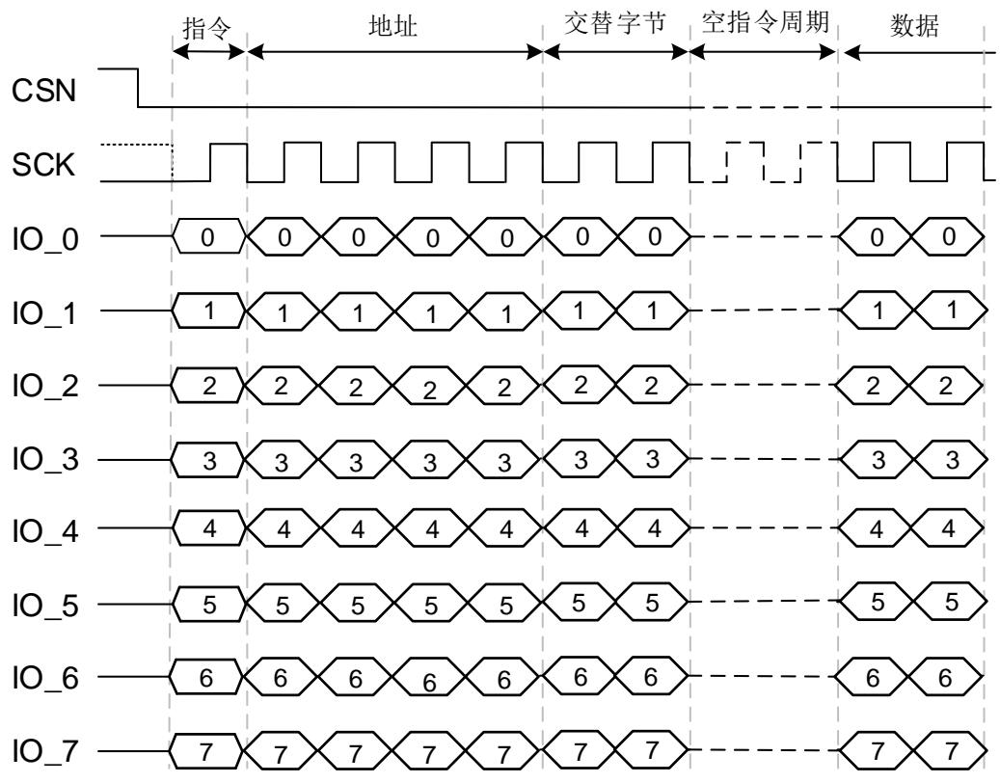
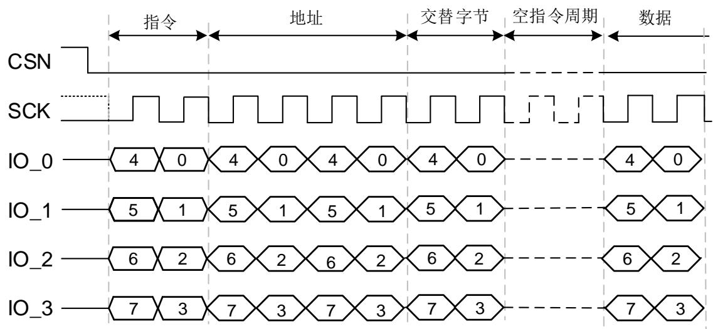
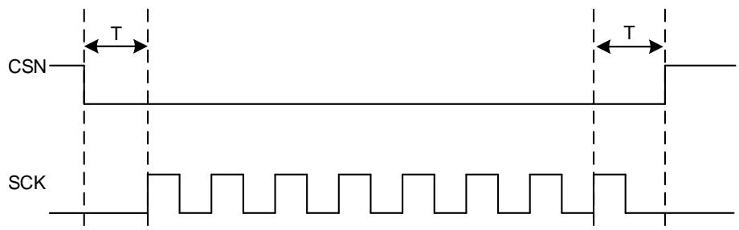

# 29. 八线 SPI 接口（OSPI）

# 29.1. 简介

OSPI是一种专用于和外部存储器通信的接口，支持单线，双线，四线和八线SPI模式。

# 29.2. 主要特征

# 三种模式：

间接模式：使用OSPI的寄存器执行所有操作。

状态轮询模式：周期性读取并检测外部存储器的状态寄存器值。

内存映射模式：外部存储器映射到MCU地址空间（OSPI0：0x9000 0000 - 0x9FFFFFFF，OSPI1：0x7000 0000- 0x 7FFF FFFF），和访问内部存储空间一样访问存储器。

支持内存映射模式下读；

支持单线、双线、四线和八线通信；

可用于间接模式和内存映射模式的完全可编程命令格式；

◼ 支持SDR（单倍数据速率）和DTR（双倍传输速率，仅支持读GD25LX512ME）；

接收和发送的FIFO功能；

允许8位、16位或32位数据访问；

间接模式支持DMA操作；

中断：FIFO达到阈值，状态匹配、传输完成、访问错误中断。

# 29.3. OSPI 功能描述

# 29.3.1. OSPI 结构框图

OSPI 引脚在下表中描述。

表 29-1. OSPI 信号线描述

<table><tr><td>引脚</td><td>方向</td><td>描述</td></tr><tr><td>CSN</td><td>O</td><td>片选输出(低电平有效)</td></tr><tr><td>SCK</td><td>O</td><td>时钟输出</td></tr><tr><td>IO0/SO</td><td>I/O</td><td>单线模式:数据输出双线模式:数据输入或输出。四线模式:数据输入或输出。八线模式:数据输入或输出。</td></tr><tr><td>IO1/SI</td><td>I/O</td><td>单线模式:数据输入。双线模式:数据输入或输出。四线模式:数据输入或输出。八线模式:数据输入或输出。</td></tr><tr><td>IO2</td><td>I/O</td><td>单线模式:输出模式并强制置“0”,连接外部存储器的WP 引脚,控制“写保护”功能。双线模式:输出模式并强制置“0”,连接外部存储器的WP 引脚,控制“写保护”功能。四线模式:数据输入或输出。八线模式:数据输入或输出。</td></tr><tr><td>IO3</td><td>I/O</td><td>单线模式:输出模式并强制置“1”,连接外部存储器的HOLD 引脚,控制“保持”功能。双线模式:输出模式并强制置“1”,连接外部存储器的HOLD 引脚,控制“保持”功能。四线模式:数据输入或输出。八线模式:数据输入或输出。</td></tr><tr><td>IO4</td><td>I/O</td><td>单线模式:输出模式并强制置“0”。双线模式:输出模式并强制置“0”。四线模式:输出模式并强制置“0”。八线模式:数据输入或输出。</td></tr><tr><td>IO5</td><td>I/O</td><td>单线模式:输出模式并强制置“0”。双线模式:输出模式并强制置“0”。四线模式:输出模式并强制置“0”。八线模式:数据输入或输出。</td></tr><tr><td>IO6</td><td>I/O</td><td>单线模式:输出模式并强制置“0”。双线模式:输出模式并强制置“0”。四线模式:输出模式并强制置“0”。八线模式:数据输入或输出。</td></tr><tr><td>IO7</td><td>I/O</td><td>单线模式:输出模式并强制置“0”。双线模式:输出模式并强制置“0”。四线模式:输出模式并强制置“0”。八线模式:数据输入或输出。</td></tr></table>

图 29-1. OSPI 八线通信模式结构框图

图 29-2. OSPI 四线通信模式结构框图

# 29.3.2. OSPI 常规命令模式

常规命令模式下，每个命令最多有五个阶段：指令阶段、地址阶段、交替字节阶段、空指令阶段、数据阶段。任一阶段都可以跳过，但是至少需要包含指令阶段、地址阶段、交替字节、数据阶段的其中一个阶段，这是由软件保证，硬件设计没有任何保护方法。另外，命令的高位始终占用高位信号线。

图 29-3. 八线模式 OSPI 命令格式

图 29-4. 四线模式 OSPI 命令格式

# 指令阶段

指令阶段，在OSPI_TCFG寄存器的INSSZ[1:0]位域配置需要发送的指令大小（8位，16位，24位或32位），在OSPI_INS寄存器中配置待发送给外部存储器的指令。OSPI_TCFG寄存器的IMOD[2:0]位域定义了指令阶段的模式（无指令，1线，2线，4线或者8线）。

当OSPI_CTL寄存器的FMOD[1:0]位域为0b11，则OSPI工作在内存映射模式下。在内存映射模式下，在OSPI_WINS寄存器中定义写入操作的指令，在OSPI_WTCFG寄存器配置指令的格式（大小，模式）。在OSPI_INS寄存器和OSPI_TCFG寄存器中配置读取操作指令以及指令的格

式。

# 地址阶段

地址阶段，在OSPI_TCFG寄存器的ADDRSZ[1:0]位域中定义待发送的地址大小（8位，16位，24位或32位），在OSPI_TCFG寄存器的ADDRMOD[2:0]位域中定义地址阶段的模式（无地址，1线，2线，4线或者8线）。将OSPI_TCFG寄存器的ADDRDTR位置1可使能DTR模式，则地址在时钟的每个边沿被发送。在间接模式和自动轮询模式下，在OSPI_ADDR寄存器中定义待发送的地址信息。

在内存映射模式下，待发送的地址由AXI（内核或者DMA）直接给出。在OSPI_WTCFG寄存器配置写入操作的地址格式（大小，模式以及是否开启DTR）。在OSPI_TCFG寄存器中配置读取操作的地址格式。

# 交替字节阶段

交替字节阶段，在OSPI_TCFG寄存器的ALTESZ[1:0]位域配置需要发送的交替字节大小（8位，16位，24位或32位），在OSPI_ALTE寄存器中配置待发送给外部存储器的交替字节。OSPI_TCFG寄存器的ALTEMOD[2:0]位域定义了指令阶段的模式（无交替字节，1线，2线，4线或者8线）。将OSPI_TCFG寄存器的ALTEDTR位置1可使能DTR模式，则交替字节在时钟的每个边沿被发送。

在内存映射模式下，在OSPI_WALTE寄存器中定义写入操作的交替字节，在OSPI_WTCFG寄存器配置交替字节的格式（大小，模式以及是否开启DTR）。在OSPI_ALTE寄存器和OSPI_TCFG寄存器中配置读取操作指令以及指令的格式。

# 空指令阶段

空指令阶段，在OSPI_TIMCFG寄存器的DUMYC[4:0]位域指定空指令的周期数（0到31个），这期间OSPI与外部存储器没有数据交互，为了等待外部存储器准备数据。

在内存映射模式下，在OSPI_WTIMCFG寄存器的DUMYC[4:0]位域指定写入操作的的空指令周期数，而读取操作的空指令周期数在OSPI_TIMCFG寄存器的DUMYC[4:0]位域指定。

# 注意：

1. 当OSPI工作在2线、4线或者8线模式下从外部存储器中接收数据时，至少设置一个空指令周期。

# 数据阶段

数据阶段，任意数量的字节可以在外部存储器和OSPI之间传输。OSPI_TCFG寄存器的DATAMOD[2:0]位域定义了数据阶段的模式（无数据，1线，2线，4线或者8线，其中无数据仅可用于间接写入模式）。将OSPI_TCFG寄存器的DADTR位置1可使能DTR模式，则数据在时钟的每个边沿被发送或接收。在间接模式下，OSPI_DTLEN寄存器定义了待接收或者待发送数据的字节数。在写操作时，需要发送的数据写入OSPI_DATA寄存器，在读操作时，接收数据从OSPI_DATA寄存器中获取。在自动轮询模式下，OSPI_DTLEN寄存器定义了待接收的字节数，接收数据从OSPI_DATA寄存器中获取。

在内存映射模式下，数据的传输通过AXI直接发送或接收自内核或DMA。传输的字节个数确定

AXI总线的访问操作，可以8位，16位或者32位读写访问，相应传输1个，2个，4个字节。在OSPI_WTCFG寄存器配置发送数据的格式（模式以及是否开启DTR）。在OSPI_TCFG寄存器中配置读取数据的格式。

# CSN 和 SCK 的行为

CSN默认为高电平，它在命令开始时拉低，结束时拉高。SCK是从内部SCK信号输出的一个闸信号，内部SCK信号是一直存在的。

CSN在第一个SCK有效上升沿的之前一个SCK时钟周期拉低，在最后一个SCK有效上升沿之后一个SCK时钟周期拉高。如 29-5. CSN SCK 所示：

图 29-5. CSN 和 SCK 的行为

# 29.4. 操作模式

# 29.4.1. 间接模式

在间接模式写操作时，要发送的数据写入到OSPI_DATA寄存器，读操作时，接收的数据从OSPI_DATA寄存器读取。

OSPI_DTLEN寄存器定义了需要传输的字节数。如果DTLEN = 0XFFFF_FFFF，数据的字节数被认为没有定义，传输会一直持续到MESZ定义的存储器大小的边界。如果DTLEN =0XFFFF_FFFF并且MESZ = 0x1F，传输会一直持续到OSPI关闭。

当传输数据的字节数达到DTLEN寄存器中设定的值时，传输完成标志TC会被置1。在没有定义传输长度情况下，在接受或者发送的字节数达到存储器大小时，TC会被置1。

如果TCIE和TC都被置1，则会产生中断，可以通过写TCC位为1清除。

# 常规模式下触发命令序列

命令序列在根据通信需求配置好最后信息之后立即开始。命令开始后，BUSY位置1。

当没有地址并且没有数据时，在访问OSPI_INS寄存器之后立即开始命令序列。

当存在地址但没有数据时，在访问OSPI_ADDR寄存器之后立即开始命令序列。

当在间接模式写操作时需要地址并且有数据，在访问OSPI_DATA寄存器之后立即开始命令序列。

# FIFO 和标志控制

32字节的FIFO用于传输数据。在间接模式写操作时，32位访问写入4字节，16位访问写入2字节，8位访问写入1个字节。

FIFO阈值由FTL定义，在间接模式读操作时，FIFO中的字节数等于或者超过定义的阈值时，FIFO阈值标志FT会被置1。在数据阶段完成后如果FIFO不为空，FT也会被置1。在间接模式写操作时，FIFO空的字节数超过阈值，FT会被置1。

如果FTIE和FT都被置1，会产生中断。如果OSPI DMA使能，DMA请求由FT产生，直到标志清除。

在间接模式读操作时，当FIFO变为满时，OSPI暂时停止SCK以避免溢出。读序列不能恢复直到FIFO中有大于等于4个字节为空。

# 29.4.2. 状态轮询模式

在状态轮询模式时，OSPI周期性的开始读命令，每帧最多读取4字节的数据，如果OSPI_DTLEN寄存器中定义的数据长度大于4，则忽略多余的长度仅读取4字节。接收的数据会按位屏蔽，并且与定义的数据内容比较，如果一个匹配发生，当SMIE置位时，会产生一个中断。

状态轮询访问和间接模式读序列一样，在周期性间隔时BUSY位保持高电平。

轮询匹配模式位SPMOD控制比较匹配的模式，如果SPMOD=0，与模式被选择。该模式下，只有在所有非屏蔽位都匹配时，状态匹配标志SM被置位。如果SPMOD=1，或模式被选择，该模式下，任何非屏蔽位只要有一位匹配，状态匹配标志SM被置位。

如果状态轮询停止位SPS被置位，当一个匹配被检测到，状态轮询停止，在数据阶段结束时BUSY位会被清除。

在状态轮询模式下，FIFO是禁用的，读状态的字节都存储在DATA寄存器中，存储的状态字节不会被MASK控制域影响。DATA寄存器的内容在数据阶段开始时会被更新。

如果FT位在数据阶段结束时被置位，这时候表示外部寄存器的状态字节被读取，当DATA寄存器被读取时，该位被清除。

在状态轮询模式下，必须将外部存储器配置为固定延迟模式。

# 29.4.3. 内存映射模式

在内存映射模式下，外部存储被当做内部存储来访问，最大访问地址为256MB，即使外部存储器大小大于256MB。

内存映射模式不允许地址超过MESZ定义的范围，即使MESZ范围在256MB范围内。如果该情况发生，AXI会产生错误。错误的影响取决于AXI主机。如果主机是CPU，会产生硬件错误中断，如果是DMA，传输错误中断产生，并且相应DMA通道会关闭。

在该模式下，字节，半字，字或者突发访问都可以支持。

本地执行（XIP）也可以支持，在完成最近一次访问后会继续将字节加载到地址。如果随后连续访问后续的字节，由于结果已经预取，这一系列访问操作将很快完成。否则，读序列会重新

开始，并且在开始之前CSN保持低电平。

FIFO为空后，OSPI进入保持状态，没有时钟输出，在此期间CSN保持低电平。在开始传输时，在CSN下降之前BUSY位会变为高电平。

# 29.5. OSPI 配置

# 29.5.1. OSPI 系统配置

OSPI系统配置的具体如下：

1. 通过FMOD[1:0]位域配置OSPI的工作模式。

2. 若OSPI工作在状态轮询模式，则需要配置SPMOD和SPS位选择轮询匹配模式和自动轮询模式的停止方式。

3. 通过配置FTL[4:0]位域，设置FIFO的阈值。

4. 若需要使用DMA，设置DMAEN位为1。在OSPI配置期间不得使能DMA通道，否则可能产生意外请求。

5. 如需使用中断，则可设置相关中断的使能位。

# 29.5.2. OSPI 器件配置

通过OSPI_DCFG0和OSPI_DCFG1寄存器配置OSPI与外部器件的相关参数，具体如下：

1. 通过设置DTYSEL[2:0]位域的值，配置外部存储器类型。

2. 通过设置MESZ[4:0]位域值，配置外部存储器的大小。

3. 通过设置CSHC[5:0]位域值，配置片选信号最短高电平时间。

4. 通过设置PSC[7:0]位域值，配置预分频系数。

# 29.5.3. OSPI常规命令模式配置

# 间接模式

当OSPI工作在间接模式时，具体配置如下：

1. 通过设置OSPI_DTLEN寄存器，配置数据长度。

2. 通过设置OSPI_TIMCFG寄存器，配置帧时序。

3. 通过设置OSPI_TCFG寄存器，配置帧格式。

4. 通过设置OSPI_INS寄存器，指定要发送到外部存储器的指令。

5. 通过设置OSPI_ALTE寄存器，指定在发送地址后立即发送到外部存储器的可选交替字节。

6. 通过设置OSPI_ADDR寄存器，指定要发送到外部存储器的地址。

7. 通过OSPI_DATA寄存器读取/写入数据。

# 状态标志轮询模式

当 OCTALSLPI 工作在状态标识轮询模式时，具体配置如下：

1. 通过设置OSPI_STATMK寄存器，指定对接收的状态字节进行屏蔽。

2. 通过设置OSPI_STATMATCH寄存器，指定与OSPI_STATMK寄存器比较的值。

3. 通过设置OSPI_INTERVAL寄存器，指定读取操作之间的时钟周期数。

4. 通过设置OSPI_DTLEN寄存器，配置数据长度。

5. 通过设置OSPI_TIMCFG寄存器，配置帧时序。

6. 通过设置OSPI_TCFG寄存器，配置帧格式。

7. 通过设置OSPI_INS寄存器，指定要发送到外部存储器的指令。

8. 通过设置OSPI_ALTE寄存器，指定在发送地址后立即发送到外部存储器的可选交替字节。

9. 通过设置OSPI_ADDR寄存器，指定要发送到外部存储器的地址。

# 内存映射模式

在内存映射模式下，外部存储被当做内部存储来访问。在内存映射模式下，对 OSPI 的配置需在首次访问存储器区域之前完成。具体配置如下：

1. 通过设置OSPI_TIMCFG寄存器，配置读取操作帧时序。

2. 通过设置OSPI_TCFG寄存器，配置读取操作帧格式。

3. 通过设置OSPI_INS寄存器，指定要发送到外部存储器的指令。

4. 通过设置OSPI_ALTE寄存器，指定在发送地址后立即发送到外部存储器的可选交替字节。

5. 通过设置OSPI_WTIMCFG寄存器，配置写操作帧时序。

6. 通过设置OSPI_WTCFG寄存器，配置写操作帧格式。

7. 通过设置OSPI_WINS寄存器，指定要发送到外部存储器的指令。

8. 通过设置OSPI_WALTE寄存器，指定在发送地址后立即发送到外部存储器的可选交替字节。

# 29.6. OSPI延迟数据采样

复位后，OSPI 在外部存储器驱动数据半个时钟周期之后对数据进行采样。配置 OSPI_TIMCFG寄存器的 SSAMPLE 位可以将数据采样移位半个时钟周期。当 DADTR 置 1 时，软件必须清除SSAMPLE 位。

# 29.7. 繁忙状态

OSPI开始操作外部存储器时，BUSY位置1。

在间接模式下，如果命令阶段结束且FIFO为空时，BUSY位清0。在状态标志轮询模式下，只有在发生匹配，BUSY位才会请零。

# 29.8. 错误管理

下列情况会产生错误：

在间接模式下，根据MESZ设置的外部存储器地址，向ADDR寄存器写入错误地址会产生TERR错误。

在间接模式下，如果ADDR寄存器的值加上DTLEN寄存器的值大于外部存储器的大小，一旦

OSPI被触发，TERR错误会产生。

在内存映射模式下，AXI超出范围的访问会返回AXI总线错误。

# 29.9. OSPI 中断

表 29-2. SPI 中断请求

<table><tr><td>标志</td><td>描述</td><td>清除</td><td>中断使能位</td></tr><tr><td>FT</td><td>FIFO阈值</td><td>硬件清除</td><td>FTIE</td></tr><tr><td>TC</td><td>传输完成</td><td>设置OSPI_STATC寄存器TCC位为1</td><td>TCIE</td></tr><tr><td>TERR</td><td>传输错误</td><td>设置OSPI_STATC寄存器TERRC位为1</td><td>TERRIE</td></tr><tr><td>SM</td><td>状态匹配</td><td>设置OSPI_STATC寄存器SMC位为1</td><td>SMIE</td></tr></table>

