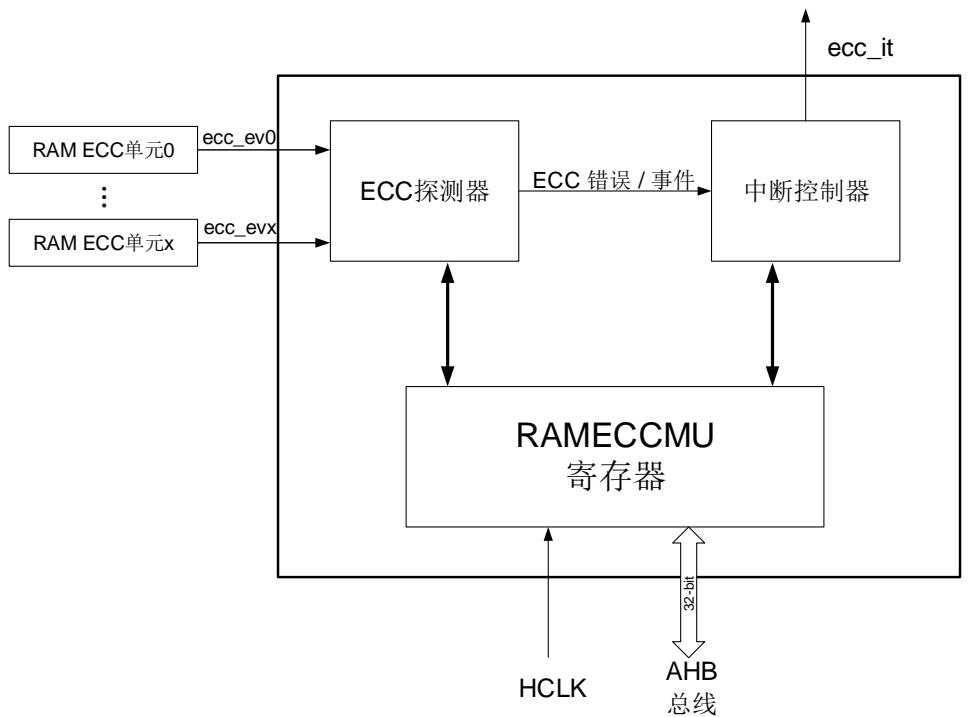

# 2. RAM ECC 监视器单元（RAMECCMU）

GD32H7xx 设备在 Region 0 和 Region 1 中 分 别具 有两个 RAM ECC 监视 器单 元（RAMECCMU）。它提供了一种方法来验证应用程序的 ECC 状态，并在发生错误时执行错误处理。

# 2.1. 主要特性

RAMECCMU 的主要特性如下：

每个Region都有RAM ECC监视器

RAM故障地址/数据识别

# 2.2. 功能描述

GD32H7xx 具有两个 RAMECC 监视器单元，分别安装在 Region 0 的 AHB3 和 Region 1 的AHB2 上。RAMECCMU 的块架构如 2-1. RAMECCMU 所示。

图 2-1. RAMECCMU 架构图

GD32H7xx 系列的两个 RAMECC 监视器单元的描述如 2-1. Region 0 RAMECCx $( x { = } 0 . 4 )$ 和 2-2. Region 1  RAMECC  x $( x = 0 . 2 )$ 所示。

表 2-1. Region 0 的 RAMECC 监视器单元 x $( x { = } 0 . 4 )$ ）

<table><tr><td>RAMECC监视器单元编号</td><td>RAMECC监视器状态</td></tr><tr><td>0</td><td>AXI SRAM ECC</td></tr><tr><td>1</td><td>ITCM-RAM ECC</td></tr><tr><td>2</td><td>DTCM-RAM ECC(D0TCM)</td></tr><tr><td>3</td><td>DTCM-RAM ECC(D1TCM)</td></tr><tr><td>4</td><td>RAM(ITCM/DTCM/AXI SRAM) ECC</td></tr></table>

表 2-2. Region 1 的 RAMECC 监视器单元 x（x=0..2）

<table><tr><td>RAMECC监视器单元编号</td><td>RAMECC监视器状态</td></tr><tr><td>0</td><td>SRAM0 ECC</td></tr><tr><td>1</td><td>SRAM1 ECC</td></tr><tr><td>2</td><td>Backup RAM(BKPSRAM) ECC</td></tr></table>

