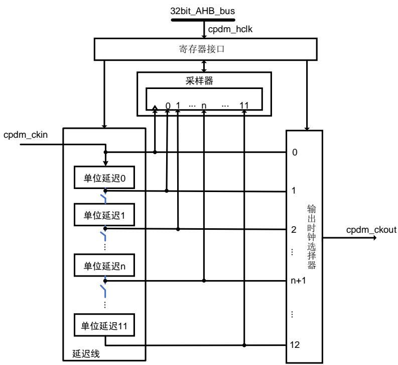
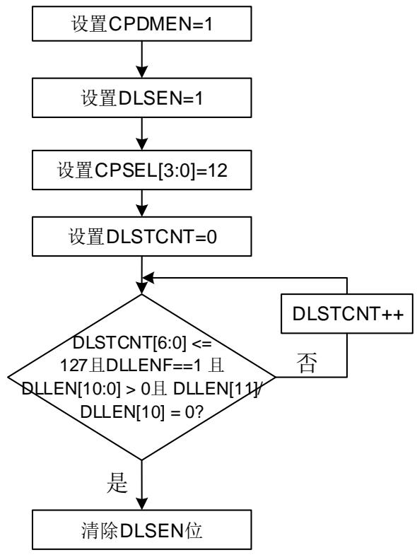
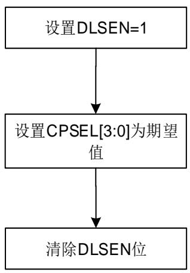

# 30. 时钟相位延迟模块（CPDM）

# 30.1. 简介

时钟相位延迟模块（CPDM）模块用于将输入时钟的相位延迟后再输出时钟。使用时，应用程序需要先对输出时钟的相位进行编程，再在其他外设中使用该输出时钟接收数据。

该延迟与电压和温度相关，当参数变化时，可能需要重新配置应用程序和重新确定输出时钟与接收数据之间的相位关系。

# 30.2. 主要特征

支持输入时钟的频率范围：25MHz ~ 208MHz。

支持多达12个输出时钟相位选择。

# 30.3. 功能说明

时钟相位延迟模式（CPDM）主要包括寄存器接口模块、延迟线模块、延迟线长度采样模块及输出时钟选择复用器等模块。延迟线模块用于产生单位延迟。

注意：

CPDM 仅在 SDIO 中使用，请参考 36-6. SDIO 。

图 30-1. CPDM 模块结构框图

# 注意：

cpdm_hclk：时钟相位延迟模块的寄存器接口时钟。

cpdm_ckin：时钟相位延迟模块的输入时钟。

cpdm_ckout：时钟相位延迟模块的输出时钟。

# 30.3.1. 概述

配置CPDM_CTL寄存器中的CPDMEN位可以使能CPDM模块。配置CPDM_CTL寄存器中的DLSEN位可以使能延迟线长度采样模块。

在对输入时钟移相之前，应将延迟线长度配置为一个输入时钟周期。当CPDM模块使能且延迟线长度采样模块使能（DLSEN = 1）时，通过配置CPDM_CFG寄存器中DLSTCNT[6:0]位域定义一个单位延迟单元的所需的延迟步长的数目。当延迟线长度采样模块使能（DLSEN = 1）时，长度采样器可以访问CPDM_CFG寄存器中的延迟线长度（DLLEN）和长度有效标志（DLLENF），因此可以通过使能长度采样器来配置延迟线长度。当延迟线长度采样模块禁能（DLSEN = 0）时，CPDM_CFG寄存器CPSEL位来选择输出时钟相位。

延迟线长度配置完成且延迟线长度采样模块禁能（DLSEN = 0）时，就可以通过时钟相位选择器最终输出经过移相的时钟。

◼ 当CPDMEN = 0且DLSEN = 0时，CPDM输出时钟使能，此时输出时钟为输入时钟。

当DLSEN = 1时，延迟线采样模块使能，CPDM输出时钟禁能。

当CPDMEN = 1且DLSEN = 0时，CPDM输出时钟使能，输出时钟相位由CPDM_CFG寄存器中CPSEL[3:0]位域配置决定。

注意：只有当DLSEN为1时才能更改单位延迟及输出时钟相位。

# 30.3.2. 操作流程

# 步骤一

配置输出时钟相位之前需要先配置延迟线长度。配置的延迟线长度应当覆盖一个完整的输入时钟周期。具体配置流程如 30-2. CPDM 。

图 30-2. CPDM 延迟线长度配置流程图

# 注意：

1.如果 DLLEN[10:0] > 0 且 DLLEN[11] / DLLEN[10] = 0，则将延迟线长度配置为一个输入时钟周期。

2.对于 N = 10~0，如果 DLLEN[N] = 1，则涵盖一个输入时钟周期的单位延迟数量为 N。

# 步骤二

当将延迟线长度配置为一个输入时钟周期后，可以在涵盖一个输入时钟周期的单位延迟 N 之间选择输出时钟相位，具体方法如 30-3. CPDM 。

图 30-3. CPDM 输出时钟相位配置流程图


