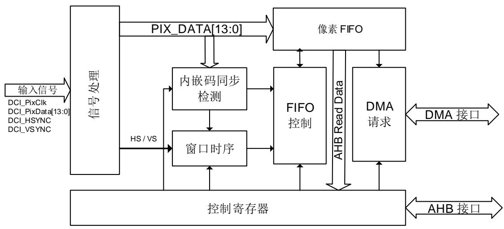
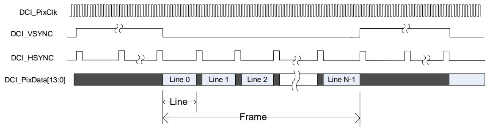
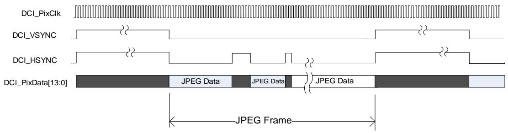

# 31. 数字摄像头接口（DCI）

# 31.1. 简介

数字摄像头接口是一个同步并行接口，可以从数字摄像头捕获视频和图像信息。它支持不同的颜色空间图像，例如YUV/RGB，以及压缩格式如JPEG。支持CCIR656视频解码器格式并执行额外的图像处理。

# 31.2. 主要特性

数字视频和图像的捕获；

支持8位、10位、12位或14位并行接口；

DMA高效传输；

支持视频和图像裁剪；

支持不同的像素数字编码格式，如YCbCr422/RGB565/YUV420/Bayer；

支持JPEG压缩格式；

支持内嵌码同步和硬件同步；

支持CCIR656视频接口和传统传感器接口。

# 31.3. 结构框图

数字摄像头接口包含以下模块：信号处理单元、像素FIFO、FIFO控制器、窗口时序发生器、内嵌码同步检测器、DMA接口和控制寄存器。

图 31-1. DCI 模块示意图

信号处理单元根据外部输入信号，产生有用的信号信息，为其他的内部模块所用。为确保信号处理单元工作正常，HCLK的频率要高于像素时钟频率的2.5倍。

内嵌码同步检测用于内嵌码同步模式。DCI使用内嵌码同步模式时，视频同步信息内嵌于像素数据，并无硬件水平或垂直同步信号（DCI_HSYNC或DCI_VSYNC）。DCI通过内嵌码同步检测器从像素数据提取同步信息，然后根据这些信息重新恢复水平和垂直同步信号。

窗口时序模块具有图片剪裁功能。该模块通过来自DCI接口或内嵌码同步检测器的同步信号计算像素点的位置，然后根据寄存器DCI_CWSPOS和DCI_CWSZ的配置决定是否接收该像素点数据。

DCI用一个4字（32位）FIFO缓存接收到的数据。如果DMA模式使能，当收到一个完整的32位数据的时候，DMA接口置位一个DMA请求。控制寄存器提供DCI和软件之间的接口。

# 31.4. 信号描述

表 31-1. DCI 引脚

<table><tr><td>方向</td><td>引脚名称</td><td>信号</td><td>位宽</td><td>描述</td></tr><tr><td>I</td><td>DCI_PIXCLK</td><td>DCI_PixClk</td><td>1</td><td>DCI 像素时钟</td></tr><tr><td>I</td><td>DCI_Dx</td><td>DCI_PixData</td><td>14</td><td>DCI 像素数据</td></tr><tr><td>I</td><td>DCI_HSYNC</td><td>DCI_HSYNC</td><td>1</td><td>DCI 水平同步</td></tr><tr><td>I</td><td>DCI_VSYNC</td><td>DCI_VSYNC</td><td>1</td><td>DCI 垂直同步</td></tr></table>

# 31.5. 功能描述

# 31.5.1. DCI 硬件同步模式

在DCI硬件同步模式（DCI_CTL寄存器的ESM为0），DCI_HSYNC和DCI_VSYNC分别用来表示一行的开始和一帧的开始。DCI在DCI_PixClk的上升沿或下降沿（时钟的极性通过DCI_CTL寄存器的CKS位配置），从DCI_PixData[13:0]，捕获像素数据。

图 31-2. 硬件同步模式

31-2. 假设DCI_HSYNC和DCI_VSYNC消隐期间的极性为高电平，所以DCI_PixData线仅在DCI_HSYNC和DCI_VSYNC都为低电平期间是有效的。

# JPEG 模式

DCI在硬件同步模式时，支持JPEG视频/图像压缩格式。在JPEG模式（DCI_CTL寄存器JM置1），DCI_VSYNC表示一帧的开始，DCI_HSYNC用作数据流有效信号。

图 31-3. 硬件同步模式之 JPEG 格式

# 31.5.2. 内嵌码同步模式

DCI支持内嵌码同步模式。这一模式仅用到DCI接口的DCI_PixData和DCI_PixClk信号，同步信息内嵌在像素数据中。通过置位DCI_CTL寄存器的ESM位，并且清除JM位，使能内嵌码同步模式。

在内嵌码同步模式，行和帧同步信息被编码为同步码并嵌入像素数据中。有4种同步码：行开始（LS），行结束（LE），帧开始（FS）和帧结束（FE）。该模式数据宽度强制为8，并且每个同步码由4字节序列组成：FF-00-00-XY，MN在DCI_SC寄存器定义。在内嵌码同步模式，0xFF和0x00不应出现在像素数据中以避免误解。

使能内嵌码同步模式之后，DCI开始检测同步码，并恢复行/帧同步信息。例如，如果DCI检测到一个帧结束码以及一个帧开始码，它开始捕获新的帧。

当检测到一个同步码，通过配置DCI_SCUMSK，可能仅需要比较FF_00_00_XY序列XY字节的几位。DCI仅比较DCI_SCUMSK寄存器的非屏蔽位。例如：DCI_SC寄存器的LS位为A5，DCI_SCUMSK的LSM位是F0，DCI将仅比较LS同步码的高4位，因此FF-00-00-A6也将被检测为LS码。

# 31.5.3. CCIR656 模式

# 隔行扫描模式

CCIR656标准使用嵌入式时序编解码来代替VSYNC和HSYNC信号。在CCIR656隔行模式下，仅使用PIXCLK和DCI_PixData[7:0]信号。SAV表示每个有效行的开头，EAV是每个有效行的结尾。在EAV和SAV码之间插入数字消隐。DCI解码嵌入式时序，根据场的信息，在软件中重新排列原始的YCbCr图像。

表 31-2. 典型的单行数据组成

<table><tr><td colspan="4">EAV码</td><td colspan="4">消隐数据</td><td colspan="4">SAV码</td><td colspan="4">有效数据</td></tr><tr><td>FF</td><td>0</td><td>0</td><td>XY</td><td>Cb</td><td>Y</td><td>Cr</td><td>V</td><td>FF</td><td>0</td><td>0</td><td>XY</td><td>Cb</td><td>Y</td><td>Cr</td><td>Y</td></tr><tr><td colspan="4">4字节</td><td colspan="4">280(268)字节</td><td colspan="4">4字节</td><td colspan="4">1440字节</td></tr></table>

EAV和SAV的4字节格式指定如下（以下以十六进制表示）：FF 00 00 XY

前三个字节是固定的，必须是FF 00 00，而第四个字节（XY）由字段和隐藏信息决定，其八位定义如下：1 F V H P3 P2 P1 P0。

F：标记场信息，发送偶数场时为0，发送奇数场时为1。

V：标记消隐信息，传输消隐数据时为1，传输有效视频数据时为0。

H：标记EAV或SAV，其中SAV为0，EAV为1

P0~P3为保护位，其值取决于F、H、V，起到校准的作用。计算方法如下：

表 31-3. SAV 和 EAV 编码

<table><tr><td>Bit 7</td><td>Bit 6</td><td>Bit 5</td><td>Bit 4</td><td>Bit 3</td><td>Bit 2</td><td>Bit 1</td><td>Bit 0</td></tr><tr><td>1</td><td>F</td><td>V</td><td>H</td><td>P3</td><td>P2</td><td>P1</td><td>P0</td></tr><tr><td>1</td><td>0</td><td>0</td><td>0</td><td>0</td><td>0</td><td>0</td><td>0</td></tr><tr><td>1</td><td>0</td><td>0</td><td>1</td><td>1</td><td>1</td><td>0</td><td>1</td></tr><tr><td>1</td><td>0</td><td>1</td><td>0</td><td>1</td><td>0</td><td>1</td><td>1</td></tr><tr><td>1</td><td>0</td><td>1</td><td>1</td><td>0</td><td>1</td><td>1</td><td>0</td></tr><tr><td>1</td><td>1</td><td>0</td><td>0</td><td>0</td><td>1</td><td>1</td><td>1</td></tr><tr><td>1</td><td>1</td><td>0</td><td>1</td><td>1</td><td>0</td><td>1</td><td>0</td></tr><tr><td>1</td><td>1</td><td>1</td><td>0</td><td>1</td><td>1</td><td>0</td><td>0</td></tr><tr><td>1</td><td>1</td><td>1</td><td>1</td><td>0</td><td>0</td><td>0</td><td>1</td></tr></table>

DCI解码并过滤掉数据流中的时序编码，恢复VSYNC和HSYNC信号以供内部使用，例如统计块控制。数据按顺序转发到数据接收端，无需重新排序，场0后跟场1。必须在软件中重新排序场以取回原始图像。

当场发生交替时，场变化中断标志（COFIF）将被置位。CCIR656标准图像一般为625/50 PAL或525/60 NTSC格式。图像由奇偶场、水平和垂直消隐和有效数据组成。一个字段由三个部分组成，顶部垂直消隐、有效数据和底部垂直消隐。

下表显示了PAL/NTSC系统中的帧信息。

表 31-4. 图像格式定义

<table><tr><td colspan="2">行数</td><td colspan="2">场/VBlk</td><td rowspan="2">线路说明</td></tr><tr><td>PAL</td><td>NTSC</td><td>F</td><td>V</td></tr><tr><td>22</td><td>19</td><td>0</td><td>1</td><td>场 0 顶部垂直消隐</td></tr><tr><td>288</td><td>240</td><td>0</td><td>0</td><td>场 0 有效数据</td></tr><tr><td>2</td><td>3</td><td>0</td><td>1</td><td>场 0 底部垂直消隐</td></tr><tr><td>23</td><td>20</td><td>1</td><td>1</td><td>场 1 顶部垂直消隐</td></tr><tr><td>288</td><td>240</td><td>1</td><td>0</td><td>场 1 有效数据</td></tr><tr><td>2</td><td>3</td><td>1</td><td>1</td><td>场 1 底部垂直消隐</td></tr><tr><td>625</td><td>525</td><td colspan="3"></td></tr></table>

# 逐行扫描模式

图像以逐行方式扫描和排列。此有效场为场1，DCI解码忽略SAV/EAV代码中的F位。

表 31-5. 逐行模式的一般情况

<table><tr><td>EAV</td><td>消隐</td><td>SAV</td><td>消隐</td><td rowspan="2">场1(F=1)</td></tr><tr><td colspan="4">⋮</td></tr><tr><td>EAV</td><td>消隐</td><td>SAV</td><td>消隐</td><td rowspan="4"></td></tr><tr><td>EAV</td><td>消隐</td><td>SAV</td><td>有效数据</td></tr><tr><td colspan="4">⋮</td></tr><tr><td>EAV</td><td>消隐</td><td>SAV</td><td>有效数据</td></tr></table>

在逐行扫描模式下，COFIF将被忽略，但VSIF可以产生中断。当VSYNC信号由摄像头传感器提供时，称为外部VSYNC模式，当从嵌入代码中解码VSIF标志位时，称为内部VSYNC模式。DCI可以执行内部和外部VSYNC模式。

# CCIR656 编码的纠错

根据CCIR编码算法，SAV和EAV中的保护位的编码方式允许1比特错误被纠正，或者2比特错误被解码器检测到。DCI中的隔行模式CCIR解码器支持此功能。

对于1比特错误情况，用户可以选择自动更正错误，或者简单地显示为状态标志。对于2比特错误情况，由于解码器无法进行更正，错误将仅显示为状态标志。

当CCIR错误中断被使能时（CCEIE置位），检测到错误时会产生中断。如果启用自动纠错（DCI_CTL寄存器中的AECEN置位），1比特错误将被自动纠正。如果启用2比特错误，则CCEIF错误标志位将置位。

# 31.5.4. 用快照或连续捕获模式捕获数据

DCI支持两种捕获模式：快照和连续捕获。捕获模式通过DCI_CTL寄存器的SNAP位配置。

正确配置之后，使能DCI并置位DCI_CTL寄存器的CAP位，DCI开始检测帧开始信号。一旦检测到帧开始信号，DCI开始捕获数据。在快照模式（SNAP=1），当一帧被捕获之后，DCI自动停止捕获并清除CAP位，而若在连续模 式，DCI将准备捕获下一帧。在连续模式，DCI捕获频率在FR[1:0]位域定义。如果FR[1:0]=00，DCI捕获每一帧，如果FR[1:0]=01，DCI将每隔一帧捕获一次。

在连续模式，当DCI正在捕获数据的时候，软件可以在任意时间清除CAP位，但DCI并不立即停止捕获。它总是在捕获当前帧之后停止。软件应读回CAP位，以确认是否DCI停止生效。

# 31.5.5. 窗口功能

DCI支持窗口功能，该功能能够从捕获到的帧剪裁图像的一部分。该功能通过设置DCI_CTL寄存器的WDEN位，在JPEG子模式使能该功能是禁止的。

在捕获期间，DCI不断的计数和计算像素的水平和垂直位置，并且将该位置与剪裁窗口寄存器（DCI_CWSPOS和DCI_CWSZ）的值进行比较，然后丢弃剪裁窗口外的像素数据，仅将位于窗口内的数据压入数据FIFO。

如果一帧已经结束，但DCI_CWSZ定义的垂直行数还没有到达，这种情况下也将触发帧结束标志并且DCI停止捕获。

# 31.5.6. 像素格式，数据填充和 DMA 接口

DCI支持包含YCbCr422/RGB565等多种像素编码格式，但是DCI只接收这些像素数据，将像素数据补充成全字，并将其压入像素FIFO。DCI不执行任何像素格式转换或数据处理，不关心像素格式细节。

DCI使用32位宽的数据缓冲器在DCI接口和像素FIFO之间传递数据。在这一模块有两种填充方法：字节填充和半字填充，具体使用哪一种取决于DCI接口的数据宽度。数据宽度由DCI_CTL寄存器的DCIF[1:0]配置，在JPEG子模式和内嵌码同步模式，数据宽度固定为8。

当收到一个完整的32位数据的时候，DMA接口发送DMA请求。

# 字节填充模式

如果DCI接口是8位，使用字节填充模式。在字节填充模式下，四个字节被填充到32位数据缓冲区，在Non-JPEG模式，如果数据缓冲区满或者到达行尾，DCI将压32位数据缓冲区的数据进入像素FIFO。在JPEG子模式，如果数据缓冲区满或者到达帧结束，DCI接口将压32位数据缓冲区的数据进入像素FIFO。

表 31-6. 字节填充模式下的存储视图

<table><tr><td>D3[7:0]</td><td>D2[7:0]</td><td>D1[7:0]</td><td>D0[7:0]</td></tr><tr><td>D7[7:0]</td><td>D6[7:0]</td><td>D5[7:0]</td><td>D4[7:0]</td></tr></table>

# 半字填充模式

如果DCI接口配置为10/12/14位，使用半字填充模式。在该模式下，通过高位填0，每像素数据扩展为16位。所以32位宽的数据缓冲区可以包含两个像素数据。当缓冲区满或行结束的时候，DCI将压数据进入像素FIFO。

表 31-7. 半字填充模式下的存储视图

<table><tr><td>2&#x27;b00</td><td>D1[13:0]</td><td>2&#x27;b00</td><td>D0[13:0]</td></tr><tr><td>2&#x27;b00</td><td>D3[13:0]</td><td>2&#x27;b00</td><td>D2[13:0]</td></tr><tr><td>2&#x27;b00</td><td>D5[13:0]</td><td>2&#x27;b00</td><td>D4[13:0]</td></tr><tr><td>2&#x27;b00</td><td>D7[13:0]</td><td>2&#x27;b00</td><td>D6[13:0]</td></tr></table>

# 31.6. 状态、错误和中断

DCI有几个状态和错误标志位，中断可以根据这些标志判断。如果使能DCI_INTEN的相应使能位，这些状态和错误标志触发DCI全局中断。这些标志可以通过写1到DCI_INTC寄存器清除。

表 31-8. 状态/错误标志

<table><tr><td>状态标志名</td><td>解释</td></tr><tr><td>CCEIF</td><td>CCIR 错误中断标志</td></tr><tr><td>COFIF</td><td>CCIR 场转换中断标志</td></tr><tr><td>F1IF</td><td>CCIR 场 1 中断标志</td></tr><tr><td>F0IF</td><td>CCIR 场 0 中断标志</td></tr><tr><td>ELF</td><td>行结束标志</td></tr><tr><td>EFF</td><td>帧结束标志</td></tr><tr><td>OVRF</td><td>FIFO 溢出标志</td></tr><tr><td>VSF</td><td>帧垂直同步消隐标志</td></tr><tr><td>ESEF</td><td>内嵌同步错误标志</td></tr></table>

