# 33. S/P 数字音频接口接收器（RSPDIF）

# 33.1. 简介

S/P数字音频接口接收器（RSPDIF）模块提供了接收及解码SPDIF音频数据流的功能。

# 33.2. 主要特征

支持IEC-60958和IEC-61937音频协议。

支持高达4路输入。

支持接收双缓冲功能。

双时钟域：用于寄存器接口的PCLK和用于其他部分的RSPDIF_CK。

支持最大符号率：12.88MHz。

支持8KHz到192KHz立体声。

支持自动符号率检测。

生成符号时钟。

检测接收的数据的奇偶校验位。

◼ 支持多种数据处理的方式，可以分别处理音频数据和用户通道信息或者一起处理。

支持分别使用DMA通信接收音频数据和用户通道信息。

支持中断功能。

# 33.3. 功能说明

# 33.3.1. RSPDIF 结构框图

S/P 数字音频接口接收器（RSPDIF）模块提供了接收及解码 SPDIF 音频数据流的功能。音频数据、信道状态（CS）和用户数据（U）均可通过 DMA接口接收。RSPDIF 收发器允许处理S/PDIF 通道状态（CS）和用户数据（U），并支持输入采样频率的精确测量。

图 33-1. RSPDIF 模块框图

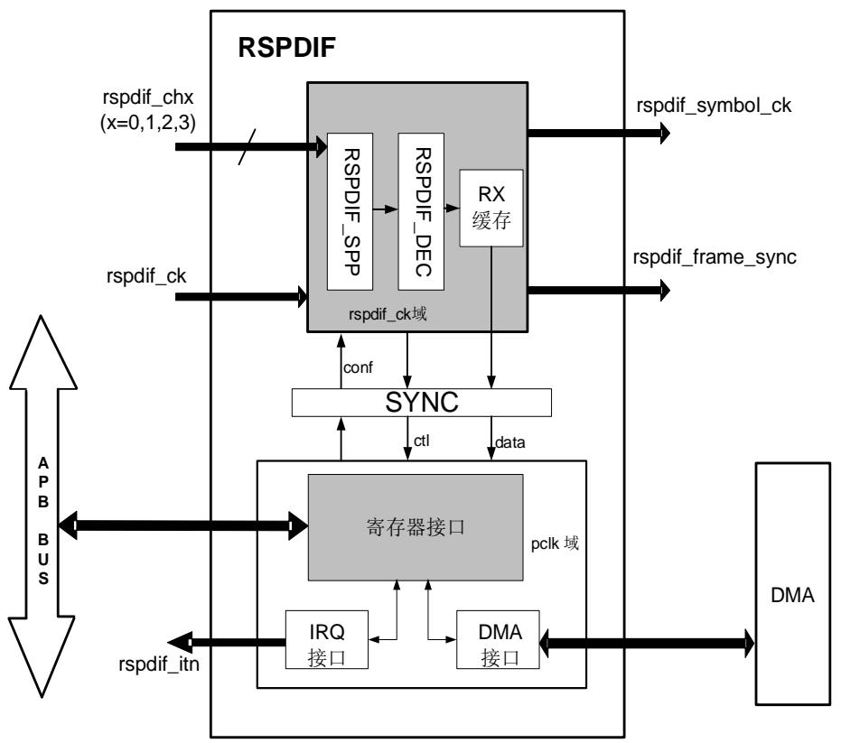

说明：

rspdif_frame_sync：RSPDIF 帧同步信号

rspdif_symbol_ck：RSPDIF 符号时钟

RSPDIF 模块负责解码从 RSPDIF_CH[3:0]接收到的 S/PDIF 流，用于接收符合 IEC-60958 和IEC-61937 标准的 S/P 音频数据。这些标准支持高采样率的简单立体声流，以及压缩的多声道环绕声。

RSPDIF 重新采样传入信号，解码曼彻斯特流，识别子帧，帧和块元素，并将解码后的数据和相关的状态标志传递给 RSPDIF 寄存器。RSPDIF 部分可以通过 APB 总线完全控制，并为用户信息和通道信息提供了专用路径，可以处理音频样本和通道、用户信息两个 DMA 通道。中断服务也可作为 DMA 的替代功能，用于发送错误信号或关键状态。

RSPDIF 解码传入的音频数据流时，还提供了两个信号：

rspdif_frame_sync：该信号频率等于帧速率，在RSPDIF每次检测到子帧报头时进行翻转，占空比为50%。

rspdif_symbol_ck：该信号频率等于符号速率。该信号可为系统内部组件提供驱动，如SAI端口，和外部组件，如A/Ds或D/ As，可通过相关寄存器提供时钟控制。具体生成条件请参考RSPDIF 。

# 33.3.2. S/PDIF 协议

S/PDIF（Sony/Philips Digital Interface）是一种数字音频互连，用于消费类音频设备在一定的短距离内输出音频。信号通过带有 RCA 连接器的同轴电缆或带有 TOSLINK 连接器的光纤电缆传输。S/PDIF 可用于连接家庭影院的组件和其他数字高保真系统。

S/PDIF 协议是一种数据链路层协议，也是一套物理层规范，用于通过光缆或电缆在设备和组件之间传输数字音频信号。该名称代表索尼/飞利浦数字互连格式，但也被称为索尼/飞利浦数字接口。索尼和飞利浦是 S/PDIF 的主要设计者。S/PDIF 符合 IEC 60958 标准。

# S/PDIF 块

一个S/PDIF块包含192帧，每帧包含2个子帧（左通道和右通道），即一个S/PDIF块包含384个子帧。每个子帧包含32位。块和子帧的数据格式如 33-1. 及 33-2. S/PDIF所示。

表 33-1. 子帧格式

<table><tr><td>比特位</td><td>描述</td></tr><tr><td>0~3</td><td>同步报头,有3种类型:B,M,W。M代表此时传送的是A通道(左声道),W代表此时传输的是B通道(右声道),而B比较特殊,代表此时传送的是A通道(左声道),并且是一个块的起始子帧。</td></tr><tr><td>4~27</td><td>以线性2的补码表示的音频样本数据。第27位总是最高位。当使用20位编码范围时,第8~27位为音频样本数据,第8位为最低位。</td></tr><tr><td>28</td><td>有效位“V”,表示数据是否有效</td></tr><tr><td>29</td><td>用户数据位“U”,用户自定义</td></tr><tr><td>30</td><td>通道状态位“C”</td></tr><tr><td>31</td><td>奇偶位“P”,携带一个奇偶校验位,使4到31位包含偶数个1和偶数个0。</td></tr></table>

图 33-2. S/PDIF 块及子帧格式

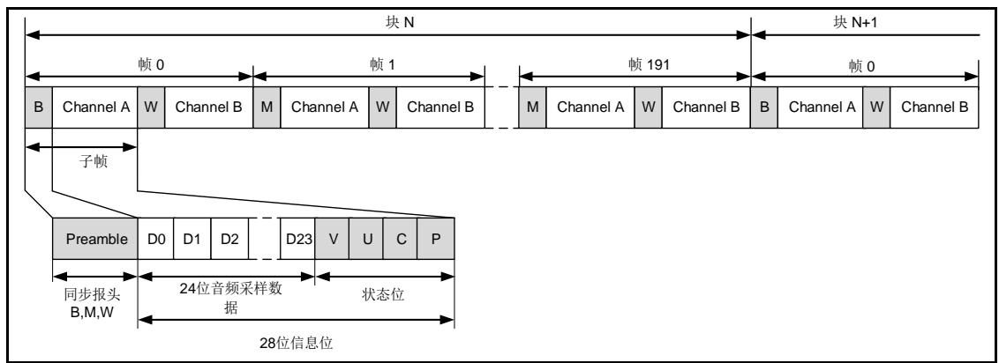

# 信息位编码

IEC60958 在传输数据时，位 4 到 31 使用双相符号编码（曼彻斯特协议）。其原理是使用一个两倍于传输位率的时钟频率做为基准，把原来一位数据拆成两份，每一个要传输的位用一个包含两个连续二进制状态的符号表示，当数据为 1 的时候，在其时钟周期内转变一次电位（0->1或 1->0）让数据变成两个不同电位，变成 10 或 01，而当数据为 0 则不转变电位，变成 11 或00。这些二进制状态在 IEC-60958 规范中称为“UI”（单位间隔）。

注意：信息位编码方式如下。符号表示由两个单位间隔组成的数据位。符号率表示 33-3.中位时钟的频率。RSPDIF模块使用的时钟频率是位时钟的两倍。24个数据位首

先传输LSB。

图 33-3. 信息位编码示例

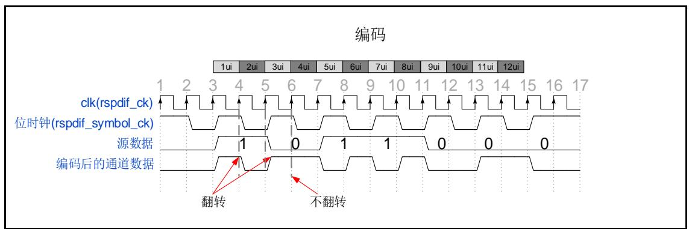

# 报头同步

根据前一个半比特值决定是否反转报头模式。这个前半比特值是在使能第一帧的第一个“B”报头启用传输之前的线路电平。对于其他报头，这个前半比特值是前一个子帧的奇偶校验位的第二个半比特。

报头模式B、M、W如 33-4. S/PDIF 及 33-2. 所示。

图 33-4. S/PDIF 报头

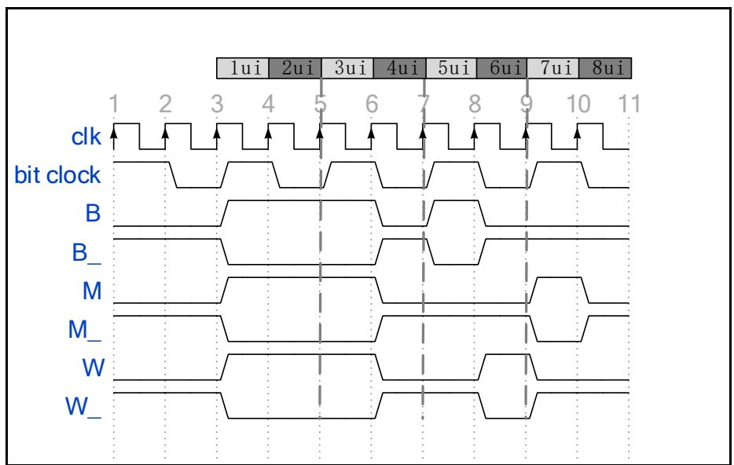

注意：编码数据时，转换应该发生在第二个UI的末尾。然而，转换可能在第二个UI结束时缺少报头。

表 33-2. 报头模式

<table><tr><td>预先状态(前一个半比特值)</td><td>0</td><td>1</td><td rowspan="2">描述</td></tr><tr><td>报头</td><td colspan="2">编码</td></tr><tr><td>B</td><td>11101000</td><td>00010111</td><td>通道A,且为一个块的起始子帧</td></tr><tr><td>W</td><td>11100100</td><td>00011011</td><td>通道B</td></tr><tr><td>M</td><td>11100010</td><td>00011101</td><td>通道A</td></tr></table>

# 33.3.3. RSPDIF

RSPDIF主要包括RSPDIF_SPP信号预处理和RSPDIF_DEC信号解码两部分，基于测量两个连续边缘之间的时间间隔来解码S/PDIF流。在S/PDIF流中可以找到三种时间间隔，如 33-3.RSPDIF 。

表 33-3. RSPDIF 时间间隔

<table><tr><td>时间间隔</td><td>描述</td></tr><tr><td>TL</td><td>长时间间隔,持续时间为3x UI,仅出现在报头中。</td></tr><tr><td>TM</td><td>中时间间隔,持续时间为2x UI,出现在一些报头或信息字段中。</td></tr><tr><td>TS</td><td>短时间间隔,持续时间为1x UI,出现在一些报头或信息字段中。</td></tr></table>

# RSPDIF_SPP

RSPDIF_SPP 信号预处理阶段主要完成噪声的滤波和上升/下降边缘的检测。

RSPDIF 共支持四个输入信号，配置 RSPDIF_CTL 寄存器中 RXCHSEL[2:0]选择需要的输入。在选定的 RSPDIF_CH 上接收到 S/PDIF 信号使用 rspdif_ck 时钟重新采样。为了消除毛刺，RSPDIF 采用了一个简单的滤波。

这是通过检测边缘转换的阶段来实现的。边缘转换检测时，当采样到序列0后面跟着两个1时，即检测到上升边沿。当采样到序列 1 后面跟着两个 0 时，即检测到下降边沿。在上升边沿之后，预计将出现下降边沿序列。在下降边沿之后，预计将出现上升边沿序列。

图 33-5. 噪声滤波及上升\下降边沿检测

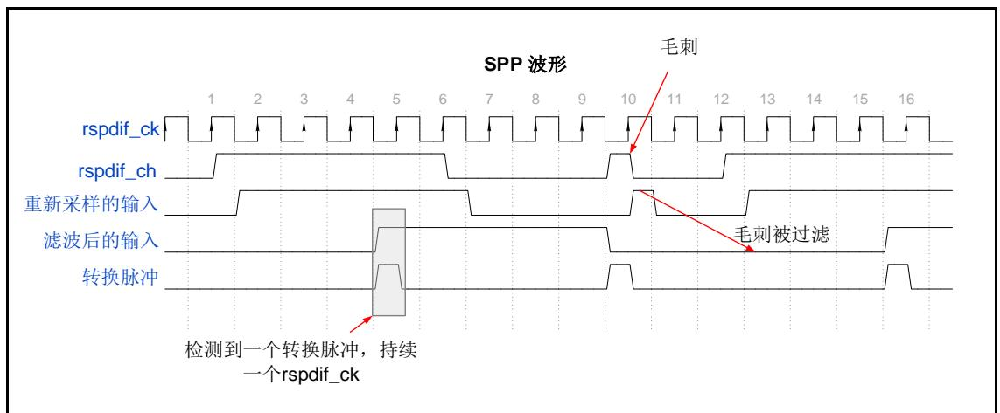

注意：转换脉冲是RSPDIF_DEC模块判断转换类型和正确解码输入位流的一个重要指标。

# RSPDIF_DEC

RSPDIF_DEC 模 块 检 测 报 头 类 型 并 解 码 信 息 位 ， 打 包 这 些 数 据 并 写 入 RX 缓存或RSPDIF_CHSTAT寄存器。RSPDIF_DEC模块可完成时间间隔估计，符号速率和同步的估计，块和子帧报头的检测，解码数据及连续跟踪符号速率等功能。

# TWCNT

RSPDIF_DEC 模块提供了一个 TWCNT 计数器，用于测量时间间隔持续时间。它由 rspdif_ck信号计时。在每一个转换脉冲上，计数器值被存储并且计数器被重置以重新开始计数。若两个转换之间的时间间隔过长，TWCNT 溢出时，RSPDIF 将停止工作，此时 RSPDIF_STAT 寄存器的 TMOUTERR 标志被置位。转换定时器就像看门狗定时器，在传入信号经过 70 个转换后产生一个触发，计算 70 个转换确保了一个比一个子帧更长一点的延迟。

图 33-6. TWCNT 波形

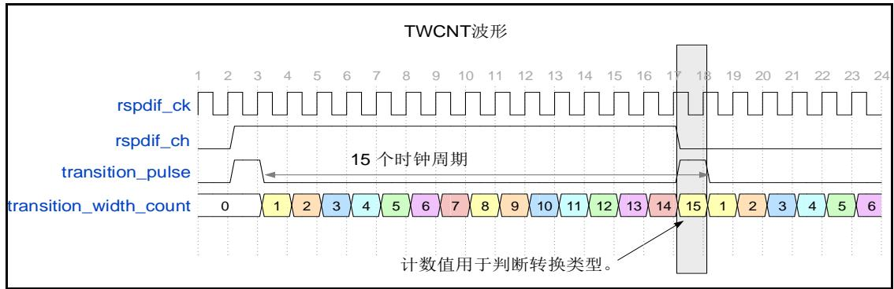

注意：存储的计数器值等于两个转换脉冲之间的实际时钟周期。例如，如 33-6. TWCNT所示，两个转换脉冲之间的时间间隔是15个rspdif_ck时钟周期，所以存储的数字是15（不是14!）这样就方便了CKCNT5、WIDTH24和WIDTH40的计算。在TWCNT设计中，计数器值被重置为1（不是0!）。

# SYNC

RSPDIF_DEC 模块提供了一个同步模块，具体请参考 RSPDIF 。同步阶段计算WIDTH24 和 WIDTH40，它们是计算用于判断转换类型的阈值的参考。WIDTH24 和 WIDTH40分别表示连续 24 个符号和 40 个符号的时间间隔时间。如上文所述，很明显：

$$
\mathrm{WIDTH24} = 4 8 \mathrm{UI} \rightarrow \mathrm{TL} _ {\mathrm{LO}} = 1. 5 \mathrm{UI} = \frac {\text {WIDTH24}}{3 2} \tag {33-1}
$$

$$
\mathrm{WIDTH40} = 8 0 \mathrm{UI} \rightarrow \mathrm{TH} _ {\mathrm{HI}} = 2. 5 \mathrm{UI} = \frac {\text {WIDTH40}}{3 2} \tag {33-2}
$$

THHI和 THLO是用于判断转换类型的阈值，这部分将在 DECODER 模块和 RSPDIF 同步过程的描述中详细介绍。WIDTH24 和 WIDTH40 也可以用来生成符号时钟，这将在 RSPDIF介绍。

此外，RSPDIF_STAT寄存器中CKCNT5用于估计S/PDIF符号率，也在SYNC阶段中计算。

# DECODER

RSPDIF_DEC 模块提供了一个解码器模块，具有转换编码器和报头检测器的功能。解码输出报头类型（PREF）、28 位信息位和状态位（C、U、V、P）。在 RSPDIF_CH 位流的解码器过程中，可生成一个恢复的符号时钟。解码器块从 TWCNT 计数器接收当前转换宽度，该块通过比较当前转换宽度与两个不同的阈值（THHI和 THLO）来编码当前转换宽度，具体如 33-4.转换编码器编码规则。

表 33-4. 转换编码器编码规则

<table><tr><td>转换宽度 TH</td><td>编码值</td><td>描述</td></tr><tr><td>TH &lt; (THLO - 1)</td><td>TS</td><td>接收的数据是数据位“1”的一半</td></tr><tr><td><eq>(TH_{LO} - 1) &lt; TH &lt; TH_{HI}</eq></td><td>TM</td><td>接收的数据为数据位“0”</td></tr><tr><td><eq>TH &gt; TH_{HI}</eq></td><td>TL</td><td>接收的数据为报头的长脉冲</td></tr><tr><td>其他</td><td>-</td><td>FRERR 置位</td></tr></table>

THHI和THLO的计算方法见 33-5. 。

表 33-5. 临界值计算

<table><tr><td>临界值</td><td>同步阶段</td></tr><tr><td><eq>TH_{LO}</eq></td><td>WIDTH24 / 32</td></tr><tr><td><eq>TH_{HI}</eq></td><td>WIDTH40 / 32</td></tr></table>

RSPDIF同步的详细信息请参见 33-7. 。

THLO理想情况下等于1.5个UI， ${ \mathsf { T H } } _ { \mathsf { H } }$ 等于2.5个UI。

# 报头检测器

解码器提供报头检测的功能，检查特定序列的四个连续转换，以确定它们是否构成报头部分。假设TRANS0、TRANS1、TRANS2和TRANS3代表上述编码的四个连续转换。这四个转换的值如 33-6. 所示。缺少这种模式表明这些转换不构成报头，而是构成子帧数据的一部分并且可用双相解码器解码。

表 33-6. 报头的转换序列

<table><tr><td>报头格式</td><td>双相编码数据</td><td>TRANS3</td><td>TRANS2</td><td>TRANS1</td><td>TRANS0</td></tr><tr><td>B</td><td>11101000</td><td>TL</td><td>TS</td><td>TS</td><td>TL</td></tr><tr><td>M</td><td>11100010</td><td>TL</td><td>TL</td><td>TS</td><td>TS</td></tr><tr><td>W</td><td>11100100</td><td>TL</td><td>TM</td><td>TS</td><td>TM</td></tr></table>

# 双相解码器

双相解码器使用由转换编码器及报头检测器提供的转换信息来解码输入的双相符号数据流。当报头已正确检测到后，双相解码器将解码接下来的数据信息，见 33-7. 。

表 33-7. 双相解码器解码规则

<table><tr><td>输入信息</td><td>解码值</td></tr><tr><td>TM</td><td>0</td></tr><tr><td>两个连续的 TS</td><td>1</td></tr><tr><td>其他</td><td>FRERR 置位</td></tr></table>

# 33.3.4. RSPDIF 同步过程

当将RSPDIF_CTL寄存器中RXCFG[1:0]设置为2'b01或2'b11时，同步阶段开始。如果设置RSPDIF_CTL寄存器的位WFRXA为1，则在同步之前，RSPDIF将首先检测选定的RSPDIF_CH线的活动。仅当选定的RSPDIF_CH线上检测到四个转换时，才切换至同步阶段。该功能能有效避免同步错误。同步流程如 33-7. 所示。该功能在RSPDIF_DEC模块中实现。

同步阶段在 RSPDIF 正确解码后，计算得到精确的同步阈值。当 RSPDIF 能够正确测量 24 和

40 个连续符号的持续时间时，同步阶段完成，阈值就会更新，标志 SYNDO 被设置为 1。

RSPDIF_CH 线上可能存在干扰，可能会发生同步过程没有正确执行的情况。RSPDIF 提供了在同步之前可设置同步重试次数（MAXRT）的功能。直到到达设置的 MAXRT 次数，同步还未正确执行，SYNERR 错误标志置位。如果 RSPDIF_CH 线上没有有效的 SPDIF 数据流，TWCNT 溢出，TMOUTERR 错误标志置位。

同步完成后，当检测到下一个报头“B”，RSPDIF 开始接收通道状态（C）和用户数据（U）（见33-11. / ）。用户通过 RSPDIF_CHSTAT 寄存器读取，并根据读取到的 C和 U，配置 RXDF[1:0]和 RXSTEOMEN 位。

注意：当 RXCFG[1:0] = 2'b11 时，对 RXDF[1:0]和 RXSTEOMEN 位的修改无效。可参考33-9.  RSPDIF  RSPDIF_CTL 。

图 33-7. 同步流程图

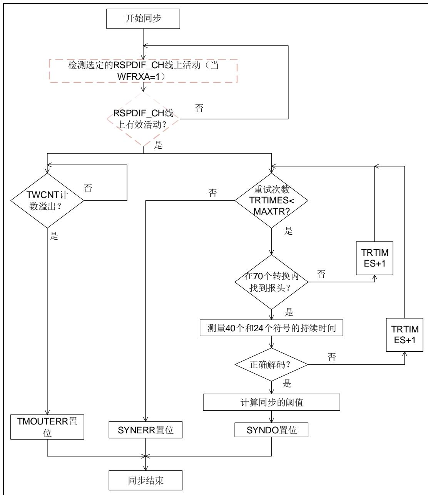

图 33-8. 同步过程时序

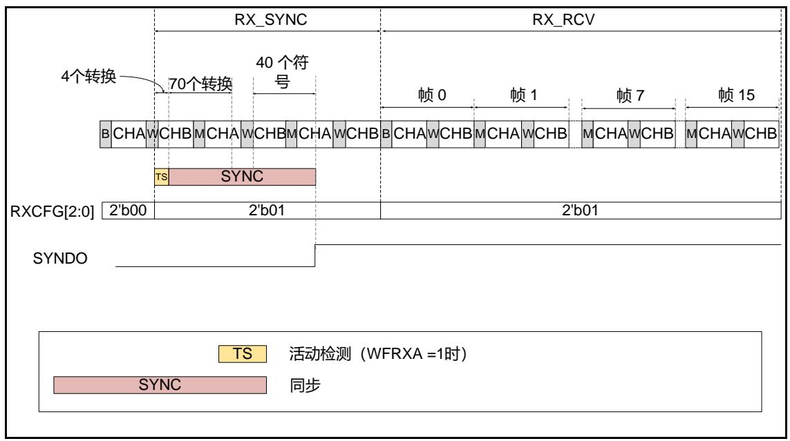

# 33.3.5. RSPDIF 状态机

RSPDIF状态机包括以下状态，如 33-8. RSPDIF 。

表 33-8. RSPDIF 状态

<table><tr><td>RSPDIF 状态</td><td>描述</td></tr><tr><td>RX_IDLE</td><td>空闲状态,此时 RSPDIF 禁能,rspdif_ck 域复位,rspdif_pclk 域功能正常。</td></tr><tr><td>RX_SYNC</td><td>同步状态,RSPDIF 与数据流同步,阈值定期更新,可以通过中断或DMA 获取用户数据和通道状态。</td></tr><tr><td>RX_RCV</td><td>接收状态:RSPDIF 与数据流同步,阈值定期更新,可以通过中断或DMA 通道获取用户,通道状态和音频数据。当 RXCFG[1:0]转为 2&#x27;b11时,RSPDIF 在开始保存音频数据之前等待“B”报头。</td></tr><tr><td>RX_STOP</td><td>停止状态:RSPDIF 不再同步,用户和通道状态和音频数据接收停止。</td></tr></table>

33-9. RSPDIF 显示了RSPDIF状态之间如何转换。

图 33-9. RSPDIF 状态机

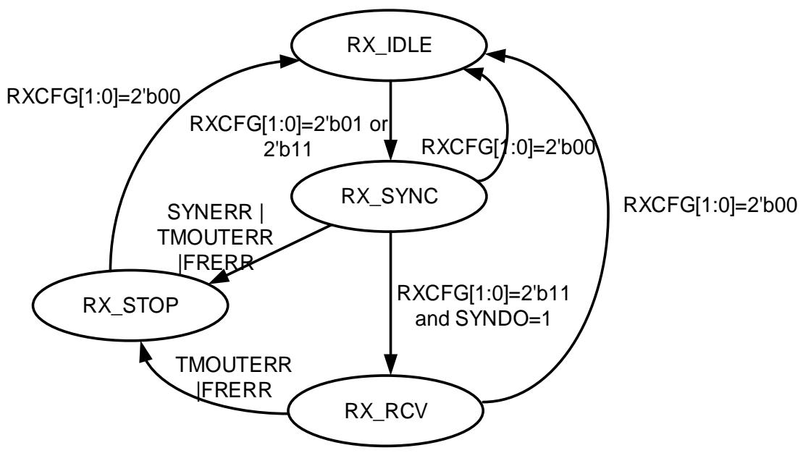

# RX_IDLE

状态机将从以下条件进入RX_IDLE状态：

设置 RXCFG[1:0]为 2’b00。

RX_SYNC 时，设置 RXCFG[1:0]为 2’b00。

RX_RCV 时，设置 RXCFG[1:0]为 2’b00。

RX_STOP 时，设置 RXCFG[1:0]为 2’b00。

RX_IDLE 的下一个状态是：

◼ RX_SYNC：设置 RXCFG[1:0]为 2’b01 或 2’b11。

注意：软件可以在任何时候将 RXCFG[1:0]设置为 0，RSPDIF 立即返回 RX_IDLE 状态。如果DMA传输正在进行中，它将等待 DMA 传输完成。

# RX_SYNC

状态机将从以下条件进入RX_SYNC状态：

RX_IDLE 时，设置 RXCFG[1:0]为 2’b01 或 2’b11。

RX_SYNC 的下一个状态是：

RX_IDLE：设置 RXCFG[1:0]为 2’b00。

◼ RX_RCV：设置 RXCFG[1:0]为 2’b11 且同步成功完成 SYNDO = 1。

RX_STOP：同步失败（若设置了同步重试次数，也已经达到设置的最大值）或者接收到的数据没有正确被解码（FRERR 或 SYNERR 或 TMOUTERR = 1）。

注意：当同步阶段完成时，如果 RXCFG[1:0] = 2’b01，外设仍然处于这个状态。

# RX_RCV

状态机将从以下条件进入RX_RCV状态：

RX_SYNC 时，设置 RXCFG[1:0]为 2’b11 且同步成功完成 SYNDO = 1。

RX_RCV的下一个状态是：

RX_IDLE：设置 RXCFG[1:0]为 2’b00。

RX_STOP：接收到的数据没有正确被解码（FRERR 或 TMOUTERR = 1）。

# RX_STOP

状态机将从以下条件进入RX_STOP状态：

RX_SYNC 时，同步失败（若设置了同步重试次数，也已经达到设置的最大值）或者接收到的数据没有正确被解码（FRERR 或 SYNERR 或 TMOUTERR = 1）。

◼ RX_RCV 时，接收到的数据没有正确被解码（FRERR 或 TMOUTERR = 1）。

RX_STOP 的下一个状态是：

RX_IDLE：设置 RXCFG[1:0]为 2’b00。

注意：当 RXCFG[1:0]设置为 0 时，硬件 IP关闭，即复位所有状态机，并刷新 RX缓存。标志FRERR, SYNERR 和 TMOUTERR 被重置。

# 不同状态下 RSPDIF_CTL寄存器访问权限

在RSPDIF状态机的不同的状态阶段，对RSPDIF_CTL寄存器的不同位域的访问权限不同，具体请参考 33-9. RSPDIF RSPDIF_CTL 。硬件这样处理，可以避免对RSPDIF_CTL寄存器的错误配置。请注意，即使在RSPDIF任何状态下，都可以修改PTNCPEN\CUNCPEN\VNCPEN\PNCPEN位，但这些修改不会影响已经保存到DATA寄存器中的值了。

表 33-9. 不同 RSPDIF 状态下 RSPDIF_CTL 比特位访问特性

<table><tr><td>RSPDIF 状态</td><td>RXCHSEL[2:0]</td><td>WFRXA</td><td>MAXRT[1:0]</td><td>CFCHSEL</td><td>DMACBEN</td><td>PTNCPEN</td><td>CUNCPEN</td><td>VNCPEN</td><td>PNCPEN</td><td>RXDF[1:0]</td><td>RXSTEOMEN</td><td>DMAREN</td></tr><tr><td>RX_IDLE(RXCFG[1:0] = 2'b00)</td><td>rw</td><td>rw</td><td>rw</td><td>rw</td><td>rw</td><td>rw</td><td>rw</td><td>rw</td><td>rw</td><td>rw</td><td>rw</td><td>rw</td></tr><tr><td>RX_SYNC(RXCFG[1:0] = 2'b01)</td><td>r</td><td>r</td><td>r</td><td>r</td><td>rw</td><td>rw</td><td>rw</td><td>rw</td><td>rw</td><td>rw</td><td>rw</td><td>rw</td></tr><tr><td>RX_REV(RXCFG[1:0] =2'b11)</td><td>r</td><td>r</td><td>r</td><td>r</td><td>rw</td><td>rw</td><td>rw</td><td>rw</td><td>rw</td><td>r</td><td>r</td><td>rw</td></tr></table>

# 33.3.6. RSPDIF 数据接收管理

# RSPDIF 数据双缓冲区

RSPDIF实现了数据接收时的双缓冲功能。数据接收双缓冲区由一个32位的RX缓存和RSPDIF_DATA寄存器构成。当RSPDIF_DATA寄存器为空且已检测到奇偶校验位（P）和下一个报头之间的转换时，RX缓存中的数据将立即转移到RSPDIF_DATA寄存器中。

数据的双缓冲区机制提高了对延迟的容忍度，现允许的最大延迟是TSAMPLE - 2Tpclk - 2Trspdif_ck（TSAMPLE为所接收的立体声音频样本的音频采样率，TPCLK为rspdif_pclk时钟的周期，Trspdif_ck为rspdif_ck时钟的周期。）

软件可以通过读RSPDIF_DATA寄存器或者DMA方式获取接收到的数据。推荐DMA操作，详细请参阅DMA 。

# RSPDIF_DATA 寄存器

除V，U，C，P状态位，和报头，每个子帧最多包括24位的数据。RSPDIF_DATA寄存器根据RSPDIF_CTL寄存器中RXDF[1:0]的值不同，有三种格式，可对接收到的音频数据流有三种处理方式：

当 RXDF[1:0] = 2’b00 时，数据寄存器的格式为 RSPDIF_DATA_F0 所描述的格式，强制数据右对齐，PREF\C\U\V\P位可根据需要启动或者强制为 0。

当 RXDF[1:0] = 2’b01 时，数据寄存器的格式为 RSPDIF_DATA_F1 所描述的格式，强制数据左对齐，PREF\C\U\V\P位可根据需要启动或者强制为 0。

当RXDF[1:0] = 2’b11时，数据寄存器的格式为RSPDIF_DATA_F2所描述的格式。该格式在 非 线 性 模 式 下 ， 每 个 子 帧 仅 使 用16位 。 两 个 连 续 子 帧 的 数 据 将 存 放 在 一 个RSPDIF_DATA寄存器中。该格式PREF\C\U\V\P位和数据位不能混合，但软件仍可以通过读取RSPDIF_CHSTAT寄存器或者专用的DMA通道获取。当RXSTEOMEN = 1时，没有不对齐的风险（即来自通道A的数据总是存储在RSPDIF_DATA[31:16]中）。如果RXSTEOMEN = 0，则存在超量情况下的错位风险。在这种情况下，RSPDIF_DATA[31:16]总是包含最老的值，而RSPDIF_DATA[15:0]总是包含最近的值（如 33-12. RSPDIFRXSTEOMEN = 0 RXDF[1:0] = 2’b0x 和 33-13. RSPDIFRXSTEOMEN = 0 RXDF[1:0] = 2’b10 。所示）。

注意：本文档描述了3个数据寄存器：RSPDIF_DATA_Fx（x = 0,1,2），但实际上只有一个物理数据寄存器。

图 33-10. RSPDIF_DATA 寄存器格式

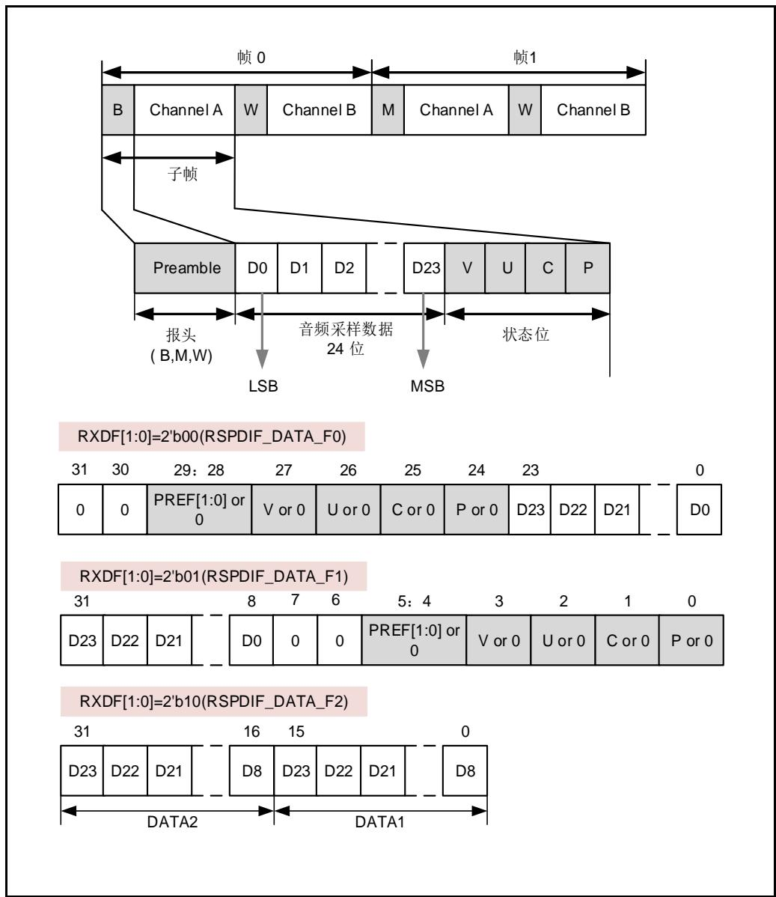

# RSPDIF 特定控制流

RSPDIF提供了接收用户数据U和信道状态C的专用通道。通过配置RSPDIF_CTL寄存器中CFCHSEL位，可需选择信道状态位C时从通道A还是通道B中获取。当RXCFG[1:0]设置为2'b01或2'b11时，同步阶段结束后开始采集。当接收到8个信道状态位和16个用户数据位时，将它们打包存储到RSPDIF_CHSTAT寄存器中。若配置RSPDIF_CTL寄存器DMACBEN位为1，使能了控制流的DMA功能，则触发一个DMA请求。如果CHS[0]是新块的第一个状态位，则SOB位设为1。请参考 RSPDIF_CHSTAT 。

图 33-11. 通道/用户数据格式

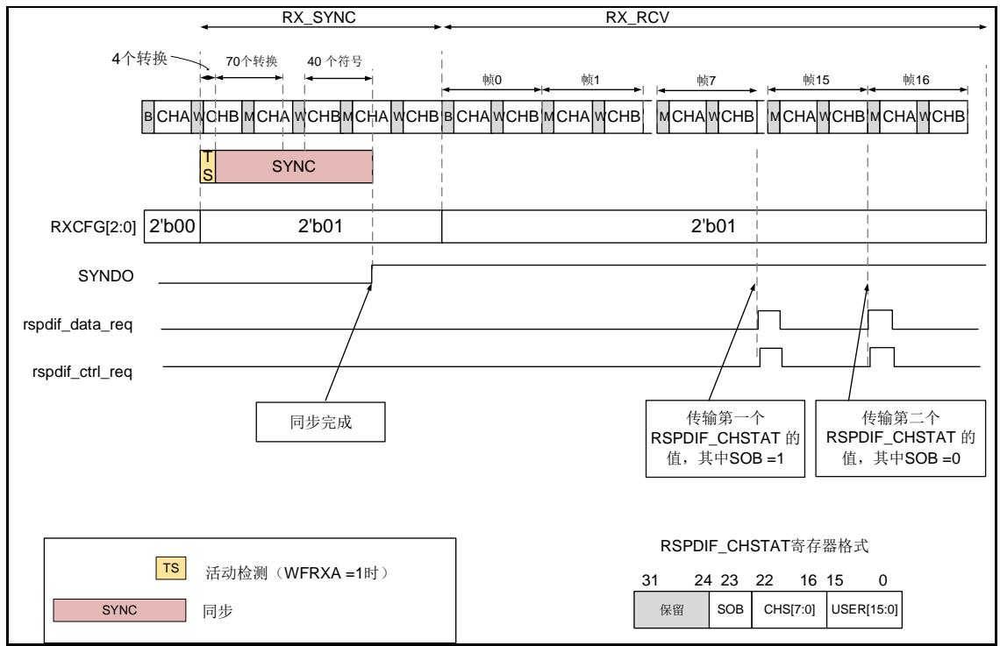

# 混合数据和控制流

当 RXDF[1:0] = 2’b00 或 2’b01 时 ， RSPDIF_DATA 寄 存 器 格 式 为 RSPDIF_DATA_F0 或RSPDIF_DATA_F1，该格式允许对V，U，C，P状态位，报头和数据混合接收管理。通过配置RSPDIF_CTL寄存器，用户可以灵活选择将V，U，C，P状态位，报头的哪些内容保存到RSPDIF_DATA寄存器中，如 33-10. 。

表 33-10. 混合数据和控制流

<table><tr><td>位域</td><td>值</td><td>描述</td></tr><tr><td rowspan="2">PNCPEN</td><td>1</td><td>奇偶校验错误信息被屏蔽(设置为0)</td></tr><tr><td>0</td><td>奇偶校验错误信息被复制到RSPDIF_DATA中</td></tr><tr><td rowspan="2">VNCPEN</td><td>1</td><td>有效性信息被屏蔽</td></tr><tr><td>0</td><td>有效性信息被复制到RSPDIF_DATA中</td></tr><tr><td rowspan="2">CUNCPEN</td><td>1</td><td>通道和用户信息被屏蔽</td></tr><tr><td>0</td><td>通道和用户信息被复制到RSPDIF_DATA中</td></tr><tr><td rowspan="2">PTNCPEN</td><td>1</td><td>报头类型被屏蔽</td></tr><tr><td>0</td><td>报头类型被复制到RSPDIF_DATA中</td></tr></table>

# 33.3.7. RSPDIF 时钟管理

由RSPDIF框图 33-1. RSPDIF 可知，RSPDIF块需要用于寄存器接口rspdif_pclk时钟和用于RSPDIF DEC模块的rspdif_ck时钟。rspdif_ck不应该是锁相的，在SYNC块中，所有穿过这些时钟域的信号都被重新同步。

为了正确解码传入的S/PDIF流，解码rspdif_ck时钟应至少高于最大符号率11倍或高于音频采样率704倍的时钟重新采样所接收的数据。例如，如果音频速率为192KHz，则符号率为12.288MHz（音频速率*通道数*子帧位数），则至少需要135.2MHz的解码时钟（符号率*11）。

对于rspdif_pclk，rspdif_pclk不能小于符号速率。

表 33-11. 最小 rspdif_ck 频率与音频采样率

<table><tr><td>符号率</td><td>最小 rspdif_ck 频率</td><td>音频</td></tr><tr><td>3.072 MHz</td><td>33.8 MHz</td><td>48 kHz 数据流</td></tr><tr><td>6.144 MHz</td><td>67.6 MHz</td><td>96 kHz 数据流</td></tr><tr><td>12.288 MHz</td><td>135.2 MHz</td><td>192 kHz 数据流</td></tr></table>

在RSPDIF模块中，

RSPDIF_DEC：解码器被设计解码输入RSPDIF输入位流。当RSPDIF未使能时，解码器模块的时钟被门控。该模块的时钟源是rspdif_ck。

# RSPDIF 符号时钟

RSPDIF在 解 码 时 ， 使 用WIDTH24、WIDTH40和 符 号 边 界 的 值 构 建 了 一 个 符 号 时 钟rspdif_symbol_ck。它可以用作其他音频设备（如SAI或I2S）的参考内核时钟，可用于RSPDIF到I2S桥接功能。

在接收子帧同步报头时，WIDTH24和WIDTH40值构建了符号时钟的下降沿和上升沿。当RSPDIF为RX_STOP或RX_IDLE时，WIDTH24和WIDTH40也被用于生成符号时钟。在接收子帧时，RSPDIF使用符号边界生成上升边沿，WIDTH24和WIDTH40值生成下降边沿，符号时钟的占空比接近50%。但是，当RSPDIF从用WIDTH24和WIDTH40生成符号时钟转换到由符号边界生成符号时钟时，符号时钟占空比可以改变，反之亦然。符号时钟生成模式发生转换时或使用rspdif_ck时钟对S/PDIF信号的重新采样时，符号时钟可能会产生大幅抖动。

配置RSPDIF_CTL寄存器中SCKEN位可使能或禁能符号时钟的生成。配置RSPDIF_CTL寄存器中BKSCKEN位可使能或禁能备份符号时钟的生成。但是，当标志SYNERR置位时，符号时钟和备份时钟都不能生成，因为同步出错。当SCKEN和BKSCKEN都设置为1时，当RSPDIF从RX_SYNC或RX_RCV切换到RX_STOP或RX_IDLE时，符号时钟将失去一些转换。符号时钟的具体生成条件请参考 33-12. spdif_symbol_ck 。

表 33-12. 符号时钟 spdif_symbol_ck 生成条件

<table><tr><td>RSPDIF状态</td><td>SCKEN</td><td>BKSCKEN</td><td>RSPDIF CH接收到有效数据</td><td>存在WIDTH40和WIDTH24的有效值</td><td>WIDTH40和WIDTH24包含来自上一次同步的有效值</td><td>RSPDIFCH未检测到转换</td><td>完成同步(SYNDO=1)</td><td>符号时钟状态</td></tr><tr><td>所有状态</td><td>0</td><td>x</td><td>x</td><td>x</td><td>x</td><td>x</td><td>x</td><td>输出关闭</td></tr><tr><td rowspan="3">RX_IDLE</td><td rowspan="2">1</td><td>0</td><td>x</td><td>x</td><td>x</td><td>x</td><td>1</td><td rowspan="2">无输出</td></tr><tr><td>1</td><td>x</td><td>0</td><td>x</td><td>x</td><td>x</td></tr><tr><td>1</td><td>1</td><td>x</td><td>1</td><td>x</td><td>x</td><td>x</td><td>有输出</td></tr><tr><td rowspan="5">RX_SYNC</td><td rowspan="2">1</td><td>0</td><td>x</td><td>x</td><td>x</td><td>x</td><td>0</td><td rowspan="2">无输出</td></tr><tr><td>1</td><td>x</td><td>0</td><td>x</td><td>x</td><td>0</td></tr><tr><td rowspan="3">1</td><td>0</td><td>x</td><td>x</td><td>x</td><td>x</td><td>1</td><td rowspan="3">有输出</td></tr><tr><td rowspan="2">1</td><td>x</td><td>x</td><td>x</td><td>x</td><td>1</td></tr><tr><td>x</td><td>x</td><td>1</td><td>x</td><td>0</td></tr><tr><td rowspan="4">RX_REV</td><td rowspan="2">1</td><td>0</td><td>x</td><td>x</td><td>x</td><td>1</td><td>x</td><td rowspan="2">无输出</td></tr><tr><td>1</td><td>x</td><td>x</td><td>x</td><td>1</td><td>x</td></tr><tr><td rowspan="2">1</td><td>0</td><td>1</td><td>x</td><td>x</td><td>x</td><td>x</td><td rowspan="2">有输出</td></tr><tr><td>1</td><td>1</td><td>x</td><td>x</td><td>x</td><td>x</td></tr><tr><td rowspan="3">RX_STOP</td><td rowspan="2">1</td><td>0</td><td>x</td><td>x</td><td>x</td><td>x</td><td>x</td><td rowspan="2">无输出</td></tr><tr><td>1</td><td>x</td><td>0</td><td>x</td><td>x</td><td>x</td></tr><tr><td>1</td><td>1</td><td>x</td><td>1</td><td>x</td><td>x</td><td>x</td><td>有输出</td></tr></table>

注意：“0”表示该条件必须不满足；“1”表示该条件必须满足；“x”表示该条件对符号时钟的生成与否无影响。

# 33.3.8. DMA 功能

RSPDIF可以通过对应的专用的DMA通道获取数据和控制信息。具体使用通道请参考DMA 。设置RSPDIF_CTL寄存器中的DMAREN位，配置RSPDIF块进行数据的DMA传输。当RSPDIF_DATA不空时，就会向DMA发送一个数据传输请求，DMA将直接读取数据。设置RSPDIF_CTL寄存器中的DMACBEN位，配置RSPDIF块进行通道及用户信息的DMA传输。关于控制数据的DMA使用，请参阅RSPDIF 。不推荐在已经开始接收数据后，再配置DMAREN或DMACBEN位来启用DMA传输。

# 33.3.9. 状态、错误和中断

状态

接收缓冲区非空（RBNE）

当RX缓存非空时，RBNE位置位。表示此时接收到一个数据，当RSPDIF_DATA寄存器为空且已检测到奇偶校验位（P）和下一个报头之间的转换时，存入RSPDIF_DATA，软件可通过读取RSPDIF_DATA获取此数据。

控制流接收缓冲区非空（CBNE）

当RSPDIF_CHSTAT非 空 时 ，CBNE位 置 位 。 表 示 此 时 接 收 到 控 制 流 数 据 ， 并 存 入RSPDIF_CHSTAT，软件可通过读取RSPDIF_CHSTAT获取此数据。

同步完成（SYNDO）

当RSPDIF能够正确测量24和40个连续符号的持续时间时，SYNC完成时，该位置位。表示同步完成。

新块开始（SYNDB）

当RSPDIF已检测到报头B时，该位置位。表示为一个block的起始。

注意：SYNDB 事件只能在 RSPDIF 与输入流同步时（SYNDO）才能发生。

# 错误

# 帧错误

当28个信息位中出现转换序列不正确时或报头出现在意外的位置或预期的报头没有收到时，RSPDIF帧错误发生，FRERR位置位。如果RSPDIF_INTEN寄存器的RXDCERRIE位置位，则会产生一个相应的中断。设置RXCFG[1:0]为2’b00，可清除该错误标志。

# 同步错误

当同步失败时（若设置了最大重试次数MAXTR，也已经超过MAXTR），RSPDIF同步错误发生，SYNERR位置位。如果RSPDIF_INTEN寄存器的RXDCERRIE位置位，则会产生一个相应的中断。设置RXCFG[1:0]为2’b00，可清除该错误标志。

# 超时错误

当在rspdif_ck时钟的8192周期期间没有检测到转换，TWCNT发生溢出时，RSPDIF超时错误发生，TMOUTERR位置位。如果RSPDIF_INTEN寄存器的RXDCERRIE位置位，则会产生一个相应的中断。设置RXCFG[1:0]为2’b00，可清除该错误标志。

# 奇偶校验错误

当在一个子帧的28个信息位中，0和1的个数不是偶数个时，RSPDIF奇偶校验错误发生，PERR位置位。如果RSPDIF_INTEN寄存器的PERRIE位置位，则会产生一个相应的中断。设置PERRC位为1，可清除PERR标志。

注意：即使中断挂起，接收传入的数据也不会被暂停，RSPDIF也会继续向RSPDIF_DATA发送数据。如果软件想要保证在RSPDIF_DATA寄存器中读取的数据和PERR位的值之间的一致性，PNCPEN位必须设置为0。

# 上溢错误

当RSPDIF_DATA和RX缓存都已满，同时RSPDIF_DEC仍向RX缓存中写入一个新的数据时，RSPDIF上溢错误发生，RXORERR位置位，且这个新数据也并不会写入缓存。如果RSPDIF_INTEN寄存器的RXORERRIE位置位，则会产生一个相应的中断。设置RXORERRC位为1，可清除RXORERR标志。

注意：即使RXORERR标志挂起，当RXSTEOMEN = 0，RX缓存为空时，下一个传入的数据仍会被存储。参见 33-12. RSPDIF RXSTEOMEN = 0 RXDF[1:0] = 2’b0x 和33-13. RSPDIF RXSTEOMEN = 0 RXDF[1:0] = 2’b10 。

图 33-12. RSPDIF 上溢错误（RXSTEOMEN = 0 且 RXDF[1:0] = 2’b0x）

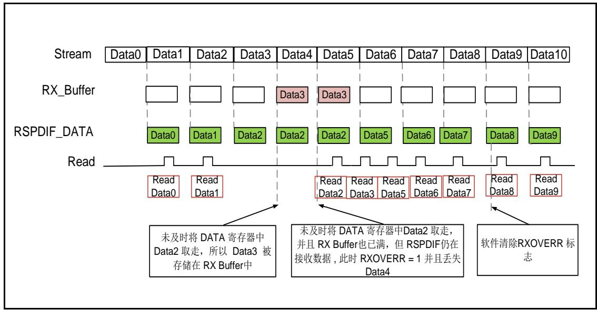

图 33-13. RSPDIF 上溢错误（RXSTEOMEN = 0 且 RXDF[1:0] = 2’b10）

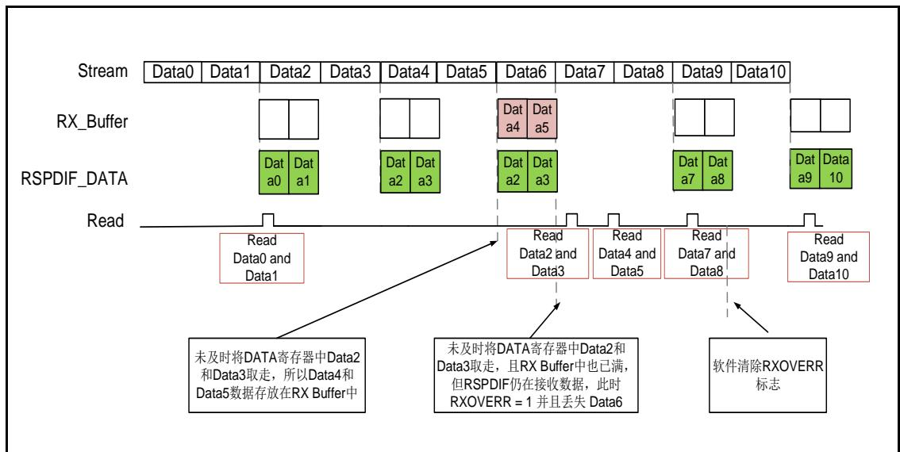

如果RXSTEOMEN = 1，RSPDIF传输的是立体声数据，那么为了避免左右通道不对准的问题，RSPDIF必须丢弃第二个数据，即使RX缓存内部有空间。之后再传入的数据可以正常写入RX缓 存， 即 使RXORERR标 志 仍 然 挂起。 参 见 33-14. RSPDIF$( R X S T E O M E N = 1 . 7 R X D F [ 1 : 0 ] = 2 ^ { \prime } b 0 x )$ 和 33-15. RSPDIF RXSTEOMEN =$1 . H R X D F I 1 { : } 0 I = 2 ^ { \prime } b 1 0 )$ 所示。

图 33-14. RSPDIF 上溢错误（RXSTEOMEN = 1 且 RXDF[1:0] = 2’b0x）

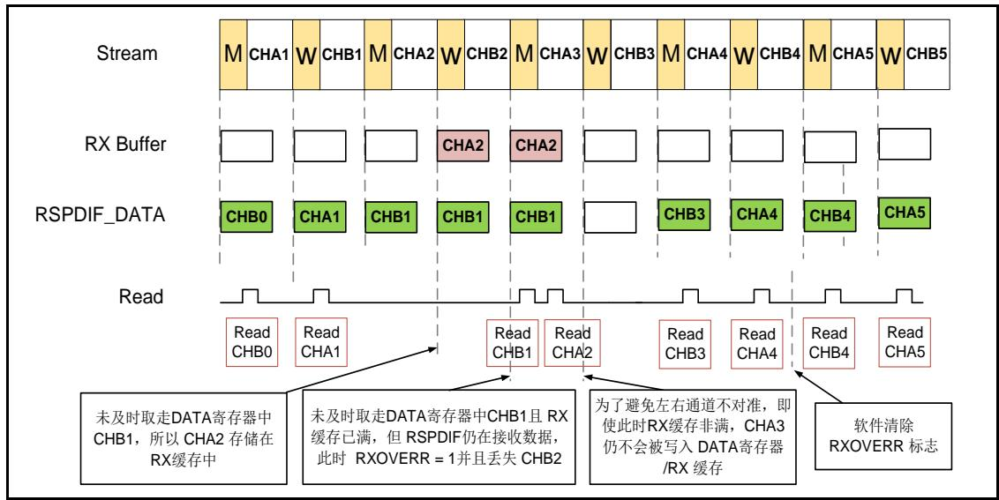

图 33-15. RSPDIF 上溢错误（RXSTEOMEN = 1 且 RXDF[1:0] = 2’b10）

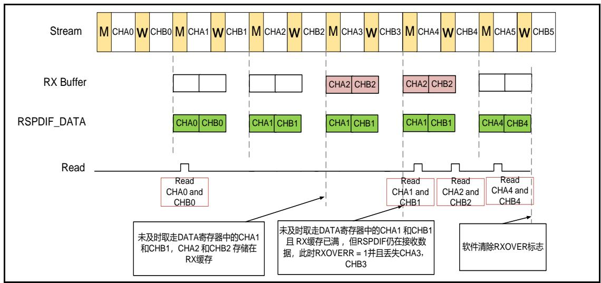

中断

RSPDIF 模块的中断及事件标注如 33-13. RSPDIF 。

表 33-13. RSPDIF 中断事件

<table><tr><td>事件标志</td><td>中断事件</td><td>清除方式</td><td>中断使能位</td></tr><tr><td>SYNDO</td><td>同步完成</td><td>设置 RSPDIF_STATC 寄存器 SYNDBC 位为 1</td><td>SYNDOIE</td></tr><tr><td>RBNE</td><td>RSPDIF 接收数据寄存器非空</td><td>读 RSPDIF_DATA 寄存器</td><td>RBNEIE</td></tr><tr><td>PERR</td><td>子帧中 28 个信息位内 0 和 1 不是偶数个</td><td>设置 RSPDIF_STATC 寄存器 PERRC 位为 1</td><td>PERRIE</td></tr><tr><td>RXORERR</td><td>RSPDIF_DATA 和 RX 缓存都已满,且继续向 RX 缓存中写入一个新数据</td><td>设置 RSPDIF_STATC 寄存器 RXORERRC 位为 1</td><td>RXORERRIE</td></tr><tr><td>CBNE</td><td>RSPDIF 控制流接收寄存器非空</td><td>读 RSPDIF_CHSTAT 寄存器</td><td>CBNEIE</td></tr><tr><td>SYNDB</td><td>当已检测到报头 B</td><td>设置 RSPDIF_STATC 寄存器 SYDBC 位为 1</td><td>SYNDBIE</td></tr><tr><td>SYNERR</td><td>同步失败</td><td rowspan="3">设置 RSPDIF_CTL 寄存器 RXCFG[1:0]位为 2'b00</td><td rowspan="3">RXDCERRIE</td></tr><tr><td>FRERR</td><td>当 28 个信息位中出现转换序列不正确时或报头出现在意外的位置或预期的报头没有收到时</td></tr><tr><td>TMOUTERR</td><td>TWCNT 发生溢出</td></tr></table>

