# 34. 串行音频接口（SAI）

# 34.1. 简介

串行音频接口（SAI）用于支持各种通用的音频协议，如I2S、PCM/DSP、AC’97、LSB或MSB对齐和TDM，它适用于单声道和立体声。

为了初始化这些配置，SAI用了两个完全独立的音频子模块。每个音频子模块包含多达4个IO引脚（SD，SCK，FS和MCLK）。当两个音频子模块配置成相互同步时，部分IO引脚可以共用。

SAI可以配置成主/从、发送/接收的任何组合模式，根据音频子模块同步/异步配置，可以设置其操作模式为全双工/单工。

# 34.2. 主要特征

两个独立的音频子模块；

◼ 每个音频子模块可以配置成主/从、发送/接收的任何组合，并都具有一个8字的FIFO；

本地时钟分频逻辑用于满足各种音频采用率；

◼ 可灵活配置的音频协议，如I2S，PCM/DSP，AC’97，LSB或MSB对齐和TDM；

PDM接口，最多支持4对麦克风（GD32H7xx支持3对麦克风）；

具有单声道/立体声音频能力，支持静音设置；

帧同步配置（有效电平、有效长度和偏移）；

每个音频帧包含多达16个可配置的slot；

灵活的配置slot长度，并且可以配置slot为有效或无效；

每个slot能够支持一个大小为8位、10位、16位、20位、24位或32位的数据，并且可以配置这些数据的第一位偏移、LSB或MSB传输；

串行时钟选通边沿选择（SCK）；

错误标志位和中断源：

FIFO上溢和下溢；

从模式时，帧同步提前检测；

从模式时，帧同步滞后检测；

AC’97编解码器未就绪；

时钟配置错误；

每个音频子模块都有2个独立的DMA接口，支持频率高达4MHz的从机模式。

# 34.3. 功能描述

# 34.3.1. 模块框图

图 34-1. 模块框图

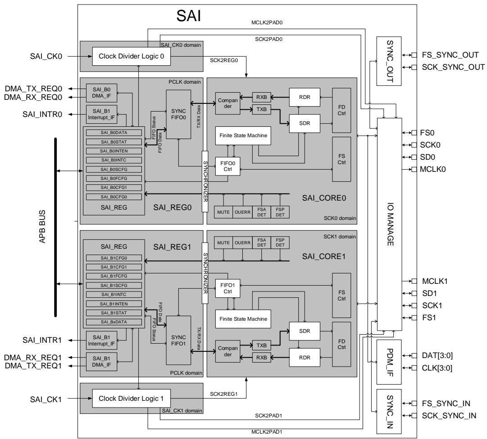

注意：GD32H7xx PDM接口仅支持DAT[2:0]和CLK[1:0]。

灵活的音频收发器整合了两个相同的独立子模块，并具有一个连接到输出的IO管理模块。每个音频子模块由三个独立的时域组成，分别为SAI_CK、SCK和PCLK域。定义音频采样率时钟分频逻辑设计在SAI_CK域，它的时钟输出到SCK域。SCK域包含SAI主要功能状态机、压缩/解压、发送/接收逻辑和中断产生逻辑。主要的控制寄存器和同步FIFO位于PCLK域。同步FIFO可以被ARM CPU的APB总线或DMA控制器访问。

每个音频子模块可以配置成主/从、发送/接收两者的任意组合。帧同步（FS）和串行时钟（SCK）在主模式下产生，在从模式下，音频子模块从外部主机或同步模式下另一个音频子模块接收这两个信号。主时钟（MCLK）只有在主模式时才产生，用来供外部DAC/ADC操作。有一个例外，当SAI配成支持AC’97协议时，FS强制变成输出信号，这与主/从配置无关。串行数据（SD）IO引脚在发送时配成输出，接收时配成输入。

IO管理模块控制每个音频子模块的IO引脚，当两个音频子模块被声明为互相同步时，FS、SCK

和MCLK可以共用，同步子模块的这些引脚被释放，并可用作通用IO。

# 34.3.2. 时钟分频器

SAI的两个音频子模块的时钟分频逻辑只有在当它们配置成主设备时才打开，否则是关闭的，并且MCLK和SCK的输出都保持低电平。分频器的时钟源SAI_CK，推荐采用45.1584MHz和49.152MHz这两个特定值来产生标准的音频采样率。时钟分频逻辑由主时钟分频器和子时钟分频器组成，其中主时钟分频器用于产生所需的主时钟（MCLK），子时钟分频器用于产生位时钟（SCK）。时钟分频逻辑如 34-2. 所示。

图 34-2. 时钟分频逻辑

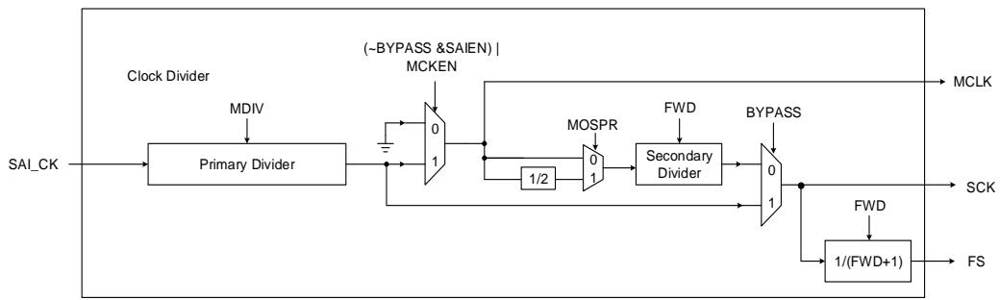

主时钟分频比 MDIV直接链接到SAI控制寄存器内的主时钟分频比控制字段，其输出频率可通过以下公式获得。

$$
f _ {\mathrm{MCLK}} = \left\{ \begin{array}{l} \frac {f _ {\mathrm{SAI} \_ C K}}{\mathrm{MDIV}}, \mathrm{MDIV} \neq 0 \\ f _ {\mathrm{SAI} \_ C K}, \mathrm{MDIV} = 0 \end{array} \right. \tag {34-1}
$$

注意：以上公式仅在 BYPASS无效、SAI开启且 MCKEN开启时成立，否则 MCLK保持低电平。

辅助时钟分频器的比率 MDIV连接到 SAI控制寄存器内的帧长度（FWD）和MCLK过采样率（MOSPR）控制字段。以下公式决定了 SAI_CK 与位时钟（SCK）采样率之间的关系。

$$
f _ {S C K} = \frac {f _ {S A I \_ C K} \times (F W D + 1)}{M D I V \times (M O S P R + 1) \times 2 5 6} \tag {34-2}
$$

帧同步频率 fFS:

$$
f _ {F S} = \frac {f _ {\text { SAI\_CK }}}{\text { MDIV } \times (\text { MOSPR } + 1) \times 2 5 6} \tag {34-3}
$$

当 BYPASS 置位时，主时钟（MCLK）以固定输出值 0 关闭，而位时钟（SCK）取决于 MDIV。另外，帧长值没有限制，只要帧长大于等于 8 即可。

当 BYPASS 清零时，需要设置（FWD+1）等于 master 模式下基数为 2 的指数函数的结果，以保证 SCK 可被 MCLK整除。

34-1. 列出了帧长度为 256 位时一些常用的音频采样率配置。

# 表34-1. 常用的音频采用率

<table><tr><td>SAI_CK时钟频率</td><td>标准音频采样率</td><td>主时钟分频率</td></tr><tr><td rowspan="5">192kHz x 256</td><td>192 kHz</td><td>MDIV = 1</td></tr><tr><td>96 kHz</td><td>MDIV = 2</td></tr><tr><td>48 kHz</td><td>MDIV = 4</td></tr><tr><td>16 kHz</td><td>MDIV = 12</td></tr><tr><td>8 kHz</td><td>MDIV = 24</td></tr><tr><td rowspan="3">44.1kHz x 256</td><td>44.1 kHz</td><td>MDIV = 1</td></tr><tr><td>22.05 kHz</td><td>MDIV = 2</td></tr><tr><td>11.025 kHz</td><td>MDIV = 4</td></tr></table>

# 34.3.3. 操作模式

SAI音频子模块可以独立的配置成主/从、发送/接收任何组合的操作模式。

# 主设备

帧同步（FS）是由主设备在FIFO不为空且帧开始时生成，它用来协调帧开始或通道识别。串行时钟（SCK）和主时钟（MCLK）都是由主设备生成的信号，SCK信号专门被从设备用来作为位时钟。和FS不同，SCK和MCLK的产生不受FIFO是否为空的制约，只要音频子模块被使能，他们就会生成。

# 从设备

从设备接收来自主设备的FS和SCK信号，这些信号的来源取决于音频子模块是声明为同步还是异步。当选择异步模式时，FS和SCK信号源被直接关联到芯片级IO端口。当选择同步模式时，FS和SCK信号源被连接到另一个音频子模块的FS和SCK信号端。用户必须在使能主设备前先使能从设备，否则从设备将不能完整地接收主设备的数据。

# 发送器

当音频子模块被配置成发送器时，串行数据（SD）为输出。如果在音频子模块使能之后FIFO还是为空，则会发送数值0，并产生下溢标志（OUERR）。

# 接收器

当音频子模块被配置成接收器时，串行数据（SD）为输入。从接收器总会监测FS信号，当检测到第一个有效边沿时，音频子模块存储接收到的数据，然后由内部有限态机器处理后续数据的接收。当SAI失能时，接收器会在帧结束时才停止接收。

# 34.3.4. 同步模式

SAI的同步模式可以分为内部同步模式和外部同步模式。

# 内部同步

内部同步模式具有减少通信时占用外部引脚数量的优点，即SAI子模块SAI_B0和SAI_B1可以

同步运行，二者将共用SAI_FS和SAI_SCK信号，从而释放SCKx、FSx和MCLKx的GPIO引脚。

内部同步模式下的SAI子模块在全双工通信中可以配置为如下几种模式：

1. 子模块0（或者1）配置为主模块，子模块1（或者0）配置为从模块；

2. 子模块0和子模块1都配置为从模块；

3. 子模块0（或者1）配置为异步模块，子模块1（或者0）配置为同步模块。

注意：由于存在内部重新同步阶段，因此PCLK APB频率必须大于比特率时钟频率的二倍。

# 外部同步

外部同步即SAI音频子模块与其他SAI进行同步。通过配置SAI_SYNCFG寄存器中的SYNO[1:0]确定为其他SAI提供FS和SCK信号的同步源，即SAI子模块0或者SAI子模块1。通过配置SAI_SYNCFG 寄存器中的SYNI[1:0]确定接收同步信号的SAI选择哪个SAI进行同步。通过配置SAI_BxCFG0寄存器中的SYNCMOD[1:0]指定SAI音频子模块是否与其它SAI同步。

如果SAI中的两个音频子模块都需要与另一个SAI同步，则可以通过配置SYNCMOD[1:0]位来配置每个音频子模块与另一个SAI模块同步。或者通过配置SYNCMOD[1:0]位来配置一个音频子模块与另一个SAI模块同步。然后通过配置 SYNCMOD[1:0]位配置其他音频子模块与第二个SAI音频子模块同步。

参考 34-2. 进行外部同步配置。

表34-2. 外部同步配置

<table><tr><td>SAI 模块</td><td>SYNI =2</td><td>SYNI =1</td><td>SYNI =0</td></tr><tr><td>SAI0</td><td>SAI2 同步</td><td>SAI1 同步</td><td>保留</td></tr><tr><td>SAI1</td><td>SAI2 同步</td><td>保留</td><td>SAI0 同步</td></tr><tr><td>SAI2</td><td>保留</td><td>SAI1 同步</td><td>SAI0 保留</td></tr></table>

注意：当 SAI 子模块配置为从机模式时，存在同步信号方向限制：该从机子模块只能接收同步信号，无法提供帧同步(FS)信号给其他 SAI 子模块。

在以下场景中需要特别注意：

1. 内部同步模式：从机子模块不能作为同步信号源，只能接收来自主机模块的 FS和 SCK 信号。

2. 外部同步模式：若从机模块需要与外部 SAI 同步，必须通过 GPIO 引脚接收外部 FS 和SCK 信号，无法通过内部路径向外部 SAI 提供同步信号。

在系统设计阶段应充分考虑此限制，合理规划 SAI 模块的主从关系和引脚分配

# 34.3.5. 帧配置

# 帧同步

帧同步信号是主设备和从设备之间初始化一个传输的协调信号。许多参数用于控制它的波形。

# 帧同步提前

帧同步有效边沿可以和第一个slot中第一个比特位的开始或者其前一个SCK位时钟对齐，这取决于SAI_SxFCFG寄存器中FSOST控制字段。 34-3. FS 展示了FS波形是如何改变的。

# 帧同步有效宽度

34-3. FS 中帧同步信号的有效宽度取决于SAI_BxFCFG寄存器的FSAWD控制字段的配置，它的实际宽度等于（FSAWD+1）个SCK时钟周期，且其最小值为1个SCK时钟周期，最大值为128个SCK时钟周期，即为最大帧宽的一半。当FSFUNC置1时，FS信号不仅表示帧开始，还能表示通道识别，这种情况下，（FSAWD+1）必须等于帧宽的一半，否则音频子模块的功能将不能得到保证。

图 34-3. FS 有效宽度

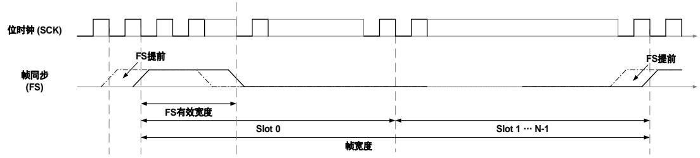

# 帧同步极性

帧同步有效电平可以通过SAI_BxFCFG寄存器的FSPL控制字段配置，如 34-4. FS 所示。

图 34-4. FS 极性

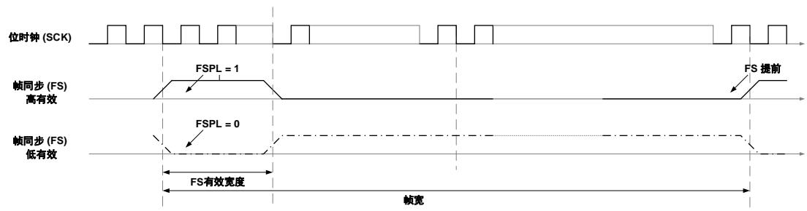

# 帧同步功能

帧同步功能的定义通过SAI_BxFCFG寄存器的FSFUNC控制字段进行配置。有两个指定的功能可被选择，当FSFUNC置1时，FS不仅表示帧开始还表示通道编号的识别，在这种情况下，帧同步有效宽度（FSAWD+1）应该配置成帧宽的一半，如 34-5. FS 所示，否则音频子模块的行为将不能得到保证。当FSFUNC为0时，FS只表示帧开始。

图 34-5. FS 功能

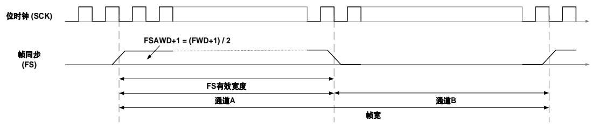

# 帧宽

帧宽不能小于8位（相当于一个字节的数据），也不能大于256位。

在主模式中，如果BYPASS清0，帧宽（FWD+1）的值应该设置为8到256之间且等于2的几次幂的值，以保证每个SCK时钟周期包含整数个MCLK时钟周期，这是外部DAC/ADC能正确操作的必须要求，否则SAI_BxINTEN寄存器中的错误时钟标志位（ERRCK）会置位，若还使能了SAI_BxINTEN寄存器的错误时钟中断位（ERRCKIE），则产生一个中断。在主模式中，如果BYPASS置1，这将对帧宽的配置没有约束，主时钟自动关闭。

在从模式中，帧宽配置用于配合内部有限状态机来获取有效帧的开始和结束。它还有另一个用途，就是用于检测帧同步信号的提前或滞后，如果出现帧同步提前或滞后现象，则一个错误标志位会被置位，如果使能了相应的中断，则产生一个中断，具体可以参考 和 章节。

# 34.3.6. Slot 配置

每个SAI帧逻辑上最多分为16个slots，每个slot的有效状态和它们的分布通过slot配置寄存器进一步控制。Slot宽度可以通过SAI_BxSCFG寄存器的SLOTWD控制字段配成16位、32位或是和数据宽度一致。

# Slot 激活

每个slot的激活状态可以通过SAI_BxSCFG寄存器的slot激活向量（SLOTAV）独立配置。SLOTAV是一个16位宽的控制字段，每个比特位控制相应的一个slot的激活状态。Slot的逻辑划分如 34-6. Slot 所示。

图 34-6. Slot 激活

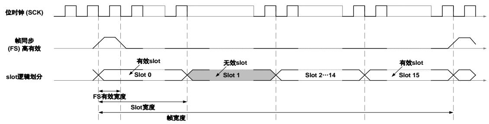

# Slot 分布

在slot个数和slot宽度的乘积小于帧宽的特殊情况下，存在非slot的分布。Slot部分即为有slot分布的部分，其他的为无效部分。当FSFUNC为0时，FS仅表示信号帧的开始，从最后一个slot结束到下一个帧的开始之间为slot的无效部分，如 34-7. FSFUNC=0 slot 所示。

图 34-7. 当 FSFUNC=0 时，slot 分布

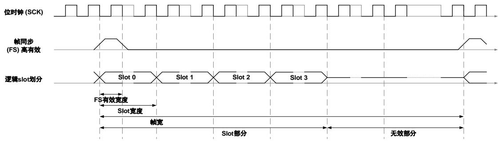

当FSFUNC=1，FS不仅表示帧开始，还表示通道识别，slot部分和无效部分均匀分布在两个通道上。无效部分为从当前通道的最后一个slot到下一个通道的slot开始之间的部分。

图 34-8. 当 FSFUNC=1 时，slot 分布

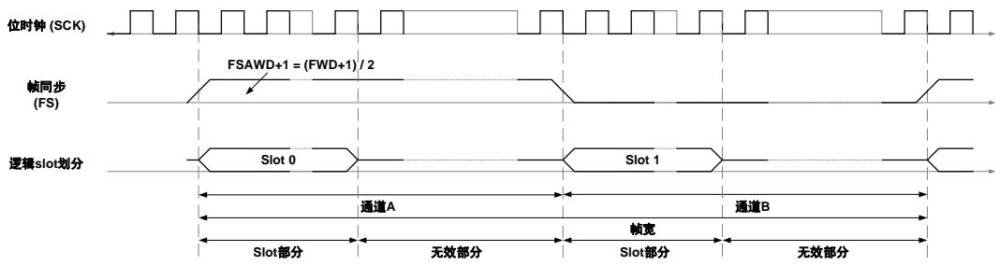

# 在无效 slot上的串行数据输出管理

在无效slot附近的串行数据（SD）输出行为可以根据SAI_BxCFG1寄存器中的串行数据输出模式（SDOM）定义的管策略来决定是SAI释放还是驱动输出0。SD输出行为，偏移和空闲区域这三项需要特别注意。在该用户手册中，将slot部分规定为偏移区、数据区和闲置区，具体描述如 34-9. Slot 所示。

图 34-9. Slot 部分的规定

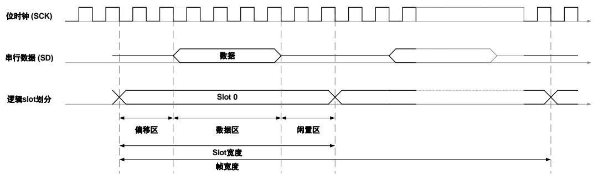

首先，偏移区域的SD输出由SDOM决定,SDOM为1，那么SAI将会释放SD的输出，否则SD输出0，其区别如 34-10. 所示。

图 34-10. 偏移区的处理

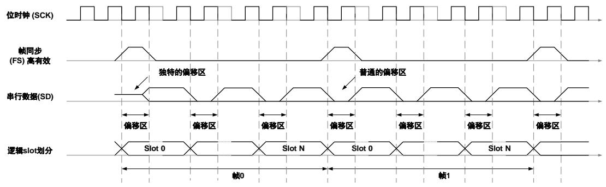

其次，当SDOM为1时，一个帧的最后一个slot的闲置区期间SD输出行为将参考第一个slot的有效状态。如果slot0是无效的时候，SD输出为释放状态，否则如果slot0是有效的，则SD输出0。当SDOM为0时，则SD的输出0，这和其他slot的有效状态无关。

最后，位于帧中间的slot的偏移区和闲置区的SD输出参考它们上一个slot和下一个slot的有效状态。如果上一个slot是无效的，并且存在偏移区，那么当SDOM=1时，SD输出线释放，当SDOM=0时，SD输出0。同样，如果下一个slot是无效的，且存在闲置区，那么当SDOM=1时，SD线释放，当SDOM=0时，SD输出0。在有效slot和无效slot附近的偏移区和闲置区的SD输出行为如34-11. SD 所示。

图 34-11. SD 输出管理

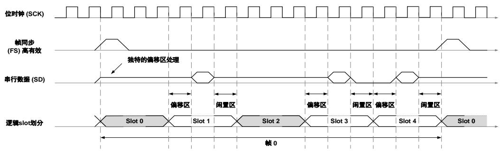

# 34.3.7. 数据配置

数据宽度也是灵活的，它可以通过SAI_BxCFG0寄存器的DATAWD位将其配置成8位、10位、16位、20位、24位和32位宽。通过设置SAI_BxSCFG寄存器的数据偏移（DATAOST）位，可以将有效slot中的数据向前移或是向后移。如串行数据输出管理部分( SAI为从机模式时，存在同步信号方向限制：该从机子模块只能接收同步信号，无法提供帧同步(FS)信号给其他SAI子模块。

在以下场景中需要特别注意：

3. 内部同步模式：从机子模块不能作为同步信号源，只能接收来自主机模块的 FS 和 SCK 信号。

4. 外部同步模式：若从机模块需要与外部 SAI 同步，必须通过 GPIO 引脚接收外部 FS 和SCK 信号，无法通过内部路径向外部 SAI 提供同步信号。

在系统设计阶段应充分考虑此限制，合理规划 SAI 模块的主从关系和引脚分配帧配置节)所描述的那样，一个slot开始处与里面数据的第一个比特位之间的空间称为偏移区，数据的最后一个比特位和slot结束处之间的空间称为闲置区。当音频子模块配置成发送器，且存在偏移区或闲置区，那么在这些区期间，SD输出0。SD线的实际行为不仅取决于输出值，还取决于线管理条件和附近slot的有效状态。当音频子模块配置成接收器，且存在偏移区或闲置区，那么在这些区期间的数据接收将会被忽略。数据发送和接收如 34-12. 所示。

图 34-12. 数据配置

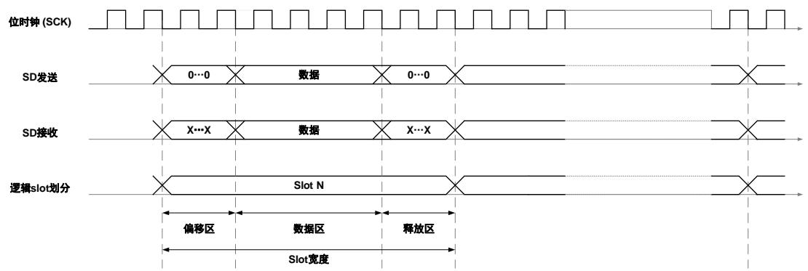

# 34.3.8. 同步 FIFO

在每个SAI音频子模块内部独立应用一个8字深的同步FIFO以提高传输效率。这些FIFO可以被CPU或是DMA访问，FIFO请求中断机制用于请求CPU和DMA访问。FIFO请求的产生取决于操作模式、FIFO阈值、FIFO状态和DMA突发传输大小。FIFO请求中断的产生概括在 34-3. FIFO中，如果根本条件不满足，则中断请求就会被清除。

表 34-3. FIFO 请求的产生条件

<table><tr><td colspan="4">发送: OPTMOD[0] = 0</td><td colspan="4">接收: OPTMOD[0] = 1</td></tr><tr><td>FIFO 阈值</td><td>FFTH</td><td>FIFO状态</td><td>FFSTAT</td><td>FIFO阈值</td><td>FFTH</td><td>FIFO状态</td><td>FFSTAT</td></tr><tr><td>空</td><td>= 000</td><td>空</td><td>= 000</td><td>空</td><td>= 000</td><td>不空</td><td>≥ 001</td></tr><tr><td>1/4 满</td><td>= 001</td><td>&lt;1/4满</td><td>&lt;010</td><td>1/4满</td><td>= 001</td><td>≥ 1/4满</td><td>≥ 010</td></tr><tr><td>1/2满</td><td>= 010</td><td>&lt;1/2满</td><td>&lt;011</td><td>1/2满</td><td>= 010</td><td>≥ 1/2满</td><td>≥ 011</td></tr><tr><td>3/4满</td><td>= 011</td><td>&lt;3/4满</td><td>&lt;100</td><td>3/4满</td><td>= 011</td><td>≥ 3/4满</td><td>≥ 100</td></tr><tr><td>全满</td><td>= 100</td><td>不满</td><td>&lt;101</td><td>全满</td><td>= 100</td><td>全满</td><td>= 101</td></tr></table>

通过设置SAI_BxCFG1寄存器的FLUSH控制字段可以实现FIFO刷新，当FLUSH置1时，FIFO中的所有数据内容将被清除，读写指针复位到0。

注意：DMA请求的产生取决于FIFO请求，DMA接口章节会给出详细信息。

# 34.3.9. PDM 接口

数字麦克风可以通过PDM接口实现数据传输，PDM接口最多支持4对数字麦克风并联使用。

# 时序与连接

采用PDM接口连接的两个麦克风示意图如 34-13. PDM 所示。

图 34-13. PDM 典型连接和时序图

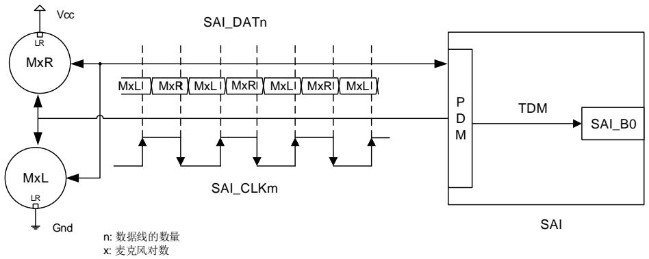

注意：GD32H7xx PDM接口仅支持DAT[2:0]和CLK[1:0]。

麦克风LR引脚接入VCC的为左麦克风通道，接入GND的为右麦克风通道，左通道与右通道麦克风共用一路时钟线SAI_CLK，时序信号由SAI_B0的TDM接口进行调整后产生，通过在上升沿采样左声道数据，在下降沿采样右声道数据，完成双声道数据的采集。

注意：PDM接口只支持与配置为TDM主模式的SAI_B0子模块配合使用。

# PDM 接口使能

PDM 接口启用流程如下：

1.配置 TDM 为主模式，SAI_B0CFG0 寄存器的 OPTMOD[0:1]为主机接收模式，PROT[1:0]位为自由协议；

2.配置 PDM 接口：通过配置 SAI_PDMCTL 寄存器的 NBMIC[1:0]位选择麦克风的数量，配置SAI_PDM 寄存器中的 CLKLx 位使能时钟；

3.配置 SAI_PDMCTL 寄存器中的 PDMEN 位使能 PDM 接口；

4.配置 SAI_B0CFG0 寄存器中的 SAIEN 位并使能 SAI_B0。

# 数据处理

PDM中的数据处理序列如下：

1.SAI_B0 产生时钟经 TDM 链路到 PDM 接口产生比特流时钟

2.通过配置 SAI_PDMCFG 寄存器的 DPLx[2:0]和 DPRx[2:0]位，实现 PDM 接口对来自麦克风产生的比特流数据 SAI_DATx 进行交错和延迟处理，从而对麦克风所产生的延迟进行调整。

3.移位寄存器将数据流转换为字节，通过 TDM 链路将数据传输到 SAI_B0。

图 34-14. PDM 数据处理示意图

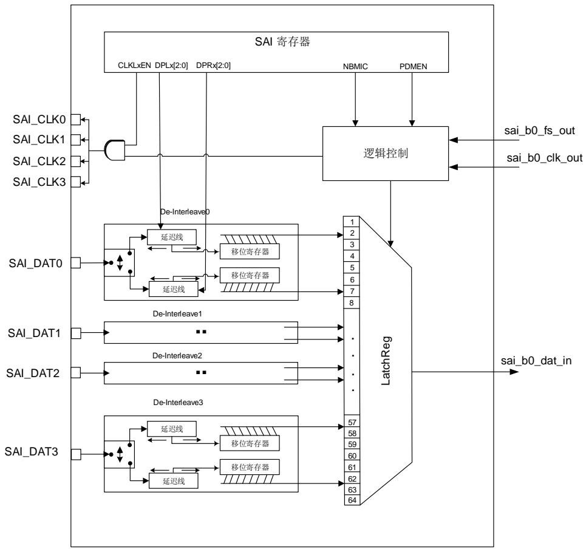

# 数据传输启动过程

在使能PDM接口后，麦克风数据采样的开始是在帧同步事件发生后进行，在8个SAI_CK时钟之后，麦克风的数据将会通过TDM接口传输到SAI。 34-15. PDM 显示了PDM数据传输的启动过程。

图 34-15. PDM 数据传输的启动过程

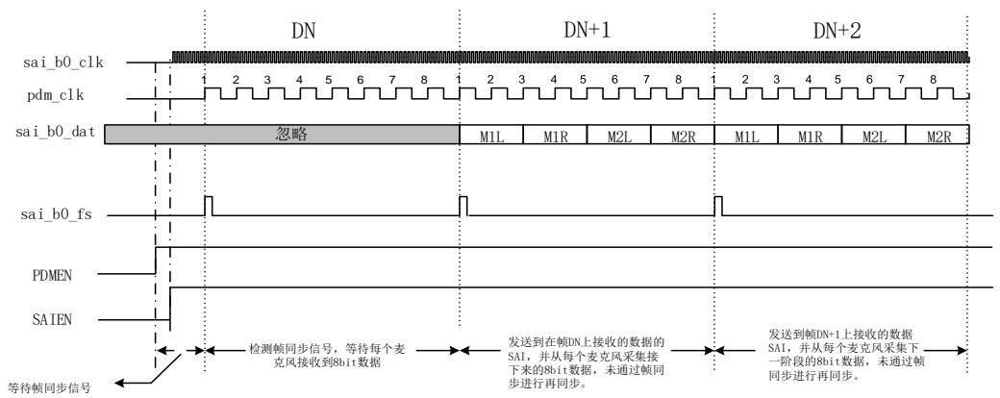

# 数据格式

获取到的麦克风数据的数据格式主要与以下配置有关，\
1.在PDMCTL寄存器中配置NBMIC[1:0]设置麦克风的数量；

2.在BxSCFG寄存器中配置SLOTWD[1:0]设置槽宽；

3.配置SHIFTDIR位设置传输数据的MSB/LSB。

表 34-4. 不同配置下，获取麦克风数据需要读取寄存器次数

<table><tr><td>麦克风数量</td><td>Slot 宽度</td><td>获取麦克风数据需要读取 BxDATA 寄存器次数</td></tr><tr><td rowspan="3">8</td><td>32</td><td>2</td></tr><tr><td>16</td><td>4</td></tr><tr><td>8</td><td>8</td></tr><tr><td rowspan="3">4</td><td>32</td><td>1</td></tr><tr><td>16</td><td>2</td></tr><tr><td>8</td><td>4</td></tr><tr><td rowspan="2">2</td><td>16</td><td>1</td></tr><tr><td>8</td><td>2</td></tr></table>

注意：GD32H7xx 支持3对麦克风。

下图给出了不同麦克风数量和Slot宽度下，寄存器数据排列示意图。

图 34-16. 八麦克风，不同 slot 宽度下，BxDATA 寄存器数据格式

八麦克风配置

32位slot宽度

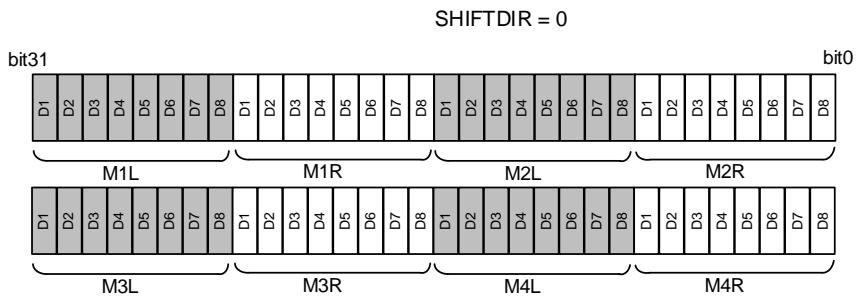

16位slot宽度

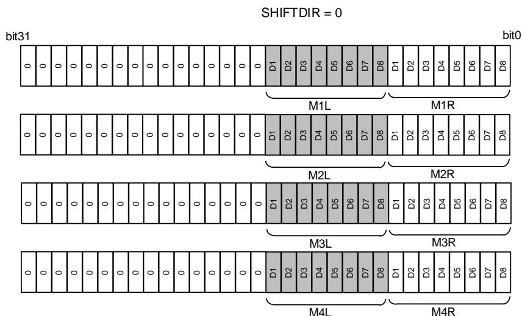

8位slot宽度

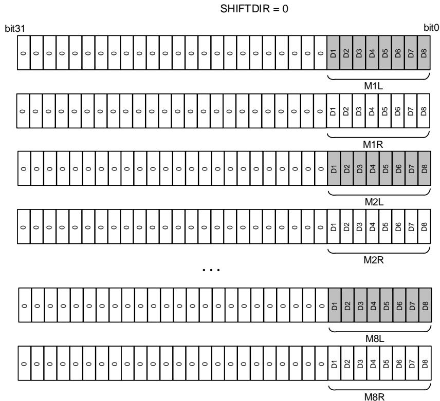

图 34-17. 四麦克风，不同 slot 宽度下，BxDATA 寄存器数据格式

四麦克风配置

32位slot宽度

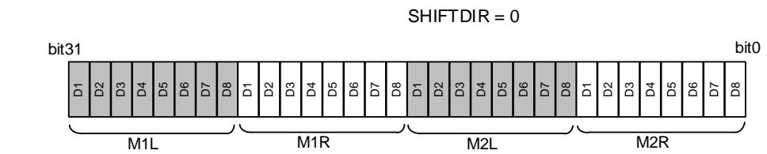

16位slot宽度

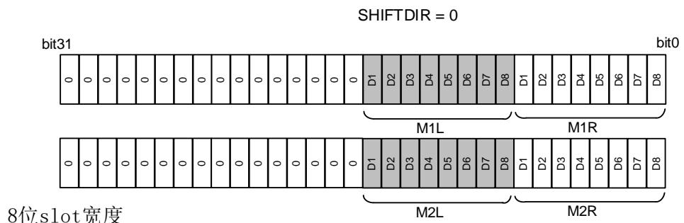

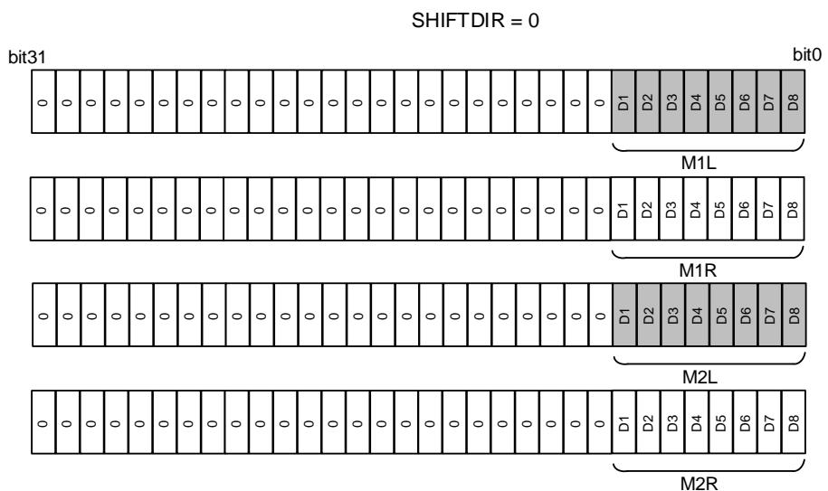

图 34-18. 双麦克风，不同 slot 宽度下，BxDATA 寄存器数据格式

双麦克风配置

16位slot宽度

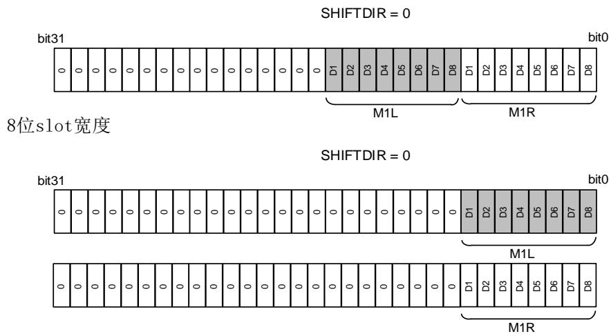

# TDM 配置

针对PDM接口的TDM配置参考 34-5. TDM 。

表 34-5. TDM 配置表

<table><tr><td>寄存器</td><td>位域</td><td>值</td><td>描述</td></tr><tr><td rowspan="8">SAI_B0CFG0</td><td>OPTMOD[1:0]</td><td>0b01</td><td>工作模式配置为主机接收接收模式</td></tr><tr><td>PROT[1:0]</td><td>0b00</td><td>协议为自由协议</td></tr><tr><td>DATAWD[2:0]</td><td>x</td><td>数据宽度</td></tr><tr><td>SHIFTDIR</td><td>x</td><td>数据传输是MSB还是LSB</td></tr><tr><td>SAMPEDGE</td><td>0</td><td>数据采样时钟边沿下降沿采样</td></tr><tr><td>MONO</td><td>0</td><td>立体声模式选择</td></tr><tr><td>BYPASS</td><td>1</td><td>时钟分频器逻辑旁路</td></tr><tr><td>MDIV[5:0]</td><td>x</td><td>主时钟分频器</td></tr><tr><td rowspan="5">SAI_B0FCFG</td><td>FWD[7:0]</td><td>x</td><td>帧宽度</td></tr><tr><td>FSAWD[6:0]</td><td>0</td><td>FS有效宽度为1个SCK时钟周期</td></tr><tr><td>FSFUNC</td><td>0</td><td>FS只定义帧开始</td></tr><tr><td>FSPL</td><td>1</td><td>FS有效极性为高</td></tr><tr><td>FSOST</td><td>0</td><td>FS有效边沿声明为第一个slot的第一个位开始处</td></tr><tr><td rowspan="4">SAI_B0SCFG</td><td>DATAOST[4:0]</td><td>0</td><td>数据无偏移</td></tr><tr><td>SLOTWD[1:0]</td><td>0</td><td>Slot宽等于数据位宽</td></tr><tr><td>SLOTNUM[3:0]</td><td>x</td><td>一个帧中的slot个数</td></tr><tr><td>SLOTAV[15:0]</td><td>x</td><td>Slot激活向量</td></tr></table>

注意：在配置PDM时，时钟频率、帧长度和Slot大小需要遵循以下三条要求：

1.时钟频率配置遵循以下公式：

$$
f _ {S C K \_ B 0} = f _ {P D M \_ C L K} ^ {*} (N B M I C + 1) ^ {*} 2 \tag {30-4}
$$

2.帧长度需要满足以下公式：

$$
\mathrm{FWD} = \left(1 6 * (\text { NBMIC } + 1)\right) - 1 \tag {30-5}
$$

3.Slot大小需要配置为（FWD+1）的整数倍。

# 34.3.10. AC’97 链路控制器

AC’97链路控制器模式是通过SAI_BxCFG0寄存器的PROT位配置的。当选择了这个协议，有许多配置字段会被忽略，包括数据移位方向、数据宽度、帧和slot的大部分配置以及部分中断控制字段，具体可以参考寄存器定义部分的描述。

AC’97协议的帧宽固定为256位，每个帧被分成13个slot，第一个slot固定为16位宽，其他的12个slot的宽度固定为20位。用户必须设置SAI_BxCFG0寄存器的数据宽度（DATAWD）控制字段为16位或20位，否则将不能保证音频子模块的行为。

TAG（即Slot0）中的位2为保留位，无论写什么值到TAG中，位2均会被写0。

TAG（slot 0）中的位3到位14为自由协议的slot激活向量（SLOTAV），其中TAG slot（即slot 0）总为有效，位3对应slot12，位14对应slot1.

TAG（slot 0）的位15是编解码就绪状态指示位，当音频子模块配置为接收时，接收到的TAG（slot0）的位15为0，则表明音频编解码器没有就绪，相应的ACNRDY标志位置1。如果ACNRDY标志位和音频编解码器未就绪中断使能位（ACNRDYIE）都置1，则产生一个中断。

帧同步有效边沿被声明为数据的第一个比特位的前一个时钟周期，如 34-19. AC’97 slot所示。

图 34-19. AC’97 的 slot 划分

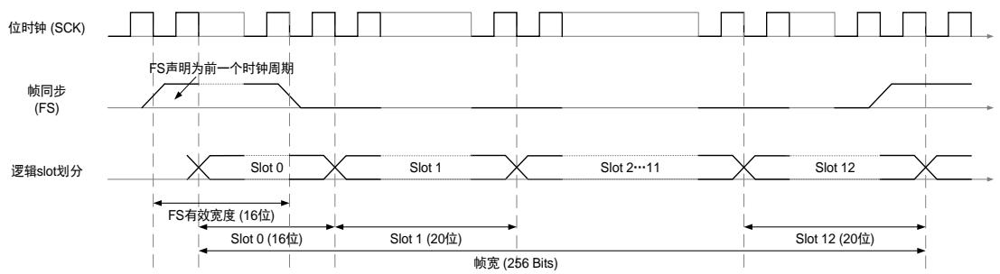

34-20. AC’97 TAG 给出了AC’97slot划分的综述。

图 34-20. AC’97 TAG 定义

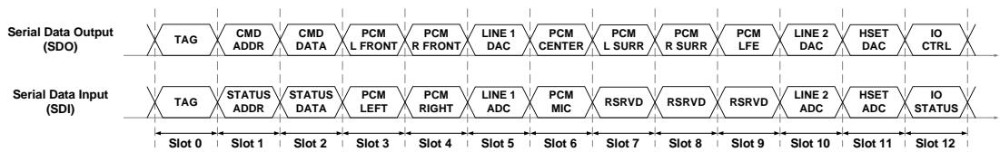

34-6. AC’97 slot 和 34-7. AC’97 slot 概括了每个slot的定义和意义。

当AC’97链路控制器作为发送器时。

表 34-6. AC’97 发送 slot 定义

<table><tr><td>Slot</td><td>名称</td><td>描述</td></tr><tr><td>0</td><td>输出目标</td><td>高位指示哪个slot包含有效数据,低位指示传达编解码器ID</td></tr><tr><td>1</td><td>命令地址端口</td><td>读/写命令和7位的编解码器寄存器地址</td></tr><tr><td>2</td><td>命令数据端口</td><td>16位命令寄存器写数据</td></tr><tr><td>3,4</td><td>PCM回放</td><td>左右声道输入的16、18、20位PCM数据</td></tr><tr><td>5</td><td>Modem Line1 DAC</td><td>Modem line1输出的16位Modem数据</td></tr><tr><td>6,7,8,9</td><td>中置,左右环绕,LEF数据</td><td>中置,左右环绕与LEF通道的16、18、20位PCM数据</td></tr><tr><td>10</td><td>Modem Line2 DAC</td><td>Modem line2输出的16位Modem数据</td></tr><tr><td>11</td><td>Modem听筒</td><td>听筒的16位Modem数据</td></tr><tr><td>12</td><td>Modem IO控制</td><td>用于Modem控制的GPIO写端口I</td></tr><tr><td>10-11</td><td>SPDIF输出</td><td>AC-link可选SPDIF输出带宽</td></tr><tr><td>6-12</td><td>双倍音频数据</td><td>88.2或者96kHz的AC-link可选左,中,右声道带宽。实际使用时间片由DRSS位控制</td></tr></table>

当AC’97链路控制器作为接收器时。

表 34-7. AC’97 接收 slot 定义

<table><tr><td>Slot</td><td>Name</td><td>Description</td></tr><tr><td>0</td><td>输入目标</td><td>高位指示哪个slot包含有效数据;</td></tr><tr><td>1</td><td>状态地址端口</td><td>高位指示寄存器地址,低位指示请求数据的时间片</td></tr><tr><td>2</td><td>状态数据端口</td><td>读取到的16位寄存器数据</td></tr><tr><td>3,4</td><td>PCM录音</td><td>左右声道输出的16、18、20位PCM数据</td></tr><tr><td>5</td><td>Modem Line 1 ADC</td><td>Modem line1输入的16位Modem数据</td></tr><tr><td>6</td><td>话筒专用ADC</td><td>用于第三个可选ADC的16、18、20位PCM数据</td></tr><tr><td>7,8,9</td><td>供应商保留</td><td>供应商特定(增强的输入扩充口,或者麦克风阵列等)</td></tr><tr><td>10</td><td>Modem Line 2 ADC</td><td>Modem line2输入的16位Modem数据</td></tr><tr><td>11</td><td>Modem话筒ADC</td><td>话筒的16位Modem数据</td></tr><tr><td>12</td><td>Modem IO状态</td><td>Modem状态读取GPIO端口</td></tr></table>

# 34.3.11. SPDIF 输出

SPDIF（索尼/飞利浦数字接口）是一种用于消费音频设备的数字音频互连，用于在合理的短距离内输出音频。 SPDIF 支持 IEC 60958 标准。

34-21. SPDIF 显示了 SPDIF 块格式和子帧格式。

图 34-21. SPDIF 数据格式

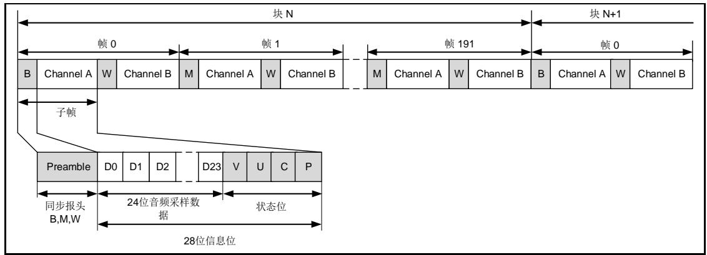

每个 SPDIF 块包含 192 帧数据，每个帧由左通道子帧（32 位）和右通道子帧（32 位）组成，每个子帧由 4bit 的 SOPD 模式、24bit 的数据信息和 4bit 的状态信息组成。

SOPD 模式编码参考 34-8. SOPD 。

表 34-8. SOPD 模式

<table><tr><td>预先状态(前一个半比特值)</td><td>0</td><td>1</td><td rowspan="2">描述</td></tr><tr><td>报头</td><td colspan="2">编码</td></tr><tr><td>B</td><td>11101000</td><td>00010111</td><td>通道A,且为一个块的起始子帧</td></tr><tr><td>W</td><td>11100100</td><td>00011011</td><td>通道B</td></tr><tr><td>M</td><td>11100010</td><td>00011101</td><td>通道A</td></tr></table>

SPDIF 的数据传输在 SAI_BxDATA 寄存器的数据填充应遵循：SAI_BxDATA[26:24]包含通道状态位、用户位和有效性位，SAI_BxDATA[23:0]包含所考虑通道的 24 位数据。

注意：如果数据大小为 20/16 位，应将数据映射到 SAI_BxDATA[23:4] /SAI_BxDATA[23:8]上。

通过配置 SAI_BxCFG0 寄存器中 OPTMOD[1]位为 0，强制选择为主模式，同时将忽略SAI_BxCFG0 寄存器中 DATAWD[2:0]数据位宽设置，强制设置为 24 位，通过时钟发生器配置符号率，并通过曼彻斯特协议进行编码。

SAI 首先在块中发送每个子帧的适当报头。随后在 SD 线上发送 SAI_BxDATA（以曼彻斯特协议进行编码）。SAI 通过传输按 34-9. 奇偶校验位来结束子帧。

表 34-9. 校验位奇数

<table><tr><td>SAI_BxDATA [26:0]</td><td>传输校验位 P 的值</td></tr><tr><td>奇数个 0</td><td>0</td></tr><tr><td>奇数个 1</td><td>1</td></tr></table>

对于 SPDIF 发生器，SAI 应提供一个符号率两倍的位时钟。通常情况下，音频采样率（FS）和比特时钟率（FSCK_X）之间的关系由以下公式给出：

$$
F _ {s} = \frac {F _ {S C K \_ x}}{1 2 8} \tag {34-6}
$$

比特时钟率由以下公式给出:

$$
F _ {S C K \_ x} = \frac {F _ {S A I \_ C K \_ x}}{M D I V} \tag {34-7}
$$

注意：仅当 SAI_BxCFG0 寄存器中 BYPASS 设置为 1 时，上述公式才有效。

# 34.3.12. 立体声/单声道

SAI音频子模块通过设置SAI_BxCFG0寄存器的MONO位进行立体声和单声道模式的转换。注意，如果选择单声道，则slot的个数必须配置为2，否则音频子模块的行为将不能保证。

当音频子模块配置为发送器时，在第一个slot（slot0）期间发送的数据将会复制到第二个slot（slot1），在这种情况下，FIFO的访问次数是立体声模式的一半。

当音频子模块配置成接收器时，在第一个slot期间接收到的数据被放入FIFO，第二个slot期间接收的数据将会被丢弃。

# 34.3.13. 静音

用户可以在一个帧传输期间的任何时候设置静音属性，这通过SAI_BxCFG1寄存器的MT位来配置，但是静音只会到下一个帧才生效。

如果SAI音频子模块作为发送器且已配置静音，当静音在下一个帧生效时，数据照常会从FIFO中取出，然后送入移位寄存器。唯一不同的是，SD输出是否强制为一个特定值，这个值由SAI_BxCFG1寄存器的MTVAL位决定。当MTVAL位为0时，在静音帧期间SD强制输出0，相反，当MTVAL置1时，SD输出行为得进一步根据slot总个数的配置。当slot总数小于或等于2时，静音有效的前一个帧内容会被赋值到当前静音帧。当slot总数大于2时，SD强制输出0。

配置成接收器的SAI音频子模块能够检测静音帧和产生相应的中断。一个静音帧计数器被应用到每个音频子模块上，如果接收到每个有效slot都为0的帧，那么这个帧就会被视为一个静音帧，内部的静音帧计数器增1。当SAI音频子模块使能或接收到一个非静音帧时，这个静音计数器就会复位。如果连续接收到的静音帧的个数达到SAI_BxCFG1寄存器MTFCNT位定义的值，则SAI_BxSTAT寄存器中的MTDET静音检测标志位就会置1，同时，如果使能了SAI_BxINTEN寄存器的MTDETIE位，则产生一个中断。

静音帧有效如 34-22. 所示。

图 34-22. 静音帧有效

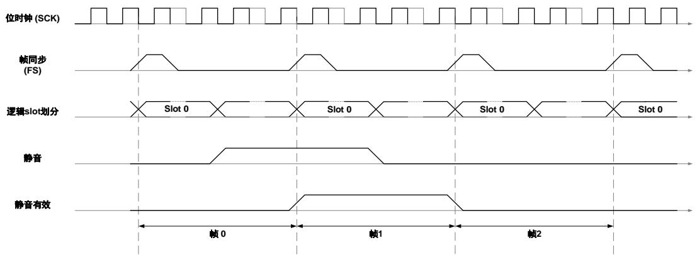

不同配置下SD输出行为概括在 34-10. 中。

表 34-10. 静音帧输出值

<table><tr><td>Slot个数</td><td>MTVAL=1</td><td>MTVAL=0</td></tr><tr><td>≤2</td><td>静音有效前的一个帧内容被赋值到SD线上输出</td><td>强制为0</td></tr><tr><td>&gt;2</td><td>强制为0</td><td>强制为0</td></tr></table>

# 34.3.14. 压缩扩展器

压缩扩展器仅仅是一个系统，里面的信息首先经过压缩，然后在一个有限带宽的通道上传输，最后在接收端进行扩展。它常被用于减小传输电话优质语音所需的带宽，它能将13位数据压缩成8位密语，该密语由1位符号位，3位量化级以及4位分量组成。有两个支持将信号数据编码成8位编码的国际标准：A-law和Mu-law。A-law是欧洲所公认的标准，Mu-law是美国和日本所公认的标准。

A-law和Mu-law都可以应用在SAI上，这需要通过对SAI_BxCFG1寄存器进行配置来选择。音频子模块根据操作模式（OPTMOD）来选择压缩还是扩展。当音频子模块配置为发送器时，即选择压缩，相反，如果配成接收器，则选择扩展。用户可以通过设置SAI_BxCFG1寄存器的补码模式（CPLMOD）来选择1或者2的补码作为默认的数据表示。在发送模式时，无论选择哪种压缩模式，硬件首先将补码表示转换成符号量值表示，然后再送入压缩扩展器。在接收模式时，线性输出的数据从符号量值表示转换成补码表示，然后存储到FIFO中。

图 34-23. 压缩扩展数据通路

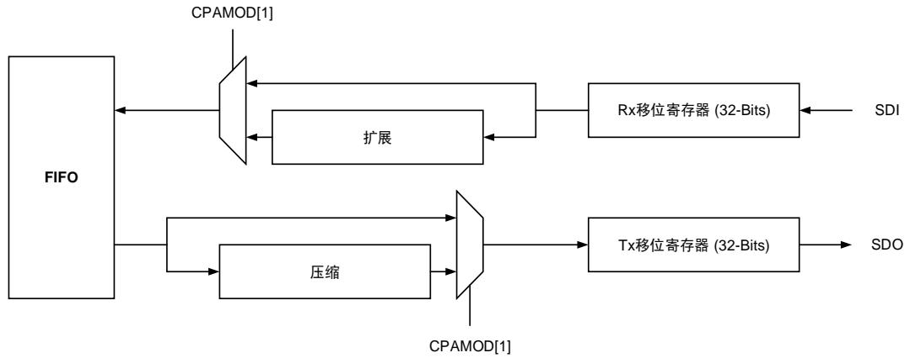

# A-law 压缩扩展

A-law是CCITT推荐的压缩扩展标准，在欧洲被广泛地使用，它将线性样本值限制在12位量级。34-11. A-law 阐述了A-law编码算法，线性输入数据用符号量表示，用S代指这个符号，之后的12位表示量级。编码后输出8位宽，且按MSB表示这个符号，下表中两端的符号位S不是同一个值。A、B、C、D取0或1，x代表不关心。

表 34-11. A-law 编码

<table><tr><td colspan="13">线性输入数据</td><td colspan="8">A-law编码输出</td></tr><tr><td>S</td><td>0</td><td>0</td><td>0</td><td>0</td><td>0</td><td>0</td><td>0</td><td>A</td><td>B</td><td>C</td><td>D</td><td>X</td><td>S</td><td>0</td><td>0</td><td>0</td><td>A</td><td>B</td><td>C</td><td>D</td></tr><tr><td>S</td><td>0</td><td>0</td><td>0</td><td>0</td><td>0</td><td>0</td><td>1</td><td>A</td><td>B</td><td>C</td><td>D</td><td>X</td><td>S</td><td>0</td><td>0</td><td>1</td><td>A</td><td>B</td><td>C</td><td>D</td></tr><tr><td>S</td><td>0</td><td>0</td><td>0</td><td>0</td><td>0</td><td>1</td><td>A</td><td>B</td><td>C</td><td>D</td><td>X</td><td>X</td><td>S</td><td>0</td><td>1</td><td>0</td><td>A</td><td>B</td><td>C</td><td>D</td></tr><tr><td>S</td><td>0</td><td>0</td><td>0</td><td>0</td><td>1</td><td>A</td><td>B</td><td>C</td><td>D</td><td>X</td><td>X</td><td>X</td><td>S</td><td>0</td><td>1</td><td>1</td><td>A</td><td>B</td><td>C</td><td>D</td></tr><tr><td>S</td><td>0</td><td>0</td><td>0</td><td>1</td><td>A</td><td>B</td><td>C</td><td>D</td><td>X</td><td>X</td><td>X</td><td>X</td><td>S</td><td>1</td><td>0</td><td>0</td><td>A</td><td>B</td><td>C</td><td>D</td></tr><tr><td>S</td><td>0</td><td>0</td><td>1</td><td>A</td><td>B</td><td>C</td><td>D</td><td>X</td><td>X</td><td>X</td><td>X</td><td>X</td><td>S</td><td>1</td><td>0</td><td>1</td><td>A</td><td>B</td><td>C</td><td>D</td></tr><tr><td>S</td><td>0</td><td>1</td><td>A</td><td>B</td><td>C</td><td>D</td><td>X</td><td>X</td><td>X</td><td>X</td><td>X</td><td>X</td><td>S</td><td>1</td><td>1</td><td>0</td><td>A</td><td>B</td><td>C</td><td>D</td></tr><tr><td>S</td><td>1</td><td>A</td><td>B</td><td>C</td><td>D</td><td>X</td><td>X</td><td>X</td><td>X</td><td>X</td><td>X</td><td>X</td><td>S</td><td>1</td><td>1</td><td>1</td><td>A</td><td>B</td><td>C</td><td>D</td></tr></table>

输入的数据在经过表中定义的逻辑编码后，一个反向模式应用到这个8位编码上来增加传输线上的转变密度，这对硬件性能有益。8位编码与0x55异或后再应用这个反向模式。

对A-law编码的数据进行解码从本质上来说是编码步骤的颠倒问题。 34-12. A-law 说明了A-law解码算法，它在反向模式颠倒之后应用。在编码过程中丢弃的最低有效位近似的取间隔的中间值。这在线性输出数据中体现为D后紧接着的1…0。

表 34-12. A-law 解码

<table><tr><td colspan="8">A-law编码输入</td><td colspan="13">线性输出数据</td></tr><tr><td>S</td><td>0</td><td>0</td><td>0</td><td>A</td><td>B</td><td>C</td><td>D</td><td>S</td><td>0</td><td>0</td><td>0</td><td>0</td><td>0</td><td>0</td><td>0</td><td>A</td><td>B</td><td>C</td><td>D</td><td>1</td></tr><tr><td>S</td><td>0</td><td>0</td><td>1</td><td>A</td><td>B</td><td>C</td><td>D</td><td>S</td><td>0</td><td>0</td><td>0</td><td>0</td><td>0</td><td>0</td><td>1</td><td>A</td><td>B</td><td>C</td><td>D</td><td>1</td></tr><tr><td>S</td><td>0</td><td>1</td><td>0</td><td>A</td><td>B</td><td>C</td><td>D</td><td>S</td><td>0</td><td>0</td><td>0</td><td>0</td><td>0</td><td>1</td><td>A</td><td>B</td><td>C</td><td>D</td><td>1</td><td>0</td></tr><tr><td>S</td><td>0</td><td>1</td><td>1</td><td>A</td><td>B</td><td>C</td><td>D</td><td>S</td><td>0</td><td>0</td><td>0</td><td>0</td><td>1</td><td>A</td><td>B</td><td>C</td><td>D</td><td>1</td><td>0</td><td>0</td></tr><tr><td>S</td><td>1</td><td>0</td><td>0</td><td>A</td><td>B</td><td>C</td><td>D</td><td>S</td><td>0</td><td>0</td><td>0</td><td>1</td><td>A</td><td>B</td><td>C</td><td>D</td><td>1</td><td>0</td><td>0</td><td>0</td></tr><tr><td>S</td><td>1</td><td>0</td><td>1</td><td>A</td><td>B</td><td>C</td><td>D</td><td>S</td><td>0</td><td>0</td><td>1</td><td>A</td><td>B</td><td>C</td><td>D</td><td>1</td><td>0</td><td>0</td><td>0</td><td>0</td></tr><tr><td>S</td><td>1</td><td>1</td><td>0</td><td>A</td><td>B</td><td>C</td><td>D</td><td>S</td><td>0</td><td>1</td><td>A</td><td>B</td><td>C</td><td>D</td><td>1</td><td>0</td><td>0</td><td>0</td><td>0</td><td>0</td></tr><tr><td>S</td><td>1</td><td>1</td><td>1</td><td>A</td><td>B</td><td>C</td><td>D</td><td>S</td><td>1</td><td>A</td><td>B</td><td>C</td><td>D</td><td>1</td><td>0</td><td>0</td><td>0</td><td>0</td><td>0</td><td>0</td></tr></table>

# Mu-Law 压缩扩压

美国和日本使用Mu-law压缩扩压标准，将线性样本值限制在13位量级。Mu-law的编码和解码过程和A-law类似，不过还是有一些值得注意的差异：

1. Mu-law编码器一般操作在13位量级数据，而A-law为12位量级数据；

2. 在量化级计算之前，一个值为33的偏差被加到线性输入数据的绝对值上，用来简化量化值和分量的计算；

3. 符号位的定义是相反的，也就说，输入符号位和输出符号位相反；

4. 反向模式应用在8位编码的所有比特位上。

34-13. Mu-law 阐述了Mu-law编码算法，线性输入数据的符号位S取编码数据符号位的相反值。

表 34-13. Mu-law 编码

<table><tr><td colspan="14">线性输入数据</td><td colspan="8">Mu-law编码输出</td></tr><tr><td>S</td><td>0</td><td>0</td><td>0</td><td>0</td><td>0</td><td>0</td><td>0</td><td>1</td><td>A</td><td>B</td><td>C</td><td>D</td><td>X</td><td>~S</td><td>0</td><td>0</td><td>0</td><td>A</td><td>B</td><td>C</td><td>D</td></tr><tr><td>S</td><td>0</td><td>0</td><td>0</td><td>0</td><td>0</td><td>0</td><td>1</td><td>A</td><td>B</td><td>C</td><td>D</td><td>X</td><td>X</td><td>~S</td><td>0</td><td>0</td><td>1</td><td>A</td><td>B</td><td>C</td><td>D</td></tr><tr><td>S</td><td>0</td><td>0</td><td>0</td><td>0</td><td>0</td><td>1</td><td>A</td><td>B</td><td>C</td><td>D</td><td>X</td><td>X</td><td>X</td><td>~S</td><td>0</td><td>1</td><td>0</td><td>A</td><td>B</td><td>C</td><td>D</td></tr><tr><td>S</td><td>0</td><td>0</td><td>0</td><td>0</td><td>1</td><td>A</td><td>B</td><td>C</td><td>D</td><td>X</td><td>X</td><td>X</td><td>X</td><td>~S</td><td>0</td><td>1</td><td>1</td><td>A</td><td>B</td><td>C</td><td>D</td></tr><tr><td>S</td><td>0</td><td>0</td><td>0</td><td>1</td><td>A</td><td>B</td><td>C</td><td>D</td><td>X</td><td>X</td><td>X</td><td>X</td><td>X</td><td>~S</td><td>1</td><td>0</td><td>0</td><td>A</td><td>B</td><td>C</td><td>D</td></tr><tr><td>S</td><td>0</td><td>0</td><td>1</td><td>A</td><td>B</td><td>C</td><td>D</td><td>X</td><td>X</td><td>X</td><td>X</td><td>X</td><td>X</td><td>~S</td><td>1</td><td>0</td><td>1</td><td>A</td><td>B</td><td>C</td><td>D</td></tr><tr><td>S</td><td>0</td><td>1</td><td>A</td><td>B</td><td>C</td><td>D</td><td>X</td><td>X</td><td>X</td><td>X</td><td>X</td><td>X</td><td>X</td><td>~S</td><td>1</td><td>1</td><td>0</td><td>A</td><td>B</td><td>C</td><td>D</td></tr><tr><td>S</td><td>1</td><td>A</td><td>B</td><td>C</td><td>D</td><td>X</td><td>X</td><td>X</td><td>X</td><td>X</td><td>X</td><td>X</td><td>X</td><td>~S</td><td>1</td><td>1</td><td>1</td><td>A</td><td>B</td><td>C</td><td>D</td></tr></table>

输入数据通过上表定义的算法编码之后，一个反向模式应用到这个8位编码上来增加传输线上的密度，这对硬件性能有益。8位编码与0xFF异或后再应用这个反向模式。

Mu-law的解码本质上是编码步骤的颠倒问题。 34-14. Mu-law 说明了Mu-law解码过程，它应用在反向模式颠倒之后。在编码处理中丢弃的最低有效位近似等于这个间隔的中间值。这在线性输出数据中体现为D后紧接着的1…0。

表 34-14. Mu-law 解码

<table><tr><td colspan="8">Mu-law 编码输入</td><td colspan="14">线性输出数据</td></tr><tr><td>S</td><td>0</td><td>0</td><td>0</td><td>A</td><td>B</td><td>C</td><td>D</td><td>~S</td><td>0</td><td>0</td><td>0</td><td>0</td><td>0</td><td>0</td><td>0</td><td>1</td><td>A</td><td>B</td><td>C</td><td>D</td><td>1</td></tr><tr><td>S</td><td>0</td><td>0</td><td>1</td><td>A</td><td>B</td><td>C</td><td>D</td><td>~S</td><td>0</td><td>0</td><td>0</td><td>0</td><td>0</td><td>0</td><td>1</td><td>A</td><td>B</td><td>C</td><td>D</td><td>1</td><td>0</td></tr><tr><td>S</td><td>0</td><td>1</td><td>0</td><td>A</td><td>B</td><td>C</td><td>D</td><td>~S</td><td>0</td><td>0</td><td>0</td><td>0</td><td>0</td><td>1</td><td>A</td><td>B</td><td>C</td><td>D</td><td>1</td><td>0</td><td>0</td></tr><tr><td>S</td><td>0</td><td>1</td><td>1</td><td>A</td><td>B</td><td>C</td><td>D</td><td>~S</td><td>0</td><td>0</td><td>0</td><td>0</td><td>1</td><td>A</td><td>B</td><td>C</td><td>D</td><td>1</td><td>0</td><td>0</td><td>0</td></tr><tr><td>S</td><td>1</td><td>0</td><td>0</td><td>A</td><td>B</td><td>C</td><td>D</td><td>~S</td><td>0</td><td>0</td><td>0</td><td>1</td><td>A</td><td>B</td><td>C</td><td>D</td><td>1</td><td>0</td><td>0</td><td>0</td><td>0</td></tr><tr><td>S</td><td>1</td><td>0</td><td>1</td><td>A</td><td>B</td><td>C</td><td>D</td><td>~S</td><td>0</td><td>0</td><td>1</td><td>A</td><td>B</td><td>C</td><td>D</td><td>1</td><td>0</td><td>0</td><td>0</td><td>0</td><td>0</td></tr><tr><td>S</td><td>1</td><td>1</td><td>0</td><td>A</td><td>B</td><td>C</td><td>D</td><td>~S</td><td>0</td><td>1</td><td>A</td><td>B</td><td>C</td><td>D</td><td>1</td><td>0</td><td>0</td><td>0</td><td>0</td><td>0</td><td>0</td></tr><tr><td>S</td><td>1</td><td>1</td><td>1</td><td>A</td><td>B</td><td>C</td><td>D</td><td>~S</td><td>1</td><td>A</td><td>B</td><td>C</td><td>D</td><td>1</td><td>0</td><td>0</td><td>0</td><td>0</td><td>0</td><td>0</td><td>0</td></tr></table>

# 34.3.15. 输出驱动

SAI可以根据SAI使能状态独立驱动每个音频子模块的帧同步（FS）、串行时钟（SCK）和串行数据（SD），这通过配置SAI_BxCFG0寄存器的输出驱动（ODRIV）来实现。

输出驱动的设定必须在SAI寄存器配置之后、SAI使能之前进行配置。

# 34.3.16. IO 管理

IO管理模块连接SAI的两个音频子模块，它也是两者进行连接的唯一中介。当通过设置SAI_BxCFG0寄存器的同步模式位（SYNCMOD）将音频子模块配置成与另一个子模块同步时，它们的FS、SCK和MCLK引脚会共用，同步子模块的这些引脚会释放，并可用作通用IO。当一个音频模块配置为与另一个音频模块同步时，那么它必须配成从设备。

当一个音频子模块作为发送器，且与另一个作为接收器的音频子模块同步的时候，如果它被配置为主设备，那么同步子模块会通过IO管理模块接收来自异步模块的FS和SCK信号，如果它被配置为从设备，那么会接收来自外部IO的FS和SCK信号。这个功能在双工模式中是非常有用的。

# 34.3.17. DMA 接口

每一个音频子模块都拥有自己的DMA接口。DMA访问的使能通过SAI_BxCFG0寄存器的DMA使能位（DMAEN）进行配置。DMA请求和FIFO请求（FFREQ）一起产生，而FIFO请求产生状态取决于FIFO阈值（FFTH）和FIFO状态（FFSTAT），这在使用DMA突发传输时是非常重要的。当音频子模块配成发送模式时，FIFO阈值必须设成一个特定的值，以保证在最坏的情况下也有足够的剩余空间来实现一个完整的DMA突发写操作，否则有可能出现FIFO上溢错误。当音频子模块配成接收模式时，FIFO阈值必须设成一个特定的值，以保证FIFO中有足够的数据来实现一个完整的DMA突发读操作，从而避免出现FIFO下溢错误。

DMA的方向和音频子模块的操作配置相关。当配置为发送器时，DMA请求将数据从数据寄存器SAI_BxDATA中加载到内部FIFO中。当配置为接收器时，DMA请求将数据从内部FIFO读到数据寄存器SAI_BxDATA中。

注意：DMA SAI通道必须在SAI寄存器配置之后使能。

# 34.3.18. 使能/失能

SAI音频子模块通过设置SI_BxCFG0寄存器的SAIEN位来使能，用户必须确保这个操作在音频子模块配置之后进行，SAI不支持在已经使能后再进行配置，否则将不能保证硬件行为的正确。从音频子模块必须在主音频模块使能前使能。

用户可以在有效帧传输期间的任何时候失能音频子模块，只是必须等到当前帧结束后才完全失能。

# 34.3.19. 错误标志位

# 时钟错误配置检查

时钟错误配置检测机制只有在音频子模块配置为主设备，并且时钟分频旁路（BYPASS）为0时才会使能。在这个操作模式下，用户必须保证帧宽（FWD+1）等于8到256之间且等于2的几次幂的一个值，否则状态寄存器SAI_BxSTAT中的时钟错误标志位（ERRCK）将会被置位。帧宽必须设置为2的几次幂，这是为确保在每个位时钟周期（SCK）中包含整数个主时钟（MCLK），以使得声音质量更好。

如果将中断使能寄存器SAI_BxINTEN中的时钟错误配置检测中断使能位（ERRCKIE）置1，则在出现时钟错误配置时会产生中断。

当检测到时钟错误时，SAI音频子模块将自动失能，即SAI_BxCFG0寄存器的SAIEN位被硬件清零。

# 音频编解码器未就绪检测

音频子模块只有在使用AC’97协议，并选择为接收器时才会检测音频编解码器未就绪状态。音频子模块从TAG（slot0）中读取音频编解码器就绪状态标志，当接收到的TAG的位15为0时，状态寄存器SAI_BxSTAT寄存器的ACNRDY会被置1，如果设置了SAI_BxINTEN中断使能寄存器中的ACNRDYIE音频编解码未就绪中断位，则产生一个中断。当检测到音频编解码器未就绪时，当前帧的后续slot的内容将不会被送入FIFO中。

音频编解码器未就绪检测标志位通过设置SAI_BxINTC寄存器的ACNRDYC位来清除。

# 帧同步提前检测

音频子模块只有在配置为从设备时，才会使能帧同步提前检测机制，由于从设备才接收FS信号，FS信号到达时间对当前数据的解析至关重要。帧同步提前检测是可能的，因为帧宽、帧有效极性和帧偏移在音频子模块使能前已经确定。

帧同步提前对当前帧是没有影响的，因为FS有效边沿只有在帧结束时才能预料到。

当状态寄存器SAI_BxSTAT中的帧同步提前检测标志位（FSDET）和中断使能寄存器SAI_bxINTEN中的帧同步提前检测中断使能位都置1时，产生中断。

在出现帧同步提前后，需要按照下面的步骤来进行重新同步：

1. 失能音频子模块，用户必须等到相应的音频子模块的SAIEN控制字段完全失能；

2. 设置FLUSH控制字段刷新内部FIFO；

3. 设置SAIEN再一次使能音频子模块；

4. 等待FS重新同步。

注意： 在AC’97配置模式中，这个标志位不会产生，因为SAI仅作为一个链路控制器，即使音频子模块配置为从设备，也会生成FS信号。

图34-24. 帧同步提前检测示意图

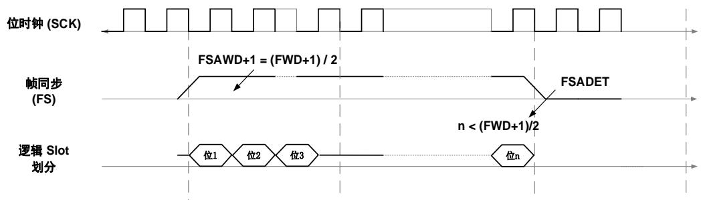

# 帧同步滞后检测

音频子模块只有在配置为从设备时，才会使能帧同步滞后检测机制，由于从设备才接收FS信号，FS信号到达时间对当前数据的解析至关重要。帧同步滞后检测是可能的，因为帧宽、帧有效极性和帧偏移在音频子模块使能前已经确定。

帧同步滞后可能的原因有主设备的延迟产生、外因延迟、噪音感应故障。错误的FS时序将会破坏音频子模块内部有限状态机，从而影响数据的正确传输。

当状态寄存器SAI_BxSTAT中的帧滞后提前检测标志位（FSPDET）和中断使能寄存器SAI_bxINTEN中的帧同步滞后检测中断使能位都置1时，产生中断。

为了和主设备重新同步，需要应用重新同步的步骤。

注意： 在AC’97配置模式中，这个标志位不会产生，因为SAI仅作为一个链路控制器，即使音频子模块配置为从设备，也会生成FS信号。

图34-25. 帧同步滞后检测示意图

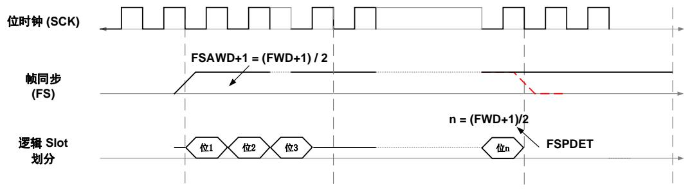

# FIFO上溢或下溢检测

FIFO上溢和下溢标志位（OUERR）在SAI_BxSTAT状态寄存器中占同一个位，因为每个音频子模块只能配置成发送或接收。

当音频子模块配置成发送器时，在有效帧传输过程中如果FIFO为空，并且发送一个空的数据的slot，则产生下溢。如果中断使能寄存器SAI_BxINTEN的上溢或下溢中断使能位（OUERRIE）置位，则产生中断。如果发生下溢，一个重新同步过程需要按如下所示步骤进行：

1. 失能音频子模块，用户必须等到相应的音频子模块的SAIEN控制字段完全失能；

2. 设置FLUSH控制字段刷新内部FIFO；

3. 将要发送的数据填充到FIFO中；

4. 设置SAIEN再一次使能音频子模块。

通过设置SAI_BxINTC寄存器的OUERRC位来清除下溢标志位。

当音频子模块配置为接收器时，在帧传输过程中如果FIFO已满，并有一个新的slot数据接收时，发生上溢。当上溢发生时，最新接收的数据将被丢弃，也不会写值到FIFO。如果中断使能寄存器SAI_BxINTEN的上溢或下溢中断使能位（OUERRIE）置位，则产生中断。

通过设置SAI_BxINTC寄存器的OUERRC位来清除上溢标志位

注意：当DMA使能时，用户必须保证正确的DMA配置，尤其是使用DMA突发操作的时候，否则上溢和下溢都可能发生在发送或接收操作模式中。

# 34.3.20. 中断

34-15. 概括了每个音频子模块出现的所有中断源

表 34-15. 中断控制

<table><tr><td>中断源</td><td>中断划分</td><td>中断出现条件</td><td>中断使能控制</td><td>中断清除控制</td></tr><tr><td>FFREQ</td><td>请求</td><td>OPTMOD为任意值</td><td>FFREQIE</td><td>读或写SAI_BxDATA</td></tr><tr><td>MTDET</td><td>静音</td><td>OPTMOD为接收方</td><td>MTDETIE</td><td>MTDETC</td></tr><tr><td>ERRCK</td><td>错误</td><td>OPTMOD为主模式; BYPASS = 0</td><td>ERRCKIE</td><td>ERRCKC</td></tr><tr><td>ACNRDY</td><td>错误</td><td>OPTMOD为从模式; PROT = AC&#x27;97</td><td>ACNRDYIE</td><td>ACNRDYC</td></tr><tr><td>FSADET</td><td>错误</td><td>OPTMOD为从模式; PROT ≠AC&#x27;97</td><td>FSADETIE</td><td>FSADETC</td></tr><tr><td>FSPDET</td><td>错误</td><td>OPTMOD为从模式; PROT ≠AC&#x27;97</td><td>FSPDETIE</td><td>FSPDETC</td></tr><tr><td>OUERR</td><td>错误</td><td>OPTMOD为任意值</td><td>OUERRIE</td><td>OUERRC</td></tr></table>

使用下面所列的过程可以使得音频子模块从错误中断中恢复：

1. 使能相应的中断；

2. 配置SAI功能寄存器；

3. 使能中断；

4. 使能SAI音频子模块。

# 10： Slot 为 32 位宽

# 11： 保留.

Slot 的位宽必须大于或等于数据位宽才能包含一个数据，否则 SAI 的行为将不能保证正确。

注意：该控制位必须在音频子模块使能前配置。

注意：该控制位在 AC’97或 SPDIF 模式中没有意义。

5 保留 必须保持复位值。

4:0 DATAOST[4:0] 数据偏移

定义了在一个有效 slot 中第一个数据位的出现位置，在发送模式时，偏移区和空白区的 SD 输出 0 或 Hi-Z，这取决于 SDOM 和附近 slot 的有效状态。在接收模式时，偏移区和空白区的数据内容将会忽略。

注意：该控制位必须在音频子模块使能前配置。

注意：该控制位在 AC’97 模式中没有意义。

# 34.4.6. 子模块 x 中断使能寄存器（SAI_BxINTEN）（x = 0, 1）

地址偏移：0x14 + 0x20 * x

复位值：0x0000 0000

该寄存器只能按字（32位）访问。

<table><tr><td>31</td><td>30</td><td>29</td><td>28</td><td>27</td><td>26</td><td>25</td><td>24</td><td>23</td><td>22</td><td>21</td><td>20</td><td>19</td><td>18</td><td>17</td><td>16</td></tr><tr><td colspan="16">保留</td></tr></table>

<table><tr><td>15</td><td>14</td><td>13</td><td>12</td><td>11</td><td>10</td><td>9</td><td>8</td><td>7</td><td>6</td><td>5</td><td>4</td><td>3</td><td>2</td><td>1</td><td>0</td></tr><tr><td></td><td></td><td></td><td></td><td>保留</td><td></td><td></td><td></td><td></td><td>FSPDETI E</td><td>FSADETI E</td><td>ACNRDYI E</td><td>FFREQIE</td><td>ERRCKIE</td><td>MTDETIE</td><td>OUERRI E</td></tr><tr><td></td><td></td><td></td><td></td><td></td><td></td><td></td><td></td><td></td><td>rw</td><td>rw</td><td>rw</td><td>rw</td><td>rw</td><td>rw</td><td>rw</td></tr></table>

位/位域 名称 说明

<table><tr><td>31:7</td><td>保留</td><td>必须保持复位值。</td></tr><tr><td>6</td><td>FSPDETIE</td><td>帧同步滞后检测中断使能0: 中断失能1: 中断使能如果 FSPDET 和 FSPDETIE 都置 1,则产生中断。注意: 当音频子模块配置为主模式时,该控制位无意义。注意: 该控制位在 AC&#x27;97 模式中没有意义。</td></tr><tr><td>5</td><td>FSADETIE</td><td>帧同步提前检测中断使能0: 中断失能1: 中断使能如果 FSADET 和 FSADETIE 都置 1,则产生中断。注意: 当音频子模块配置为主模式时,该控制位无意义。注意: 该控制位在 AC&#x27;97 模式中没有意义。</td></tr></table>

<table><tr><td>4</td><td>ACNRDYIE</td><td>音频编解码器未就绪中断使能0: 中断失能1: 中断使能如果 ACNRDY 和 ACNRDYIE 都置 1,则产生中断。注意: 当音频子模块配置为接收器时,该控制位才有意义。注意: 该控制位只有在选择 AC&#x27;97 模式时才有意义。</td></tr><tr><td>3</td><td>FFREQIE</td><td>FIFO 请求中断使能0: 中断失能1: 中断使能如果 FFREQ 和 FFREQIE 都置 1,则产生中断。注意: 当音频子模块配置为接收器时,OPTMOD 必须在 FFREQIE 使能之前设置,以保证不会产生错误的 FIFO 请求,因为音频子模块在复位之后默认处于发送模式。</td></tr><tr><td>2</td><td>ERRCKIE</td><td>错误时钟中断使能,该位通过软件置 1 和清 00: 中断失能1: 中断使能如果 ERRCK 和 ERRCK 都置 1,则产生中断。注意: 该控制位只有当子模块配置为发送器,并且 BYPASS 置 0 时才可时钟分频逻辑相关。注意: 该控制位只用于 TDM 模式,在其他模式中是没有意义的。</td></tr><tr><td>1</td><td>MTDETIE</td><td>静音检测中断使能0: 中断失能1: 中断使能如果 MTDET 和 MTDETIE 都置 1,则产生中断。注意: 该控制位只有在音频子模块配置为接收器时才有意义。</td></tr><tr><td>0</td><td>OUERRIE</td><td>FIFO 上溢或下溢中断使能0: 中断失能1: 中断使能如果 OUERR 和 OUERRIE 都置 1,则产生中断。</td></tr></table>

# 34.4.7. 子模块 x 状态寄存器（SAI_BxSTAT）（x = 0, 1）

地址偏移：0x18 + 0x20 * x

复位值：0x0000 0008

该寄存器只能按字（32位）访问。

<table><tr><td>31</td><td>30</td><td>29</td><td>28</td><td>27</td><td>26</td><td>25</td><td>24</td><td>23</td><td>22</td><td>21</td><td>20</td><td>19</td><td>18</td><td>17</td><td>16</td></tr><tr><td colspan="13">保留</td><td colspan="3">FFSTAT[2:0]</td></tr><tr><td colspan="16">r</td></tr><tr><td>15</td><td>14</td><td>13</td><td>12</td><td>11</td><td>10</td><td>9</td><td>8</td><td>7</td><td>6</td><td>5</td><td>4</td><td>3</td><td>2</td><td>1</td><td>0</td></tr><tr><td colspan="9">保留</td><td>FSPDET</td><td>FSADET</td><td>ACNRDY</td><td>FFREQ</td><td>ERRCK</td><td>MTDET</td><td>OUERR</td></tr></table>

<table><tr><td>位/位域</td><td>名称</td><td>说明</td></tr><tr><td>31:19</td><td>保留</td><td>必须保持复位值。</td></tr><tr><td>18:16</td><td>FFSTAT[2:0]</td><td>FIFO 状态指示 FIFO 的满/空状态,它由硬件单独控制,根据音频子模块的操作模式有着不同的评估标准。在 OPTMOD 配置为接收器的情况下:000:空001:空 &lt;FIFO 级别&lt;= 1/4 满010:1/4 满 &lt;FIFO 级别&lt;= 1/2 满011:1/2 满 &lt;FIFO 级别&lt;= 3/4 满100:3/4 满 &lt;FIFO 级别&lt; 全满101:全满在 OPTMOD 配置为发送器的情况下:000:空001:空 &lt;FIFO 级别&lt; 1/4 满.010:1/4 满 &lt;= FIFO 级别&lt; 1/2 满011:1/2 满 &lt;= FIFO 级别&lt; 3/4 满100:3/4 满 &lt;= FIFO 级别&lt; 全满101:全满</td></tr><tr><td>15:7</td><td>保留</td><td>必须保持复位值。</td></tr><tr><td>6</td><td>FSPDET</td><td>帧同步滞后检测0:收到正确的 FS 边沿1:FS 边沿滞后接收如果 FSPDETIE 置 1,FS 边沿接收滞后将产生中断。该标志位由 FSPDETC 控制位进行清 0。注意:当音频子模块配置为接收器时,该控制位才有意义</td></tr><tr><td>5</td><td>FSADET</td><td>帧同步提前检测0:收到正确的 FS 边沿1:FS 边沿提前接收如果 FSADETIE 置 1,FS 边沿接收提前将产生中断。该标志位由 FSADETC 控制位进行清 0。注意:当音频子模块配置为接收器时,该控制位才有意义。</td></tr><tr><td>4</td><td>ACNRDY</td><td>音频编解码器未就绪0:AC'97 音频编解码器就绪1:AC'97 音频编解码器未就绪每个帧的 TAG slot 的位 15 是 AC'97 音频编解码器就绪指示位,0 表示音频编解码器未就绪,反之,1 表示就绪。如果 ACNRDYIE 置 1,AC'97 音频编解码器未就绪将产生中断。该标志位由 ACNRDYC 控制位进行清 0。注意:该控制位只有在 AC'97 模式中才有用。</td></tr><tr><td>3</td><td>FFREQ</td><td>FIFO 请求0:没有FIFO请求1:FIFO写或读请求如果FFREQIE置1,FIFO请求将产生中断。FIFO的请求类型取决于音频子模块的配置,当OPTMOD配置为发送器,并且所有的条件满足,则产生写请求,如果配置为接收器时,则产生读请求。</td></tr><tr><td>2</td><td>ERRCK</td><td>时钟错误0:正确的时钟配置1:错误的时钟配置如果ERRCKIE置1,时钟配置错误将产生中断。该标志位由ERRCKC控制位进行清0。该控制位只有当音频子模块配置为主模式且BYPASS置0时才有意义。</td></tr><tr><td>1</td><td>MTDET</td><td>静音检测0:没检测到静音1:检测到静音如果MTDETIE置1,检测到静音将产生中断。该标志位由MTDETC控制位进行清0。当接收到slot全为0的帧的个数达到MTFCNT中定义的帧数时,静音检测标志位置1.当slot数小于2,且MTVAL置1时,将不能检测到静音,在发送器中,在静音之前的帧将被重复传输。</td></tr><tr><td>0</td><td>OUERR</td><td>上溢或下溢0:未检测到FIFO上溢或下溢1:检测到FIFO上溢或下溢如果OUERRIE置1,FIFO上溢或下溢将产生中断。该标志位由OUERRC控制位进行清0。当音频子模块配置为接收器时,如果将接收到的数据存入已满FIFO,则产生FIFO上溢。当音频子模块配置为发送时,如果在FIFO为空出现传输请求,则产生FIFO下溢。</td></tr></table>

# 34.4.8. 子模块 x 中断标志清除寄存器（SAI_BxINTC）（x = 0, 1）

地址偏移：0x1C + 0x20 * x

复位值：0x0000 0000

该寄存器只能按字（32位）访问。

<table><tr><td>31</td><td>30</td><td>29</td><td>28</td><td>27</td><td>26</td><td>25</td><td>24</td><td>23</td><td>22</td><td>21</td><td>20</td><td>19</td><td>18</td><td>17</td><td>16</td></tr><tr><td colspan="16">保留</td></tr><tr><td>15</td><td>14</td><td>13</td><td>12</td><td>11</td><td>10</td><td>9</td><td>8</td><td>7</td><td>6</td><td>5</td><td>4</td><td>3</td><td>2</td><td>1</td><td>0</td></tr><tr><td colspan="9">保留</td><td>FSPDET C</td><td>FSADET C</td><td>ACNRDY C</td><td>保留.</td><td>ERRCKC</td><td>MTDETC</td><td>OUERRC</td></tr><tr><td colspan="9"></td><td>rw</td><td>rw</td><td>rw</td><td></td><td>rw</td><td>rw</td><td>rw</td></tr></table>

位/位域 名称 说明

<table><tr><td>31:7</td><td>保留</td><td>必须保持复位值。</td></tr><tr><td>6</td><td>FSPDETC</td><td>帧同步滞后检测中断清除写1清除FSPDET标志位。注意:该控制位在AC&#x27;97模式中没用。注意:读该位将始终返回0。</td></tr><tr><td>5</td><td>FSADETC</td><td>帧同步提前检测中断清除写1清除FSADET标志位。注意:该控制位在AC&#x27;97模式中没用。注意:读该位将始终返回0。</td></tr><tr><td>4</td><td>ACNRDYC</td><td>音频编解码器未就绪中断清除写1清除ACNRDY标志位。注意:该控制位只用在AC&#x27;97模式中。注意:读该位将始终返回0。</td></tr><tr><td>3</td><td>保留</td><td>必须保持复位值。</td></tr><tr><td>2</td><td>ERRCKC</td><td>时钟错误中断清除写1清除ERRCK标志位。注意:该控制位只有在音频模块配置为主模式,并且BYPASS置0时才有用。注意:读该位将始终返回0。</td></tr><tr><td>1</td><td>MTDETC</td><td>静音检测中断清除写1清除MTDET标志位。注意:读该位将始终返回0。</td></tr><tr><td>0</td><td>OUERRC</td><td>上溢或下溢中断清除写1清除OUERR标志位。注意:读该位将始终返回0。</td></tr></table>

# 34.4.9. 子模块 x 数据寄存器（SAI_BxDATA）（x = 0, 1）

地址偏移：0x20 + 0x20 * x

复位值：0x0000 0000

该寄存器只能按字（32位）访问。

<table><tr><td>31</td><td>30</td><td>29</td><td>28</td><td>27</td><td>26</td><td>25</td><td>24</td><td>23</td><td>22</td><td>21</td><td>20</td><td>19</td><td>18</td><td>17</td><td>16</td></tr><tr><td colspan="16">DATA[31:16]</td></tr><tr><td colspan="16">rw</td></tr><tr><td>15</td><td>14</td><td>13</td><td>12</td><td>11</td><td>10</td><td>9</td><td>8</td><td>7</td><td>6</td><td>5</td><td>4</td><td>3</td><td>2</td><td>1</td><td>0</td></tr><tr><td colspan="16">DATA[15:0]</td></tr></table>

rw

<table><tr><td>位/位域</td><td>名称</td><td>说明</td></tr><tr><td>31:0</td><td>DATA[31:0]</td><td>数据</td></tr></table>

写和读操作直接体现在 FIFO中。

# 34.4.10. PDM 控制寄存器（SAI_PDM）

地址偏移：0x44

复位值：0x0000 0000

该寄存器只能按字（32位）访问。

<table><tr><td>31</td><td>30</td><td>29</td><td>28</td><td>27</td><td>26</td><td>25</td><td>24</td><td>23</td><td>22</td><td>21</td><td>20</td><td>19</td><td>18</td><td>17</td><td>16</td></tr><tr><td colspan="16">保留</td></tr><tr><td>15</td><td>14</td><td>13</td><td>12</td><td>11</td><td>10</td><td>9</td><td>8</td><td>7</td><td>6</td><td>5</td><td>4</td><td>3</td><td>2</td><td>1</td><td>0</td></tr><tr><td colspan="6">保留</td><td>CLKL1EN</td><td>CLKL0EN</td><td colspan="2">保留</td><td colspan="2">NBMIC</td><td colspan="3">保留</td><td>PDMEN</td></tr><tr><td colspan="6"></td><td>rw</td><td>rw</td><td colspan="2"></td><td colspan="2">rw</td><td colspan="3"></td><td>rw</td></tr></table>

<table><tr><td>位/位域</td><td>名称</td><td>说明</td></tr><tr><td>31:10</td><td>保留</td><td>必须保持复位值。</td></tr><tr><td>9</td><td>CLKL1EN</td><td>PDM时钟线1使能0:PDM时钟线1失能1:PDM时钟线1使能</td></tr><tr><td>8</td><td>CLKL0EN</td><td>PDM时钟线0使能0:PDM时钟线0失能1:PDM时钟线0使能</td></tr><tr><td>7:6</td><td>保留</td><td>必须保持复位值。</td></tr><tr><td>5:4</td><td>NBMIC</td><td>选择麦克风数量00:2个麦克风01:4个麦克风10:6个麦克风11:8个麦克风</td></tr><tr><td>3:1</td><td>保留</td><td>必须保持复位值。</td></tr><tr><td>0</td><td>PDMEN</td><td>PDM使能0:PDM失能1:PDM使能</td></tr></table>

# 34.4.11. PDM 配置寄存器（SAI_PDMCFG）

地址偏移：0x48

复位值：0x0000 0000

该寄存器只能按字（32位）访问。

<table><tr><td>31</td><td>30</td><td>29</td><td>28</td><td>27</td><td>26</td><td>25</td><td>24</td><td>23</td><td>22</td><td>21</td><td>20</td><td>19</td><td>18</td><td>17</td><td>16</td></tr><tr><td>保留</td><td colspan="3">DPR3[2:0]</td><td>保留</td><td colspan="3">DPL3[2:0]</td><td>保留</td><td colspan="3">DPR2[2:0]</td><td>保留</td><td colspan="3">DPL2[2:0]</td></tr><tr><td></td><td colspan="3">rw</td><td colspan="4">rw</td><td colspan="4">rw</td><td colspan="3">rw</td><td></td></tr><tr><td>15</td><td>14</td><td>13</td><td>12</td><td>11</td><td>10</td><td>9</td><td>8</td><td>7</td><td>6</td><td>5</td><td>4</td><td>3</td><td>2</td><td>1</td><td>0</td></tr><tr><td>保留</td><td colspan="3">DPR1[2:0]</td><td>保留</td><td colspan="3">DPL1[2:0]</td><td>保留</td><td colspan="3">DPR0[2:0]</td><td>保留</td><td colspan="3">DPL0[2:0]</td></tr><tr><td></td><td colspan="3">rw</td><td colspan="4">rw</td><td colspan="4">rw</td><td colspan="3">rw</td><td></td></tr></table>

<table><tr><td>位/位域</td><td>名称</td><td>说明</td></tr><tr><td>31</td><td>保留</td><td>必须保持复位值。</td></tr><tr><td>30:28</td><td>DPR3[2:0]</td><td>第三组麦克风右通道数据流延迟周期000:无延迟010:延迟1个<eq>T_{SAI\_CK}</eq>周期...111:延迟7个<eq>T_{SAI\_CK}</eq>周期</td></tr><tr><td>27</td><td>保留</td><td>必须保持复位值。</td></tr><tr><td>26:24</td><td>DPL3[2:0]</td><td>第三组麦克风左通道数据流延迟周期000:无延迟010:延迟1个<eq>T_{SAI\_CK}</eq>周期...111:延迟7个<eq>T_{SAI\_CK}</eq>周期</td></tr><tr><td>23</td><td>保留</td><td>必须保持复位值。</td></tr><tr><td>22:20</td><td>DPR2[2:0]</td><td>第二组麦克风右通道数据流延迟周期000:无延迟010:延迟1个<eq>T_{SAI\_CK}</eq>周期...111:延迟7个<eq>T_{SAI\_CK}</eq>周期</td></tr><tr><td>19</td><td>保留</td><td>必须保持复位值。</td></tr><tr><td>18:16</td><td>DPL2[2:0]</td><td>第二组麦克风左通道数据流延迟周期000:无延迟010:延迟1个<eq>T_{SAI\_CK}</eq>周期...111:延迟7个<eq>T_{SAI\_CK}</eq>周期</td></tr><tr><td>15</td><td>保留</td><td>必须保持复位值。</td></tr><tr><td>14:12</td><td>DPR1[2:0]</td><td>第一组麦克风右通道数据流延迟周期000:无延迟010:延迟1个<eq>T_{SAI\_CK}</eq>周期...111:延迟7个<eq>T_{SAI\_CK}</eq>周期</td></tr><tr><td>11</td><td>保留</td><td>必须保持复位值。</td></tr><tr><td>10:8</td><td>DPL1[2:0]</td><td>第一组麦克风左通道数据流延迟周期000:无延迟</td></tr></table>

010：延迟 1 个 TSAI_CK 周期

111：延迟 7 个 TSAI_CK 周期

7 保留 必须保持复位值。

6:4 DPR0[2:0] 第零组麦克风右通道数据流延迟周期

000：无延迟

010：延迟 1 个 TSAI_CK 周期

111：延迟 7 个 TSAI_CK 周期

3 保留 必须保持复位值。

2:0 DPL0[2:0] 第零组麦克风左通道数据流延迟周期

000：无延迟

010：延迟 1 个 TSAI_CK 周期

111：延迟 7 个 TSAI_CK 周期

