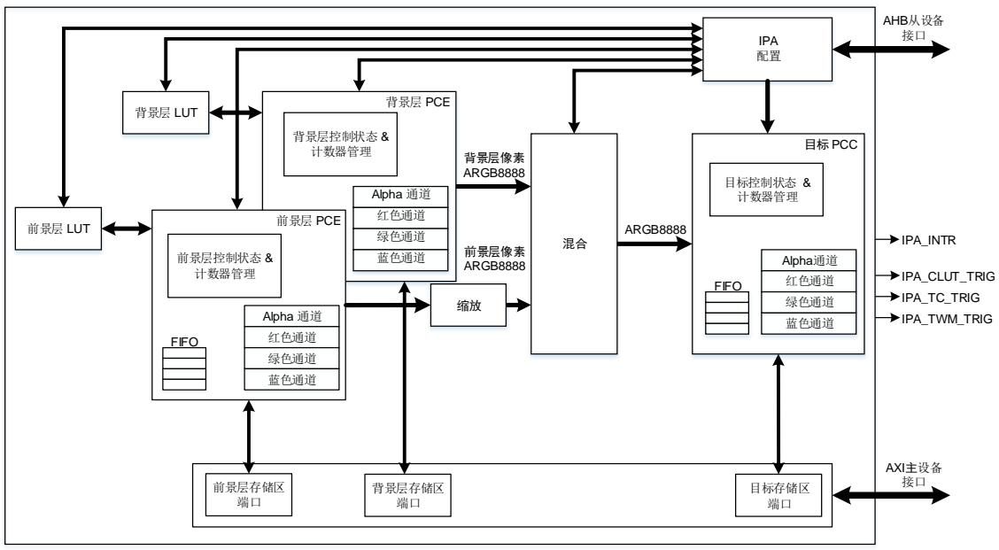
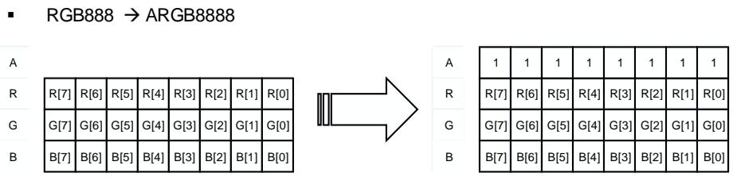
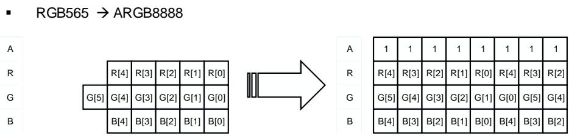
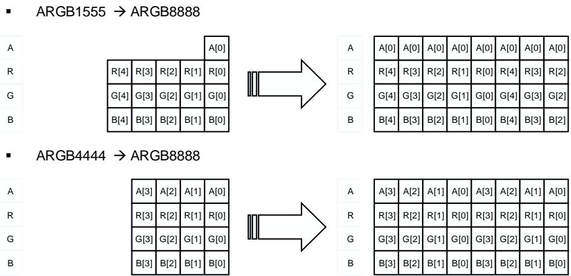
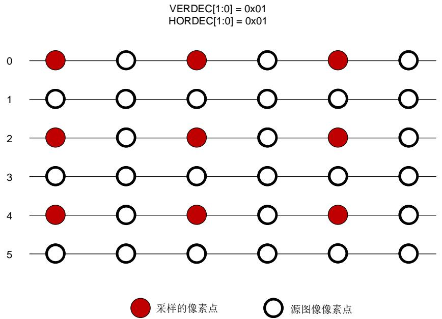
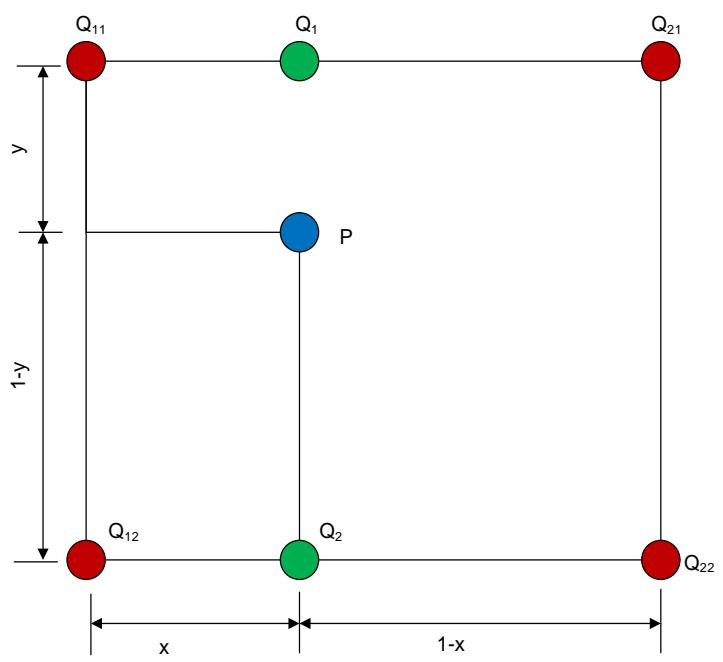
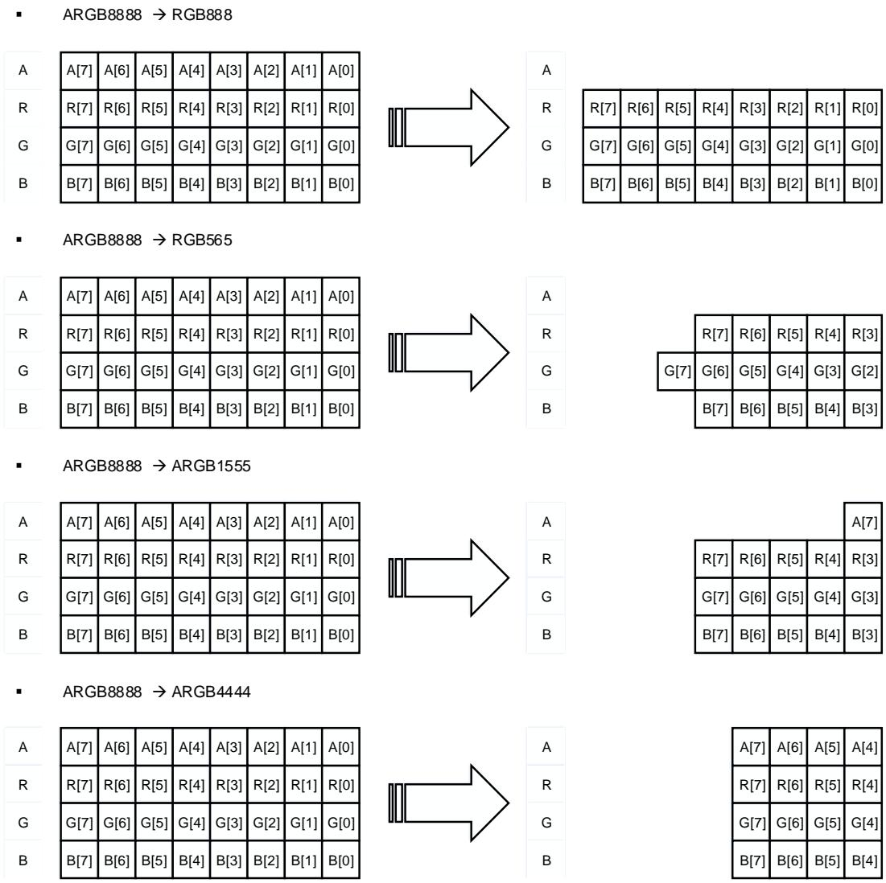
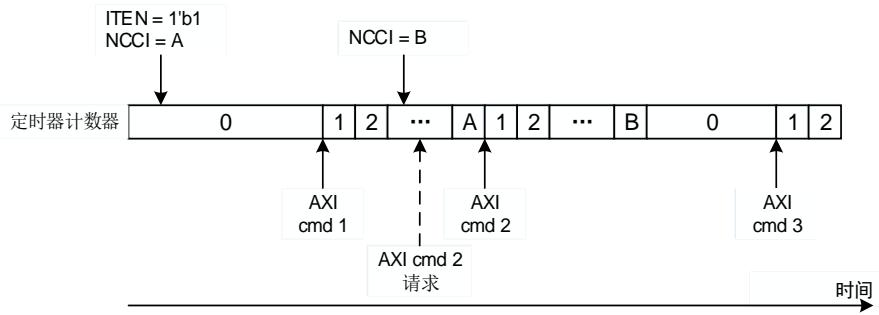
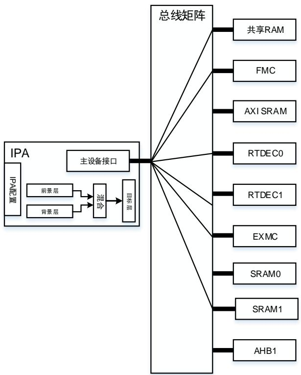

# 35. 图像处理加速器（IPA）

# 35.1. 简介

IPA提供从某一个或两个源图像到目标图像的可配置的，灵活的图像处理功能。它支持以下四种转换模式：

复制某一源图像到目标图像中；

复制某一源图像到目标图像中并同时进行特定的格式转换；

◼ 将两个不同的源图像进行混合，并将得到的结果进行特定的颜色格式转换；

用特定的颜色填充目标图像区域。

前景层图像支持16种像素格式，背景层图像支持11种像素格式，每像素从4 位到最高32位，对于目标图像支持 5 种像素格式，每像素从 16 位到最高 32 位。采用间接像素模式时，IPA 为两个源图像分别提供了 256*32 的颜色查找表。

# 35.2. 主要特性

一个访问存储器的 AXI 主设备接口；

一个支持 8 位，16 位，32 位的 IPA 配置的 AHB从设备接口；

3 个 4 双字深度的 64 位 FIFO 独立用于源图像和目标图像；

支持四种像素格式转换模式：

复制某一源图像到目标图像中；

复制某一源图像到目标图像中并同时进行特定的颜色格式转换；

将两个不同的源图像进行混合，并将得到的结果进行特定的颜色格式转换；

用特定的颜色填充目标图像区域。

支持两源图像独立配置 LUT 大小；

支持两种 LUT 像素格式；

支持 LUT 自动加载；

支持传输挂起或停止；

对于源图像和目标图像，支持独立配置行偏移量；

支持源图像和目标图像独立预定义的像素通道值；

分别支持两源图像 3 种 alpha 通道值计算算法；

对于前景层图像，支持 16 种像素格式；

对于背景层图像，支持 11 种像素格式；

对于目标图像，支持 5 种像素格式；

支持配置图像大小；

支持 AXI 总线带宽自动调节；

支持一个带有六种事件标志位的中断；

支持中断使能和清除；

支持十进制缩放和双线性缩放；

支持图像旋转（0、90、180、270 度）；

前景层图像支持隔行输入。

# 35.3. 结构框图


图 35-1. IPA 模块框图





如 35-1. IPA 所示，IPA 包含 7 个主要部分：


通过 AHB 从设备接口配置 IPA；

通过 AXI 主设备接口访问图像数据；

前景层和背景层 LUT；

前景层和背景层像素通道扩展（PCE）；

前景层缩放；

前景层和背景层像素混合；

目标像素通道压缩（PCC）。

# 35.4. 信号描述

IPA 信号的描述如 35-1. IPA 所示。


表 35-1. IPA 信号描述


<table><tr><td>I/O 口</td><td>类型</td><td>描述</td></tr><tr><td>IPA_INTR</td><td>O</td><td>IPA 全局中断信号</td></tr><tr><td>IPA_CLUT_TRIG</td><td>O</td><td>IPA CLUT 传输完成触发信号</td></tr><tr><td>IPA_TC_TRIG</td><td>O</td><td>IPA 传输完成突发信号</td></tr><tr><td>IPA_TWM_TRIG</td><td>O</td><td>IPA 传输水印触发信号</td></tr></table>

# 35.5. 功能概述

IPA是一个像素格式转换器，它支持多种转换模式，允许用户通过配置IPA对应寄存器的相应位灵活的配置转换模式，前景层，背景层，目标像素格式及其行偏移。除了LUT仅支持32位访问外，其他所有IPA寄存器都可以通过AHB从设备接口进行8位，16位或32位访问。

IPA支持4种转换模式，它可以通过IPA_CTL寄存器的PFCM位配置，如 35-2. IPA 所示：

复制前景层图像到目标图像中

在这种模式中，前景层存储区的像素数据复制到目标存储区而不进行像素转换，所以前景层和目标图像的像素格式没有意义。前景层的像素格式仅定义了每像素的位数。

转换前景层图像到目标图像

在这种模式中，前景层的像素数据从前景层的像素格式转换成目标像素格式，然后写入目标存储区中。如果前景层的像素格式是非直接的（L8, AL44, AL88, L4），读取前景层存储区域中的数据作为索引从前景层 LUT 获取像素数据。

转换和混合前景层和背景层图像到目标图像

在这种模式中，前景层和背景层的像素数据首先由其原来的格式转换为‘ARGB8888’，然后前景层和背景层像素数据成对的混合并从‘ARGB8888’转换为目标像素格式，写入目标存储区中。

如果前景层的像素格式是非直接的，读取前景层存储区域中的数据作为索引从前景层 LUT获取像素数据。

如果背景层的像素格式是非直接的，读取背景层存储区域中的数据作为索引从背景层 LUT获取像素数据。

用特定颜色填充到目标图像中

在这种模式中，目标图像被特定的像素填充，该像素的值被预先定义在对应的目标寄存器中。


表 35-2. IPA 转换模式


<table><tr><td rowspan="2">PFCM[1:0]</td><td colspan="2">转换模式</td><td rowspan="2">像素转换</td><td rowspan="2">混合</td></tr><tr><td>源</td><td>目的</td></tr><tr><td>00</td><td>前景层图像</td><td>目标图像</td><td>否</td><td>否</td></tr><tr><td>01</td><td>前景层图像</td><td>目标图像</td><td>是</td><td>否</td></tr><tr><td>10</td><td>前景层图像和背景层图像</td><td>目标图像</td><td>是</td><td>是</td></tr><tr><td>11</td><td>在寄存器中预定义的像素值</td><td>目标图像</td><td>否</td><td>否</td></tr></table>

# 35.5.1. 转换操作

一次 IPA 操作包含以下 7 个步骤：

1) 从前景层存储区（基地址配置在 IPA_FMADDR 寄存器中）读取数据，如果前景层像素格式是非直接的，则从前景层 LUT 获取像素数据。

2) 扩展前景层像素数据到一个32位的值，并根据IPA_FPCTL寄存器的FAVCA位计算alpha通道的值。

3) 从背景层存储区（基地址配置在 IPA_BMADDR 寄存器中）读取数据，如果背景层像素格式是非直接的，则从背景层 LUT 获取像素数据。

4) 扩展背景层像素数据到一个 32 位的值，并根据 IPA_BPCTL 寄存器的 BAVCA 位计算alpha 通道的值。

5) 混合扩展后的前景层和背景层像素数据。

6) 压缩像素数据为 IPA_DPCTL 寄存器 DPF 位指定的目标区像素格式。

7) 将转换后的像素数据写到目标存储区（基地址配置在 IPA_DMADDR 寄存器中）。

对于前景层和背景层的像素数据处理，IPA 提供了 3 个 8 双字深度的 64 位 FIFO。对于目标层像素数据处理，IPA 提供了 1 个 4 双字深度的 64 位 FIFO。前景层和背景层 FIFO 存储从对应的源存储区读得的数据，目标 FIFO 存储处理过的像素数据，当 AXI 总线空闲的时候，这些数据将会被写入目标存储器。

如果 IPA_CTL 寄存器的 PFCM 位域被配置成 ‘00’ 或 ‘01’，只有前景层 FIFO 和目标层 FIFO被激活。如果 IPA的操作为用特定的颜色填充目标图像，则不需要任何一个 FIFO。

# 35.5.2. 前景层和背景层 LUT

IPA提供了两个 LUT 来存储像素值，以便非直接像素格式使用。如果像素格式是非直接的，使能 IPA 传输之前，像素数据必须已经被写入 LUT 中。LUT 中的像素数据可以通过以下两种方法更新：

# 自动加载：

使能 IPA_FPCTL/IPA_BPCTL 寄存器的 FLLEN/BLLEN 位。IPA_FPCTL 或 IPA_BPCTL寄存器的 FCNP 或 BCNP 位定义了要自动加载的像素的数目，它等于 FCNP+1 或BCNP+1。

# 软件编程：

像素数据可直接通过 IPA从设备接口写入相应的 LUT 存储器地址。前景层 LUT 的基地址偏移是 0x0400，背景层 LUT 的基地址偏移是 0x0800。

LUT支持两种像素格式，分别为‘ARGB8888’和‘RGB888’，由IPA_FPCTL或IPA_BPCTL寄存器的FLPF或BLPF位决定，如 35-3. CLUT 所示。


表 35-3. 前景层和背景层 CLUT 像素格式


<table><tr><td rowspan="2">BLPF/FLPF</td><td rowspan="2">LUT 像素格式</td><td colspan="4">存储地址</td></tr><tr><td>基地址+0x3</td><td>基地址+0x2</td><td>基地址+0x1</td><td>基地址+0x0</td></tr><tr><td>0</td><td>ARGB8888</td><td><eq>A_0[7:0]</eq></td><td><eq>R_0[7:0]</eq></td><td><eq>G_0[7:0]</eq></td><td><eq>B_0[7:0]</eq></td></tr><tr><td rowspan="3">1</td><td rowspan="3">RGB888</td><td><eq>R_3[7:0]</eq></td><td><eq>G_3[7:0]</eq></td><td><eq>B_3[7:0]</eq></td><td><eq>R_2[7:0]</eq></td></tr><tr><td><eq>G_2[7:0]</eq></td><td><eq>B_2[7:0]</eq></td><td><eq>R_1[7:0]</eq></td><td><eq>G_1[7:0]</eq></td></tr><tr><td><eq>B_1[7:0]</eq></td><td><eq>R_0[7:0]</eq></td><td><eq>G_0[7:0]</eq></td><td><eq>B_0[7:0]</eq></td></tr></table>

注意：如果 LUT 的像素格式是‘RGB888’，当自动加载 LUT 的像素数据时，alpha 值为固定的0xFF。

# 35.5.3. 前景层和背景层像素通道扩展（PCE）

若 IPA 传输模式需要进行像素格式转换，前景层或背景层像素数据需要由原来的格式扩展为‘ARGB8888’格式。

IPA_FPCTL和IPA_BPCTL寄存器的FPF和BPF位定义了前景层和背景层的像素格式。如35-4. 所示。

一个像素包含以下 5 个通道：

Alpha 通道 A：透明度，0x00：透明的；0xFF：不透明的。

红色通道 R：红色值，0x00：没有红色；0xFF：全红色。

绿色通道 G：绿色值，0x00：无绿色；0xFF：全绿色。

蓝色通道 B：蓝色值，0x00：无蓝色；0xFF：全蓝色。

亮度通道：在 IPA 中，亮度通道的值是索引值，从背景层或前景层的 LUT 中获得像素数据。


表 35-4. 前景层和背景层像素格式


<table><tr><td rowspan="2">BPF[3:0]/FPF[3:0]</td><td rowspan="2">像素格式</td><td colspan="4">存储地址</td></tr><tr><td>基地址 + 0x3</td><td>基地址 + 0x2</td><td>基地址 + 0x1</td><td>基地址 + 0x0</td></tr><tr><td>0000</td><td>ARGB8888</td><td><eq>A_0</eq>[7:0]</td><td><eq>R_0</eq>[7:0]</td><td><eq>G_0</eq>[7:0]</td><td><eq>B_0</eq>[7:0]</td></tr><tr><td rowspan="3">0001</td><td rowspan="3">RGB888</td><td><eq>R_3</eq>[7:0]</td><td><eq>G_3</eq>[7:0]</td><td><eq>B_3</eq>[7:0]</td><td><eq>R_2</eq>[7:0]</td></tr><tr><td><eq>G_2</eq>[7:0]</td><td><eq>B_2</eq>[7:0]</td><td><eq>R_1</eq>[7:0]</td><td><eq>G_1</eq>[7:0]</td></tr><tr><td><eq>B_1</eq>[7:0]</td><td><eq>R_0</eq>[7:0]</td><td><eq>G_0</eq>[7:0]</td><td><eq>B_0</eq>[7:0]</td></tr><tr><td>0010</td><td>RGB565</td><td><eq>R_1</eq>[4:0]<eq>G_1</eq>[5:3]</td><td><eq>G_1</eq>[2:0]<eq>B_1</eq>[4:0]</td><td><eq>R_0</eq>[4:0]<eq>G_0</eq>[5:3]</td><td><eq>G_0</eq>[2:0]<eq>B_0</eq>[4:0]</td></tr><tr><td>0011</td><td>ARGB1555</td><td><eq>A_1</eq>[0]<eq>R_1</eq>[4:0]<eq>G_1</eq>[4:3]</td><td><eq>G_1</eq>[2:0]<eq>B_1</eq>[4:0]</td><td><eq>A_0</eq>[0]<eq>R_0</eq>[4:0]<eq>G_0</eq>[4:3]</td><td><eq>G_0</eq>[2:0]<eq>B_0</eq>[4:0]</td></tr><tr><td>0100</td><td>ARGB4444</td><td><eq>A_1</eq>[3:0]<eq>R_1</eq>[3:0]</td><td><eq>G_1</eq>[3:0]<eq>B_1</eq>[3:0]</td><td><eq>A_0</eq>[3:0]<eq>R_0</eq>[3:0]</td><td><eq>G_0</eq>[3:0]<eq>B_0</eq>[3:0]</td></tr><tr><td>0101</td><td>L8</td><td><eq>L_3</eq>[7:0]</td><td><eq>L_2</eq>[7:0]</td><td><eq>L_1</eq>[7:0]</td><td><eq>L_0</eq>[7:0]</td></tr><tr><td>0110</td><td>AL44</td><td><eq>A_3</eq>[3:0]<eq>L_3</eq>[3:0]</td><td><eq>A_2</eq>[3:0]<eq>L_2</eq>[3:0]</td><td><eq>A_1</eq>[3:0]<eq>L_1</eq>[3:0]</td><td><eq>A_0</eq>[3:0]<eq>L_0</eq>[3:0]</td></tr><tr><td>0111</td><td>AL88</td><td><eq>A_1</eq>[7:0]</td><td><eq>L_1</eq>[7:0]</td><td><eq>A_0</eq>[7:0]</td><td><eq>L_0</eq>[7:0]</td></tr><tr><td>1000</td><td>L4</td><td><eq>L_7</eq>[3:0]<eq>L_6</eq>[3:0]</td><td><eq>L_5</eq>[3:0]<eq>L_4</eq>[3:0]</td><td><eq>L_3</eq>[3:0]<eq>L_2</eq>[3:0]</td><td><eq>L_1</eq>[3:0]<eq>L_0</eq>[3:0]</td></tr><tr><td>1001</td><td>A8</td><td><eq>A_3</eq>[7:0]</td><td><eq>A_2</eq>[7:0]</td><td><eq>A_1</eq>[7:0]</td><td><eq>A_0</eq>[7:0]</td></tr><tr><td>1010</td><td>A4</td><td><eq>A_7</eq>[3:0]<eq>A_6</eq>[3:0]</td><td><eq>A_5</eq>[3:0]<eq>A_4</eq>[3:0]</td><td><eq>A_3</eq>[3:0]<eq>A_2</eq>[3:0]</td><td><eq>A_1</eq>[3:0]<eq>A_0</eq>[3:0]</td></tr><tr><td rowspan="3">1011</td><td rowspan="3">YUV444*</td><td><eq>Y_3</eq>[7:0]</td><td><eq>U_3</eq>[7:0]</td><td><eq>V_3</eq>[7:0]</td><td><eq>Y_2</eq>[7:0]</td></tr><tr><td><eq>U_2</eq>[7:0]</td><td><eq>V_2</eq>[7:0]</td><td><eq>Y_1</eq>[7:0]</td><td><eq>U_1</eq>[7:0]</td></tr><tr><td><eq>V_1</eq>[7:0]</td><td><eq>Y_0</eq>[7:0]</td><td><eq>U_0</eq>[7:0]</td><td><eq>V_0</eq>[7:0]</td></tr><tr><td>1100</td><td>UYVY422*</td><td><eq>Y_1</eq>[7:0]</td><td><eq>V_{01}</eq>[7:0]</td><td><eq>Y_0</eq>[7:0]</td><td><eq>U_{01}</eq>[7:0]</td></tr><tr><td>1101</td><td>VYUY422*</td><td><eq>Y_1</eq>[7:0]</td><td><eq>U_{01}</eq>[7:0]</td><td><eq>Y_0</eq>[7:0]</td><td><eq>V_{01}</eq>[7:0]</td></tr><tr><td rowspan="5">1110</td><td rowspan="5">YUV420*</td><td>...</td><td>...</td><td>...</td><td>...</td></tr><tr><td><eq>V_{2367}</eq>[7:0]</td><td><eq>U_{2367}</eq>[7:0]</td><td><eq>V_{0145}</eq>[7:0]</td><td><eq>U_{0145}</eq>[7:0]</td></tr><tr><td>...</td><td>...</td><td>...</td><td>...</td></tr><tr><td><eq>Y_7</eq>[7:0]</td><td><eq>Y_6</eq>[7:0]</td><td><eq>Y_5</eq>[7:0]</td><td><eq>Y_4</eq>[7:0]@line2</td></tr><tr><td><eq>Y_3</eq>[7:0]</td><td><eq>Y_2</eq>[7:0]</td><td><eq>Y_1</eq>[7:0]</td><td><eq>Y_0</eq>[7:0]@line1</td></tr><tr><td rowspan="5">1111</td><td rowspan="5">YVU420*</td><td>...</td><td>...</td><td>...</td><td>...</td></tr><tr><td><eq>U_{2367}</eq>[7:0]</td><td><eq>V_{2367}</eq>[7:0]</td><td><eq>U_{0145}</eq>[7:0]</td><td><eq>V_{0145}</eq>[7:0]</td></tr><tr><td>...</td><td>...</td><td>...</td><td>...</td></tr><tr><td><eq>Y_7</eq>[7:0]</td><td><eq>Y_6</eq>[7:0]</td><td><eq>Y_5</eq>[7:0]</td><td><eq>Y_4</eq>[7:0]@line2</td></tr><tr><td><eq>Y_3</eq>[7:0]</td><td><eq>Y_2</eq>[7:O]</td><td><eq>Y_1</eq>[7:0]</td><td><eq>Y_0</eq>[7:0]@line1</td></tr></table>


注意*：YUV 格式仅前景层图像支持。


如果像素格式是‘RGB888’，当扩展像素数据时，alpha通道值被设置为0xFF，如 35-2.‘RGB888’ ‘ARGB8888’ 所示。


图 35-2. 从‘RGB888’到‘ARGB8888’像素格式扩展





如果像素格式是‘RGB565’，当扩展像素数据时，alpha通道值等于0xFF。红绿蓝通道值扩展到8位，扩展后高位为通道值，通道值的高位值填充到低位。如 35-3. ‘RGB565’ ‘ARGB8888’像素格式扩展所示。


图 35-3. 从‘RGB565’到‘ARGB8888’像素格式扩展





如果像素格式是‘ARGB1555’或‘ARGB4444’，每通道值将扩展到8位，扩展后高位为通道值，通道值的高位值填充到低位。如 35-4. ‘ARGB1555’ ‘ARGB4444’ ‘ARGB8888’所示。


图 35-4. 从‘ARGB1555’或‘ARGB4444’到‘ARGB8888’像素格式扩展





如果像素格式是‘L8’或‘L4’，8 位亮度通道值(当像素格式为‘L4’，高位补 0)作为索引值从 LUT 获得像素数据。

如果像素格式是‘AL44’，8 位亮度通道值(高位补 0)作为索引值从 LUT 获得红、绿、蓝通道值。Alpha 通道值将扩展到 8 位，扩展后高位为通道值，填充通道值的高位值到低位。

如果像素格式是‘AL88’，只有红，绿，蓝通道值通过 8 位亮度通道从 LUT 获得。

如果像素格式是‘A8’，红，绿，蓝通道值分别等于 IPA_FPV 寄存器的 FPDRV，FPDGV 位以及 FPDBV 位（或 IPA_BPV 寄存器的 BPDRV 位，BPDGV 位以及 BPDBV 位）。

如果像素格式是‘A4’，Alpha 通道值将扩展到 8 位，扩展后高位为通道值，填充通道的高位值到低位。红，绿，蓝通道值分别等于 IPA_FPV 寄存器的 FPDRV，FPDGV 位以及 FPDBV 位（或 IPA_BPV 寄存器的 BPDRV 位，BPDGV 位以及 BPDBV 位）。

PCE 还支持从 YUV / YCbCr 到 ARGB8888 格式的颜色转换。以下等式用于执行此过程。常量将作为二进制补码值存储在 IPA_CSCC_CFGx（x= 0…2）控制寄存器中，这种方式带来了实现的灵活性以及视频编码和解码操作的差异性。此外，它还提供了一种软件机制来操纵亮度或对比度。

$$
R = C 0 (Y + Y o f f s e t) + C 1 (V + U V o f f s e t) \tag {35-1}
$$

$$
G = C 0 (Y + Y o f f s e t) + C 3 (U + U V o f f s e t) + C 2 (V + U V o f f s e t) \tag {35-2}
$$

$$
\mathrm{B} = \mathrm{C0} (\mathrm{Y} + \text {Yoffset}) + \mathrm{C4} (\mathrm{U} + \text {UVoffset}) \tag {35-3}
$$

35-5. YUV YCbCr 给出了 YUV 和 YCbCr 模式下的期望系数。


表 35-5. YUV 和 YCbCr 模式的期望系数


<table><tr><td>Coff</td><td>YUV</td><td>YCbCr</td></tr><tr><td>YOFF</td><td>0x000</td><td>0x1F0 (-16)</td></tr><tr><td>UVOFF</td><td>0x000</td><td>0x180 (-128)</td></tr><tr><td>C0</td><td>0x100 (1.00)</td><td>0x129 (1.164)</td></tr><tr><td>C1</td><td>0x123 (1.140)</td><td>0x198 (1.596)</td></tr><tr><td>C2</td><td>0x76B (-0.581)</td><td>0x72F (-0.813)</td></tr><tr><td>C3</td><td>0x79B (-0.394)</td><td>0x79B (-0.392)</td></tr><tr><td>C4</td><td>0x208 (2.032)</td><td>0x204 (2.017)</td></tr></table>

IPA 支持通过 3 种算法调制 alpha 通道值，由 IPA_FPCTL 或 IPA_BPCTL 寄存器的 FAVCA 或BAVCA 位决定。如 35-6. Alpha 所述。


表 35-6. Alpha 通道值调制


<table><tr><td>FAVCA/BAVCA[1:0]</td><td>alpha 计算算法</td></tr><tr><td>00/11</td><td>无影响,等于原来的值</td></tr><tr><td>01</td><td>等于 IPA_FPCTL 或 IPA_BPCTL 寄存器 FPDAV 或 BPDAV 位的值</td></tr><tr><td>10</td><td>等于 FPDAV 或 BPDAV 位的值乘以原来 alpha 的值再除以 255</td></tr></table>

# 35.5.4. 前景通道缩放

IPA 实现了一个双线性缩放过滤器，在前景通道中将输入图像调整为不同的分辨率。IPA_DPCTL 寄存器中的 HORDEC 和 VERDEC 定义了水平和垂直预抽取滤波器控制。IPA_BSCTL 寄存器中的 XSCALE 和 YSCALE 为前景提供 X和 Y 缩放因子。抽取滤波器和双线性滤波器的最大缩减因子分别为 8 和 2，因此最大缩放因子可以达到 16。抽取滤波器的详细采样方法如 35-5. 所示。


图 35-5. 抽取滤波器的采样方法





每个轴的最大缩小系数为 1/2，最大放大系数为 $2 ^ { \wedge } 1 2$ 。为了实现缩放功能，需要将缩放因子的倒数写入 IPA_BSCTL 寄存器。例如：

```c
REG32(IPA_BSCTL) = 0x20002000; //1/2 倍缩放(0x2.0)
REG32(IPA_BSCTL) = 0x18001800; //2/3 倍缩放(0x1.8)
REG32(IPA_BSCTL) = 0x08000800; //2 倍缩放(0x0.8)
REG32(IPA_BSCTL) = 0x04000400; //4 倍缩放(0x0.4)
```

双线性滤波器是四个最近像素的加权平均值。假设 P 是输出像素， $\mathsf Q _ { 1 1 } , \mathsf Q _ { 1 2 } , \mathsf Q _ { 2 1 } , \mathsf Q _ { 2 2 }$ 是周围的四个源图像的像素点。如 35-6. 所示。


图 35-6. 双线性缩放图





输出像素 P 的值由以下等式计算。

$$
P = Q _ {1} (1 - y) + Q _ {2} ^ {*} y \tag {35-4}
$$

其中 $\mathsf { Q } _ { 1 } \hbar \mathsf { I I } \mathsf { Q } _ { 2 }$ 的等式如下。

$$
Q _ {1} = Q _ {1 1} ^ {*} (1 - x) + Q _ {2 1} ^ {*} x \tag {35-5}
$$

$$
Q _ {2} = Q _ {1 2} ^ {*} (1 - x) + Q _ {2 2} ^ {*} x \tag {35-6}
$$

仅当 PFCM 等于 2'b01 或 2'b10 时，缩放才有效。

# 35.5.5. 混合

若 IPA的传输模式需要进行像素混合时，扩展之后的前景层和背景层像素数据需要成对的混合并获得一个 32 位像素值。

Alpha 通道值的混合基于下面的公式 $( A _ { F }$ 是前景层 alpha 值, $A _ { B }$ 是背景层 alpha 值)：

$$
A _ {\text { mix }} = \frac {A _ {F} \times A _ {B}}{2 5 5} \tag {35-7}
$$

$$
\mathrm{A} _ {\text { blend }} = \mathrm{A} _ {\mathrm{F}} + \mathrm{A} _ {\mathrm{B}} - \mathrm{A} _ {\text { mix }} \tag {35-8}
$$

红，绿，蓝通道值的混合基于下面的公式 $( R _ { F } , G _ { F } , B _ { F }$ 是前景层的红，绿，蓝值; $R _ { B } , G _ { B } , B _ { B }$ 是背景层的红，绿，蓝值)：

$$
R _ {\text {blend}} = \frac {R _ {F} \times A _ {F} + R _ {B} \times A _ {B} - R _ {B} \times A _ {\text {mix}}}{A _ {\text {blend}}} \tag {35-9}
$$

$$
G _ {\text {blend}} = \frac {G _ {F} \times A _ {F} + G _ {B} \times A _ {B} - G _ {B} \times A _ {\text {mix}}}{A _ {\text {blend}}} \tag {35-10}
$$

$$
B _ {\text {blend}} = \frac {B _ {F} \times A _ {F} + B _ {B} \times A _ {B} - B _ {B} \times A _ {\text {mix}}}{A _ {\text {blend}}} \tag {35-11}
$$

注意：1)上述公式中的除法结果是向下取整。

2)如果 $A _ { b I e n d }$ 等于 $0 , R _ { b I e n d } ,$ $\widehat { G } _ { b I e n d }$ 和 $B _ { b I e n d }$ 等于‘0xFF’。

3)背景和目标层的宽度和高度要一致。

# 35.5.6. 目标像素通道压缩（PCC）

如果在IPA传输模式需要进行像素转换, 在像素数据写入目标存储区之前，需要由‘ARGB8888’压缩为目标像素格式。

IPA_DPCTL 寄存器的 DPF 位定义了目标图像的像素格式。如 35-7. 所示。


表 35-7. 目标像素格式


<table><tr><td rowspan="2">DPF[2:0]</td><td rowspan="2">像素格式</td><td colspan="4">存储地址</td></tr><tr><td>基地址+0x3</td><td>基地址+0x2</td><td>基地址+0x1</td><td>基地址+0x0</td></tr><tr><td>000</td><td>ARGB8888</td><td><eq>A_0</eq>[7:0]</td><td><eq>R_0</eq>[7:0]</td><td><eq>G_0</eq>[7:0]</td><td><eq>B_0</eq>[7:0]</td></tr><tr><td rowspan="3">001</td><td rowspan="3">RGB888</td><td><eq>R_3</eq>[7:0]</td><td><eq>G_3</eq>[7:0]</td><td><eq>B_3</eq>[7:0]</td><td><eq>R_2</eq>[7:0]</td></tr><tr><td><eq>G_2</eq>[7:0]</td><td><eq>B_2</eq>[7:0]</td><td><eq>R_1</eq>[7:0]</td><td><eq>G_1</eq>[7:0]</td></tr><tr><td><eq>B_1</eq>[7:0]</td><td><eq>R_0</eq>[7:0]</td><td><eq>G_0</eq>[7:0]</td><td><eq>B_0</eq>[7:0]</td></tr><tr><td>010</td><td>RGB565</td><td><eq>R_1</eq>[4:0]<eq>G_1</eq>[5:3]</td><td><eq>G_1</eq>[2:0]<eq>B_1</eq>[4:0]</td><td><eq>R_0</eq>[4:0]<eq>G_0</eq>[5:3]</td><td><eq>G_0</eq>[2:0]<eq>B_0</eq>[4:0]</td></tr><tr><td>011</td><td>ARGB1555</td><td><eq>A_1</eq>[0]<eq>R_1</eq>[4:0]<eq>G_1</eq>[4:3]</td><td><eq>G_1</eq>[2:0]<eq>B_1</eq>[4:0]</td><td><eq>A_0</eq>[0]<eq>R_0</eq>[4:0]<eq>G_0</eq>[4:3]</td><td><eq>G_0</eq>[2:0]<eq>B_0</eq>[4:0]</td></tr><tr><td>100</td><td>ARGB4444</td><td><eq>A_1</eq>[3:0]<eq>R_1</eq>[3:0]</td><td><eq>G_1</eq>[3:0]<eq>B_1</eq>[3:0]</td><td><eq>A_0</eq>[3:0]<eq>R_0</eq>[3:0]</td><td><eq>G_0</eq>[3:0]<eq>B_0</eq>[3:0]</td></tr></table>

注意：如果 IPA_CTL 寄存器的 PFCM 位等 $\ddagger 0 0 ^ { \prime }$ （拷贝前景层图像到目标图像），DPF 位无意义，IPA_FPCTL 寄存器的 FPF 位决定了源图像和目标图像每像素的位数。

如 35-7. 所示，目标像素通道压缩通过丢弃低位实现。


图 35-7. 像素压缩





# 35.5.7. 旋转

IPA 支持 0、90、180 和 270 度的旋转。当 IPA_DPCTL 中的 ROT 位域被配置时，IPA 逐行读取输入图像并将每个转换后的输出像素放入旋转后生成的输出像素地址。

# 35.5.8. 内部定时器

为了减少 IPA 使用的 AXI 总线的带宽，在 IPA 传输与 LUT 自动加载时，IPA 会自动在两个连续的 AXI 请求之间插入若干时钟周期，这个功能通过一个内部定时器实现。

置位 IPA_ITCTL 寄存器的 ITEN 位，内部定时器使能。IPA_ITCTL 寄存器的 NCCI 位定义了两个连续的 AXI 写或读地址通道命令之间插入的时钟周期数的最小值。若内部定时器没有使能，NCCI 没有意义。

当IPA传输或LUT自动加载正在进行时，若改变NCCI的值，对内部计数器的当前计数没有影响，从下次计数有作用；如 35-8. 所示。


图 35-8. 内部定时器操作





# 35.5.9. 行标记

软件可通过标记行号来了解当前 IPA 传输的进度，被标记的行号可以通过 IPA_LM 寄存器的LM 位配置。当且仅当标记行的最后一个像素数据被写入目标存储区时，IPA_INTF 寄存器中的TLMIF 位会被置起。

注意：如果 LM 位等于 0，无标志位置位。

# 35.5.10. 传输流

软件置位 IPA_FPCTL/IPA_BPCTL 寄存器的 FLLEN/BLLEN 位，前景层或背景层 LUT 开始自动加载。一旦 LUT 自动加载开始，FLLEN/BLLEN 位变为传输标志位，用于指示 LUT 自动加载是否完成，且软件向其写 0 没有意义；当加载完成时，FLLEN/BLLEN 位会被自动清 0。

软件置位 IPA_CTL 寄存器的 TEN 位，IPA 开始传输。一旦传输开始，TEN 位变为传输标志位，用于指示 IPA 传输是否完成，且软件向其写 0 没有意义；当传输完成时，TEN 位会被自动清0。

在 IPA 传输或 LUT 自动加载正在工作时，软件可通过置位 IPA_CTL 寄存器的 THU 位挂起当前传输；当软件清除 THU 位后，传输继续。若无前景层/背景层 LUT 自动加载和 IPA 传输使能时，设置 THU 位无影响，读该位的值为 0。

通过置位 IPA_CTL 寄存器的 TST 位可以停止前景层/背景层 LUT 自动加载和 IPA 传输。复位IPA_FPCTL/IPA_BPCTL 寄存器的 FLLEN/BLLEN 位或 IPA_CTL 寄存器的 TEN 位可以让 LUT加载或 IPA 传输立即停止，即使 IPA 传输或 LUT 自动加载正在工作或挂起。当当前的传输停止的后，TST 位自动复位。若无前景层/背景层 LUT 自动加载和 IPA 传输使能时，设置 TST 位无影响，读该位的值为 0。

前景层 LUT 自动加载，背景层 LUT 自动加载和 IPA 传输同一时间只能有一个在工作。例如，当 IPA 传输正在进行的时候，若软件置位 FLLEN 或 BLLEN 位，前景层或背景层 LUT 自动加载不会启动，且 FLLEN 或 BLLEN 位自动复位。

# 35.5.11. 配置

开始任何传输之前，软件需要读 TEN，FLLEN 和 BLLEN 位检查是否有 IPA传输或 LUT 加载正在工作。如果有任何一个正在进行，可以设置 TST 位使其停止或等待其完成。当读取 TEN，

FLLEN 和 BLLEN 的值都为 0 时，可以开始一个新的传输。

# 前景层 LUT加载

当开始一个新的前景层 LUT 加载的时候，建议按如下步骤进行：

1. 配置 IPA_FLMADDR 寄存器设置前景层 LUT 存储区基地址；

2. 配置 IPA_FPCTL 寄存器的 FLPF 位设置前景层 LUT 像素格式；

3. 配置 IPA_FPCTL 寄存器的 FCNP 位设置前景层 LUT 要加载的像素数目；

4. 配置 IPA_CTL 寄存器的错误配置中断，LUT 加载完成中断，LUT 访问冲突中断和传输访问错误中断使能位；

5. 配置 IPA_FPCTL 寄存器的 FLLEN 位为‘1’以使能前景层 LUT 的自动加载。

# 背景层 LUT 加载

当开始一个新的背景层 LUT 加载的时候，建议按如下步骤进行：

1. 配置 IPA_BLMADDR 寄存器设置背景层 LUT 存储区基地址；

2. 配置 IPA_BPCTL 寄存器的 BLPF 位设置背景层 LUT 像素格式；

3. 配置 IPA_BPCTL 寄存器的 BCNP 位设置背景层 LUT 要加载的像素数目；

4. 配置 IPA_CTL 寄存器的错误配置中断，LUT 加载完成中断，LUT 访问冲突中断和传输访问错误中断使能位；

配置 IPA_FPCTL 寄存器的 FLLEN 位为‘1’以使能背景层 LUT 的自动加载。

# IPA 传输

当开始一个新的 IPA 传输的时候，对应不同像素转换模式的配置步骤如下所示：

# 复制前景层图像到目标图像

1. 配置 IPA_FMADDR 和 IPA_DMADDR 寄存器设置前景层和目标层存储区基地址；

2. 配置 IPA_FPCTL 寄存器的 FPF 位域设置前景层像素格式；

3. 配置 IPA_FLOFF 和 IPA_DLOFF 寄存器的 FLOFF 和 DLOFF 位域设置前景层和目标层的行偏移；

4. 若需要，配置 IPA_LM 寄存器的 LM 位域设置行标记；

5. 配置 IPA_IMS 寄存器的 WIDTH 和 HEIGHT 位域设置图像大小；

6. 配置 IPA_CTL 寄存器的错误配置中断，LUT 访问冲突中断、传输行标记中断、完全传输完成中断和传输访问错误中断所需的使能位；

7. 配置 IPA_CTL 寄存器的 TEN 位为‘1’以使能 IPA 传输。

# 转换前景层图像到目标图像

如果前景层像素格式是非直接的，像素数据应在开始 IPA传输之前加载到前景层 LUT。LUT 的自动加载过程可参考 LUT 。

1. 配置 IPA_FMADDR 和 IPA_DMADDR 寄存器设置前景层和目标存储区基地址；

2. 配置 IPA_FPCTL 寄存器的 FAVCA 和 FPF 位域设置前景层 alpha 值的计算方法和前景层像素格式。当前景层格式是 YUV/YCbCr 时需要配置 IPA_CSCC_CFGx（x = 0…2）寄存器；

3. 如果前景层格式不是 ARGBxxxx 类型，配置 IPA_FPCTL 和 IPA_FPV 寄存器设置预定义像素值，包括 alpha，红，绿，蓝颜色值；

4. 配置 IPA_DPCTL 寄存器的 DPF 位域设置目标像素格式；

5. 配置 IPA_FLOFF 和 IPA_DLOFF 寄存器的 FLOFF 和 DLOFF 位设置前景层和目标层行偏移；

6. 若需要使用缩放功能，配置 IPA_DPCTL 寄存器的 VERDEC/HORDEC 位域，IPA_BSCTL寄存器的 XSCAL/YSCAL 位域，IPA_DIMS 寄存器的 DWIDTH/DHEIGHT 位域；

7. 若需要旋转功能，配置 IPA_DPCTL 寄存器的 ROT 位域；

8. 若需要，配置 IPA_LM寄存器的 LM 位设置行标记；

9. 配置 IPA_IMS 寄存器的 WIDTH 和 HEIGHT 位域设置图像大小；

10. 配置 IPA_CTL 寄存器的错误配置中断，LUT 访问冲突中断、传输行标记中断、完全传输完成中断和传输访问错误中断所需的使能位；

11. 配置 IPA_CTL 寄存器的 TEN 位为‘1’以使能 IPA 传输。

# 转换并混合前景层和背景层图像到目标图像

如果前景层和背景层像素格式是非直接的，开始 IPA传输之前，像素数据必须被加载到对应的LUT。前景层和背景层 LUT 的自动加载过程可参考 LUT 和 LUT 。

1. 配置 IPA_FMADDR, IPA_BMADDR 和 IPA_DMADDR 寄存器设置前景层，背景层和目标存储区基地址；

2. 配置 IPA_FPCTL 寄存器的 FAVCA 和 FPF 位域设置前景层 alpha 值的计算方法和前景层像素格式。当前景层格式是 YUV/YCbCr 时需要配置 IPA_CSCC_CFGx（x = 0…2）寄存器；

3. 如果前景层格式不是 ARGBxxxx 类型，配置 IPA_FPCTL 和 IPA_FPV 寄存器设置预定义像素值，包括 alpha，红，绿，蓝颜色值；

4. 配置 IPA_BPCTL 寄存器的 BAVCA 和 BPF 位域设置背景层 alpha 值的计算方法和背景层像素格式。当前景层格式是 YUV/YCbCr 时需要配置 IPA_CSCC_CFGx（x = 0…2）寄存器；

5. 如果背景层格式不是 ARGBxxxx 类型，配置 IPA_BPCTL 和 IPA_BPV 寄存器设置预定义像素值，包括 alpha，红，绿，蓝颜色值；

6. 配置 IPA_DPCTL 寄存器的 DPF 位域设置目标像素格式；

7. 配置 IPA_FLOFF, IPA_BLOFF 和 IPA_DLOFF 寄存器的 FLOFF、BLOFF 和 DLOFF，设置背景层，前景层和目标的行偏移；

8. 若需要，配置 IPA_LM寄存器的 LM 位设置行标记；

9. 配置 IPA_IMS 寄存器的 WIDTH 和 HEIGHT 位域设置图像大小；

10. 若需要使用缩放功能，配置 IPA_DPCTL 寄存器的 VERDEC / HORDEC 位域，IPA_BSCTL寄存器的 XSCAL / YSCAL 位域，IPA_DIMS 寄存器的 DWIDTH / DHEIGHT 位域；

11. 若需要旋转功能，配置 IPA_DPCTL 寄存器的 ROT 位域；

12. 配置 IPA_CTL 寄存器的错误配置中断，LUT 访问冲突中断、传输行标记中断、完全传输完成中断和传输访问错误中断所需的使能位；

13. 配置 IPA_CTL 寄存器的 TEN 位为‘1’以使能 IPA 传输。

# 用特定的颜色填充目标图像

1. 配置 IPA_DMADDR 寄存器设置目标存储区的基地址；

2. 配置 IPA_DPCTL 寄存器的 DPF 位域设置目标像素格式；

3. 配置 IPA_DPV 寄存器设置目标区预定义像素值，包括 alpha，红，绿，蓝颜色值；

4. 配置 IPA_DLOFF 寄存器的 DLOFF 位域设置目标的行偏移；

5. 若需要，配置 IPA_LM寄存器的 LM 位域设置行标记；

6. 配置 IPA_IMS 寄存器的 WIDTH 和 HEIGHT 位域设置图像大小；

7. 配置 IPA_CTL 寄存器的错误配置中断，LUT 访问冲突中断、传输行标记中断、完全传输完成中断和传输访问错误中断所需的使能位；

8. 配置 IPA_CTL 寄存器的 TEN 位为‘1’以使能 IPA 传输。

# 配置规则

IPA配置必须遵守一些规则，否则在它使能之后，传输或加载将会自动复位，IPA_INTF 寄存器的 WCFIF 位将会立即置位。规则描述如下：

当前景层 LUT 自动加载使能：

当 IPA_FPCTL 寄存器的 FLPF 位等于 0 时，寄存器 IPA_FLMADDR 的 FLMADDR 位域必须是 32 位对齐的。

当背景层 LUT 自动加载使能：

当 IPA_BPCTL 寄存器的 BLPF 位等于 0 时，寄存器 IPA_BLMADDR 的 BLMADDR 位必须是 32 位对齐的。

当 IPA传输使能：


1) 当 IPA_FPCTL 寄存器的 FPF 位是‘ARGB8888’，’UYVY422’，‘VYUY422’，’YUV420’或‘YVU420’时，IPA_FMADDR 寄存器的 FMADDR 位必须是 32 位对齐。当 FPF 位是‘RGB565’, ‘ARGB1555’, ‘ARGB4444’ 或 ‘AL88’，必须是 16 位对齐。


2) 当 IPA_FPCTL 寄存器的 FPF 位是’A4’，’L4’，‘UYVY422’ 或‘VYUY422’时，IPA_FLOFF寄存器的 FLOFF 位域必须是偶数。当 IPA_FPCTL 寄存器的 FPF 位为‘YUV420’或‘YVU420’时，必须是 4 位对齐。


3) 当 IPA_BPCTL 寄存器的 BPF 位是‘ARGB8888’时，IPA_BMADDR 寄存器的 BMADDR位必须是 32 位对齐。当 BPF 位是‘RGB565’, ‘ARGB1555’, ‘ARGB4444’ 或 ‘AL88’，必须是 16 位对齐。


4) 当 IPA_BPCTL 寄存器的 BPF 位是 A4 或 L4 时，IPA_BLOFF 寄存器的 BLOFF 位域必须是偶数。


5) 当 PFCM 位不为‘0b00’或‘0b11’时，IPA_FPCTL 寄存器的 FPF 位必须小于或等于‘0b1111’。当 PFCM 位为‘0b00’时，FPF 位必须小于或等于‘0b1101’


6) IPA_BPCTL 寄存器的 BPF 位必须小于或等于‘0b1010’。


7) IPA_DPCTL 寄存器的 DPF 位必须小于或等于‘0b100’。


8) 当 IPA_DPCTL 寄存器的 DPF 位是‘ARGB8888’时，IPA_DMADDR 寄存器的 DMADDR位必须是 32 位对齐。当 DPF 位是‘RGB565’, ‘ARGB1555’, ‘ARGB4444’ 或 ‘AL88’，必须是 16 位对齐。


9) 当 IPA_FPCTL 寄存器的 FPF 位是’A4’或’L4’时，IPA_DLOFF 寄存器的 DLOFF 位必须是偶数。


10) 当 IPA_FPCTL 寄存器的 FPF 位是’A4’，’L4’，‘UYVY422’或‘VYUY422’时，IPA_IMS 寄存器的 WIDTH 位必须是偶数。当 IPA_FPCTL 寄存器的 FPF 位是’YUV420’或‘YVU420’，必须是 4 位对齐。


11) 当 IPA_BPCTL 寄存器的 BPF 位是’A4’或’L4’时，IPA_IMS 寄存器的 WIDTH 位必须是偶


数。

12) IPA_IMS 寄存器的 WIDTH 位必须大于 0。

13) IPA_IMS 寄存器的 HEIGHT 位必须大于 0。

14) IPA_BSCTL 寄存器中的 XSCALE 和 YSCALE 位必须大于零且小于 0x2001。

15) 当 FIIMEN 位置位时，IPA_FPCTL 寄存器中的 FPF 位不能为'YUV420'和'YVU420'。当IPA_FPCTL 寄 存 器 中 的 FPF 位 为 'ARGB8888' 、 'UYVY422' 、 'VYUY422' 时 ，IPA_EF_UV_MADDR 寄存器的 EFUVMADDR 位的值必须为 32 位对齐。当 FPF 位为'RGB565'、'ARGB1555'、'ARGB4444'或'AL88'时 EFUVMADDR 位的值必须为 16 位对齐。

16) 当 IPA_FPCTL 寄存器中的 FPF 位为'YUV420'和'YVU420'时，IPA_EF_UV_MADDR 寄存器的 EFUVMADDR 位的值必须为 16 位对齐。

17) 启用前景层通道缩放功能时，HORDEC、VERDEC、XSCALE、YSCALE 不为默认值。当 IPA_BPCTL 寄存器中的 BPF 位为'A4'、'L4'时，IPA_DIMS 寄存器中的 DWIDTH 位必须是偶数。

18) 启用前景层通道缩放和旋转功能时，HORDEC、VERDEC、XSCALE、YSCALE 和 ROT不为默认值。当 IPA_BPCTL 寄存器中的 BPF 位为'A4'、'L4'时，IPA_DIMS 寄存器中的DHEIGHT 位必须是偶数。

当 PFCM 位等于‘00’，仅考虑 1)、2)、5)、9)、10)、12)、13)。

当 PFCM 位等于‘01’，仅考虑 1)、2)、5)、7)、8)、10)、12)、13)、14)、15)、16)。

当 PFCM 位等于‘10’，除了 9)所有的规则都考虑。

当 PFCM 位等于‘11’，仅考虑 7)、8)、12)、13)。

# 35.6. 中断

有 6 个中断事件连接到 IPA 中断，包括错误配置中断，LUT 加载完成中断，LUT 访问冲突中断，传输行标记中断，传输完成中断和传输访问错误中断。任何一个中断事件发生都将产生一个 IPA 中断。

每一个中断事件在 IPA_INTF 寄存器有一个专用的状态位，在 IPA_INTC 寄存器有一个专门的清除位，在 IPA_CTL 寄存器有一个专用的使能位。相应位之间的关系如 35-8. IPA所述。


表 35-8. IPA 中断事件


<table><tr><td rowspan="2">中断事件</td><td>状态位</td><td>使能位</td><td>清除位</td></tr><tr><td>IPA_INTF</td><td>IPA_CTL</td><td>IPA_INTC</td></tr><tr><td>配置错误中断</td><td>WCFIF</td><td>WCFIE</td><td>WCFIFC</td></tr><tr><td>LUT加载完成中断</td><td>LLFIF</td><td>LLFIE</td><td>LLFIFC</td></tr><tr><td>LUT访问冲突中断</td><td>LACIF</td><td>LACIE</td><td>LACIFC</td></tr><tr><td>传输行标记中断</td><td>TLMIF</td><td>TLMIE</td><td>TLMIFC</td></tr><tr><td>全传输完成中断</td><td>FTFIF</td><td>FTFIE</td><td>FTFIFC</td></tr><tr><td>传输访问错误中断</td><td>TAEIF</td><td>TAEIE</td><td>TAEIFC</td></tr></table>

# 配置错误中断

当 LUT 加载或 IPA 传输被使能之后，若 小节列出的任何一个配置规则被破坏，配置错误中断状态位将立即置位。LUT 加载或 IPA 传输将自动停止且不产生任何访问操作。

当配置错误中断状态位被置位并且相应使能位使能时，将产生一个 IPA中断。

# LUT加载完成中断

当最后一个像素数据被写入到前景层或背景层 LUT 后，LUT 加载完成中断状态状态位将立即置位，在加载期间的停止操作不能置位 LUT 加载完成中断状态位。

当 LUT 加载完成中断状态位被置位并且相应使能位使能，将产生一个 IPA 中断。

# LUT访问冲突中断

当通过软件访问前景层和背景层 LUT 时，必须遵守以下规则：

当前景层 LUT 自动加载时，禁止软件访问前景层 LUT；

当背景层 LUT 自动加载时，禁止软件访问背景层 LUT；

当配置 IPA传输模式 PFCM 位等于‘01’或‘10’时，如果前景层像素格式是非直接的，在 IPA传输正在进行时，禁止软件访问前景层 LUT；

当配置 IPA传输模式 PFCM 位等于‘10’时，如果背景层像素格式是非直接的，在 IPA传输正在进行时，禁止软件访问背景层 LUT。

当违背上述规则之一时，LUT 访问冲突中断状态位置位，且软件访问无作用（写访问不被执行，读访问返回一个无效值）。

当 LUT 访问冲突中断状态位寄存器被置位并且相应使能位使能时，将产生一个 IPA中断。

# 传输行标记中断

当标记行的最后一个像素数据被写入目标存储区后，传输行标记中断状态位立即置位。如果IPA_LM 的 LM 位等于 0，在 IPA传输期间，传输行标记中断状态位不置位。

当传输行标记中断状态位被置位并且相应使能位使能时，将产生一个 IPA中断。

# 传输完成中断

当最后一个像素数据被写入目标存储区后，传输完成中断状态位立即置位。在 IPA 传输期间的停止操作不置位传输完成中断状态位。

当传输完成中断状态位被置位并且相应使能位使能时，将产生一个 IPA中断。

# 传输访问错误中断

当 IPA访问的地址超出允许的地址，IPA将收到一个错误反馈；传输（LUT加载或IPA传输）将被立即禁止并且没有 LUT加载完成中断状态位或传输完成中断状态位置位。IPA 允许和禁止的访问区域在 35-9. IPA 中列出。

当传输访问错误中断状态位被置位并且相应使能位使能时，将产生一个 IPA 中断。


图 35-9. IPA 的系统连接





