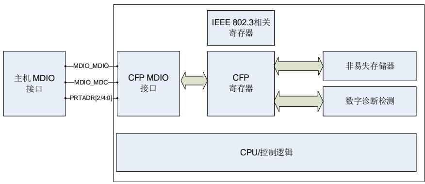
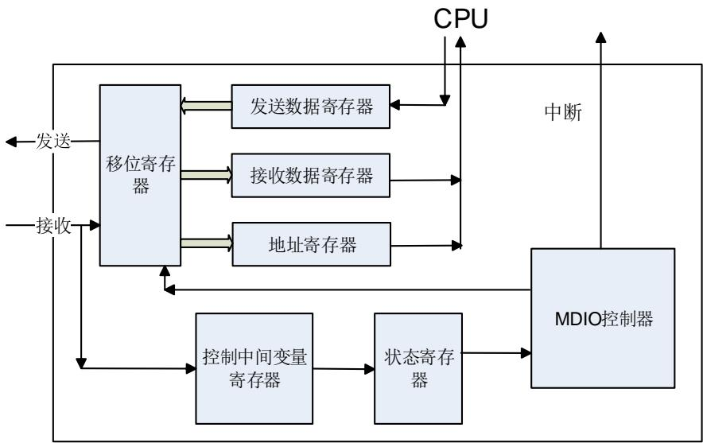
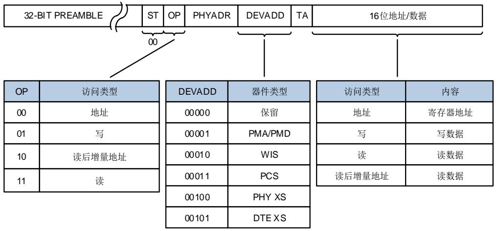
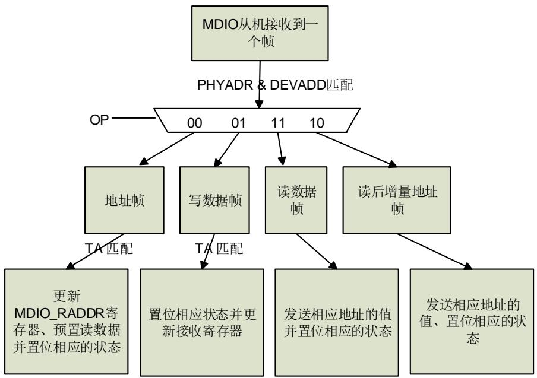

# 37. 管理数据输入/输出接口（MDIO）

# 37.1. 简介

MDIO 接口可以接收完整的 MDIO 帧。只要在接收到读数据帧或读后增量地址帧的转换位（TA）之前将数据写入寄存器，MDIO 接口就可以传输完整的 MDIO 帧。中断在每个完整帧的末尾生成，可以在正确的时间使用或提供中断。中断也可以在每个有效的 PHYADR 和 DEVADD 之后生成，这支持了在帧内进行更复杂的控制。

# 37.2. 主要特性

支持从机模式下最高频率4MHz；

支持CFP / CFP2 MSA管理接口规范；

支持多种中断；

物理地址可配置：

软件配置；

硬件引脚配置。

# 37.3. 引脚和内部信号

37-1. CFP 提供了MDIO结构框图。 37-1. MDIO 提供了MDIO内部信号和引脚介绍。

表37-1. MDIO引脚定义

<table><tr><td>名称</td><td>信号类型</td></tr><tr><td>MDIO_MDIO</td><td>输入输出,数字信号</td></tr><tr><td>MDIO_MDC</td><td>输入,数字时钟信号</td></tr><tr><td>MDIO_Ax(x=0...4)</td><td>输入,数字地址信号</td></tr></table>

# 37.4. 功能描述

图37-1. CFP管理接口结构

图37-2. MDIO框图

# 37.4.1. 帧结构

CFP MDIO 接口的通讯数据帧格式符合 IEEE 802.3 标准的第 45 条。帧可以是地址帧或者数据帧。帧总长度为 64 位，包括 32 位的前导码，以及帧命令主体。帧命令主体包括 6 个部分，详见 37-3. MDIO 。

图37-3. MDIO帧格式

# 注意：

1. ST = 开始位（2 位）

2. OP = 操作码（2 位）

3. PHYADR = 物理端口地址（5 位）

4. DEVADD = MDIO 器件地址（或称为器件类型，5 位）

5. TA = 转换位（2 位）

6. 16 位地址/数据为帧数据

表37-2. 不同帧类型具体描述(1)

<table><tr><td rowspan="2">帧</td><td rowspan="2">Idle</td><td colspan="7">管理帧域</td><td rowspan="2">Idle</td></tr><tr><td>PRE</td><td>ST</td><td>OP</td><td>PHYADR</td><td>DEVADD</td><td>TA</td><td>Address/Data</td></tr><tr><td>写地址</td><td>Z</td><td>1...1</td><td>00</td><td>00</td><td>aaaaa</td><td>aaaaa</td><td>10</td><td>aaaaaaaaaaaaaaaaaa</td><td>Z</td></tr><tr><td>写数据</td><td>Z</td><td>1...1</td><td>00</td><td>01</td><td>aaaaa</td><td>aaaaa</td><td>10</td><td>dddddddddddddddd</td><td>Z</td></tr><tr><td>读数据</td><td>Z</td><td>1...1</td><td>00</td><td>11</td><td>aaaaa</td><td>aaaaa</td><td>z0</td><td>dddddddddddddddd</td><td>Z</td></tr><tr><td>读后增量地址帧</td><td>Z</td><td>1...1</td><td>00</td><td>10</td><td>aaaaa</td><td>aaaaa</td><td>z0</td><td>dddddddddddddddd</td><td>Z</td></tr></table>

(1).在空闲状态期间，MDIO 接口时钟（MDC 信号）和 MDIO 信号无源驱动。读数据帧或者读后增量地址帧的 TA 域为 1.5 位，TA 域的前 0.5 位时钟周期，MDIO 信号由主机来驱动，TA域的后 1 位时钟周期以及在 16 位读数据期间，MDIO 信号由 MDIO 管理的器件（即从机）来驱动，随后还会有 0.5 位周期的 TA转换位，MDIO 信号由主机来驱动。在其他时候，MDIO 信号由 STA即主机来驱动。

# 空闲状态（Idle）

MDIO 信号的空闲状态为高阻态。

# 前导码（PRE）

在每次传输的开始，站管理者（主机）一次发送一串不少于 32 位（对应 MDC 脚上 32 个 MDIO时钟）连续的 1 到 MDIO 脚，来建立一个帧的开始。

# 帧的开始（ST）

在前导码后，帧开始位（包含 2 位的’0’）指示了帧的起始。

# 操作码（OP）

操作码描述了要求的动作，详见 37-3. 。

表37-3. 操作码

<table><tr><td>OP</td><td>描述</td></tr><tr><td>00</td><td>为后续的写数据或读数据帧设置地址</td></tr><tr><td>01</td><td>写数据到之前设置的地址</td></tr><tr><td>11</td><td>从之前设置的地址读取数据</td></tr><tr><td>10</td><td>从之前设置的地址读取数据,然后增加地址。用户代码必须增加地址。</td></tr></table>

# 物理地址（PHYADR）

5 位物理地址，允许最多 32 个不同的地址。PHYADR 可由 5 个硬件引脚或者软件来设置。

# 器件地址（DEVADD）

5 位器件地址用于器件类型选择。在 CFP 规范中，仅支持 MDIO 器件地址为 1。

# 转换位（TA）

在 TA转换位期间，MDIO 信号由主机驱动转换为从机驱动。

# 地址 / 数据

地址 / 数据域为 16 位。

# 37.4.2. 典型使用流程

MDIO 接口大部分在硬件上实现，需要正确的软件操作顺序。使用流程如下所示：

1. 复位 MDIO 模块，配置 GPIO 模块，将相应的功能脚映射到复用功能上。

2. 通过写 MDIO_CTL 和 MDIO_CFG 寄存器来配置帧参数。并根据需求来设置 MDIO_TO寄存器。

3. 通过写 MDIO_INTEN 寄存器和要求的系统中断设置来设置中断。

4. 对于一个写操作帧，用户可以在接收完整个帧后从 MDIO_RADDR 和 MDIO_RDATA 寄存器分别取得地址和写的数据。对于一个读数据帧或者读后增量地址帧，用户必须在该帧取数之前将数据放到 MDIO_TDATA 以便使该数据能够自动插入到帧里。

在这个过程中，不需要软件来干预。当发生帧的域匹配或不匹配事件时，可以在帧期间或结束的时候通过 MDIO_RFRM 寄存器来监测帧进程。由于 MDIO_STAT 的位[9：0]是自动清零的，所以不要使用 MDIO_STAT 来监测帧进程，在不恰当的时间读取 MDIO_STAT 寄存器，寄存器数据可能会丢失。每帧只读 MDIO_STAT 寄存器一次。为了监测帧进程，可以根据中断或轮询NVIC 中 SETPEND1 寄存器的位 8（中断号 40）来读取 MDIO_STAT 中状态。MDIO 中断优先级必须高于所有其他外设，以避免数据丢失。

# 注意：

1. 系统时钟频率是 MDC 时钟的三倍以上。

2. 请务必确保发送数据在 TA 之前给到 MDIO_TDATA 寄存器。

3. 如果出现超时等错误情况请配置软复位后再使用。

图37-4. MDIO从机通讯流程

在接收到主机发送的写地址帧以后，无论下一帧是写还是读，都可以提前把数据预置到发送数据寄存器里，如果下一帧是读操作的话 MDIO 会将预置的数据发出去。如果给了写地址帧，但没有进行读操作，可在接受完下一次的地址帧之后将新的数据覆盖原来的发送寄存器。

