# 38. 外部存储器控制器（EXMC）

# 38.1. 简介

外部存储器控制器EXMC，用来访问各种片外存储器，通过配置寄存器，EXMC可以把AXI协议转换为专用的片外存储器通信协议，包括SRAM，ROM，NOR Flash，NAND Flash和SDRAM。用户还可以调整相关的时间参数来提高通信效率。EXMC模块划分为许多个子Bank，每个Bank支持特定的存储器类型，用户可以通过对Bank的寄存器配置来控制外部存储器。

# 38.2. 主要特性

支持的片外存储器类型：

SRAM 

PSRAM 

ROM 

NOR Flash 

8位或16位NAND Flash

SDRAM 

AXI协议与各种片外存储器协议转换；

时序参数可编程可以满足用户特定需求；

每个Bank有独立的片选信号；

对于部分存储器类型支持独立的读写时序；

对于NAND Flash内置硬件ECC；

支持8位，16位，32位总线带宽；

NOR Flash和PSRAM支持地址总线和数据总线的复用；

提供写使能和字节选择信号；

当AXI总线宽度与外部存储器数据宽度不同时，会自动分割操作。

# 38.3. 功能描述

# 38.3.1. 结构框图

EXMC由7个模块组成：AHB总线接口，AXI总线接口，EXMC配置寄存器，NOR/PSRAM控制器，NAND控制器，SDRAM控制器和外部设备接口。AHB时钟（HCLK）是参考时钟，用于配置EXMC寄存器。

图 38-1. 系统架构

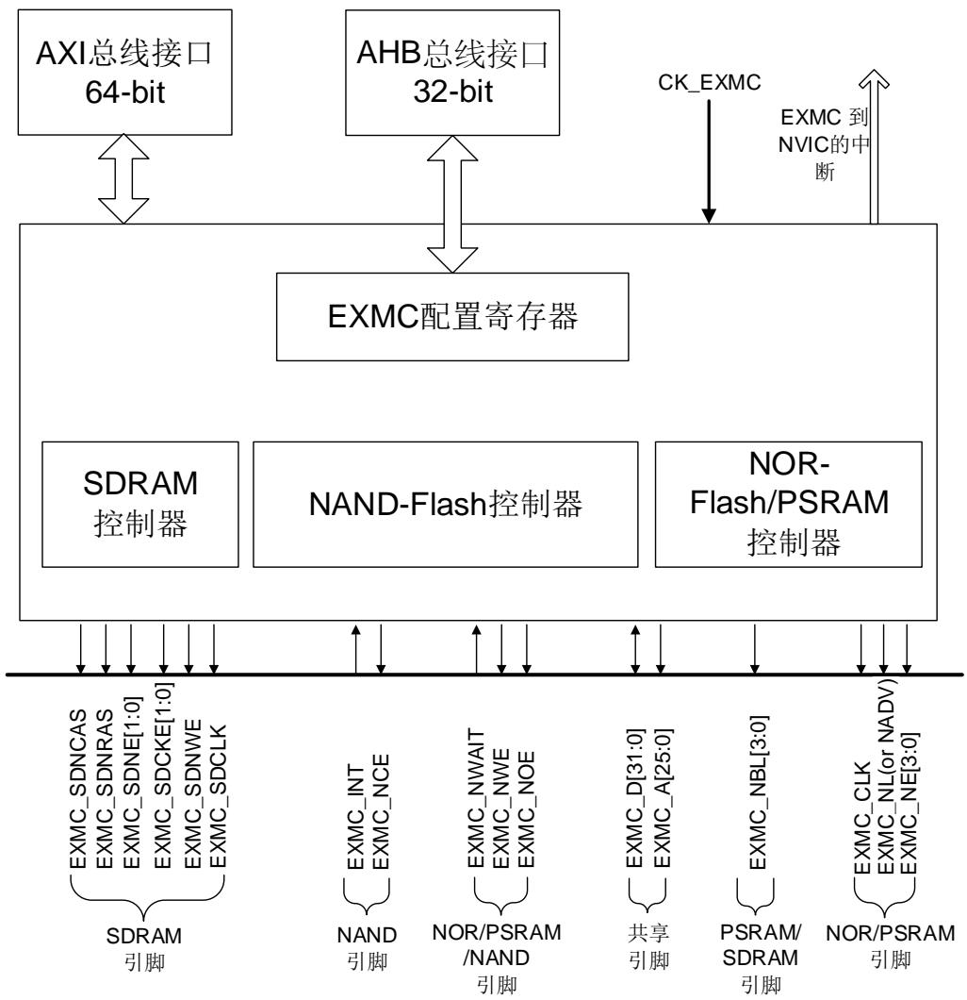

# 38.3.2. 总线接口

AHB 总线接口：CPU 通过 AHB 从接口配置 EXMC 寄存器。

AXI 总线接口：CPU 和 AXI 总线主设备通过 AXI 总线从接口访问外部存储器。

NOR、NAND、SDRAM 控制器的时钟是异步 CK_EXMC 始时钟（具体参考 4RCU_CFG4 。

# 38.3.3. AXI 错误

访问未使能的 EXMC BANK region x $( \mathsf { x } = 0 , . . . , 3 )$ 将产生 AXI 从错误。

如果 EXMC_SNCTLx $( \mathsf { x } = 0 , . . , 3 )$ 寄存器中的 NREN 位被置为 0，访问 EXMC NOR Flash 区将产生 AXI 从错误。

对已被写保护的 SDRAM 设备（WPEN 设置为 1）进行写操作，会产生 AXI 从机错误。

# 38.3.4. EXMC访问基本规范

EXMC是AXI总线至外部设备协议的转换接口。由于AXI数据总线的位宽为64位，因此AXI事务会根据数据大小将一次访问拆分为多个连续的8位、16位或32位访问。在数据传输的过程中，AXI数据宽度和存储器数据宽度可能不相同。为了保证数据传输的一致性，EXMC读写访问需要遵从以下规范：

AXI事务数据宽度等于存储器宽度，则没有问题；

AXI事务数据宽度大于存储器宽度，则自动将AXI访问分割成几个连续的存储器数据宽度的传输；

AXI事务数据宽度小于存储器宽度。如果外部存储设备具有字节选择功能，如SRAM、ROM、PSRAM、SDRAM，则可通过它的字节通道EXMC_NBL[3:0]来访问对应的字节。否则禁止写操作，只允许读操作。

# 38.3.5. 外部设备地址映射

图 38-2. EXMC Bank 划分

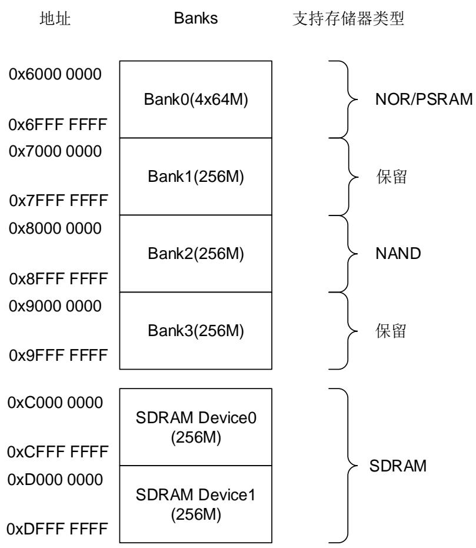

EXMC将外部存储器分成多个Bank，每个Bank占256M字节，其中Bank0又分为4个Region，每个Region占64M字节。Bank2又都被分成2个空间，分别是属性存储空间和通用存储空间。

每个Bank和Region都有独立的片选控制信号，也都能进行独立的配置。

Bank0用于访问NOR、PSRAM设备。

Bank2用于连接NAND Flash。

SDRAM Device0和SDRAM Device1用于连接SDRAM。

EXMC bank映射可以通过EXMC_SNCTL寄存器中的BKREMAP[1:0]位域进行修改。EXMCbank映射如 38-1. EXMC bank 所示。

表 38-1. EXMC bank 映射

<table><tr><td>地址</td><td>BKREMAP[1:0]=00</td><td>BKREMAP[1:0]=01</td></tr><tr><td>0x6000 0000 – 0x6FFF FFFF</td><td>NOR/PSRAM bank</td><td>SDRAM Device 0</td></tr><tr><td>0x7000 0000 – 0x7FFF FFFF</td><td colspan="2">保留</td></tr><tr><td>0x8000 0000 – 0x8FFF FFFF</td><td colspan="2">NAND bank</td></tr><tr><td>0x9000 0000 – 0x9FFF FFFF</td><td colspan="2">保留</td></tr><tr><td>0xC000 0000 – 0xCFFF FFFF</td><td>SDRAM Device 0</td><td>NOR/PSRAM bank</td></tr><tr><td>0xD000 0000 – 0xDFFF FFFF</td><td colspan="2">SDRAM Device 1</td></tr></table>

# NOR/PSRAM 的地址映射

38-3. Bank0 是 Bank0 四个 Region 的地址映射。AXI 地址线 HADDR[27:26]作为四个 Region 的片选信号。

图 38-3. Bank0 地址映射

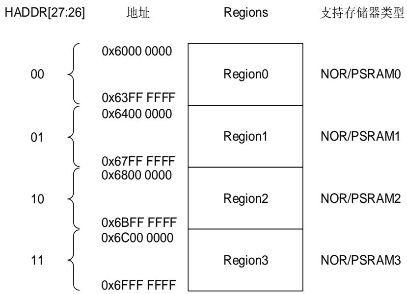

由于HADDR[25:0]是字节地址，而外部存储器访问有可能不是按字节访问的，所以会出现地址不一致的情况，但EXMC能实现对HADDR的调整以适应外部存储器的数据宽度。具体规则如下：

如果外部存储器的数据宽度是 8 位按字节对齐，EXMC 内部将 HADDR[25:0]与EXMC_A[25:0]相连，然后 EXMC_A[25:0]与外部存储器的地址线相连；

如果外部存储器的数据宽度是 16 位按半字对齐，就需要将 HADDR 的字节地址转化为半字地址之后再连接外存储器。EXMC 内部将 HADDR[25:1]与 EXMC_A[24:0]相连，然后EXMC_A[24:0]与外部存储器的地址线相连；

如果外部存储器的数据宽度是 32 位按字对齐，就需要将 HADDR 的字节地址转化为字地址之后再连接外存储器。EXMC 内部将 HADDR[25:2]与 EXMC_A[23:0]相连，然后EXMC_A[23:0]与外部存储器的地址线相连。

# NAND 地址映射

Bank2用来访问NAND Flash，Bank1和Bank3保留。Bank如 38-4. NAND 被分为多个存储空间。

图 38-4. NAND 地址映射

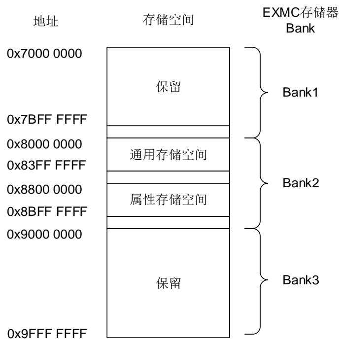

对于NAND FLASH，通用和属性空间又可以细划分为3个区域。 38-5. Bank2 为Bank2通用存储空间的数据区域，指令区域和地址区域的划分。

图 38-5. Bank2 通用空间

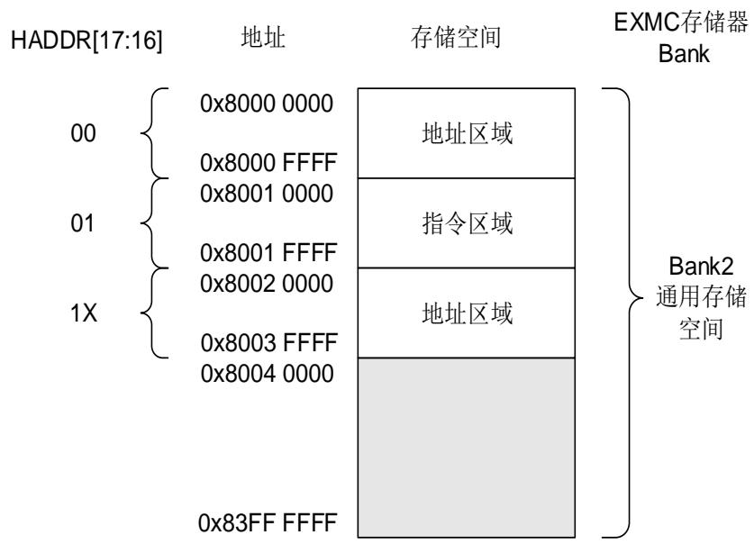

利用HADDR[17:16]来实现对以上三个区的选择：

HADDR[17:16]=00，即选择数据区；

HADDR[17:16]=01，即选择命令区；

HADDR[17:16]=1X，即选择地址区。

应用软件使用这3个区访问NAND FLASH。操作规则如下：

指令区：指定NAND FLASH将要执行的指令，软件在命令区写入指令。在指令传输过程中，EXMC会使能命令锁存信号（CLE），CLE映射到EXMC_A[16]。

地址区：指定操作NAND FLASH的地址，软件在地址区写入地址。在地址传输过程中，EXMC会使能地址锁存信号（ALE），ALE映射到EXMC_A[17]。

数据区：NAND FLASH读写数据，软件在数据区读出或写入数据。当EXMC在数据发送模式，软件需要在数据区写入数据，当EXMC在数据接收模式，软件需要在数据区读取数据。由于NAND FLASH会自动累加其内部操作地址，故在读写时不需要软件修改操作地址。

# SDRAM 地址映射

HADDR[28]位用来选两个SDRAM Device，如 38-6. SDRAM 所示。

图 38-6. SDRAM 地址映射

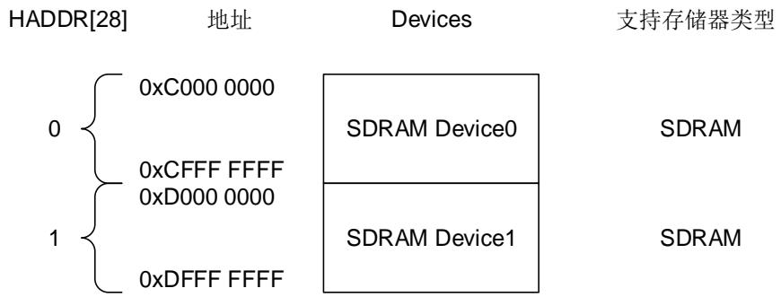

38-2. SDRAM 展示了SDRAM的13位行地址和11位列地址的配置映射：

表 38-2. SDRAM 地址映射

<table><tr><td>存储器数据宽度</td><td>内部 bank</td><td>行地址</td><td>列地址</td><td>最大存储容量</td></tr><tr><td>8-bit</td><td>HADDR[25:24]</td><td>HADDR[23:11]</td><td>HADDR[10:0]</td><td>64 Mbytes: 4 x 8K x 2K</td></tr><tr><td>16-bit</td><td>HADDR[26:25]</td><td>HADDR[24:12]</td><td>HADDR[11:1]</td><td>128 Mbytes: 4 x 8K x 2K x 2</td></tr><tr><td>32-bit</td><td>HADDR[27:26]</td><td>HADDR[25:13]</td><td>HADDR[12:2]</td><td>256 Mbytes: 4 x 8K x 2K x 4</td></tr></table>

# 38.3.6. NOR/PSRAM 控制器

EXMC模块的NOR/PSRAM控制器控制Bank0，它可以支持NOR Flash、PSRAM、SRAM、ROM和CRAM外部存储器。EXMC对Bank0每个Region输出一个唯一的片选信号，NE[x](x=0..3)，用于在4个Region中进行片选，所有其他的信号都是共享的。每个Region都有专门的寄存器控制。

# 注意：

在异步模式下，所有控制器输出信号在内部AXI总线时钟（CK_EXMC）的上升沿改变。

在同步模式下，所有控制器输出数据在外部存储器时钟（EXMC_CLK）的下降沿改变。

# NOR/PSRAM 存储器接口描述

表 38-3. NOR Flash 接口信号描述

<table><tr><td>EXMC 引脚</td><td>传输方向</td><td>模式</td><td>功能描述</td></tr><tr><td>EXMC_CLK</td><td>输出</td><td>同步</td><td>同步时钟信号</td></tr><tr><td>非复用 EXMC_A[25:0]</td><td rowspan="2">输出</td><td rowspan="2">异步/同步</td><td rowspan="2">地址总线</td></tr><tr><td>复用 EXMC_A[25:16]</td></tr><tr><td rowspan="2">EXMC_D[15:0]</td><td>输入/输出</td><td>异步/同步(复用)</td><td>地址/数据总线</td></tr><tr><td>输入/输出</td><td>异步/同步(非复用)</td><td>数据总线</td></tr><tr><td>EXMC_NE[x]</td><td>输出</td><td>异步/同步</td><td>片选,x=0/1/2/3</td></tr><tr><td>EXMC_NOE</td><td>输出</td><td>异步/同步</td><td>读使能</td></tr><tr><td>EXMC_NWE</td><td>输出</td><td>异步/同步</td><td>写使能</td></tr><tr><td>EXMC_NWAIT</td><td>输入</td><td>异步/同步</td><td>等待输入信号</td></tr><tr><td>EXMC_NL(NADV)</td><td>输出</td><td>异步/同步</td><td>地址有效</td></tr></table>

表 38-4. PSRAM 非复用接口信号描述

<table><tr><td>EXMC 引脚</td><td>传输方向</td><td>模式</td><td>功能描述</td></tr><tr><td>EXMC_CLK</td><td>输出</td><td>同步</td><td>同步时钟信号</td></tr><tr><td>EXMC_A[25:0]</td><td>输出</td><td>异步/同步</td><td>地址总线</td></tr><tr><td>EXMC_D[15:0]</td><td>输入/输出</td><td>异步/同步</td><td>数据总线</td></tr><tr><td>EXMC_NE[x]</td><td>输出</td><td>异步/同步</td><td>片选,x=0/1/2/3</td></tr><tr><td>EXMC_NOE</td><td>输出</td><td>异步/同步</td><td>读使能</td></tr><tr><td>EXMC_NWE</td><td>输出</td><td>异步/同步</td><td>写使能</td></tr><tr><td>EXMC_NWAIT</td><td>输入</td><td>异步/同步</td><td>等待输入信号</td></tr><tr><td>EXMC_NL(NADV)</td><td>输出</td><td>异步/同步</td><td>地址锁存信号</td></tr><tr><td>EXMC_NBL[1]</td><td>输出</td><td>异步/同步</td><td>高字节使能</td></tr><tr><td>EXMC_NBL[0]</td><td>输出</td><td>异步/同步</td><td>低字节使能</td></tr></table>

# 支持的存储器访问模式

38-5. EXMC Bank0 列出了存储器数据总线为16位时EXMC对NOR，PSRAM和SRAM支持的访问模式。

表 38-5. EXMC Bank0 支持的访问模式

<table><tr><td>存储器类型</td><td>访问模式</td><td>读/写</td><td>AXI事务宽度</td><td>存储器传输宽度</td><td>注释</td></tr><tr><td rowspan="12">NOR Flash</td><td>异步</td><td>R</td><td>8</td><td>16</td><td></td></tr><tr><td>异步</td><td>W</td><td>8</td><td>16</td><td>不允许</td></tr><tr><td>异步</td><td>R</td><td>16</td><td>16</td><td></td></tr><tr><td>异步</td><td>W</td><td>16</td><td>16</td><td></td></tr><tr><td>异步</td><td>R</td><td>32</td><td>16</td><td>分成2次EXMC访问</td></tr><tr><td>异步</td><td>W</td><td>32</td><td>16</td><td>分成2次EXMC访问</td></tr><tr><td>异步</td><td>R</td><td>64</td><td>16</td><td>分成4次EXMC访问</td></tr><tr><td>异步</td><td>W</td><td>64</td><td>16</td><td>分成4次EXMC访问</td></tr><tr><td>同步</td><td>R</td><td>8</td><td>16</td><td>不允许</td></tr><tr><td>同步</td><td>R</td><td>16</td><td>16</td><td></td></tr><tr><td>同步</td><td>R</td><td>32</td><td>16</td><td></td></tr><tr><td>同步</td><td>R</td><td>64</td><td>16</td><td></td></tr><tr><td rowspan="5">PSRAM</td><td>异步</td><td>R</td><td>8</td><td>16</td><td></td></tr><tr><td>异步</td><td>W</td><td>8</td><td>16</td><td>使用字节信号EXMC_NBL[1:0]</td></tr><tr><td>异步</td><td>R</td><td>16</td><td>16</td><td></td></tr><tr><td>异步</td><td>W</td><td>16</td><td>16</td><td></td></tr><tr><td>异步</td><td>R</td><td>32</td><td>16</td><td>分成2次EXMC访问</td></tr><tr><td rowspan="11"></td><td>异步</td><td>W</td><td>32</td><td>16</td><td>分成2次EXMC访问</td></tr><tr><td>异步</td><td>R</td><td>64</td><td>16</td><td>分成4次EXMC访问</td></tr><tr><td>异步</td><td>W</td><td>64</td><td>16</td><td>分成4次EXMC访问</td></tr><tr><td>同步</td><td>R</td><td>8</td><td>16</td><td>不允许</td></tr><tr><td>同步</td><td>R</td><td>16</td><td>16</td><td></td></tr><tr><td>同步</td><td>R</td><td>32</td><td>16</td><td></td></tr><tr><td>同步</td><td>R</td><td>64</td><td>16</td><td></td></tr><tr><td>同步</td><td>W</td><td>8</td><td>16</td><td>使用字节信号EXMC_NBL[1:0]</td></tr><tr><td>同步</td><td>W</td><td>16</td><td>16</td><td></td></tr><tr><td>同步</td><td>W</td><td>32</td><td>16</td><td></td></tr><tr><td>同步</td><td>W</td><td>64</td><td>16</td><td></td></tr><tr><td rowspan="8">SRAM和ROM</td><td>异步</td><td>R</td><td>8</td><td>16</td><td></td></tr><tr><td>异步</td><td>R</td><td>16</td><td>16</td><td></td></tr><tr><td>异步</td><td>R</td><td>32</td><td>16</td><td>分成2次EXMC访问</td></tr><tr><td>异步</td><td>R</td><td>64</td><td>16</td><td>分成4次EXMC访问</td></tr><tr><td>异步</td><td>W</td><td>8</td><td>16</td><td>使用字节信号EXMC_NBL[1:0]</td></tr><tr><td>异步</td><td>W</td><td>16</td><td>16</td><td></td></tr><tr><td>异步</td><td>W</td><td>32</td><td>16</td><td>使用字节信号EXMC_NBL[1:0]</td></tr><tr><td>异步</td><td>W</td><td>64</td><td>16</td><td>使用字节信号EXMC_NBL[1:0]</td></tr></table>

# NOR Flash/PSRAM 控制时序

EXMC为SRAM、ROM、PSRAM、NOR Flash等外部静态存储器提供可编程的时序参数以及多种时序模型以满足不同的需求。

表 38-6. NOR/PSRAM 控制时序参数

<table><tr><td>参数</td><td>功能</td><td>访问模式</td><td>单位</td><td>最小值</td><td>最大值</td></tr><tr><td>CKDIV</td><td>同步时钟分频比</td><td>同步</td><td>CK_EXMC</td><td>2</td><td>16</td></tr><tr><td>DLAT</td><td>数据延迟</td><td>同步</td><td>EXMC_CLK</td><td>2</td><td>17</td></tr><tr><td>BUSLAT</td><td>总线延迟</td><td>异步/同步读</td><td>CK_EXMC</td><td>0</td><td>15</td></tr><tr><td>DSET</td><td>数据建立时间</td><td>异步</td><td>CK_EXMC</td><td>1</td><td>255</td></tr><tr><td>AHLD</td><td>地址保持时间</td><td>异步(复用)</td><td>CK_EXMC</td><td>1</td><td>15</td></tr><tr><td>ASET</td><td>地址建立时间</td><td>异步</td><td>CK_EXMC</td><td>0</td><td>15</td></tr></table>

表 38-7. EXMC 时序模型

<table><tr><td colspan="2">时序模型</td><td>扩展模式</td><td>模式描述</td><td>写时序参数</td><td>读时序参数</td></tr><tr><td rowspan="4">异步</td><td rowspan="2">模式1</td><td rowspan="2">0</td><td rowspan="2">SRAM/PSRAM/CRAM</td><td>DSET</td><td>DSET</td></tr><tr><td>ASET</td><td>ASET</td></tr><tr><td rowspan="2">模式2</td><td rowspan="2">0</td><td rowspan="2">NOR Flash</td><td>DSET</td><td>DSET</td></tr><tr><td>ASET</td><td>ASET</td></tr><tr><td rowspan="5"></td><td>模式A</td><td>1</td><td>SRAM/PSRAM/CRAM 在数据阶段 EXMC_OE 翻转</td><td>WDSETWASET</td><td>DSETASET</td></tr><tr><td>模式B</td><td>1</td><td>NOR Flash</td><td>WDSETWASET</td><td>DSETASET</td></tr><tr><td>模式C</td><td>1</td><td>NOR Flash 在数据阶段 EXMC_OE 翻转</td><td>WDSETWASET</td><td>DSETASET</td></tr><tr><td>模式D</td><td>1</td><td>有地址保持功能</td><td>WDSETWAHLDWASET</td><td>DSETAHLDASET</td></tr><tr><td>模式AM</td><td>0</td><td>NOR Flash 数据/地址复用</td><td>DSETAHLDASETBUSLAT</td><td>DSETAHLDASETBUSLAT</td></tr><tr><td rowspan="2">同步</td><td>模式E</td><td>0</td><td>NOR/PSRAM/CRAM 同步读 PSRAM/CRAM 同步写</td><td>DLATCKDIV</td><td>DLATCKDIV</td></tr><tr><td>模式SM</td><td>0</td><td>NOR Flash 数据/地址复用</td><td>DLATCKDIV</td><td>DLATCKDIV</td></tr></table>

如 38-7. EXMC 所示，EXMC模块NOR Flash/PSRAM控制器可以提供多种时序模型。用户可以通过修改 38-6. NOR/PSRAM 中列出的参数来使之适合不同类型外部存储器的时序以及满足用户的要求。当将寄存器EXMC_SNCTLx位EXMODEN置1使能扩展模式后，可以通过寄存器EXMC_SNTCFGx和EXMC_SNWTCFGx将读写配置成独立的时序。

EXMC_CLK可以通过CCK位来设置。如果CCK是0，当NOR Flash使用同步模式时会产生EXMC_CLK；如果CCK是1，当NOR Flash同步模式和异步模式都会产生EXMC_CLK。

# 异步访问时序

模式1 - SRAM/CRAM

图 38-7. 模式 1 读时序

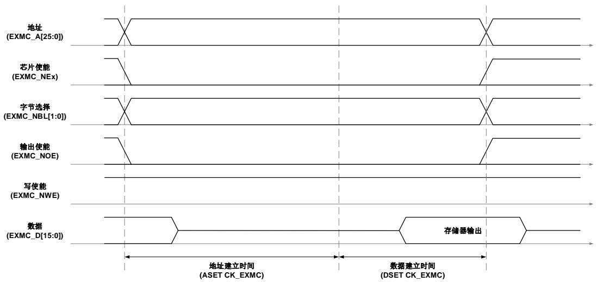

图 38-8. 模式 1 写时序

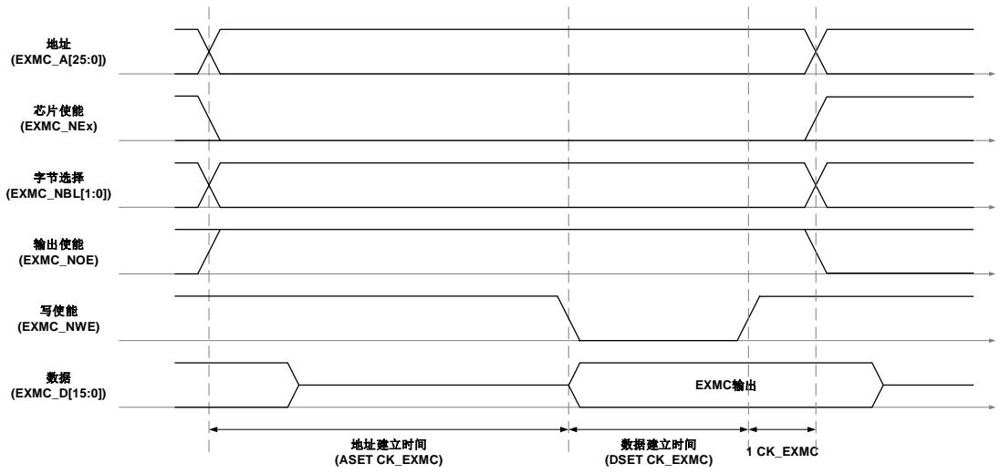

表 38-8. 模式 1 相关寄存器配置

<table><tr><td>位域/位</td><td>名称</td><td>参考设定值</td></tr><tr><td colspan="3">EXMC_SNCTLx</td></tr><tr><td>31-21</td><td>保留</td><td>0x000</td></tr><tr><td>20</td><td>CCK</td><td>取决于存储器与用户</td></tr><tr><td>19</td><td>SYNCWR</td><td>0x0</td></tr><tr><td>18-16</td><td>CPS</td><td>0x0</td></tr><tr><td>15</td><td>ASYNCWTEN</td><td>取决于存储器</td></tr><tr><td>14</td><td>EXMODEN</td><td>0x0</td></tr><tr><td>13</td><td>NRWTEN</td><td>0x0</td></tr><tr><td>12</td><td>WEN</td><td>取决于用户</td></tr><tr><td>11</td><td>NRWTCFG</td><td>无影响</td></tr><tr><td>10</td><td>保留</td><td>0x0</td></tr><tr><td>9</td><td>NRWTPOL</td><td>仅当位15为1时有效</td></tr><tr><td>8</td><td>SBRSTEN</td><td>0x0</td></tr><tr><td>7</td><td>保留</td><td>0x1</td></tr><tr><td>6</td><td>NREN</td><td>无影响</td></tr><tr><td>5-4</td><td>NRW</td><td>取决于存储器</td></tr><tr><td>3-2</td><td>NRTP</td><td>取决于存储器,除了2(Nor Flash)</td></tr><tr><td>1</td><td>NRMUX</td><td>0x0</td></tr><tr><td>0</td><td>NRBKEN</td><td>0x1</td></tr><tr><td colspan="3">EXMC_SNTCFGx</td></tr><tr><td>31-30</td><td>保留</td><td>0x0000</td></tr><tr><td>29-28</td><td>ASYNCMOD</td><td>无影响</td></tr><tr><td>27-24</td><td>DLAT</td><td>无影响</td></tr><tr><td>23-20</td><td>CKDIV</td><td>无影响</td></tr><tr><td>19-16</td><td>BUSLAT</td><td>EXMC_NE[x]上升沿到下降沿的时间</td></tr><tr><td>15-8</td><td>DSET</td><td>取决于存储器与用户(写操作为DSET+1 CK_EXMC时钟周期,读操作为DSET CK_EXMC时钟周期)</td></tr><tr><td>7-4</td><td>AHLD</td><td>无影响</td></tr><tr><td>3-0</td><td>ASET</td><td>取决于存储器与用户</td></tr></table>

模式A - SRAM/PSRAM(CRAM) OE翻转

图 38-9. 模式 A 读时序

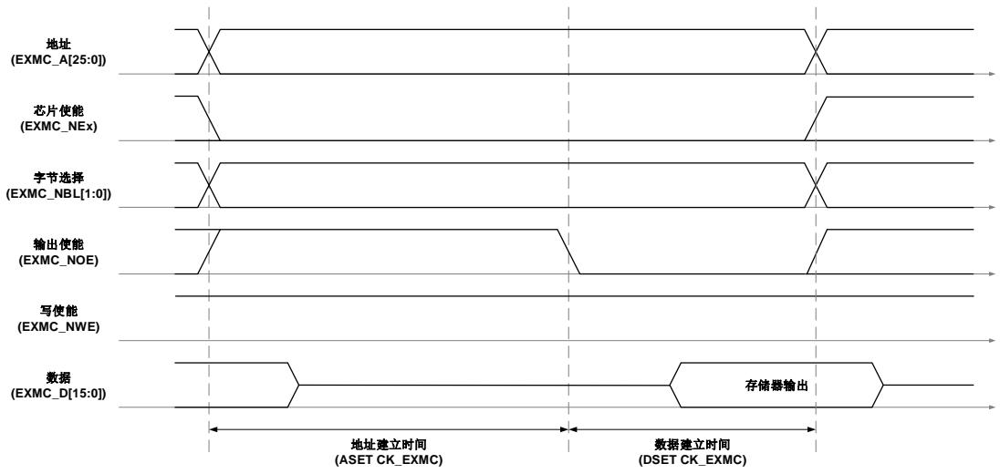

图 38-10. 模式 A 写时序

模式A和模式1的区别在于写时序，当两个模式的寄存器有相同的时序配置时，模式A的写时序独立于读时序。

表 38-9. 模式 A 相关寄存器配置

<table><tr><td>位域/位</td><td>名称</td><td>参考设定值</td></tr><tr><td colspan="3">EXMC_SNCTLx</td></tr><tr><td>31-21</td><td>保留</td><td>0x000</td></tr><tr><td>20</td><td>CCK</td><td>取决于存储器与用户</td></tr><tr><td>19</td><td>SYNCWR</td><td>0x0</td></tr><tr><td>18-16</td><td>CPS</td><td>0x0</td></tr><tr><td>15</td><td>ASYNCWTEN</td><td>取决于存储器</td></tr><tr><td>14</td><td>EXMODEN</td><td>0x1</td></tr><tr><td>13</td><td>NRWTEN</td><td>0x0</td></tr><tr><td>12</td><td>WEN</td><td>取决于用户</td></tr><tr><td>11</td><td>NRWTCFG</td><td>无影响</td></tr><tr><td>10</td><td>保留</td><td>0x0</td></tr><tr><td>9</td><td>NRWTPOL</td><td>仅当位15为1时有效</td></tr><tr><td>8</td><td>SBRSTEN</td><td>0x0</td></tr><tr><td>7</td><td>保留</td><td>0x1</td></tr><tr><td>6</td><td>NREN</td><td>无影响</td></tr><tr><td>5-4</td><td>NRW</td><td>取决于存储器</td></tr><tr><td>3-2</td><td>NRTP</td><td>取决于存储器,除了2(Nor Flash)</td></tr><tr><td>1</td><td>NRMUX</td><td>0x0</td></tr><tr><td>0</td><td>NRBKEN</td><td>0x1</td></tr><tr><td colspan="3">EXMC_SNTCFGx(读)</td></tr><tr><td>31-30</td><td>保留</td><td>0x0</td></tr><tr><td>29-28</td><td>ASYNCMOD</td><td>0x0</td></tr><tr><td>27-24</td><td>DLAT</td><td>无影响</td></tr><tr><td>23-20</td><td>CKDIV</td><td>无影响</td></tr><tr><td>19-16</td><td>BUSLAT</td><td>EXMC_NE[x]上升沿到下降沿的时间</td></tr><tr><td>15-8</td><td>DSET</td><td>取决于存储器与用户(写操作为DSET+1CK_EXMC时钟周期,读操作为DSET CK_EXMC时钟周期)</td></tr><tr><td>7-4</td><td>AHLD</td><td>无影响</td></tr><tr><td>3-0</td><td>ASET</td><td>取决于存储器与用户</td></tr><tr><td colspan="3">EXMC_SNWTCFGx(写)</td></tr><tr><td>31-30</td><td>保留</td><td>0x0</td></tr><tr><td>29-28</td><td>WASYNCMOD</td><td>0x0</td></tr><tr><td>27-20</td><td>保留</td><td>0x00</td></tr><tr><td>19-16</td><td>WBUSLAT</td><td>EXMC_NE[x]上升沿到下降沿的时间</td></tr><tr><td>15-8</td><td>WDSET</td><td>取决于存储器与用户</td></tr><tr><td>7-4</td><td>WAHLD</td><td>0x0</td></tr><tr><td>3-0</td><td>WASET</td><td>取决于存储器与用户</td></tr></table>

模式2/B - NOR Flash

图 38-11. 模式 2/B 读时序

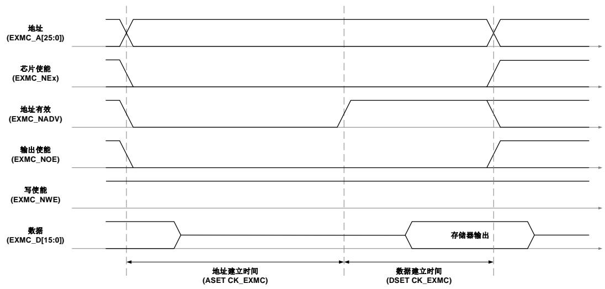

图 38-12. 模式 2 写时序

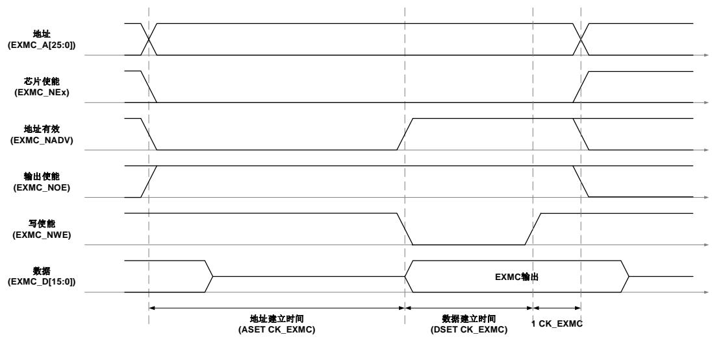

图 38-13. 模式 B 写时序

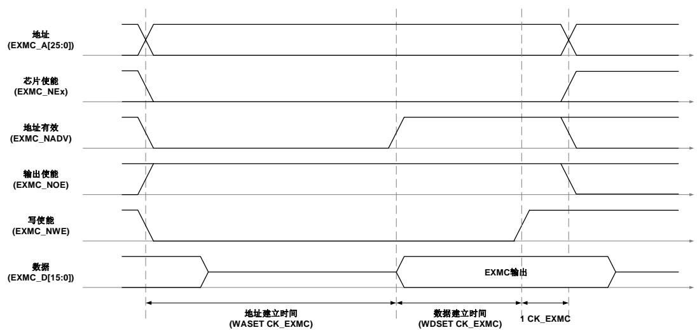

表 38-10. 模式 2/B 相关寄存器配置

<table><tr><td>位域/位</td><td>名称</td><td>参考设定值</td></tr><tr><td colspan="3">EXMC_SNCTLx(模式2,模式B)</td></tr><tr><td>31-21</td><td>保留</td><td>0x000</td></tr><tr><td>20</td><td>CCK</td><td>取决于存储器与用户</td></tr><tr><td>19</td><td>SYNCWR</td><td>0x0</td></tr><tr><td>18-16</td><td>CPS</td><td>0x0</td></tr><tr><td>15</td><td>ASYNCWTEN</td><td>取决于存储器</td></tr><tr><td>14</td><td>EXMODEN</td><td>模式2:0x0,模式B:0x1</td></tr><tr><td>13</td><td>NRWTEN</td><td>0x0</td></tr><tr><td>12</td><td>WEN</td><td>取决于用户</td></tr><tr><td>11</td><td>NRWTCFG</td><td>无影响</td></tr><tr><td>10</td><td>保留</td><td>0x0</td></tr><tr><td>9</td><td>NRWTPOL</td><td>仅当位15为1时有效</td></tr><tr><td>8</td><td>SBRSTEN</td><td>0x0</td></tr><tr><td>7</td><td>保留</td><td>0x1</td></tr><tr><td>6</td><td>NREN</td><td>0x1</td></tr><tr><td>5-4</td><td>NRW</td><td>取决于存储器</td></tr><tr><td>3-2</td><td>NRTP</td><td>0x2,NOR Flash</td></tr><tr><td>1</td><td>NRMUX</td><td>0x0</td></tr><tr><td>0</td><td>NRBKEN</td><td>0x1</td></tr><tr><td colspan="3">EXMC_SNTCFGx(模式2读/写操作,模式B读操作)</td></tr><tr><td>31-30</td><td>保留</td><td>0x0000</td></tr><tr><td>29-28</td><td>ASYNCMOD</td><td>模式B:0x1</td></tr><tr><td>27-24</td><td>DLAT</td><td>无影响</td></tr><tr><td>23-20</td><td>CKDIV</td><td>无影响</td></tr><tr><td>19-16</td><td>BUSLAT</td><td>EXMC_NE[x]上升沿到下降沿的时间</td></tr><tr><td>15-8</td><td>DSET</td><td>取决于存储器与用户</td></tr><tr><td>7-4</td><td>AHLD</td><td>0x0</td></tr><tr><td>3-0</td><td>ASET</td><td>取决于存储器与用户</td></tr><tr><td colspan="3">EXMC_SNWTCFGx(模式B写操作)</td></tr><tr><td>31-30</td><td>保留</td><td>0x0000</td></tr><tr><td>29-28</td><td>WASYNCMOD</td><td>模式B:0x1</td></tr><tr><td>27-20</td><td>保留</td><td>0x000</td></tr><tr><td>19-16</td><td>WBUSLAT</td><td>EXMC_NE[x]上升沿到下降沿的时间</td></tr><tr><td>15-8</td><td>WDSET</td><td>取决于存储器与用户</td></tr><tr><td>7-4</td><td>WAHLD</td><td>0x0</td></tr><tr><td>3-0</td><td>WASET</td><td>取决于存储器与用户</td></tr></table>

模式C - NOR Flash OE翻转

图 38-14. 模式 C 读时序

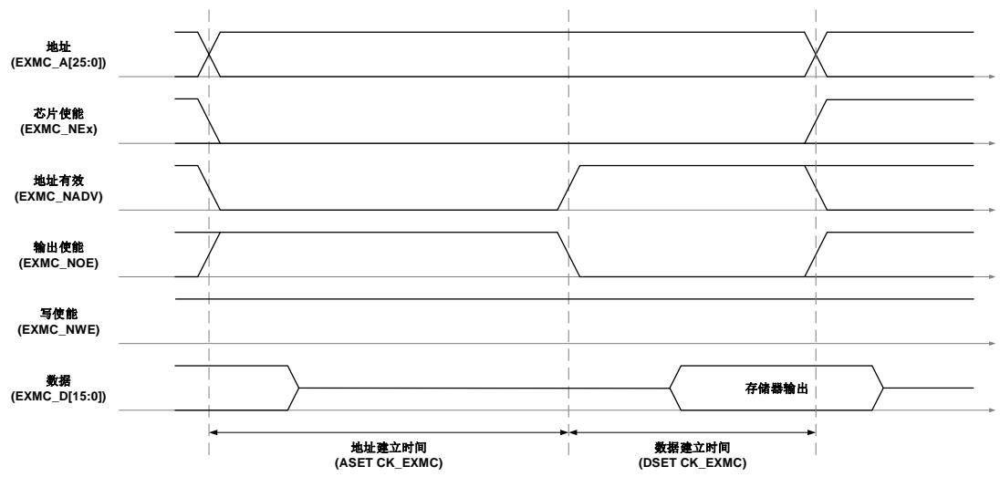

图 38-15. 模式 C 写时序

模式C和模式1的区别在于写时序，当两个模式的寄存器有相同的时序配置时，模式C的写时序独立于读时序。

表 38-11. 模式 C 相关寄存器配置

<table><tr><td>位域/位</td><td>名称</td><td>参考设定值</td></tr><tr><td colspan="3">EXMC_SNCTLx</td></tr><tr><td>31-21</td><td>保留</td><td>0x000</td></tr><tr><td>20</td><td>CCK</td><td>取决于存储器与用户</td></tr><tr><td>19</td><td>SYNCWR</td><td>0x0</td></tr><tr><td>18-16</td><td>CPS</td><td>0x0</td></tr><tr><td>15</td><td>ASYNCWTEN</td><td>取决于存储器</td></tr><tr><td>14</td><td>EXMODEN</td><td>0x1</td></tr><tr><td>13</td><td>NRWTEN</td><td>0x0</td></tr><tr><td>12</td><td>WEN</td><td>取决于用户</td></tr><tr><td>11</td><td>NRWTCFG</td><td>无影响</td></tr><tr><td>10</td><td>保留</td><td>0x0</td></tr><tr><td>9</td><td>NRWTPOL</td><td>仅当位 15 为 1 时有效</td></tr><tr><td>8</td><td>SBRSTEN</td><td>0x0</td></tr><tr><td>7</td><td>保留</td><td>0x1</td></tr><tr><td>6</td><td>NREN</td><td>0x1</td></tr><tr><td>5-4</td><td>NRW</td><td>取决于存储器</td></tr><tr><td>3-2</td><td>NRTP</td><td>0x2, NOR Flash</td></tr><tr><td>1</td><td>NRMUX</td><td>0x0</td></tr><tr><td>0</td><td>NRBKEN</td><td>0x1</td></tr><tr><td colspan="3">EXMC_SNTCFGx</td></tr><tr><td>31-30</td><td>保留</td><td>0x0000</td></tr><tr><td>29-28</td><td>ASYNCMOD</td><td>模式 C: 0x2</td></tr><tr><td>27-24</td><td>DLAT</td><td>0x0</td></tr><tr><td>23-20</td><td>CKDIV</td><td>0x0</td></tr><tr><td>19-16</td><td>BUSLAT</td><td>EXMC_NE[x]上升沿到下降沿的时间</td></tr><tr><td>15-8</td><td>DSET</td><td>取决于存储器与用户</td></tr><tr><td>7-4</td><td>AHLD</td><td>0x0</td></tr><tr><td>3-0</td><td>ASET</td><td>取决于存储器与用户</td></tr><tr><td colspan="3">EXMC_SNWTCFGx</td></tr><tr><td>31-30</td><td>保留</td><td>0x0</td></tr><tr><td>29-28</td><td>WASYNCMOD</td><td>模式 C: 0x2</td></tr><tr><td>27-20</td><td>保留</td><td>0x00</td></tr><tr><td>19-16</td><td>WBUSLAT</td><td>EXMC_NE[x]上升沿到下降沿的时间</td></tr><tr><td>15-8</td><td>WDSET</td><td>取决于存储器与用户</td></tr><tr><td>7-4</td><td>WAHLD</td><td>0x0</td></tr><tr><td>3-0</td><td>WASET</td><td>取决于存储器与用户</td></tr></table>

模式D - 带地址扩展的异步操作

图 38-16. 模式 D 读时序

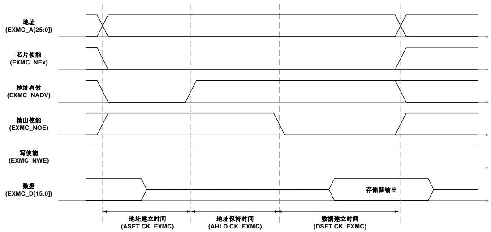

图 38-17. 模式 D 写时序

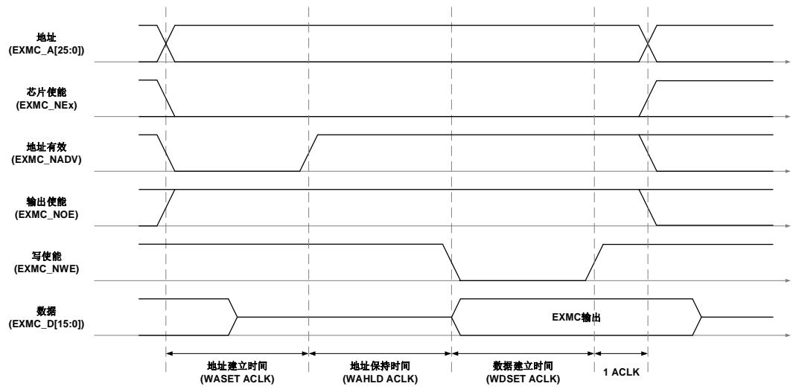

表 38-12. 模式 D 相关寄存器配置

<table><tr><td>位域/位</td><td>名称</td><td>参考设定值</td></tr><tr><td colspan="3">EXMC_SNCTLx</td></tr><tr><td>31-21</td><td>保留</td><td>0x000</td></tr><tr><td>20</td><td>CCK</td><td>取决于存储器与用户</td></tr><tr><td>19</td><td>SYNCWR</td><td>0x0</td></tr><tr><td>18-16</td><td>CPS</td><td>0x0</td></tr><tr><td>15</td><td>ASYNCWTEN</td><td>取决于存储器</td></tr><tr><td>14</td><td>EXMODEN</td><td>0x1</td></tr><tr><td>13</td><td>NRWTEN</td><td>0x0</td></tr><tr><td>12</td><td>WEN</td><td>取决于用户</td></tr><tr><td>11</td><td>NRWTCFG</td><td>无影响</td></tr><tr><td>10</td><td>保留</td><td>0x0</td></tr><tr><td>9</td><td>NRWTPOL</td><td>仅当位15为1时有效</td></tr><tr><td>8</td><td>SBRSTEN</td><td>0x0</td></tr><tr><td>7</td><td>保留</td><td>0x1</td></tr><tr><td>6</td><td>NREN</td><td>取决于存储器</td></tr><tr><td>5-4</td><td>NRW</td><td>取决于存储器</td></tr><tr><td>3-2</td><td>NRTP</td><td>取决于存储器</td></tr><tr><td>1</td><td>NRMUX</td><td>0x0</td></tr><tr><td>0</td><td>NRBKEN</td><td>0x1</td></tr><tr><td colspan="3">EXMC_SNTCFGx</td></tr><tr><td>31-30</td><td>保留</td><td>0x0</td></tr><tr><td>29-28</td><td>ASYNCMOD</td><td>模式D: 0x3</td></tr><tr><td>27-24</td><td>DLAT</td><td>无关</td></tr><tr><td>23-20</td><td>CKDIV</td><td>无影响</td></tr><tr><td>19-16</td><td>BUSLAT</td><td>EXMC_NE[x]上升沿到下降沿的时间</td></tr><tr><td>15-8</td><td>DSET</td><td>取决于存储器与用户</td></tr><tr><td>7-4</td><td>AHLD</td><td>取决于存储器与用户</td></tr><tr><td>3-0</td><td>ASET</td><td>取决于存储器与用户</td></tr><tr><td colspan="3">EXMC_SNWTCFGx</td></tr><tr><td>31-30</td><td>保留</td><td>0x0</td></tr><tr><td>29-28</td><td>WASYNCMOD</td><td>模式 D: 0x3</td></tr><tr><td>27-20</td><td>保留</td><td>0x00</td></tr><tr><td>19-16</td><td>WBUSLAT</td><td>EXMC_NE[x]上升沿到下降沿的时间</td></tr><tr><td>15-8</td><td>WDSET</td><td>取决于存储器与用户</td></tr><tr><td>7-4</td><td>WAHLD</td><td>取决于存储器与用户</td></tr><tr><td>3-0</td><td>WASET</td><td>取决于存储器与用户</td></tr></table>

模式M - NOR Flash地址/数据总线复用

图 38-18. 复用模式读时序

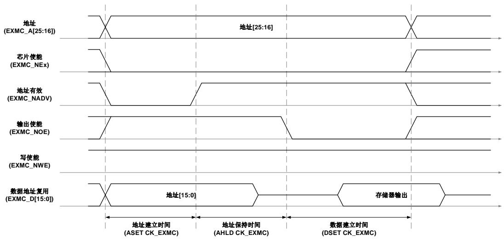

图 38-19. 复用模式写时序

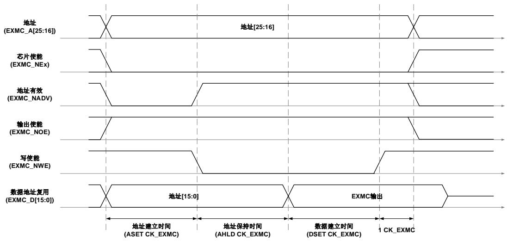

表 38-13. 复用模式相关寄存器配置

<table><tr><td>位域/位</td><td>名称</td><td>参考设定值</td></tr><tr><td colspan="3">EXMC_SNCTLx</td></tr><tr><td>31-21</td><td>保留</td><td>0x000</td></tr><tr><td>20</td><td>CCK</td><td>取决于存储器</td></tr><tr><td>19</td><td>SYNCWR</td><td>0x0</td></tr><tr><td>18-16</td><td>CPS</td><td>0x0</td></tr><tr><td>15</td><td>ASYNCWTEN</td><td>取决于存储器</td></tr><tr><td>14</td><td>EXMODEN</td><td>0x0</td></tr><tr><td>13</td><td>NRWTEN</td><td>0x0</td></tr><tr><td>12</td><td>WEN</td><td>取决于存储器</td></tr><tr><td>11</td><td>NRWTCFG</td><td>无影响</td></tr><tr><td>10</td><td>保留</td><td>0x0</td></tr><tr><td>9</td><td>NRWTPOL</td><td>仅当位15为1时有效</td></tr><tr><td>8</td><td>SBRSTEN</td><td>0x0</td></tr><tr><td>7</td><td>保留</td><td>0x1</td></tr><tr><td>6</td><td>NREN</td><td>0x1</td></tr><tr><td>5-4</td><td>NRW</td><td>取决于存储器</td></tr><tr><td>3-2</td><td>NRTP</td><td>0x2:NOR Flash</td></tr><tr><td>1</td><td>NRMUX</td><td>0x1</td></tr><tr><td>0</td><td>NRBKEN</td><td>0x1</td></tr><tr><td colspan="3">EXMC_SNTCFGx</td></tr><tr><td>31-30</td><td>保留</td><td>0x0</td></tr><tr><td>29-28</td><td>ASYNCMOD</td><td>0x0</td></tr><tr><td>27-24</td><td>DLAT</td><td>无影响</td></tr><tr><td>23-20</td><td>CKDIV</td><td>无影响</td></tr><tr><td>19-16</td><td>BUSLAT</td><td>EXMC_NE[x]上升沿到下降沿的时间</td></tr><tr><td>15-8</td><td>DSET</td><td>取决于存储器与用户</td></tr><tr><td>7-4</td><td>AHLD</td><td>取决于存储器与用户</td></tr><tr><td>3-0</td><td>ASET</td><td>取决于存储器与用户</td></tr></table>

# 异步通信的等待时间

等待功能由寄存器EXMC_SNCTLx位ASYNCWTEN控制。在访问外部存储器期间，若使能异步等待功能（ASYNCWTEN=1），数据建立时间将会自动延长。延长时间的计算如下：

若存储器等待信号与EXMC_NOE/ EXMC_NWE信号对齐：

$$
T _ {\text { DATA\_SETUP }} \geq \max T _ {\text { WAIT\_ASSERTION }} + 4 \text { CK\_EXMC } \tag {38-1}
$$

若存储器等待信号与EXMC_NE信号对齐：

如果

$$
\max T _ {\text { WAIT\_ASSERTION }} \geq T _ {\text { ADDRES\_PHASE }} + T _ {\text { HOLD\_PHASE }} \tag {38-2}
$$

则

$$
T _ {\text { DATA\_SETUP }} \geq (\max T _ {\text { WAIT\_ASSERTION }} - T _ {\text { ADDRES\_PHASE }} - T _ {\text { HOLD\_PHASE }}) + 4 \text { CK\_EXMC } \tag {38-3}
$$

否则

$$
T _ {\text { DATA\_SETUP }} \geq 4 \mathrm{CK} \_ \text { EXMC } \tag {38-4}
$$

图 38-20. 异步等待有效时的读时序

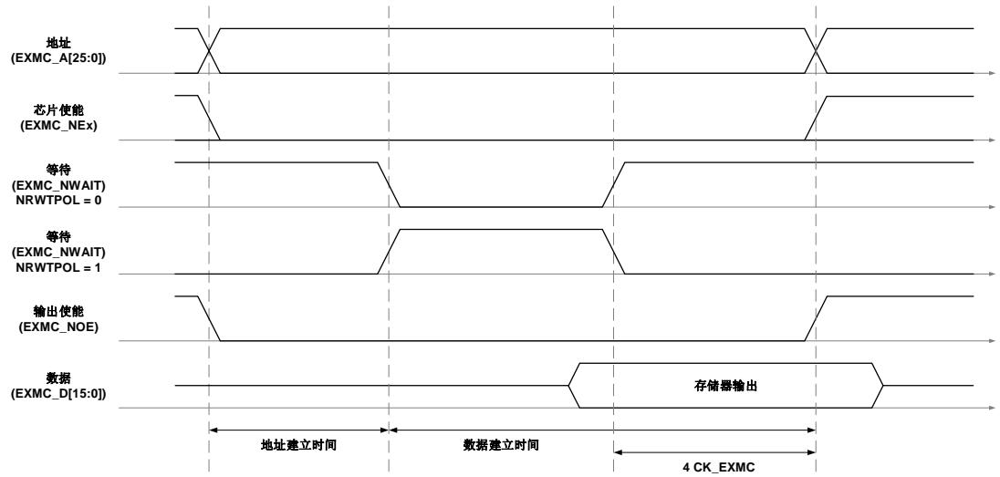

图 38-21. 异步等待有效时的写时序

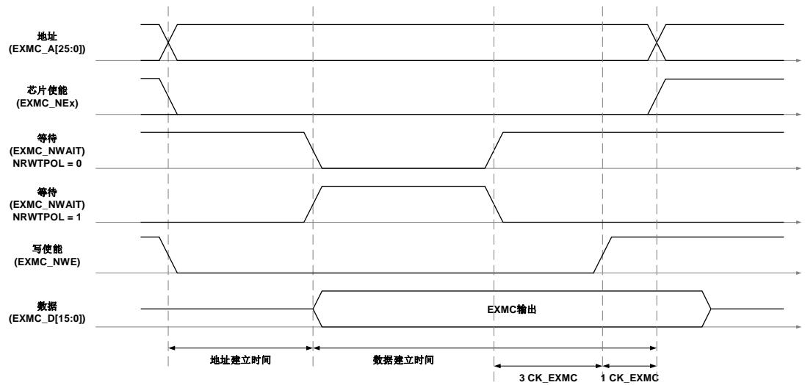

# 同步访问时序

存储器时钟（EXMC_CLK）与系统时钟（CK_EXMC）关系如下：

$$
\text { EXMC\_CLK } = \frac {\text { CK\_EXMC }}{\text { CKDIV } + 1} \tag {38-5}
$$

其中CKDIV是同步时钟分频比，通过配置寄存器EXMC_SNTCFGx中的CKDIV位来设置不同的值。

# 1. 数据延迟与NOR Flash延迟

数据延迟 DLAT 是指在采样数据之前需要等待的 EXMC_CLK 周期数。它和 NOR 闪存延迟的关系如下：

NOR闪存延迟不包含EXMC_NADV，二者之间的关系为：

$$
\text { N   O   R   闪   存   延   迟 } = \mathrm{DLAT} + 2 \tag {38-6}
$$

NOR闪存延迟包含EXMC_NADV，二者之间的关系为：

$$
\text { NOR   闪存延迟 } = \mathrm{DLAT} + 3 \tag {38-7}
$$

# 1. 数据等待

用户需要保证 EXMC_NWAIT 信号与外部设备一致。该信号通过寄存器 EXMC_SNCTLx 来设置，位 NRWTEN 使能，位 NRWTCFG 决定 EXMC_NWAIT 信号是等待状态同时有效，或者比等待状态提前一个时钟周期有效，位 NRWTPOL 设置 EXMC_NWAIT 信号极性。

在 NOR Flash 的同步突发模式中，当寄存器 EXMC_SNCTLx 位 NRWTEN 置 1，在数据延迟之后后检测到 EXMC_NWAIT 信号。如果 EXMC_NWAIT 有效，在 EXMC_NWAIT 无效之前会一直插入等待时钟。

EXMC_NWAIT有效极性：

NRWTPOL = 1，EXMC_NWAIT 高电平有效

NRWTPOL = 0，EXMC_NWAIT 低电平有效

在同步突发模式中，EXMC_NWAIT 信号有两种配置：

NRWTCFG = 1，EXMC_NWAIT 信号有效时，当前时钟周期数据无效

NRWTCFG = 0，EXMC_NWAIT 信号有效时，下一个时钟周期数据无效，这是复位后的默认配置。

在 EXMC_NWAIT 信号有效的等待周期内，EXMC 会持续的给存储器发送时钟信号，保持片选和输出使能有效，并且忽视总线上的无效数据。

# 2. CRAM 页边界突发传输的自动分组

CRAM1.5 中禁止突发传输跨越页边界，EXMC 遇到边界会进行传输的自动分组。为了保证正确的突发分组操作，用户需要在寄存器EXMC_SNCTLx位CPS中需要设定CRAM的页大小。

# 3. 模式 SM – 单次突发传输

对于同步突发传输，如果AXI需要的数据为16位，则EXMC会执行一次长度为1的成组传输；如果AXI需要的数据为32位，则EXMC会把这次传输分成2次16位的传输，即执行一次长度为2的突发传输。

对于其他配置请参考 38-5. EXMC Bank0 。

同步复用突发读时序 - NOR, PSRAM (CRAM)

图 38-22. 同步复用突发传输读时序

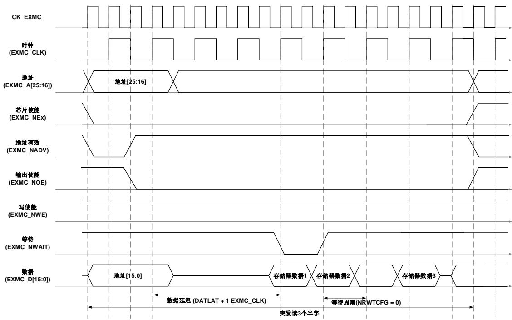

表 38-14. 同步复用模式读时序配置

<table><tr><td>位域/位</td><td>名称</td><td>参考设定值</td></tr><tr><td colspan="3">EXMC_SNCTLx</td></tr><tr><td>31-21</td><td>保留</td><td>0x000</td></tr><tr><td>20</td><td>CCK</td><td>取决于存储器</td></tr><tr><td>19</td><td>SYNCWR</td><td>无影响</td></tr><tr><td>18-16</td><td>CPS</td><td>取决于存储器</td></tr><tr><td>15</td><td>ASYNCWTEN</td><td>0x0</td></tr><tr><td>14</td><td>EXMODEN</td><td>0x0</td></tr><tr><td>13</td><td>NRWTEN</td><td>取决于存储器</td></tr><tr><td>12</td><td>WEN</td><td>无影响</td></tr><tr><td>11</td><td>NRWTCFG</td><td>取决于存储器</td></tr><tr><td>10</td><td>保留</td><td>0x0</td></tr><tr><td>9</td><td>NRWTPOL</td><td>取决于存储器</td></tr><tr><td>8</td><td>SBRSTEN</td><td>0x1,突发读使能</td></tr><tr><td>7</td><td>保留</td><td>0x1</td></tr><tr><td>6</td><td>NREN</td><td>取决于存储器</td></tr><tr><td>5-4</td><td>NRW</td><td>0x1</td></tr><tr><td>3-2</td><td>NRTP</td><td>取决于存储器,0x1/0x2</td></tr><tr><td>1</td><td>NRMUX</td><td>0x1,取决于存储器与用户</td></tr><tr><td>0</td><td>NRBKEN</td><td>0x1</td></tr><tr><td colspan="3">EXMC_SNTCFGx(读)</td></tr><tr><td>31-30</td><td>保留</td><td>0x0</td></tr><tr><td>29-28</td><td>ASYNCMOD</td><td>0x0</td></tr><tr><td>27-24</td><td>DLAT</td><td>数据延迟</td></tr><tr><td>23-20</td><td>CKDIV</td><td>上图设置 0x1, EXMC_CLK=2 CK_EXMC</td></tr><tr><td>19-16</td><td>BUSLAT</td><td>EXMC_NE[x]上升沿到下降沿的时间</td></tr><tr><td>15-8</td><td>DSET</td><td>无影响</td></tr><tr><td>7-4</td><td>AHLD</td><td>无影响</td></tr><tr><td>3-0</td><td>ASET</td><td>无影响</td></tr></table>

模式SM – 同步复用突发写时序 – NOR, PSRAM (CRAM)

图 38-23. 同步复用突发传输写时序

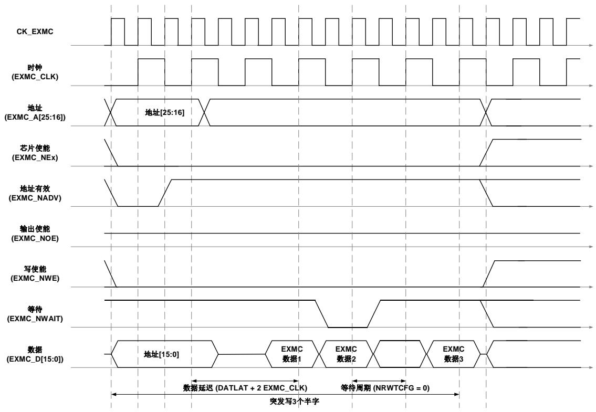

表 38-15. 同步复用模式写时序配置

<table><tr><td>位域/位</td><td>名称</td><td>参考设定值</td></tr><tr><td colspan="3">EXMC_SNCTLx</td></tr><tr><td>31-21</td><td>保留</td><td>0x000</td></tr><tr><td>20</td><td>CCK</td><td>取决于存储器</td></tr><tr><td>19</td><td>SYNCWR</td><td>0x1,同步写使能</td></tr><tr><td>18-16</td><td>CPS</td><td>取决于存储器</td></tr><tr><td>15</td><td>AYSNCWAIT</td><td>0x0</td></tr><tr><td>14</td><td>EXMODEN</td><td>0x0</td></tr><tr><td>13</td><td>NRWTEN</td><td>取决于存储器</td></tr><tr><td>12</td><td>WEN</td><td>0x1</td></tr><tr><td>11</td><td>NRWTCFG</td><td>0x0(这里必须为0)</td></tr><tr><td>10</td><td>保留</td><td>0x0</td></tr><tr><td>9</td><td>NTWTPOL</td><td>取决于存储器</td></tr><tr><td>8</td><td>SBRSTEN</td><td>无影响</td></tr><tr><td>7</td><td>保留</td><td>0x1</td></tr><tr><td>6</td><td>NREN</td><td>取决于存储器</td></tr><tr><td>5-4</td><td>NRW</td><td>0x1</td></tr><tr><td>3-2</td><td>NRTP</td><td>0x1</td></tr><tr><td>1</td><td>NRMUX</td><td>0x1,取决于用户</td></tr><tr><td>0</td><td>NRBKEN</td><td>0x1</td></tr><tr><td colspan="3">EXMC_SNTCFGx(写)</td></tr><tr><td>31-30</td><td>保留</td><td>0x0</td></tr><tr><td>29-28</td><td>ASYNCMOD</td><td>0x0</td></tr><tr><td>27-24</td><td>DLAT</td><td>数据延迟</td></tr><tr><td>23-20</td><td>CKDIV</td><td>上图设置:0x1,EXMC_CLK=2 CK_EXMC</td></tr><tr><td>19-16</td><td>BUSLAT</td><td>无影响</td></tr><tr><td>15-8</td><td>DSET</td><td>无影响</td></tr><tr><td>7-4</td><td>AHLD</td><td>无影响</td></tr><tr><td>3-0</td><td>ASET</td><td>无影响</td></tr></table>

# 38.3.7. NAND flash 控制器

EXMC模块Bank2支持NAND FLASH，Bank1和Bank3保留。对于每个Bank，EXMC提供独立的寄存器来配置访问时序，支持8位、16位的NAND FLASH。对于NAND FLASH，EXMC还提供ECC计算模块，保证数据传输和保存的鲁棒性。

# NAND flash 接口功能

表 38-16. 8 位/16 位 NAND 接口信号描述

<table><tr><td>EXMC 引脚</td><td>传输方向</td><td>功能描述</td></tr><tr><td>EXMC_A[17]</td><td>输出</td><td>NAND Flash 地址锁存(ALE)</td></tr><tr><td>EXMC_A[16]</td><td>输出</td><td>NAND Flash 命令锁存(CLE)</td></tr><tr><td rowspan="2">EXMC_D[7:0]/EXMC_D[15:0]</td><td rowspan="2">输入/输出</td><td>8 位复用,双向地址/数据总线</td></tr><tr><td>16 位复用,双向地址/数据总线</td></tr><tr><td>EXMC_NCE</td><td>输出</td><td>片选</td></tr><tr><td>EXMC_NOE(NRE)</td><td>输出</td><td>输出使能</td></tr><tr><td>EXMC_NWE</td><td>输出</td><td>写使能</td></tr><tr><td>EXMC_NWAIT/EXMC_INT</td><td>输入</td><td>NAND Flash 就绪/忙输入信号到 EXMC</td></tr></table>

# 支持的存储器访问模式

表 38-17. EXMC Bank2 支持的访问模式

<table><tr><td>存储器</td><td>模式</td><td>读/写</td><td>AXI 传输宽度</td><td>注释</td></tr><tr><td rowspan="4">8-bit NAND</td><td>异步</td><td>R</td><td>8</td><td></td></tr><tr><td>异步</td><td>W</td><td>8</td><td></td></tr><tr><td>异步</td><td>R</td><td>16</td><td rowspan="2">分成2次EXMC访问</td></tr><tr><td>异步</td><td>W</td><td>16</td></tr><tr><td rowspan="4"></td><td>异步</td><td>R</td><td>32</td><td rowspan="2">分成4次EXMC访问</td></tr><tr><td>异步</td><td>W</td><td>32</td></tr><tr><td>异步</td><td>R</td><td>64</td><td rowspan="2">分成8次EXMC访问</td></tr><tr><td>异步</td><td>W</td><td>64</td></tr><tr><td rowspan="8">16-bit NAND</td><td>异步</td><td>R</td><td>8</td><td></td></tr><tr><td>异步</td><td>W</td><td>8</td><td>不支持此操作</td></tr><tr><td>异步</td><td>R</td><td>16</td><td></td></tr><tr><td>异步</td><td>W</td><td>16</td><td></td></tr><tr><td>异步</td><td>R</td><td>32</td><td rowspan="2">分成2次EXMC访问</td></tr><tr><td>异步</td><td>W</td><td>32</td></tr><tr><td>异步</td><td>R</td><td>64</td><td rowspan="2">分成4次EXMC访问</td></tr><tr><td>异步</td><td>W</td><td>64</td></tr></table>

# NAND flash 的控制时序

EXMC能够为NAND Flash等设备产生合适的时序信号。每个Bank都有相应的寄存器来对外部存储器进行管理和控制，EXMC_NCTL、EXMC_NINTEN、EXMC_NCTCFG、EXMC_NATCFG、EXMC_NECC，其中寄存器EXMC_NCTCFG、EXMC_NATCFG都可以配置4个时序参数，可以根据用户需求和外部存储器的特性来进行相应的配置。

表 38-18. NAND flash 可编程参数

<table><tr><td rowspan="2">参数</td><td rowspan="2">读/写</td><td rowspan="2">单位</td><td rowspan="2">功能描述</td><td colspan="2">NAND Flash</td></tr><tr><td>最小值</td><td>最大值</td></tr><tr><td>存储器数据总线高阻时间(HIZ)</td><td>W/R</td><td>CK_EXMC</td><td>启动写操作之后保持数据总线为高阻态的时间</td><td>1</td><td>255</td></tr><tr><td>存储器保持时间(HLD)</td><td>W/R</td><td>CK_EXMC</td><td>在发送命令结束后保持地址的(CK_EXMC)时钟周期数目,写操作时也是数据的保持时间</td><td>1</td><td>254</td></tr><tr><td>存储器等待时间(WAIT)</td><td>W/R</td><td>CK_EXMC</td><td>发出命令的最短持续时间(CK_EXMC)时钟周期数目</td><td>2</td><td>255</td></tr><tr><td>存储器建立时间(SET)</td><td>W/R</td><td>CK_EXMC</td><td>发出命令之前建立地址的(CK_EXMC)时钟周期数目</td><td>1</td><td>256</td></tr></table>

38-24. NAND flash 给出了在通用存储空间中操作的可编程参数定义，属性存储空间中操作与此相似。

图 38-24. NAND flash 通用存储空间操作时序

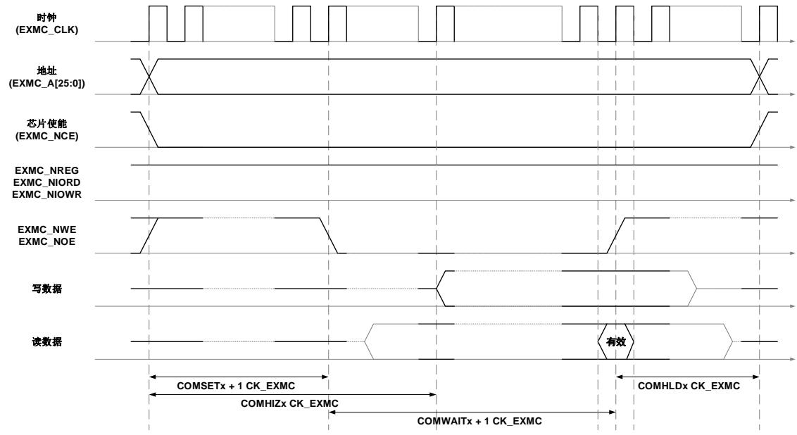

# NAND flash 操作

EXMC在对NAND Flash发送命令或地址时，需要利用其命令锁存信号（A[16]）或地址锁存信号（A[17]）这两条地址线，即MCU需要在特定的地址进行写操作。

示例：NAND Flash读操作步骤：

1. 配置EXMC_NCTL、EXMC_NCTCFG，若需要预等待功能，还需配置EXMC_NATCFG；

2. 往通用空间写入NAND Flash读数据命令，即在EXMC_NCE和EXMC_NWE有效期间，EXMC_CLE（A[16]）变为有效电平（高），则被NAND认为写入命令；

3. 往通用空间写入读操作的起始地址，即在EXMC_NCE和EXMC_NWE有效期间，EXMC_ALE（A[17]）变为有效电平（高），则被NAND认为写入地址；

4. 等待NAND就绪信号，NAND控制器会在这期间将和EXMC_NCE一直保持有效；

5. 从通用空间的数据区逐字节的读出数据；

6. 在不写入新的命令和地址，可以自动读出NAND下一页数据；或转到3）写入新的地址进行下一页的读取；或转到2）写入新的命令和地址。

# NAND flash 预等待功能

某些NAND Flash要求在输入最后一个地址字节后，控制器等待NAND Flash就绪，并且还有一些对EXMC_NCE敏感型的NAND Flash还要求在其就绪前NCE必须保持有效。

下面以TOSHIBA128M*8bit NAND Flash为例：

图 38-25. NCE 敏感 NAND Flash 访问时序

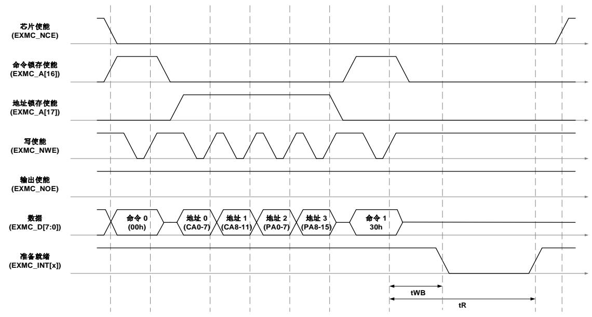

1. 往NAND的通用空间命令区写入命令CMD0

2. 往 NAND 的通用空间地址区写入操作地址 ADD0

3. 往 NAND 的通用空间地址区写入操作地址 ADD1

4. 往 NAND 的通用空间地址区写入操作地址 ADD2

5. 往 NAND 的通用空间地址区写入操作地址 ADD3

6. 往 NAND 的属性空间命令区写入命令 CMD1

在步骤 6 中写命令操作，EXMC 使用的是寄存器 EXMC_NATCFG 定义的时序。经过 ATTHLD时间后，NAND Flash 等待 EXMC_INT 信号，ATTHLD 要大于 tWB（EXMC_NWE 高到EXMC_INT 低的时间）。对于那些对片选信号敏感的 NAND Flash，在输入最后一个地址字节后的第一个命令字节之后，一直到 B/NB 就绪状态（EXMC_INT 从低电平变为高电平）到来的这段时间中，要求片选信号 EXMC_NCE 一直保持低电平。这里可以通过在 EXMC_NATCFG寄存器配置属性空间的 ATTHLD 值来满足 t 的时序要求。MCU 只有在最后一个地址字节之后写入第一个命令字节时才使用属性空间的时序，而在其他时候，都使用通用空间的时序。

# NAND Flash 的 ECC 计数模块

EXMC模块中的Bank2有一个ECC计算的硬件模块，用户可以根据EXMC_NCTL中的ECCSZ来选择ECC计算的页面大小，通过ECC计算可以纠正1个bit的错误并且能检测2个bit的错误。

当NAND存储器块使能，ECC模块就会检测EXMC_D[15:0]以及EXMC_NCE、EXMC_NEW信号。当已经完成ECCSZ大小字节的读写操作时，软件必须读出EXMC_NECC中的结果值。如果需要再次开始ECC计算，软件需要先将EXMC_NECC中ECCEN清0来清除EXMC_NCTL中的值，再将ECCEN置1来重新启动ECC计算。

# 38.3.8. SDRAM 控制器

# 主要特性

两个可独立配置的SDRAM devices；

8位，16位，32位数据带宽；

多达 13 位行地址、11 位列地址、2 位内部 bank 地址；

支持存储器大小：4x16Mx32bit(256 MB), 4x16Mx16bit (128 MB), 4x16Mx8bit (64 MB)；

AXI 字、半字、字节访问；

为每个存储器 bank 提供独立的片选控制；

每个存储器 bank 可独立配置；

写使能和字节选择输出；

自动进行行和 bank 边界管理；

多个 bank 的乒乓访问；

SDRAM 时钟可以为 fCK_EXMC/(2、3、4 或 5)；

可编程的时序参数；

可编程的刷新速率的自动刷新操作；

通过软件进行上电初始化；

CAS 延迟可设置为 1、2、3 个时钟周期；

具有 16x35 位深度的写数据 FIFO；

具有 16x31 位深度的写地址 FIFO；

6x32 位深度的可缓存的读数据 FIFO；

6x14 位深度的可缓存读地址 FIFO；

可调整的读数据采样时钟；

自刷新模式；

掉电模式。

# SDRAM 简介

同步动态随机存储器（SDRAM）是通过外部同步时钟刷新的动态随机存储器（DRAM），它的同步时钟由EXMC的EXMC_SDCLK引脚提供，通过配置寄存器EXMC_SDCTLx位SDCLK时钟频率可设置为fCK_EXMC/(2、3、4或5)。指令和数据在时钟的上升沿锁存，在下降沿改变。

SDRAM内部分为多个叫做Bank的区域，允许设备以交错的方式进行访问，以获取更大的并发性和数据传输量。每个Bank可以认为是一个矩阵，其中每个地址对应存储器存储宽度的空间，矩阵由行和列构成，因此存储器的Bank大小可以认为是存储器数据宽度*行数*列数。用户可以通过设置寄存器EXMC_SDCTLx位NBK，SDW，RAW，CAW使EXMC可以与不同的SDRAM进行通信。

由于易失的本征特性，SDRAM需要周期性的刷新。EXMC支持两种刷新模式，自刷新和自动刷新。自刷新是在EXMC挂起的低功耗模式中使用，由SDRAM内部计数提供时钟，内部进行刷新。自动刷新是由EXMC周期性的提供刷新命令，因为此时SDRAM需要进行数据传输，刷新间隔由寄存器EXMC_SDARI位ARINTV决定，连续刷新次数由寄存器EXMC_SDCMD位NARF决定。刷新命令优先级高于其他的包括读写命令，来保证数据的正常存储，当SDRAM同时收到刷新命令与读写命令时，读写命令需要等待刷新命令完成才能进行。如果在前一个刷新命令未完成时，再次接收到刷新命令，寄存器EXMC_SDSTAT刷新错误标志位（REIF）会被置位，同时如果刷新错误中断使能（REIE），将会发生刷新错误中断。

CAS延 迟 是 读 命 令 和 数 据 线 出 现 第 一 个 可 读 数 据 之 间 的 延 迟 ， 可 以 通 过 寄 存 器EXMC_SDCTLx位CL设置。

对不同的SDRAM需要参考其手册，使用模式寄存器进行设置，包含突发长度，突发类型，CAS延迟，写模式。在寄存器EXMC_SDCMD位MRC中设置，会通过CMD命令发送给SDRAM。在读写操作之前，需要发送读取模式寄存器命令，否则SDRAM无法工作。

# SDRAM 控制器简介

同步动态随机存储器控制器（SDRAMC）是MCU和SDRAM的接口。它把AXI的操作根据SDRAM协议转换为对SDRAM的操作，同时配置寄存器EXMC_SDTCFG满足时序要求。

SDRAMC包含4个模块，读写预处理模块，控制寄存器，有限状态机和信号发生器。使用两组FIFO来提高存储器访问效率，一组用来写地址和数据，另外一组用来读地址数据。SDRAMC模块由 38-26. SDRAM 所示。

图 38-26. SDRAM 系统架构

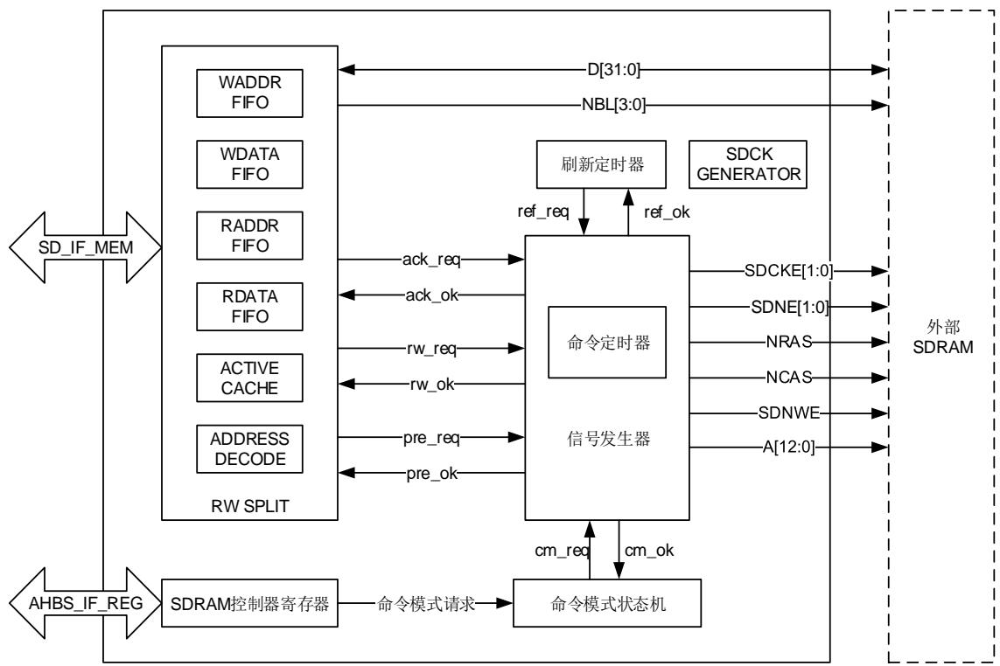

信号发生器处理状态机，刷新定时器，读写模块产生的请求。

命令定时器由遵守SDRAM时序协议的计数器组成。

SDRAM命令由SDRAM控制器接口发出，可见 38-19. SDRAM 。

表 38-19. SDRAM 命令真值表

<table><tr><td>SD NE</td><td>NR AS</td><td>NC AS</td><td>SD NW E</td><td>A[n]</td><td>A[10]</td><td>A[m]</td><td>命令</td></tr><tr><td>H</td><td>X</td><td>X</td><td>X</td><td>X</td><td>X</td><td>X</td><td>命令禁止(无操作)</td></tr><tr><td>L</td><td>H</td><td>H</td><td>H</td><td>X</td><td>X</td><td>X</td><td>无操作</td></tr><tr><td>L</td><td>H</td><td>H</td><td>L</td><td>X</td><td>X</td><td>X</td><td>中止突发传输</td></tr><tr><td>L</td><td>H</td><td>L</td><td>H</td><td>Bank</td><td>L</td><td>Col</td><td>突发读选择行</td></tr><tr><td>L</td><td>H</td><td>L</td><td>H</td><td>Bank</td><td>H</td><td>Col</td><td>预充电完成后,突发读选择行</td></tr><tr><td>L</td><td>H</td><td>L</td><td>L</td><td>Bank</td><td>L</td><td>Col</td><td>突发写选择行</td></tr><tr><td>L</td><td>H</td><td>L</td><td>L</td><td>Bank</td><td>H</td><td>Col</td><td>预充电完成后,突发写选择行</td></tr><tr><td>L</td><td>L</td><td>H</td><td>H</td><td>Bank</td><td>Row</td><td>Row</td><td>行使能命令,之后可进行读写</td></tr><tr><td>L</td><td>L</td><td>H</td><td>L</td><td>Bank</td><td>L</td><td>X</td><td>预充电命令,关闭当前 Bank 的选择行</td></tr><tr><td>L</td><td>L</td><td>H</td><td>L</td><td>X</td><td>H</td><td>X</td><td>全局预充电命令,关闭所有 Bank 的选择行</td></tr><tr><td>L</td><td>L</td><td>L</td><td>H</td><td>X</td><td>X</td><td>X</td><td>SDCKE = 1 时自动刷新模式SDCKE = 0 时自刷新模式</td></tr><tr><td>L</td><td>L</td><td>L</td><td>L</td><td>L</td><td>Mode</td><td>Mode</td><td>加载模式寄存器</td></tr></table>

# SDRAM 控制器操作序列

# IO 配置

SDRAMC的IO口必须在与SDRAM通信之前配置，否则，它就被留作通用IO口，并且可以被其他模块使用。下表总结了与SDRAM操作相关的IO口。

表 38-20. SDRAM IO 口定义

<table><tr><td>信号</td><td>传输方向</td><td>描述</td></tr><tr><td>EXMC_SDCLK</td><td>O</td><td>SDRAM 存储器时钟</td></tr><tr><td>EXMC_SDCKE[0]</td><td>O</td><td>SDRAM device 0 的时钟使能信号</td></tr><tr><td>EXMC_SDCKE[1]</td><td>O</td><td>SDRAM device 1 的时钟使能信号</td></tr><tr><td>EXMC_SDNE[0]</td><td>O</td><td>SDRAM device 0 的片选信号,低电平有效</td></tr><tr><td>EXMC_SDNE[1]</td><td>O</td><td>SDRAM device 1 的片选信号,低电平有效</td></tr><tr><td>EXMC_NRAS</td><td>O</td><td>行地址选通,低电平有效</td></tr><tr><td>EXMC_NCAS</td><td>O</td><td>列地址选通,低电平有效</td></tr><tr><td>EXMC_SDNWE</td><td>O</td><td>写使能,低电平有效</td></tr><tr><td>EXMC_A[12:0]</td><td>O</td><td>地址</td></tr><tr><td>EXMC_A[15:14]</td><td>O</td><td>Bank 地址</td></tr><tr><td>EXMC_D[31:0]</td><td>I/O</td><td>读/写数据</td></tr><tr><td>EXMC_NBL[3:0]</td><td>O</td><td>写数据标记(掩码)</td></tr></table>

# 控制器初始化

用户需要按照以下步骤来初始化 SDRAM 控制器，初始化序列可以应用于单个 SDRAM，或同时初始化两个 SDRAM，由寄存器 EXMC_SDCMD 位 DS0 和 DS1 决定。为了保证读写的可靠性，必须先进行初始化，否则无法保证 EXMC 的行为。

1. 控制参数：控制配置寄存器EXMC_SDCTLx指定SDRAM的存储器行列数，时钟配置和读写方法。

2. 时序参数：时序配置寄存器EXMC_SDTCFGx需要根据SDRAM数据手册来配置，以与外部 SDRAM 的 操 作 保 持 同 步 。 RPD 和 ARFD 必 须 在 EXMC_SDTCFG0 来 配 置 ，EXMC_SDTCFG1中相应的位保留。

3. 使能SDCLK：通过将’0b001‘写入EXMC_SDCMD寄存器中的CMD位域来完成SDCLK使

能命令应发送到相应的SDRAM设备，DS0和DS1决定选择哪个设备将接受命令并开始接收EXMC_SDCLK。

4. 上电延时：典型延时在100us左右。

5. 预充电：命令会对SDRAM的所有Bank进行复位，并使SDRAM回到空闲状态，等待后续操作。给寄存器EXMC_SDCMD位域CMD写’0b010‘使能相应设备的SDCLK信号，DS0和DS1决定选择哪个设备将接受此命令。

6. 设置自刷新模式：给寄存器EXMC_SDCMD位域CMD写’0b011‘发送自刷新命令。用户也可以通过设置位NARF来设置连续刷新次数，这个配置是SDRAM规范要求的，也是用户应该参考的地方，DS0和DS1决定选择哪个设备将接受此命令。

7. 模式寄存器配置：模式寄存器通过写寄存器EXMC_SDCMD位域MRC来设置，模式寄存器指定了SDRAM的工作模式，这些模式包括突发长度，突发类型，CAS延迟和读写模式，用户应参考SDRAM的规范进行正确配置。CAS延迟必须与寄存器EXMC_SDCTLx位域CL对应，突发长度设为1来保证数据正常传输。如果两个SDRAM的模式寄存器内容不同，需要通过DS0和DS1单独选择设备来配置。

8. 设置自刷新频率：自动刷新率对应刷新周期之间的时间间隔，用户必须确保刷新周期满足SDRAM的要求。

这里控制器已经完成初始化，可以与SDRAM通信。如果发生了复位，初始化需要按照上述步骤重复一遍。在读写操作之前，要保证控制器至少初始化一遍。

# 预充电

若SDRAM控制器在存取时需要进行行切换，那么首先需要将该行地址对应块的读写放大器去使能，使其进入空闲状态，为下一行的读写操作进行准备。这个过程叫做预充电，或者行去使能。预充电可以由控制器的全局预充电命令（Precharge-All）独立激发，或者是在读写完成后自动激发。行预充电延时（RPD）代表SDRAM行切换的最小时间，它是预充电完成到下一次行使能命令的最小时间间隔。

# 行使能

行使能命令将行地址所在的块使能，完整的行地址由2比特的块地址EXMC_A[15:14]和13比特的行地址EXMC_A[12:0]组成。行使能会将所选行的16384比特信息读入读写放大器，这个过程也叫做行开启，该命令的一个副作用就是对所选行的存储单元进行了刷新。

一旦行使能，读写操作就可以顺利的进行，但是行使能需要一定的时间，这个时间间隔叫做行列延时，它是行寻址到列寻址的最小时间间隔。对SDRAM控制器进行配置时的行列延时（RCD），是包含SDRAM行列延时的最小时钟周期数，它代表了行使能到SDRAM读写间的最小等待时间。在这段时间中，用户可向其它的块地址发出控制命令，因为SDRAM控制器对块的操作是独立进行的。

# 读写访问

控制器可以把AXI的单次或突发读操作转换成单次的存储器读操作。为了连续访问，控制器通常会保存之前操作的行号。若下一次的读取位置是在相同的行号或是已经使能的其他行号，那么读操作会未中断的执行，否则需要先执行取消使能当前行和使能需要操作的行，然后执行读取访问。读FIFO的设计用于在CAS延迟期间缓存读数据，必须设置管道延迟（PIPED）、突发读取（BRSTRD）以启用FIFO。

38-27. 是对一个未被使能的行突发读操作，在读之前发送了行使能指令。若对一个已经使能的行进行读操作，只需要发送列地址，行地址无需发送。

图 38-27. 突发读操作

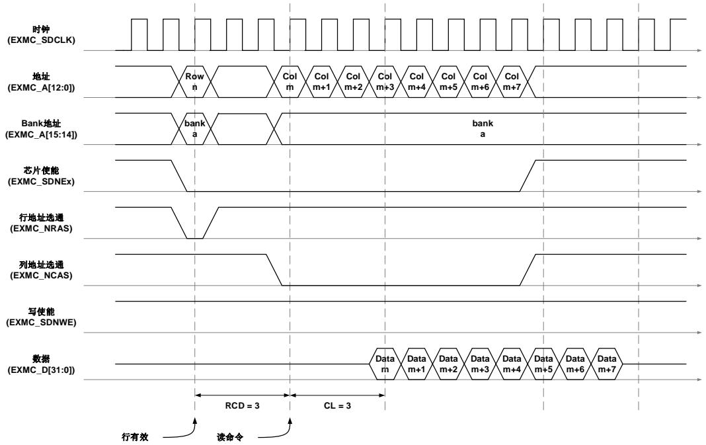

内部生成的时钟（具有来自CK_EXMC的可调延迟）可用于从外部存储器采样读取数据。当CK_EXMC无法对读取的数据进行正确采样时，此时钟可能会有所帮助。当该时钟启用时，读取数据将首先存储在异步FIFO中，然后返回到AXI总线。读取命令过程中可能会带来大约2~3CK_EXMC的额外延迟。

时钟延迟模块在CK_EXMC输入到信号发生器后添加，这个延迟的时钟作为输入数据的采样时钟。延迟模块可以通过寄存器EXMC_SDRSCTL来控制，其中RSEN位选择是否使用CK_EXMC延迟，SSCR位选择是否额外增加一个CK_EXMC延迟，SDSC选择增加多少个CK_EXMC延迟，可以添加的延迟单元数在0到15之间。 38-28. 显示了数据采样时钟延迟。

图 38-28. 数据采样时钟延迟模块

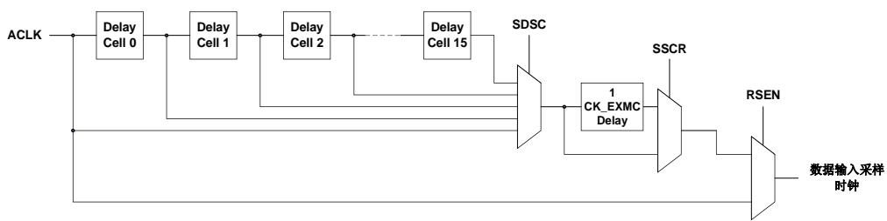

控制器可以把AXI的单次或突发写操作转换成单次的存储器写操作。写操作之前必须失能写保护位（寄存器EXMC_SDCTLx位WPEN）。为了连续访问，控制器通常会保存之前操作的行号，若下一次操作是在相同的行号或是已经使能的其他行号，操作会未中断的执行，否则需要先执行取消使能当前行和使能需要操作的行，最后才会执行写入访问。

38-29. 是对一个未被使能的行突发写操作，在写之前发送了行使能指令。若对一个已经使能的行写操作，则不需要行地址选通，只需要列地址选通。

图 38-29. 突发写操作

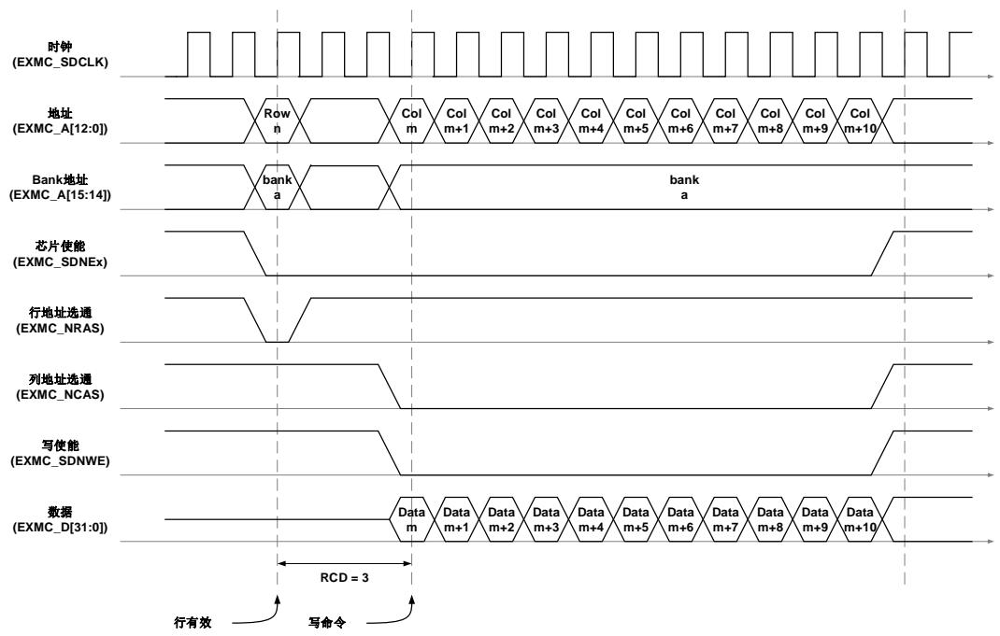

读写命令预处理模块接收AXI命令，然后根据AXI总线和SDRAM接口的数据总线宽度将AXI命令转换成单个的SDRAM读/写访问。

在读写命令预处理模块中，有两个写FIFO，用于缓冲AXI写命令的地址和数据。当两个写FIFO都不为空时，产生写访问。

当寄存器EXMC_SDCTLx位BRSTRD置1时，读写命令预处理模块能够预处理下一个读访问。读FIFO被用来存储在CAS延迟（由EXMC_SDCTLx中的CL位配置）和PIPED延迟（由EXMC_SDCTLx中的PIPED位配置）期间提前读出的数据。

读数据FIFO能够最多缓存6个32位的读数据字，同时地址FIFO携带6个14位的读地址标签，这些标签用来标识6个32位的读数据字中每一个。每个地址标签由11位列地址，2位Bank地址和1位SDRAM设备选择位。

当在AXI总线上出现一个读命令时，读写命令预处理模块将首先检查这个地址是否和某个地址标签匹配，如果匹配，则直接从FIFO中读取数据。否则，向存储器发一个新的读命令，FIFO会被新的数据更新。如果FIFO满了，旧的数据会被丢失。

读FIFO操作，如 38-30. FIFO BRSTRD=1 CL=2 SDCLK=2 PIPED=2和 38-31. FIFO BRSTRD=1 所示。

图 38-30. FIFO 未命中时的读访问（BRSTRD=1，CL=2，SDCLK=2，PIPED=2）

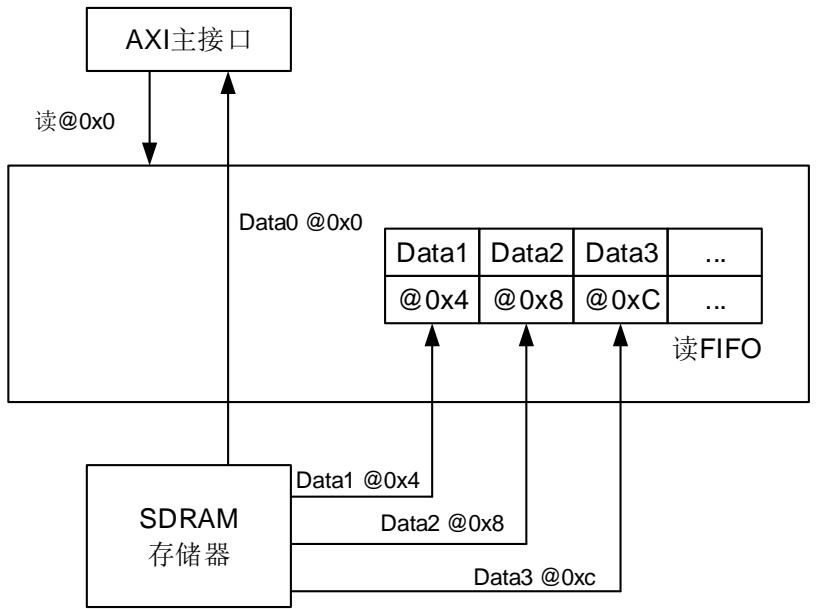

图 38-31. FIFO 命中时的读访问（BRSTRD=1）

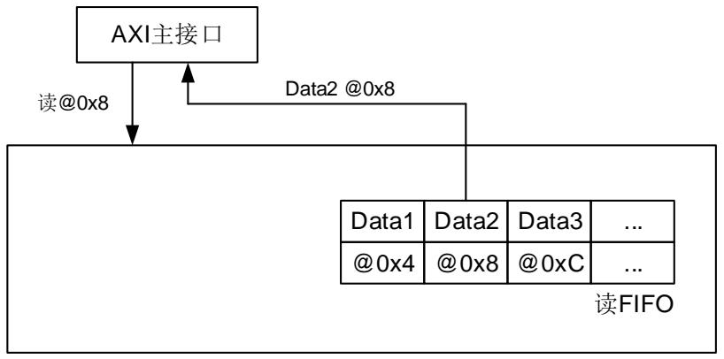

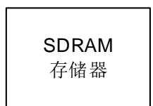

当一个写访问或者预充电命令出现时，读FIFO缓冲区中的数据就会被清除掉，用以填充新的数据。

地址译码器子模块会根据外部存储器设备的配置将AXI总线地址转化成片选、内部bank地址、行地址和列地址。

使能缓存子模块记录着内部bank（最多8个）是否处于使能状态。当一个内部bank处于使能状态，则相应的行地址也会被记录。当AXI访问或者自动刷新命令出现时，读写命令预处理模块将会查询这个记录，并且决定是否生成使能或预充电命令。

读/写操作之前，目标行必须被使能，EXMC_A[15:14]选择Bank，EXMC_A[12:0]选择行。被选择的行在预充电命令出现前会一直有效。预充电命令用来取消选择特定Bank或者所有Bank使能的行。预充电命令必须在使能同一个Bank的不同行之前发出。使能和预充电由EXMC自动发出，它的正确性取决于之前描述的存储器的相关配置。有关自动行使能和预充电的读写时序如

38-32. 和 38-33. 所示。

图 38-32. 跨边界读操作

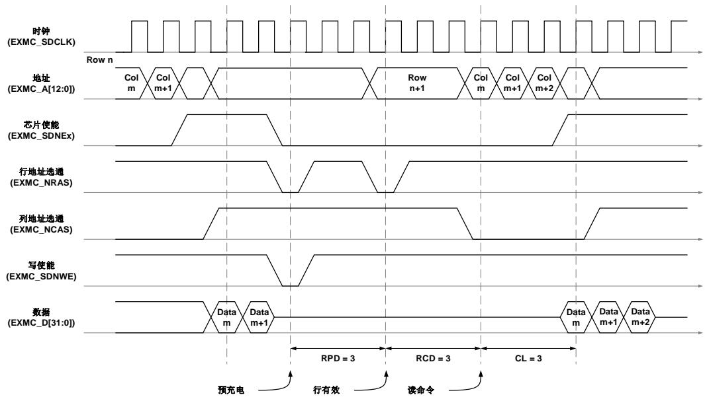

图 38-33. 跨边界写操作

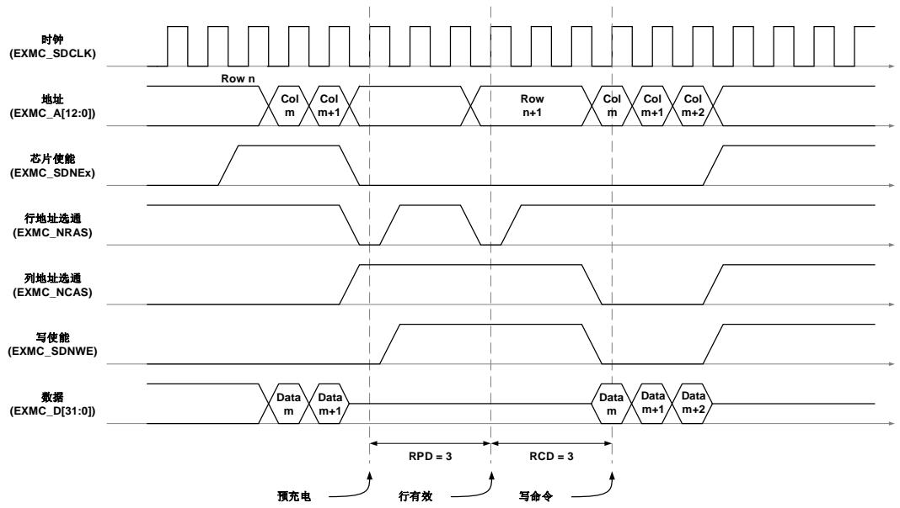

上图描述了在跨行边界时的读写操作时序，会按照以下步骤自动执行：

1. 预充电当前行；

2. 使能下一行；

3. 读写操作。

预充电延迟（PRD）和行到列延迟（RCD）根据其在寄存器 EXMC_SDTCFGx 中的配置添加。其他时序参数必须参照 SDRAM 标准要求。

当读写操作发生在Bank边界时，会有以下两种情况：

1. 当前Bank不是最后一个Bank，使能下一个Bank的第一行，支持任意的行，列，总线宽度设置。

2. 当前Bank是最后一个Bank，行，列，总线宽度设置为13位，11位，32位。假设当前操作

的SDRAM位device0，控制器会在device1上继续操作。

# 低功耗模式

EXMC支持两种低功耗模式：

1. 自刷新模式：在自刷新模式中，在没有外部时钟（EXMC_CLK）的情况下，刷新由SDRAM本身提供，以此来保持数据的完整性。通过往寄存器EXMC_SDCMD位域CMD写入’0b101‘进入自刷新模式，DS0和DS1决定哪个SDRAM设备接收到该命令。如果自刷新指令发送给两个SDRAM设备或一个未初始化的SDRAM设备，则在RASD延迟后EXMC_SDCLK停止运行。

2. 掉电模式：在掉电模式中，刷新由SDRAM控制器提供。通过往寄存器EXMC_SDCMD位域CMD写入’0b110‘进入掉电模式，DS0和DS1决定哪个SDRAM设备接收到该命令。如果写数据FIFO非空，在掉电模式使能之前，所有数据都会发送给存储器。

命令模式状态机也控制正常模式和低功耗模式（自刷新/掉电）之间的转换过程。

当读/写访问出现时，SDRAM控制器会从自刷新模式退出，返回到正常模式。如果在SDRAM控制器进入自刷新模式时出现读/写访问，则自刷新的进入过程会被中断，并且在读写访问完成后SDRAM控制器会停留在正常模式。

图 38-34. 自刷新模式进入和退出的处理

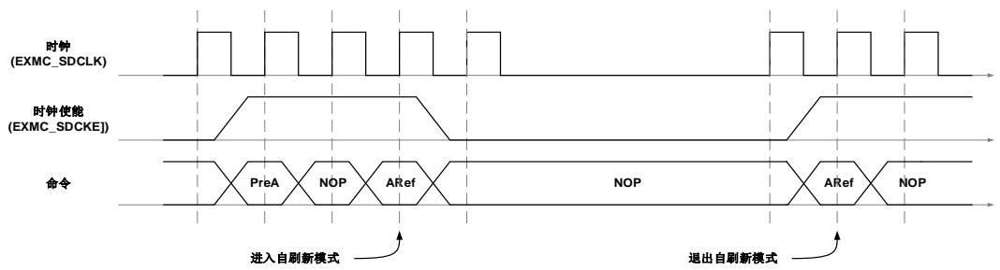

如果在SDRAM控制器处于掉电模式时出现自动刷新请求，那么SDRAM控制器会退出掉电模式并返回到正常模式，发“预充电所有存储区域”命令和“自动刷新”命令序列，然后再一次自动进入掉电模式。

图 38-35. 掉电模式进入和退出的处理

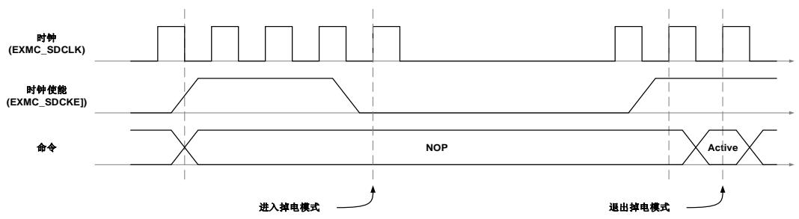

# 状态和中断

寄存器EXMC_SDSTAT的准备未完成状态位NRDY指示SDRAM是否准备完成接受新的命令。在控制器发送新的命令之后，该位会被清除。

寄存器EXMC_SDSTAT的STA0和STA1定义SDRAM的Device 0和Device 1的状态，0b00代表

普通模式，0b01表示相应的SDRAM Device处于自刷新模式，0b10代表掉电模式。

若前一个刷新指令未完成时，接收到了新的刷新指令，寄存器EXMC_SDSTAT刷新错误标志位（REIF）会被置位，该位通过寄存器EXMC_SDARI位REC置位来清除。

