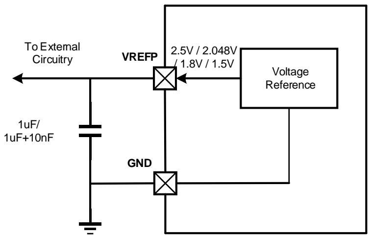

# 39. VREF

# 39.1. 简介

MCU 有一个精准的内部参考电路，用于为 ADC/DAC 提供基准电压，或供连接到 VREFP 引脚的片外电路使用。

# 39.2. 主要特性

内部参考电压特性描述如下：

电压稳定，产品经过校准；

连接 VREFP 引脚可供片外电路使用；

1.5V、1.8V、2.048V 或者 2.5V 可配置的参考电压输出。

# 39.3. 功能描述

通过将 VREF_CS 寄存器中的 VREFEN 位置 1 使能 VREF 模块，配置 VREFS[1:0]位可以输出 1.5V、1.8V、2.048V 或者 2.5V 的参考电压。当 VREF 被使能时，复位 HIPM 位，可将内部参考电压输出连接到 VREFP 引脚上。当 VREF 失能时，置位 HIPM 位，可将片外参考电压注入到 VREFP 引脚作为 ADC/DAC 的参考电压。如果没有 VREFP 引脚（请参阅数据手册），则 VREFP 被内部连接到 VDDA，且 VREFEN 位必须保持为 0。

当使用精准的内部参考电压时，建议连接一个 1uF（或 1uF 和 10nF 并联）的旁路电容，并接地。

图 39-1. VREF 连接

如下 39-1. VREF 所示，根据 VREF_CS 寄存器中 VREFEN 和 HIPM 位的配置，内部参考电压单元可以被配置成四种不同的模式。

表 39-1. VREF 模式

<table><tr><td>VREFEN</td><td>HIPM</td><td>模式</td></tr><tr><td>0</td><td>0</td><td>VREF 失能,VREFP 引脚下拉到 VSSA。</td></tr><tr><td>0</td><td>1</td><td>外部参考电压模式(默认):VREF 失能,VREFP 引脚是输入模式。</td></tr><tr><td>1</td><td>0</td><td>内部参考电压模式:VREF 使能,VREFP 引脚连接到 VREF 输出。</td></tr><tr><td>1</td><td>1</td><td>保持模式:VREF 失能,VREFP 引脚浮空,通过外部电容保持电压。失能 VREFRDY 位检测,VREFRDY 位保持最后一个状态。</td></tr></table>

当 VREF_CS 寄存器中 VREFEN 位置 1 且 HIPM 位复位时，即 VREF 工作在内部参考电压模式时，用户必须等待一段时间直到 VREFRDY 位被置位，表明 VREF 输出已经达到了要求的数值。

