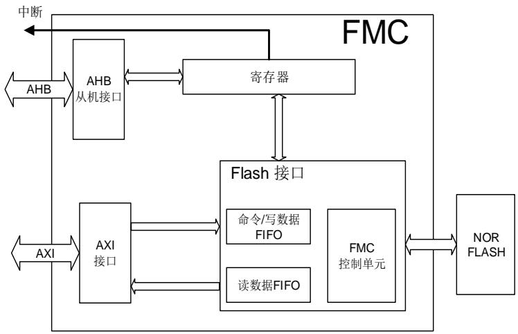
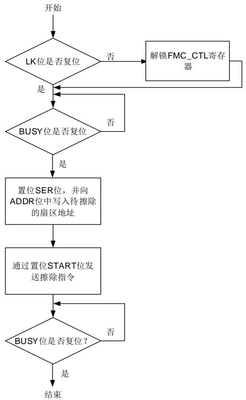
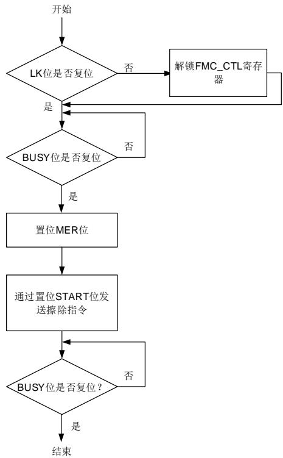
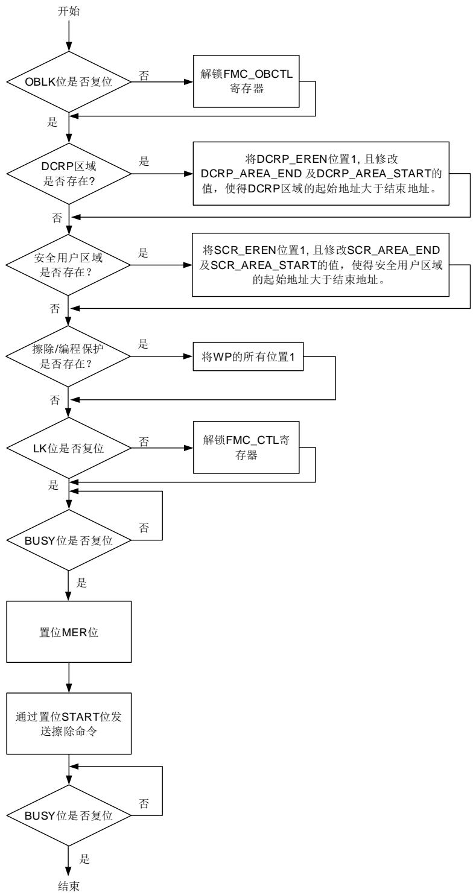
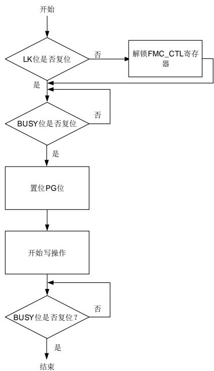
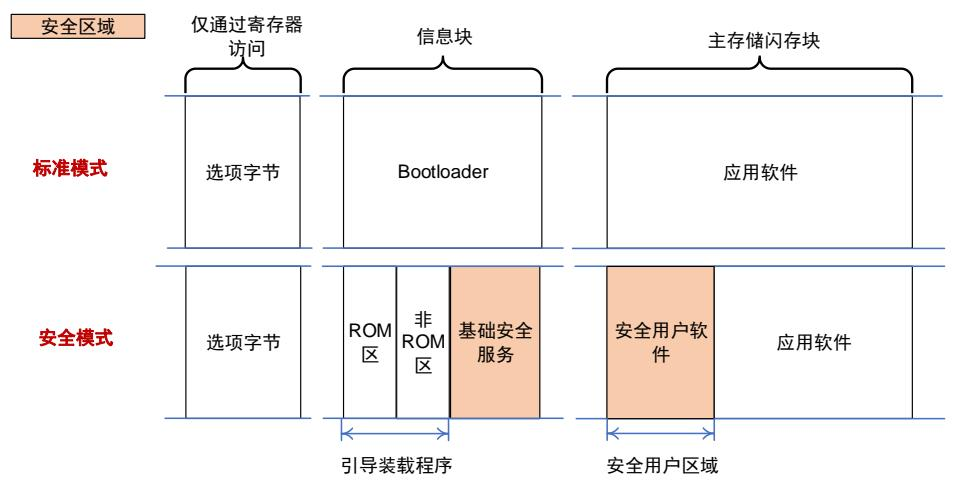

# 3. 闪存控制器（FMC）

# 3.1. 简介

闪存控制器（FMC），提供了片上闪存需要的所有功能。包括扇区擦除，整片擦除，以及编程操作等。

# 3.2. 主要特性

高达3840KB字节的片上闪存可用于存储指令或数据；

支持64位双字、32位整字、16位半字或字节读操作；

支持64位双字、32位整字编程，扇区擦除和整片擦除操作；

选项字节会在每次系统复位时装载到选项字节控制寄存器；

具有安全保护状态，可阻止对代码或数据的非法读访问；

具有擦除和编程保护状态，可阻止意外写操作；

具有仅执行的专用代码读保护（DCRP）区域；

具有仅能在安全模式下访问的安全用户区域；

# 3.3. 功能说明

# 3.3.1. 闪存结构

FMC支持用以访问代码或数据的64位AXI接口以及用以访问寄存器的32位AHB从机接口。3-1. FMC 显示了 FMC 的架构。

图 3-1. FMC 框图

FMC的AXI接口可以同时支持读写操作。FMC的AXI从机接口支持以下访问类型：

支持数据宽度为1、2、4、8字节的单一读操作；

支持数据宽度为1、2、4、8字节的增量突发读操作，突发传输数据长度最多可达128字节。

支持数据宽度为8字节的单一、2拍、4拍、8拍的回卷突发读操作；

支持数据宽度为4字节、8字节的单一编程操作；

支持数据宽度为8字节的最多32拍的突发编程操作，且4拍的突发编程操作数据传输效率最高；

使用数据宽度为8字节的非单拍的突发编程操作时，则只能使用MDMA而不能使用DMA，否则会产生不可预期的错误；

所有编程地址必须与数据宽度对齐；

在一次突发读/写操作中，地址不能跨越4K边界；

以上描述以外的其他所有操作将产生总线错误，且读操作将返回零，编程操作将被忽略。

AHB从机接口支持32位整字访问。

闪存包括3840KB字节主闪存，分为960个扇区，扇区大小为4KB，和64KB用于引导加载程序的信息块。主存储闪存的每个扇区都可以单独擦除。

闪存结构细节见 3-1. GD32H7xx 。

表 3-1. GD32H7xx 闪存基地址和构成

<table><tr><td>闪存块</td><td>名称</td><td>地址范围</td><td>大小(字节)</td></tr><tr><td rowspan="7">主存储闪存块</td><td>扇区0</td><td>0x0800 0000 - 0x0800 0FFF</td><td>4KB</td></tr><tr><td>扇区1</td><td>0x0800 1000 - 0x0800 1FFF</td><td>4KB</td></tr><tr><td>扇区2</td><td>0x0800 2000 - 0x0800 2FFF</td><td>4KB</td></tr><tr><td>.</td><td>.</td><td>.</td></tr><tr><td>.</td><td>.</td><td>.</td></tr><tr><td>.</td><td>.</td><td>.</td></tr><tr><td>扇区959</td><td>0x083B F000 - 0x083B FFFF</td><td>4KB</td></tr><tr><td>信息块</td><td>引导装载程序</td><td>0x1FF0 0000 - 0x1FF0 FFFF</td><td>64KB</td></tr></table>

# 3.3.2. 读操作

闪存可以像普通存储空间一样直接寻址访问。对闪存取指令和取数据是通过AXI接口访问的。

# FMC 内部 RTDEC 功能

FMC内部RTDEC功能是指从闪存中读取数据时，可以根据EFUSE模块中配置的AES秘钥进行实时解密数据（写入闪存的数据已经加密）。当EFUSE_USER_CTL寄存器中的AESEN位置1时，开启即时解密功能。这是通过硬件即时实现的，不能通过软件实现。AES秘钥由EFUSE_AES_KEY寄存器来设置。初始向量AES_IV[127:0] = AESIV[95:0] || 12'b0 || 读地址[23:4]。其中，用户可以通过FMC_AESIVx_MDF寄存器来设置初始向量中的高96位（即AESIV[95:0]）。且96位的AESIV[95:0]按照AESIV2 || AESIV1 || AESIV0的顺序组成。当需要修 改 初 始 向 量 时 ， 用 户 需 要 依 次 修 改 FMC_ASIV0_MDF 、 FMC_ASIV1_MDF 、FMC_ASIV2_MDF寄存器，在写入FMC_AESIV2_MDF寄存器后，FMC_ASIV0/1/2_MDF寄存器中的值都将被更新至AES初始向量区域中。

修改AESIV[95:0]的操作步骤如下：

1. 确保FMC_CTL寄存器不处于锁定状态；

2. 等待FMC_STAT寄存器的BUSY位变为0来确保没有闪存操作在进行，否则等待该操作完成；

3. 依 次 将 初 始 向 量 AES_IV[32:63] 写 入 FMC_AESIV0_MDF ， 将 AES_IV[64:95] 写 入FMC_ASIV1_MDF，将AES_IV[96:127]写入FMC_AESIV2_MDF寄存器；

4. 一旦FMC_AESIV2_MDF寄存器被写入后，FMC_AESIV0/1/2_MDF寄存器中的值都将自动被更新至AES初始向量区域中；

5. 通过检查FMC_STAT寄存器的BUSY位是否清0，来确定编程指令执行完毕；

6. 启动一次系统复位以加载初始向量，使之生效；

7. 如有需要，读取FMC_AESIVx_EFT中的值验证是否修改成功。

当修改完成后，FMC_STAT寄存器的ENDF位置位。若FMC_CTL寄存器的ENDIE位被置1，FMC将触发一个中断。

# NO-RTDEC 功能

即使将EFUSE_USER_CTL寄存器中AESEN位置1，也可以通过FMC_NODEC寄存器配置区域不使用RTDEC功能。

# 3.3.3. FMC_CTL/FMC_OBCTL 寄存器解锁

复位后，FMC_CTL寄存器进入锁定状态，LK位置为1。通过先后向FMC_KEY寄存器写入0x45670123和0xCDEF89AB，可以使得FMC_CTL解锁。两次写操作后，FMC_CTL寄存器的LK位被硬件清0。可以通过软件设置FMC_CTL寄存器的LK位为1再次锁定FMC_CTL寄存器。任何对FMC_KEY寄存器的错误操作都会将LK位置1，从而锁定FMC_CTL寄存器，并引发一个总线错误。

FMC_OBCTL寄存器，在FMC_CTL被解锁后仍然处于被保护状态。解锁过程为两次写操作，向FMC_OBKEY寄存器先后写入0x08192A3B和0x4C5D6E7F，然后硬件将FMC_OBCTL寄存器中的OBLK位清零。软件可以将FMC_OBCTL的OBLK位置1来锁定FMC_OBCTL。

# 3.3.4. 扇区擦除

FMC的扇区擦除功能使得主存储闪存的扇区内容初始化为高电平。每一扇区都可以被独立擦除，而不影响其他扇区内容。FMC扇区擦除操作步骤如下：

1. 确保FMC_CTL寄存器不处于锁定状态；

2. 检查FMC_STAT寄存器的BUSY位来判定闪存是否正处于擦写访问状态，若BUSY位为1，则需等待该操作结束，BUSY位变为0；

3. 置位FMC_CTL寄存器的SER位；

4. 将待擦除扇区的绝对地址（0x08XX XXXX）写到 FMC_ADDR 寄存器；

5. 通过将FMC_CTL寄存器的START位置1来发送扇区擦除命令到FMC

6. 通过检查FMC_STAT寄存器的BUSY位是否清0，来确定擦除指令执行完毕；

7. 如果需要，使用读操作验证该扇区是否擦除成功。

如果对包含了DCRP、安全用户区域、擦除/编程保护区域的扇区进行扇区擦除操作，该操作将会被中止，且FMC_STAT寄存器的WPERR位将置位。如果同时请求了整片擦除和扇区擦除，整片擦除将会替代扇区擦除操作。

当扇区擦除成功执行，FMC_STAT寄存器的ENDF位将置位。若FMC_CTL寄存器的ENDIE位被置1，则FMC将触发一个中断。需要注意的是，用户需确保写入的是正确的擦除目标扇区地址。否则当待擦除目标扇区被用来取指令或访问数据时，软件将会跑飞。该情况下，FMC不会提供任何出错通知。另一方面，对擦除/编程保护的扇区进行扇区擦除操作将无效。如果FMC_CTL寄存器的WPERRIE位被置位，该操作将触发擦除/编程保护错误中断。中断服务程序可通过检测FMC_STAT寄存器的WPERR位来判断该中断是否发生。 3-2.显示了扇区擦除操作流程。

图 3-2. 扇区擦除操作流程

注意：在编程、擦除尤其是全片擦除时，应尽量避免异常掉电或复位，否则可能会产生不可预知的后果。如果有掉电和复位风险，应避免使用带清除保护的整片擦除。

注意：在修改选项字节时，严禁掉电或复位，否则会损坏闪存数据，产生不可预知的后果，可能会让芯片强制进入安全模式。

注意：在编程和擦除主存储闪存块中的数据时，避免中途发生掉电或复位，否则可能会损坏当前扇区的数据，在下次上电后，需要擦除损坏的扇区之后才能继续使用。

# 3.3.5. 整片擦除

# 标准整片擦除

FMC提供了标准整片擦除功能，可以初始化主存储闪存块中，除包含安全或保护区域的扇区以外的所有其他扇区的内容。FMC标准整片擦除操作步骤如下：

1. 确保FMC_CTL寄存器不处于锁定状态；

2. 等待FMC_STAT寄存器的BUSY位变为0来确保没有闪存操作在进行，否则等待该操作完

成；

3. 置位FMC_CTL寄存器的MER位；

4. 通过将FMC_CTL寄存器的START位置1来发送扇区擦除命令到FMC

5. 通过检查FMC_STAT寄存器的BUSY位是否清0，来确定擦除指令执行完毕；

6. 如果需要，使用读操作验证是否擦除成功。

如果同时请求整片擦除和扇区擦除，则整片擦除将替代扇区擦除操作。

当标准整片擦除成功执行，FMC_STAT寄存器的ENDF位置位。若FMC_CTL寄存器的ENDIE位被置1，FMC将触发一个中断。由于除安全访问或被保护的区域外的其他所有的闪存数据都将被复位为0xFFFF_FFFF，可以通过运行在SRAM中的程序或使用调试工具直接访问FMC寄存器来实现标准整片擦除操作。 3-3. 显示了标准整片擦除操作流程。

图 3-3. 标准整片擦除操作流程

注意：在编程、擦除尤其是全片擦除时，应尽量避免异常掉电或复位，否则可能会产生不可预知的后果。如果有掉电和复位风险，应避免使用带清除保护的整片擦除。

注意：在修改选项字节时，严禁掉电或复位，否则会损坏闪存数据，产生不可预知的后果，可能会让芯片强制进入安全模式。

注意：在编程和擦除主存储闪存块中的数据时，避免中途发生掉电或复位，否则可能会损坏当前扇区的数据，在下次上电后，需要擦除损坏的扇区之后才能继续使用。

# 带清除保护的整片擦除

FMC提供了带清除保护的整片擦除功能，可以初始化主存储闪存块中的所有内容（包括那些包含了安全或保护区域的扇区）。FMC带清除保护的整片擦除操作步骤如下：

1. 确保FMC_OBCTL寄存器不处于锁定状态；

2. 如果存在DCRP保护区，将FMC_DCRPADDR_MDF或FMC_DCRPADDR_EFT寄存器中的DCRP_EREN置位。并将满足DCRP_AREA_END < DCRP_AREA_START的值写到FMC_DCRPADDR_MDF寄存器中，从而使DCRP结束地址小于DCRP起始地址；

3. 如果存在安全访问保护区，将FMC_SCRADDR_MDF或FMC_SCRADDR_EFT寄存器中的SCR_EREN置 位 。 并 将 满 足SCR_AREA_END < SCR_AREA_START 的 值写 到FMC_SCRADDR_MDF寄存器中，从而使安全用户区域结束地址小于安全用户区域起始地址；

4. 将FMC_WP_MDF寄存器中的所有WP位都置1，从而失能所有扇区的擦除/编程保护功能；

5. 确保FMC_CTL寄存器不处于锁定状态；

6. 等待FMC_STAT寄存器的BUSY位变为0来确保没有闪存操作在进行，否则等待该操作完成；

7. 置位FMC_CTL寄存器的MER位；

8. 通过将FMC_CTL寄存器的START位置1来发送扇区擦除命令到FMC；

9. 通过检查FMC_STAT寄存器的BUSY位是否清0，来确定擦除指令执行完毕；此时，带清除保护的整片擦除操作将擦除了整个主存储闪存区，包括包含了DCRP及安全访问数据的扇区，且选项字节的修改将自动执行，从而禁用所有保护。

10. 如果需要，使用读操作验证是否擦除成功。

注意：（1）以上步骤中，除上述提到的选项字节外，其他选项字节请勿修改。（2）只有步骤3、4、5中的条件都满足，才会执行带清除保护的整片擦除。如果有任一步骤不满足，都会只执行标准整片擦除，且不会报错。

如果同时请求整片擦除和扇区擦除，则整片擦除将替代扇区擦除操作。

当带清除保护的整片擦除成功执行，FMC_STAT寄存器的ENDF位置位。若FMC_CTL寄存器的ENDIE位被置1，FMC将触发一个中断。由于所有的闪存数据（包括那些安全区域、保护区域）都将被复位为0xFFFF_FFFF，可以通过运行在SRAM中的程序或使用调试工具直接访问FMC寄存器来实现带清除保护的整片擦除操作。 3-4. 显示了标准整片擦除操作流程。

图 3-4. 带清除保护的整片擦除

注意：在编程、擦除尤其是全片擦除时，应尽量避免异常掉电或复位，否则可能会产生不可预知的后果。如果有掉电和复位风险，应避免使用带清除保护的整片擦除。

注意：在修改选项字节时，严禁掉电或复位，否则会损坏闪存数据，产生不可预知的后果，可能会让芯片强制进入安全模式。

注意：在编程和擦除主存储闪存块中的数据时，避免中途发生掉电或复位，否则可能会损坏当前扇区的数据，在下次上电后，需要擦除损坏的扇区之后才能继续使用。

# 3.3.6. 主存储闪存块编程

FMC通过AXI接口提供了一个64位双字/32位整字编程功能，用来修改主存储闪存块内容。FMC闪存编程操作步骤如下：

1. 确保FMC_CTL寄存器不处于锁定状态；

2. 等待FMC_STAT寄存器的BUSY位变为0来确保没有闪存操作在进行，否则等待该操作完成；

3. 置位FMC_CTL寄存器的PG位；

4. 将要写的数据写到目的绝对地址（0x08XX XXXX）；

5. 通过检查FMC_STAT寄存器的BUSY位是否清0，来确定编程指令执行完毕；

6. 如果需要，使用读操作验证是否编程成功。

当主存储块编程成功执行，FMC_STAT寄存器的ENDF位置位。若FMC_CTL寄存器的ENDIE位被置1，FMC将触发一个中断。需要注意的是，PG位必须在64位双字/32位整字编程开始前进行置位，否则FMC_STAT寄存器中的PGSERR位会被置位，若FMC_CTL寄存器的PGSERRIE位被置1，FMC将触发一个中断。此外，向被保护擦除/编程扇区进行的编程操作会被忽略，同时FMC_STAT寄存器中的WPERR位被置位，若FMC_CTL寄存器的WPERRIE位被置1，FMC将触发一个中断。在中断服务程序中，可以检查FMC_STAT寄存器的PGSERR位和WPERR位来判断哪一种错误发生了。 3-5. 显示了编程操作流程。

用户可以通过在编程操作前，将在FMC_CTL寄存器中的PGCHEN位置1，来检查要写进数据的区域是否全部为0xFF。如果该区域并非全部为0xFF，则FMC_STAT寄存器中的PGSERR将被设置。

当突发编程操作时，PGCHEN为1，FMC将根据突发数据宽度来检查闪存数据。如果数据并非全部为0xFF，则该节拍编程失败，并将FMC_STAT寄存器中的PGSERR置位。但其他节拍可以正常编程。

图 3-5. 编程操作流程

注意：在编程、擦除尤其是全片擦除时，应尽量避免异常掉电或复位，否则可能会产生不可预知的后果。如果有掉电和复位风险，应避免使用带清除保护的整片擦除。

注意：在修改选项字节时，严禁掉电或复位，否则会损坏闪存数据，产生不可预知的后果，可能会让芯片强制进入安全模式。

注意：在编程和擦除主存储闪存块中的数据时，避免中途发生掉电或复位，否则可能会损坏当前扇区的数据，在下次上电后，需要擦除损坏的扇区之后才能继续使用。

# 3.3.7. 选项字节

# 选项字节说明

FMC提供两组选项字节寄存器：

“_EFT”寄存器组（只读）

该寄存器组包含选项字节的生效值。在系统复位或从深度睡眠模式初始唤醒后，该选项字节组的值都会被自动重加载。

“_MDF”寄存器组（可读写）

该寄存器组包含选项字节的修改值。当用户想要修改选项字节时，需要往该寄存器组里写入修改值。

每次系统复位后，闪存的选项字节被重加载到“_EFT”寄存器后，选项字节字节生效。选项字节详情见 3-2. 。选项字节最终根据应用程序的要求来配置

# 表 3-2. 选项字节

<table><tr><td>名称</td><td>出厂值</td><td>寄存器映射</td></tr><tr><td>[29]: IOSPDOPEN</td><td>0x0</td><td rowspan="12">FMC_OBSTAT0_EFT / FMC_OBSTAT0_MDF</td></tr><tr><td>[24]: DTCM1ECCEN</td><td>0x1</td></tr><tr><td>[23]: DTCM0ECCEN</td><td>0x1</td></tr><tr><td>[22]: ITCMECCEN</td><td>0x1</td></tr><tr><td>[21]: SCR</td><td>0x0</td></tr><tr><td>[18]: FWDGSPD_STDBY</td><td>0x1</td></tr><tr><td>[17]: FWDGSPD_DPSLP</td><td>0x1</td></tr><tr><td>[15:8]: SPC[7:0]</td><td>0xAA</td></tr><tr><td>[7]: nRST_STDBY</td><td>0x1</td></tr><tr><td>[6]: nRST_DPSLP</td><td>0x1</td></tr><tr><td>[4]: nWDG_HW</td><td>0x1</td></tr><tr><td>[3:2]: BOR_TH[1:0]</td><td>0x0</td></tr><tr><td>[31]: DCRP_EREN</td><td>0x0</td><td rowspan="3">FMC_DCRPADDR_EFT / FMC_DCRPADDR_MDF</td></tr><tr><td>[26:16]: DCRP_AREA_END[10:0]</td><td>0x0</td></tr><tr><td>[10:0]: DCRP_AREA_START[10:0]</td><td>0x0FF</td></tr><tr><td>[31]: SCR_EREN</td><td>0x0</td><td rowspan="3">FMC_SCRADDR_EFT / FMC_SCRADDR_MDF</td></tr><tr><td>[26:16]: SCR_AREA_END[10:0]</td><td>0x0</td></tr><tr><td>[10:0]: SCR_AREA_START[10:0]</td><td>0x0FF</td></tr><tr><td>[21:0]: WP[21:0]</td><td>0x3FFFFFFF</td><td>FMC_WP_EFT / FMC_WP_MDF</td></tr><tr><td>[31:16]: BOOT_ADDR1[15:0]</td><td>0x1FF0</td><td rowspan="2">FMC_BTADDR_EFT / FMC_BTADDR_MDF</td></tr><tr><td>[15:0]: BOOT_ADDR0[15:0]</td><td>0x0800</td></tr><tr><td>[31:16]: DATA[15:0]</td><td>0x0</td><td rowspan="3">FMC_OBSTAT1_EFT / FMC_OBSTAT1_MDF</td></tr><tr><td>[7:4]: DTCM_SZ_SHRRAM[3:0]</td><td>0x8</td></tr><tr><td>[3:0]: ITCM_SZ_SHRRAM[3:0]</td><td>0x7</td></tr></table>

# 选项字节修改

修改选项字节的操作步骤如下：

1. 确保FMC_OBCTL寄存器不处于锁定状态；

2. 等待FMC_STAT寄存器的BUSY位变为0来确保没有闪存操作在进行，否则等待该操作完成；

3. 在“_MDF”寄存器组（FMC_XXX_MDF）中，写入想要修改的选项字节寄存器值；

4. 通过将FMC_OBCTL寄存器的OBSTART位置1来发送选项字节编程命令到FMC；

5. 通过检查FMC_STAT寄存器的BUSY位是否清0，来确定编程指令执行完毕；

6. 启动一次系统复位以加载选项字节，使之生效；

7. 如有需要，读取“_EFT”寄存器组（FMC_XXX_EFT）中的值验证是否擦除成功。

注意：“XXX”包括OBSTAT0、DCRPADDR、SCRADDR、WP、BTADDR或OBSTAT1。

当FMC_OBCTL寄存器中的OBLK为1时，禁止修改“_MDF”寄存器。当OBSTART位被设置为1时，FMC会将生效值（_EFT）与修改值（_MDF）进行比较，以检查是否需要修改选项字节。

注意：在修改选项字节时，严禁掉电或复位，否则会损坏闪存数据，产生不可预知的后果，可能会让芯片强制进入安全模式。

注意：在编程和擦除主存储闪存块中的数据时，避免中途发生掉电或复位，否则可能会损坏当前扇区的数据，在下次上电后，需要擦除损坏的扇区之后才能继续使用。

# 选项字节修改规则

一些选项字节修改必须遵守特定的规则。如果不满足以下规则，OBMERR位将置位并停止选项字节的修改操作。如果满足以下规则，FMC开始将修改选项字节并更新_EFT选项字节寄存器的值。

# 安全保护等级（SPC）

当SPC设置为保护等级高时，所有选项字节不允许任何修改。此时，如果用户应用程序试图降低安全保护等级，将会产生选项字节修改错误（OBMERR），并忽略所有修改操作。

# 擦除/编程保护（WP）

该选项字节配置了扇区擦除/编程保护属性。当SPC不是保护等级高时，该选项字节的修改不受任何限制。

# ◼ DCRP区域大小（DCRP_AREA_START和DCRP_AREA_END）

增大DCRP区域没有任何限制，但必须包含原先的DCRP区域，即DCRP的起始地址（DCRP_AREA_START）不能变大，结束地址（DCRP_AREA_END）不能变小。

在移除DCRP区域时，必须在（FMC_DCRPADDR_EFT或FMC_DCRPADDR_MDF寄存器中）DCRP_EREN位为1的同时，去请求SPC降级或带清除保护的整片擦除操作。

在减小DCRP区域时，必须在（FMC_DCRPADDR_EFT或FMC_DCRPADDR_MDF寄存器中）DCRP_EREN位为1的同时，去请求SPC降级。

注 意 ：在通 过SPC降 级 去 移 除 或 减 小DCRP区域时，若（FMC_DCRPADDR_EFT及FMC_DCRPADDR_MDF寄存器中）DCRP_EREN位全为0，将会产生选项字节修改错误（OBMERR）。

# DCRP_EREN

SPC保护等级低到无保护状态的降级或带清除保护的整片擦除时，若该选项字节置1，DCRP区域的内容将被擦除。否则将被保留。

将DCRP_EREN位置1没有任何限制。但只有在将DCRP_EREN位清0的同时，去请求SPC降级或带清除保护的整片擦除操作，清0操作才能完成。否则会产生选项字节修改错误（OBMERR）。

# 安全模式（SCR）

如果不存在有效的DCRP区域或安全用户区域，该位可以自由清0。否则，SCR清0的唯一方式是：在DCRP_EREN位（FMC_DCRPADDR_EFT或FMC_DCRPADDR_MDF寄存器中）为1，且SCR_EREN位（FMC_SCRADDR_EFT或FMC_SCRADDR_MDF寄存器中）为1时，去执行SPC降级。否则，将会产生选项字节修改错误（OBMERR）。

注意：在执行SPC降级以禁用SCR选项字节时，需编程使DCRP区域和安全用户区域的起始地址都大于其结束地址。

安全用户区域大小（SCR_AREA_START和SCR_AREA_END）

在用户安全应用程序或设备上运行的GD安全库可以无限制地修改安全用户区域的大小。

对于用户非安全应用程序，在移除安全用户区域时，必须在（FMC_SCRADDR_EFT或FMC_SCRADDR_MDF寄存器中）SCR_EREN位为1的同时，去执行SPC降级或执行带清除保护的整片擦除操作。

注 意 ： 在 通 过 SPC 降 级 去 移 除 安 全 用 户 区 域 时 ， 若 （ FMC_SCRADDR_EFT 及FMC_SCRADDR_MDF寄存器中）SCR_EREN位全为0时，去请求SPC降级，将会产生选项字节修改错误（OBMERR）。

SCR_EREN 

SPC降级或带清除保护的整片擦除时，若该选项字节置1，安全用户区域的内容将被擦除。否则将被保留。

SCR_EREN位置1没有任何限制。但只有在将SCR_EREN位清0的同时，去请求SPC降级或带清除保护的整片擦除操作，清0操作才能完成，否则会产生选项字节修改错误（OBMERR）。

# 3.3.8. 扇区擦除/编程保护

FMC的扇区擦除/编程保护功能可以阻止对闪存的意外操作。当FMC对被保护扇区进行扇区擦除或编程操作时，操作本身无效，且FMC_STAT寄存器的WPERR位将被置1。注意，当MER位被置位或扇区地址无效时，进行扇区擦除时WPERR仍会被置位。配置选项字节的WP[21:0]某位为0可以单独使能某几扇区的保护功能。

表 3-3. 扇区保护 WP 位

<table><tr><td>WP位</td><td>扇区保护</td></tr><tr><td>WP[0]</td><td>扇区 0~扇区 15</td></tr><tr><td>WP[1]</td><td>扇区 16~扇区 31</td></tr><tr><td>.</td><td>.</td></tr><tr><td>.</td><td>.</td></tr><tr><td>.</td><td>.</td></tr><tr><td>WP[14]</td><td>扇区 224~扇区 239</td></tr><tr><td>WP[15]</td><td>扇区 240~扇区 255</td></tr><tr><td>WP[16]</td><td>扇区 256~扇区 383</td></tr><tr><td>WP[17]</td><td>扇区 384~扇区 511</td></tr><tr><td>.</td><td>.</td></tr><tr><td>.</td><td>.</td></tr><tr><td>.</td><td>.</td></tr><tr><td>WP[20]</td><td>扇区 768~扇区 895</td></tr><tr><td>WP[21]</td><td>扇区 896~扇区 959</td></tr></table>

注意：对于WP[x] ( x=0…15)，1位对应16个扇区，范围为扇区(x*16)~扇区(x*16+15)；

对于WP[x] ( x=16…20)，1位对应128个扇区，范围为扇区(x*128 - 1792)~扇区(x*128 - 1665)；

对于WP[21]，1位对应64个扇区，范围为扇区896~扇区959；

擦除/编程保护扇区不能被擦除或编程。因此，如果有扇区受擦除/编程保护，则除非执行SPC保护等级低到无保护状态的降级或带清除保护的整片擦除操作，否则无法执行整片擦除。

当SPC为保护等级高时，WP[21:0]选项字节无法更改，否则该选项字节可以自由修改。

注意：DCRP区域和安全用户区域受擦除/编程保护。

# 3.3.9. 安全保护

FMC提供了一个安全保护功能来阻止非法读取闪存。并且安全保护是全局的，不仅可以保护闪存，还可以保护其他安全区域。其他安全区域包括备份SRAM（BKPSRAM）、RTC备份寄存器和受实时解密（RTDEC）保护的加密区域。安全保护等级划分三等。

# 无保护状态

当熔丝中的SPC_H及SPC_L位均为0，且将SPC选项字节设置为0xAA，闪存将处于非安全保护状态。主存储块和选项字节可以被所有操作模式访问。其他安全区域也允许被访问。

# 保护等级低

当熔丝中的SPC_H为0时，只要将SPC_L位设置为1或将SPC选项字节设置为除0xAA或0xCC外的任何值，就能激活低安全保护等级。主存储闪存块仅能被用户代码访问。在调试模式或者从SRAM中启动或者从bootloader模式启动时，这些模式下对主存储块或其他安全区域（如备份SRAM）的操作都被禁止。无论是在调试模式或者从SRAM中启动，还是从bootloader模式启动，如果对主存储块执行一次读操作，将会产生一个读保护错误（RPERR）。在调试模式或者从SRAM中启动时或者从boot loader模式启动，如果对主存储块执行一次编程/擦除操作，FMC_STAT寄存器中的WPERR位会被置位。在低安全保护等级下，对于选项字节的所有操作都被允许。如果通过设置SPC字节为0xAA进入无保护状态，主存储闪存块将执行一次整片擦除操作。

从保护等级低到无保护状态的降级将导致以下擦除事件：

主存储闪存块中不包含DCRP/安全访问/WP区域的扇区，都将会被擦除；

擦除/编程保护的扇区将会被擦除；

DCRP 区 域 ： 如 果 FMC_DCRPADDR_EFT 和 FMC_DCRPADDR_MDF 寄 存 器 中 的DCRP_EREN位均为0的情况，属于DCRP区域的扇区将不会被擦除。否则，无论是否和安全用户区域有重叠，DCRP区域将会被擦除；

安 全 用 户 区 域 ： 如 果FMC_SCRADDR_EFT 和FMC_SCRADDR_MDF 寄 存 器 中 的SCR_EREN位均为0的情况，属于安全用户区域的扇区将不会被擦除。否则，无论是否和DCRP区域有重叠，安全用户区域将会被擦除；

如果FMC_DCRPADDR_EFT或FMC_DCRPADDR_MDF寄存器中的DCRP_EREN位至少 有 一 个 为 1 ， 并 且 FMC_SCRADDR_EFT 或 FMC_SCRADDR_MDF 寄 存 器 中 的SCR_EREN位至少有一个为1，这时候整个主存储块的所有内容都将会被擦除；

其他的安全区域（如备份SRAM）将会被擦除。

注意：用户只有通过修改受保护的扇区的边界的方式，才能移除DCRP或安全用户区域。

# 保护等级高

当熔丝中的SPC_H为1或设置SPC选项字节为0xCC，激活高安全保护等级。当编程选择该保护等级时，调试模式，从SRAM中启动，或者从boot loader启动都被禁止。主存储闪存块可由用户代码的所有操作进行访问。SPC字节禁止再次编程。所以，如果高保护等级被激活，将不能再降回到低保护等级或无保护等级。在高保护等级下，无法更改选项字节。

在保护等级高下，JTAG端口将永久禁用。因此，无法对设置了保护等级高的设备进行调试分析。如果在调试器在仍处于连接状态时设置了保护等级高，应当进行一次上电复位操作。

用户可以参考 3-4. SPC 来配置SPC保护等级。

表 3-4. SPC 保护等级配置

<table><tr><td colspan="2">EFUSE_USER_CTL寄存器</td><td>FMC_OBSTAT0_MDF寄存器</td><td>FMC_OBSTAT0_EFT寄存器</td><td rowspan="2">SPC等级</td></tr><tr><td>SPC_H</td><td>SPC_L</td><td>SPC[7:0]</td><td>SPC[7:0]</td></tr><tr><td>1</td><td>0或1</td><td>任意值</td><td>=0xCC</td><td>保护等级高</td></tr><tr><td>0或1</td><td>0或1</td><td>0xCC</td><td>=0xCC</td><td>保护等级高</td></tr><tr><td>0</td><td>1</td><td>除0xCC外任意值</td><td>=0xFF</td><td>保护等级低</td></tr><tr><td>0</td><td>0</td><td>除0xAA、0xCC外任意值</td><td>=FMC_OBSTAT0_MDF寄存器中SPC[7:0]值</td><td>保护等级低</td></tr><tr><td>0</td><td>0</td><td>0xAA</td><td>=0xAA</td><td>无保护</td></tr></table>

注意：（1）如果熔丝中设置的SPC保护等级和FMC中设置的SPC保护等级不一样，实际生效的SPC等级取两者中SPC保护等级高的那组设置。且FMC_OBSTAT0_EFT寄存器中的SPC[7:0]位反映的是实际生效的SPC保护等级。（2）如果熔丝中的SPC_L位置位，将禁止SPC保护等级低到无保护状态的降级。否则FMC_STAT寄存器的OBMERR位将会被置位。

# 3.3.10. DCRP 区域

在主存储闪存块，FMC可以定义仅执行区域，仅允许来自系统的指令，但不允许数据访问。

注意：当使用仅可执行区域功能时，用户需要相应地使用仅执行选项去编译其原生代码。

可以通过设置粒度为4KB字节的DCRP_AREA_END[10:0]和DCRP_AREA_START[10:0]选项字节来定义一个DCRP区域。实际DCRP区域大小由以下公式定义：

[(DCRP_AREA_END - DCRP_AREA_START) + 1] x 4Kbytes. 

例如，要在扇区0到扇区15上设置DCRP区域，选项字节应设置如下：

DCRP_AREA_START[10:0] = 0x000. 

DCRP_AREA_END[10:0] = 0x00F. 

因此，DCRP区域大小为：

[(DCRP_AREA_END - DCRP_AREA_START) + 1] x 4Kbytes = 64 Kbytes. 

DCRP区域最小可设置为8KB字节，最大可设置为整个主存储闪存块（将DCRP起始地址与结束地址设置为相等）。

在该区域执行代码时，将忽略调试事件。只有CPU可以访问它，且只使用指令获取任务。在所有其他情况下，访问DCRP区域都是非法的。例如，读操作将返回0并产生一个读保护错误（RPERR），写操作将被忽略并产生一个编程/擦除保护错误（WPERR）。

DCRP区域受擦除保护，无法擦除该区域内的扇区。如果设置了有效的DCRP区域，则除非执行SPC保护等级低到无保护状态的降级或执行带清除保护的整片擦除操作，否则无法执行整片擦除。

只有CPU可以修改DCRP区域大小设置和DCRP_EREN位。若DCRP区域存在，如果在SPC保护 等 级 低 到 无 保 护 状 态 的 降 级 期 间 ， 除 了 在 FMC_DCRPADDR_EFT 和FMC_DCRPADDR_MDF寄存器中DCRP_EREN位均为0的情况下，不会擦除DCRP区域的内容，其他情况下都将擦除该区域的内容。

除选项字节外，也可以通过修改熔丝中的MCU保留段对DCRP区域进行配置，其粒度为32KB字节。

如果熔丝中的MCU保 留 段 的DCRPLK位 为1， 且 熔 丝 中 的DCRP_AREA_END[7:0]、DCRP_AREA_START[7:0] 位 不 全 为 0 ， 则 DCRP 区 域 大 小 由 熔 丝 MCU 保 留 段 中 的DCRP_AREA_END[7:0]、DCRP_AREA_START[7:0]位定义。否则，DCRP区 域大小由DCRP_AREA_END[10:0]、DCRP_AREA_START[10:0]选项字节决定。更多细节可以参考3-5. DCRP 。

表 3-5. DCRP 区域配置

<table><tr><td>选项字节中DCRP区域设置</td><td>熔丝中DCRP区域设置</td><td>熔丝中DCRPLK位设置</td><td>生效的DCRP区域</td></tr><tr><td rowspan="4">区域1</td><td>起始/结束地址都为0</td><td>0</td><td>区域<eq>1^{(2)}</eq></td></tr><tr><td>起始/结束地址都为0</td><td>1</td><td>区域<eq>1^{(2)}</eq></td></tr><tr><td>区域<eq>2^{(1)}</eq></td><td>0</td><td>区域<eq>1^{(2)}</eq></td></tr><tr><td>区域<eq>2^{(1)}</eq></td><td>1</td><td>区域2</td></tr></table>

注意：（1）区域2的起始及结束地址不全为0；（2）如果DCRP区域是由熔丝决定，那么FMC_DCRPADDR_MDF及FMC_DCRPADDR_EFT寄存器中的DCRP_AREA_START[10:0]的值为{熔丝中DCRP_AREA_START[7:0],3’b0}，DCRP_AREA_END[10:0]的值为{ 熔丝中DCRP_AREA_END[7:0] , 3’b111 }。

如果DCRP区域由熔丝定义，FMC_DCRPADDR_MDF寄存器中的DCRP_AREA_END[10:0]位或DCRP_AREA_START[10:0]位将不能被修改，即DCRP区域将会固定不变。带清除保护的整片擦除也将不能执行。

注意：（1）熔丝的DCRP配置优先级高于闪存的选项字节，所以在产品中，如果采用选项字节配置DCRP区域时，应该保持熔丝中的DCRP区域的起始/结束地址都设置为0，并将熔丝中DCRPLK位置1，否则可能会导致DCRP区域有漏洞。（2）如果用户有安全性考虑，请使用熔丝对DCRP区域进行配置，否则可能会有安全隐患。

# 3.3.11. 安全用户区域

在主存储闪存块，FMC可以定义安全用户区域。只有在CPU执行安全应用程序时，才能访问此区域。安全用户区域可以将安全用户代码与应用程序非安全代码隔离。安全用户区域可用于保护自定义安全引导库、固件更新代码或第三方安全库。

可以通过设置粒度为4KB字节的SCR_AREA_END[10:0]和SCR_AREA_START[10:0]选项字节来定义一个安全用户区域。实际安全用户区域大小由以下公式定义：

[(SCR_AREA_END[10:0] - SCR_AREA_START[10:0]) + 1] x 4Kbytes. 

例如，要在扇区0到扇区15上设置安全用户区域，选项字节应设置如下：

SCR_AREA_START[10:0] = 0x000. 

SCR_AREA_END[10:0] = 0x00F. 

因此，安全用户区域大小为：

◼ [(SCR_AREA_END[10:0] - SCR_AREA_START[10:0]) + 1] x 4Kbytes = 64 Kbytes. 

SCR_AREA_END[10:0]及SCR_AREA_START[10:0]选项字节能由CPU通过运行安全库或应用程序安全代码的方式进行修改。但对于非安全应用程序，只能通过执行SPC降级或带清除保护的整片擦除的方式才能修改（清零）。

安全用户区域区域最小可设置为8KB字节，最大可设置为整个主存储闪存块（将安全用户区域起始地址与结束地址设置为相等）。

在该区域执行代码时，将忽略调试事件。只有通过CPU执行GD安全库或用户安全应用程序来访问它。在所有其他情况下，访问安全用户区域是非法的。例如，读操作将返回0并产生一个读安全错误（RSERR），写操作将被忽略并产生一个编程/擦除保护错误（WPERR）。

安全用户区域受到擦除保护，无法擦除该区域内的扇区。除非应用程序从安全用户区域去执行，否则不可能擦除位于该区域的扇区。如果定义了有效的安全用户区域，则除非执行SPC降级或带清除保护的整片擦除操作，否则无法执行整片擦除。

只有CPU可以修改安全用户区域大小设置和SCR_EREN位。若安全用户区域存在，如果在SPC保 护 等 级 低 到 无 保 护 状 态 的 降 级 期 间 ， 除 了 在 FMC_SCRADDR_EFT 和FMC_SCRADDR_MDF寄存器中SCR_EREN位均为0的情况下，不会擦除安全用户区域的内容，其他情况下都将擦除该区域的内容。

除选项字节外，也可以通过修改熔丝中的用户控制段对安全用户区域进行配置，其粒度为32KB字节。

如 果 熔 丝 中 的 用 户 控 制 段 的 SCRLK 位 为 1 ， 且 熔 丝 中 的 SCR_AREA_END[7:0] 、SCR_AREA_START[7:0]位不全为0， 则安 全 用 户 区 域大小由熔 丝用 户 控 制 段 中的SCR_AREA_END[7:0]、SCR_AREA_START[7:0]位定义。否则，安全用户区域大小由SCR_AREA_END[10:0]、SCR_AREA_START[10:0]选项字节决定。更多细节可以参考 3-6.安全用户区域配置。

# 表 3-6. 安全用户区域配置

<table><tr><td>选项字节中安全用户区域设置</td><td>熔丝中安全用户区域设置</td><td>熔丝中SCRLK位设置</td><td>生效的安全用户区域</td></tr><tr><td rowspan="4">区域1</td><td>起始/结束地址都为0</td><td>0</td><td><eq>区域 1^{(2)}</eq></td></tr><tr><td>起始/结束地址都为0</td><td>1</td><td><eq>区域 1^{(2)}</eq></td></tr><tr><td><eq>区域 2^{(1)}</eq></td><td>0</td><td><eq>区域 1^{(2)}</eq></td></tr><tr><td><eq>区域 2^{(1)}</eq></td><td>1</td><td><eq>区域 2</eq></td></tr></table>

注意：（1）区域2的起始及结束地址不全为0；（2）如果安全用户区域是由熔丝决定，那么FMC_SCRADDR_MDF及FMC_SCRADDR_EFT寄存器中的SCR_AREA_START[10:0]的值为{熔丝中SCR_AREA_START[7:0] , 3’b0 }，SCR_AREA_END[10:0]的值为{ 熔丝中SCR_AREA_END[7:0] , 3’b111 }。

如果安全用户区域由熔丝定义，FMC_SCRADDR_MDF寄存器中的SCR_AREA_END[10:0]位和SCR_AREA_START[10:0]位将不能被修改，即安全用户区域将会固定不变。带清除保护的整片擦除也将不能执行。

注意：（1）熔丝的安全配置优先级高于闪存的选项字节，所以在产品中，如果采用选项字节配置安全用户区域时，应该保持熔丝中的安全用户区域的起始/结束地址都设置为0，并将熔丝中SCRLK位置1，否则可能会导致安全区域有漏洞。（2）如果用户有安全性考虑，请在熔丝中对安全用户区域进行配置，否则会有安全隐患。

# 3.3.12. 安全模式

对某些敏感程序设置安全保护是有必要的，以避免潜在的恶意软件攻击。例如，预授权固件更新软件需要高度的保护，因为它处理其他进程无法检索的机密数据（如加密秘钥）。

MCU提供了具有限制访问特性的安全存储区。在该区域里能够构建，可以在任何用户应用程序之前执行的安全服务。只有在设备配置为安全模式时，才能访问这些安全区域及其包含的软件。

3-6. 显示了该区域的详细信息。

图 3-6. 标准模式和安全模式内部存储架构

其中，安全用户区域在复位后被访问一次，且区域内代码执行完成后将被隐藏。基础安全服务是配置安全服务的 Gigadevice 软件。安全用户软件位于安全用户区域，复位后执行一次。安全用户软件可以实现安全启动和预授权固件更新。

安全模式和安全用户区域可以通过选项字节或熔丝配置。用户可以通过基础安全服务去设置选项字节中的安全用户区域，从而把安全代码和数据配置在安全用户区域。

在安全模式下，安全固件存储在信息块中，以支持引导。安全用户软件是存储在主存储闪存块中的安全应用代码、数据或算法。

如果没有配置安全用户区域，则安全引导装载程序将跳转至由 FMC_BTADDR_EFT 寄存器中的 BOOT_ADDR0[15:0]选项字节决定的引导地址。

在安全模式下，MCU 无论引导配置如何（BOOT 引脚及 BOOT 地址），都会强制从安全 ROM区启动。

只要选项字节或熔丝中的SCR位有一个位被置为了1，安全模式都将被启用，此时FMC_OBSTAT0_EFT寄存器的SCR位为1。且启用后需要系统复位来激活安全模式。

当选项字节的SCR位为1而熔丝中的SCR位不为1时，可以返回标准模式，若要返回标准模式，在清除SCR选项位之前或在清除SCR选项位的同时，需要移除安全用户区域和DCRP区域。具体操作详见相关选项字节的修改规则。

注意：如果用户有安全性考虑，请在熔丝中对安全模式进行配置，否则会有安全隐患。

# 3.3.13. 基础安全服务

基础安全服务提供了安全区域设置函数和安全区域退出函数。

# 安全区域设置服务

安全区域设置函数是由Gigadevice提供用来执行安全区域初始化的函数，在标准模式下运行时，可以通过直接调用函数（resetAndInitializeSecureAreas）来设置安全用户区域，而其他基础安全服务不允许访问。

函数 3-7. resetAndInitializeSecureAreas见下表:

表 3-7. 函数 resetAndInitializeSecureAreas

<table><tr><td>函数名称</td><td>resetAndInitializeSecureAreas</td></tr><tr><td>函数原型</td><td>void resetAndInitializeSecureAreas(BSS_secure_area_struct area);</td></tr><tr><td>功能描述</td><td>根据SCR_AREA_START和SCR_AREA_END选项字节来配置安全用户区域范围。</td></tr><tr><td>先决条件</td><td>-</td></tr><tr><td>被调用函数</td><td>-</td></tr><tr><td colspan="2">输入参数{in}</td></tr><tr><td>area</td><td>安全用户区域起始及结束地址</td></tr><tr><td colspan="2">输出参数{out}</td></tr><tr><td>-</td><td>-</td></tr><tr><td colspan="2">返回值</td></tr><tr><td>-</td><td>-</td></tr></table>

注意：在函数完成后,将产生系统复位。此函数仅在首次设置安全用户区域时才可使用。用户应该保证目标安全区域内有正确的安全程序，使其能够退出到标准程序，否则会造成芯片报废。

# 安全区域退出服务

Gigadevice提供了一个跳转到用户应用程序的函数（exitSecureArea）。它允许安全地关闭安全用户区域，以保证安全区域的内容不再被访问。

函数secure_area_exit见下表:

表 3-8. 函数 exitSecureArea

<table><tr><td>函数名称</td><td>exitSecureArea</td></tr><tr><td>函数原型</td><td>void exitSecureArea(unsigned int vectors, unsigned int jtagState);</td></tr><tr><td>功能描述</td><td>从安全用户区域退出并跳转到主用户应用程序</td></tr><tr><td>先决条件</td><td>-</td></tr><tr><td>被调用函数</td><td>-</td></tr><tr><td colspan="2">输入参数{in}</td></tr><tr><td>vectors</td><td>退出后要跳转的应用程序向量的地址</td></tr><tr><td colspan="2">输入参数{in}</td></tr><tr><td>jtag_state</td><td>退出安全用户区域后的JTAG的状态</td></tr><tr><td>BSS_EXIT_SCR_JTAG_ENABLE</td><td>退出安全用户区域后使能JTAG</td></tr><tr><td>BSS_EXIT_SCR_JTAG_DISABLE</td><td>退出安全用户区域后失能JTAG</td></tr><tr><td colspan="2">输出参数{out}</td></tr><tr><td>-</td><td>-</td></tr><tr><td colspan="2">返回值</td></tr><tr><td>-</td><td>-</td></tr></table>

注意：在函数完成后,将不会产生系统复位。出于安全考虑，用户在安全用户区域调用此函数前应禁用缓存。

# 3.3.14. 错误描述

# 擦除/编程保护错误（WPERR）

以下擦除操作将被拒绝，并置位FMC_STAT寄存器中WPERR位：

擦除有效的DCRP区域内的扇区；

◼ 擦除有效的安全用户区域内的扇区（除非应用程序是从有效的安全用户区域执行的）；

擦除有效的擦除/编程保护扇区；

擦除主存储闪存块外的区域。

以下编程操作将被忽略，并置位FMC_STAT寄存器中WPERR位：

SPC保护等级低，且在调试模式或从SRAM中启动或从boot loader启动时，去编程主存储闪存块；

未使用GD安全库去编程有效的DCRP区域内的扇区；

未使用用户安全代码或GD安全库去编程有效的安全用户区域内的扇区；

编程有效的擦除/编程保护扇区；

编程主存储闪存块外的区域。

如果FMC_CTL寄存器中的WPERRIE位设置为1，则在WPERR置位时生成中断。软件可以通过写1来清除它。

# 编程顺序错误（PGSERR）

以下操作将会置位FMC_STAT寄存器中PGSERR位，且中止当前编程的操作：

◼ 当请求编程操作前，没有将FMC_CTL寄存器中的编程启用位（PG）置位时；

在编程操作之前，当PGCHEN位置位，但被编程的区域不全为0时。

注意：当突发编程操作时，PGCHEN为1，FMC将根据突发数据宽度来检查闪存数据。如果数据并非全部为1，则该节拍编程失败，并将FMC_STAT寄存器中的PGSERR置位。但其他节拍可以正常编程。

如果将FMC_CTL寄存器中的PGSERRIE位设置为1，则在触发PGSERR标志时产生中断。软件可以通过写1来清除它。

# 读保护错误（RPERR）

当尝试对SPC、DCRP保护的区域进行读操作时，FMC_STAT寄存器中RPERR将会置位，且中止当前的读操作，但应用程序可以请求新的读取操作。

如果将FMC_CTL寄存器中的RPERRIE位设置为1，则在触发RPERR标志时产生中断。软件可以通过写1来清除它。

# 读安全错误（RSERR）

当尝试对一个安全用户区域进行读操作时，FMC_STAT寄存器中RSERR将会置位，且中止当前的读操作。

如果将FMC_CTL寄存器中的RSERRIE位设置为1，则在触发RSERR标志时产生中断。软件可以通过写1来清除它。

# 选项字节修改错误（OBMERR）

当选项字节修改操作期间发生错误时，FMC_STAT寄存器中OBMERR将会置位，且中止当前的操作。

如果将FMC_CTL寄存器中的OBMERRIE位设置为1，则在触发OBMERR标志时产生中断。软件可以通过写1来清除它。

# 硬件故障错误

下列操作将会产生总线错误：

SPC保护等级低，且在调试模式或从SRAM中启动或从boot loader启动时，去访问主存储闪存块；

没有正确访问权限却访问安全用户区域；

访问地址超出范围；

FMC_CTL/FMC_OBCTL寄存器解锁时写入秘钥的顺序不对。

# 3.3.15. FMC 中断

FMC的中断事件和标志位如 3-9. FMC 所示。

表 3-9. FMC 中断请求

<table><tr><td>中断标志</td><td>描述</td><td>清除方式</td><td>中断使能位</td></tr><tr><td>ENDF</td><td>操作结束</td><td rowspan="6">向FMC_STAT寄存器对应位写1</td><td>ENDIE</td></tr><tr><td>WPERR</td><td>擦除/编程保护错误</td><td>WPERRIE</td></tr><tr><td>PGSERR</td><td>编程顺序错误</td><td>PGSERRIE</td></tr><tr><td>RPERR</td><td>读保护错误</td><td>RPERRIE</td></tr><tr><td>RSERR</td><td>读安全错误</td><td>RSERRIE</td></tr><tr><td>OBMERR</td><td>选项字节修改错误</td><td>OBMERRIE</td></tr></table>

