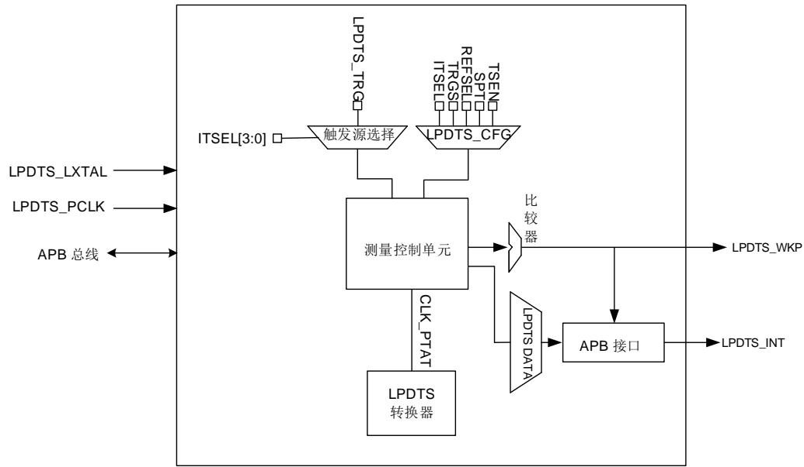
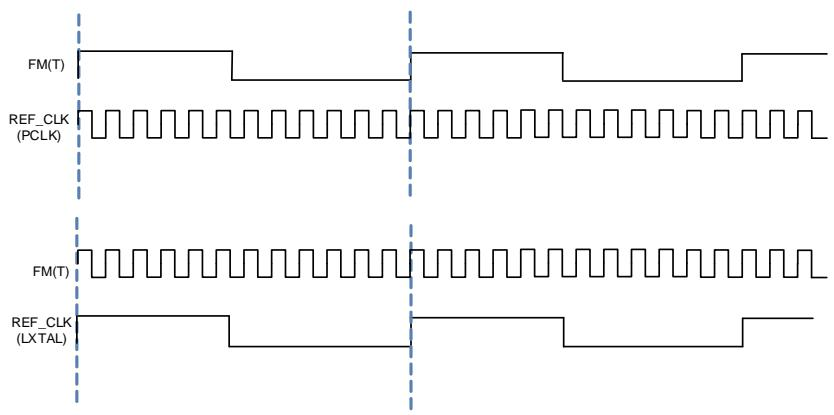

# 40. 低功耗数字温度传感器（LPDTS）

# 40.1. 简介

低功耗数字温度传感器（LPDTS），提供了将温度转换为频率与绝对温度（CLK_PTAT）成正比的方波。其中，频率的测量是基于PCLK或LXTAL时钟。

# 40.2. 主要特征

支持软件和硬件的触发源；

可编程的采样时间；

温度窗口看门狗；

温度低于/高于预设阈值以及在测量结束时时产生中断；

◼ 温度高于/低于预定义阈值时产生的异步唤醒信号（仅LXTAL作为参考时钟）。

# 40.3. 模块框图

40-1. LPDTS 描述了 LPDTS 的模块框图。

图 40-1. LPDTS 模块框图

# 40.4. 功能说明

# 40.4.1. LPDTS 内部信号

表 40-1. LPDTS 信号

<table><tr><td>信号</td><td>类型</td><td>描述</td></tr><tr><td>LPDTS_LXTAL</td><td>输入</td><td>LXTAL时钟</td></tr><tr><td>LPDTS_PCLK</td><td>输入</td><td>APB时钟</td></tr><tr><td>LPDTS_INT</td><td>输出</td><td>模块中断</td></tr><tr><td>LPDTS_WKP</td><td>输出</td><td>模块唤醒</td></tr></table>

# 40.4.2. 操作模式

通过设置LPDTS_CFG中的REFSEL位，可以选择多种操作模式。

PCLK模式 $\left( { \mathsf { R E F S E L } } = 0 \right)$ 

寄存器能够通过软件进行读写。当REFSEL位设置为0，选择PCLK作为参考时钟。

PCLK和LXTAL模式（REFSEL = 1）

寄存器能够通过软件进行读写。当REFSEL位设置为1，选择LXTAL作为参考时钟。

LXTAL模式（REFSEL = 1并且PCLK时钟关闭）

此模式下温度传感器的寄存器无法访问，选择LXTAL作为参考时钟，从而使用硬件触发来退出深度睡眠模式。

# 40.4.3. 温度测量原理

温度传感器的模拟部分能够将温度转换为方波信号输出，其中，信号的FM(T)频率通常为641KHz。LPDTS模块内嵌了两个计数器，其计数方式和选择的参考时钟相关，计数结果存储在LPDTS_DATA寄存器中。

当参考时钟为 PCLK 时，测量方法为采样一个或多个 FM(T)周期，并在 PCLK上升沿和下降沿计数。

当参考时钟为 LXTAL 时，测量方法为采样一个或多个 LXTAL 周期，并在 FM(T)上升沿和下降沿计数。

图 40-2. 测量方式

当参考时钟为PCLK时温度计算公式如下：

$$
T = T 0 + \left(\left(2 \times F _ {P C L K} / C O V A L\right) \times S P T - 1 0 0 \times F R E Q\right) / R F _ {-} C F \tag {40-1}
$$

当参考时钟为LXTAL时温度计算公式如下：

$$
T = T 0 + \left(\left(\left(F _ {L X T A L} \times C O V A L\right) / (2 \times S P T)\right) - (1 0 0 \times F R E Q)\right) / R F _ {-} C F \tag {40-2}
$$

其中：

T0 等于 $2 5 ^ { \circ } \mathsf { C } ;$ ；

COVAL 为温度传感器计数器输出值，其值存储在 LPDTS_DATA 寄存器中；

SPT 为模块采样时间；

FREQ 是温度传感器在温度为 T0 时测量并存储在 LPDTS_SDATA 寄存器中的频率值，其通常为几百 Hz；

RF_CF 为温度传感器斜坡系数。

# 40.4.4. 采样时间

LPDTS 的测量精度可通过增加采样周期来提高，当参考频率设置在采样频率附近时效果最好。

采样时间的默认值应当设置为一个 REF_CLK 周期或一个 FM(T)周期，对应的模式有 LXTAL模式和 PCLK 模式。

采样时间是通过 LPDTS_CFG 寄存器中的 SPT 位配置的。如 40-2. 所示。

表 40-2. 采样时间设置

<table><tr><td>SPT[3:0]</td><td>LXTAL或FM(T)时钟周期(s)</td></tr><tr><td>0000</td><td>1</td></tr><tr><td>0001</td><td>1</td></tr><tr><td>0010</td><td>2</td></tr><tr><td>0011</td><td>3</td></tr><tr><td>0100</td><td>4</td></tr><tr><td>0101</td><td>5</td></tr><tr><td>0110</td><td>6</td></tr><tr><td>0111</td><td>7</td></tr><tr><td>1000</td><td>8</td></tr><tr><td>1001</td><td>9</td></tr><tr><td>1010</td><td>10</td></tr><tr><td>1011</td><td>11</td></tr><tr><td>1100</td><td>12</td></tr><tr><td>1101</td><td>13</td></tr><tr><td>1110</td><td>14</td></tr><tr><td>1111</td><td>15</td></tr></table>

# 40.4.5. 触发源

温度测量可以由软件或外部事件触发。触发器源可以通过LPDTS_CFG中的ITSEL[3:0]位选择。

# 软件触发

当在LPDTS_CFG中将ITSEL[3:0]设置为 '0000' 时，选择软件触发器。

检查LPDTS_STAT中的TSRF是否设置为1。当TSRF位置1后，通过设置LPDTS_CFG寄存器中的TRGS位来开始温度测量。否则，忽略此步骤。

测量完成后，如果TRGS位仍为1，当TSRF标志位变为1时，测量将重新开始。

# 硬件触发

硬件仅能在TSRF设置为1时才能检测到触发源的上升沿信号，否则，该触发源信号将被忽略。

表 40-3. 触发源设置

<table><tr><td>编号</td><td colspan="4">ITSEL[3:0]</td><td>描述</td></tr><tr><td>NA</td><td>0</td><td>0</td><td>0</td><td>0</td><td>无硬件触发源</td></tr><tr><td>0001</td><td>0</td><td>0</td><td>0</td><td>1</td><td rowspan="3">保留</td></tr><tr><td>0010</td><td>0</td><td>0</td><td>1</td><td>0</td></tr><tr><td>0011</td><td>0</td><td>0</td><td>1</td><td>1</td></tr><tr><td>0100</td><td>0</td><td>1</td><td>0</td><td>0</td><td>LPDTS_TRG</td></tr><tr><td>0101</td><td>0</td><td>1</td><td>0</td><td>1</td><td rowspan="11">保留</td></tr><tr><td>0110</td><td>0</td><td>1</td><td>1</td><td>0</td></tr><tr><td>0111</td><td>0</td><td>1</td><td>1</td><td>1</td></tr><tr><td>1000</td><td>1</td><td>0</td><td>0</td><td>0</td></tr><tr><td>1001</td><td>1</td><td>0</td><td>0</td><td>1</td></tr><tr><td>1010</td><td>1</td><td>0</td><td>1</td><td>0</td></tr><tr><td>1011</td><td>1</td><td>0</td><td>1</td><td>1</td></tr><tr><td>1100</td><td>1</td><td>1</td><td>0</td><td>0</td></tr><tr><td>1101</td><td>1</td><td>1</td><td>0</td><td>1</td></tr><tr><td>1110</td><td>1</td><td>1</td><td>1</td><td>0</td></tr><tr><td>1111</td><td>1</td><td>1</td><td>1</td><td>1</td></tr></table>

注意：LPDTS_TRG信号来源于TRIGSEL模块。TRIGSEL模块中TRIGSEL_LPDTS寄存器的INSELx[7:0]位用于选择LPDTS_TRG信号的触发输入源。

# 40.4.6. 开关控制

通过设置LPDTS_CFG寄存器中的TSEN位来启用LPDTS模块。温度传感器状态寄存器（LPDTS_STAT）中的TSRF标志置位表明LPDTS模块已准备好进行温度测量：当TSRF位设置为1时，LPDTS模块可以开始温度测量。一旦测量开始，TSRF位被重置，新的测量请求将被忽略。如果需要进行新的测量，则需要等待最后一次测量完成，并且再次设置TSRF位。

# 40.4.7. LPDTS 低功耗模式

表 40-4. 低功耗描述

<table><tr><td>模式</td><td>描述</td></tr><tr><td>睡眠模式</td><td>此模式下参考时钟为LXTAL或PCLKLPDTS中断会导致模块退出睡眠模式</td></tr><tr><td>深度睡眠模式</td><td>此模式下参考时钟为LXTALLPDTS中断会导致模块退出深度睡眠模式</td></tr></table>

# 40.4.8. LPDTS 中断

LPDTS中断可以连接到CPU NVIC或EXTI控制器。

LPDTS模块可以在以下两种情况下产生中断：

测量结束时

测量结果高于或低于预定义阈值

LPDTS模块中有以下两种中断：

同步中断：通过设置LPDTS_INTEN寄存器选择3个中断事件

异步唤醒：通过设置LPDTS_INTEN寄存器中选择3个异步唤醒事件

允许所有中断的组合。

注意:只有选择LXTAL作为参考时钟时，才能使用异步唤醒。

40-5. 显示了中断位及其描述。

表 40-5. 低功耗模式下温度传感器行为

<table><tr><td>中断事件</td><td>中断标志</td><td>中断使能位</td><td>中断清除位</td><td>退出睡眠模式</td><td>退出深度睡眠模式</td><td>同步/异步</td></tr><tr><td>测量结束</td><td>EMIF in LPDTS_STAT</td><td>EMIE in LPDTS_INTEN</td><td>EMIC in LPDTS_INTC</td><td>是</td><td>否</td><td rowspan="3">与PCLK同步</td></tr><tr><td>低于低阈值</td><td>LTIF in LPDTS_STAT</td><td>LTIE in LPDTS_INTEN</td><td>LTIC in LPDTS_INTC</td><td>是</td><td>否</td></tr><tr><td>高于高阈值</td><td>HTIF in LPDTS_STAT</td><td>HTIE in LPDTS_INTEN</td><td>HTIC in LPDTS_INTC</td><td>是</td><td>否</td></tr><tr><td>测量结束</td><td>EMAIF in LPDTS_STAT</td><td>EMAIE in LPDTS_INTEN</td><td>EMAIC in LPDTS_INTC</td><td>是</td><td>是</td><td rowspan="3">异步</td></tr><tr><td>低于低阈值</td><td>LTAIF in LPDTS_STAT</td><td>LTAIFE in LPDTS_INTEN</td><td>LTAIC in LPDTS_INTC</td><td>是</td><td>是</td></tr><tr><td>高于高阈值</td><td>HTAIF in LPDTS_STAT</td><td>HTAIE in LPDTS_INTEN</td><td>HTAIC in LPDTS_INTC</td><td>是</td><td>是</td></tr></table>

