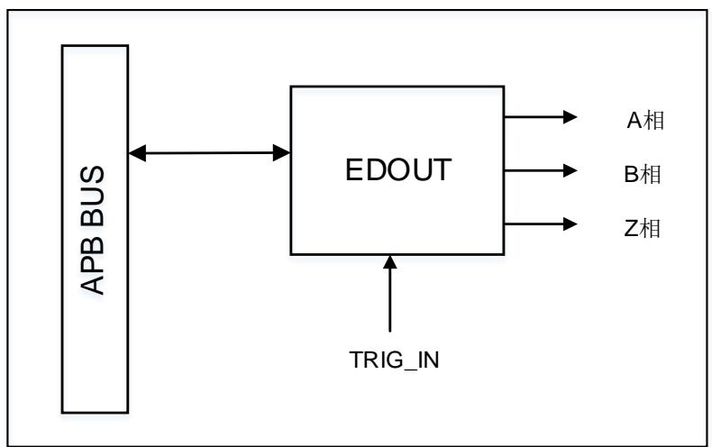
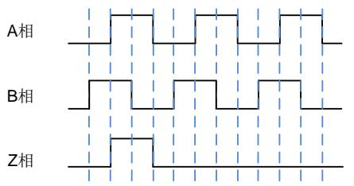
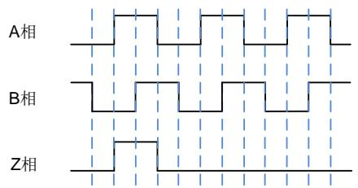
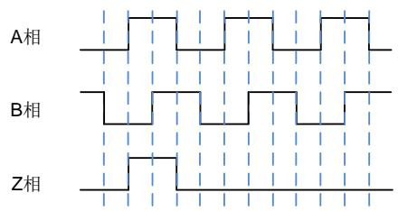
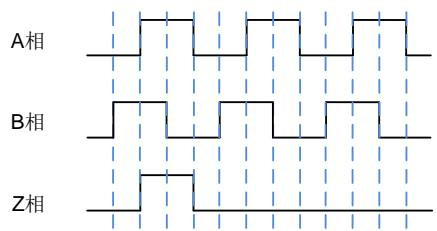
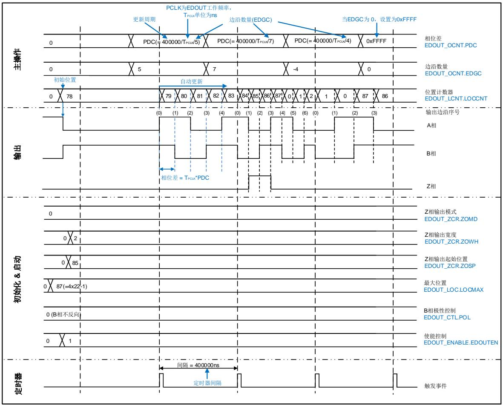

# 41. 编码器分频输出控制器（EDOUT）

# 41.1. 简介

编码器分频输出控制器（EDOUT）用于把从编码器获取到的位置信息，以A相、B相和Z相脉冲的方式输出。

# 41.2. 主要特征

支持更改B相极性状态。

支持配置Z相输出位置和脉冲宽度。

每旋转一圈的边沿数量：16至65536（必须为4的倍数）。

支持从TRIGSEL获取更新周期事件输入信号。

# 41.3. 功能说明

EDOUT模块结构框图如 41-1. EDOUT 。A相、B相和Z相代表相关的脉冲信号输出引脚，TRIG_IN表示从TRIGSEL模块输入的信号。

图 41-1. EDOUT 模块结构框图

EDOUT输出波形与增量式编码器输出信号比较相似。通过对EDOUT的设置，可以反映出当前的位置信息，如 41-2. ABZ 所示。

图 41-2. ABZ 相输出波形

(1)顺时针旋转,B相正向

(2)逆时针旋转,B相正向

(3)顺时针旋转,B相反向

(4)逆时针旋转，B相反向

通过对寄存器的配置，EDOUT 可以将增量式编码器或者绝对式编码器的位置信息转换到 AB相和 Z 相输出信号。

除了EDOUT初始设置外，CPU在每个更新周期内，从编码器获得位置变化量并更新EDOUT寄存器，得到AB相和Z相输出信号。

此时，来自定时器模块的事件信号必须通过TRIGSEL输入至EDOUT。

# 41.4. Z相输出模式

Z相支持以下两种操作模式：

# 操作模式0

Z相输出由当前位置决定。用户设置ZCR寄存器的ZOSP位域和ZOWH位域，在当前位置（EDOUT_LCNT寄存器的LOCCNT反映当前位置）与ZOSP相匹配时，Z相开始输出信号且脉冲宽度为ZOWH个边沿。

# 操作模式1

Z相输出由边沿序号决定。用户设置ZCR寄存器的ZOSP位域和ZOWH位域，在一个更新周期内，当输出边沿序号与ZOSP匹配时，Z相开始输出信号且脉冲宽度为ZOWH个边沿。

在上面两种操作模式中，若将ZOWH位域设置为0，则表示Z相不输出。需要注意，必须在EDOUT运行时（即EDOUT_ENABLE寄存器中的EDOUTEN位为1），配置ZCR寄存器；否则，Z相不会产生有效输出。

# 41.5. 操作指导

EDOUT根据寄存器设置输出AB相和Z相信号。AB相和Z相输出的更新周期由TRIGSEL的输入决定。使用定时器等产生更新周期，从TRIGSEL输出信号至EDOUT。具体的设置步骤如下所

述。

# 41.5.1. EDOUT 初始化

EDOUT初始化处理步骤如下：

1. 配置EDOUT相关的输出引脚

2. EDOUT模块初始化配置

对EDOUT_CTL寄存器和EDOUT_LOC寄存器进行初始化配置。例如，当B相输出为反向状态且每旋转一圈的边沿数量为88（4x22）。此时，需要设置EDOUT_CTL寄存器的POL位为1，EDOUT_LOC寄存器的LOCMAX位域为87（4x22-1）。

3. EDOUT_LCNT寄存器设置初始值

初始值设置为绝对式编码器或增量式编码器的初始位置，用于产生AB相和Z相信号，由EDOUT_LCNT寄存器的LOCCNT位域表示，取值范围是0到LOCMAX。位置值的计算公式是[编码器位置值]×[每旋转一圈的边沿数量]/[编码器位置值的分辨率]（向下舍入）。

例如，每旋转一圈的边沿数量为88，编码器位置值的分辨率为20位（1048576），初始值为931802。此时，需要将EDOUT_LCNT寄存器的LOCCNT位域设置为78（931802×88/1048576）。

4. 设置TRIGSEL

例如，当选择定时器作为EDOUT输入的触发源，设置定时器生成更新周期。当然，EDOUT还支持其他触发源，但触发器输出的高电平宽度必须大于EDOUT的TPCLK。

5. 使能AB相和Z相输出

配置EDOUT_ENABLE寄存器的EDOUTEN位为1，使能EDOUT输出。

6. 启动定时器

按照步骤4的TRIGSEL设置，定时器启动开始计数，生成更新周期信号。

# 41.5.2. EDOUT 更新处理

EDOUT更新处理步骤如下：

1. 获取位置信息

从绝对式编码器或增量式编码器获取位置信息。

2. 设置EDOUT_OCNT寄存器值

首先，计算写入EDOUT_OCNT寄存器PDC位域和EDGC位域的值。当前位置可以用0到LOCMAX表示，计算过程如下：

（m）=[步骤1中获取的位置]×[每旋转一圈的边沿数量]/[编码器位置值的分辨率]（向下舍入）

此时，EDGC位域的值为：

（n）=（m）–[前一次计算的值(m)]

当（n）的绝对值大于旋转边沿数量的一半时，则：

A. 如果（n）为正数，则EDGC值为（n）–[每旋转一圈的边沿数量]。

B. 如果（n）为负数，则EDGC值为（n）+[每旋转一圈的边沿数量]。

当EDGC位域不为0时，PDC位域为[更新周期]/[TPCLK]/[EDGC位域的绝对值（向下舍入）。]

当EDGC位域为0时，PDC位域配置为0xFFFF。

在EDOUT_OCNT寄存器中设置计算得到的PDC和EDGC值。

# 41.5.3. EDOUT 工作案例

如 41-3. EDOUT AB Z 所示。在该示例中，设置定时器来生成更新周期，并选择定时器触发输出作为EDOUT输入。更新周期为400000ns，每旋转一圈的边沿数量为88，B相极性为正，Z相输出由当前位置决定。同时，用0到LOCMAX表示的编码器位置值从初始值78变化到83、2和86。

图 41-3. EDOUT 设置案例和 AB 相及 Z 相输出波形


