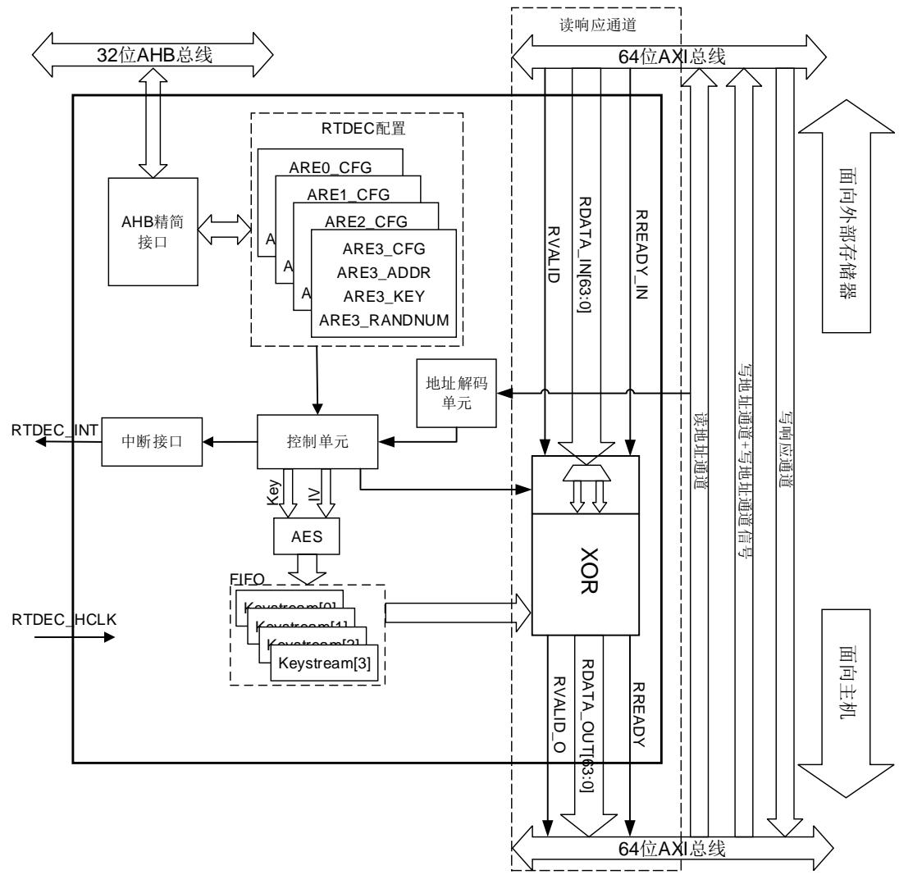
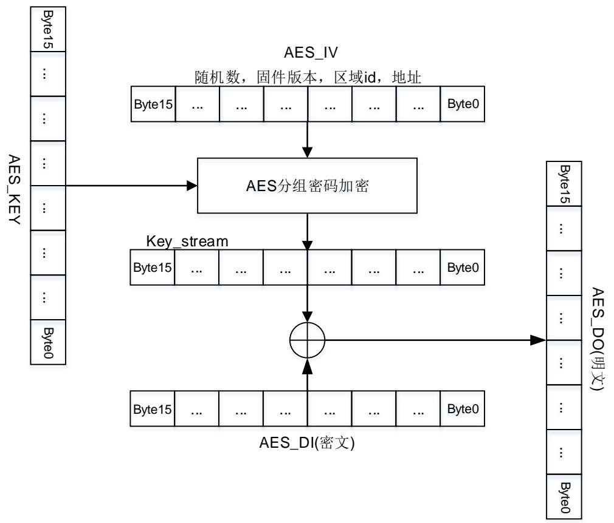
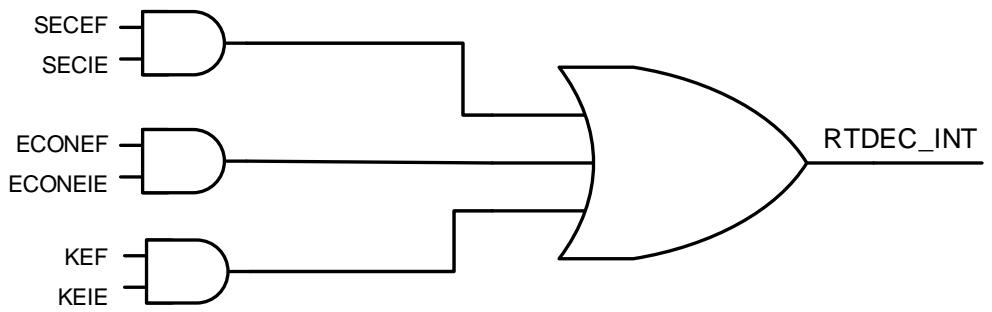

# 46. 实时解密（RTDEC）

# 46.1. 简介

根据读请求地址的信息，实时解密（RTDEC）模块可以进行实时解密。RTDEC可以配置四个独立、不同的加密区域。每个区域都可被选择配置为只执行或从不执行。

为了实现良好的实时性能，RTDEC使用AES-128加密算法的计数器（CTR）模式。由于RTDEC在CTR模式下使用AES-128，当一个加密区域的数据或代码发生更改时，这个区域必须使用一个新的加密上下文（密钥或初始化向量）重新加密。RTDEC的这个特性决定了RTDEC仅适用于解密只读内容，如存储在外部闪存中的内容。

注意：RTDEC与Octal-SPI（OSPI）一起使用时，需要使用存储器映射模式访问外部只读存储器。需要特别注意的是，MCU内存和RTDEC模块均遵循小端表示法，而AES硬件加速器则遵循大端表示法。

# 46.2. 主要特性

软件可配置的加密区域多达4个；

RTDEC区域中的粒度为4096字节；

区域配置可上锁；

可选的解密模式：只执行或从不执行；

每个区域都可配置独立的128位密钥、16位区域固件版本和64位应用程序定义的随机数。用户每次执行加密时，必须更改其中的一项或多项；

加密密钥的机密性和完整性保护；

128 位只写密钥寄存器，且具有软件锁定机制

硬件自动计算的 8 位 CRC 作为公钥信息

OSPI内存读操作时的实时解密；

CTR 模式下使用 AES-128

支持深度为 4 的密钥流 FIFO

支持各种读取大小

读取的物理地址用于加密/解密

支持GD32 OSPI预取机制。

# 46.3. 功能说明

根据读取请求地址信息，RTDEC（实时解密）模块可以对Arm® AXI或AHB总线数据进行实时解密。RTDEC的最初目的是保护存储在外部SPI NOR Flash设备中的只读固件的机密性。RTDEC在OSPI存储器读操作期间进行实时解密。

# 46.3.1. 结构框图

46-1. RTDEC 给出了 RTDEC 的主要组成结构。

图 46-1. RTDEC 结构框图

注意：RTDEC_HCLK 是从 AHB 时钟输入的 RTDEC 时钟，RTDEC_INT 是 RTDEC 全局中断。

# 46.3.2. RTDEC实时解密介绍

# RTDEC 典型用例

RTDEC 的根本目的是保护只执行代码的机密性，只执行代码可以是从外部存储中执行的只执行固件。RTDEC 还可以保护只读的“代码+数据库”，以及在外部存储器中的只读和从不执行数据。

为了保护解密密钥的完整性，以及保护 RTDEC 的其他配置不受到软件拒绝服务攻击，RTDEC提供了区域配置锁定机制。

RTDEC 与 OSPI 一起使用时，需要使用存储器映射模式访问外部只读存储器。

# RTDEC 原理

RTDEC 原理是分析 MCU 和外设的所有读地址通道事务，这些读地址通道事务发生在 AXI 总线上，如中的 OSPI 控制器。

如果读取请求在 RTDEC 中编程的四个区域之一内，控制逻辑将触发密钥流计算。密钥流由RTDEC 在计数器模式下使用 AES-128 计算。

RTDEC 编程区域之外的任何访问都属于非加密区域。RTDEC 区域定义的粒度为 4K字节，也就是说，RTDEC 编程区域的大小是 4K 字节的整数倍。

每 个 RTDEC 区 域 可 以 通 过 寄 存 器 AREx_CFG 、 AREx_SADDR 、 AREx_EADDR 、AREx_NONCE 和 AREx_KEY 进行编程，其中 x=0~3。在寄存器 AREx_CFG 中，通过MODE[1:0]位可定义区域是代码（只执行）、数据（从不执行），还是两个都是。

注意：虽然 RTDEC 不禁止区域重叠，但它是一种无效的编程，用户应该在应用软件中尽量避免。

当 RTDEC 解密增量或回卷突发时，它们不应跨越 4096 字节对齐的地址边界。RTDEC 无法解密 AXI 总线传输的部分数据（不完整数据）。

# 46.3.3. 计数器模式下使用 AES 解密

46-2. CTR AES-128 表明了 RTDEC 如何在计数器模式下使用高级加密标准（AES）算法。此模式由 NIST 在 Special Publication 800-38A, Recommendation for BlockCipher Modes of Operation 中指定。

图 46-2. CTR 下的 AES-128 解密流

在解密过程中，使用 AES 块密码为每个 128 位数据块计算一个特定的密钥流信息。AES_IV和 AES_KEY 定义如下：

1. 初 始 化 向 量 AES_IV[127:0] = ARExNONCE[63:0] || 16’b0000 0000 0000 0000 ||ARExCFG[31:16] || 2’b00 || x || ReadAddress[31:4]。

2. 密 钥 AES_KEY[127:0] = ARExKEY3[31:0] || ARExKEY2[31:0] || ARExKEY1[31:0] ||ARExKEY0[31:0]。

注意：上述 x 为所选加密区域的区域 ID（x= 2’b 00 到 2’b11）

计算出 128 位密钥流后，将 128 位密文数据与对应的 128 位密钥流进行异或可得到 128 位明文信息。

128 位 AES_DIN 和 AES_DOUT 数 据 块 的 构 造 遵 循 以 下 规 则 ： AES_Dx[127:0] =AXI_word(@+0x8)[63:0] || AXI_word(@)[63:0]，其中@是用于计算密钥流的十六进制地址。

当读取请求在非加密区域内，或在加密区域但未启用解密时，128 位 AXI 数据不会被更改。

# 46.3.4. RTDEC 配置

# RTDEC 初始化过程

RTDEC 寄存器的可信初始化是使用 RTDEC 时的一个重要方面。因为它涉及密钥初始化和MODE[1:0]位关键选项的初始化。

文中介绍两种 RTDEC 可信初始化方案。

注意：建议这些配置序列用于生产代码，因为在代码开发过程中，并不建议设置 ARE_K_LK 或ARE_CFG_LK 位来锁定密钥或者去配置。

当 ARE_CFG_LK 位为 0 时，即使 ARE_EN 为已经置为 1，写入区域配置寄存器仍有效。

# 所有区域一个密钥解决方案

该解决方案中，用于解密 RTDEC 配置的 4 个保护区域的密钥属于同一个实体。

推荐的 RTDEC 配置序列如下：

将正确的MODE[1:0]值写入RTDEC_AREx_CFG寄存器（其中x=0~3）。

◼ 使用ARE_K_CRC中描述的序列对RTDEC_AREx_KEY0~3（其中x=0~3）寄存器进行编程，以确保生成有效的CRC。注意，密钥寄存器是只写寄存器，读该寄存器为非法操作。

检查密钥CRC。如果正常，将RTDEC_AREx_CFG寄存器中的ARE_K_LK位置位。区域x中的ARE_K_LK置位后不能被软件清除，即此区域中的密钥寄存器不能再被更改。其中x=0~3。

当你有一个需要解密的区域x时做以下操作。当这项工作进行时，不一定必须由实体（拥有解密密钥）执行。

检查密钥 CRC 是否与存储在该区域中的加密二进制文件匹配。

配置与加密二进制文件对应的详细信息，这些信息是随机数、固件版本、开始和结束地址。

设置 RTDEC_AREx_CFG（其中 x=0~3）寄存器中的 ARE_EN 位，以使能该区域的解密。

设置 RTDEC_AREx_CFG（其中 x=0~3）寄存器中的 ARE_CFG_LK 位，该位不能被软件清除，即区域配置不会再被更改。

注意：对于给定的区域，当 MODE[1:0]位改变时，密钥寄存器和相关的 CRC 会自动由硬件清零 。 因 此 ， 必 须 先 写 入 MODE[1:0] 位 ， 然 后 再 进 行 其 他 操 作 ， 并 且 在 编 程RTDEC_AREx_KEY0~3（其中 x=0~3）寄存器后不得修改 MODE[1:0]位。

# 一区域一密钥解决方案

在该解决方案中，用于解密一个（或多个）保护区域的密钥可属于一个实体。建议遵循以下序列配置 RTDEC：

当你有一个需要解密的区域 x 时做以下操作，例如区域 0。当这项工作进行时，必须由拥有相应密钥的实体来执行。

将正确的MODE[1:0]值写入RTDEC_ARE0_CFG。

使用ARE_K_CRC中描述的序列对RTDEC_ARE0_KEY0~3寄存器进行编程，以确保生成有效的CRC。注意，密钥寄存器是只写寄存器，读该寄存器为非法操作。

检查密钥CRC。如果正常，将RTDEC_ARE0_CFG寄存器中的ARE_K_LK位置位。区域x中的ARE_K_LK置位后不能被软件清除，即此区域中的密钥寄存器不能再被更改。

◼ 配置与受保护固件对应的详细信息，这些信息是随机数、固件版本、开始和结束地址。

设置RTDEC_ARE0_CFG寄存器中的ARE_EN位，以使能该区域的解密。

设置RTDEC_ARE0_CFG寄存器中的ARE_CFG_LK位，该位不能被软件清除，即区域配置不会再被更改

注意：对于给定的区域，当 MODE[1:0]位改变时，密钥寄存器和相关的 CRC 会自动由硬件清零。因此，必须先配置 MODE[1:0]，再进行其他操作，且在编程 RTDEC_ARE0_KEY0~3 寄存器后，不得修改 MODE[1:0]。

# RTDEC 复位

RTDEC 每次复位时，必须按照章节 RTDEC 描述的正确的密钥加载序列执行初始化。在这种情况下，RTDEC_AREx_CFG 寄存器位 ARE_K_CRC 位为零。当 RTDEC 复位时，我们建议用户的应用软件来保证正确的密钥加载顺序。

# 46.3.5. RTDEC 错误管理

RTDEC 可以自动管理如下的错误：

非法读取RTDEC_AREx_KEY0~3寄存器；

当RTDEC_AREx_CFG寄存器中的ARE_CFG_LK或ARE_K_LK位置位时，非法写入RTDEC_AREx_KEY0~3寄存器。其中x=0~3；

当 RTDEC_AREx_CFG 寄 存 器 中 的 ARE_CFG_LK 位 置 位 时 ， 非 法 写 入RTDEC_AREx_CFG ， RTDEC_AREx_SADDR ， RTDEC_AREx_EADDR 或RTDEC_AREx_NONCE0~1寄存器，其中x=0~3；

当MODE[1:0]=2'b00时，非法读取只执行区域。当MODE[1:0]=2'b01时，非法执行请求到从不执行区域。这些非法请求返回0，无总线错误；

1 密钥错误：当中止事件发生，密钥寄存器将被清除。此时如果有一些读请求，这些请求将返回0，不会出现总线错误。中止事件可能篡改检测，未授权调试连接，不受信任的引导或SPC级别低至无保护降级。

如果 SECIE、ECONEIE 或 KEIE位置位，则发生上述一个或多个错误将产生中断。关于中断信息，可参考 RTDEC 。

注意：发生密钥错误后，必须重新初始化 RTDEC 密钥。如果寄存器被锁定，可能还需要复位RTDEC。

# 46.4. RTDEC 中断

RTDEC 可产生三个独立的可屏蔽中断源，以下安全事件发生后中断标志将置位：

非法读取或写入密钥。当ARE_CFG_LK=1时，非法写入区域的配置寄存器。两者都将触发SECEF标志置位，参考 RTDEC_INTF ；

当MODE[1:0]为2'b00时，对只执行区域进行读访问。当MODE[1:0]为2’b01时，执行访问到从不执行区域（数据区）。两者都将触发ECONEF标志置位，参考RTDEC_INTF ；

密钥错误（加密区域读为零），触发KEF标志置位。参考 RTDEC_INTF

在被发送到中断控制寄存器之前，所有的中断事件都进行了 OR 操作。因此 RTDEC 在任何给定时间只能向控制器发送单个中断请求。

46-3. RTDEC 表明了 RTDEC 模块中断连接。

图 46-3. RTDEC 中断框图

通过设置 RTDEC_INTEN 寄存器中相应的 SECIE、ECONEIE 或 KEIE 位，可以使能或禁能RTDEC 中断源，如 46-1. RTDEC 所示。中断事件的状态可在 RTDEC_INTF 寄存器中查询，可以使用 RTDEC_INTC 寄存器清除中断标志。

表 46-1. RTDEC 中断请求

<table><tr><td>中断事件</td><td>事件标志</td><td>控制使能位</td></tr><tr><td>安全错误</td><td>SECEF</td><td>SECIE</td></tr><tr><td>仅执行,从不执行错误</td><td>ECONEF</td><td>ECONEIE</td></tr><tr><td>密钥错误</td><td>KEF</td><td>KEIE</td></tr></table>

