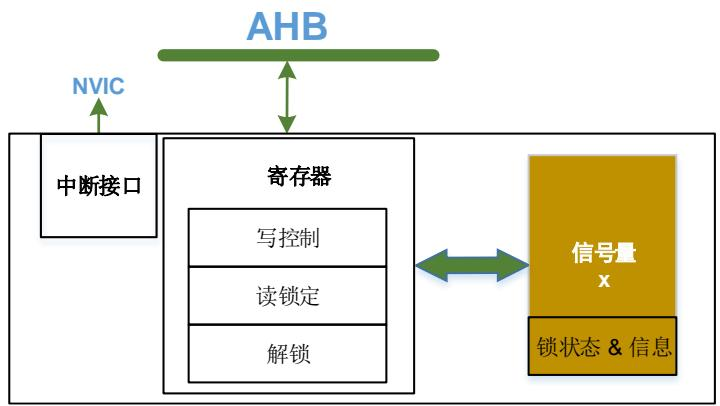
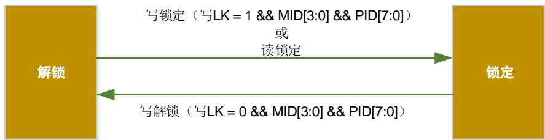
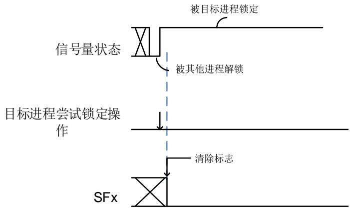
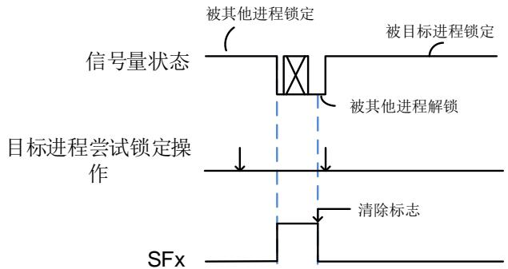
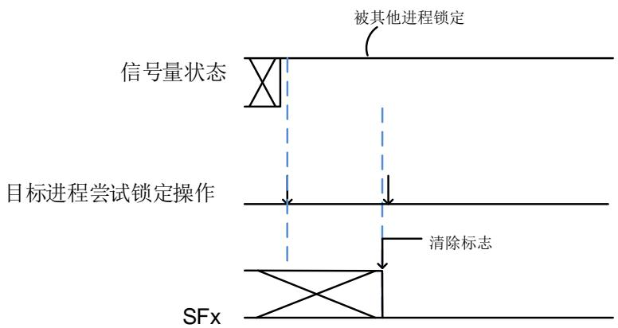

# 48. 硬件信号量（HWSEM）

# 48.1. 简介

硬件信号量（HWSEM）模块提供了一种非阻塞机制来保证不同进程之间的同步。HWSEM以原子方式实现了32个信号量，支持信号量的写锁定与读锁定，支持只有当总线主控ID和进程ID都与信号量锁信息相匹配时才解锁信号量。

# 48.2. 主要特征

32个信号量；

当一个信号量解锁时会产生一个中断；

只有当MID[3:0]和PID[7:0]都与信号量锁信息相匹配时才解锁信号量。

# 48.3. 功能说明

# 48.3.1. 模块框图

图 48-1. HWSEM 框图

如 48-1. HWSEM 所示，HWSEM模块包含三个子模块：

信号量 x 子模块，包含信号量锁状态和锁信息。

寄存器，用于访问信号量。

中断接口，用于中断控制和状态获取。

# 48.3.2. 信号量 x

# 锁状态

HWSEM_CTLx（x=0…31）寄存器中的LK位指示了信号量x的锁状态。

当LK位为0时，信号量未锁定。

当LK位为1时，信号量已锁定。

# 锁信息

当信号量未锁定时，HWSEM_CTLx（x=0…31）寄存器中的MID[3:0]和PID[7:0]位值都为0。

当信号量已锁定时，HWSEM_CTLx（x=0…31）/ HWSEM_RLKx（x=0…31）寄存器中的MID[3:0]位值指示了锁定信号量的AHB总线主控，HWSEM_CTLx（x=0…31）/ HWSEM_RLKx（x=0…31）寄存器中的PID[7:0]位值指示了锁定信号量的进程。

图 48-2. HWSEM 状态机

# 48.3.3. 锁定信号量

HWSEM支持两种信号量锁定方式：

写锁定；

读锁定。

注意：仅支持当 MID[3:0]为 0b1011 时，锁定与解锁信号量。

# 写锁定

当由写锁定操作锁定一个信号量时，HWSEM_CTLx（x=0…31）/ HWSEM_RLKx（x=0…31）寄 存 器 中 的MID[3:0]位 为 锁 定 信 号 量 的AHB总 线 主 控 ，HWSEM_CTLx（x=0…31）/HWSEM_RLKx（x=0…31）寄存器中的PID[7:0]位是配置的锁定信号量的进程ID。

每个AHB总线进程都必须有唯一的PID[7:0]值。

写锁定操作按照以下步骤进行：

1. 设置LK位为1，配置HWSEM_CTLx（x=0…31）寄存器的MID[3:0]和PID[7:0]位以锁定信号量。

2. 回读HWSEM_CTLx（x=0…31）寄存器，确认MID[3:0]和PID[7:0]位值是否是配置的值。

3. 如果回读的HWSEM_CTLx（x=0…31）寄存器的MID[3:0]和PID[7:0]位值与配置的值相匹配，则信号量被该进程锁定。否则，信号量已被其他AHB总线主控或进程锁定，返回步骤1重试。

# 读锁定

当由读锁定操作锁定一个信号量时，HWSEM_CTLx（x=0…31）/ HWSEM_RLKx（x=0…31）寄存器中的MID[3:0]位为锁定信号量的AHB总线主控，而HWSEM_CTLx（x=0…31）/HWSEM_RLKx（x=0…31）寄存器中的PID[7:0]位始终为0。

如果超过一个进程使用读锁定操作锁定同一个信号量，当信号量被其中一个进程读锁定了，其他进程也会读到信号量被锁定了，但无法区分是哪个进程锁定的。

读锁定操作按照以下步骤进行：

1. 读HWSEM_RLKx（x=0…31）寄存器以锁定信号量。

2. 如果读到的MID[3:0]值与读锁定操作的AHB总线主控ID相匹配，并且PID[7:0]值读为0，则信号被读锁定。如果信号量被其他总线主控锁定时（读到的MID[3:0]值与读锁定操作的AHB总线主控ID不匹配），或者被其他进程写锁定时（读取的PID[7:0]值不为0），返回步骤1重试。

# 48.3.4. 解锁信号量

当信号量被锁定时，可使用写解锁操作来解锁信号量。写解锁操作可以避免信号量被其他不具有解锁权限的进程解锁。

只有与信号量锁信息相匹配的MID[3:0]和PID[7:0]值才可解锁信号量。在有效的写解锁操作后，HWSEM_CTLx（x=0…31）/ HWSEM_RLKx（x=0…31）寄存器的LK位，MID[3:0]和PID[7:0]位将都清零，此时如果HWSEM_INTEN寄存器的SIEx位为1，将产生一个中断。

写解锁操作按照以下步骤进行：

1. 设置LK位为0，配置HWSEM_CTLx（x=0…31）寄存器的MID[3:0]和PID[7:0]位以解锁信号量。

2. 回读HWSEM_CTLx（x=0…31）寄存器，确认LK位为0。

3. 如果配置的HWSEM_CTLx（x=0…31）寄存器的MID[3:0]和PID[7:0]位值与信号量的锁信息相匹配，且写入的LK位为0，则信号量将被解锁。否则，将忽略写解锁操作，LK位将始终保持为1。

# 48.3.5. 解锁所有信号量

当AHB总线主控工作不正常时，可使用全解锁操作来清除所有信号量的锁状态和锁信息。

全解锁操作按照以下步骤进行：

1. 配置HWSEM_UNLK寄存器的KEY[15:0]和MID[3:0]位域以解锁所有信号量。

2. 读取所有HWSEM_CTLx（x=0…31）寄存器，确认所有的LK位均为0。

3. 如果配置的HWSEM_CTLx（x=0…31）寄存器的MID[3:0]位值与信号量的锁信息相匹配，且写入的LK位为0，则信号量将被解锁，当HWSEM_INTEN寄存器的SIEx位为1时，将产生一个中断。否则，将忽略全解锁操作，LK位将始终保持为1。

# 48.3.6. 中断

信号量的锁定与解锁操作应在用户进程中进行，而不能在中断服务程序中进行。推荐的锁定操作为尝试两次锁定信号量动作，只有当第二次锁定失效时，再去使能信号量中断并等待中断。

48-3. 中表示当目标进程第一次尝试锁定信号量时，锁定成功，接着应当执行清除标志操作，此时无需使能信号量中断。

48-4. 中表示当目标进程第一次尝试锁定信号量失败，而在第二次锁定操作之前，应当执行清除标志操作，接着第二次尝试锁定信号量时，锁定成功，在这种情况下，也无需使能信号量中断。

48-5. 中表示当目标进程第一次尝试锁定信号量失败，在第二次锁定操作之前，应当执行清除标志操作，接着第二次尝试锁定信号量再次失败，在这种情况下，再使能信号量中断并等待中断，在中断到来后进行后续的尝试锁定操作。

图 48-3. 第一次尝试锁定操作时成功

图 48-4. 第二次尝试锁定操作时成功

图 48-5. 第二次尝试锁定操作时失败

每个信号量均可产生一个信号量解锁中断。每个中断事件在HWSEM_INTF寄存器中专用的中断标志位，在HWSEM_INTC寄存器中有专用的清除标志位，在HWSEM_INTEN寄存器中有专用的中断使能位。 48-1. 描述了其对应关系。

表 48-1. 中断事件

<table><tr><td rowspan="2">中断事件</td><td>标志位</td><td>清除位</td><td>使能位</td></tr><tr><td>HWSEM_INTF</td><td>HWSEM_INTC</td><td>HWSEM_INTEN</td></tr><tr><td>信号量x解锁</td><td>SIFx</td><td>SIFCx</td><td>SIEx</td></tr></table>

HWSEM 中断逻辑如 48-6. HWSEM 所示，中断使能时，相应中断事件会产生中断。

图 48-6. HWSEM 中断逻辑图

注意：“x”表示信号量序号（x=0…31）。


