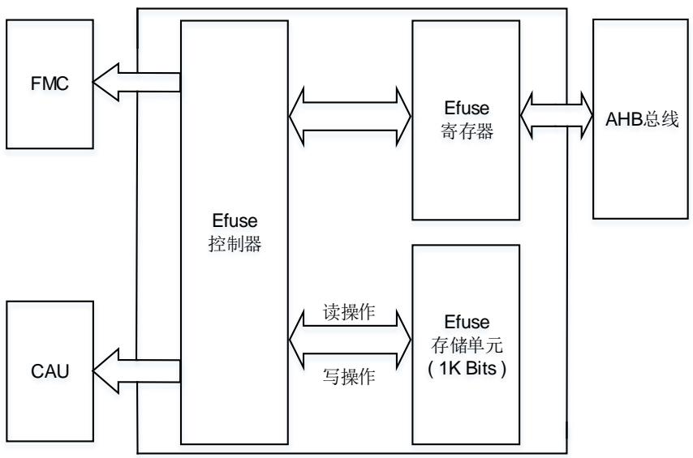
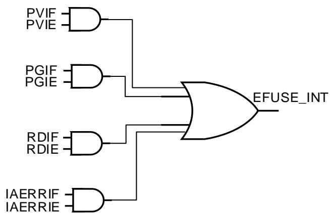

# 4. 熔丝（EFUSE）

# 4.1. 简介

熔丝（EFUSE）作为一种非易失性存储单元存储了一些必需的系统参数。作为非易失性存储单元，熔丝的每一个比特位一旦从 0 被改写为 1，就无法恢复为 0。

# 4.2. 主要特性

熔丝的存储单元大小为32*32比特；

Double-bit冗余备份机制；

熔丝中的所有比特位不支持回退；

熔丝内容只能通过相应的寄存器读取；

熔丝的每个比特位只能被编程一次，软件必须避免比特位被重复编程；

编程操作电压：1.71~1.98V；

读操作电压：0.72~1.05V。

# 4.3. 功能说明

# 4.3.1. 模块框图

熔丝控制器实现了熔丝的读写操作逻辑，其中熔丝模块的存储单元共计 1K比特。

图 4-1 熔丝控制器结构框图

熔丝采用了 double-bit 冗余备份机制，前 512 比特数据和后 512 比特数据互相备份，从而有效保证数据的正确性。当编程熔丝的第 n 比特时，熔丝控制器会同时编程第 n 及 n+512 比特。当读取熔丝的第 n 比特时，熔丝控制器会同时读取第 n 及 n+512 比特，并将读取的结果进行或运算，最终将运算结果返回至参数寄存器中。以上过程全部由芯片内部进行处理，用户操作时只需访问前 512 比特即可，后 512 比特数据用户不可访问。

# 4.3.2. 熔丝内容简介

熔丝存储单元中存储了 5 个系统参数，不同的系统参数具有不同的位宽，并且每个系统参数都有各自的读写保护属性。

写保护属性如下所示：

# 用户控制段：

存储在熔丝内的参数可以被多次修改，但一旦某一位被编程为1，硬件将自动禁止该位被再次编程。只有在SCRLK位为0时，用户才能修改寄存器高16位的内容。只有在UCLK位为0时，用户才能修改寄存器低16位的内容。但修改后的寄存器值不会被存储到熔丝内，除非成功执行了熔丝 。在执行完熔丝写操作后，用户需要电源复位（JTAGNSW及NDBG[1:0]位）或系统复位（除JTAGNSW及NDBG[1:0]位外其他位）才能将存储在熔丝内的参数加载到对应的寄存器中，且修改过的用户控制段只有在电源复位（JTAGNSW及NDBG[1:0]位）或系统复位（其他位）后才生效。

# MCU保留段：

存储在熔丝内的参数可以被多次修改，但一旦某一位被编程为1，用户必须通过软件的方式去禁止该位被再次编程（当熔丝写操作时，将熔丝中已经被编程为1的位所对应的寄存器中的位清0）。用户可以修改寄存器里的内容，但修改后的寄存器值不会被存储到熔丝内，除非成功执行了熔丝 。在执行完熔丝写操作后，用户需要系统复位或熔丝才能将存储在熔丝内的参数加载到对应的寄存器中，但是，其中修改后的DCRP_AREA_END[7:0]、DCRP_AREA_START[7:0]、DCRPLK、AESNCAU位只有在系统复位后才生效。

# 调试秘钥：

存储在熔丝内的参数可以被多次修改，但一旦某一位被编程为1，用户必须通过软件的方式去禁止该位被再次编程（当熔丝写操作时，将熔丝中已经被编程为1的位所对应的寄存器中的位清0）。只有在DPLK位为0时，用户才能修改寄存器的内容，但修改后的寄存器值不会被存储到熔丝内，除非成功执行了熔丝 。在执行完熔丝写操作后，用户需要系统复位或熔丝 才能将存储在熔丝内的参数加载到对应的寄存器中，且修改过的调试秘钥只有在系统复位后才生效。

# AES秘钥：

存储在熔丝内的参数可以被多次修改，但一旦某一位被编程为1，用户必须通过软件的方式去禁止该位被再次编程（当熔丝写操作时，将熔丝中已经被编程为1的位所对应的寄存器中的位清0）。只有在AESEN位为0时，用户才能修改寄存器的内容，但修改后的寄存器值不会被存储到熔丝内，除非成功执行了熔丝 。在执行完熔丝写操作后，用户需要系统复位，因为被修改的AES秘钥只有在系统复位后才生效。

# 用户数据段：

存储在熔丝内的参数可以被多次修改，但一旦某一位被编程为1，用户必须通过软件的方式去禁止该位被再次编程（当熔丝写操作时，将熔丝中已经被编程为1的位所对应的寄存器中的位清0）。只有在UDLK位为0时，用户才能修改寄存器的内容，但修改后的寄存器值不会被存储到熔丝内，除非成功执行了熔丝 。在执行完熔丝写操作后，用户需要系统复位或熔丝 将存储在熔丝内的参数加载到对应的寄存器中。

读保护属性如下所示：

# 用户控制段：

寄存器可读。在系统复位后，除JTAGNSW, NDBG[1:0]位以外的其他位将恢复为从熔丝中读取的参数值。在电源复位后，JTAGNSW, NDBG[1:0]位的内容将恢复为从熔丝中读取的参数值。

# MCU保留段：

寄存器可读。在系统复位后，寄存器的内容将恢复为从熔丝中读取的参数值。用户也可以通过配置控制寄存器来执行 ，从熔丝中读取数据。

# 调试秘钥：

当DPLK位为1，JTAGNSW位为1，且NDBG[1:0]位为2b’01或2b’11时，寄存器不可读。其他情况下寄存器可读。在系统复位后，寄存器的内容将恢复为从熔丝中读取的参数值。用户也可以通过配置控制寄存器来执行 ，从熔丝中读取数据。

# AES秘钥：

寄存器不可读。但用户可以通过AES秘钥CRC功能来验证已写入的AES秘钥的正确性。

注意：用户必须将完整的16字节AES秘钥连续写入EFUSE_AES_KEYx寄存器，以确保CRC功能可以检查所有AES秘钥的内容。

# 用户数据段：

寄存器可读。在系统复位后，寄存器的内容将恢复为从熔丝中读取的参数值。用户也可以通过配置控制寄存器来执行 ，从熔丝中读取数据。

4-1. 显示了熔丝中存储的系统参数详情。

表 4-1. 求系统参数

<table><tr><td>名称</td><td>位宽/字节</td><td>起始地址</td><td>写保护属性</td><td>读保护属性</td><td>描述</td></tr><tr><td rowspan="2">用户控制段</td><td rowspan="2">4B</td><td rowspan="2">10'd0</td><td rowspan="2">熔丝中参数可多次修改,但每个比特位不可回退、不可再编程。硬件将禁止已被编程过的位被再次编程。</td><td>系统复位后寄存器中对应位的内容将恢复为从熔丝中读取的参数值。</td><td>除 JTAGNSW 位,NDBG[1:0]位以外的其他位。详细内容请参考用户控制寄存器(EFUSE USER CTL)</td></tr><tr><td>电源复位后寄存器中对应位的内容将恢复为从熔丝中读取的参数值。</td><td>JTAGNSW 位及 NDBG[1:0]位。详细内容请参考用户控制寄存器(EFUSE USER CTL)</td></tr><tr><td>MCU保留段</td><td>4B</td><td>10'd32</td><td rowspan="2">熔丝中参数可多次修改,但每个比特位不可回退、不可再编程。软件需要禁止已被编程过的位被再次编程。</td><td rowspan="2">系统复位后寄存器中对应位的内容将恢复为从熔丝中读取的参数值。且用户可以配置控制寄存器来执行读操作,从熔丝中读取数据。</td><td>MCU 保留段。详细内容请参考MCU 保留寄存器(EFUSE MCU RSV)</td></tr><tr><td>调试秘钥</td><td>8B</td><td>10'd64</td><td>当 JTAGNSW = 1,且NDBG[1:0] = 2b'01或2b'11时,该参数作为调试验证秘钥,用于调试服务。否则,该参数将被用作用户数据使用。详细内容请参考调试秘钥寄存器(EFUSE DPx)(x = 0,1)</td></tr><tr><td>AES秘钥</td><td>16B</td><td>10'd128</td><td rowspan="2"></td><td>该参数用户不可读。但用户可以通过 AES 秘钥 CRC 功能来验证已写入的 AES 秘钥的正确性</td><td>加密固件所需的 AES 秘钥。详细内容请参考固件 AES 秘钥寄存器(EFUSE AES KEYx)(x = 0...3)</td></tr><tr><td>用户数据段</td><td>16B</td><td>10'd256</td><td>系统复位后寄存器中对应位的内容将恢复为从熔丝中读取的参数值。且用户可以配置控制寄存器来执行读操作,从熔丝中读取数据。</td><td>用户自定义数据。详细内容请参考用户数据寄存器(EFUSE USER DATAx)(x = 0...3)</td></tr></table>

注意：以上所有系统参数都是由用户设置的。熔丝的 10'd384~10'd511 位由系统使用，用户不可访问。

EFADDR[9:0]应设置为系统参数的起始地址，EFSIZE[4:0]应设置为系统参数的位宽。

读取操作：一次可以读取一个系统参数。禁止同时读取多个系统参数，否则会出现非法访问错误。然而，如果用户仅读取系统参数的一部分，即未完全读取系统参数，则不会发生非法访问错误，但它可能导致系统参数的读出数据不正确。用户应避免上述这种情况。

写入操作：写入操作的范围不能超过单个系统参数的地址范围，也不能同时写入多个系统参数，否则会出现非法访问错误。

# 4.3.3. 读操作

熔丝中的内容只能通过对应的寄存器来访问。

读取熔丝中系统参数时需要遵循以下操作步骤：

1. 将EFUSE_STAT寄存器中的RDIF位清零，并确保没有出现非法访问错误；

2. 将EFUSE_CTL寄存器中的EFRW位清零；

3. 在EFUSE_ADDR寄存器中填入需要读取的熔丝地址及大小；

4. 将EFUSE_CTL寄存器中EFSTR位置1；

5. 等待EFUSE_STAT寄存器中的RDIF位置位；

6. 读取对应的寄存器值。

当读取操作成功后，EFUSE_STAT 寄存器中的 RDIF 位会置位，如果 EFUSE_CTL 中的 RDIE位置位，熔丝控制器会产生一个完成中断。

注意：熔丝对浪涌电流十分敏感，会影响读操作的结果。在掉电和上电的过程中，严禁对熔丝进行读操作，否则会导致无法预测的后果。

# 4.3.4. 写操作

熔丝中的内容只能通过对应的寄存器来写入，熔丝的写操作步骤如下：

1. 将EFUSE_STAT寄存器中的PGIF位清零，并确保没有出现非法访问错误；

2. 将EFUSE_CTL寄存器中的EFRW位置1；

3. 在EFUSE_ADDR寄存器中填入需要写入的熔丝地址及大小；

4. 在对应的寄存器中写入数据；

5. 将EFUSE_CTL寄存器中的EFSTR位置1；

6. 等待EFUSE_STAT寄存器中的PGIF位置位。

注意：如果对应的参数寄存器中的数据是全 0，在 EFSTR 位被设置为 1 后，熔丝将不会被执行写操作，PGIF 位将自动置 1。

当写操作完成后，EFUSE_STAT 寄存器中的 PGIF 位会置位，如果 EFUSE_CTL 中的 PGIE位置位，熔丝控制器会产生一个中断。另外需要注意的是，数据写入的寄存器所对应的熔丝地址以及数据大小应与EFUSE_ADDR寄存器中的地址和大小相吻合，否则IAERRIF位将置位，如果 IAERRIE 位置位，熔丝控制器会产生一个中断。

注意：熔丝对浪涌电流十分敏感，会影响写操作的结果。在掉电和上电的过程中，严禁对熔丝进行写操作，否则会导致无法预测的后果。

# 4.3.5. AES 秘钥 CRC 功能

本模块中 CRC 计算采用标准 CRC-8-CCITT 算法，CRC 算法用于验证 EFUSE_AES_KEYx寄存器中的值或熔丝中存储的 AES秘钥值。

将 16 字节的 AES 秘钥连续写入偏移地址为 0x24、0x28、0x2C 和 0x30 的 EFUSE_AES_KEYx寄存器后，硬件 CRC 模块将根据 EFUSE_AES_KEYx 寄存器中的 AES 秘钥值自动计算出相应的 CRC 校验码，并将计算结果存储到 EFUSE_CTL 寄存器中的 AES_KEY_CRC 位域中。此时，用户可以将硬件计算的 CRC 校验码与用户软件计算的软件 CRC 校验码进行比较。如果软件和硬件计算的校验码相同，则表明写入 EFUSE_AES_KEYx 寄存器的 16 字节的 AES秘钥正确，否则写入寄存器的 AES秘钥错误。

当系统复位后读取存储在熔丝中的 AES 秘钥时，硬件 CRC 模块将根据存储在熔丝中的 AES秘钥值自动计算出相应的 AES 秘钥的 CRC 校验码，并将计算结果加载到 EFUSE_CTL 寄存器中的 AES_KEY_CRC 位域。此时，用户可以将硬件计算的 CRC 校验码与用户软件计算的CRC 校验码进行比较。如果软件和硬件计算的校验码相同，则表明用户希望写入的 16 字节AES秘钥已成功正确写入熔丝，否则写入熔丝的秘钥错误。

注意：CRC 计算结果是在写完偏移地址 0x30 的 EFUSE_AES_KEY3 寄存器或系统复位读取熔丝完成后生成的。

# 4.3.6. EFUSE 中断

以下操作将会产生非法访问错误（IAERRIF）：

读写熔丝中参数时地址越界；

UCLK 位为 1 且生效时，去写 EFUSE_USER_CTL 的低 16 位；

SCRLK 位为 1 且生效时，去写 EFUSE_USER_CTL 的高 16 位；

MCURSVLK 位为 1 且生效时，去写 EFUSE_MCU_RSV 的低 16 位；

◼ DCRPLK 位为 1 且生效时，去写 EFUSE_MCU_RSV 的高 16 位

DPLK 位为 1 且生效时，去写 EFUSE_DPx；

当 DPLK 位为 1，JTAGNSW 位为 1，且 NDBG[1:0]位为 2b’01 或 2b’11 时，去读EFUSE_DPx；

AESEN 位为 1 且生效时，去写 EFUSE_AES_KEYx；

UDLK 位为 1 且生效时，去写 EFUSE_USER_DATAx；

使用熔丝读操作去读取熔丝中的用户控制段；

使用熔丝读操作去读取熔丝中的 AES 秘钥；

熔丝中断事件和标志如 4-2. EFUSE 所示：

表 4-2. EFUSE 中断请求

<table><tr><td>中断事件</td><td>事件标志</td><td>使能控制位</td></tr><tr><td>编程电压设置错误中断</td><td>PVIF</td><td>PVIE</td></tr><tr><td>写操作完成</td><td>PGIF</td><td>PGIE</td></tr><tr><td>读操作完成</td><td>RDIF</td><td>RDIE</td></tr><tr><td>非法访问错误中断</td><td>IAERRIF</td><td>IAERRIE</td></tr></table>

在发送给中断控制器之前，所有的中断事件是逻辑或的关系。因此在任何时候熔丝只能向控制器产生一个中断请求。不过软件可以在一个中断服务程序里处理多个中断事件。

图 4-2. EFUSE 中断映射图


