# 5. 电源管理单元（PMU）

# 5.1. 简介

功耗设计是 GD32H7xx 系列产品比较注重的问题之一。电源管理单元提供了三种省电模式，包括睡眠模式，深度睡眠模式，和待机模式。这些模式能减少电源能耗，且使得应用程序可以在 CPU 运行时间要求、速度和功耗的相互冲突中获得最佳折衷。如 5-1. 所示，GD32H7xx 系列设备有三个电源域，包括 VDD / VDDA 域，VCORE 域和备份域。VDD / VDDA 域由电源直接供电。在嵌入的 LDO 和低功率开关电源降压稳压器（SMPS 降压稳压器），用来为VCORE域供电。在备份域中有一个电源切换器，当 VDD电源关闭时，电源切换器可以将备份域的电源切换到 VBAT引脚，此时备份域由 VBAT引脚（电池）供电。外设供电调节 USB 的调节器。

# 5.2. 主要特征

三个电源域：备份域、VDD / VDDA域和VCORE电源域。

三种省电模式：睡眠模式，深度睡眠模式，和待机模式。

内部电压调节器（LDO）为VCORE电源域提供VCORE电源。

◼ 提供低电压检测器（LVD），当电压低于所设定的阈值时能发出中断或事件。

当VDD供电关闭时，由VBAT（电池）为备份域供电。

LDO输出电压用于节约能耗。

USB电源调节器。

供电监控：POR / PDR监控、BOR监控、LVD监控、VDDA电压检测和监控（VAVD）、VBAK阈值监测、温度阈值监测。

VBAT电池充电管理，工作模式管理，电压输出控制，低功耗模式管理。

低功率开关电源降压稳压器（SMPS降压稳压器）。

支持cpu 进入deepsleep或者sleep 模式的状态输出。

# 5.3. 功能说明

5-1. 提供了 PMU 及相关电源域的内部结构框图。

图5-1. 电源域概览

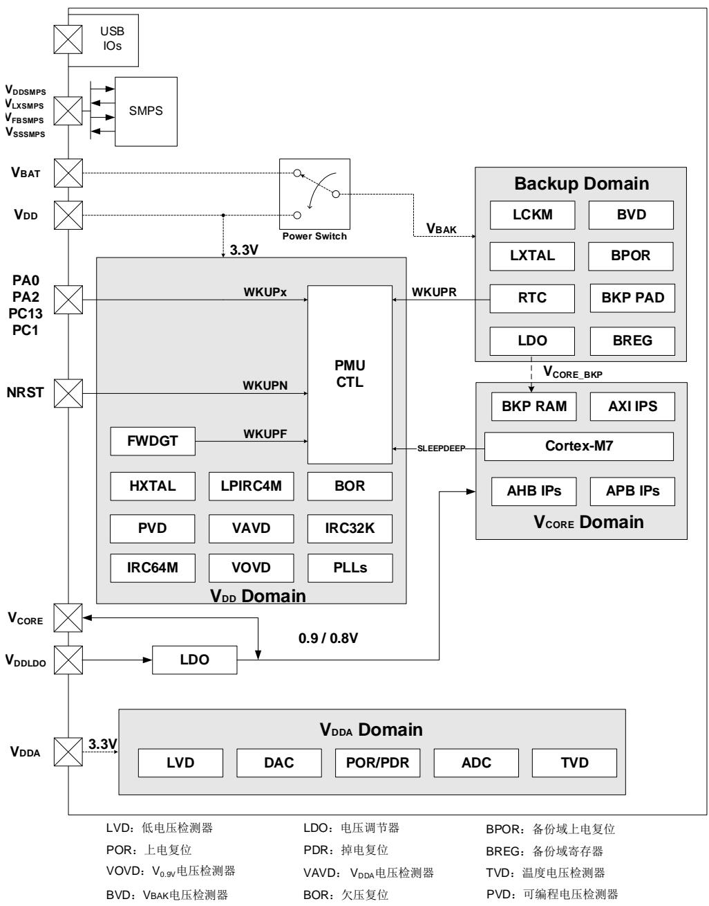

注意：SMPS 供电不是在所有的设备上都支持，具体描述可参考数据手册。

# 5.3.1. 备份域

电池备份域由内部电源切换器来选择 VDD供电或 VBAT（电池）供电，然后由 VBAK为备份域供电，该备份域包含 RTC（实时时钟）、LXTAL（低速外部晶体振荡器）、BVD（VBAK 电压检测器）、LCKM（LXTAL 时钟监视器）、BPOR（备份域上电复位）和 BREG，以及 PC13 至 PC15共 3 个 BKP PAD。为了确保备份域中寄存器的内容及 RTC 正常工作，当 VDD关闭时，VBAT引脚可以连接至电池或其他备份电源供电。电源切换器是由 VDD / VDDA域掉电复位电路控制的。对于没有外部电池的应用，建议将 VBAT引脚通过 100nF 的外部陶瓷去耦电容连接到 VDD引脚上。

备份域的复位源包括备份域上电复位和备份域软件复位。在 VBAK没有完全上电前，BPOR 信号强制设备处于复位状态。应用软件可以通过设置 RCU_BDCTL 寄存器 BKPRST 位来触发备份域软件复位。

RTC的时钟源可以是低速内部32KHz RC振荡器（IRC32K）或低速外部晶体振荡器（LXTAL），或由RTCDIV[5:0]（位于RCU_CFG0寄存器中）位域控制的高速外部晶体振荡器（HXTAL）时钟分频。当VDD被关闭时，RTC只能选择LXTAL作为时钟源。在通过WFI / WFE指令进入省电模式之前，Cortex®-M7能够通过RTC寄存器预期的唤醒时间并启用唤醒功能或者根据EXTI，以实现RTC定时器唤醒事件。进入省电模式一定时间之后，当经过的时间与预设的唤醒时间匹配时，RTC将唤醒设备。RTC的配置和操作的细节将在 RTC 来描述。

当备份域由VDD供电（VBAK连接至VDD）时，以下功能可用：

PC13可以作为通用I/O口或RTC功能引脚（参见 RTC ）；

PC14和PC15可以作为通用I/O口或LXTAL晶振引脚。

当备份域由VBAT电源供电时（VBAK连接至VBAT），以下功能可用：

PC13仅可以作为RTC功能引脚（参见 RTC ）；

PC14和PC15仅可作为LXTAL晶振引脚。

注意：由于 PC13至 PC15 引脚是通过电源切换器供电的，电源切换器仅可通过小电流，因此当PC13至PC15的GPIO口在输出模式时，其工作的速度不能超过2MHz（最大负载为30pF）。

VDD可以通过一个内部电阻给外部电池充电。通过配置 PMU_CTL2 寄存器中 VCRSEL 位，可以选择内部电阻5K欧姆或 1.5K欧姆用于外部VBAT电池充电。将 PMU_CTL2寄存器中VCEN位置 1 可以使能 VBAT电池充电。在 BKP only 模式，VBAT电池充电不可用。

注意：在 BKP only 模式下，VDD掉电，备份域由 VBAT引脚供电。

# 备份域电压阈值监测

芯片内部有一个内部电源开关，可以选择备份域的电压源为 VBAT或 VDD。当 VBTMEN 位置位时，备份域（VBAK）的电源电压可以通过上限电压和下限电压（VBAKT和 VBAKB）进行监控，如果 VBAK 超过 VBAKT 或低于 VBAKB，则标志位 VBATHF / VBATLF 将设置，该功能仅在置位BKPVSEN 位时可用。 5-2. ，显示了备用域电压阈值监测。

图5-2. 备用域电压阈值的波形

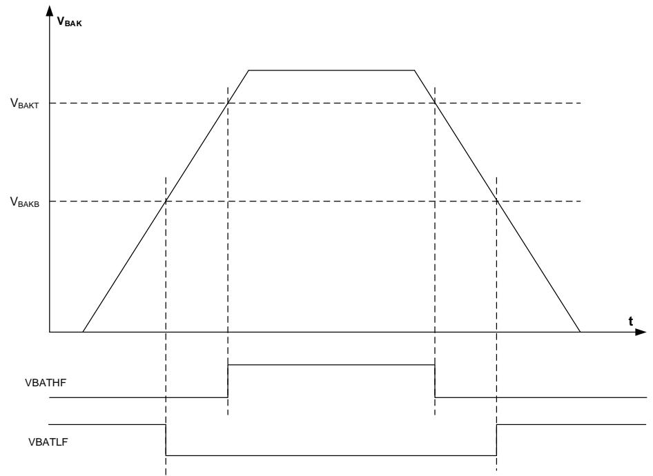

# 5.3.2. VDD / VDDA 电源域

$\mathsf { V } _ { \mathsf { D D } } / \mathsf { V } _ { \mathsf { D D A } }$ 域包括 $\mathsf { V } _ { \mathsf { D D } }$ 域和 $\mathsf { V } _ { \mathsf { D D A } }$ 域两部分。 $, \mathsf { V } _ { \mathsf { D D } }$ 域包括 HXTAL（高速外部晶体振荡器）、FWDGT（独立看门狗定时器）、BOR（欠压复位）、LPIRC4M（内部 4MHz RC 振荡器）、IRC64M（内部 64M RC 振荡器）、IRC32K（内部 32KHz RC 振荡器）、PVD（可编程电压检测器）、PLLs（锁相环）、VOVD（VCORE电压检测器）、VAVD（VDDA 电压检测器）和除 PC13、PC14 和PC15 之外的所有 PAD 等等。V 域包括 ADC / DAC（AD / DA 转换器）、LVD（低电压检测器）、TVD（温度电压检测器）、POR / PDR（上电 / 掉电复位）等等。

# VDD 域

为 $\mathsf { V } _ { \mathsf { C O R E } }$ 域供电的 LDO（电压调节器），其复位后保持使能。可以被配置为不同的工作状态：包括睡眠模式（VCORE全供电状态和低功耗状态）、深度睡眠模式和待机模式（关闭状态）。

POR / PDR（上电 / 掉电复位）电路检测 VDD并在电压低于特定阈值时产生电源复位信号复位除备份域之外的整个芯片。 5-3. / 显示了供电电压和电源复位信号之间的关系。VPOR表示上电复位的阈值电压，VPDR表示掉电复位的阈值电压。迟滞电压 $\Vdash _ { \tt V S t }$ 值可以参考芯片数据手册。

图5-3. 上电 / 掉电复位波形图

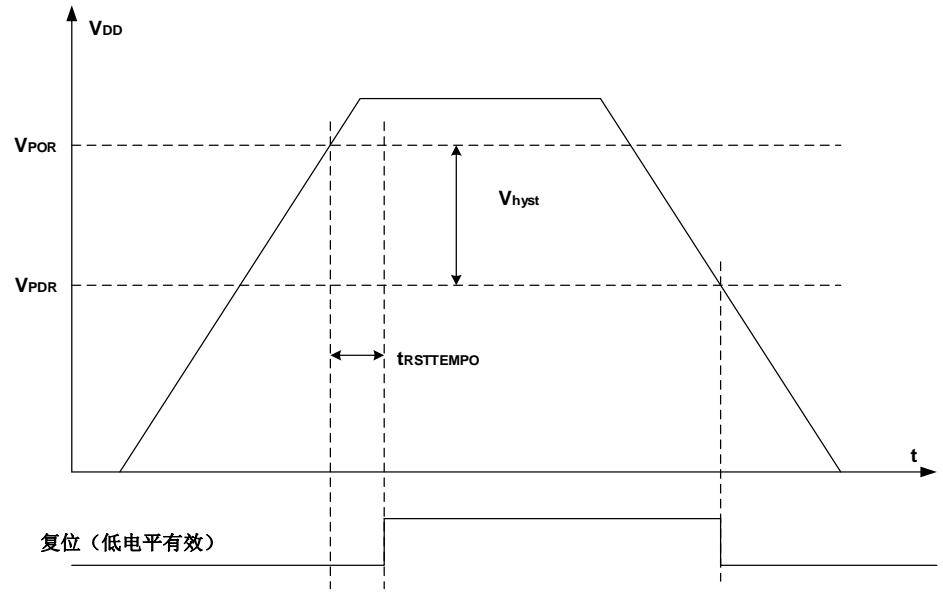

BOR 电路检测 VDD 并在电压低于选项字节的 BOR_TH 定义的阈值且该阈值不为 0b00（BOR_TH=0b00，BOR 功能关闭）时产生电源复位信号复位除备份域之外的整个芯片。不管选项字节 BOR_TH 的值是否为 0b00，POR / PDR（上电 / 掉电复位）电路会一直处于检测状态。 5-4. BOR 显示了供电电压和 BOR 复位信号之间的关系。VBOR表示 BOR 复位的阈值电压，该值在选项字节 BOR_TH 中定义。迟滞电压 Vhyst 值可以参考芯片数据手册。

图5-4. BOR波形图

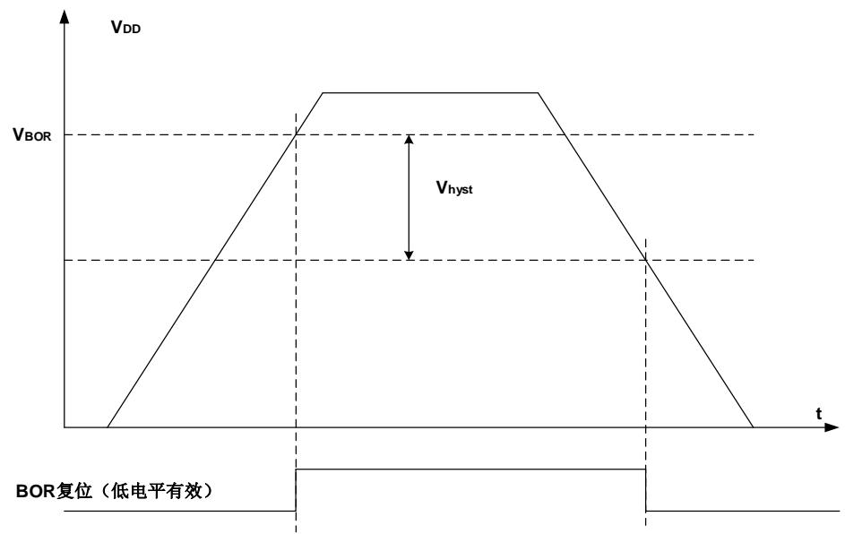

# VDDA 域

LVD 的功能是检测 V 供电电压是否低于低电压检测阈值，该阈值由电源控制寄存器 0（PMU_CTL0）中的 LVDT[2:0]位进行配置。LVD 通过 LVDEN 置位使能，位于电源控制状态寄存器（PMU_CS）中的 LVDF 位表示低电压事件是否出现，该事件连接至 EXTI 的第 16 线，用户可以通过配置 EXTI 的第 16 线产生相应的中断。 5-5. LVD 显示了 V 供电电压和 LVD 输出信号的关系。（LVD 中断信号依赖于 EXTI 第 16 线的上升或下降沿配置）。迟滞电压 $\Vdash _ { \tt N S t }$ 值可以参考芯片数据手册。

图 5-5. LVD 阈值波形图

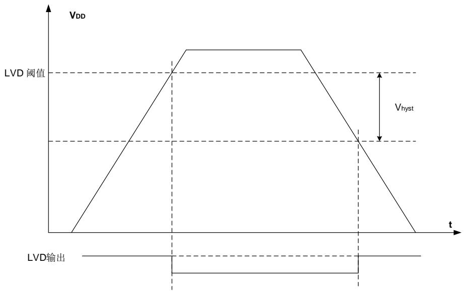

一般来说，数字电路由 VDD供电，而大多数的模拟电路由 VDDA供电。为了提高 ADC 和 DAC的转换精度，为 VDDA独立供电可使模拟电路达到更好的特性。为避免噪声，VDDA通过外部滤波电路连接至 VDD，相应的 $\mathsf { V } \mathsf { s s } _ { \mathsf { A } }$ 通过特定电路连接至 $\vee { \mathsf { s s } }$ 。否则，当 VDD和 VDDA不是同一个电源提供时，在上电和运行过程中 V 与 V 差值不超过 0.3V。

为提高 ADC 和 DAC 的精度，可将独立的外部参考电压连接至 ADC / DAC 引脚 VREFP /VREFN。根据不同的封装，VREFP可被连接至 VDDA引脚，或者外部参考电压，外部参考电压的范围请参考 20-2. ADC 和 21-1. DAC 。VREFN 须被连接至 VSSA引脚。VREFP 引脚仅存在于不小于 100-pin 的封装上，而在更少引脚的封装上不存在，因其内部已经连接至 VDDA，VREFN 内部则直接连接至 $\mathsf { V s s A }$ 。

# VDDA阈值电压监测

VDDA模拟电压检测器（VAVD）用于检测VDDA电源电压是否低于电源控制寄存器（PMU_CTL0）中 VAVDVC[1:0]位域选择的编程阈值。通过置位 VAVDEN 位能够使能 VAVD，PMU_CS 寄存器中的 VAVDF 位指示 VDDA高于或低于指定的 VAVD 阈值，如果 VAVDF 置位能够产生对应的事件，这个事件在内部连接到 EXTI 16。如果通过 EXTI 寄存器使能，可以产生一个中断。

5-6. VAVD 显示了 VAVD 门限与 VAVDF 之间的关系。\

图 5-6. VAVD 阈值监测波形图

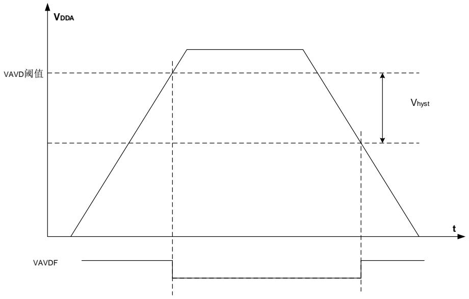

# 温度电压阈值监测

和备份域电压阈值监测类似，通过与温度高、低两个阈值水平比较可以来监测结温。PMU_CTL1寄存器中 TEMPH 和 TEMPL 标志指示设备温度是否高于或低于阈值。可以通过 PMU_CTL1寄存器中的 VBTMEN 位使能 / 关闭温度电压阈值监测。使能后，温度阈值监测将增加功耗。温度阈值监测可以用来触发执行温度控制任务的相关的程序。只有 PMU_CTL1 寄存器中的VBTMEN 位置位，温度阈值监测才有效。

TEMPH 和 TEMPL 唤醒中断可用于 RTC 触发信号

图 5-7. 温度阈值监测波形图

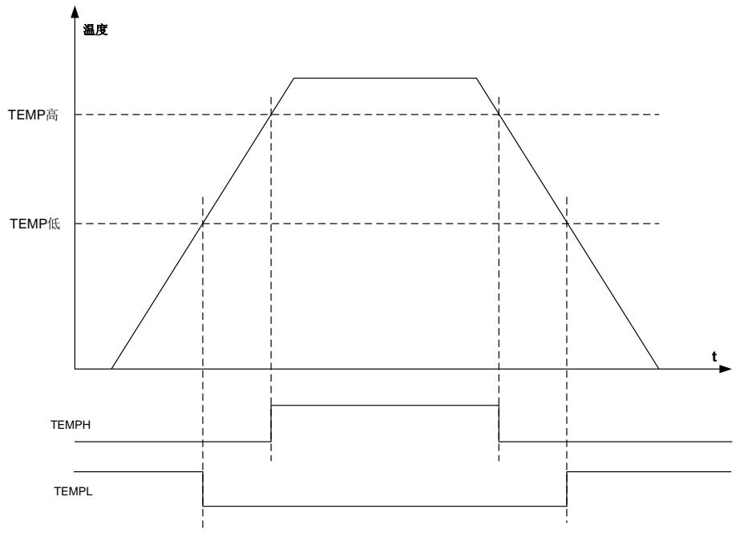

# 5.3.3. VCORE 电源域

主要功能包括 Cortex®-M7 内核逻辑、AHB / APB 外设、备份域和 VDD / VDDA 域的 APB 接口等。当 VCORE电压上电后，POR 将在 VCORE域中产生一个复位序列，复位完成后，如果要进入指定的省电模式，须先配置相关的控制位，之后一旦执行 WFI 或 WFE 指令，设备便进入该省电模式。

# VCORE电源域供电

使用 SMPS 降压稳压器和 LDO，可以设置 VCORE电源域的供电电源。不同配置可提供四种有效的 VCORE电源域供电模式。

# 无配置的供电模式（默认供电模式）

复位后，DVSEN 位为 0b1。此时，SMPS 降压稳压器打开，工作在正常模式下，工作电压为1.0V，SMPS 降压稳压器可以为 LDO 供电；LDOEN 位为 0b1，LDO 为开启状态，并为 VCORE电源域供电，供电电压由 LDOVS[2:0]位域控制；BYPASS 位为 0b0，VCORE 电源域不由 VCORE供电（V 供电是直接外部供电）。

# LDO 供电模式

进入该供电模式的配置方式为：DVSEN位为0b0，此时SMPS降压稳压器为关闭状态；LDOEN位为 0b1，LDO 为开启状态，并为 VCORE电源域供电，供电电压由 LDOVS[2:0]位域控制，LDO的工作模式与系统的低功耗模式一致；BYPASS 位为0b0，VCORE电源域不由VCORE供电（VCORE供电是直接外部供电）。 5-8. LDO VCORE 显示了这种供电方式。

图 5-8. LDO 供电 VCORE 电源域

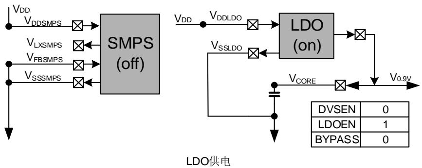

# SMPS 供电模式

进入该供电模式的配置方式为：DVSEN 位为 0b1，此时 SMPS 降压稳压器为开启状态，并为VCORE 电源域供电，供电电压由 LDOVS[2:0]位域控制，SMPS 的工作模式与系统的低功耗模式一致；LDOEN 位为 0b0，LDO 为关闭状态；BYPASS 位为 0b0，VCORE 电源域不由 VCORE供电（VCORE供电是直接外部供电）。 5-9. SMPS VCORE 显示了这种供电方式。

图 5-9. SMPS 供电 VCORE 电源域

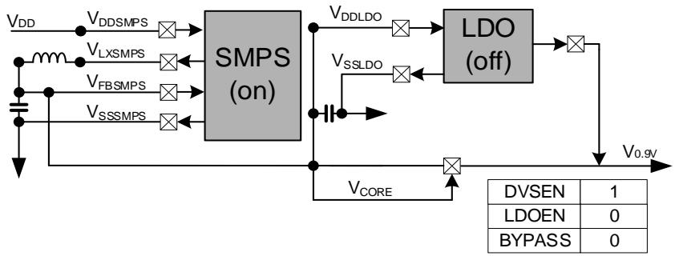

SMPS供电

# 旁路模式

进入该供电模式的配置方式为：DVSEN位为0b0，此时SMPS降压稳压器为关闭状态；LDOEN位为 0b0，LDO 为关闭状态；BYPASS 位为 0b1，VCORE 电源域由 VCORE 供电（VCORE 供电是直接外部供电）。 5-10. 显示了这种供电方式

图 5-10.旁路

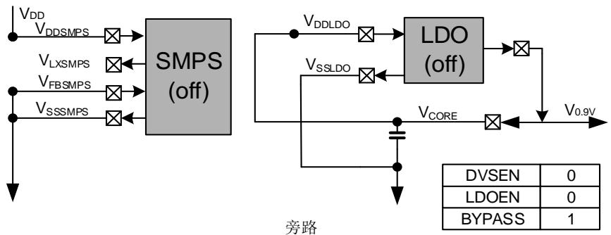

表 5-1 供电模式

<table><tr><td>模式</td><td>供电配置</td><td>DVSEN</td><td>LDOEN</td><td>LDOVS</td><td>BYPASS</td></tr><tr><td>0</td><td>无配置的供电模式(默认供电模式)</td><td>1</td><td>1</td><td>0b010</td><td>0</td></tr><tr><td>1</td><td>LDO 供电模式</td><td>0</td><td>1</td><td>0b000-101</td><td>0</td></tr><tr><td>2</td><td>SMPS 供电模式</td><td>1</td><td>0</td><td>0b000-0b101</td><td>0</td></tr><tr><td>6</td><td>旁路模式</td><td>0</td><td>0</td><td>x</td><td>1</td></tr></table>

注意：除上述有效组合外，其它 DVSEN、LDOEN、BYPASS 位或位值的配置组合均无效。VCORE电源域的电源状态在复位后保持不变（无配置的供电模式）。

注意：最大工作频率与供电电压有关，具体请参考数据手册。

注意：SMPS 供电不是在所有的设备上都支持，具体描述可参考数据手册。

注意：使用旁路模式时，具体请参考 AN225 GD32H7xx 电源旁路模式使用指南。

# VCORE电源域电源监测

芯片内部有一个 VCORE电源域电压监测器，当 VOVDEN 为 0b1，将使能 VCORE电源域电压检测器，一旦 VCORE电源域出现过压，VOVDF 将置位。

图 5-11. VOVD 波形

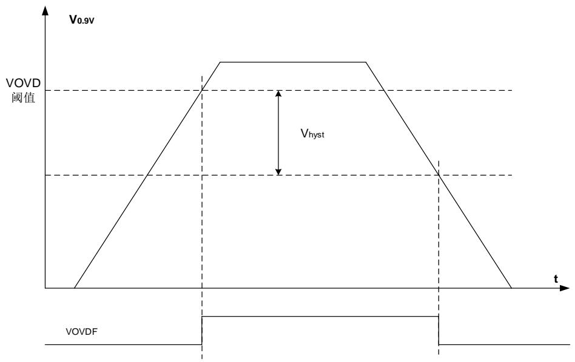

# 5.3.4. USB 电源

GD32H73x_75x系列USB内部集成了一个稳压器，用户可以选择使能该稳压器，将VDD50USB引脚连接5 V电源为USB模块提供电源，如 5-12. USB 所示；或旁路该稳压器，将VDD33USB引脚连接3.3 V电源为USB模块提供电源，如 5-13. USB所示。

图 5-12. USB 稳压器供电时连接示意图

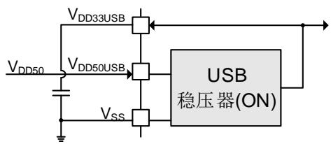

图 5-13. USB 稳压器旁路时连接示意图

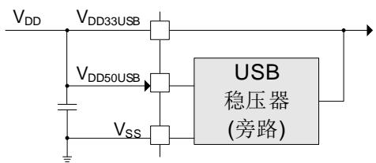

注意：当 $\mathsf { V } _ { \mathsf { D D } } \geq 3 \mathsf { V }$ 时，USB电源可使用USB稳压器供电模式或旁路模式；当 $\mathsf { V } _ { \mathsf { D D } } < 3 \mathsf { V }$ 时，USB电源只能使用USB稳压器供电模式。

# 5.3.5. 省电模式

系统复位或电源复位后，GD32H7xx MCU 处于全功能状态且电源域全部处于供电状态。实现较低的功耗的方法有三种：减慢系统时钟（HCLK，PCLK1 和 PCLK2），关闭未使用的外设的时钟或者通过 PMU_CTL3 寄存器的 LDOVS[2:0]位配置 LDO 的输出电压，LDOVS[2:0]只有在 PLL 未使能的时候才能配置。此外，三种省电模式可以实现更低的功耗，它们是睡眠模式，深度睡眠模式和待机模式。

在系统复位、上电复位或从待机模式唤醒产生复位后，MCU 进入普通运行模式，对所有时钟无影响，LDO 工作在 VCORE模式。

# 睡眠模式

睡眠模式与 Cortex®-M7 的 SLEEPING 模式相对应。在睡眠模式下，仅关闭 Cortex®-M7 的时钟。如需进入睡眠模式，只要清除 Cortex®-M7 系统控制寄存器中的 SLEEPDEEP 位，并执行一条 WFI 或一条 SEV指令与两条 WFE 指令。如果睡眠模式是通过执行 WFI 指令进入的，任何中断都可以唤醒系统。如果睡眠模式是通过执行 SEV和 WFE指令进入的，任何唤醒事件都可以唤醒系统（如果 SEVONPEND 为 1，任何中断都可以唤醒系统，请参考 Cortex®-M7 技术手册）。由于无需在进入或退出中断上消耗时间，该模式所需的唤醒时间最短。

根据 Cortex®-M7 中 SCR（系统控制寄存器）的 SLEEPONEXIT 位，有两种睡眠进入机制可选：

Sleep-now：如果SLEEPONEXIT位被清零，一旦APB系统复位或者执行WFI / WFE指令，MCU立即进入睡眠模式；

Sleep-on-exit：如果SLEEPONEXIT位被置位，当系统从最低优先级的中断处理程序离开后，MCU立即进入睡眠模式。

# 深度睡眠模式

深度睡眠模式与 Cortex®-M7 的 SLEEPDEEP 模式相对应。在深度睡眠模式下，VCORE域中的所有时钟全部关闭，LPIRC4M、IRC64M、HXTAL 及 PLLs 也全部被禁用。进入深度睡眠模式之前，先将 Cortex®-M7 系统控制寄存器的 SLEEPDEEP 位置 1，再将 PMU_CTL0 寄存器的LPMOD 位配置为 0b1，然后执行 WFI 或 WFE指令即可进入深度睡眠模式。如果睡眠模式是通过执行 WFI 指令进入的，任何来自 EXTI 的中断可以将系统从深度睡眠模式中唤醒。如果睡眠模式是通过执行 WFE 指令进入的，任何来自 EXTI 的事件可以将系统从深度睡眠模式中唤醒（如果 SEVONPEND 为 1，任何来自 EXTI 的中断都可以唤醒系统，请参考 Cortex®-M7 技术手册）。

注意：如果上电或者从待机模式唤醒，在进入深度睡眠模式之前需要等待一段时间。

# 待机模式

待机模式是基于 Cortex®-M7 的 SLEEPDEEP 模式实现的。在待机模式下，整个 VCORE域全部停止供电，LDO 关闭，同时包括 LPIRC4M、IRC64M、HXTAL 和 PLLs 也会被关闭。进入待机模式前，先将 Cortex®-M7 系统控制寄存器的 SLEEPDEEP 位置 1，再将 PMU_CTL0 寄存器的 LPMOD 位域配置为 0b1，再清除 PMU_CS 寄存器的 WUF 位，然后执行 WFI 或 WFE指令，系统进入待机模式，PMU_CS 寄存器的 STBF 位状态表示 MCU 是否已进入待机模式。

待机模式有五个唤醒源，包括来自 NRST 引脚的外部复位，RTC（闹钟和侵入检测），FWDGT复位，LCKMD，WKUP 引脚的上升沿。待机模式可以达到最低的功耗，但唤醒时间最长。另外，一旦进入待机模式，SRAM 和 VCORE电源域寄存器的内容都会丢失。退出待机模式时，会发生上电复位，复位之后 Cortex®-M7 将从 0x00000000 地址开始执行指令代码。

表5-2. 节电模式总结

<table><tr><td>模式</td><td>描述</td><td>LDO状态</td><td>进入指令</td><td>唤醒</td><td>唤醒后模式</td><td>唤醒延时</td></tr><tr><td>睡眠</td><td>仅关闭CPU时钟</td><td>LDO开启</td><td>SLEEPDEEP=0,在运行模式下执行WFI或SEV和WFE</td><td>若通过WFI进入,则任何中断均可唤醒;若通过SEV和WFE进入,则任何事件(或SEVONPEND=1时的中断)均可唤醒</td><td>普通运行模式</td><td>-</td></tr><tr><td>深度睡眠</td><td>1、关闭VCORE电源域的所有时钟2、关闭LPIRC4M、IRC64M、HXTAL和PLLs</td><td>LDO开启</td><td>SLEEPDEEP=1,LPMOD=0,执行WFI或WFE</td><td>若通过WFI进入,来自EXTI的任何中断可唤醒;若通过WFE进入,来自EXTI的任何事件(或SEVONPEND=1时的中断)可唤醒</td><td>普通运行模式</td><td>LPIRC4M/IRC64M(由DSPWUSSEL确认)唤醒时间+Flash唤醒时间</td></tr><tr><td>待机</td><td>1、关闭VCORE电源域的所有时钟2、关闭LPIRC4M、IRC64M、HXTAL和PLLs</td><td>LDO关闭</td><td>SLEEPDEEP=1,LPMOD=1,执行WFI或WFE</td><td>1、NRST引脚2、WKUP引脚3、FWDGT复位4、RTC(闹钟和侵入检测)5、LCKMD</td><td>普通运行模式</td><td>IRC64M唤醒时间+LDO唤醒时间+Flash唤醒时间</td></tr><tr><td>BKP only</td><td><eq>V_{DD}</eq>域/<eq>V_{CORE}</eq>域全部掉电</td><td>LDO关闭</td><td><eq>V_{DD}</eq>关闭</td><td><eq>V_{DD}</eq>开启</td><td>普通运行模式</td><td><eq>V_{DD}</eq>上电序列</td></tr></table>

注意：在待机模式下，除了 NRST 引脚，配置为 RTC 功能的 PC13，用作 LXTAL 晶振引脚的PC14和 PC15，使能的 WKUPx 引脚，其他所有 I/O 都处于高阻态。


