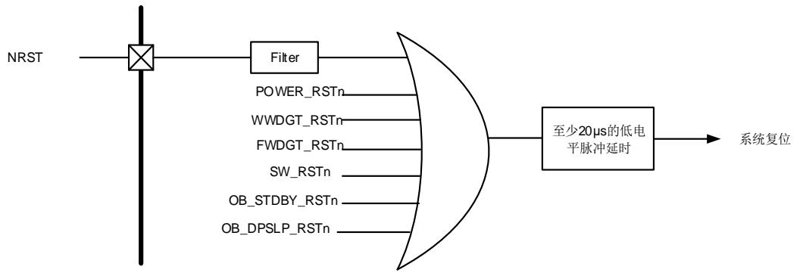
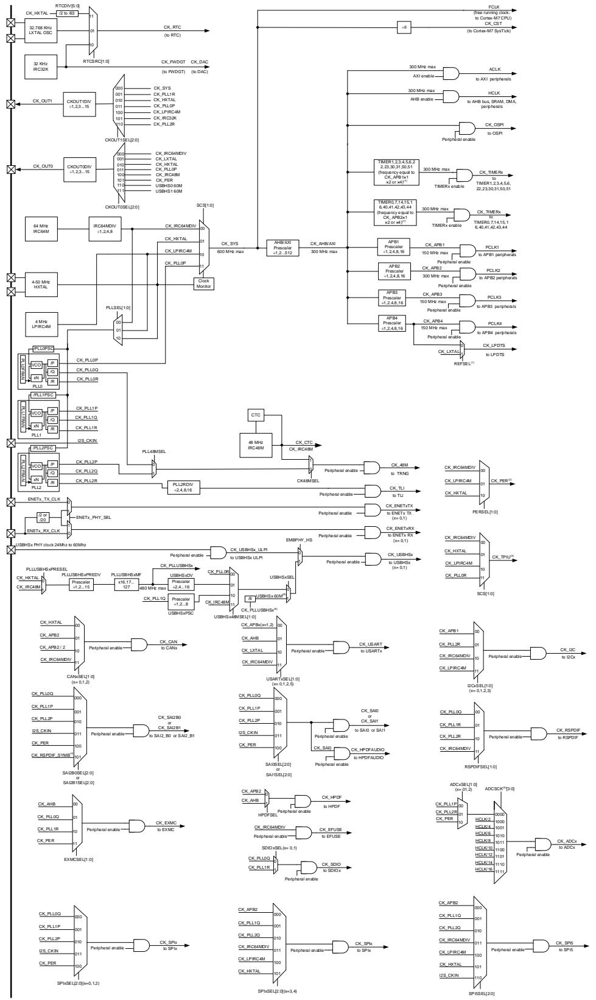
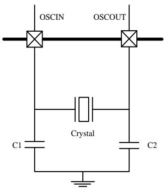
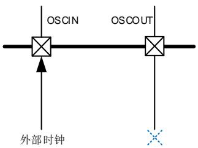

# 6. 复位和时钟单元（RCU）

# 6.1. 复位控制单元（RCTL）

# 6.1.1. 简介

GD32H7xx复位控制包括三种控制方式：电源复位、系统复位和备份域复位。电源复位又称为冷复位，其复位除了备份域的所有系统。系统复位将复位除了SW-DP控制器和备份域之外的其余部分，包括处理器内核和外设IP。备份域复位将复位备份区域。复位能够被外部信号、内部事件和复位发生器触发。后续章节将介绍关于这些复位的详细信息。

# 6.1.2. 功能说明

# 电源复位

当以下事件中之一发生时，产生电源复位：1、上电/掉电复位（POR / PDR 复位）2、欠压复位（BOR复位）3、从待机模式中返回后由内部复位发生器产生。电源复位复位所有的寄存器除了备份域。电源复位为低电平有效，当内部LDO电源基准准备好提供0.9V电压时，电源复位电平将变为无效。复位入口向量被固定在存储器映射的地址0x0000_0004。

# 系统复位

当发生以下任一事件时，产生一个系统复位：

电源复位（POWER_RSTn）；

外部引脚复位（NRST）；

窗口看门狗计数终止（WWDGT_RSTn）；

独立看门狗计数终止（FWDGT_RSTn）；

Cortex®-M7的中断应用和复位控制寄存器中的SYSRESETREQ位置‘1’（SW_RSTn）；

用户选择字节寄存器nRST_STDBY位设置为0，并且进入待机模式时将产生复位（OB_STDBY_RSTn）；

用户选择字节寄存器nRST_DPSLP设置为0，并且进入深度睡眠模式时将产生复位（OB_DPSLP_RSTn）。

系统复位将复位除了SW-DP控制器和备份域之外的其余部分，包括处理器内核和外设IP。

系统复位脉冲发生器保证每一个复位源（外部或内部）都能有至少20μs的低电平脉冲延时。


图 6-1. 系统复位电路





# 备份域复位

当以下事件之一发生时，产生备份域复位：1、设置备份域控制寄存器中的BKPRST位为‘1’；2、备份域电源上电复位（在VDD和VBAT两者都掉电的前提下，VDD或VBAT上电）。

注意：当备份域复位时，BKPSRAM域不会复位。

# 6.2. 时钟控制单元（CCTL）

# 6.2.1. 简介

时钟控制单元提供了一系列频率的时钟功能，包括一个内部64M RC振荡器时钟（IRC64M）、一个内部48M RC 振荡器时钟（IRC48M）、一个外部高速晶体振荡器时钟（HXTAL）、一个内部32K RC振荡器时钟（IRC32K）、一个外部低速晶体振荡器时钟（LXTAL）、一个低功耗内部4M RC振荡器时钟（LPIRC4M）、五个锁相环（PLL）、一个HXTAL时钟监视器、一个LXTAL时钟监视器、时钟预分频器、时钟多路复用器和时钟门控电路。

AXI、AHB、APB和Cortex®-M7时钟都源自系统时钟（CK_SYS），系统时钟的时钟源可以选择IRC64M、HXTAL、LPIRC4M或PLL0。系统时钟的最大运行时钟频率可以达到600MHz。


图 6-2. 时钟树





（1）REFSEL为LPDTS参考时钟选择位，可选择CK_PCLK4或CK_LXTAL参考 40-1. LPDTS 。

（2）CK_PER为外设时钟，该时钟可以为CK_IRC64MDIV，CK_LPIRC4M或CK_HXTAL。

（3）CK_TPIU为跟踪端口接口单元（TPIU）时钟，该时钟可以为CK_IRC64MDIV, CK_LPIRC4M，CK_HXTAL或CK_PLL0R。

（4）CK_RSPDIF_SYMB为RSPDIF符号时钟，参考 33-1. RSPDIF 。

（5）ADCSCK为ADC同步时钟选择位，参考 ADC_SYNCCTL 。

（6）USBHSx 60M为USBHSx内部PHY 60M输入时钟源，参考 PHY。 当选择USBHSx 60M作为USBHSx时钟时，CK_PLLUSBHSx应配置为480Mhz。

（7）TIMER时钟频率，参考RCU_CFG1寄存器中的TIMERSEL位域。

预分频器可以配置 AXI、AHB、APB4、APB3、APB2 和 APB1 域的时钟频率。AXI / AHB 和APB4 / APB3 / APB2 / APB1 域的最高时率分别为 300 MHz / 300 MHz / 150 MHz / 150 MHz/ 300 MHz / 150 MHz。RCU 通过系统时钟（CK_SYS）8 分频后作为 Cortex 系统定时器（SysTick）的外部时钟。通过对 SysTick 控制和状态寄存器的设置，可选择上述时钟或系统时钟（CK_SYS）时钟作为 SysTick 时钟。

ADC时钟由PLL1P、PLL2R、CK_PER或由AHB时钟经2、4、6、8、10、12、14、16分频获得。

TIMER时钟由AHB时钟分频获得，它的频率可以等于CK_APBx、CK_APBx的两倍或CK_APBx的四倍。详细信息请参考RCU_CFG1寄存器的TIMERSEL位。

TRNG的 时 钟 由CK_48M时 钟 提 供 。 通 过 配 置RCU_ADDCTL0寄 存 器 的CK48MSEL及PLL48MSEL位可以选择PLL0Q时钟、PLL2P时钟或IRC48M时钟作为CK48M的时钟源。TRNG支持时钟动态切换。

USBHS ULPI 的 时 钟 可 以 选 择 由 外 部ULPI PHY 时 钟 或 RCU_USBCLKCTL寄 存 器 中USBxHSSEL位定义的时钟提供。

CTC时钟由IRC48M时钟提供，通过CTC单元，可以实现IRC48M时钟精度的自动调整。

通过设置时钟配置寄存器RCU_CFG1的USARTxSEL位，USART时钟可以选择由CK_APBx、CK_AHB、CK_LXTAL或CK_IRC64MDIV时钟提供。USART支持时钟动态切换。

通过设置时钟配置寄存器RCU_CFG0或RCU_CFG3的I2CxSEL位，I2C时钟可以选择由CK_APB1、CK_PLL2R、CK_IRC64MDIV或CK_LPIRC4M时钟提供。I2C支持时钟动态切换。

通过设置时钟配置寄存器RCU_CFG5的SPIxSEL（x = 0，1，2）位，SPI0（I2S0）、SPI1（I2S1）和SPI2（I2S2）时钟可以选择由CK_PLL0Q，CK_PLL1P，CK_PLL2P，I2S_CKIN或CK_PER时钟提供。SPI0（I2S0）、SPI1（I2S1）和SPI2（I2S2）支持时钟动态切换。

通过设置时钟配置寄存器RCU_CFG5的SPIxSEL（x = 3，4）位，SPI3和SPI4时钟可以选择由CK_APB2，CK_PLL1Q，CK_PLL2Q，CK_IRC64MDIV，CK_LPIRC4M或CK_HXTAL时钟提供。SPI3和SPI4支持时钟动态切换。

通过设置时钟配置寄存器RCU_CFG5的SPI5SEL位，SPI5（I2S5）时钟可以选择由CK_APB2，CK_PLL1Q，CK_PLL2Q，CK_IRC64MDIV，CK_LPIRC4M，CK_HXTAL或I2S_CKIN时钟提供。SPI5支持时钟动态切换。

OSPI时钟由CK_AHB时钟提供。

LPDTS时钟可以选择由CK_APB4或CK_LXTAL时钟提供。

通过设置时钟配置寄存器RCU_CFG1的CANxSEL位，CAN时钟可以选择由CK_HXTAL、CK_APB2、CK_APB2 / 2或CK_IRC64MDIV时钟提供。CAN支持时钟动态切换。

通过设置时钟配置寄存器RCU_CFG2的RSPDIFSEL位，RSPDIF时钟可以选择由CK_PLL0Q、

CK_PLL1R、CK_PLL2R或CK_IRC64MDIV时钟提供。RSPDIF支持时钟动态切换。

通过设置时钟配置寄存器RCU_CFG2的SAI2B0SEL或SAI2B1SEL位，SAI2时钟可以选择由CK_PLL0Q、CK_PLL1P、CK_PLL2P、I2S_CKIN、CK_PER或CK_RSPDIF_SYMB时钟提供。SAI2支持时钟动态切换。

通过设置时钟配置寄存器RCU_CFG2的SAI0SEL或SAI1SEL位，SAI0和SAI1时钟可以选择由CK_PLL0Q、CK_PLL1P、CK_PLL2P、I2S_CKIN或CK_PER时钟提供。SAI0和SAI1支持时钟动态切换。

通过设置时钟配置寄存器RCU_CFG1的HPDFSEL位，HPDF时钟可以选择由CK_AHB或CK_APB2时钟提供。HPDF支持时钟动态切换。

通 过 设 置 时 钟 配 置 寄 存 器RCU_CFG2的SAI0SEL位 ，HPDF_AUDIO时 钟 可 以 选 择 由CK_PLL0Q，CK_PLL1P，CK_PLL2P，I2S_CKIN或CK_PER时钟提供。

通过设置时钟配置寄存器RCU_CFG4的EXMCSEL位，EXMC时钟可以选择由CK_AHB，CK_PLL0Q，CK_PLL1R或CK_PER时钟提供。EXMC支持时钟动态切换。

通过设置时钟配置寄存器RCU_CFG4或RCU_CFG4的SDIOxSEL位，SDIO时钟可以选择由CK_PLL0Q或CK_PLL1R时钟提供。SDIO支持时钟动态切换。

EFUSE时钟由CK_IRC64MDIV时钟提供。

通过设置时钟配置寄存器RCU_CFG1的PLL2RDIV位，TLI时钟可以选择由PLL2R时钟的2、4、8、16分频提供。

通过配置SYSCFG_PMCFG寄存器的ENET0_PHY_SEL或ENET1_PHY_SEL位，以太网TX/RX时钟可以选择由外部引脚（ENETx_TX_CLK / ENETx_RX_CLK）输入时钟提供。

通过配置RCU_BDCTL寄存器的RTCSRC位，RTC时钟可以选择由LXTAL时钟、IRC32K时钟或HXTAL时钟的2-63（由RCU_CFG0寄存器的RTCDIV位域值决定）分频提供。RTC时钟选择HXTAL时钟的分频作为时钟源后，当0.9V内核电压域掉电时，时钟将停止。RTC时钟选择IRC32K时钟作为时钟源后，当VDD掉电时，时钟将停止。RTC时钟选择LXTAL时钟作为时钟源后，当VDD和VBAT都掉电时，时钟将停止。

当FWDG启动时，FWDG时钟被强制选择由IRC32K时钟作为时钟源。

# 6.2.2. 主要特征

4到50 MHz外部高速晶体振荡器（HXTAL）；

内部64 MHz RC振荡器（IRC64M）；

内部48 MHz RC振荡器（IRC48M）；

32,768 Hz外部低速晶体振荡器 （LXTAL）；

内部32 KHz RC振荡器（IRC32K）；

低功耗内部4M RC振荡器（LPIRC4M）；

PLL时钟源可选HXTAL、LPIRC4M或IRC64M；

PLLs支持整数和小数倍频因子；

PLLs小数倍频因子可在运行时修改；

外设时钟支持动态切换；

HXTAL时钟监视器；

LXTAL时钟监视器。

# 6.2.3. 功能说明

# 外部高速晶体振荡器时钟（HXTAL）

4到50MHz的外部高速晶体振荡器可为系统时钟提供更为精确时钟源。带有特定频率的晶体必须与靠近两个HXTAL的引脚连接。和晶体连接的外部电阻和电容必须根据所选择的振荡器来调整。


图 6-3. HXTAL 时钟源





HXTAL晶体振荡器可以通过设置控制寄存器RCU_CTL的HXTALEN位来启动或关闭，在控制寄存器RCU_CTL中的HXTALSTB位用来指示外部高速振荡器是否已稳定。在启动时，直到这一位被硬件置‘1’，时钟才被释放出来。这个特定的延迟时间被称为振荡器的启动时间。当HXTAL时钟稳定后，如果在中断寄存器RCU_INT中的相应中断使能位HXTALSTBIE位被置‘1’，将会产生相应中断。此时，HXTAL时钟可以被直接用作系统时钟源或者PLL输入时钟。

将控制寄存器RCU_CTL的HXTALBPS和HXTALEN位置‘1’可以设置外部时钟旁路模式。旁路输入时，信号接至OSCIN，OSCOUT保持悬空状态，如图 6-4. HXTAL 。此时，CK_HXTAL等于驱动OSCIN管脚的外部时钟。


图 6-4. 旁路模式下 HXTAL 时钟源





# 内部 64M RC 振荡器时钟（IRC64M）

内部64MHz RC振荡器时钟，简称IRC64M时钟，拥有64MHz的固定频率，设备上电后CPU默认选择其作为系统时钟源。通过配置RCU_ADDCTL1寄存器中的IRC64MDIV[1:0]位域，CK_IRC64MDIV可提供8、16、32或64MHz时钟输出。IRC64M RC振荡器能够在不需要任何外部器件的条件下为用户提供更低成本类型的时钟源。IRC64M RC振荡器可以通过设置控制寄存器（RCU_CTL）中的IRC64MEN位被启动和关闭。控制寄存器RCU_CTL中的IRC64MSTB位用来指示IRC64M内部RC振荡器是否稳定。IRC64M振荡器的启动时间比HXTAL晶体振荡器要更短。如果中断寄存器RCU_INT中的相应中断使能位IRC64MSTBIE被置‘1’，在IRC64M稳定以后，将产生一个中断。IRC64M时钟也可用作系统时钟源或PLL输入时钟。

工厂会校准IRC64M时钟频率的精度，但是它的精度仍然比HXTAL时钟要差。用户可以根据需求、环境条件和成本决定选择哪个时钟作为系统时钟源。

如果HXTAL或者PLL0P被选择为系统时钟源，为了最大程度减小系统从深度睡眠模式恢复的时间，当系统从深度睡眠模式初始唤醒时，硬件会强制CK_IRC64MDIV或CK_LPIRC4M时钟作为系统或内核时钟。

# 内部 48M RC 振荡器时钟（IRC48M）

内部48MHz RC振荡器时钟，简称IRC48M时钟，拥有48MHz的固定频率，当使用USBHS /TRNG模块时，IRC48M振荡器在不需要任何外部器件的条件下为用户提供了一种成本更低的时钟源选择。IRC48M RC振荡器可以通过设置RCU_ADDCTL0寄存器中的IRC48MEN位被启动和关闭。RCU_ADDCTL0寄存器中的IRC48MSTB位用来指示内部48MHz RC振荡器是否稳定。如果RCU_ADDINT寄存器中的相应中断使能位IRC48MSTBIE被置‘1’，在IRC48M稳定以后，将产生一个中断。IRC48M时钟可作为USBHS / TRNG模块时钟。

工厂会校准IRC48M时钟频率的精度，但是它的精度仍然不够精准。因为USBHS模块需要的时钟频率必须满足48MHz±1%。CTC单元提供了一种硬件自动执行动态调整的功能将IRC48M时钟调整到需要的频率。

# 外部低速晶体振荡器时钟（LXTAL）

LXTAL是一个频率为32.768kHz的外部低速晶体或陶瓷谐振器。它为实时时钟电路提供一个低功耗且高精准的时钟源。LXTAL振荡器可以通过设置备份域控制寄存器（RCU_BDCTL）中的LXTALEN位被启动和关闭。备份域控制寄存器RCU_BDCTL中的LXTALSTB位用来指示LXTAL时钟是否稳定。如果中断寄存器RCU_INT中的相应中断使能位LXTALSTBIE被置‘1’，在LXTAL稳定以后，将产生一个中断。

将备份域控制寄存器RCU_BDCTL的LXTALBPS和LXTALEN位置‘1’可以选择外部时钟旁路模式。CK_LXTAL与连到OSC32IN脚上外部时钟信号一致。

# 内部 32K RC 振荡器时钟（IRC32K）

IRC32K内部RC振荡器时钟担当一个低功耗时钟源的角色，它的时钟频率大约32 kHz，为独立看门狗和实时时钟电路提供时钟。IRC32K提供低成本的时钟源，因为不需要外部器件。IRC32KRC振荡器可以通过设置复位源/时钟寄存器RCU_RSTSCK中的IRC32KEN位被启动和关闭。复位源/时钟寄存器RCU_RSTSCK中的IRC32KSTB位用来指示IRC32K时钟是否已稳定。如果复位源/时钟寄存器RCU_RSTSCK中的相应中断使能位IRC32KSTBIE被置‘1’，在IRC32K稳定以后，将产生一个中断。

# 低功耗内部 4M RC 振荡器时钟（LPIRC4M）

低功耗内部4MHz RC振荡器时钟，简称LPIRC4M时钟，拥有4MHz的固定频率，可以用作系统输入时钟或PLL输入时钟。LPIRC4M RC振荡器能够在不需要任何外部器件的条件下为用户提供更低成本类型的时钟源。LPIRC4M RC振 荡 器 可 以 通 过 设 置 附 加 控 制 寄 存 器1（ RCU_ADDCTL1 ） 中 的 LPIRC4MEN 位 被 启 动 和 关 闭 。 中 断 寄 存 器 RCU_INT 中 的LPIRC4MSTB位用来指示内部LPIRC4M RC振荡器是否稳定。如果中断寄存器RCU_INT中的相应中断使能位LPIRC4MSTBIE被置‘1’，在LPIRC4M稳定以后，将产生一个中断。

工厂会校准LPIRC4M时钟频率的精度。复位后，校准值将会被加载到RCU_ADDCTL1寄存器中的LPIRC4MCALIB位域。

如果HXTAL或者PLL0P被选择为系统时钟源，为了最大程度减小系统从深度睡眠模式恢复的时间，当系统从深度睡眠模式初始唤醒时，硬件会强制CK_IRC64MDIV或CK_LPIRC4M时钟作为系统或内核时钟。

# 锁相环（PLL）

存在五个内部锁相环，PLL0、PLL1、PLL2、PLLUSBHS0和PLLUSBHS1。PLL0、PLL1和PLL2支持整数和小数倍频因子且小数倍频因子可在运行时修改。另外，PLL0、PLL1和PLL2可分别产生P / Q / R时钟输出。PLL0P时钟可作为系统时钟（不超过600MHz）。

对于每一个PLL，当RCU_PLLxFRA寄存器中的PLLxFRAEN位为‘1’且PLLxFRAN值不为‘0时，PLLx处在小数模式，例如：

$$
\mathrm{CK} _ {-} \text {PLL0VCO} = \mathrm{CK} _ {-} \text {PLL0VCOSRC} ^ {*} \left(\mathrm{PLL0N} + \frac {\mathrm{PLL0FRAN}}{2 ^ {1 3}}\right) \tag {6-1}
$$

否则，PLLx处于整数模式，例如：

$$
\mathrm {CK\_PLL0VCO = CK\_PLL0VCOSRC*PLL0N} \tag {6-2}
$$

PLL0可以通过设置RCU_CTL寄存器中的PLL0EN位被启动和关闭。RCU_CTL寄存器中的PLL0STB位用来指示PLL0时钟是否稳定。如果RCU_INT寄存器中的相应中断使能位PLL0STBIE被置‘1’，在PLL0稳定以后，将产生一个中断。

PLL1可以通过设置RCU_CTL寄存器中的PLL1EN位被启动和关闭。RCU_CTL寄存器中的PLL1STB位用来指示PLL1时钟是否稳定。如果RCU_INT寄存器中的相应中断使能位PLL1STBIE被置‘1’，在PLL1稳定以后，将产生一个中断。

PLL2可以通过设置RCU_CTL寄存器中的PLL2EN位被启动和关闭。RCU_CTL寄存器中的PLL2STB位用来指示PLL2时钟是否稳定。如果RCU_INT寄存器中的相应中断使能位PLL2STBIE被置‘1’，在PLL2稳定以后，将产生一个中断。

PLLUSBHS0可以通过设置RCU_ADDCTL1寄存器中的PLLUSBHS0EN位被启动和关闭。RCU_ADDCTL1寄存器中的PLLUSBHS0STB位用来指示PLLUSBHS0时钟是否稳定。如果RCU_ADDINT寄存器中的相应中断使能位PLLUSBHS0STBIE被置‘1’，在PLLUSBHS0稳定以后，将产生一个中断。

PLLUSBHS1可以通过设置RCU_ADDCTL1寄存器中的PLLUSBHS1EN位被启动和关闭。RCU_ADDCTL1寄存器中的PLLUSBHS1STB位用来指示PLLUSBHS1时钟是否稳定。如果RCU_ADDINT寄存器中的相应中断使能位PLLUSBHS1STBIE被置‘1’，在PLLUSBHS1稳定以后，将产生一个中断。

当进入Deepsleep/Standby模式或者HXTAL监视器检测到时钟阻塞时（HXTAL作为锁相环的输入时钟），这三路PLL将被关闭。

# 外设时钟动态切换

如果外设有两个以上的时钟源选择，则该外设可以在运行时动态地切换至另一个开启的时钟源。否则，该外设时钟将无法切换。只有 TRNG / USART / I2C / SPI / RSPDIF / SAI / SDIO / EXMC/ CAN / HPDF 外设支持时钟动态切换。

# 系统时钟（CK_SYS）选择

系统复位后，IRC64M时钟默认作为CK_SYS的时钟源，改变配置寄存器0，RCU_CFG0中的系统时钟变换位SCS可以切换系统时钟源为HXTAL、LPIRC4M或CK_PLL0P。当SCS的值被改变，系统时钟将使用原来的时钟源继续运行直到转换的目标时钟源稳定。当一个时钟源被直接或通过PLL0P间接作为系统时钟时，它将不能被停止。

# HXTAL 时钟监视器（CKM）

设置控制寄存器RCU_CTL中的HXTAL时钟监视使能位CKMEN，HXTAL可以使能时钟监视功能。该功能必须在HXTAL启动延迟完毕后使能，在HXTAL停止后禁止。一旦监测到HXTAL故障，HXTAL将自动被禁止，中断寄存器RCU_INT中的HXTAL时钟阻塞中断标志位CKMIF将被置‘1’，产生HXTAL故障事件。这个故障引发的中断和Cortex®-M7的不可屏蔽中断NMI相连。如果HXTAL被选作系统或PLL0的时钟源，HXTAL故障将促使选择IRC64M为系统时钟源且PLL0将被自动禁止。如果HXTAL被选作PLLs的时钟源，HXTAL故障将促使该PLL被自动禁止。

# LXTAL 时钟监视器（LCKM）

设置时钟控制寄存器RCU_BDCTL中的LXTAL时钟监视使能位LCKMEN，LXTAL可以使能时钟监视功能。该功能必须在LXTAL启动延迟完毕后使能。

LXTAL上的时钟监视器在除V 以外的所有模式下工作。如果在外部32 kHz振荡器上检测到故障，可以向CPU发送中断。

然后，软件必须禁用LCKMEN位，停止有缺陷的32 kHz振荡器，并更改RTC时钟源，或采取任何必要的措施来保护应用程序。

当LCKMEN启用时，一个4位加一个计数器将在IRC32K域工作。如果LXTAL时钟卡在0/1错误或减慢约20KHz，计数器将溢出。将发现LXTAL时钟故障。一旦监测到LXTAL故障，中断寄存器RCU_INT中的LXTAL时钟阻塞中断标志位LCKMIF将被置‘1’，产生LXTAL故障事件。

# 时钟输出功能

时钟输出功能输出从32kHz到600MHz的时钟。通过设置时钟配置寄存器0（RCU_CFG2）中的CK_OUT0时钟源选择位域CKOUT0SEL能够选择不同的时钟信号。相应的GPIO引脚应该被配置成备用功能I/O（AFIO）模式来输出选择的时钟信号。CK_OUT1时钟输出源选择通过设置时钟配置寄存器RCU_CFG2中的CKOUT1SEL位域实现。


表 6-1. 时钟输出 0 的时钟源选择


<table><tr><td>时钟输出 0 的时钟源选择位域</td><td>时钟源</td></tr><tr><td>000</td><td>CK_IRC64MDIV</td></tr><tr><td>001</td><td>CK_LXTAL</td></tr><tr><td>010</td><td>CK_HXTAL</td></tr><tr><td>011</td><td>CK_PLL0P</td></tr><tr><td>100</td><td>CK_IRC48M</td></tr><tr><td>101</td><td>CK_PER</td></tr><tr><td>110</td><td>USBHS0 60M</td></tr><tr><td>111</td><td>USBHS1 60M</td></tr></table>


表 6-2. 时钟输出 1 的时钟源选择


<table><tr><td>时钟输出1的时钟源选择位域</td><td>时钟源</td></tr><tr><td>000</td><td>CK_SYS</td></tr><tr><td>001</td><td>CK_PLL1R</td></tr><tr><td>010</td><td>CK_HXTAL</td></tr><tr><td>011</td><td>CK_PLL0P</td></tr><tr><td>100</td><td>CK_LPIRC4M</td></tr><tr><td>101</td><td>CK_IRC32K</td></tr><tr><td>110</td><td>CK_PLL2R</td></tr></table>

通过配置RCU_CFG2寄存器的CKOUT0DIV位域，可以将CK_OUT0输出时钟的频率按比例分频，进而降低CK_OUT0的输出频率。

通过配置RCU_CFG0寄存器的CKOUT1DIV位域，可以将CK_OUT1输出时钟的频率按比例分频，进而降低CK_OUT1的输出频率。

# RTC时钟测量

RTC时钟的三种时钟源：LXTAL、IRC32K和HXTAL时钟的2-63分频（通过配置RCU_CFG0寄存器的RTCDIV位域），可以通过TIMER模块测量频率。用户可以根据计算得到的时钟频率调整RTC和独立看门狗计数器。详细信息请参考SYSCFG_TIMERCISEL6寄存器的TIMER15_CI0_SEL位与TIMER16_CI0_SEL位。

# 1：使能LXTAL时钟监视器

通过软件设置，启用 LXTAL（32 kHz 振荡器）上的时钟安全系统。LXTALEN 必须在 LXTAL 已启用（LXTALEN位已启用）和就绪（LXTALSTB 标志由硬件设置)。

注意：一旦该位被置位，该位可以通过备份域复位清除或者在检测到 LXTAL 时钟故障后（LCKMD = 1）通过复位 LCKMEN 清除。

# 4:3 LXTALDRI[1:0] LXTAL 驱动能力

由软件置位或复位。当备份域复位时将复位该值

00：弱驱动能力

01：中低驱动能力

10：中高驱动能力

11：强驱动能力

注意：LXTALDRI 位在旁路模式下无效

# 2 LXTALBPS LXTAL 旁路模式使能

由软件置位或复位

0：禁止 LXTAL 旁路模式

1：使能 LXTAL 旁路模式

# 1 LXTALSTB 低速晶体振荡器稳定标志位

硬件置‘1’来指示LXTAL振荡器时钟是否稳定待用

0：LXTAL 未稳定

1：LXTAL 已稳定

# 0 LXTALEN LXTAL 时钟使能

由软件置位或复位

0：关闭 LXTAL 时钟

1：使能 LXTAL 时钟

# 6.3.30. 复位源/时钟寄存器（RCU_RSTSCK）

地址偏移：0x74

复位值：0x0E00 0000, 所有复位标志位仅在电源复位时被清零，RSTFC/IRC32KEN在系统复位时被清零。

该寄存器可以按字节（8位）、半字（16位）或字（32位）访问。

<table><tr><td>31</td><td>30</td><td>29</td><td>28</td><td>27</td><td>26</td><td>25</td><td>24</td><td>23</td><td>22</td><td>21</td><td>20</td><td>19</td><td>18</td><td>17</td><td>16</td></tr><tr><td>LPRSTF</td><td>WWDGTRSTF</td><td>FWDGTRSTF</td><td>SWRSTF</td><td>PORRSTF</td><td>EPRSTF</td><td>BORRSTF</td><td>RSTFC</td><td colspan="8">保留</td></tr><tr><td>r</td><td>r</td><td>r</td><td>r</td><td>r</td><td>r</td><td>r</td><td>rw</td><td></td><td></td><td></td><td></td><td></td><td></td><td></td><td></td></tr><tr><td>15</td><td>14</td><td>13</td><td>12</td><td>11</td><td>10</td><td>9</td><td>8</td><td>7</td><td>6</td><td>5</td><td>4</td><td>3</td><td>2</td><td>1</td><td>0</td></tr><tr><td colspan="14">保留</td><td>IRC32KSTB</td><td>IRC32KEN</td></tr></table>

rw 

# 位/位域 名称 描述

<table><tr><td>31</td><td>LPRSTF</td><td>低功耗复位标志位深度睡眠/待机复位发生时由硬件置位向RSTFC位写1来清除该位0:无低功耗管理复位发生1:发生低功耗管理复位</td></tr><tr><td>30</td><td>WWDGTRSTF</td><td>窗口看门狗定时器复位标志位窗口看门狗定时器复位发生时由硬件置1向RSTFC位写1来清除该位0:无窗口看门狗复位发生1:发生窗口看门狗复位</td></tr><tr><td>29</td><td>FWDGTRSTF</td><td>独立看门狗定时器复位标志位独立看门狗复位发生时由硬件置1向RSTFC位写1来清除该位0:无独立看门狗定时器复位发生1:发生独立看门狗定时器复位</td></tr><tr><td>28</td><td>SWRSTF</td><td>软件复位标志位软件复位发生时由硬件置1向RSTFC位写1来清除该位0:无软件复位发生1:发生软件复位</td></tr><tr><td>27</td><td>PORRSTF</td><td>电源复位标志位电源复位发生时由硬件置1向RSTFC位写1来清除该位0:无电源复位发生1:发生电源复位</td></tr><tr><td>26</td><td>EPRSTF</td><td>外部引脚复位标志位外部引脚复位发生时由硬件置1向RSTFC位写1来清除该位0:无外部引脚复位发生1:发生外部引脚复位</td></tr><tr><td>25</td><td>BORRSTF</td><td>欠压复位复位标志位欠压复位复位发生时由硬件置1向RSTFC位写1来清除该位0:无欠压复位复位发生1:发生欠压复位复位</td></tr><tr><td>24</td><td>RSTFC</td><td>清除复位标志位由软件置1来清除所有复位标志位0:无作用1:清除所有复位标志位</td></tr><tr><td>23:2</td><td>保留</td><td>必须保持复位值。</td></tr></table>

<table><tr><td>1</td><td>IRC32KSTB</td><td>IRC32K时钟稳定标志位该位由硬件置1指示IRC32K输出时钟是否稳定待用0:IRC32K时钟未稳定1:IRC32K已稳定</td></tr><tr><td>0</td><td>IRC32KEN</td><td>IRC32K使能由软件置位和复位0:关闭IRC32K时钟1:开启IRC32K时钟</td></tr></table>

# 6.3.31. PLL 时钟附加控制寄存器（RCU_PLLADDCTL）

地址偏移：0x80

复位值：0xFF81 0101

该寄存器可以按字节（8位）、半字（16位）或字（32位）访问。

<table><tr><td>31</td><td>30</td><td>29</td><td>28</td><td>27</td><td>26</td><td>25</td><td>24</td><td>23</td><td>22</td><td>21</td><td>20</td><td>19</td><td>18</td><td>17</td><td>16</td></tr><tr><td>PLL2PEN</td><td>PLL2REN</td><td>PLL2QEN</td><td>PLL1PEN</td><td>PLL1REN</td><td>PLL1QEN</td><td>PLL0PEN</td><td>PLL0REN</td><td>PLL0QEN</td><td colspan="7">PLL2Q[6:0]</td></tr><tr><td>rw</td><td>rw</td><td>rw</td><td>rw</td><td>rw</td><td>rw</td><td>rw</td><td>rw</td><td>rw</td><td></td><td></td><td></td><td>rw</td><td></td><td></td><td></td></tr><tr><td>15</td><td>14</td><td>13</td><td>12</td><td>11</td><td>10</td><td>9</td><td>8</td><td>7</td><td>6</td><td>5</td><td>4</td><td>3</td><td>2</td><td>1</td><td>0</td></tr><tr><td>保留</td><td colspan="7">PLL1Q[6:0]</td><td>保留</td><td colspan="7">PLL0Q[6:0]</td></tr></table>

rw 

rw 

<table><tr><td>位/位域</td><td>名称</td><td>描述</td></tr><tr><td>31</td><td>PLL2PEN</td><td>PLL2P 分频器输出使能由软件置位或复位。只有在 PLL2EN 位为 0 时 PLL2PEN 位才可写。0:禁止 CK_PLL2P 输出1:使能 CK_PLL2P 输出</td></tr><tr><td>30</td><td>PLL2REN</td><td>PLL2R 分频器输出使能由软件置位或复位。只有在 PLL2EN 位为 0 时 PLL2REN 位才可写。0:禁止 CK_PLL2R 输出1:使能 CK_PLL2R 输出</td></tr><tr><td>29</td><td>PLL2QEN</td><td>PLL2Q 分频器输出使能由软件置位或复位。只有在 PLL2EN 位为 0 时 PLL2QEN 位才可写。0:禁止 CK_PLL2Q 输出1:使能 CK_PLL2Q 输出</td></tr><tr><td>28</td><td>PLL1PEN</td><td>PLL1P 分频器输出使能由软件置位或复位。只有在 PLL1EN 位为 0 时 PLL1PEN 位才可写。0:禁止 CK_PLL1P 输出1:使能 CK_PLL1P 输出</td></tr><tr><td>27</td><td>PLL1REN</td><td>PLL1R 分频器输出使能由软件置位或复位。只有在 PLL1EN 位为 0 时 PLL1REN 位才可写。0:禁止 CK_PLL1R 输出</td></tr></table>

1：使能 CK_PLL1R 输出

26 PLL1QEN 

PLL1Q 分频器输出使能

由软件置位或复位。只有在 PLL1EN 位为 0时 PLL1QEN 位才可写。

0：禁止 CK_PLL1Q 输出

1：使能 CK_PLL1Q 输出

25 PLL0PEN 

PLL0P 分频器输出使能

由软件置位或复位。只有在 PLL0EN 位为 0 时 PLL0PEN 位才可写。

0：禁止 CK_PLL0P 输出

1：使能 CK_PLL0P 输出

24 PLL0REN 

PLL0R 分频器输出使能

由软件置位或复位。只有在 PLL0EN 位为 0时 PLL0REN 位才可写。

0：禁止 CK_PLL0R 输出

1：使能 CK_PLL0R 输出

23 PLL0QEN 

PLL0Q 分频器输出使能

由软件置位或复位。只有在 PLL0EN 位为 0时 PLL0QEN 位才可写。

0：禁止 CK_PLL0Q 输出

1：使能 CK_PLL0Q 输出

22:16 PLL2Q[6:0] 

PLL2Q 输出频率的分频系数（PLL2 VCO 时钟作为输入）

当 PLL2 被 关 闭 时 由 软 件 置 位 或 清 零 。 这 些 位 域 用 做 将 PLL2 VCO 时 钟（CK_PLL2VCO）分频生成 PLL2Q 输出时钟（CK_PLL2Q）。RCU_PLL2 寄存器的 PLL2N 位域对 CK_PLL2VCO 时钟进行了描述。

0000000：CK_PLL2Q = CK_PLL2VCO 

0000001：CK_PLL2Q = CK_PLL2VCO / 2 

0000010：CK_PLL2Q = CK_ PLL2VCO / 3. 

0000011：CK_PLL2Q = CK_ PLL2VCO / 4 

0000100：CK_PLL2Q = CK_ PLL2VCO / 5 

1111111：CK_PLL2Q = CK_ PLL2VCO / 128 

15 保留

必须保持复位值。

14:8 PLL1Q[6:0] 

PLL1Q 输出频率的分频系数（PLL1 VCO 时钟作为输入）

当 PLL1 被 关 闭 时 由 软 件 置 位 或 清 零 。 这 些 位 域 用 做 将 PLL1 VCO 时 钟（CK_PLL1VCO）分频生成 PLL1Q 输出时钟（CK_PLL1Q）。RCU_PLL1 寄存器的 PLL1N 位域对 CK_PLL1VCO 时钟进行了描述。

0000000：CK_PLL1Q = CK_PLL1VCO 

0000001：CK_ PLL1Q = CK_PLL1VCO / 2 

0000010：CK_PLL1Q = CK_PLL1VCO / 3. 

0000011：CK_PLL1Q = CK_PLL1VCO / 4 

0000100：CK_PLL1Q = CK_PLL1VCO / 5 

1111111：CK_PLL1Q = CK_PLL1VCO / 128 

7 保留 必须保持复位值。

6:0 PLL0Q[6:0] PLL0Q 输出频率的分频系数（PLL0 VCO 时钟作为输入）

当 PLL0 被 关 闭 时 由 软 件 置 位 或 清 零 。 这 些 位 域 用 做 将 PLL0 VCO 时 钟（CK_PLL0VCO）分频生成 PLL0Q 输出时钟（CK_PLL0Q）。CK_PLL0Q 输出可用于 USBHS（48M）、TRNG（48M）、SDIO。RCU_PLL0 寄存器的 PLL0N 位域对 CK_PLL0VCO 时钟进行了描述。

0000000：CK_PLL0Q = CK_PLL0VCO 

0000001：CK_PLL0Q = CK_PLL0VCO / 2 

0000010：CK_PLL0Q = CK_PLL0VCO / 3 

0000011：CK_PLL0Q = CK_PLL0VCO / 4 

0000100：CK_PLL0Q = CK_PLL0VCO / 5 

1111111：CK_PLL0Q = CK_PLL0VCO / 128 

# 6.3.32. PLL1 寄存器（RCU_PLL1）

地址偏移：0x84

复位值：0x0101 2020

配置PLL1时钟可参考下列公式：

CK_PLL1VCOSRC = CK_PLL1SRC / PLL1PSC 

CK_PLL1VCO = CK_PLL1VCOSRC × （PLL1N + PLL1FRAN / 213） 

CK_PLL1P = CK_ PLL1VCO / PLL1P 

CK_PLL1R = CK_PLL1VCO / PLL1R 

该寄存器可以按字节（8位）、半字（16位）或字（32位）访问。

<table><tr><td>31</td><td>30</td><td>29</td><td>28</td><td>27</td><td>26</td><td>25</td><td>24</td><td>23</td><td>22</td><td>21</td><td>20</td><td>19</td><td>18</td><td>17</td><td>16</td></tr><tr><td>保留</td><td colspan="7">PLL1R[6:0]</td><td>保留</td><td colspan="7">PLL1P[6:0]</td></tr><tr><td colspan="9">rw</td><td colspan="7">rw</td></tr><tr><td>15</td><td>14</td><td>13</td><td>12</td><td>11</td><td>10</td><td>9</td><td>8</td><td>7</td><td>6</td><td>5</td><td>4</td><td>3</td><td>2</td><td>1</td><td>0</td></tr><tr><td>保留</td><td colspan="9">PLL1N[8:0]</td><td colspan="6">PLL1PSC[5:0]</td></tr><tr><td colspan="9">rw</td><td colspan="7">rw</td></tr></table>


位/位域 名称 描述


<table><tr><td>31</td><td>保留</td><td>必须保持复位值。</td></tr><tr><td>30:24</td><td>PLL1R[6:0]</td><td>PLL1R输出频率的分频系数(PLL1 VCO时钟作为输入)当PLL1被关闭时由软件置位或清零。这些位域用做将PLL1 VCO时钟(CK_PLL1VCO)分频生成PLL1R输出时钟(CK_PLL1R)。RCU_PLL1寄存器的PLL1N位域对CK_PLL1VCO时钟进行了描述。0000000: CK_PLL1R = CK_PLL1VCO0000001: CK_PLL1R = CK_PLL1VCO / 20000010: CK_PLL1R = CK_PLL1VCO / 3.0000011: CK_PLL1R = CK_PLL1VCO / 40000100: CK_PLL1R = CK_PLL1VCO / 5</td></tr></table>

```txt
1111111: CK_PLL1R = CK_PLL1VCO / 128 
```

23 保留 必须保持复位值。

```txt
22:16 PLL1P[6:0] PLL1P 输出频率的分频系数（PLL1 VCO 时钟作为输入）
当 PLL1 被关闭时由软件置位或清零。这些位域用做将 PLL1 VCO 时钟（CK_PLL1VCO）分频生成 PLL1P 输出时钟（CK_PLL1P）。RCU_PLL1 寄存器的 PLL1N 位域对 CK_PLL1VCO 时钟进行了描述。
0000000: CK_PLL1P = CK_PLL1VCO
0000001: CK_PLL1P = CK_PLL1VCO / 2
0000010: CK_PLL1P = CK_PLL1VCO / 3
0000011: CK_PLL1P = CK_PLL1VCO / 4
0000100: CK_PLL1P = CK_PLL1VCO / 5
...
1111111: CK_PLL1P = CK_PLL1VCO / 128
```

15 保留 必须保持复位值。

14:6 PLL1N[8:0] PLL1 VCO 时钟倍频因子

当 PLL1 被关闭时由软件置位或清零（仅支持全字/半字写操作）。这些位域用做将PLL1 VCO 源 时 钟 （ CK_PLL1VCOSRC ） 倍 频 生 成 PLL1 VCO 输 出 时 钟（CK_PLL1VCO）。RCU_PLL1 寄存器的 PLL1PSC 位域对 CK_PLL1VCOSRC 时钟进行了描述。

注意：CK_PLL1VCO 时钟频率范围必须在 150MHz 到 836MHz 之间PLL1N 的值必须满足：

当 PLL1 小数锁存禁能时，PLL1N 的值必须满足：9 ≤ PLL1N ≤ 512当 PLL1 小数锁存使能时，PLL1N 的值必须满足：12 ≤ PLL1N ≤ 508

000000000：保留

000000111：保留000001000：PLL1N = 9

… 001000000：PLL1N = 65 001000001：PLL1N = 66 

… 111111111：PLL1N = 512 

5:0 PLL1PSC[5:0] PLL1 VCO 源时钟分频器

当PLL1被关闭时由软件置位或清零。这些位域用做将PLL1源时钟（CK_PLL1SRC）分频生成 PLL1 VCO 源时钟（CK_PLL1VCOSRC）。RCU_PLLALL 寄存器的PLL1SEL 位对 CK_PLL1SRC 时钟进行了描述。

VCO源时钟频率范围必须在 1MHz 到16MHz 之间

000000：保留000001：CK_PLL1SRC000010：CK_PLL1SRC / 2000011：CK_PLL1SRC / 3

111111：CK_PLL1SRC / 63 

# 6.3.33. PLL2 寄存器（RCU_PLL2）

地址偏移：0x88

复位值：0x0101 2020

配置PLL2时钟可参考下列公式：

CK_PLL2VCOSRC = CK_PLL2SRC / PLL2PSC
CK_PLL2VCO = CK_PLL2VCOSRC × (PLL2N + PLL2FRAN / $2^{13}$ )
CK_PLL2P = CK_PLL2VCO / PLL2P
CK_PLL2R = CK_PLL2VCO / PLL2R 

该寄存器可以按字节（8位）、半字（16位）或字（32位）访问。

<table><tr><td>31</td><td>30</td><td>29</td><td>28</td><td>27</td><td>26</td><td>25</td><td>24</td><td>23</td><td>22</td><td>21</td><td>20</td><td>19</td><td>18</td><td>17</td><td>16</td></tr><tr><td>保留</td><td colspan="7">PLL2R[6:0]</td><td>保留</td><td colspan="7">PLL2P[6:0]</td></tr><tr><td colspan="9">rw</td><td colspan="7">rw</td></tr><tr><td>15</td><td>14</td><td>13</td><td>12</td><td>11</td><td>10</td><td>9</td><td>8</td><td>7</td><td>6</td><td>5</td><td>4</td><td>3</td><td>2</td><td>1</td><td>0</td></tr><tr><td>保留</td><td colspan="9">PLL2N[8:0]</td><td colspan="6">PLL2PSC[5:0]</td></tr></table>

rw 

rw 

<table><tr><td>位/位域</td><td>名称</td><td>描述</td></tr><tr><td>31</td><td>保留</td><td>必须保持复位值。</td></tr><tr><td>30:24</td><td>PLL2R[6:0]</td><td>PLL2R输出频率的分频系数(PLL2 VCO时钟作为输入)当PLL2被关闭时由软件置位或清零。这些位域用做将PLL2 VCO时钟(CK_PLL2VCO)分频生成PLL2R输出时钟(CK_PLL2R)。RCU_PLL2寄存器的PLL2N位域对CK_PLL2VCO时钟进行了描述。0000000: CK_PLL2R = CK_PLL2VCO0000001: CK_PLL2R = CK_PLL2VCO / 20000010: CK_PLL2R = CK_PLL2VCO / 30000011: CK_PLL2R = CK_PLL2VCO / 40000100: CK_PLL2R = CK_PLL2VCO / 5...1111111: CK_PLL2R = CK_PLL2VCO / 128</td></tr><tr><td>23</td><td>保留</td><td>必须保持复位值。</td></tr><tr><td>22:16</td><td>PLL2P[6:0]</td><td>PLL2P输出频率的分频系数(PLL2 VCO时钟作为输入)当PLL2被关闭时由软件置位或清零。这些位域用做将PLL2 VCO时钟(CK_PLL2VCO)分频生成PLL2P输出时钟(CK_PLL2P)。RCU_PLL2寄存器的PLL2N位域对CK_PLL2VCO时钟进行了描述。0000000: CK_PLL2P = CK_PLL2VCO0000001: CK_PLL2P = CK_PLL2VCO / 20000010: CK_PLL2P = CK_PLL2VCO / 30000011: CK_PLL2P = CK_PLL2VCO / 40000100: CK_PLL2R = CK_PLL2VCO / 5...1111111: CK_PLL2R = CK_PLL2VCO / 128</td></tr><tr><td>15</td><td>保留</td><td>必须保持复位值。</td></tr><tr><td>14:6</td><td>PLL2N[8:0]</td><td>PLL2 VCO时钟倍频因子当PLL2被关闭时由软件置位或清零(仅支持全字/半字写操作)。这些位域用做将PLL2 VCO源时钟(CK_PLL2VCOSRC)倍频生成PLL2 VCO输出时钟(CK_PLL2VCO)。RCU_PLL2寄存器的PLL2PSC位域对CK_PLL2VCOSRC时钟进行了描述。注意:CK_PLL2VCO时钟频率范围必须在150MHz到836MHz之间PLL2N的值必须满足:当PLL2小数锁存禁能时,PLL2N的值必须满足:9≤PLL2N≤512当PLL2小数锁存使能时,PLL2N的值必须满足:12≤PLL2N≤508000000000:保留...000000111:保留000001000:PLL2N=9....001000000:PLL2N=65001000001:PLL2N=66...111111111:PLL2N=512</td></tr><tr><td>5:0</td><td>PLL2PSC[5:0]</td><td>PLL2 VCO源时钟分频器当PLL2被关闭时由软件置位或清零。这些位域用做将PLL2源时钟(CK_PLL2SRC)分频生成PLL2 VCO源时钟(CK_PLL2VCOSRC)。RCU_PLLALL寄存器的PLL2SEL位对CK_PLL2SRC时钟进行了描述。VCO源时钟频率范围必须在1MHz到16MHz之间000000:保留000001:CK_PLL2SRC000010:CK_PLL2SRC/2000011:CK_PLL2SRC/3...111111:CK_PLL2SRC/63</td></tr></table>

# 6.3.34. 时钟配置寄存器 1（RCU_CFG1）

地址偏移：0x8C

复位值：0x0000 3F00

该寄存器可以按字节（8位）、半字（16位）或字（32位）访问。

<table><tr><td>31</td><td>30</td><td>29</td><td>28</td><td>27</td><td>26</td><td>25</td><td>24</td><td>23</td><td>22</td><td>21</td><td>20</td><td>19</td><td>18</td><td>17</td><td>16</td></tr></table>

<table><tr><td>HPDFSEL</td><td colspan="6">保留</td><td>TIMERSEL</td><td>USART5SEL[1:0]</td><td>USART2SEL[1:0]</td><td>USART1SEL[1:0]</td><td>PLL2RDIV[1:0]</td></tr><tr><td colspan="6">rw</td><td>rw</td><td>rw</td><td>rw</td><td>rw</td><td>rw</td><td>rw</td></tr><tr><td>15</td><td>14</td><td>13</td><td>12</td><td>11</td><td>10</td><td>9</td><td>8</td><td>7</td><td>6</td><td>5</td><td>4</td></tr><tr><td colspan="2">PERSEL[1:0]</td><td colspan="2">CAN2SEL[1:0]</td><td colspan="2">CAN1SEL[1:0]</td><td colspan="2">CAN0SEL[1:0]</td><td>保留</td><td>RSPDIFSEL[1:0]</td><td>保留</td><td>USART0SEL[1:0]</td></tr><tr><td colspan="2">rw</td><td colspan="2">rw</td><td colspan="2">rw</td><td colspan="2">rw</td><td colspan="2">rw</td><td colspan="2">rw</td></tr></table>

<table><tr><td>位/位域</td><td>名称</td><td>描述</td></tr><tr><td>31</td><td>HPDFSEL</td><td>HPDF时钟源选择由软件置位或复位,控制HPDF时钟源0:选择CK_APB2时钟作为HPDF源时钟1:选择CK_AHB时钟作为HPDF源时钟</td></tr><tr><td>30:25</td><td>保留</td><td>必须保持复位值。</td></tr><tr><td>24</td><td>TIMERSEL</td><td>TIMER时钟源选择由软件置位或复位该位定义了所有定时器的时钟源选择0:如果RCU_CFG0寄存器的APB1PSC/APB2PSC位域的值为0b0xx(CK_APBx=CK_AHB)或0b100(CK_APBx=CK_AHB/2),定时器时钟等于CK_AHB(CK_TIMERx=CK_AHB),否则定时器时钟等于APB时钟的两倍(在APB1域的定时器:CK_TIMERx=2×CK_APB1,在APB2域的定时器:CK_TIMERx=2×CK_APB2)。1:如果RCU_CFG0寄存器的APB1PSC/APB2PSC位域的值为0b0xx(CK_APBx=CK_AHB),0b100(CK_APBx=CK_AHB/2),或0b101(CK_APBx=CK_AHB/4),定时器时钟等于CK_AHB(CK_TIMERx=CK_AHB)。否则定时器时钟等于APB时钟的四倍(在APB1域的定时器:CK_TIMERx=4×CK_APB1;在APB2域的定时器:CK_TIMERx=4×CK_APB2)。</td></tr><tr><td>23:22</td><td>USART5SEL[1:0]</td><td>USART5时钟源选择由软件置位或复位,控制USART5时钟源00:选择CK_APB2时钟作为USART5源时钟01:选择CK_AHB时钟作为USART5源时钟10:选择CK_LXTAL时钟作为USART5源时钟11:选择CK_IRC64MDIV时钟作为USART5源时钟</td></tr><tr><td>21:20</td><td>USART2SEL[1:0]</td><td>USART2时钟源选择由软件置位或复位,控制USART2时钟源00:选择CK_APB1时钟作为USART2源时钟01:选择CK_AHB时钟作为USART2源时钟10:选择CK_LXTAL时钟作为USART2源时钟11:选择CK_IRC64MDIV时钟作为USART2源时钟</td></tr><tr><td>19:18</td><td>USART1SEL[1:0]</td><td>USART1时钟源选择由软件置位或复位,控制USART1时钟源00:选择CK_APB1时钟作为USART1源时钟01:选择CK_AHB时钟作为USART1源时钟</td></tr></table>

10：选择 CK_LXTAL 时钟作为 USART1 源时钟

11：选择CK_IRC64MDIV时钟作为USART1源时钟

17:16 PLL2RDIV[1:0] PLL2R 时钟的分频因子

当 PLL2 时钟被关闭时由软件置位或复位。该位用于生成 TLI 模块的时钟源。

00：CK_PLL2R / 2 

01：CK_PLL2R / 4 

10：CK_PLL2R / 8 

11：CK_PLL2R / 16 

15:14 PERSEL[1:0] CK_PER时钟源选择

由软件置位或复位，控制CK_PER时钟源

00：选择 CK_IRC64MDIV 时钟作为 CK_PER 源时钟

01：选择 CK_LPIRC4M 时钟作为 CK_PER 源时钟

10：选择 CK_HXTAL 时钟作为 CK_PER 源时钟

11：保留

13:12 CAN2SEL[1:0] CAN2时钟源选择 CAN2时钟源选择

由软件置位或复位，控制CAN2时钟源

00：选择 CK_HXTAL 时钟作为 CAN2 源时钟

01：选择 CK_APB2 时钟作为 CAN2 源时钟

10：选择 CK_APB2 / 2 时钟作为 CAN2 源时钟

11：选择CK_IRC64MDIV时钟作为CAN2源时钟

11:10 CAN1SEL[1:0] CAN1时钟源选择

由软件置位或复位，控制CAN1时钟源

00：选择 CK_HXTAL 时钟作为 CAN1 源时钟

01：选择 CK_APB2 时钟作为 CAN1 源时钟

10：选择 CK_APB2 / 2 时钟作为 CAN1 源时钟

11：选择CK_IRC64MDIV时钟作为CAN1源时钟

9:8 CAN0SEL[1:0] CAN0时钟源选择

由软件置位或复位，控制CAN0时钟源

00：选择 CK_HXTAL 时钟作为 CAN0 源时钟

01：选择 CK_APB2 时钟作为 CAN0 源时钟

10：选择 CK_APB2 / 2 时钟作为 CAN0 源时钟

11：选择CK_IRC64MDIV时钟作为CAN0源时钟

7:6 保留 必须保持复位值。

5:4 RSPDIFSEL[1:0] RSPDIF时钟源选择

由软件置位或复位，控制RSPDIF时钟源

00：选择 CK_PLL0Q 时钟作为 RSPDIF 源时钟

01：选择 CK_PLL1R 时钟作为 RSPDIF 源时钟

10：选择 CK_PLL2R 时钟作为 RSPDIF 源时钟

11：选择CK_IRC64MDIV时钟作为RSPDIF源时钟

3:2 保留 必须保持复位值。

1:0 USART0SEL[1:0] USART0时钟源选择

由软件置位或复位，控制USART0时钟源

00：选择 CK_APB2 时钟作为 USART0 源时钟

01：选择 CK_AHB 时钟作为 USART0 源时钟

10：选择 CK_LXTAL 时钟作为 USART0 源时钟

11：选择CK_IRC64MDIV时钟作为USART0源时钟

# 6.3.35. 时钟配置寄存器 2（RCU_CFG2）

地址偏移：0x90

复位值：0x0000 0000

该寄存器可以按字节（8位）、半字（16位）或字（32位）访问。

<table><tr><td>31</td><td>30</td><td>29</td><td>28</td><td>27</td><td>26</td><td>25</td><td>24</td><td>23</td><td>22</td><td>21</td><td>20</td><td>19</td><td>18</td><td>17</td><td>16</td></tr><tr><td>保留</td><td colspan="3">SAI2B1SEL[2:0]</td><td>保留</td><td colspan="3">SAI2B0SEL[2:0]</td><td>保留</td><td colspan="3">SAI1SEL[2:0]</td><td>保留</td><td colspan="3">SAI0SEL[2:0]</td></tr><tr><td></td><td colspan="3">rw</td><td colspan="4">rw</td><td colspan="4">rw</td><td colspan="4">rw</td></tr><tr><td>15</td><td>14</td><td>13</td><td>12</td><td>11</td><td>10</td><td>9</td><td>8</td><td>7</td><td>6</td><td>5</td><td>4</td><td>3</td><td>2</td><td>1</td><td>0</td></tr><tr><td>保留</td><td colspan="3">CKOUT1SEL[2:0]</td><td colspan="4">CKOUT1DIV[3:0]</td><td>保留</td><td colspan="3">CKOUT0SEL[2:0]</td><td colspan="4">CKOUT0DIV[3:0]</td></tr><tr><td></td><td colspan="3">rw</td><td colspan="4">rw</td><td colspan="4">rw</td><td colspan="4">rw</td></tr></table>


位/位域 名称 描述


<table><tr><td>31</td><td>保留</td><td>必须保持复位值。</td></tr><tr><td>30:28</td><td>SAI2B1SEL[2:0]</td><td>SAI2块1时钟源选择由软件置位或复位,控制SAI2块1时钟源000:选择CK_PLL0Q时钟作为SAI2块1源时钟001:选择CK_PLL1P时钟作为SAI2块1源时钟010:选择CK_PLL2P时钟作为SAI2块1源时钟011:选择I2S_CKIN时钟作为SAI2块1源时钟100:选择CK_PER时钟作为SAI2块1源时钟101:选择CK_RSPDIF_SYMB时钟作为SAI2块1源时钟11x:保留</td></tr><tr><td>27</td><td>保留</td><td>必须保持复位值</td></tr><tr><td>26:24</td><td>SAI2B0SEL[2:0]</td><td>SAI2块0时钟源选择由软件置位或复位,控制SAI2块0时钟源000:选择CK_PLL0Q时钟作为SAI2块0源时钟001:选择CK_PLL1P时钟作为SAI2块0源时钟010:选择CK_PLL2P时钟作为SAI2块0源时钟011:选择I2S_CKIN时钟作为SAI2块0源时钟100:选择CK_PER时钟作为SAI2块0源时钟101:选择CK_RSPDIF_SYMB时钟作为SAI2块0源时钟11x:保留</td></tr></table>

<table><tr><td>23</td><td>保留</td><td>必须保持复位值。</td></tr><tr><td>22:20</td><td>SAI1SEL[2:0]</td><td>SAI1时钟源选择由软件置位或复位,控制SAI1时钟源000:选择CK_PLL0Q时钟作为SAI1源时钟001:选择CK_PLL1P时钟作为SAI1源时钟010:选择CK_PLL2P时钟作为SAI1源时钟011:选择I2S_CKIN时钟作为SAI1源时钟100:选择CK_PER时钟作为SAI1源时钟其它:保留</td></tr><tr><td>19</td><td>保留</td><td>必须保持复位值。</td></tr><tr><td>18:16</td><td>SAI0SEL[2:0]</td><td>SAI0/HPDF audio时钟源选择由软件置位或复位,控制SAI0时钟源000:选择CK_PLL0Q时钟作为SAI0/HPDF audio源时钟001:选择CK_PLL1P时钟作为SAI0/HPDF audio源时钟010:选择CK_PLL2P时钟作为SAI0/HPDF audio源时钟011:选择I2S_CKIN时钟作为SAI0/HPDF audio源时钟100:选择CK_PER时钟作为SAI0/HPDF audio源时钟其它:保留</td></tr><tr><td>15</td><td>保留</td><td>必须保持复位值。</td></tr><tr><td>14:12</td><td>CKOUT1SEL[2:0]</td><td>CKOUT1时钟源选择由软件置位或清零000:选择系统时钟001:选择CK_PLL1R时钟010:选择高速晶体振荡器时钟(HXTAL)011:选择CK_PLL0P时钟100:选择CK_LPIRC4M时钟101:选择CK_IRC32K时钟110:选择CK_PLL2R时钟111:保留注意:对该位域的配置可能会造成对CK_OUT1的干扰,强烈建议仅在复位后但在使能HXTAL和PLLs之前来配置这些位。</td></tr><tr><td>11:8</td><td>CKOUT1DIV[3:0]</td><td>CK_OUT1分频器,来降低CK_OUT1频率CK_OUT1时钟源的选择参考RCU_CFG2寄存器的14:12位0000:保留0001:CK_OUT1不分频0010:CK_OUT1被2分频0011:CK_OUT1被3分频0100:CK_OUT1被4分频...1111:CK_OUT1被15分频注意:对该位域的配置可能会造成对CK_OUT1的干扰,强烈建议仅在复位后但在</td></tr></table>

使能HXTAL和PLLs之前来配置这些位。

7 保留 必须保持复位值。

6:4 CKOUT0SEL[2:0] CKOUT0时钟源选择

由软件置位或清零

000：选择CK_IRC64MDIV时钟

001：选择CK_LXTAL时钟

010：选择高速晶体振荡器时钟（HXTAL）

011：选择CK_PLL0P时钟

100：选择CK_IRC48M时钟

101：选择CK_PER时钟

110：选择USBHS0 60M时钟

111：选择USBHS1 60M时钟

注意：对该位域的配置可能会造成对CK_OUT0的干扰，强烈建议仅在复位后但在使能HXTAL和PLLs之前来配置这些位。

3:0 CKOUT0DIV[3:0] CK_OUT0分频器，来降低CK_OUT0频率

CK_OUT0时钟源的选择参考RCU_CFG2寄存器的6:4位

0000：保留

0001：CK_OUT1不分频

0010：CK_OUT1被2分频

0011：CK_OUT1被3分频

0100：CK_OUT1被4分频

1111：CK_OUT1被15分频

注意：对该位域的配置可能会造成对CK_OUT0的干扰，强烈建议仅在复位后但在使能HXTAL和PLLs之前来配置这些位。

# 6.3.36. 时钟配置寄存器 3（RCU_CFG3）

地址偏移：0x94

复位值：0x0000 0000

该寄存器可以按字节（8位）、半字（16位）或字（32位）访问。

<table><tr><td>31</td><td>30</td><td>29</td><td>28</td><td>27</td><td>26</td><td>25</td><td>24</td><td>23</td><td>22</td><td>21</td><td>20</td><td>19</td><td>18</td><td>17</td><td>16</td></tr><tr><td colspan="2">保留</td><td colspan="2">ADC2SEL[1:0]</td><td colspan="2">ADC01SEL[1:0]</td><td>保留</td><td>DSPWUSSEL</td><td colspan="8">保留</td></tr><tr><td colspan="2"></td><td colspan="2">rw</td><td colspan="2">rw</td><td colspan="2">rw</td><td colspan="8"></td></tr><tr><td>15</td><td>14</td><td>13</td><td>12</td><td>11</td><td>10</td><td>9</td><td>8</td><td>7</td><td>6</td><td>5</td><td>4</td><td>3</td><td>2</td><td>1</td><td>0</td></tr><tr><td colspan="3">保留</td><td>SDIO1SEL</td><td colspan="6">保留</td><td colspan="2">I2C3SEL[1:0]</td><td colspan="2">I2C2SEL[1:0]</td><td colspan="2">I2C1SEL[1:0]</td></tr><tr><td colspan="2"></td><td colspan="2">rw</td><td colspan="6"></td><td colspan="2">rw</td><td colspan="2">rw</td><td colspan="2">rw</td></tr></table>

位/位域 名称 描述

31:30 保留 必须保持复位值。

<table><tr><td>29:28</td><td>ADC2SEL[1:0]</td><td>ADC2时钟源选择由软件置位或复位,控制ADC2时钟源00:选择CK_PLL1P时钟作为ADC2源时钟01:选择CK_PLL2R时钟作为ADC2源时钟10:选择CK_PER时钟作为ADC2源时钟11:保留</td></tr><tr><td>27:26</td><td>ADC01SEL[1:0]</td><td>ADC0与ADC1时钟源选择由软件置位或复位,控制ADC0与ADC1时钟源00:选择CK_PLL1P时钟作为ADC0与ADC1源时钟01:选择CK_PLL2R时钟作为ADC0与ADC1源时钟10:选择CK_PER时钟作为ADC0与ADC1源时钟11:保留</td></tr><tr><td>25</td><td>保留</td><td>必须保持复位值。</td></tr><tr><td>24</td><td>DSPWUSSEL</td><td>唤醒深度睡眠的系统时钟源选择由软件置位或复位,控制从深度睡眠唤醒的系统时钟源该位也用于控制HXTAL阻塞时的系统时钟0:选择CK_IRC64MDIV时钟作为从深度睡眠唤醒的系统时钟源1:选择CK_LPIRC4M时钟作为内核从深度睡眠唤醒的系统时钟源注意:如果DSPWUSSEL=‘1’且外设时钟源选择CK_IRC64MDIV,当系统通过此外设从深度睡眠模式唤醒后,如果此时关闭该外设的唤醒功能,将导致IRC64M时钟关闭,此时外设将没有时钟驱动。这种情况下,用户需要重新置位RCU_CTL寄存器中的IRC64MEN位,再次打开IRC64M时钟。当CKMEN位置位且系统时钟为CK_HXTAL或者将系统时钟切换到HXTAL时,该位不能被修改。</td></tr><tr><td>23:13</td><td>保留</td><td>必须保持复位值。</td></tr><tr><td>12</td><td>SDIO1SEL</td><td>SDIO1时钟源选择由软件置位或复位,控制SDIO1时钟源0:选择CK_PLL0Q时钟作为SDIO1源时钟1:选择CK_PLL1R时钟作为SDIO1源时钟</td></tr><tr><td>11:6</td><td>保留</td><td>必须保持复位值。</td></tr><tr><td>5:4</td><td>I2C3SEL[1:0]</td><td>I2C3时钟源选择由软件置位或复位,控制I2C3时钟源00:选择CK_APB1时钟作为I2C3源时钟01:选择CK_PLL2R时钟作为I2C3源时钟10:选择CK_IRC64MDIV时钟作为I2C3源时钟11:选择CK_LPIRC4M时钟作为I2C3源时钟</td></tr><tr><td>3:2</td><td>I2C2SEL[1:0]</td><td>I2C2时钟源选择由软件置位或复位,控制I2C2时钟源00:选择CK_APB1时钟作为I2C2源时钟01:选择CK_PLL2R时钟作为I2C2源时钟10:选择CK_IRC64MDIV时钟作为I2C2源时钟</td></tr></table>

11：选择CK_LPIRC4M时钟作为I2C2源时钟

<table><tr><td>1:0</td><td>I2C1SEL[1:0]</td><td>I2C1时钟源选择由软件置位或复位,控制I2C1时钟源00:选择CK_APB1时钟作为I2C1源时钟01:选择CK_PLL2R时钟作为I2C1源时钟10:选择CK_IRC64MDIV时钟作为I2C1源时钟11:选择CK_LPIRC4M时钟作为I2C1源时钟</td></tr></table>

# 6.3.37. PLL 控制寄存器（RCU_PLLALL）

地址偏移：0x98

复位值：0x0000 0000

该寄存器可以按字节（8位）、半字（16位）或字（32位）访问。

<table><tr><td>31</td><td>30</td><td>29</td><td>28</td><td>27</td><td>26</td><td>25</td><td>24</td><td>23</td><td>22</td><td>21</td><td>20</td><td>19</td><td>18</td><td>17</td><td>16</td></tr><tr><td colspan="14">保留</td><td colspan="2">PLLSEL[1:0]</td></tr><tr><td colspan="16">rw</td></tr><tr><td>15</td><td>14</td><td>13</td><td>12</td><td>11</td><td>10</td><td>9</td><td>8</td><td>7</td><td>6</td><td>5</td><td>4</td><td>3</td><td>2</td><td>1</td><td>0</td></tr><tr><td colspan="5">保留</td><td>PLL2VCOSEL</td><td colspan="2">PLL2RNG[1:0]</td><td>保留</td><td>PLL1VCOSEL</td><td colspan="2">PLL1RNG[1:0]</td><td>保留</td><td>PLL0VCOSEL</td><td colspan="2">PLL0RNG[1:0]</td></tr><tr><td colspan="5"></td><td>rw</td><td colspan="2">rw</td><td></td><td>rw</td><td colspan="2">rw</td><td></td><td>rw</td><td colspan="2">rw</td></tr></table>

<table><tr><td>位/位域</td><td>名称</td><td>描述</td></tr><tr><td>31:18</td><td>保留</td><td>必须保持复位值</td></tr><tr><td>17:16</td><td>PLLSEL[1:0]</td><td>PLLs时钟源选择由软件置位或复位,控制PLLs时钟源00:选择CK_IRC64MDIV时钟作为PLL、PLL1、PLL2源时钟01:选择CK_LPIRC4M时钟作为PLL、PLL1、PLL2源时钟10:选择CK_HXTAL时钟作为PLL、PLL1、PLL2源时钟11:无时钟作为PLL、PLL1、PLL2源时钟</td></tr><tr><td>15:11</td><td>保留</td><td>必须保持复位值</td></tr><tr><td>10</td><td>PLL2VCOSEL</td><td>PLL2 VCO范围选择当PLL2被关闭时由软件置位或清零0:选择宽范围(192-836MHz),PLL2输入时钟频率范围应为2-16MHz1:选择窄范围(150-420MHz),PLL2输入时钟频率范围应为1-2MHz</td></tr><tr><td>9:8</td><td>PLL2RNG[1:0]</td><td>PLL2输入时钟范围当PLL2被关闭时由软件置位或清零00:PLL2输入时钟频率范围1-2MHz01:PLL2输入时钟频率范围2-4MHz10:PLL2输入时钟频率范围4-8MHz</td></tr></table>

11：PLL2 输入时钟频率范围 8 - 16MHz

7 保留 必须保持复位值。

6 PLL1VCOSEL PLL1 VCO 范围选择

当PLL被关闭时由软件置位或清零

0：选择宽范围（192 - 836MHz），PLL1 输入时钟频率范围应为 2-16MHz

1：选择窄范围（150 - 420MHz），PLL1 输入时钟频率范围应为 1-2MHz

5:4 PLL1RNG[1:0] PLL1 输入时钟范围

当 PLL1 被关闭时由软件置位或清零

00：PLL1 输入时钟频率范围 1 - 2MHz

01：PLL1 输入时钟频率范围 2 - 4MHz

10：PLL1 输入时钟频率范围 4 - 8MHz

11：PLL1 输入时钟频率范围 8 - 16MHz

3 保留 必须保持复位值。

2 PLL0VCOSEL PLL0 VCO 范围选择

当PLL0被关闭时由软件置位或清零

0：选择宽范围（192 - 836MHz），PLL0 输入时钟频率范围应为 2-16MHz

1：选择窄范围（150 - 420MHz），PLL0 输入时钟频率范围应为 1-2MHz

1:0 PLL0RNG[1:0] PLL0 输入时钟范围

当 PLL0 被关闭时由软件置位或清零

00：PLL0 输入时钟频率范围 1 - 2MHz

01：PLL0 输入时钟频率范围 2 - 4MHz

10：PLL0 输入时钟频率范围 4 - 8MHz

11：PLL0 输入时钟频率范围 8 - 16MHz

# 6.3.38. PLL0 小数配置寄存器（RCU_PLL0FRA）

地址偏移：0x9C

复位值：0x0000 0000

该寄存器可以按字节（8位）、半字（16位）或字（32位）访问。

<table><tr><td>31</td><td>30</td><td>29</td><td>28</td><td>27</td><td>26</td><td>25</td><td>24</td><td>23</td><td>22</td><td>21</td><td>20</td><td>19</td><td>18</td><td>17</td><td>16</td></tr><tr><td colspan="16">保留</td></tr></table>

<table><tr><td>15</td><td>14</td><td>13</td><td>12</td><td>11</td><td>10</td><td>9</td><td>8</td><td>7</td><td>6</td><td>5</td><td>4</td><td>3</td><td>2</td><td>1</td><td>0</td></tr><tr><td>PLL0FRAEN</td><td colspan="2">保留</td><td colspan="13">PLL0FRAN[12:0]</td></tr></table>

rw 

rw 


位/位域 名称 描述


<table><tr><td>31:16</td><td>保留</td><td>必须保持复位值。</td></tr><tr><td>15</td><td>PLL0FRAEN</td><td>PLL0小数锁存使能由软件置位或复位,用于将PLL0FRAN的内容锁存到 Sigma-Delta调制器。当</td></tr></table>

PLL0FRAEN从0切换到1，PLL0FRAEN的值将被转移到调制器中。

14:13 保留 必须保持复位值

12:0 PLL0FRAN[12:0] PLL0 VCO倍频因子的小数部分

由软件置位或复位，用于控制PLL0 VCO倍频因子的小数部分。该位域可以动态修改从而对PLL0 VCO进行微调。

必须配置该值使 PLL0 VCO 输出频率为如下范围：

当 PLL0VCOSEL 为 0 时，范围为 192 - 836MHz

当 PLL0VCOSEL 为 1 时，范围为 150 - 420MHz

# 6.3.39. PLL1 小数配置寄存器（RCU_PLL1FRA）

地址偏移：0xA0

复位值：0x0000 0000

该寄存器可以按字节（8位）、半字（16位）或字（32位）访问。

<table><tr><td>31</td><td>30</td><td>29</td><td>28</td><td>27</td><td>26</td><td>25</td><td>24</td><td>23</td><td>22</td><td>21</td><td>20</td><td>19</td><td>18</td><td>17</td><td>16</td></tr><tr><td colspan="16">保留</td></tr></table>

<table><tr><td>15</td><td>14</td><td>13</td><td>12</td><td>11</td><td>10</td><td>9</td><td>8</td><td>7</td><td>6</td><td>5</td><td>4</td><td>3</td><td>2</td><td>1</td><td>0</td></tr><tr><td>PLL1FRAEN</td><td colspan="2">保留</td><td colspan="13">PLL1FRAN[12:0]</td></tr></table>

<table><tr><td>rw</td><td>rw</td></tr></table>

<table><tr><td>位/位域</td><td>名称</td><td>描述</td></tr><tr><td>31:16</td><td>保留</td><td>必须保持复位值。</td></tr><tr><td>15</td><td>PLL1FRAEN</td><td>PLL1小数锁存使能由软件置位或复位,用于将PLL1FRAN的内容锁存到 Sigma-Delta调制器。当PLL1FRAEN从0切换到1,PLL1FRAEN的值将被转移到调制器中。</td></tr><tr><td>14:13</td><td>保留</td><td>必须保持复位值</td></tr><tr><td>12:0</td><td>PLL1FRAN[12:0]</td><td>PLL1 VCO倍频因子的小数部分由软件置位或复位,用于控制PLL1 VCO倍频因子的小数部分。该位域可以动态修改从而对PLL1 VCO进行微调。必须配置该值使PLL1 VCO输出频率为如下范围:当PLL1VCOSEL为0时,范围为192-836MHz当PLL1VCOSEL为1时,范围为150-420MHz</td></tr></table>

# 6.3.40. PLL2 小数配置寄存器（RCU_PLL2FRA）

地址偏移：0xA4

复位值：0x0000 0000

该寄存器可以按字节（8位）、半字（16位）或字（32位）访问。

<table><tr><td>31</td><td>30</td><td>29</td><td>28</td><td>27</td><td>26</td><td>25</td><td>24</td><td>23</td><td>22</td><td>21</td><td>20</td><td>19</td><td>18</td><td>17</td><td>16</td></tr><tr><td colspan="16">保留</td></tr><tr><td>15</td><td>14</td><td>13</td><td>12</td><td>11</td><td>10</td><td>9</td><td>8</td><td>7</td><td>6</td><td>5</td><td>4</td><td>3</td><td>2</td><td>1</td><td>0</td></tr><tr><td>PLL2FRAEN</td><td colspan="2">保留</td><td colspan="13">PLL2FRAN[12:0]</td></tr><tr><td colspan="8">rw</td><td colspan="8">rw</td></tr></table>

<table><tr><td>位/位域</td><td>名称</td><td>描述</td></tr><tr><td>31:16</td><td>保留</td><td>必须保持复位值。</td></tr><tr><td>15</td><td>PLL2FRAEN</td><td>PLL2小数锁存使能由软件置位或复位,用于将PLL2FRAN的内容锁存到 Sigma-Delta调制器。当PLL2FRAEN从0切换到1,PLL2FRAEN的值将被转移到调制器中。</td></tr><tr><td>14:13</td><td>保留</td><td>必须保持复位值</td></tr><tr><td>12:0</td><td>PLL2FRAN[12:0]</td><td>PLL2 VCO倍频因子的小数部分由软件置位或复位,用于控制PLL2 VCO倍频因子的小数部分。该位域可以动态修改从而对PLL2 VCO进行微调。必须配置该值使PLL2 VCO输出频率为如下范围:当PLL2VCOSEL为0时,范围为192-836MHz当PLL2VCOSEL为1时,范围为150-420MHz</td></tr></table>

# 6.3.41. 附加时钟控制寄存器 0（RCU_ADDCTL0）

地址偏移：0xC0

复位值：0x8000 0000

该寄存器可以按字节（8位）、半字（16位）或字（32位）访问。

<table><tr><td>31</td><td>30</td><td>29</td><td>28</td><td>27</td><td>26</td><td>25</td><td>24</td><td>23</td><td>22</td><td>21</td><td>20</td><td>19</td><td>18</td><td>17</td><td>16</td></tr><tr><td colspan="8">IRC48MCALIB[7:0]</td><td colspan="6">保留</td><td>IRC48MSTB</td><td>IRC48MEN</td></tr><tr><td colspan="14">r</td><td>r</td><td>rw</td></tr><tr><td>15</td><td>14</td><td>13</td><td>12</td><td>11</td><td>10</td><td>9</td><td>8</td><td>7</td><td>6</td><td>5</td><td>4</td><td>3</td><td>2</td><td>1</td><td>0</td></tr><tr><td colspan="14">保留</td><td>PLL48MSEL</td><td>CK48MSEL</td></tr></table>

rw rw 

<table><tr><td>位/位域</td><td>名称</td><td>描述</td></tr><tr><td>31:24</td><td>IRC48MCALIB[7:0]</td><td>内部 48MHz RC 振荡器校准值寄存器上电时自动加载这些位</td></tr><tr><td>23:18</td><td>保留</td><td>必须保持复位值。</td></tr><tr><td>17</td><td>IRC48MSTB</td><td>内部 48MHz RC 振荡器时钟稳定标志位硬件置‘1’来指示IRC48M振荡器时钟是否稳定待用</td></tr></table>

0：IRC48M未稳定

1：IRC48M 已稳定

<table><tr><td>16</td><td>IRC48MEN</td><td>内部48MHz RC振荡器使能由软件置位和复位。当进入深度睡眠或待机模式后由硬件复位0:关闭IRC48M时钟1:打开IRC48M时钟</td></tr><tr><td>15:2</td><td>保留</td><td>必须保持复位值。</td></tr><tr><td>1</td><td>PLL48MSEL</td><td>PLL48M时钟源选择由软件置位和复位。该位用于选择CK_PLL0Q时钟或CK_PLL2P时钟作为PLL48M的时钟源0:选择CK_PLL0Q时钟1:选择CK_PLL2P时钟</td></tr><tr><td>0</td><td>CK48MSEL</td><td>48MHz时钟源选择由软件置位和复位。该位用于选择IRC48M时钟或PLL48M时钟作为CK48M时钟源。CK48M时钟为TRNG/SDIO/USBHS模块提供时钟。RCU_ADDCTL0寄存器的PLL48MSEL位对PLL48M时钟进行了描述。0:不选择IRC48M时钟(通过PLL48MSEL位选择使用CK_PLL0Q时钟或CK_PLL2P时钟)1:选择IRC48M时钟</td></tr></table>

# 6.3.42. 附加时钟控制寄存器 1（RCU_ADDCTL1）

地址偏移：0xC4

复位值：0x0000 7080

该寄存器可以按字节（8位）、半字（16位）或字（32位）访问。

<table><tr><td>31</td><td>30</td><td>29</td><td>28</td><td>27</td><td>26</td><td>25</td><td>24</td><td>23</td><td>22</td><td>21</td><td>20</td><td>19</td><td>18</td><td>17</td><td>16</td></tr><tr><td>PLLUSBHS1STB</td><td>PLLUSBHS1EN</td><td>PLLUSBHS0STB</td><td>PLLUSBHS0EN</td><td colspan="7">保留</td><td>LPIRC4MDSPEN</td><td colspan="2">保留</td><td colspan="2">IRC64MDIV[1:0]</td></tr><tr><td>r</td><td>rw</td><td>r</td><td>rw</td><td colspan="7"></td><td colspan="3">rw</td><td colspan="2">rw</td></tr><tr><td>15</td><td>14</td><td>13</td><td>12</td><td>11</td><td>10</td><td>9</td><td>8</td><td>7</td><td>6</td><td>5</td><td>4</td><td>3</td><td>2</td><td>1</td><td>0</td></tr><tr><td colspan="8">LPIRC4MCALIB[7:0]</td><td colspan="6">LPIRC4MADJ[5:0]</td><td>LPIRC4MSTB</td><td>LPIRC4MEN</td></tr><tr><td colspan="8">r</td><td colspan="6">rw</td><td>r</td><td>rw</td></tr></table>

<table><tr><td>位/位域</td><td>名称</td><td>描述</td></tr><tr><td>31</td><td>PLLUSBHS1STB</td><td>PLLUSBHS1时钟稳定标志位硬件置1来表示PLLUSBHS1输出时钟是否稳定待用0:PLLUSBHS1未稳定1:PLLUSBHS1已稳定</td></tr><tr><td>30</td><td>PLLUSBHS1EN</td><td>PLLUSBHS1时钟使能软件置位或复位,当进入深度睡眠或待机模式时由硬件复位0: PLLUSBHS1被关闭1: PLLUSBHS1 被打开</td></tr><tr><td>29</td><td>PLLUSBHS0STB</td><td>PLLUSBHS1 时钟稳定标志位硬件置1来表示PLLUSBHS1输出时钟是否稳定待用0: PLLUSBHS0未稳定1: PLLUSBHS0 已稳定</td></tr><tr><td>28</td><td>PLLUSBHS0EN</td><td>PLLUSBHS0时钟使能软件置位或复位,当进入深度睡眠或待机模式时由硬件复位0: PLLUSBHS0被关闭1: PLLUSBHS0 被打开</td></tr><tr><td>27:21</td><td>保留</td><td>必须保持复位值。</td></tr><tr><td>20</td><td>LPIRC4MDSPEN</td><td>在深度睡眠模式下LPIRC4M时钟使能由软件置位和复位。在深度睡眠模式下,可强制LPIRC4M作为部分外设的时钟。该位与LPIRC4M是否使能无关。0:无作用1:强制 LPIRC4M 在深度睡眠模式下运行</td></tr><tr><td>19:18</td><td>保留</td><td>必须保持复位值。</td></tr><tr><td>17:16</td><td>IRC64MDIV[1:0]</td><td>IRC64M时钟分频由软件置位和复位,当系统时钟选择CK_IRC64MDIV或IRC64MEN位置1时无法写入。00: CK_IRC64MDIV = CK_IRC64M / 101: CK_IRC64MDIV = CK_IRC64M / 210: CK_IRC64MDIV = CK_IRC64M / 411: CK_IRC64MDIV = CK_IRC64M / 8</td></tr><tr><td>15:8</td><td>LPIRC4MCALIB[7:0]</td><td>LPIRC4M时钟校准值上电时自动加载这些位,校准信号步长位0.4%</td></tr><tr><td>7:2</td><td>LPIRC4MADJ[5:0]</td><td>LPIRC4M时钟调整值这些位由软件置位,最终调整值为LPIRC4MADJ[7:0]位域的当前值加上LPIRC4MCALIB[8:0]位域的值。最终调整值应该调整LPIRC4M到4 MHz ± 1%</td></tr><tr><td>1</td><td>LPIRC4MSTB</td><td>LPIRC4M时钟稳定标志位硬件置‘1’来指示LPIRC4M时钟是否稳定待用0: LPIRC4M振荡器未稳定1: LPIRC4M 振荡器已稳定</td></tr><tr><td>0</td><td>LPIRC4MEN</td><td>LPIRC4M RC振荡器使能软件置位或复位,如果LPIRC4M时钟作为系统时钟时,该位不能被复位。如果DSPWUSSEL为1,当从深度睡眠或待机模式返回,该位由硬件置1来启动LPIRC4M振荡器。0: LPIRC4M RC振荡器被关闭1: LPIRC4M RC 振荡器被打开</td></tr></table>

# 6.3.43. 附加时钟中断寄存器（RCU_ADDINT）

地址偏移：0xCC

复位值：0x0000 0000

该寄存器可以按字节（8位）、半字（16位）或字（32位）访问。

<table><tr><td>31</td><td>30</td><td>29</td><td>28</td><td>27</td><td>26</td><td>25</td><td>24</td><td>23</td><td>22</td><td>21</td><td>20</td><td>19</td><td>18</td><td>17</td><td>16</td></tr><tr><td colspan="9">保留</td><td>IRC48MS TBIC</td><td>PLLUSB HS1STBI C</td><td>PLLUSBH S0STBIC</td><td colspan="4">保留</td></tr><tr><td colspan="9"></td><td>w</td><td>w</td><td>w</td><td colspan="4"></td></tr><tr><td>15</td><td>14</td><td>13</td><td>12</td><td>11</td><td>10</td><td>9</td><td>8</td><td>7</td><td>6</td><td>5</td><td>4</td><td>3</td><td>2</td><td>1</td><td>0</td></tr><tr><td>保留</td><td>IRC48MS TBIE</td><td>PLLUSBH S1STBIE</td><td>PLLUSBH S0STBIE</td><td colspan="5">保留</td><td>IRC48MS TBIF</td><td>PLLUSB HS1STBI F</td><td>PLLUSBH S0STBIF</td><td colspan="4">保留</td></tr><tr><td></td><td>rw</td><td>rw</td><td>rw</td><td colspan="5"></td><td>r</td><td>r</td><td>r</td><td colspan="4"></td></tr></table>

<table><tr><td>位/位域</td><td>名称</td><td>描述</td></tr><tr><td>31:23</td><td>保留</td><td>必须保持复位值。</td></tr><tr><td>22</td><td>IRC48MSTBIC</td><td>内部 48 MHz RC 振荡器稳定中断清零软件写 1 复位 IRC48MSTBIF 标志位0: 不复位 IRC48MSTBIF 标志位1: 复位 IRC48MSTBIF 标志位</td></tr><tr><td>21</td><td>PLLUSBHS1STBIC</td><td>USBHS1 内部 PLL 时钟稳定中断清零软件写 1 复位 PLLUSBHS1STBIF 标志位0: 不复位 PLLUSBHS1STBIF 标志位1: 复位 PLLUSBHS1STBIF 标志位</td></tr><tr><td>20</td><td>PLLUSBHS0STBIC</td><td>USBHS0 内部 PLL 时钟稳定中断清零软件写 1 复位 PLLUSBHS0STBIF 标志位0: 不复位 PLLUSBHS0STBIF 标志位1: 复位 PLLUSBHS0STBIF 标志位</td></tr><tr><td>19:15</td><td>保留</td><td>必须保持复位值。</td></tr><tr><td>14</td><td>IRC48MSTBIE</td><td>内部 48 MHz RC 振荡器稳定中断使能由软件置位和复位来使能/禁止 IRC48M 时钟稳定中断0: 禁止IRC48M时钟稳定中断1: 使能 IRC48M 时钟稳定中断</td></tr><tr><td>13</td><td>PLLUSBHS1STBIE</td><td>USBHS1 内部 PLL 时钟稳定中断使能由软件置位和复位来使能/禁止 USBHS1 内部 PLL 时钟稳定中断0: 禁止USBHS1内部PLL时钟稳定中断1: 使能 USBHS1 内部 PLL 时钟稳定中断</td></tr><tr><td>12</td><td>PLLUSBHS0STBIE</td><td>USBHS0 内部 PLL 时钟稳定中断使能</td></tr></table>

由软件置位和复位来使能/禁止 USBHS0 内部 PLL 时钟稳定中断

0：禁止USBHS0内部PLL时钟稳定中断

1：使能 USBHS0 内部 PLL 时钟稳定中断

11:7 保留 必须保持复位值。

6 IRC48MSTBIF IRC48M 时钟稳定中断标志位

当内部48 MHz RC振荡器时钟稳定且IRC48MSTBIE位被置1时由硬件置1

软件置位 IRC48MSTBIC 位时清除该位

0：无IRC48M时钟稳定中断产生

1：产生 IRC48M 时钟稳定中断

5 PLLUSBHS1STBIF USBHS1 内部 PLL 时钟稳定中断标志位

当USBHS1内部PLL时钟稳定且PLLUSBHS1STBIE位被置1时由硬件置1

软件置位 PLLUSBHS1STBIC 位时清除该位

0：无USBHS1内部PLL时钟稳定中断产生

1：产生 USBHS1 内部 PLL 时钟稳定中断

4 PLLUSBHS0STBIF USBHS0 内部 PLL 时钟稳定中断标志位

当USBHS0内部PLL时钟稳定且PLLUSBHS0STBIE位被置1时由硬件置1

软件置位 PLLUSBHS0STBIC 位时清除该位

0：无USBHS0内部PLL时钟稳定中断产生

1：产生 USBHS0 内部 PLL 时钟稳定中断

3:0 保留 必须保持复位值。

# 6.3.44. 时钟配置寄存器 4（RCU_CFG4）

地址偏移：0xD0

复位值：0x0000 0000

该寄存器可以按字节（8位）、半字（16位）或字（32位）访问。

<table><tr><td>31</td><td>30</td><td>29</td><td>28</td><td>27</td><td>26</td><td>25</td><td>24</td><td>23</td><td>22</td><td>21</td><td>20</td><td>19</td><td>18</td><td>17</td><td>16</td></tr><tr><td colspan="16">保留</td></tr></table>

<table><tr><td>15</td><td>14</td><td>13</td><td>12</td><td>11</td><td>10</td><td>9</td><td>8</td><td>7</td><td>6</td><td>5</td><td>4</td><td>3</td><td>2</td><td>1</td><td>0</td></tr><tr><td colspan="6">保留</td><td colspan="2">EXMCSEL[1:0]</td><td colspan="7">保留</td><td>SDIO0SEL</td></tr></table>

rw 

rw 


位/位域 名称 描述


<table><tr><td>31:10</td><td>保留</td><td>必须保持复位值。</td></tr><tr><td>9:8</td><td>EXMCSEL[1:0]</td><td>EXMC时钟源选择由软件置位或复位,控制EXMC时钟源00: CK_EXMC = CK_AHB01: CK_EXMC = CK_PLL0Q</td></tr></table>

10：CK_EXMC = CK_PLL1R 

11：CK_EXMC = CK_PER 

7:1 保留 必须保持复位值。

0 SDIO0SEL SDIO0时钟源选择

由软件置位或复位，控制SDIO0时钟源

0：选择 CK_PLL0Q 时钟作为 SDIO0 源时钟

1：选择CK_PLL1R时钟作为SDIO0源时钟

# 6.3.45. USB 时钟控制寄存器（RCU_USBCLKCTL）

地址偏移：0xD4

复位值：0x0000 0000

该寄存器可以按字节（8位）、半字（16位）或字（32位）访问。

<table><tr><td>31</td><td>30</td><td>29</td><td>28</td><td>27</td><td>26</td><td>25</td><td>24</td><td>23</td><td>22</td><td>21</td><td>20</td><td>19</td><td>18</td><td>17</td><td>16</td></tr><tr><td colspan="10">保留</td><td colspan="3">USBHS1PSC[2:0]</td><td colspan="3">USBHS0PSC[2:0]</td></tr><tr><td colspan="13">rw</td><td colspan="3">rw</td></tr><tr><td>15</td><td>14</td><td>13</td><td>12</td><td>11</td><td>10</td><td>9</td><td>8</td><td>7</td><td>6</td><td>5</td><td>4</td><td>3</td><td>2</td><td>1</td><td>0</td></tr><tr><td>保留</td><td colspan="2">USBHS148MSEL[1:0]</td><td>USBHS1S WEN</td><td>PLLUSBH S1PRESE L</td><td>保留</td><td>USBHS1S EL</td><td colspan="2">保留</td><td colspan="2">USBHS048MSEL[1:0]</td><td>USBHS0S WEN</td><td>PLLUSBH S0PRESE L</td><td>保留</td><td>USBHS0S EL</td><td>保留</td></tr><tr><td></td><td colspan="2">rw</td><td>rw</td><td>rw</td><td></td><td>rw</td><td></td><td></td><td colspan="2">rw</td><td>rw</td><td>rw</td><td></td><td>rw</td><td></td></tr></table>


位/位域 名称 描述


<table><tr><td>31:22</td><td>保留</td><td>必须保持复位值。</td></tr><tr><td>21:19</td><td>USBHS1PSC[2:0]</td><td>USBHS1的时钟分频系数由软件置位或清零。USBHS1的时钟必须为48MHz,当USBHS1时钟使能的时候,这些位无法修改。000: CK_USBHS1 = CK_PLL1Q / 1001: CK_USBHS1 = CK_PLL1Q / 2010: CK_USBHS1 = CK_PLL1Q / 3011: CK_USBHS1 = CK_PLL1Q / 4100: CK_USBHS1 = CK_PLL1Q / 5101: CK_USBHS1 = CK_PLL1Q / 6110: CK_USBHS1 = CK_PLL1Q / 7111: CK_USBHS1 = CK_PLL1Q / 8</td></tr><tr><td>18:16</td><td>USBHS0PSC[2:0]</td><td>USBHS0的时钟分频系数由软件置位或清零。USBHS0的时钟必须为48MHz,当USBHS0时钟使能的时候,这些位无法修改。000: CK_USBHS0 = CK_PLL1Q / 1001: CK_USBHS0 = CK_PLL1Q / 2010: CK_USBHS0 = CK_PLL1Q / 3</td></tr></table>

011：CK_USBHS0 = CK_PLL1Q / 4 

100：CK_USBHS0 = CK_PLL1Q / 5 

101：CK_USBHS0 = CK_PLL1Q / 6 

110：CK_USBHS0 = CK_PLL1Q / 7 

111：CK_USBHS0 = CK_PLL1Q / 8 

15 保留 必须保持复位值。

14:13 USBHS148MSEL[1:0 USBHS1 48M时钟源选择

] 由软件置位或复位，控制USBHS1 48M时钟源

00：选择 CK_PLL0R 时钟作为 USBHS1 48M 源时钟

01：选择 CK_PLLUSBHS1/USBHS1DV 作为 USBHS1 48M 源时钟

10：选择 CK_PLL1Q/USBHS1PSC 作为 USBHS1 48M 源时钟

11：选择CK_IRC48M时钟作为USBHS1 48M源时钟

12 USBHS1SWEN USBHS1 时钟源选择使能

0：通过 USBHS1 模块硬件选择 USBHS1 时钟

1：使用 USBHS1SEL 选择 USBHS1 时钟

11 PLLUSBHS1PRESE PLLUSBHS1 时钟源预选择

L 由软件置位和复位选择 PLLUSBHS1 时钟源。

0：选择 CK_HXTAL 时钟作为 PLLUSBHS1 时钟源

1：选择 CK_IRC48M 时钟作为 PLLUSBHS1 时钟源

10 保留 必须保持复位值。

9 USBHS1SEL USBHS1 时钟源选择

由软件置位和复位。

0：选择 48M 时钟作为 USBHS1 时钟源

1：选择 60M 时钟作为 USBHS1 时钟源

8:7 保留 必须保持复位值。

6:5 USBHS048MSEL[1:0 USBHS0 48M时钟源选择

] 由软件置位或复位，控制USBHS0 48M时钟源

00：选择 CK_PLL0R 时钟作为 USBHS0 48M 源时钟

01：选择 CK_PLLUSBHS0/USBHS0DV 作为 USBHS0 48M 源时钟

10：选择 CK_PLL1Q/USBHS0PSC 作为 USBHS0 48M 源时钟

11：选择CK_IRC48M时钟作为USBHS0 48M源时钟

4 USBHS0SWEN USBHS0 时钟源选择使能

0：通过 USBHS0 模块硬件选择 USBHS0 时钟

1：使用 USBHS0SEL 选择 USBHS0 时钟

3 PLLUSBHS0PRESE PLLUSBHS0 时钟源预选择

L 由软件置位和复位选择 PLLUSBHS0 时钟源。

0：选择 CK_HXTAL 时钟作为 PLLUSBHS0 时钟源

1：选择 CK_IRC48M 时钟作为 PLLUSBHS0 时钟源

2 保留 必须保持复位值。

1 USBHS0SEL USBHS0 时钟源选择

由软件置位和复位。

0：选择 48M 时钟作为 USBHS0 时钟源

1：选择 60M 时钟作为 USBHS0 时钟源

0 保留 必须保持复位值。

# 6.3.46. PLLUSB 时钟配置寄存器（RCU_PLLUSBCFG）

地址偏移：0xD8

复位值：0x0000 0000

该寄存器可以按字节（8位）、半字（16位）或字（32位）访问。

<table><tr><td>31</td><td>30</td><td>29</td><td>28</td><td>27</td><td>26</td><td>25</td><td>24</td><td>23</td><td>22</td><td>21</td><td>20</td><td>19</td><td>18</td><td>17</td><td>16</td></tr><tr><td>保留</td><td colspan="7">PLLUSBHS1MF[6:0]</td><td>保留</td><td colspan="3">USBHS1DV[2:0]</td><td colspan="4">PLLUSBHS1PREDV[3:0]</td></tr><tr><td></td><td colspan="7">rw</td><td></td><td colspan="3">rw</td><td colspan="4">rw</td></tr><tr><td>15</td><td>14</td><td>13</td><td>12</td><td>11</td><td>10</td><td>9</td><td>8</td><td>7</td><td>6</td><td>5</td><td>4</td><td>3</td><td>2</td><td>1</td><td>0</td></tr><tr><td>保留</td><td colspan="7">PLLUSBHS0MF[6:0]</td><td>保留</td><td colspan="3">USBHS0DV[2:0]</td><td colspan="4">PLLUSBHS0PREDV[3:0]</td></tr><tr><td></td><td colspan="7">rw</td><td></td><td colspan="3">rw</td><td colspan="4">rw</td></tr></table>


位/位域 名称 描述


<table><tr><td>31</td><td>保留</td><td>必须保持复位值。</td></tr><tr><td>30:24</td><td>PLLUSBHS1MF[6:0]</td><td>PLLUSBHS1时钟倍频因子0000000:保留0000001:保留...0001111:保留0010000:PLLUSBHS1MF输入源时钟16倍频0010001:PLLUSBHS1MF输入源时钟17倍频0010010:PLLUSBHS1MF输入源时钟18倍频0010011:PLLUSBHS1MF输入源时钟19倍频...1111111:PLLUSBHS1MF输入源时钟127倍频注意:PLLUSBHS1输出时钟频率不能超过480MHz</td></tr><tr><td>23</td><td>保留</td><td>必须保持复位值。</td></tr><tr><td>22:20</td><td>USBHS1DV[2:0]</td><td>USBHS1时钟分频因子由软件置位或清零。000:USBHS1DV输入源时钟2分频001:USBHS1DV输入源时钟4分频010:USBHS1DV输入源时钟6分频...</td></tr></table>

111：USBHS1DV 输入源时钟 16 分频

19:16 PLLUSBHS1PREDV[ PLLUSBHS1PREDV 的时钟分频系数

3:0] 由软件置位和复位。

0000：保留

0001：PLLUSBHS1PREDV 输入源时钟未分频

0010：PLLUSBHS1PREDV 输入源时钟 2 分频

1111：PLLUSBHS1PREDV 输入源时钟 15 分频

15 保留 必须保持复位值。

14:8 PLLUSBHS0MF[6:0] PLLUSBHS0 时钟倍频因子

0000000：保留

0000001：保留

0001111：保留

0010000：PLLUSBHS0MF输入源时钟16倍频

0010001：PLLUSBHS0MF输入源时钟17倍频

0010010：PLLUSBHS0MF输入源时钟18倍频

0010011：PLLUSBHS0MF输入源时钟19倍频

1111111：PLLUSBHS0MF输入源时钟127倍频

注意：PLLUSBHS0输出时钟频率不能超过480MHz

7 保留 必须保持复位值。

6:4 USBHS0DV[2:0] USBHS0 时钟分频因子

由软件置位或清零。

000：USBHS0DV 输入源时钟 2 分频

001：USBHS0DV 输入源时钟 4 分频

010：USBHS0DV 输入源时钟 6 分频

111：USBHS0DV 输入源时钟 16 分频

3:0 PLLUSBHS0PREDV[ PLLUSBHS0PREDV 的时钟分频系数

3:0] 由软件置位和复位。

0000：保留

0001：PLLUSBHS0PREDV 输入源时钟未分频

0010：PLLUSBHS0PREDV 输入源时钟 2 分频

1111：PLLUSBHS0PREDV 输入源时钟 15 分频

# 6.3.47. APB2 附加复位寄存器（RCU_ADDAPB2RST）

地址偏移：0xE0

复位值：0x0000 0000


该寄存器可以按字节（8位）、半字（16位）或字（32位）访问。


<table><tr><td>31</td><td>30</td><td>29</td><td>28</td><td>27</td><td>26</td><td>25</td><td>24</td><td>23</td><td>22</td><td>21</td><td>20</td><td>19</td><td>18</td><td>17</td><td>16</td></tr><tr><td colspan="16">保留</td></tr><tr><td>15</td><td>14</td><td>13</td><td>12</td><td>11</td><td>10</td><td>9</td><td>8</td><td>7</td><td>6</td><td>5</td><td>4</td><td>3</td><td>2</td><td>1</td><td>0</td></tr><tr><td colspan="13">保留</td><td>CAN2RS T</td><td>CAN1RS T</td><td>CAN0RS T</td></tr><tr><td colspan="13"></td><td>rw</td><td>rw</td><td>rw</td></tr></table>

<table><tr><td>位/位域</td><td>名称</td><td>描述</td></tr><tr><td>31:3</td><td>保留</td><td>必须保持复位值。</td></tr><tr><td>2</td><td>CAN2RST</td><td>CAN2 复位由软件置位或复位0:无作用1:复位 CAN2</td></tr><tr><td>1</td><td>CAN1RST</td><td>CAN1 复位由软件置位或复位0:无作用1:复位 CAN1</td></tr><tr><td>0</td><td>CAN0RST</td><td>CAN0 复位由软件置位或复位0:无作用1:复位 CAN0</td></tr></table>

# 6.3.48. APB2 附加使能寄存器（RCU_ADDAPB2EN）

地址偏移：0xE4

复位值：0x0000 0000

该寄存器可以按字节（8位）、半字（16位）或字（32位）访问。

<table><tr><td>31</td><td>30</td><td>29</td><td>28</td><td>27</td><td>26</td><td>25</td><td>24</td><td>23</td><td>22</td><td>21</td><td>20</td><td>19</td><td>18</td><td>17</td><td>16</td></tr><tr><td colspan="16">保留</td></tr><tr><td>15</td><td>14</td><td>13</td><td>12</td><td>11</td><td>10</td><td>9</td><td>8</td><td>7</td><td>6</td><td>5</td><td>4</td><td>3</td><td>2</td><td>1</td><td>0</td></tr><tr><td colspan="13">保留</td><td>CAN2EN</td><td>CAN1EN</td><td>CAN0EN</td></tr><tr><td></td><td></td><td></td><td></td><td></td><td></td><td></td><td></td><td></td><td></td><td></td><td></td><td></td><td>rw</td><td>rw</td><td>rw</td></tr></table>

<table><tr><td>位/位域</td><td>名称</td><td>描述</td></tr><tr><td>31:3</td><td>保留</td><td>必须保持复位值。</td></tr><tr><td>2</td><td>CAN2EN</td><td>CAN2 时钟使能由软件置位或复位0: 关闭 CNA2 时钟</td></tr></table>

1：开启 CAN2 时钟

1 CAN1EN CAN1 时钟使能

由软件置位或复位

0：关闭 CNA1 时钟

1：开启 CAN1 时钟

0 CAN0EN CAN0 时钟使能

由软件置位或复位

0：关闭 CNA0 时钟

1：开启 CAN0 时钟

# 6.3.49. APB2 附加睡眠模式使能寄存器（RCU_ADDAPB2SPEN）

地址偏移：0xE8

复位值：0x0000 0007

该寄存器可以按字节（8位）、半字（16位）或字（32位）访问。

<table><tr><td>31</td><td>30</td><td>29</td><td>28</td><td>27</td><td>26</td><td>25</td><td>24</td><td>23</td><td>22</td><td>21</td><td>20</td><td>19</td><td>18</td><td>17</td><td>16</td></tr><tr><td colspan="16">保留</td></tr></table>

<table><tr><td>15</td><td>14</td><td>13</td><td>12</td><td>11</td><td>10</td><td>9</td><td>8</td><td>7</td><td>6</td><td>5</td><td>4</td><td>3</td><td>2</td><td>1</td><td>0</td></tr><tr><td></td><td></td><td></td><td></td><td></td><td></td><td></td><td></td><td></td><td></td><td></td><td></td><td></td><td>CAN2SPEN</td><td>CAN1SPEN</td><td>CAN0SPEN</td></tr><tr><td></td><td></td><td></td><td></td><td></td><td></td><td></td><td></td><td></td><td></td><td></td><td></td><td></td><td>rw</td><td>rw</td><td>rw</td></tr></table>


位/位域 名称 描述


<table><tr><td>31:3</td><td>保留</td><td>必须保持复位值。</td></tr><tr><td>2</td><td>CAN2SPEN</td><td>睡眠模式下 CAN2 时钟使能由软件置位或复位0:睡眠模式下关闭 CAN2 时钟1:睡眠模式下开启 CAN2 时钟</td></tr><tr><td>1</td><td>CAN1SPEN</td><td>睡眠模式下 CAN1 时钟使能由软件置位或复位0:睡眠模式下关闭 CAN1 时钟1:睡眠模式下开启 CAN1 时钟</td></tr><tr><td>0</td><td>CAN0SPEN</td><td>睡眠模式下 CAN0 时钟使能由软件置位或复位0:睡眠模式下关闭 CAN0 时钟1:睡眠模式下开启 CAN0 时钟</td></tr></table>

# 6.3.50. 时钟配置寄存器 5（RCU_CFG5）

地址偏移：0xF0

复位值：0x0000 0000

该寄存器可以按字节（8位）、半字（16位）或字（32位）访问。

<table><tr><td>31</td><td>30</td><td>29</td><td>28</td><td>27</td><td>26</td><td>25</td><td>24</td><td>23</td><td>22</td><td>21</td><td>20</td><td>19</td><td>18</td><td>17</td><td>16</td></tr><tr><td colspan="9">保留</td><td colspan="3">SPI5SEL[2:0]</td><td>保留</td><td colspan="3">SPI4SEL[2:0]</td></tr><tr><td colspan="13">rw</td><td colspan="3">rw</td></tr><tr><td>15</td><td>14</td><td>13</td><td>12</td><td>11</td><td>10</td><td>9</td><td>8</td><td>7</td><td>6</td><td>5</td><td>4</td><td>3</td><td>2</td><td>1</td><td>0</td></tr><tr><td>保留</td><td colspan="3">SPI3SEL[2:0]</td><td>保留</td><td colspan="3">SPI2SEL[2:0]</td><td>保留</td><td colspan="3">SPI1SEL[2:0]</td><td>保留</td><td colspan="3">SPI0SEL[2:0]</td></tr><tr><td colspan="5">rw</td><td colspan="4">rw</td><td colspan="4">rw</td><td colspan="3">rw</td></tr></table>

<table><tr><td>位/位域</td><td>名称</td><td>描述</td></tr><tr><td>31:23</td><td>保留</td><td>必须保持复位值。</td></tr><tr><td>22:20</td><td>SPI5SEL[2:0]</td><td>SPI5 / I2S5时钟源选择由软件置位或复位,控制SPI5 / I2S5时钟源000:选择CK_APB2时钟作为SPI5 / I2S5源时钟001:选择CK_PLL1Q时钟作为SPI5 / I2S5源时钟010:选择CK_PLL2Q时钟作为SPI5 / I2S5源时钟011:选择CK_IRC64MDIV时钟作为SPI5 / I2S5源时钟100:选择CK_LPIRC4M时钟作为SPI5 / I2S5源时钟101:选择CK_HXTAL时钟作为SPI5 / I2S5源时钟110:选择I2S_CKIN时钟作为SPI5 / I2S5源时钟111:保留</td></tr><tr><td>19</td><td>保留</td><td>必须保持复位值。</td></tr><tr><td>18:16</td><td>SPI4SEL[2:0]</td><td>SPI4时钟源选择由软件置位或复位,控制SPI4时钟源000:选择CK_APB2时钟作为SPI4源时钟001:选择CK_PLL1Q时钟作为SPI4源时钟010:选择CK_PLL2Q时钟作为SPI4源时钟011:选择CK_IRC64MDIV时钟作为SPI4源时钟100:选择CK_LPIRC4M时钟作为SPI4源时钟101:选择CK_HXTAL时钟作为SPI4源时钟其它:保留</td></tr><tr><td>15</td><td>保留</td><td>必须保持复位值。</td></tr><tr><td>14:12</td><td>SPI3SEL[2:0]</td><td>SPI3时钟源选择由软件置位或复位,控制SPI3时钟源000:选择CK_APB2时钟作为SPI3源时钟001:选择CK_PLL1Q时钟作为SPI3源时钟010:选择CK_PLL2Q时钟作为SPI3源时钟011:选择CK_IRC64MDIV时钟作为SPI3源时钟100:选择CK_LPIRC4M时钟作为SPI3源时钟101:选择CK_HXTAL时钟作为SPI3源时钟其它:保留</td></tr></table>

<table><tr><td>11</td><td>保留</td><td>必须保持复位值。</td></tr><tr><td>10:8</td><td>SPI2SEL[2:0]</td><td>SPI2 / I2S2时钟源选择由软件置位或复位,控制SPI2 / I2S2时钟源000:选择CK_PLL0Q时钟作为SPI2 / I2S2源时钟001:选择CK_PLL1P时钟作为SPI2 / I2S2源时钟010:选择CK_PLL2P时钟作为SPI2 / I2S2源时钟011:选择I2S_CKIN时钟作为SPI2 / I2S2源时钟100:选择CK_PER时钟作为SPI2 / I2S2源时钟其它:保留</td></tr><tr><td>7</td><td>保留</td><td>必须保持复位值。</td></tr><tr><td>6:4</td><td>SPI1SEL[2:0]</td><td>SPI1 / I2S1时钟源选择由软件置位或复位,控制SPI1 / I2S1时钟源000:选择CK_PLL0Q时钟作为SPI1 / I2S1源时钟001:选择CK_PLL1P时钟作为SPI1 / I2S1源时钟010:选择CK_PLL2P时钟作为SPI1 / I2S1源时钟011:选择I2S_CKIN时钟作为SPI1 / I2S1源时钟100:选择CK_PER时钟作为SPI1 / I2S1源时钟其它:保留</td></tr><tr><td>3</td><td>保留</td><td>必须保持复位值。</td></tr><tr><td>2:0</td><td>SPI0SEL[2:0]</td><td>SPI0 / I2S0时钟源选择由软件置位或复位,控制SPI0 / I2S0时钟源000:选择CK_PLL0Q时钟作为SPI0 / I2S0源时钟001:选择CK_PLL1P时钟作为SPI0 / I2S0源时钟010:选择CK_PLL2P时钟作为SPI0 / I2S0源时钟011:选择I2S_CKIN时钟作为SPI0 / I2S0源时钟100:选择CK_PER时钟作为SPI0 / I2S0源时钟其它:保留</td></tr></table>

