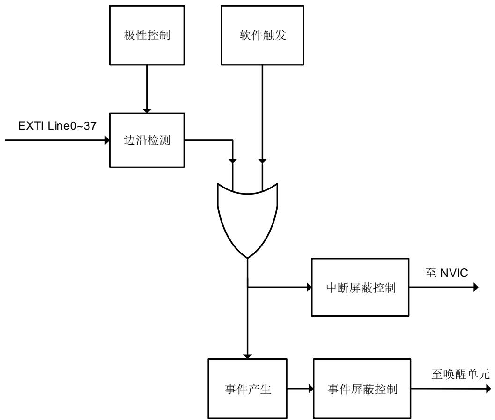

# 8. 中断/事件控制器（EXTI）

# 8.1. 简介

Cortex®-M7集成了嵌套式矢量型中断控制器（Nested Vectored Interrupt Controller（NVIC））来实现高效的异常和中断处理。NVIC实现了低延迟的异常和中断处理，以及电源管理控制。它和内核是紧密耦合的。更多关于NVIC的说明请参考《Cortex®-M7技术参考手册》。

EXTI（中断/事件控制器）包括38个相互独立的边沿检测电路并且能够向处理器内核产生中断请求或唤醒事件。EXTI有三种触发类型：上升沿触发、下降沿触发和任意沿触发。EXTI中的每一个边沿检测电路都可以独立配置和屏蔽。

# 8.2. 主要特征

Cortex®-M7系统异常；

多达217种可屏蔽的外设中断；

4位中断优先级配置位—16个中断优先等级；

高效的中断处理；

支持异常抢占和咬尾中断；

将系统从省电模式唤醒；

EXTI中有多达38个相互独立的边沿检测电路；

3种触发类型：上升沿触发、下降沿触发和任意沿触发；

软件中断或事件触发；

可配置的触发源。

# 8.3. 功能说明

Arm Cortex®-M7处理器和嵌套式矢量型中断控制器（NVIC）在处理（Handler）模式下对所有异常进行优先级区分以及处理。当异常发生时，系统自动将当前处理器工作状态压栈，在执行完中断服务子程序（ISR）后自动将其出栈。

取向量是和当前工作态压栈并行进行的，从而提高了中断入口效率。处理器支持咬尾中断，可实现背靠背中断，大大削减了反复切换工作态所带来的开销。下表列出了Cortex®-M7中的NVIC异常类型。

表 8-1. Cortex®-M7 中的 NVIC 异常类型

<table><tr><td>异常类型</td><td>向量编号</td><td>优先级(a)</td><td>向量地址</td><td>描述</td></tr><tr><td>-</td><td>0</td><td>-</td><td>0x0000_0000</td><td>保留</td></tr><tr><td>复位</td><td>1</td><td>-3</td><td>0x0000_0004</td><td>复位</td></tr><tr><td>NMI</td><td>2</td><td>-2</td><td>0x0000_0008</td><td>不可屏蔽中断</td></tr><tr><td>硬件故障</td><td>3</td><td>-1</td><td>0x0000_000C</td><td>各种硬件级别的故障</td></tr><tr><td>存储器管理</td><td>4</td><td>可编程设置</td><td>0x0000_0010</td><td>存储器管理</td></tr><tr><td>总线故障</td><td>5</td><td>可编程设置</td><td>0x0000_0014</td><td>预取指故障,存储器访问故障</td></tr><tr><td>用法故障</td><td>6</td><td>可编程设置</td><td>0x0000_0018</td><td>未定义的指令或非法状态</td></tr><tr><td>-</td><td>7-10</td><td>-</td><td>0x0000_001C - 0x0000_002B</td><td>保留</td></tr><tr><td>SVCall 服务调用</td><td>11</td><td>可编程设置</td><td>0x0000_002C</td><td>通过 SWI 指令实现系统服务调用</td></tr><tr><td>调试监控</td><td>12</td><td>可编程设置</td><td>0x0000_0030</td><td>调试监视器</td></tr><tr><td>-</td><td>13</td><td>-</td><td>0x0000_0034</td><td>保留</td></tr><tr><td>PendSV 挂起服务</td><td>14</td><td>可编程设置</td><td>0x0000_0038</td><td>可挂起的系统服务请求</td></tr><tr><td>SysTick</td><td>15</td><td>可编程设置</td><td>0x0000_003C</td><td>系统节拍定时器</td></tr></table>

SysTick 校 准 值 固 定 为 1000 ， SysTick 时 钟 源 可 选 择 为 CK_SYS 或 CK_SYS/8 。 通 过 对SYST_RVR寄存器进行配置，从而为系统提供1ms时基。当SysTick时钟源为CK_SYS（CK_SYS=a MHz）时，SYST_RVR寄存器值设置为（a*1000-1）。当SysTick时钟源为CK_SYS/8时，SYST_RVR寄存器值设置为（a/8*1000-1）。

表 8-2. 中断向量表

<table><tr><td>中断编号</td><td>向量编号</td><td>外设中断描述</td><td>向量地址</td></tr><tr><td>IRQ 0</td><td>16</td><td>窗口看门狗中断</td><td>0x0000_0040</td></tr><tr><td>IRQ 1</td><td>17</td><td>连接到EXTI线的VAVD/LVD/VOVD中断</td><td>0x0000_0044</td></tr><tr><td>IRQ 2</td><td>18</td><td>连接到EXTI线的RTC侵入和时间戳中断LXTAL时钟阻塞中断</td><td>0x0000_0048</td></tr><tr><td>IRQ 3</td><td>19</td><td>连接到EXTI线的RTC唤醒中断</td><td>0x0000_004C</td></tr><tr><td>IRQ 4</td><td>20</td><td>FMC全局中断</td><td>0x0000_0050</td></tr><tr><td>IRQ 5</td><td>21</td><td>RCU全局中断</td><td>0x0000_0054</td></tr><tr><td>IRQ 6</td><td>22</td><td>EXTI线0中断</td><td>0x0000_0058</td></tr><tr><td>IRQ 7</td><td>23</td><td>EXTI线1中断</td><td>0x0000_005C</td></tr><tr><td>IRQ 8</td><td>24</td><td>EXTI线2中断</td><td>0x0000_0060</td></tr><tr><td>IRQ 9</td><td>25</td><td>EXTI线3中断</td><td>0x0000_0064</td></tr><tr><td>IRQ 10</td><td>26</td><td>EXTI线4中断</td><td>0x0000_0068</td></tr><tr><td>IRQ 11</td><td>27</td><td>DMA0通道0全局中断</td><td>0x0000_006C</td></tr><tr><td>IRQ 12</td><td>28</td><td>DMA0通道1全局中断</td><td>0x0000_0070</td></tr><tr><td>IRQ 13</td><td>29</td><td>DMA0通道2全局中断</td><td>0x0000_0074</td></tr><tr><td>IRQ 14</td><td>30</td><td>DMA0通道3全局中断</td><td>0x0000_0078</td></tr><tr><td>IRQ 15</td><td>31</td><td>DMA0通道4全局中断</td><td>0x0000_007C</td></tr><tr><td>IRQ 16</td><td>32</td><td>DMA0通道5全局中断</td><td>0x0000_0080</td></tr><tr><td>IRQ 17</td><td>33</td><td>DMA0通道6全局中断</td><td>0x0000_0084</td></tr><tr><td>IRQ 18</td><td>34</td><td>ADC0和ADC1中断</td><td>0x0000_0088</td></tr><tr><td>IRQ 19-22</td><td>35-38</td><td>保留</td><td>0x0000_008C-0x0000_0098</td></tr><tr><td>IRQ 23</td><td>39</td><td>EXTI线[9:5]中断</td><td>0x0000_009C</td></tr><tr><td>IRQ 24</td><td>40</td><td>TIMER0中止中断</td><td>0x0000_00A0</td></tr><tr><td>IRQ 25</td><td>41</td><td>TIMER0 更新中断</td><td>0x0000_00A4</td></tr><tr><td>IRQ 26</td><td>42</td><td>TIMER0 触发和换相中断</td><td>0x0000_00A8</td></tr><tr><td>IRQ 27</td><td>43</td><td>TIMER0 捕获比较中断</td><td>0x0000_00AC</td></tr><tr><td>IRQ 28</td><td>44</td><td>TIMER1 全局中断</td><td>0x0000_00B0</td></tr><tr><td>IRQ 29</td><td>45</td><td>TIMER2 全局中断</td><td>0x0000_00B4</td></tr><tr><td>IRQ 30</td><td>46</td><td>TIMER3 全局中断</td><td>0x0000_00B8</td></tr><tr><td>IRQ 31</td><td>47</td><td>I2C0 事件中断</td><td>0x0000_00BC</td></tr><tr><td>IRQ 32</td><td>48</td><td>I2C0 错误中断</td><td>0x0000_00C0</td></tr><tr><td>IRQ 33</td><td>49</td><td>I2C1 事件中断</td><td>0x0000_00C4</td></tr><tr><td>IRQ 34</td><td>50</td><td>I2C1 错误中断</td><td>0x0000_00C8</td></tr><tr><td>IRQ 35</td><td>51</td><td>SPI0 全局中断</td><td>0x0000_00CC</td></tr><tr><td>IRQ 36</td><td>52</td><td>SPI1 全局中断</td><td>0x0000_00D0</td></tr><tr><td>IRQ 37</td><td>53</td><td>USART0 全局和唤醒中断</td><td>0x0000_00D4</td></tr><tr><td>IRQ 38</td><td>54</td><td>USART1 全局和唤醒中断</td><td>0x0000_00D8</td></tr><tr><td>IRQ 39</td><td>55</td><td>USART2 全局和唤醒中断</td><td>0x0000_00DC</td></tr><tr><td>IRQ 40</td><td>56</td><td>EXTI 线[15:10]中断</td><td>0x0000_00E0</td></tr><tr><td>IRQ 41</td><td>57</td><td>连接到EXTI线的RTC闹钟中断</td><td>0x0000_00E4</td></tr><tr><td>IRQ 42</td><td>58</td><td>保留</td><td>0x0000_00E8</td></tr><tr><td>IRQ 43</td><td>59</td><td>TIMER7 中止中断</td><td>0x0000_00EC</td></tr><tr><td>IRQ 44</td><td>60</td><td>TIMER7 更新中断</td><td>0x0000_00F0</td></tr><tr><td>IRQ 45</td><td>61</td><td>TIMER7 触发和换相中断</td><td>0x0000_00F4</td></tr><tr><td>IRQ 46</td><td>62</td><td>TIMER7 捕获比较中断</td><td>0x0000_00F8</td></tr><tr><td>IRQ 47</td><td>63</td><td>DMA0 通道7全局中断</td><td>0x0000_00FC</td></tr><tr><td>IRQ 48</td><td>64</td><td>EXMC 全局中断</td><td>0x0000_0100</td></tr><tr><td>IRQ 49</td><td>65</td><td>SDIO0 全局中断</td><td>0x0000_0104</td></tr><tr><td>IRQ 50</td><td>66</td><td>TIMER4 全局中断</td><td>0x0000_0108</td></tr><tr><td>IRQ 51</td><td>67</td><td>SPI2 全局中断</td><td>0x0000_010C</td></tr><tr><td>IRQ 52</td><td>68</td><td>UART3 全局中断</td><td>0x0000_0110</td></tr><tr><td>IRQ 53</td><td>69</td><td>UART4 全局中断</td><td>0x0000_0114</td></tr><tr><td>IRQ 54</td><td>70</td><td>TIMER5 全局中断DAC 下溢错误中断</td><td>0x0000_0118</td></tr><tr><td>IRQ 55</td><td>71</td><td>TIMER6 全局中断</td><td>0x0000_011C</td></tr><tr><td>IRQ 56</td><td>72</td><td>DMA1 通道0全局中断</td><td>0x0000_0120</td></tr><tr><td>IRQ 57</td><td>73</td><td>DMA1 通道1全局中断</td><td>0x0000_0124</td></tr><tr><td>IRQ 58</td><td>74</td><td>DMA1 通道2全局中断</td><td>0x0000_0128</td></tr><tr><td>IRQ 59</td><td>75</td><td>DMA1 通道3全局中断</td><td>0x0000_012C</td></tr><tr><td>IRQ 60</td><td>76</td><td>DMA1 通道4全局中断</td><td>0x0000_0130</td></tr><tr><td>IRQ 61</td><td>77</td><td>以太网0全局中断</td><td>0x0000_0134</td></tr><tr><td>IRQ 62</td><td>78</td><td>连接到EXTI线的以太网0唤醒中断</td><td>0x0000_0138</td></tr><tr><td>IRQ 63-67</td><td>79-83</td><td>保留</td><td>0x0000_013C-0x0000_014C</td></tr><tr><td>IRQ 68</td><td>84</td><td>DMA1 通道5全局中断</td><td>0x0000_0150</td></tr><tr><td>IRQ 69</td><td>85</td><td>DMA1通道6全局中断</td><td>0x0000_0154</td></tr><tr><td>IRQ 70</td><td>86</td><td>DMA1通道7全局中断</td><td>0x0000_0158</td></tr><tr><td>IRQ 71</td><td>87</td><td>USART5全局和唤醒中断</td><td>0x0000_015C</td></tr><tr><td>IRQ 72</td><td>88</td><td>I2C2事件中断</td><td>0x0000_0160</td></tr><tr><td>IRQ 73</td><td>89</td><td>I2C2错误中断</td><td>0x0000_0164</td></tr><tr><td>IRQ 74</td><td>90</td><td>USBHS0端点1输出中断</td><td>0x0000_0168</td></tr><tr><td>IRQ 75</td><td>91</td><td>USBHS0端点1输入中断</td><td>0x0000_016C</td></tr><tr><td>IRQ 76</td><td>92</td><td>连接到EXTI线的USBHS0唤醒中断</td><td>0x0000_0170</td></tr><tr><td>IRQ 77</td><td>93</td><td>USBHS0全局中断</td><td>0x0000_0174</td></tr><tr><td>IRQ 78</td><td>94</td><td>DCI全局中断</td><td>0x0000_0178</td></tr><tr><td>IRQ 79</td><td>95</td><td>CAU全局中断</td><td>0x0000_017C</td></tr><tr><td>IRQ 80</td><td>96</td><td>HAU和TRNG全局中断</td><td>0x0000_0180</td></tr><tr><td>IRQ 81</td><td>97</td><td>FPU全局中断</td><td>0x0000_0184</td></tr><tr><td>IRQ 82</td><td>98</td><td>UART6全局中断</td><td>0x0000_0188</td></tr><tr><td>IRQ 83</td><td>99</td><td>UART7全局中断</td><td>0x0000_018C</td></tr><tr><td>IRQ 84</td><td>100</td><td>SPI3全局中断</td><td>0x0000_0190</td></tr><tr><td>IRQ 85</td><td>101</td><td>SPI4全局中断</td><td>0x0000_0194</td></tr><tr><td>IRQ 86</td><td>102</td><td>SPI5全局中断</td><td>0x0000_0198</td></tr><tr><td>IRQ 87</td><td>103</td><td>SAI0全局中断</td><td>0x0000_019C</td></tr><tr><td>IRQ 88</td><td>104</td><td>TLI全局中断</td><td>0x0000_01A0</td></tr><tr><td>IRQ 89</td><td>105</td><td>TLI错误中断</td><td>0x0000_01A4</td></tr><tr><td>IRQ 90</td><td>106</td><td>IPA全局中断</td><td>0x0000_01A8</td></tr><tr><td>IRQ 91</td><td>107</td><td>SAI1全局中断</td><td>0x0000_01AC</td></tr><tr><td>IRQ 92</td><td>108</td><td>OSPI0全局中断</td><td>0x0000_01B0</td></tr><tr><td>IRQ 93-94</td><td>109-110</td><td>保留</td><td>0x0000_01B4-0x0000_01B8</td></tr><tr><td>IRQ 95</td><td>111</td><td>I2C3事件中断</td><td>0x0000_01BC</td></tr><tr><td>IRQ 96</td><td>112</td><td>I2C3错误中断</td><td>0x0000_01C0</td></tr><tr><td>IRQ 97</td><td>113</td><td>RSPDIF全局中断</td><td>0x0000_01C4</td></tr><tr><td>IRQ 98-101</td><td>114-117</td><td>保留</td><td>0x0000_01C8-0x0000_01D4</td></tr><tr><td>IRQ 102</td><td>118</td><td>DMAMUX上溢中断</td><td>0x0000_01D8</td></tr><tr><td>IRQ 103-109</td><td>119-125</td><td>保留</td><td>0x0000_01DC-0x0000_01F4</td></tr><tr><td>IRQ 110</td><td>126</td><td>HPDF全局中断0</td><td>0x0000_01F8</td></tr><tr><td>IRQ 111</td><td>127</td><td>HPDF全局中断1</td><td>0x0000_01FC</td></tr><tr><td>IRQ 112</td><td>128</td><td>HPDF全局中断2</td><td>0x0000_0200</td></tr><tr><td>IRQ 113</td><td>129</td><td>HPDF全局中断3</td><td>0x0000_0204</td></tr><tr><td>IRQ 114</td><td>130</td><td>SAI2全局中断</td><td>0x0000_0208</td></tr><tr><td>IRQ 115</td><td>131</td><td>保留</td><td>0x0000_020C</td></tr><tr><td>IRQ 116</td><td>132</td><td>TIMER14全局中断</td><td>0x0000_0210</td></tr><tr><td>IRQ 117</td><td>133</td><td>TIMER15全局中断</td><td>0x0000_0214</td></tr><tr><td>IRQ 118</td><td>134</td><td>TIMER16 全局中断</td><td>0x0000_0218</td></tr><tr><td>IRQ 119</td><td>135</td><td>保留</td><td>0x0000_021C</td></tr><tr><td>IRQ 120</td><td>136</td><td>MDIO 全局中断</td><td>0x0000_0220</td></tr><tr><td>IRQ 121</td><td>137</td><td>保留</td><td>0x0000_0224</td></tr><tr><td>IRQ 122</td><td>138</td><td>MDMA 全局中断</td><td>0x0000_0228</td></tr><tr><td>IRQ 123</td><td>139</td><td>保留</td><td>0x0000_022C</td></tr><tr><td>IRQ 124</td><td>140</td><td>SDIO1 全局中断</td><td>0x0000_0230</td></tr><tr><td>IRQ 125</td><td>141</td><td>HWSEM 全局中断</td><td>0x0000_0234</td></tr><tr><td>IRQ 126</td><td>142</td><td>保留</td><td>0x0000_0238</td></tr><tr><td>IRQ 127</td><td>143</td><td>ADC2 全局中断</td><td>0x0000_023C</td></tr><tr><td>IRQ 128-136</td><td>144-152</td><td>保留</td><td>0x0000_0240-0x0000_0260</td></tr><tr><td>IRQ 137</td><td>153</td><td>CMP0 和 CMP1 全局中断连接到EXTI 线的 CMP0 和 CMP1 中断</td><td>0x0000_0264</td></tr><tr><td>IRQ 138-143</td><td>154-159</td><td>保留</td><td>0x0000_0268-0x0000_027C</td></tr><tr><td>IRQ 144</td><td>160</td><td>CTC 中断</td><td>0x0000_0280</td></tr><tr><td>IRQ 145</td><td>161</td><td>RAMECCMU 全局中断</td><td>0x0000_0284</td></tr><tr><td>IRQ 146-149</td><td>162-165</td><td>保留</td><td>0x0000_0288-0x0000_0294</td></tr><tr><td>IRQ 150</td><td>166</td><td>OSPI1 全局中断</td><td>0x0000_0298</td></tr><tr><td>IRQ 151</td><td>167</td><td>RTDEC0 全局中断</td><td>0x0000_029C</td></tr><tr><td>IRQ 152</td><td>168</td><td>RTDEC1 全局中断</td><td>0x0000_02A0</td></tr><tr><td>IRQ 153</td><td>169</td><td>FAC 全局中断</td><td>0x0000_02A4</td></tr><tr><td>IRQ 154</td><td>170</td><td>TMU 全局中断</td><td>0x0000_02A8</td></tr><tr><td>IRQ 155-160</td><td>171-176</td><td>保留</td><td>0x0000_02AC-0x0000_02C0</td></tr><tr><td>IRQ 161</td><td>177</td><td>TIMER22 全局中断</td><td>0x0000_02C4</td></tr><tr><td>IRQ 162</td><td>178</td><td>TIMER23 全局中断</td><td>0x0000_02C8</td></tr><tr><td>IRQ 163</td><td>179</td><td>TIMER30 全局中断</td><td>0x0000_02CC</td></tr><tr><td>IRQ 164</td><td>180</td><td>TIMER31 全局中断</td><td>0x0000_02D0</td></tr><tr><td>IRQ 165</td><td>181</td><td>TIMER40 全局中断</td><td>0x0000_02D4</td></tr><tr><td>IRQ 166</td><td>182</td><td>TIMER41 全局中断</td><td>0x0000_02D8</td></tr><tr><td>IRQ 167</td><td>183</td><td>TIMER42 全局中断</td><td>0x0000_02DC</td></tr><tr><td>IRQ 168</td><td>184</td><td>TIMER43 全局中断</td><td>0x0000_02E0</td></tr><tr><td>IRQ 169</td><td>185</td><td>TIMER44 全局中断</td><td>0x0000_02E4</td></tr><tr><td>IRQ 170</td><td>186</td><td>TIMER50 全局中断</td><td>0x0000_02E8</td></tr><tr><td>IRQ 171</td><td>187</td><td>TIMER51 全局中断</td><td>0x0000_02EC</td></tr><tr><td>IRQ 172</td><td>188</td><td>USBHS1 端点 1 输出中断</td><td>0x0000_02F0</td></tr><tr><td>IRQ 173</td><td>189</td><td>USBHS1 端点 1 输入中断</td><td>0x0000_02F4</td></tr><tr><td>IRQ 174</td><td>190</td><td>连接到EXTI 线的 USBHS1 唤醒中断</td><td>0x0000_02F8</td></tr><tr><td>IRQ 175</td><td>191</td><td>USBHS1 全局中断</td><td>0x0000_02FC</td></tr><tr><td>IRQ 176</td><td>192</td><td>以太网1全局中断</td><td>0x0000_0300</td></tr><tr><td>IRQ 177</td><td>193</td><td>连接到EXTI线的以太网1唤醒中断</td><td>0x0000_0304</td></tr><tr><td>IRQ 178</td><td>194</td><td>保留</td><td>0x0000_0308</td></tr><tr><td>IRQ 179</td><td>195</td><td>连接到EXTI线的CAN0唤醒中断</td><td>0x0000_030C</td></tr><tr><td>IRQ 180</td><td>196</td><td>CAN0消息缓冲区中断</td><td>0x0000_0310</td></tr><tr><td>IRQ 181</td><td>197</td><td>CAN0总线关闭/总线关闭完成中断</td><td>0x0000_0314</td></tr><tr><td>IRQ 182</td><td>198</td><td>CAN0错误中断</td><td>0x0000_0318</td></tr><tr><td>IRQ 183</td><td>199</td><td>CAN0快速传输错误中断</td><td>0x0000_031C</td></tr><tr><td>IRQ 184</td><td>200</td><td>CAN0发送警告中断</td><td>0x0000_0320</td></tr><tr><td>IRQ 185</td><td>201</td><td>CAN0接收警告中断</td><td>0x0000_0324</td></tr><tr><td>IRQ 186</td><td>202</td><td>连接到EXTI线的CAN1唤醒中断</td><td>0x0000_0328</td></tr><tr><td>IRQ 187</td><td>203</td><td>CAN1消息缓冲区中断</td><td>0x0000_032C</td></tr><tr><td>IRQ 188</td><td>204</td><td>CAN1总线关闭/总线关闭完成中断</td><td>0x0000_0330</td></tr><tr><td>IRQ 189</td><td>205</td><td>CAN1错误中断</td><td>0x0000_0334</td></tr><tr><td>IRQ 190</td><td>206</td><td>CAN1快速传输错误中断</td><td>0x0000_0338</td></tr><tr><td>IRQ 191</td><td>207</td><td>CAN1发送警告中断</td><td>0x0000_033C</td></tr><tr><td>IRQ 192</td><td>208</td><td>CAN1接收警告中断</td><td>0x0000_0340</td></tr><tr><td>IRQ 193</td><td>209</td><td>连接到EXTI线的CAN2唤醒中断</td><td>0x0000_0344</td></tr><tr><td>IRQ 194</td><td>210</td><td>CAN2消息缓冲区中断</td><td>0x0000_0348</td></tr><tr><td>IRQ 195</td><td>211</td><td>CAN2总线关闭/总线关闭完成中断</td><td>0x0000_034C</td></tr><tr><td>IRQ 196</td><td>212</td><td>CAN2错误中断</td><td>0x0000_0350</td></tr><tr><td>IRQ 197</td><td>213</td><td>CAN2快速传输错误中断</td><td>0x0000_0354</td></tr><tr><td>IRQ 198</td><td>214</td><td>CAN2发送警告中断</td><td>0x0000_0358</td></tr><tr><td>IRQ 199</td><td>215</td><td>CAN2接收警告中断</td><td>0x0000_035C</td></tr><tr><td>IRQ 200</td><td>216</td><td>EFUSE全局中断</td><td>0x0000_0360</td></tr><tr><td>IRQ 201</td><td>217</td><td>连接到EXTI线的I2C0唤醒中断</td><td>0x0000_0364</td></tr><tr><td>IRQ 202</td><td>218</td><td>连接到EXTI线的I2C1唤醒中断</td><td>0x0000_0368</td></tr><tr><td>IRQ 203</td><td>219</td><td>连接到EXTI线的I2C2唤醒中断</td><td>0x0000_036C</td></tr><tr><td>IRQ 204</td><td>220</td><td>连接到EXTI线的I2C3唤醒中断</td><td>0x0000_0370</td></tr><tr><td>IRQ 205</td><td>221</td><td>LPDTS中断</td><td>0x0000_0374</td></tr><tr><td>IRQ 206</td><td>222</td><td>连接到EXTI线的LPDTS唤醒中断</td><td>0x0000_0378</td></tr><tr><td>IRQ 207</td><td>223</td><td>TIMER0译码器检测中断</td><td>0x0000_037C</td></tr><tr><td>IRQ 208</td><td>224</td><td>TIMER7译码器检测中断</td><td>0x0000_0380</td></tr><tr><td>IRQ 209</td><td>225</td><td>TIMER1译码器检测中断</td><td>0x0000_0384</td></tr><tr><td>IRQ 210</td><td>226</td><td>TIMER2译码器检测中断</td><td>0x0000_0388</td></tr><tr><td>IRQ 211</td><td>227</td><td>TIMER3译码器检测中断</td><td>0x0000_038C</td></tr><tr><td>IRQ 212</td><td>228</td><td>TIMER4译码器检测中断</td><td>0x0000_0390</td></tr><tr><td>IRQ 213</td><td>229</td><td>TIMER22译码器检测中断</td><td>0x0000_0394</td></tr><tr><td>IRQ 214</td><td>230</td><td>TIMER23译码器检测中断</td><td>0x0000_0398</td></tr><tr><td>IRQ 215</td><td>231</td><td>TIMER30译码器检测中断</td><td>0x0000_039C</td></tr><tr><td>IRQ 216</td><td>232</td><td>TIMER31译码器检测中断</td><td>0x0000_03A0</td></tr></table>

# 8.4. 外部中断及事件（EXTI）框图

图 8-1. EXTI 框图

# 8.5. 外部中断及事件功能概述

EXTI 包含多达 38 个相互独立的边沿检测电路并且可以向处理器产生中断请求或事件唤醒。EXTI 提供 3 种触发类型：上升沿触发，下降沿触发和任意沿触发。EXTI 中每个边沿检测电路都可以分别予以配置或屏蔽。

EXTI 触发源包括来自 I/O 管脚的 16 根线以及来自内部模块的 22 根线，具体细节参考 8-3.EXTI 。通过配置 SYSCFG 模块的 SYSCFG_EXTISSx 寄存器，所有的 GPIO 管脚都可以被选作 EXTI 的触发源，具体细节请参考 SYSCFG 。

除了中断，EXTI 还可以向处理器提供事件信号。Cortex®-M7 内核完全支持等待中断（WFI），等待事件（WFE）和发送事件（SEV）指令。芯片内部有一个唤醒中断控制器（WIC），用户可以放心的让处理器和 NVIC 进入功耗极低的省电模式，由 WIC 来识别中断和事件以及判断优先级。当某些预期的事件发生时，例如一个特定的 I/O 管脚电平翻转或者 RTC 闹钟动作，EXTI 能唤醒处理器及整个系统。

# 硬件触发

硬件触发被用来检测外部或内部信号的电压变化。软件需要按如下步骤配置来使用这项功能：

1. 根据应用需要配置 SYSCFG 模块中的 EXTI 触发源；

2. 配置 EXTI_RTEN 寄存器和 EXTI_FTEN 寄存器以使能相应引脚的上升沿或下降沿检测（软件应当同时配置引脚对应的 RTENx 和 FTENx 位以检测该引脚上升沿和下降沿的变化）；

3. 通过配置引脚对应的 EXTI_INTEN 或 EXTI_EVEN 位，使能中断或事件；

4. EXTI 开始检测被配置的引脚上的电平变化，当这些引脚上期望的变化被检测到时，使能的中断或事件将被触发。如果为中断触发，则对应的 PD 位将立刻被置 1；如果为事件触发，则对应的 PD 位不被置 1。软件需要响应该中断或事件并清除相应 PDx 位。

# 软件触发

按照如下步骤软件也可以触发 EXTI 中断或事件：

1. 配置对应的 EXTI_INTEN 或 EXTI_EVEN 位使能中断或事件；

2. 配置 EXTI_SWIEV 寄存器的对应 SWIEVx 位，使能的中断或事件将被立即触发。如果为中断触发，则对应的 PD 位将立刻被置 1；如果为事件触发，则对应的 PD 位不被置 1。软件需要响应该中断或事件并清除相应 PDx 位。

表 8-3. EXTI 触发源

<table><tr><td>EXTI 线编号</td><td>触发源</td></tr><tr><td>0</td><td>PA0 / PB0 / PC0 / PD0 / PE0 / PF0 / PG0 / PH0 / PK0</td></tr><tr><td>1</td><td>PA1 / PB1 / PC1 / PD1 / PE1 / PF1 / PG1 / PH1 / PK1</td></tr><tr><td>2</td><td>PA2 / PB2 / PC2 / PD2 / PE2 / PF2 / PG2 / PH2 / PK2</td></tr><tr><td>3</td><td>PA3 / PB3 / PC3 / PD3 / PE3 / PF3 / PG3 / PH3</td></tr><tr><td>4</td><td>PA4 / PB4 / PC4 / PD4 / PE4 / PF4 / PG4 / PH4</td></tr><tr><td>5</td><td>PA5 / PB5 / PC5 / PD5 / PE5 / PF5 / PG5 / PH5</td></tr><tr><td>6</td><td>PA6 / PB6 / PC6 / PD6 / PE6 / PF6 / PG6 / PH6</td></tr><tr><td>7</td><td>PA7 / PB7 / PC7 / PD7 / PE7 / PF7 / PG7 / PH7</td></tr><tr><td>8</td><td>PA8 / PB8 / PC8 / PD8 / PE8 / PF8 / PG8 / PH8 / PJ8</td></tr><tr><td>9</td><td>PA9 / PB9 / PC9 / PD9 / PE9 / PF9 / PG9 / PH9 / PJ9</td></tr><tr><td>10</td><td>PA10 / PB10 / PC10 / PD10 / PE10 / PF10 / PG10 / PH10 / PJ10</td></tr><tr><td>11</td><td>PB11 / PC11 / PD11 / PE11 / PF11 / PG11 / PH11 / PJ11</td></tr><tr><td>12</td><td>PB12 / PC12 / PD12 / PE12 / PF12 / PG12 / PH12</td></tr><tr><td>13</td><td>PA13 / PB13 / PC13 / PD13 / PE13 / PF13 / PG13 / PH13</td></tr><tr><td>14</td><td>PA14 / PB14 / PC14 / PD14 / PE14 / PF14 / PG14 / PH14</td></tr><tr><td>15</td><td>PA15 / PB15 / PC15 / PD15 / PE15 / PF15 / PG15 / PH15</td></tr><tr><td>16</td><td>VAVD, LVD 和 VOVD</td></tr><tr><td>17</td><td>RTC 闹钟</td></tr><tr><td>18</td><td>RTC 侵入和时间戳事件,LXTAL 时钟阻塞</td></tr><tr><td>19</td><td>RTC 唤醒</td></tr><tr><td>20</td><td>CMP0 输出</td></tr><tr><td>21</td><td>CMP1 输出</td></tr><tr><td>22</td><td>以太网 1 唤醒</td></tr><tr><td>23</td><td>以太网 0 唤醒</td></tr><tr><td>24</td><td>CAN0 唤醒</td></tr><tr><td>25</td><td>CAN1 唤醒</td></tr><tr><td>26</td><td>CAN2 唤醒</td></tr><tr><td>27</td><td>USART0 唤醒</td></tr><tr><td>28</td><td>USART1 唤醒</td></tr><tr><td>29</td><td>USART2 唤醒</td></tr><tr><td>30</td><td>USART5 唤醒</td></tr><tr><td>31</td><td>USBHS0 唤醒</td></tr><tr><td>32</td><td>USBHS1 唤醒</td></tr><tr><td>33</td><td>I2C0 唤醒</td></tr><tr><td>34</td><td>I2C1 唤醒</td></tr><tr><td>35</td><td>I2C2 唤醒</td></tr><tr><td>36</td><td>I2C3 唤醒</td></tr><tr><td>37</td><td>LPDTS 唤醒</td></tr></table>

