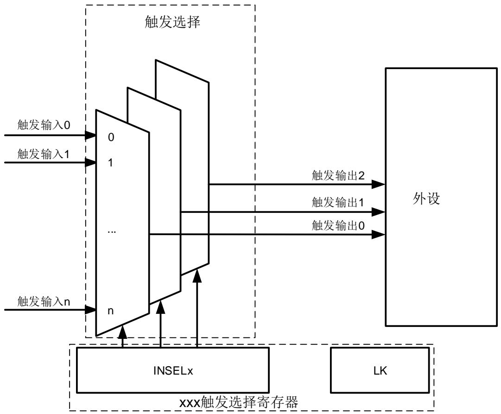

# 9. 触发选择控制器（TRIGSEL）

# 9.1. 简介

触发选择控制器（TRIGSEL）可通过软件配置的方式，为各种外设选择触发输入信号。TRIGSEL提供了灵活的机制，可以为外设选择不同的触发输入。

使用TRIGSEL，有多达150个触发输入信号可选。配置相应的触发选择寄存器，可以为外设的指定触发输入选择不同的触发信号。

# 9.2. 主要特征

支持多达150个触发输入信号；

每个外设都有专用的触发信号选择寄存器；

触发选择控制器的输入信号可来源于外部输输入或外设输出；

触发选择控制器的输出信号可输出到外部输出或者到外设输入。

# 9.3. 功能说明

支持触发源选择的外设均具有专用TRIGSEL寄存器，用来为该外设选择不同的触发输入源。每个TRIGSEL寄存器可以配置多达3路输出，这些输出连接到外设的触发输入。每路输出均可从不同的触发输入源中选择。

9-1. TRIGSEL 显示了TRIGSEL的主要组成结构。

图 9-1. TRIGSEL 主要组成示例

# 9.4. 内部连接

TRIGSEL 允许软件方式为外设选择触发输入。 9-1. 给出了触发输入寄存器的位域值对应的触发输入选择。

表 9-1. 触发输入位域选择

<table><tr><td>位域名称</td><td>位域值</td><td>触发输入选择</td></tr><tr><td rowspan="14">INSELx</td><td>0x00</td><td>0</td></tr><tr><td>0x01</td><td>1</td></tr><tr><td>0x02</td><td>TRIGSEL_IN0</td></tr><tr><td>0x03</td><td>TRIGSEL_IN1</td></tr><tr><td>0x04</td><td>TRIGSEL_IN2</td></tr><tr><td>0x05</td><td>TRIGSEL_IN3</td></tr><tr><td>0x06</td><td>TRIGSEL_IN4</td></tr><tr><td>0x07</td><td>TRIGSEL_IN5</td></tr><tr><td>0x08</td><td>TRIGSEL_IN6</td></tr><tr><td>0x09</td><td>TRIGSEL_IN7</td></tr><tr><td>0x0a</td><td>TRIGSEL_IN8</td></tr><tr><td>0x0b</td><td>TRIGSEL_IN9</td></tr><tr><td>0x0c</td><td>TRIGSEL_IN10</td></tr><tr><td>0x0d</td><td>TRIGSEL_IN11</td></tr><tr><td rowspan="42"></td><td>0x0e</td><td>TRIGSEL_IN12</td></tr><tr><td>0x0f</td><td>TRIGSEL_IN13</td></tr><tr><td>0x10</td><td>LXTAL_TRG</td></tr><tr><td>0x11</td><td>TIMER0_TRGO0</td></tr><tr><td>0x12</td><td>TIMER0_TRGO1</td></tr><tr><td>0x13</td><td>TIMER0_CH0</td></tr><tr><td>0x14</td><td>TIMER0_CH1</td></tr><tr><td>0x15</td><td>TIMER0_CH2</td></tr><tr><td>0x16</td><td>TIMER0_CH3</td></tr><tr><td>0x17</td><td>TIMER0_MCH0</td></tr><tr><td>0x18</td><td>TIMER0_MCH1</td></tr><tr><td>0x19</td><td>TIMER0_MCH2</td></tr><tr><td>0x1a</td><td>TIMER0_MCH3</td></tr><tr><td>0x1b~0x20</td><td>保留</td></tr><tr><td>0x21</td><td>TIMER0_BRKIN0</td></tr><tr><td>0x22</td><td>TIMER0_BRKIN1</td></tr><tr><td>0x23</td><td>TIMER0_BRKIN2</td></tr><tr><td>0x24</td><td>TIMER0_ETI</td></tr><tr><td>0x25</td><td>TIMER1_TRGO0</td></tr><tr><td>0x26</td><td>TIMER1_CH0</td></tr><tr><td>0x27</td><td>TIMER1_CH1</td></tr><tr><td>0x28</td><td>TIMER1_CH2</td></tr><tr><td>0x29</td><td>TIMER1_CH3</td></tr><tr><td>0x2a</td><td>TIMER1_ETI</td></tr><tr><td>0x2b</td><td>TIMER2_TRGO0</td></tr><tr><td>0x2c</td><td>TIMER2_CH0</td></tr><tr><td>0x2d</td><td>TIMER2_CH1</td></tr><tr><td>0x2e</td><td>TIMER2_CH2</td></tr><tr><td>0x2f</td><td>TIMER2_CH3</td></tr><tr><td>0x30</td><td>TIMER2_ETI</td></tr><tr><td>0x31</td><td>TIMER3_TRGO0</td></tr><tr><td>0x32</td><td>TIMER3_CH0</td></tr><tr><td>0x33</td><td>TIMER3_CH1</td></tr><tr><td>0x34</td><td>TIMER3_CH2</td></tr><tr><td>0x35</td><td>TIMER3_CH3</td></tr><tr><td>0x36</td><td>TIMER3_ETI</td></tr><tr><td>0x37</td><td>TIMER4_TRGO0</td></tr><tr><td>0x38</td><td>TIMER4_CH0</td></tr><tr><td>0x39</td><td>TIMER4_CH1</td></tr><tr><td>0x3a</td><td>TIMER4_CH2</td></tr><tr><td>0x3b</td><td>TIMER4_CH3</td></tr><tr><td>0x3c</td><td>TIMER4_ETI</td></tr><tr><td rowspan="42"></td><td>0x3d</td><td>TIMER5_TRGO0</td></tr><tr><td>0x3e</td><td>TIMER6_TRGO0</td></tr><tr><td>0x3f</td><td>TIMER7_TRGO0</td></tr><tr><td>0x40</td><td>TIMER7_TRGO1</td></tr><tr><td>0x41</td><td>TIMER7_CH0</td></tr><tr><td>0x42</td><td>TIMER7_CH1</td></tr><tr><td>0x43</td><td>TIMER7_CH2</td></tr><tr><td>0x44</td><td>TIMER7_CH3</td></tr><tr><td>0x45</td><td>TIMER7_MCH0</td></tr><tr><td>0x46</td><td>TIMER7_MCH1</td></tr><tr><td>0x47</td><td>TIMER7_MCH2</td></tr><tr><td>0x48</td><td>TIMER7_MCH3</td></tr><tr><td>0x49~0x4e</td><td>保留</td></tr><tr><td>0x4f</td><td>TIMER7_BRKIN0</td></tr><tr><td>0x50</td><td>TIMER7_BRKIN1</td></tr><tr><td>0x51</td><td>TIMER7_BRKIN2</td></tr><tr><td>0x52</td><td>TIMER7_ETI</td></tr><tr><td>0x53</td><td>TIMER14_TRGO0</td></tr><tr><td>0x54</td><td>TIMER14_CH0</td></tr><tr><td>0x55</td><td>TIMER14_CH1</td></tr><tr><td>0x56</td><td>TIMER14_MCH0</td></tr><tr><td>0x57~0x58</td><td>保留</td></tr><tr><td>0x59</td><td>TIMER14_BRKIN0</td></tr><tr><td>0x5a</td><td>TIMER15_CH0</td></tr><tr><td>0x5b</td><td>TIMER15_MCH0</td></tr><tr><td>0x5c~0x5d</td><td>保留</td></tr><tr><td>0x5e</td><td>TIMER15_BRKIN0</td></tr><tr><td>0x5f</td><td>TIMER16_CH0</td></tr><tr><td>0x60</td><td>TIMER16_MCH0</td></tr><tr><td>0x61~0x62</td><td>保留</td></tr><tr><td>0x63</td><td>TIMER16_BRKIN0</td></tr><tr><td>0x64</td><td>TIMER22_TRGO0</td></tr><tr><td>0x65</td><td>TIMER22_CH0</td></tr><tr><td>0x66</td><td>TIMER22_CH1</td></tr><tr><td>0x67</td><td>TIMER22_CH2</td></tr><tr><td>0x68</td><td>TIMER22_CH3</td></tr><tr><td>0x69</td><td>TIMER22_ETI</td></tr><tr><td>0x6a</td><td>TIMER23_TRGO0</td></tr><tr><td>0x6b</td><td>TIMER23_CH0</td></tr><tr><td>0x6c</td><td>TIMER23_CH1</td></tr><tr><td>0x6d</td><td>TIMER23_CH2</td></tr><tr><td>0x6e</td><td>TIMER23_CH3</td></tr><tr><td rowspan="42"></td><td>0x6f</td><td>TIMER23_ETI</td></tr><tr><td>0x70</td><td>TIMER30_TRGO0</td></tr><tr><td>0x71</td><td>TIMER30_CH0</td></tr><tr><td>0x72</td><td>TIMER30_CH1</td></tr><tr><td>0x73</td><td>TIMER30_CH2</td></tr><tr><td>0x74</td><td>TIMER30_CH3</td></tr><tr><td>0x75</td><td>TIMER30_ETI</td></tr><tr><td>0x76</td><td>TIMER31_TRGO0</td></tr><tr><td>0x77</td><td>TIMER31_CH0</td></tr><tr><td>0x78</td><td>TIMER31_CH1</td></tr><tr><td>0x79</td><td>TIMER31_CH2</td></tr><tr><td>0x7a</td><td>TIMER31_CH3</td></tr><tr><td>0x7b</td><td>TIMER31_ETI</td></tr><tr><td>0x7c</td><td>TIMER40_TRGO0</td></tr><tr><td>0x7d</td><td>TIMER40_CH0</td></tr><tr><td>0x7e</td><td>TIMER40_CH1</td></tr><tr><td>0x7f</td><td>TIMER40_MCH0</td></tr><tr><td>0x80~0x81</td><td>保留</td></tr><tr><td>0x82</td><td>TIMER40_BRKIN0</td></tr><tr><td>0x83</td><td>TIMER41_TRGO0</td></tr><tr><td>0x84</td><td>TIMER41_CH0</td></tr><tr><td>0x85</td><td>TIMER41_CH1</td></tr><tr><td>0x86</td><td>TIMER41_MCH0</td></tr><tr><td>0x87~0x88</td><td>保留</td></tr><tr><td>0x89</td><td>TIMER41_BRKIN0</td></tr><tr><td>0x8a</td><td>TIMER42_TRGO0</td></tr><tr><td>0x8b</td><td>TIMER42_CH0</td></tr><tr><td>0x8c</td><td>TIMER42_CH1</td></tr><tr><td>0x8d</td><td>TIMER42_MCH0</td></tr><tr><td>0x8e~0x8f</td><td>保留</td></tr><tr><td>0x90</td><td>TIMER42_BRKIN0</td></tr><tr><td>0x91</td><td>TIMER43_TRGO0</td></tr><tr><td>0x92</td><td>TIMER43_CH0</td></tr><tr><td>0x93</td><td>TIMER43_CH1</td></tr><tr><td>0x94</td><td>TIMER43_MCH0</td></tr><tr><td>0x95~0x96</td><td>保留</td></tr><tr><td>0x97</td><td>TIMER43_BRKIN0</td></tr><tr><td>0x98</td><td>TIMER44_TRGO0</td></tr><tr><td>0x99</td><td>TIMER44_CH0</td></tr><tr><td>0x9a</td><td>TIMER44_CH1</td></tr><tr><td>0x9b</td><td>TIMER44_MCH0</td></tr><tr><td>0x9c~0x9d</td><td>保留</td></tr><tr><td rowspan="21"></td><td>0x9e</td><td>TIMER44_BRKIN0</td></tr><tr><td>0x9f</td><td>TIMER50_TRGO0</td></tr><tr><td>0xa0</td><td>TIMER51_TRGO0</td></tr><tr><td>0xa1</td><td>RTC_Alarm</td></tr><tr><td>0xa2</td><td>RTC_TPTS</td></tr><tr><td>0xa3</td><td>ADC0_WD0_OUT</td></tr><tr><td>0xa4</td><td>ADC0_WD1_OUT</td></tr><tr><td>0xa5</td><td>ADC0_WD2_OUT</td></tr><tr><td>0xa6</td><td>ADC1_WD0_OUT</td></tr><tr><td>0xa7</td><td>ADC1_WD1_OUT</td></tr><tr><td>0xa8</td><td>ADC1_WD2_OUT</td></tr><tr><td>0xa9</td><td>ADC2_WD0_OUT</td></tr><tr><td>0xaa</td><td>ADC2_WD1_OUT</td></tr><tr><td>0xab</td><td>ADC2_WD2_OUT</td></tr><tr><td>0xac</td><td>CMP0_OUT</td></tr><tr><td>0xad</td><td>CMP1_OUT</td></tr><tr><td>0xae</td><td>SAI0_FS0</td></tr><tr><td>0xaf</td><td>SAI0_FS1</td></tr><tr><td>0xb0</td><td>SAI2_FS0</td></tr><tr><td>0xb1</td><td>SAI2_FS1</td></tr><tr><td>0xb2~0xff</td><td>保留</td></tr></table>

如 9-2. TRIGSEL 所示，表明了 TRIGSEL 输入输出之间的连接关系。通过 TRIGSEL 寄存器的 INSELx[7:0]位域，可以给 TRIGSEL 的输出选择一个输入触发源。每个TRIGSEL 寄存器配置多达3路输出，这些输出连接到对应的外设。

表 9-2. TRIGSEL 输入输出映射关系

<table><tr><td>触发源</td><td>触发选择</td><td>TRIGSEL 寄存器</td><td>TRIGSEL 输出</td><td>外设</td></tr><tr><td>0</td><td rowspan="12">INSELx[7:0]</td><td rowspan="4">TRIGSEL_EXTOUT_0</td><td rowspan="4">Output0Output1</td><td rowspan="4">TRIGSEL_OUT0TRIGSEL_OUT1</td></tr><tr><td>1</td></tr><tr><td>TRIGSEL_IN0</td></tr><tr><td>TRIGSEL_IN1</td></tr><tr><td>TRIGSEL_IN2</td><td rowspan="4">TRIGSEL_EXTOUT_1</td><td rowspan="4">Output0Output1</td><td rowspan="4">TRIGSEL_OUT2TRIGSEL_OUT3</td></tr><tr><td>TRIGSEL_IN3</td></tr><tr><td>TRIGSEL_IN4</td></tr><tr><td>TRIGSEL_IN5</td></tr><tr><td>TRIGSEL_IN6</td><td rowspan="4">TRIGSEL_EXTOUT_2</td><td rowspan="4">Output0Output1</td><td rowspan="4">TRIGSEL_OUT4TRIGSEL_OUT5</td></tr><tr><td>TRIGSEL_IN7</td></tr><tr><td>TRIGSEL_IN8</td></tr><tr><td>TRIGSEL_IN9</td></tr><tr><td>TRIGSEL_IN10</td><td rowspan="40"></td><td rowspan="4">TRIGSEL_EXTOUT_3</td><td rowspan="4">Output0Output1</td><td rowspan="4">TRIGSEL_OUT6TRIGSEL_OUT7</td></tr><tr><td>TRIGSEL_IN11</td></tr><tr><td>TRIGSEL_IN12</td></tr><tr><td>TRIGSEL_IN13</td></tr><tr><td>LXTAL_TRG</td><td rowspan="5">TRIGSEL_ADC0</td><td rowspan="5">Output0</td><td rowspan="5">ADC0_ROUTRG</td></tr><tr><td>TIMER0_TRGO0</td></tr><tr><td>TIMER0_TRGO1</td></tr><tr><td>TIMER0_CH0</td></tr><tr><td>TIMER0_CH1</td></tr><tr><td>TIMER0_CH2</td><td rowspan="8">TRIGSEL_ADC1</td><td rowspan="8">Output0</td><td rowspan="8">ADC1_ROUTRG</td></tr><tr><td>TIMER0_CH3</td></tr><tr><td>TIMER0_MCH0</td></tr><tr><td>TIMER0_MCH1</td></tr><tr><td>TIMER0_MCH2</td></tr><tr><td>TIMER0_MCH3</td></tr><tr><td>TIMER0_BRKIN0</td></tr><tr><td>TIMER0_BRKIN1</td></tr><tr><td>TIMER0_BRKIN2</td><td rowspan="3">TRIGSEL_ADC2</td><td rowspan="3">Output0</td><td rowspan="3">ADC2_ROUTRG</td></tr><tr><td>TIMER0_ETI</td></tr><tr><td>TIMER1_TRGO0</td></tr><tr><td>TIMER1_CH0</td><td rowspan="2">TRIGSEL_DAC0OUT0</td><td rowspan="2">Output0</td><td rowspan="2">DAC0_OUT0_EXTRG</td></tr><tr><td>TIMER1_CH1</td></tr><tr><td>TIMER1_CH2</td><td rowspan="3">TRIGSEL_DAC0OUT1</td><td rowspan="3">Output0</td><td rowspan="3">DAC0_OUT1_EXTRG</td></tr><tr><td>TIMER1_CH3</td></tr><tr><td>TIMER1_ETI</td></tr><tr><td>TIMER2_TRGO0</td><td rowspan="4">TRIGSEL_TIMER0BRKIN</td><td rowspan="4">Output0Output1Output2</td><td rowspan="4">TIMER0_BRKIN0TIMER0_BRKIN1TIMER0_BRKIN2</td></tr><tr><td>TIMER2_CH0</td></tr><tr><td>TIMER2_CH1</td></tr><tr><td>TIMER2_CH2</td></tr><tr><td>TIMER2_CH3</td><td rowspan="8">TRIGSEL_TIMER7BRKIN</td><td rowspan="8">Output0Output1Output2</td><td rowspan="8">TIMER7_BRKIN0TIMER7_BRKIN1TIMER7_BRKIN2</td></tr><tr><td>TIMER2_ETI</td></tr><tr><td>TIMER3_TRGO0</td></tr><tr><td>TIMER3_CH0</td></tr><tr><td>TIMER3_CH1</td></tr><tr><td>TIMER3_CH2</td></tr><tr><td>TIMER3_CH3</td></tr><tr><td>TIMER3_ETI</td></tr><tr><td>TIMER4_TRGO0</td><td rowspan="3">TRIGSEL_TIMER15BRKIN</td><td rowspan="3">Output0</td><td rowspan="3">TIMER14_BRKIN0</td></tr><tr><td>TIMER4_CH0</td></tr><tr><td>TIMER4_CH1</td></tr><tr><td>TIMER4_CH2</td><td rowspan="40"></td><td rowspan="3">TRIGSEL_TIMER16B RKIN</td><td rowspan="3">Output0</td><td rowspan="3">TIMER16_BRKIN 0</td></tr><tr><td>TIMER4_CH3</td></tr><tr><td>TIMER4_ETI</td></tr><tr><td>TIMER5_TRGO0</td><td rowspan="4">TRIGSEL_TIMER40B RKIN</td><td rowspan="4">Output0</td><td rowspan="4">TIMER40_BRKIN 0</td></tr><tr><td>TIMER6_TRGO0</td></tr><tr><td>TIMER7_TRGO0</td></tr><tr><td>TIMER7_TRGO1</td></tr><tr><td>TIMER7_CH0</td><td rowspan="4">TRIGSEL_TIMER41B RKIN</td><td rowspan="4">Output0</td><td rowspan="4">TIMER41_BRKIN 0</td></tr><tr><td>TIMER7_CH1</td></tr><tr><td>TIMER7_CH2</td></tr><tr><td>TIMER7_CH3</td></tr><tr><td>TIMER7_MCH0</td><td rowspan="5">TRIGSEL_TIMER42B RKIN</td><td rowspan="5">Output0</td><td rowspan="5">TIMER42_BRKIN 0</td></tr><tr><td>TIMER7_MCH1</td></tr><tr><td>TIMER7_MCH2</td></tr><tr><td>TIMER7_MCH3</td></tr><tr><td>TIMER7_BRKIN0</td></tr><tr><td>TIMER7_BRKIN1</td><td rowspan="3">TRIGSEL_TIMER43B RKIN</td><td rowspan="3">Output0</td><td rowspan="3">TIMER43_BRKIN 0</td></tr><tr><td>TIMER7_BRKIN2</td></tr><tr><td>TIMER7_ETI</td></tr><tr><td>TIMER14_TRGO0</td><td rowspan="5">TRIGSEL_TIMER44B RKIN</td><td rowspan="5">Output0</td><td rowspan="5">TIMER44_BRKIN 0</td></tr><tr><td>TIMER14_CH0</td></tr><tr><td>TIMER14_CH1</td></tr><tr><td>TIMER14_MCH0</td></tr><tr><td>TIMER14_BRKIN0</td></tr><tr><td>TIMER15_CH0</td><td rowspan="5">TRIGSEL_CAN0</td><td rowspan="5">Output0</td><td rowspan="5">CAN0_EX_TIME_TICK</td></tr><tr><td>TIMER15_MCH0</td></tr><tr><td>TIMER15_BRKIN0</td></tr><tr><td>TIMER16_CH0</td></tr><tr><td>TIMER16_MCH0</td></tr><tr><td>TIMER16_BRKIN0</td><td rowspan="3">TRIGSEL_CAN1</td><td rowspan="3">Output0</td><td rowspan="3">CAN1_EX_TIME_TICK</td></tr><tr><td>TIMER22_TRGO0</td></tr><tr><td>TIMER22_CH0</td></tr><tr><td>TIMER22_CH1</td><td rowspan="4">TRIGSEL_CAN2</td><td rowspan="4">Output0</td><td rowspan="4">CAN2_EX_TIME_TICK</td></tr><tr><td>TIMER22_CH2</td></tr><tr><td>TIMER22_CH3</td></tr><tr><td>TIMER22_ETI</td></tr><tr><td>TIMER23_TRGO0</td><td rowspan="4">TRIGSEL_LPDDS</td><td rowspan="4">Output0</td><td rowspan="4">LPDTS_TRG</td></tr><tr><td>TIMER23_CH0</td></tr><tr><td>TIMER23_CH1</td></tr><tr><td>TIMER23_CH2</td></tr><tr><td>TIMER23_CH3</td><td></td><td rowspan="3">TRIGSEL_EDOUT</td><td rowspan="3">Output0</td><td rowspan="3">EDOUT_TRG</td></tr><tr><td>TIMER23_ETI</td><td></td></tr><tr><td>TIMER30_TRGO0</td><td></td></tr><tr><td>TIMER30_CH0</td><td></td><td rowspan="4">TRIGSEL_HPDF</td><td rowspan="4">Output0</td><td rowspan="4">HPDF_ITRG</td></tr><tr><td>TIMER30_CH1</td><td></td></tr><tr><td>TIMER30_CH2</td><td></td></tr><tr><td>TIMER30_CH3</td><td></td></tr><tr><td>TIMER30_ETI</td><td></td><td rowspan="5">TRIGSEL_TIMER0ETI</td><td rowspan="5">Output0</td><td rowspan="5">TIMER0_ETI</td></tr><tr><td>TIMER31_TRGO0</td><td></td></tr><tr><td>TIMER31_CH0</td><td></td></tr><tr><td>TIMER31_CH1</td><td></td></tr><tr><td>TIMER31_CH2</td><td></td></tr><tr><td>TIMER31_CH3</td><td></td><td rowspan="4">TRIGSEL_TIMER1ETI</td><td rowspan="4">Output0</td><td rowspan="4">TIMER1_ETI</td></tr><tr><td>TIMER31_ETI</td><td></td></tr><tr><td>TIMER40_TRGO0</td><td></td></tr><tr><td>TIMER40_CH0</td><td></td></tr><tr><td>TIMER40_CH1</td><td></td><td rowspan="4">TRIGSEL_TIMER2ETI</td><td rowspan="4">Output0</td><td rowspan="4">TIMER2_ETI</td></tr><tr><td>TIMER40_MCH0</td><td></td></tr><tr><td>TIMER40_BRKIN0</td><td></td></tr><tr><td>TIMER41_TRGO0</td><td></td></tr><tr><td>TIMER41_CH0</td><td></td><td rowspan="4">TRIGSEL_TIMER3ETI</td><td rowspan="4">Output0</td><td rowspan="4">TIMER3_ETI</td></tr><tr><td>TIMER41_CH1</td><td></td></tr><tr><td>TIMER41_MCH0</td><td></td></tr><tr><td>TIMER41_BRKIN0</td><td></td></tr><tr><td>TIMER42_TRGO0</td><td></td><td rowspan="4">TRIGSEL_TIMER4ETI</td><td rowspan="4">Output0</td><td rowspan="4">TIMER4_ETI</td></tr><tr><td>TIMER42_CH0</td><td></td></tr><tr><td>TIMER42_CH1</td><td></td></tr><tr><td>TIMER42_MCH0</td><td></td></tr><tr><td>TIMER42_BRKIN0</td><td></td><td rowspan="4">TRIGSEL_TIMER7ETI</td><td rowspan="4">Output0</td><td rowspan="4">TIMER7_ETI</td></tr><tr><td>TIMER43_TRGO0</td><td></td></tr><tr><td>TIMER43_CH0</td><td></td></tr><tr><td>TIMER43_CH1</td><td></td></tr><tr><td>TIMER43_MCH0</td><td></td><td rowspan="4">TRIGSEL_TIMER22ETI</td><td rowspan="4">Output0</td><td rowspan="4">TIMER22_ETI</td></tr><tr><td>TIMER43_BRKIN0</td><td></td></tr><tr><td>TIMER44_TRGO0</td><td></td></tr><tr><td>TIMER44_CH0</td><td></td></tr><tr><td>TIMER44_CH1</td><td></td><td rowspan="4">TRIGSEL_TIMER23ETI</td><td rowspan="4">Output0</td><td rowspan="4">TIMER23_ETI</td></tr><tr><td>TIMER44_MCH0</td><td></td></tr><tr><td>TIMER44_BRKIN0</td><td></td></tr><tr><td>TIMER50_TRGO0</td><td></td></tr><tr><td rowspan="10">TIMER51_TRGO0RTC_AlarmRTC_TPTSADC0_WD0_OUTADC0_WD1_OUTADC0_WD2_OUTADC1_WD0_OUTADC1_WD1_OUTADC1_WD2_OUTADC2_WD0_OUTADC2_WD1_OUTADC2_WD2_OUTCMP0_OUTCMP1_OUTSAI0_FS0SAI0_FS1SAI2_FS0SAI2_FS1</td><td rowspan="10"></td><td>TRIGSEL_TIMER30ETI</td><td>Output0</td><td>TIMER30_ETI</td></tr><tr><td>TRIGSEL_TIMER31ETI</td><td>Output0</td><td>TIMER31_ETI</td></tr><tr><td>TRIGSEL_TIMER0ITI14</td><td>Output0</td><td>TIMER0_ITI14</td></tr><tr><td>TRIGSEL_TIMER1ITI14</td><td>Output0</td><td>TIMER1_ITI14</td></tr><tr><td>TRIGSEL_TIMER2ITI14</td><td>Output0</td><td>TIMER2_ITI14</td></tr><tr><td>TRIGSEL_TIMER3ITI14</td><td>Output0</td><td>TIMER3_ITI14</td></tr><tr><td>TRIGSEL_TIMER4ITI14</td><td>Output0</td><td>TIMER4_ITI14</td></tr><tr><td>TRIGSEL_TIMER7ITI14</td><td>Output0</td><td>TIMER7_ITI14</td></tr><tr><td>TRIGSEL_TIMER14ITI14</td><td>Output0</td><td>TIMER14_ITI14</td></tr><tr><td>TRIGSEL_TIMER22ITI14</td><td>Output0</td><td>TIMER22_ITI14</td></tr><tr><td rowspan="8"></td><td rowspan="8"></td><td>TRIGSEL_TIMER23IT14</td><td>Output0</td><td>TIMER23_ITI14</td></tr><tr><td>TRIGSEL_TIMER30IT14</td><td>Output0</td><td>TIMER30_ITI14</td></tr><tr><td>TRIGSEL_TIMER31IT14</td><td>Output0</td><td>TIMER31_ITI14</td></tr><tr><td>TRIGSEL_TIMER40IT14</td><td>Output0</td><td>TIMER40_ITI14</td></tr><tr><td>TRIGSEL_TIMER41IT14</td><td>Output0</td><td>TIMER41_ITI14</td></tr><tr><td>TRIGSEL_TIMER42IT14</td><td>Output0</td><td>TIMER42_ITI14</td></tr><tr><td>TRIGSEL_TIMER43IT14</td><td>Output0</td><td>TIMER43_ITI14</td></tr><tr><td>TRIGSEL_TIMER44IT14</td><td>Output0</td><td>TIMER44_ITI14</td></tr></table>

注意：TIMERx_BRKINx只能选择TIMERx_BRKINx作为触发源。TIMERx_ITI14不能选择CMP_OUT、LXTAL_TRG、TIMERx_BRKINx和 它 们 自 己 的 信 号 作 为 触 发 源 。除 了TIMERx_BRKINx，其他输出都可以选择所有输入作为触发源。当选择了非法触发输入时，其输出将被强制选择为0。

触发输入选择 INSELx[7:0]位域值配置为 0x00 时，TRIGSEL 触发输入选择为低电平；配置为0x01 时，TRIGSEL 触发输入选择为高电平。

